# C. Representative teaching samples — review draft

> 归档说明（2026-09-15）：用户已授权将本方案与既有 Section 4 修改一同提交、推送。本方案仍待教学审核，尚未实施。下文“本轮只读／项目外／未提交”等描述记录的是此前审查阶段；文件和图片链接已改为仓库相对路径，教师原卷路径保留为来源记录。

本文件是项目外的教学样稿，不是已生成的课程页面。下面学生材料沿用英语。原题和官方评分使用已核对的PDF原页裁片；裁切仅移去其他小问和空白，不修改题目、条件、图表、分值或评分限制。来源文件及页码见每例及全题登记册。

7个样例展示不同教学功能；L005和L047各展示本课配置中的一组，其余本课入选题仍见全课程配置表。每例都完整处理所标明的子问。提示、教师答案、官方评分和得分讲解用独立折叠块表示；正式页面实施后须另验键盘操作和默认折叠状态。

## 1. Lesson 001 — Units and magnitude

**配置说明（工作材料）**：Practice保留现有P1、P4，2任务/2作答单元/7教师诊断分，8–10分钟；真题1大题/1子问/1官方分，2–3分钟。Practice查“为何不同、是否装得下”，真题查单位混用时能否选对且遵守单选要求。

### Practice — retained understanding check

State the number of bytes represented by 1 GiB and explain why 1 GB represents a different number of bytes.

<details><summary>Teacher answer</summary>

1 GiB = 2³⁰ = 1,073,741,824 bytes. Binary prefixes use successive factors of 1024. 1 GB = 10⁹ = 1,000,000,000 bytes; decimal prefixes use successive factors of 1000. The different byte counts follow from the prefix definitions.

</details>

### Past-paper questions and exam technique

**Original question — Cambridge 9618/12, May/June 2024, Question 7(a), [1].** QP p14; MS p10. Selected subpart: 7(a) only.

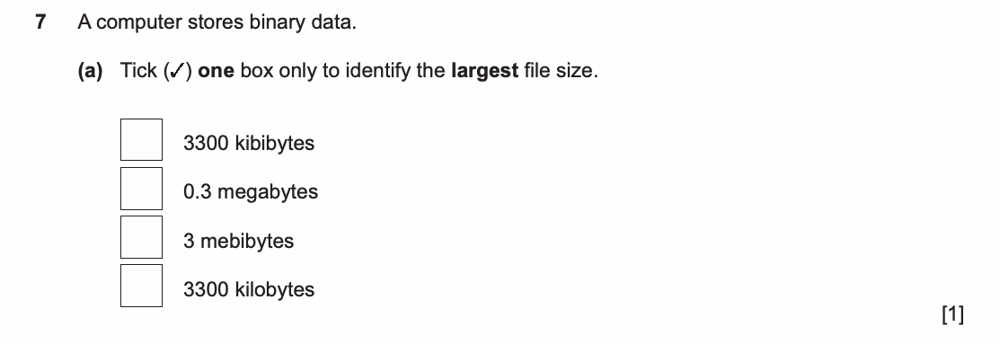

<details><summary>Reading the question — teacher guidance</summary>

You must identify the **largest file size**, not the largest written number. The instruction allows **one tick only**. Compare all four values using the same unit before selecting a box.

</details>

<details><summary>Solution — teacher explanation</summary>

| Option | Equivalent bytes |
|---|---:|
| 3300 kibibytes | 3300 × 1024 = 3,379,200 |
| 0.3 megabytes | 0.3 × 1,000,000 = 300,000 |
| 3 mebibytes | 3 × 1,048,576 = 3,145,728 |
| 3300 kilobytes | 3300 × 1000 = 3,300,000 |

Tick **3300 kibibytes** only. The table explains the comparison; it is not an additional examination requirement.

</details>

<details><summary>Official mark scheme</summary>

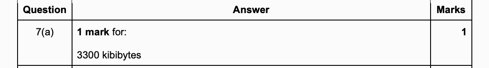

</details>

<details><summary>Why this earns marks and common mistakes — teacher analysis</summary>

This item awards one mark for the correct selection. It does not allocate a separate working mark. A conversion explanation cannot justify adding extra marks to this question.

Selecting 3 mebibytes just because “mebi is bigger than kibi” ignores the quantities. Selecting both 3300 options ignores the single-choice instruction. Put them in bytes and make one final choice.

</details>

## 2. Lesson 005 — Bitmap calculation within a richer graphics lesson

**配置说明（工作材料）**：Practice P1、P4–P8，共6任务/6单元/22教师分，23–28分钟；真题两组共2大题/3子问/7分，12–16分钟。本样稿完整展示其中9618/12 O/N/2023 Q6(c)；另一组是9618/12 M/J/2024 Q2(d)(i–ii)，见登记册。此处不能用一道计算代替本课向量重建、分辨率和header的理解检查。

### Practice — retained understanding check

Calculate the complete size of a 40 × 20 bitmap at 4 bits per pixel with a 24-byte header and no other overhead. Repeat at 8 bits per pixel. Explain why the whole file does not exactly double.

<details><summary>Teacher answer</summary>

At 4 bits per pixel: 40 × 20 × 4 ÷ 8 + 24 = **424 bytes**.

At 8 bits per pixel: 40 × 20 × 8 ÷ 8 + 24 = **824 bytes**.

Only the pixel data doubles. The stated header remains 24 bytes, so 824 is less than 2 × 424 = 848 bytes.

</details>

### Past-paper questions and exam technique

**Original question — Cambridge 9618/12, October/November 2023, Question 6(c), [2].** QP p9; MS p7. This subpart supplies its own bitmap conditions and does not depend on 6(a–b).

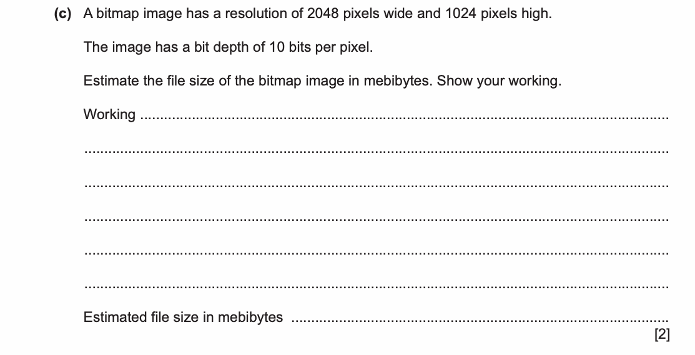

<details><summary>Reading the question — teacher guidance</summary>

The dimensions give the number of pixels. Bit depth gives **bits per pixel**. The requested result is in **mebibytes**, and the question explicitly asks for working. It gives no header size; use the stated pixel data for this estimate.

</details>

<details><summary>Solution — teacher working</summary>

Pixels = 2048 × 1024 = 2,097,152.

Pixel data = 2,097,152 × 10 = 20,971,520 bits.

Bytes = 20,971,520 ÷ 8 = 2,621,440 bytes.

Mebibytes = 2,621,440 ÷ (1024 × 1024) = **2.5 MiB**.

An equally clear compact working line is:

\[
\frac{2048\times1024\times10}{8\times1024\times1024}=2.5\text{ MiB}
\]

</details>

<details><summary>Official mark scheme</summary>

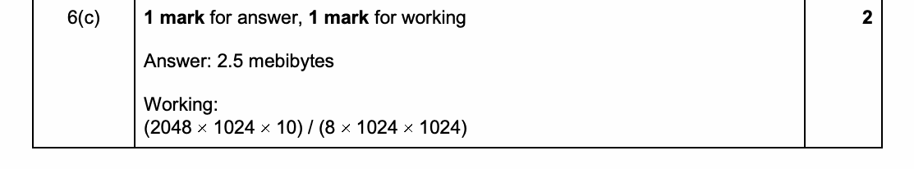

</details>

<details><summary>Why this earns marks and common mistakes — teacher analysis</summary>

The official allocation is **one mark for working and one for the answer**. The calculation visibly includes both the bit-to-byte conversion and the binary prefix conversion. The four teaching steps do not create four official marks.

Dividing by 1,000,000 produces MB, not MiB. Omitting division by 8 leaves a bit quantity. Writing a numerical answer without working omits evidence requested by the question. Do not add an invented header size to this estimate.

</details>

## 3. Lesson 025 — A short matching question with grouped marks

**配置说明（工作材料）**：Practice P2、P4负责符号表建立与重复/缺失标签诊断；真题1大题/1子问/3分，4–6分钟，新增“one or more”和分组评分的审题训练。

### Past-paper questions and exam technique

**Original question — Cambridge 9618/12, May/June 2023, Question 3(a), [3].** QP p8; MS p6. Selected subpart: 3(a) only.

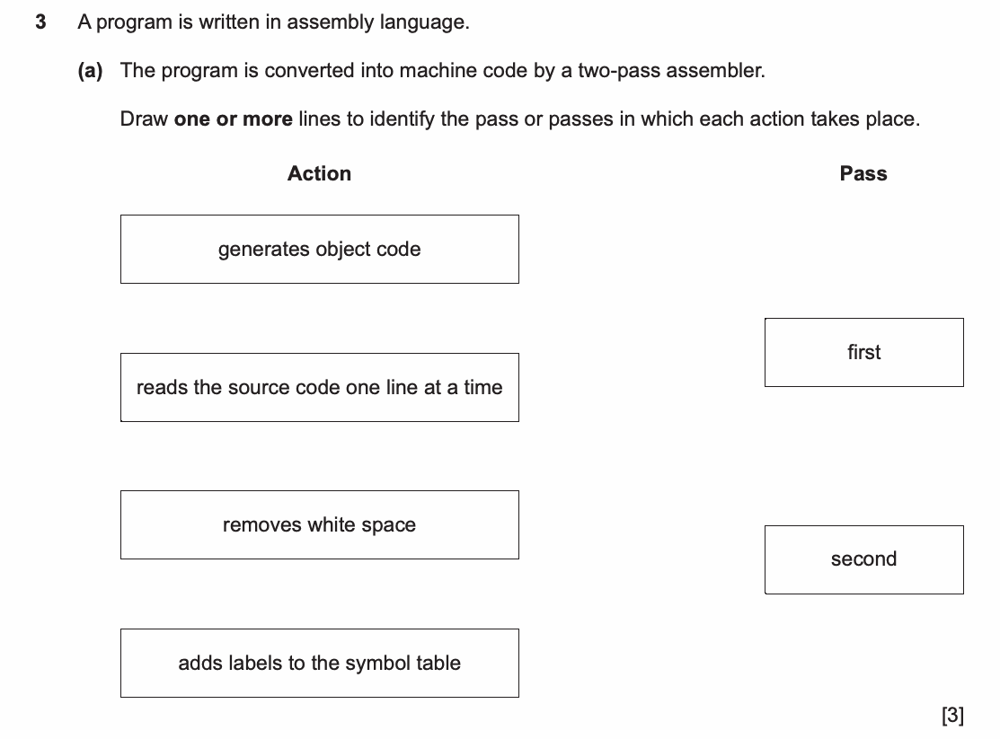

<details><summary>Reading the question — teacher guidance</summary>

“One or more” permits an action to belong to both passes. You are matching actions to passes, so do not turn the answer into four unrelated definitions. Read every action before drawing the lines.

</details>

<details><summary>Solution — teacher explanation</summary>

| Action | Connection(s) |
|---|---|
| generates object code | second |
| reads the source code one line at a time | first **and** second |
| removes white space | first |
| adds labels to the symbol table | first |

The first pass establishes the information needed to resolve labels. The second can generate object code using that information. Reading source lines is needed in both passes in the model used by this question. The completed answer therefore contains **five lines**, although the question is worth three marks.

</details>

<details><summary>Official mark scheme</summary>

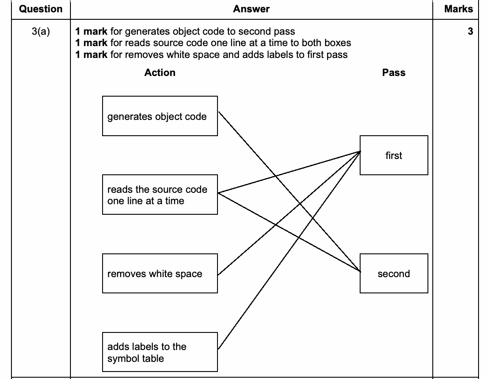

</details>

<details><summary>Why this earns marks and common mistakes — teacher analysis</summary>

The three scoring groups are:

1. Object-code generation connected to the second pass.
2. Reading source code connected to **both** passes.
3. **Both** whitespace removal and adding labels connected to the first pass.

Connecting only whitespace correctly does not satisfy the third group. Nor does one correct reading connection satisfy the second group. Do not invent “one mark per line” or limit yourself to three lines because the item carries three marks.

This is an examination matching model. A different assembler implementation is not a reason to silently alter this official question or its marking diagram.

</details>

## 4. Lesson 028 — Explain two OS tasks under a shared cap

**配置说明（工作材料）**：Practice P2–P6，5任务/5单元/12教师分，16–21分钟；真题1大题/1子问/4分，6–8分钟。Practice仍覆盖文件、权限、驱动，真题专教memory/process如何支持multi-tasking。

### Past-paper questions and exam technique

**Original question — Cambridge 9618/12, May/June 2024, Question 6, [4].** QP p13; MS p9.

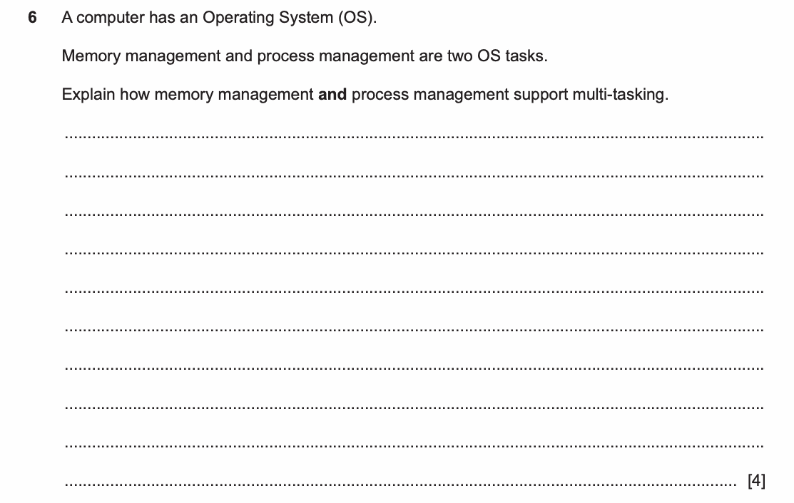

<details><summary>Reading the question — teacher guidance</summary>

The two task names are already supplied. “Explain how” calls for what each task does and how this enables several programs to make progress. Keep memory and processor time separate. Use two short paragraphs so that each part of the question receives attention.

</details>

<details><summary>One model answer — teacher-written</summary>

**Memory management:** The OS keeps the data of several running programs in RAM at the same time. It protects their allocated areas so that one program does not overwrite another program's data.

**Process management:** The OS can pause one process while another runs. It switches processor use between processes so that they share the processor and can make progress.

</details>

<details><summary>Official mark scheme</summary>

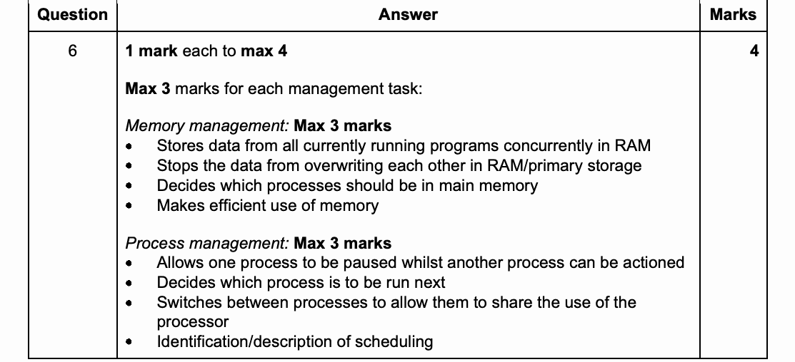

</details>

<details><summary>Why this earns marks — teacher explanation</summary>

| Evidence in the model answer | Corresponding official content |
|---|---|
| Data from several running programs held concurrently in RAM | Concurrent storage in RAM |
| Allocated areas protected against overwriting | Data prevented from overwriting other data |
| One process paused while another runs | Pausing one process so another can be actioned |
| Switching processor use between processes | Sharing the processor through switching |

This supplies two distinct points from each group. The maximum is **4 overall**, with **at most 3 from either management task**. Four memory points alone cannot earn all four marks. Listing every alternative in the official scheme cannot raise the total above four.

</details>

<details><summary>Common mistakes — teacher analysis</summary>

“Memory management manages memory” repeats the name without explaining a mechanism. Add what is stored, how it is protected, and why several programs can coexist.

“Both programs execute every instruction simultaneously on one core” confuses progress through scheduling with literal simultaneous execution. Explain the pauses and switches instead.

</details>

## 5. Lesson 047 — Build a two-table aggregate query

**配置说明（工作材料）**：Practice 8任务/8单元/23教师分，30–40分钟；真题2大题/2子问/7分，16–22分钟。本样稿完整处理4分查询；另一个真实UPDATE题增加写入与WHERE目标选择，不重复聚合查询。

### Past-paper questions and exam technique

**Original question — Cambridge 9618/13, May/June 2024, Question 4(c), [4].** QP pp8–9; MS p5. The following original material supplies the shared context and the sample data from 4(b). Only **4(c)** is assigned; the relationship and CREATE TABLE tasks in 4(a–b) are not assigned here.

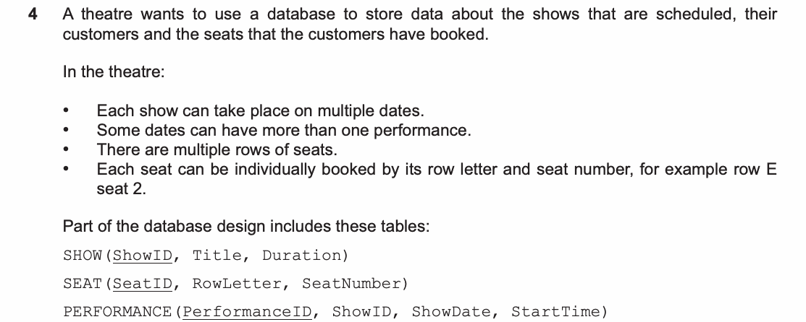

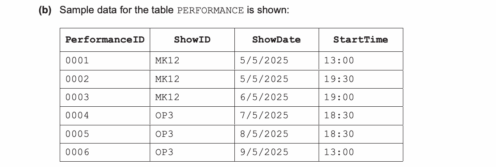

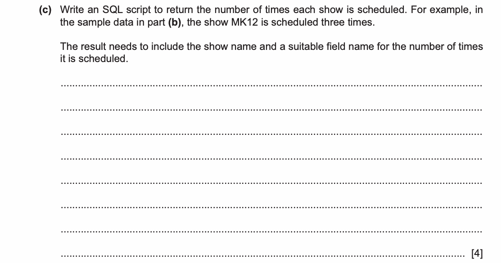

<details><summary>Reading the question — teacher guidance</summary>

The requested row identifies a show **by name** and gives a **count of performances**, with a meaningful column name for that count.

`PERFORMANCE` records the scheduled occurrences; `SHOW` supplies `Title`. They share `ShowID`. The `SEAT` table is supplied as part of the database but is not needed for this result. One performance row represents one scheduled occurrence, even when two occur on the same date.

</details>

<details><summary>Solution — teacher-written model query and reasoning</summary>

```sql
SELECT SHOW.Title,
       COUNT(PERFORMANCE.PerformanceID) AS NumberOfShowings
FROM PERFORMANCE INNER JOIN SHOW
ON PERFORMANCE.ShowID = SHOW.ShowID
GROUP BY SHOW.Title;
```

1. Read each performance and match it to its show using `ShowID`.
2. Collect the matched rows into groups by `Title`, following the grouping used by this question's official scheme.
3. Count the performance identifiers in each group.
4. Display the title beside its count; `AS NumberOfShowings` names the calculated column.

In the supplied PERFORMANCE data, MK12 has three occurrences and OP3 has three. The original data does **not** supply their actual title strings, so we can verify those counts but should not invent show names as if they were given in the paper.

The official scheme also gives a comma-separated `FROM` with a matching `WHERE` condition. It is an alternative way to express this same inner join for this question.

</details>

<details><summary>Official mark scheme</summary>

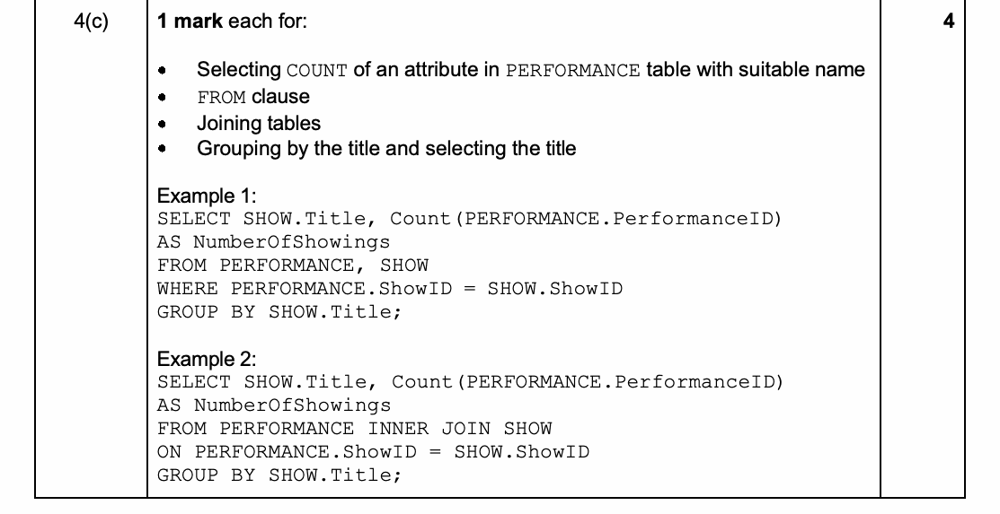

</details>

<details><summary>Why this earns marks — teacher explanation</summary>

| Part of the query | Official requirement it addresses |
|---|---|
| `COUNT(PERFORMANCE.PerformanceID) AS NumberOfShowings` | Count an attribute in PERFORMANCE and give the count a suitable name |
| `FROM PERFORMANCE INNER JOIN SHOW` | FROM clause using the required tables |
| `ON PERFORMANCE.ShowID = SHOW.ShowID` | Join the tables |
| `SHOW.Title` in SELECT and GROUP BY | Group by the title and select that title |

These are four official points, not one point for each SQL line or keyword. The last point includes both selecting and grouping by the title. An alias without the count does not complete the first point.

</details>

<details><summary>Common mistakes — teacher analysis</summary>

- Selecting only `ShowID` omits the requested show name.
- `COUNT(*)` over the entire table without grouping gives one overall count, not a row per title.
- Joining without the key condition pairs each performance with unrelated shows and can inflate counts.
- Grouping by `ShowDate` answers a different question; the two MK12 performances on 5/5/2025 must both count.
- Adding SEAT has no role here and can multiply rows unless its relationship is correctly constrained.

The official query groups by title. In a different database where separate shows can share a title, a designer would also consider stable show identifiers. That is a design extension, not a hidden change to this original question's marking rule.

</details>

## 6. Lesson 068 — Circular queue, two independently specified states

**配置说明（工作材料）**：Practice P2–P4，3任务/3单元/9教师分，13–18分钟；真题1大题/2子问/5分，8–11分钟。Practice检查回绕、修改和空后再用；真题强调pointer定义、状态重读及5个候选点最高4分。

### Past-paper questions and exam technique

**Original question — Cambridge 9618/22, May/June 2023, Questions 3(a)(i–ii), [4]+[1].** QP pp4–5; MS p4. Only these two subparts are assigned. The file-handling task in 3(b) is not required.

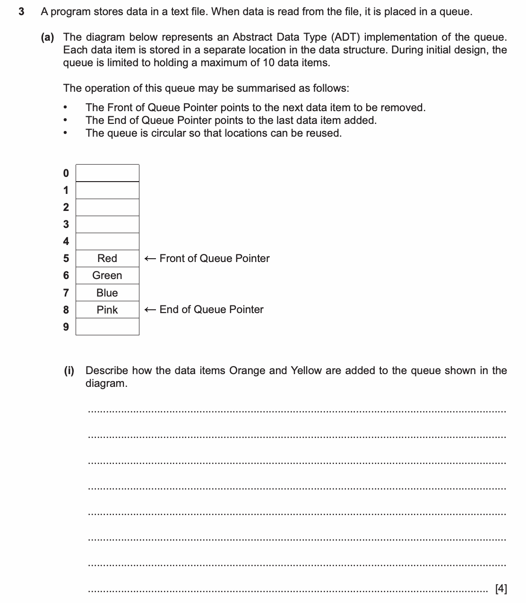

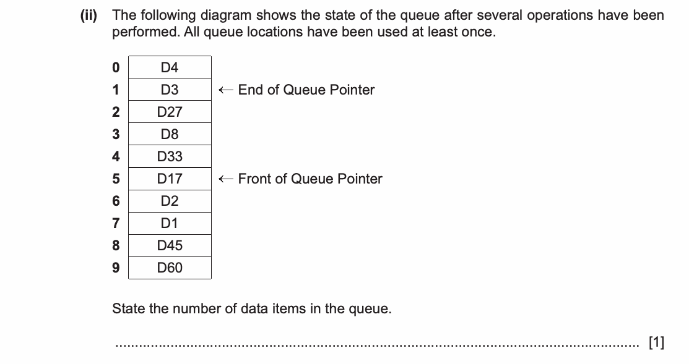

<details><summary>Reading the question — teacher guidance</summary>

Read this paper's pointer definitions: Front identifies the next item to remove; End identifies the **last item added**, not the next free position. Indices run from 0 to 9.

Part (i) asks you to describe adding two items to its diagram. Part (ii) supplies a new diagram after several operations: use **that** diagram to count the current items. Previously used cells can still display old values.

</details>

<details><summary>Solution — teacher-written steps and trace</summary>

**(i)** Check that the queue is not full. Advance End from 8 to 9 and store Orange in the location it points to. Before the next addition, ensure space remains. Advance End from 9 to 0, wrapping to the start of the array, and store Yellow there. Front remains at 5 because no item has been removed.

| Stage | Front | End | Occupied locations in queue order |
|---|---:|---:|---|
| Given state | 5 | 8 | 5 Red, 6 Green, 7 Blue, 8 Pink |
| Add Orange | 5 | 9 | 5 Red, 6 Green, 7 Blue, 8 Pink, 9 Orange |
| Add Yellow | 5 | 0 | 5 Red, 6 Green, 7 Blue, 8 Pink, 9 Orange, 0 Yellow |

**(ii)** Start again from its given Front = 5 and End = 1. The active indices are:

`5 → 6 → 7 → 8 → 9 → 0 → 1`

There are **7 data items**. Values still displayed at indices 2, 3 and 4 are outside the active queue.

</details>

<details><summary>Official mark scheme</summary>

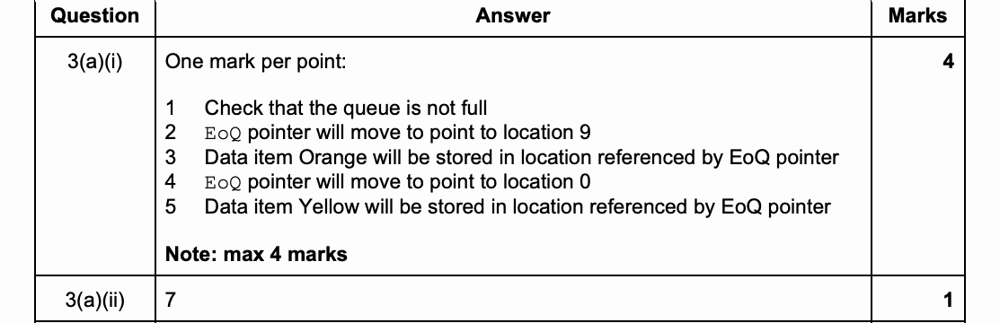

</details>

<details><summary>Why this earns marks and common mistakes — teacher analysis</summary>

Part (i) lists five possible points, with a **maximum of 4**: capacity check, End to 9, Orange stored using End, End to 0, Yellow stored using End. Our complete explanation addresses all five, but still earns no more than four marks. The trace supports understanding; it does not add marks outside this rule.

Part (ii) has its own one mark for 7. Answering 6 carries the final state from part (i) into a different diagram. Answering 10 counts non-empty-looking cells rather than following the live queue. Follow the supplied pointers and count both endpoints.

</details>

## 7. Lesson 081 — A complete case-sensitive counting function

**配置说明（工作材料）**：Practice P2–P5，4任务/4单元/11教师分，17–23分钟；真题1大题/1子问/6分，12–17分钟。Practice查返回值、提前返回、无参数接口；真题独立构造完整函数并核对循环内外依赖。

### Past-paper questions and exam technique

**Original question — Cambridge 9618/22, May/June 2023, Question 4, [6].** QP p6; MS p5. Relevant original insert, p2, follows the question; its string/character conventions and function definitions are part of the supplied resources.

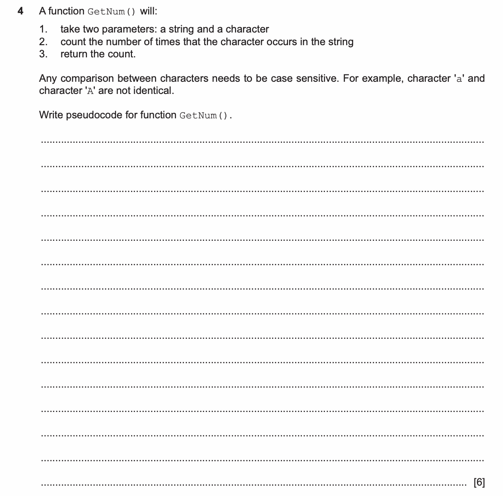

**Original insert excerpt — 9618/22/M/J/23, p2:**

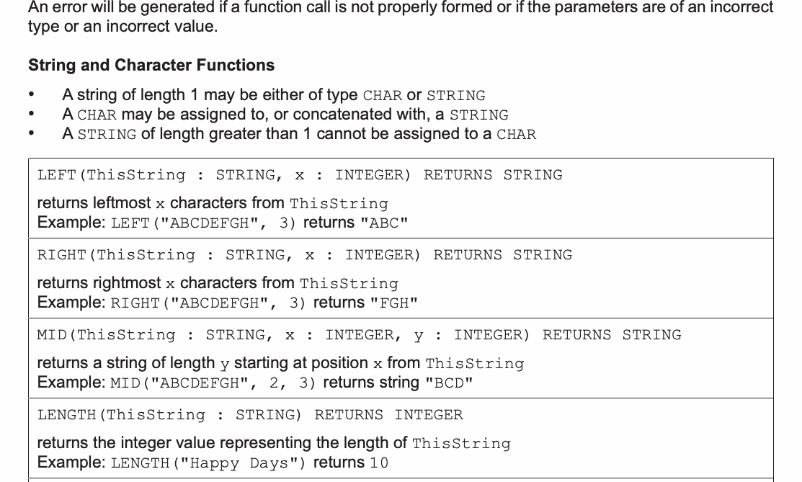

<details><summary>Reading the question — teacher guidance</summary>

Write a **function** with two parameters and an integer result. The caller supplies the text and character: the function does not need keyboard input. “Case sensitive” means that `'a'` and `'A'` are different.

The required answer counts all matches. Stopping at the first match would solve a search problem, not this counting problem. Use the supplied `MID` and `LENGTH` contracts; string positions start at 1.

</details>

<details><summary>Solution — teacher-written model answer</summary>

```text
FUNCTION GetNum(ThisString : STRING, ThisChar : CHAR) RETURNS INTEGER
    DECLARE Index, Count : INTEGER
    Count ← 0
    FOR Index ← 1 TO LENGTH(ThisString)
        IF MID(ThisString, Index, 1) = ThisChar THEN
            Count ← Count + 1
        ENDIF
    NEXT Index
    RETURN Count
ENDFUNCTION
```

Before the loop, Count is zero. Each iteration examines exactly one character. A match adds one; a non-match leaves Count unchanged. After the loop, Count equals the total number of matches, so it can be returned.

**Teacher test example, not original question data:** `GetNum("aBAa", 'a')`.

| Index | Character | Match? | Count after comparison |
|---:|---|---|---:|
| Initial | — | — | 0 |
| 1 | a | yes | 1 |
| 2 | B | no | 1 |
| 3 | A | no | 1 |
| 4 | a | yes | 2 |

Return 2 after the fourth iteration.

Additional teacher checks: `GetNum("", 'a') = 0`; `GetNum("aaaa", 'a') = 4`; `GetNum("BBBB", 'a') = 0`; `GetNum("A", 'a') = 0`. Under the current guide's FOR rules, the empty-string case runs zero iterations and returns the initial zero.

</details>

<details><summary>Official mark scheme</summary>

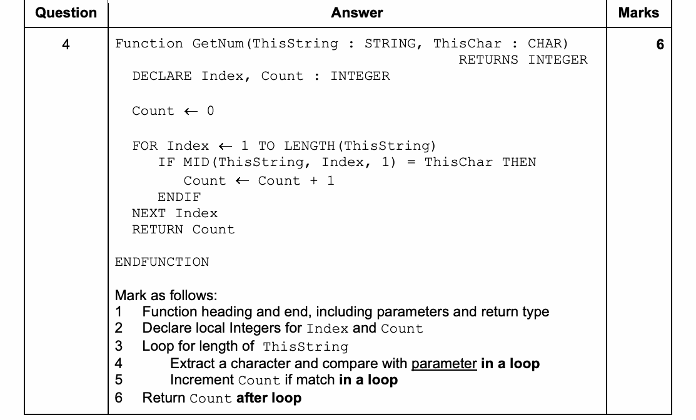

</details>

<details><summary>Why this earns marks — teacher explanation</summary>

| Official numbered point | Evidence in this answer |
|---|---|
| 1 | Function header/end, both typed parameters and INTEGER result |
| 2 | Local INTEGER variables Index and Count |
| 3 | Loop covers the length of ThisString |
| 4 | Inside the loop, extract a character and compare it with ThisChar |
| 5 | Inside the loop, increment Count only for a match |
| 6 | Return Count after the loop |

The phrases **in a loop**, **if match**, and **after loop** are actual conditions in this mark scheme. Mentioning the right keywords in the wrong places is insufficient.

Initialising Count is necessary for a valid answer. The official list does not allocate it a separate seventh mark. Do not invent an extra point, a method/accuracy split, or a follow-through rule.

</details>

<details><summary>Common mistakes — teacher analysis</summary>

- `RETURN Count` inside the loop exits on the first iteration. Move it after `NEXT Index` so all characters are checked.
- Resetting Count inside the loop forgets earlier matches. Initialise once before traversal.
- Converting both values to uppercase makes the comparison case insensitive and breaks the specification.
- Starting at index 0 conflicts with the supplied MID contract.
- Outputting Count without returning it does not provide the result required by the calling expression.

</details>

---

**工作材料说明**：所有“Common mistakes”均为教师分析，没有声称引用examiner report。以上教师计算、SQL及函数边界检查的执行记录见验证报告；正式实施仍需逐题校验转录文本、可访问性、折叠状态、移动端/打印版以及其余入选题的教学答案。
