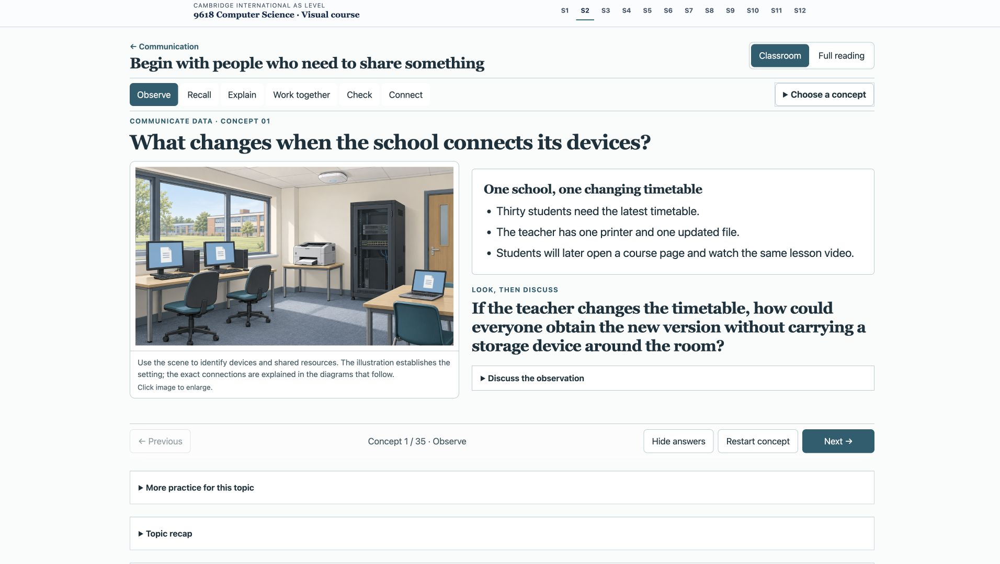
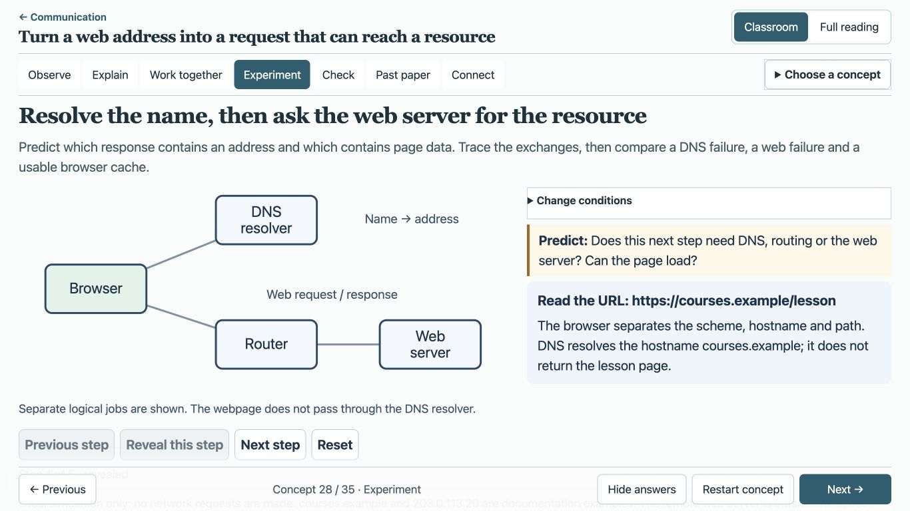

# Section 2 初学者课堂改版验收

日期：2026-09-30。此文档用于教师审查；学生页面全部使用英文。

## 完成范围

- 保留 Lessons 007–014 的八个课程地址及 31 个原知识单元书签，按先修关系重新组织为 35 个概念，覆盖原有 59 个课程目标。
- 学校共享资源 → 物理载体 → 本地连接 → 外部网络 → 地址与路由 → DNS/云服务 → 视频播放，形成 7 个模块。提供 29 个建议课次，每次 45 分钟；可根据理解检查重复或延长，不设置总课时上限。
- 每个概念依次提供具体材料、观察问题、必要回顾、逐步解释、完整示例、独立理解检查和概念连接；适合实验的内容增加预测与单步实验。原题放在所需知识学完之后。
- Classroom 默认每次显示一个概念/阶段/解释步骤；Full reading 展示同一份完整内容，支持跨页保持阅读模式及从当前阅读位置恢复授课。
- 8 类本地实验，共 18 处实例。支持条件变化、预测揭示、逐步前进、重置；输入变化时隐藏上一轮结果。
- 新增 1 张 Codex 内置 ImageGen 生成的学校情境图，结合既有精确 SVG、表格和可操作模型。生成记录和 SHA-256 见 [图像清单](../scripts/course-v3-section2-classroom-images.json)。情境图用于认物，连接机制由精确图解和实验说明。
- 保留 10 组原题，补充 5 组，共 15 组、20 小问、60 分。提示、教师推理、官方评分方案分别折叠。来源、裁图、哈希及局部覆盖限制见 [来源审查](section-2-source-review.md)。

## 教学模块

| 模块 | 主线 | 概念数 | 建议课次 |
| --- | --- | ---: | --- |
| 1 | A school needs to share resources | 4 | 1–3 |
| 2 | Choose how signals travel | 5 | 4–6 |
| 3 | Build and test the local path | 7 | 7–13 |
| 4 | Connect the school to wider networks | 5 | 14–16 |
| 5 | Address interfaces and cross network boundaries | 5 | 17–21 |
| 6 | Open a resource and use a cloud service | 5 | 22–25 |
| 7 | Keep the lesson video playing | 4 | 26–29 |

完整课次标题和学习链接在 [Section 2 入口](../web/course-v3/section-2/index.html)。原课程中的 S2.xx.Axx 是教学目标标签，不是 Cambridge 官方条目编号；配题只抽样考查，不能据此推定全部目标已掌握。

## 目标、素材和练习位置

每一行均有逐步讲解、完整示例和教师编写的独立理解检查。表中“原题”指教学阶段中安排的原题组；具体直接考查范围必须同时参考来源审查。

| 顺序 | 概念及页面 | 课程目标 | 素材形式 | 原题或检查 |
| --- | --- | --- | --- | --- |
| 1 | [What changes when the school connects its devices?](../web/course-v3/lesson-007/index.html#network-purpose--observe) | S2.01.A01 | 情境材料；图解 | 理解检查；本概念无直接配题 |
| 2 | [Distinguish a local site from links between distant sites](../web/course-v3/lesson-007/index.html#lan-wan--observe) | S2.01.A02, S2.01.A03 | 情境材料 | E2D01 |
| 3 | [Follow a request to the computer that supplies the service](../web/course-v3/lesson-007/index.html#service-models--observe) | S2.02.A01, S2.02.A02, S2.02.A03 | 情境材料；network 交互实验 | E011 |
| 4 | [Locate the processing, software and working data](../web/course-v3/lesson-007/index.html#client-processing--observe) | S2.03.A01, S2.03.A02, S2.03.A03 | 对照表 | E012 |
| 5 | [Carry the same bits using electrical signals or light](../web/course-v3/lesson-010/index.html#copper-fibre--observe) | S2.07.A01, S2.08.A01, S2.08.A02 | 情境材料；图解；media 交互实验 | 理解检查；本概念无直接配题 |
| 6 | [Connect a moving device through radio coverage](../web/course-v3/lesson-010/index.html#wireless-wifi--observe) | S2.07.A01, S2.08.A03 | 情境材料；media 交互实验 | 理解检查；本概念无直接配题 |
| 7 | [Join two fixed locations with a directional radio path](../web/course-v3/lesson-010/index.html#microwave-links--observe) | S2.08.A04 | 情境材料；media 交互实验 | 理解检查；本概念无直接配题 |
| 8 | [Follow the uplink, relay and downlink](../web/course-v3/lesson-010/index.html#satellite-links--observe) | S2.08.A05 | 情境材料；media 交互实验 | 理解检查；本概念无直接配题 |
| 9 | [Justify the carrier from movement, distance and environment](../web/course-v3/lesson-010/index.html#choose-media--observe) | S2.08.A06 | 对照表；media 交互实验 | E015 |
| 10 | [Connect a computer to its first network link](../web/course-v3/lesson-011/index.html#lan-interfaces--observe) | S2.09.A02, S2.09.A03 | 情境材料 | 理解检查；本概念无直接配题 |
| 11 | [Separate forwarding a frame from answering its request](../web/course-v3/lesson-011/index.html#switch-server--observe) | S2.09.A01 | 对照表；图解 | 理解检查；本概念无直接配题 |
| 12 | [Separate segment filtering from signal regeneration](../web/course-v3/lesson-011/index.html#bridge-repeater--observe) | S2.09.A04 | 情境材料；图解 | 理解检查；本概念无直接配题 |
| 13 | [Follow each physical link from sender to receiver](../web/course-v3/lesson-008/index.html#topology-paths--observe) | S2.04.A01, S2.04.A02, S2.04.A03, S2.04.A04, S2.05.A01 | 情境材料；图解；topology 交互实验 | E013 |
| 14 | [Distinguish a failed host link from a failed centre](../web/course-v3/lesson-008/index.html#topology-failure--observe) | S2.05.A02, S2.05.A03 | 情境材料；图解；topology 交互实验 | E2D02 |
| 15 | [Package data for an Ethernet link](../web/course-v3/lesson-011/index.html#ethernet-frames--observe) | S2.11.A01 | 情境材料；ethernet 交互实验 | 理解检查；本概念无直接配题 |
| 16 | [Listen, detect a collision, stop and retry after a random delay](../web/course-v3/lesson-011/index.html#collision-recovery--observe) | S2.11.A01, S2.11.A02, S2.11.A03 | 情境材料；图解；ethernet 交互实验 | E016, E017 |
| 17 | [Distinguish the network from a service that uses it](../web/course-v3/lesson-013/index.html#internet-www--observe) | S2.13.A01, S2.13.A02, S2.13.A03 | 情境材料 | 理解检查；本概念无直接配题 |
| 18 | [Match data to the signal form required by an access link](../web/course-v3/lesson-013/index.html#modem-signals--observe) | S2.14.A01 | 情境材料 | 理解检查；本概念无直接配题 |
| 19 | [Trace communication through the public switched telephone network](../web/course-v3/lesson-013/index.html#pstn-links--observe) | S2.14.A02 | 情境材料；图解 | E019 |
| 20 | [Compare a reserved connection with ordinary shared access](../web/course-v3/lesson-013/index.html#dedicated-links--observe) | S2.14.A03, S2.14.A05 | 情境材料 | 理解检查；本概念无直接配题 |
| 21 | [Connect a moving phone through cells and base stations](../web/course-v3/lesson-013/index.html#cellular-links--observe) | S2.14.A04, S2.14.A05 | 情境材料；图解 | E2D04 |
| 22 | [Associate an IP address with an interface](../web/course-v3/lesson-014/index.html#ip-formats--observe) | S2.15.A01, S2.15.A02, S2.15.A03 | 对照表；addressing 交互实验 | 理解检查；本概念无直接配题 |
| 23 | [Compare the network prefix before choosing local delivery](../web/course-v3/lesson-014/index.html#subnets--observe) | S2.15.A04 | 情境材料；图解；addressing 交互实验 | 理解检查；本概念无直接配题 |
| 24 | [Separate address reachability from permission and protection](../web/course-v3/lesson-014/index.html#public-private--observe) | S2.15.A05 | 情境材料；图解 | 理解检查；本概念无直接配题 |
| 25 | [Send a packet towards another network](../web/course-v3/lesson-011/index.html#router-boundaries--observe) | S2.10.A01, S2.10.A02 | 情境材料 | E2D03 |
| 26 | [Keep assignment lifetime separate from public or private scope](../web/course-v3/lesson-014/index.html#static-dynamic--observe) | S2.15.A06 | 对照表；addressing 交互实验 | E020 |
| 27 | [Separate the communication scheme, domain and resource path](../web/course-v3/lesson-014/index.html#url-parts--observe) | S2.16.A01 | 情境材料 | 理解检查；本概念无直接配题 |
| 28 | [Resolve the name, then ask the web server for the resource](../web/course-v3/lesson-014/index.html#dns-delivery--observe) | S2.16.A02, S2.16.A03 | 情境材料；图解；dns 交互实验 | E2D05 |
| 29 | [Trace a school task into remotely supplied resources](../web/course-v3/lesson-009/index.html#cloud-resources--observe) | S2.06.A01 | 情境材料 | 理解检查；本概念无直接配题 |
| 30 | [Distinguish public infrastructure from a private document](../web/course-v3/lesson-009/index.html#cloud-models--observe) | S2.06.A02 | 对照表；cloud 交互实验 | 理解检查；本概念无直接配题 |
| 31 | [Balance access and capacity against specific dependencies](../web/course-v3/lesson-009/index.html#cloud-choice--observe) | S2.06.A03, S2.06.A04 | 情境材料；cloud 交互实验 | E014 |
| 32 | [Play arriving media before the complete recording is available](../web/course-v3/lesson-012/index.html#streaming-methods--observe) | S2.12.A01, S2.12.A02 | 情境材料 | 理解检查；本概念无直接配题 |
| 33 | [Compare two rates using the same units](../web/course-v3/lesson-012/index.html#bit-rates--observe) | S2.12.A03 | 情境材料 | 理解检查；本概念无直接配题 |
| 34 | [Track what is stored, not just whether the connection is fast](../web/course-v3/lesson-012/index.html#buffer-change--observe) | S2.12.A04, S2.12.A05 | 对照表；图解；streaming 交互实验 | 理解检查；本概念无直接配题 |
| 35 | [Explain why a finite buffer cannot solve a permanent deficit](../web/course-v3/lesson-012/index.html#streaming-adaptation--observe) | S2.12.A05, S2.12.A06 | 情境材料；streaming 交互实验 | E018 |

## 已执行的验证

- 目标和模型测试：58 项通过，0 失败、0 跳过。包括 59 个目标、31 个知识单元、35 概念路线、课次先修顺序、真题位置、46 张裁图及 22 份原始 PDF 哈希；26 项模型测试包含子网、缓冲、DNS、碰撞等分支。
- 浏览器实际走完 35 个概念的 Next concept 路线，顺序一致，末尾禁用 Section complete；方向键可前进/后退。
- 八个课程页面已检查 1366×768、1920×1080 和 390×844 布局。窄屏 Full reading 中发现的长 URL/IPv6 和图文网格最小宽度问题已修正；复测八页均无页面横向溢出，表格与图解保留组件内滚动。
- 已操作网络服务、拓扑、传输介质、Ethernet、流媒体、地址、DNS、云服务八类实验；检验逐步揭示、重置及条件应用。
- 关键浏览器分支：专用服务器故障；星形链路断开与 mesh 备用路径；相同随机退避和专用全双工；缓存命中与未命中的 DNS 故障；公网中断时的校内私有云；/26 下本地与异网目的地址及切换 /24；持续 3/4 Mbit/s 的视频缓冲不足。
- 输入纠错：启动阈值低于一秒播放量时显示明确错误；修正后可重新预测与前进。Full reading 中两个实验实例互不改变对方进度。
- 桌面课堂实验采用双栏，图和步进按钮在左，条件、预测和反馈在右。1366×768 下通过实际屏幕点击验证 DNS 的完整图、解释和操作按钮同屏，揭示后不跳动；模型限制在实验底部保留。未缩小正文和按钮字号。
- 旧 unit-2、E011 书签均实际跳到对应内容；原题裁图、官方答案和图像放大已打开验证。Hide answers 会关闭官方答案；阅读模式跨页保持，Teach from this point 恢复单概念授课。
- 验证过程中没有浏览器控制台警告或错误。页面载入前曾缓存旧 HTML，刷新后使用新内容。
- 按开始时文件哈希基线检查改动范围，未删除文件；其他章节内容及其课程 contract 项保持不变。

复现命令：

```sh
node scripts/render-course-v3.mjs --section2
node --test scripts/course-v3-section2-classroom.test.mjs scripts/course-v3-section2-models.test.cjs
```

## 现场验收边界

未连接实际教室智能大屏，未实测 HDMI、触摸硬件、教室观看距离或真实学生教学效果。浏览器尺寸检查不能代替这些现场条件。未推送、部署或生成新的离线发布包。

## 截图

1920×1080 课堂观察阶段：



1366×768 DNS 实验揭示后的课堂状态：


