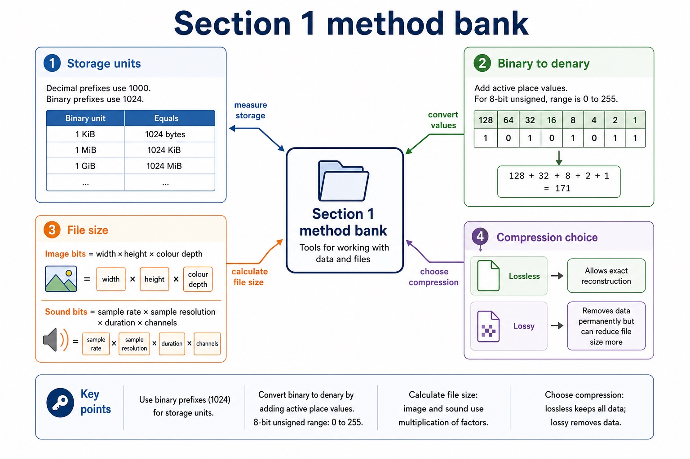

# Lesson 001: Binary data units and magnitude prefixes

**Course:** Cambridge International AS Level Computer Science 9618, 2027-2029 Version 2 
**Paper:** Paper 1 
**Syllabus:** Section 1: Information representation 
**Syllabus requirements:** S1.01 
**Pacing:** Flexible. This lesson is deliberately over-complete; select a quick, full or deep route for the learners in front of you.

## Teaching-depth menu

- **Quick route:** Use the diagnostic, learning objectives, first worked example and foundation question. Stop once the learner can explain the central distinction accurately.
- **Full route:** Teach every core explanation point, the worked example and all lesson questions. Use the visual only when it adds a different representation.
- **Deep route:** Add the prerequisite refresher, ask learners to connect the concept checklist, discuss the labelled extension and complete a transfer question without a model answer.

## 1. Prerequisite knowledge and quick diagnostic

Check that you can use place value and distinguish a value from the way it is represented.

Ask the learner to give one accurate definition or method step before continuing. If they cannot, briefly revisit the named prerequisite rather than repeating the whole previous lesson.

## 2. Knowledge explanation

### Learning objectives

- Show understanding of binary magnitudes and the difference between binary prefixes and decimal prefixes.

### Concept checklist for teacher choice

- binary prefixes
- decimal prefixes
- kibi / KiB
- kilo / kB
- mebi / MiB
- mega / MB
- gibi / GiB
- giga / GB
- tebi / TiB
- tera / TB

### Detailed explanation

- Use and distinguish kibi/kilo, mebi/mega, gibi/giga and tebi/tera; binary prefixes use powers of 1024 and decimal prefixes use powers of 1000.
- Binary prefixes use powers of 1024: kibi (Ki) means 2^10, mebi (Mi) means 2^20, gibi (Gi) means 2^30 and tebi (Ti) means 2^40. Therefore 1 KiB = 1024 bytes, 1 MiB = 2^20 bytes, 1 GiB = 2^30 bytes and 1 TiB = 2^40 bytes.
- Decimal prefixes use powers of 1000: kilo (k) means 10^3, mega (M) means 10^6, giga (G) means 10^9 and tera (T) means 10^12. Therefore 1 kB = 1000 bytes, 1 MB = 10^6 bytes, 1 GB = 10^9 bytes and 1 TB = 10^12 bytes. Case and the i in KiB/MiB/GiB/TiB carry meaning.
- For binary data units and magnitude prefixes, identify the required concept before describing its mechanism or consequence.

### Worked example

2 TiB drive: 2 TiB = 2 x 2^40 = 2,199,023,255,552 bytes. A 2 TB drive is 2,000,000,000,000 bytes, so the labels are not interchangeable.

Beyond syllabus / 延伸知识（不要求背诵）: real file formats also store headers and metadata, so two files with the same visible content may still have different sizes.

### Retained visual explanation

_Section 1 method bank. The image and mobile text alternative come from one maintained fact source._

## 3. Practice by question type

### Question 1 - foundation - state - 4 marks

State the number of bytes represented by 1 GiB and explain why 1 GB represents a different number of bytes.

**Answer:** 1 GiB = 2^30 bytes / 1,073,741,824 bytes; gibi uses a binary power / multiples of 1024; 1 GB = 10^9 bytes / 1,000,000,000 bytes; giga uses a decimal power / multiples of 1000

**Marking guidance:** Do not accept 'GiB is bigger' without both numerical definitions.

**Common error:** For the command word state, perform that exact action; do not replace it with an unrelated fact.

### Question 2 - application - convert - 2 marks

Convert 3,000,000 bytes to MB.

**Answer:** 3 MB using the decimal prefix mega; kilo, mega, giga and tera use powers of 1000.

**Marking guidance:** Award one mark for each distinct, technically accurate point or method step.

**Common error:** Do not repeat the same point in different words; each mark needs a separate idea or method step.

### Question 3 - transfer - draw - 2 marks

Draw lines to match kibi, mebi, gibi and tebi to Ki, Mi, Gi and Ti.

**Answer:** kibi = Ki, mebi = Mi, gibi = Gi and tebi = Ti.

**Marking guidance:** Award one mark for each distinct, technically accurate point or method step.

**Common error:** Do not copy the worked example unchanged; transfer the method and check it against the new context.

### Related past-paper indexes

| Reference | Marks | Command word | Question type |
|---|---:|---|---|
| 9618/13/S/24 Q1(a) | 4 | complete | recall |
| 9618/11/W/24 Q1(a) | 1 | state | recall |
| 9618/12/S/24 Q7(a) | 1 | identify | calculate |
| 9618/12/W/23 Q3(a) | 1 | state | recall |

These are indexes only. Cambridge question and mark-scheme wording is not reproduced.

## 4. Summary and exam reminders

### Summary

- Define binary data units and magnitude prefixes with the exact technical vocabulary expected by the syllabus.
- Use the lesson method on a fresh context and show the intermediate decision, representation or calculation.
- Match the shape of the answer to the command word and the available marks.
- Check the final answer against the scenario instead of repeating a memorised sentence.

### Common error to correct

Students often treat binary digits as decoration. Correction: every bit position has a value; if the position changes, the value changes.

### Exam technique

- Follow the command word: state gives a fact; explain links a cause to a consequence; compare covers both sides.
- Match the number of independent points or method steps to the available marks.
- For binary data units and magnitude prefixes, use the exact technical term before applying it to the scenario.
