# Lesson 002: Binary, denary and hexadecimal number systems

**Course:** Cambridge International AS Level Computer Science 9618, 2027-2029 Version 2 
**Paper:** Paper 1 
**Syllabus:** Section 1: Information representation 
**Syllabus requirements:** S1.02, S1.03 
**Pacing:** Flexible. Select the material set and practice depth needed by the learner.

## Teaching-depth menu

- **Quick route:** Use the diagnostic, learning objectives, first worked example and foundation question. Stop once the learner can explain the central distinction accurately.
- **Full route:** Use every knowledge-point material set, the worked method, the terminology check and all questions.
- **Deep route:** Add the prerequisite refresher, ask learners to connect the concept checklist, discuss the labelled extension and complete a transfer question without a model answer.

## 1. Prerequisite knowledge and quick diagnostic

Recall S1.02 before starting this lesson.

Ask the learner to give one accurate definition or method step before continuing. If they cannot, briefly revisit the named prerequisite rather than repeating the whole previous lesson.

### Optional prerequisite refresher

- The Version 2 row requires binary, denary, hexadecimal, Binary Coded Decimal (BCD), one's complement and two's complement; BCD and complements are representations rather than additional number bases.
- Show understanding of binary, denary and hexadecimal number systems, BCD, and one's- and two's-complement representations.

## 2. Knowledge explanation

### 1. Binary · Denary · Hexadecimal · BCD (S1.02)

**Concept map:** binary → denary → hexadecimal → BCD → one's-complement → two's-complement

**Three-part explanation:**

1. The Version 2 row requires binary, denary, hexadecimal, Binary Coded Decimal (BCD), one's complement and two's complement
2. Conversions apply to integer values and the binary, denary, hexadecimal, BCD, one's-complement and two's-complement representations named in the preceding Version 2 row
3. the required integer representations are binary, denary, hexadecimal, BCD, one's-complement and two's-complement

**Concrete cue:** The Version 2 row requires binary, denary, hexadecimal, Binary Coded Decimal (BCD), one's complement and two's complement; BCD and complements are representations rather than additional number bases.

#### Three ways to represent negative binary values

Text transcript

- Positive 23 in 8 bits is 00010111.
- The 8-bit sign-and-magnitude representation of -23 is 10010111.
- The 8-bit one's-complement representation of -23 is 11101000.
- The 8-bit two's-complement representation of -23 is 11101001.
- Every input, intermediate state and result must contain exactly 8 bits.

#### Question triage: choose the toolbox first

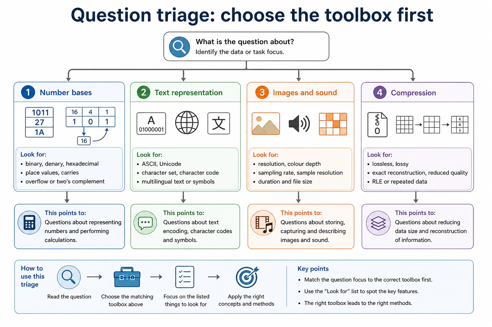

Text transcript

- Number bases
- Look for binary, denary, hexadecimal, place values, carries, overflow or two's complement.
- Text representation
- Look for ASCII, Unicode, character set, character code, multilingual text or symbols.
- Images and sound
- Look for resolution, colour depth, sampling rate, sampling resolution, duration and file size.
- Compression
- Look for lossless, lossy, exact reconstruction, reduced quality, RLE or repeated data.

#### Converting simple binary fractions

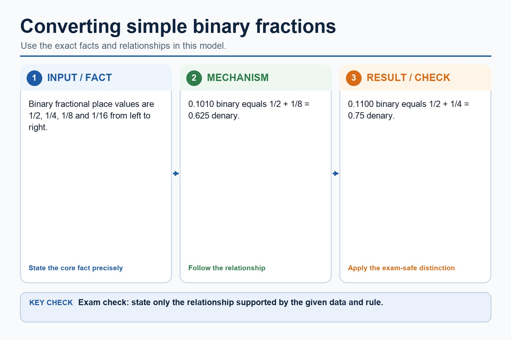

Text transcript

- Binary fractional place values are 1/2, 1/4, 1/8 and 1/16 from left to right.
- 0.1010 binary equals 1/2 + 1/8 = 0.625 denary.
- 0.1100 binary equals 1/2 + 1/4 = 0.75 denary.

#### Two’s complement method

Text transcript

- Write the positive magnitude using exactly 8 bits.
- Invert every bit, then add 1 to form the negative two's-complement value.
- For +45: 00101101 becomes 11010010 after inversion, then 11010011 after adding 1.
- The 8-bit value 11010011 represents -45 in two's complement.
- When the MSB is 1, quick decode uses unsigned value minus 256.

Precise syllabus wording

Show understanding of binary, denary and hexadecimal number systems, BCD, and one's- and two's-complement representations.

The Version 2 row requires binary, denary, hexadecimal, Binary Coded Decimal (BCD), one's complement and two's complement; BCD and complements are representations rather than additional number bases.

### 2. Integer · Convert · Binary · Denary (S1.03)

**Concept map:** integer → convert → binary → denary → hexadecimal → BCD → two's-complement → one's-complement

**Three-part explanation:**

1. Conversions apply to integer values and the binary, denary, hexadecimal, BCD, one's-complement and two's-complement representations named in the preceding Version 2 row
2. the required integer representations are binary, denary, hexadecimal, BCD, one's-complement and two's-complement
3. The Version 2 row requires binary, denary, hexadecimal, Binary Coded Decimal (BCD), one's complement and two's complement

**Concrete cue:** Conversions apply to integer values and the binary, denary, hexadecimal, BCD, one's-complement and two's-complement representations named in the preceding Version 2 row.

#### Two conversion directions, two reliable methods

Text transcript

- Binary to denary
- Write the place-value row: 128, 64, 32, 16, 8, 4, 2, 1.
- Place the binary digits under the row.
- Add only the values with a 1 above them.
- Label the answer as denary.
- Denary to binary
- Start at 128 and move right.
- Write 1 if the place value fits into the remaining number.

#### Three ways to represent negative binary values

Text transcript

- Positive 23 in 8 bits is 00010111.
- The 8-bit sign-and-magnitude representation of -23 is 10010111.
- The 8-bit one's-complement representation of -23 is 11101000.
- The 8-bit two's-complement representation of -23 is 11101001.
- Every input, intermediate state and result must contain exactly 8 bits.

#### One hex digit represents one nibble

Text transcript

- Why four bits?
- Four bits can represent 16 patterns: from 0000₂ to 1111₂. Hexadecimal has exactly 16 digits: 0 to F.
- Binary to hex
- Group the binary value into nibbles from the right. Convert each nibble separately.
- Hex to binary
- Replace each hex digit with its 4-bit binary nibble. Keep all four bits for each digit.
- 1101₂ = D₁₆ and 0110₂ = 6₁₆, so 1101 0110₂ = D6₁₆.

#### Precision limits: why computers sometimes approximate

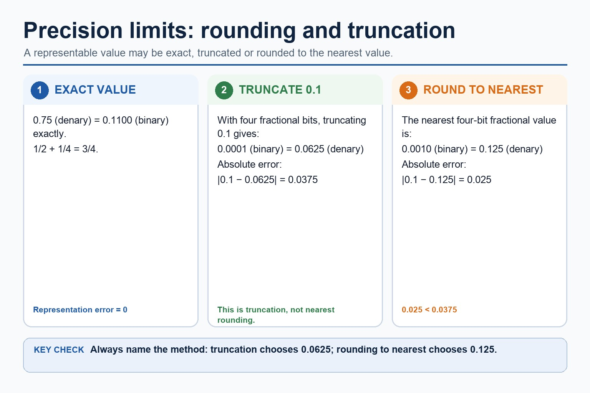

Text transcript

- 0.75 denary equals 0.1100 binary exactly.
- With four fractional bits, truncating 0.1 gives 0.0001 binary, which equals 0.0625 denary.
- The truncation error is 0.0375.
- Rounding 0.1 to the nearest four-bit fractional value gives 0.0010 binary, which equals 0.125 denary.
- The rounding error is 0.025, so 0.125 is nearer to 0.1 than 0.0625.

#### Two’s complement method

Text transcript

- Write the positive magnitude using exactly 8 bits.
- Invert every bit, then add 1 to form the negative two's-complement value.
- For +45: 00101101 becomes 11010010 after inversion, then 11010011 after adding 1.
- The 8-bit value 11010011 represents -45 in two's complement.
- When the MSB is 1, quick decode uses unsigned value minus 256.

Precise syllabus wording

Convert an integer value from one required number base or representation to another.

Conversions apply to integer values and the binary, denary, hexadecimal, BCD, one's-complement and two's-complement representations named in the preceding Version 2 row.

### Supporting diagram library

#### 8-bit binary place values

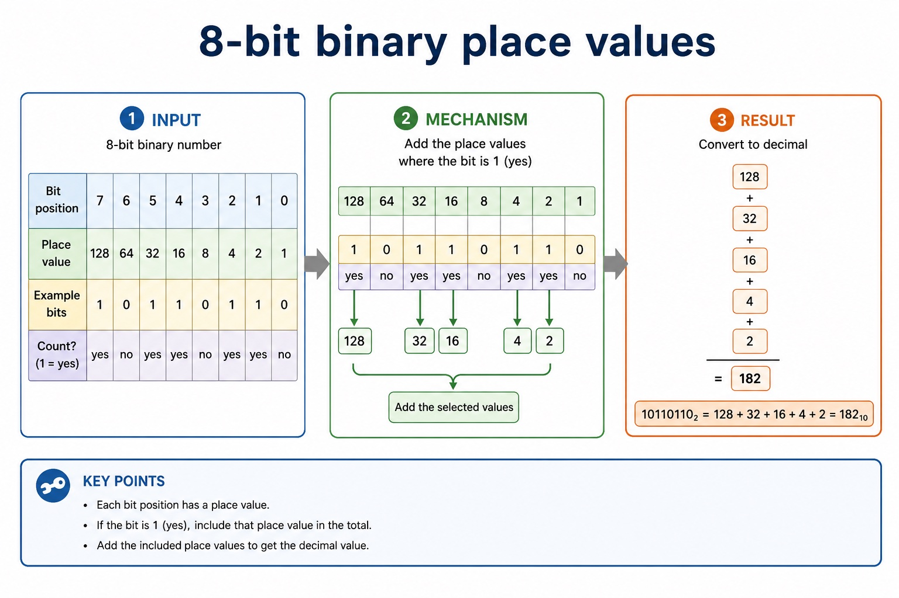

Text transcript

- Bit position 7 6 5 4 3 2 1 0
- Place value 128 64 32 16 8 4 2 1
- Example bits 1 0 1 1 0 1 1 0
- Count? yes no yes yes no yes yes no
- 10110110₂ = 128 + 32 + 16 + 4 + 2 = 182₁₀

#### Range and leading zeros

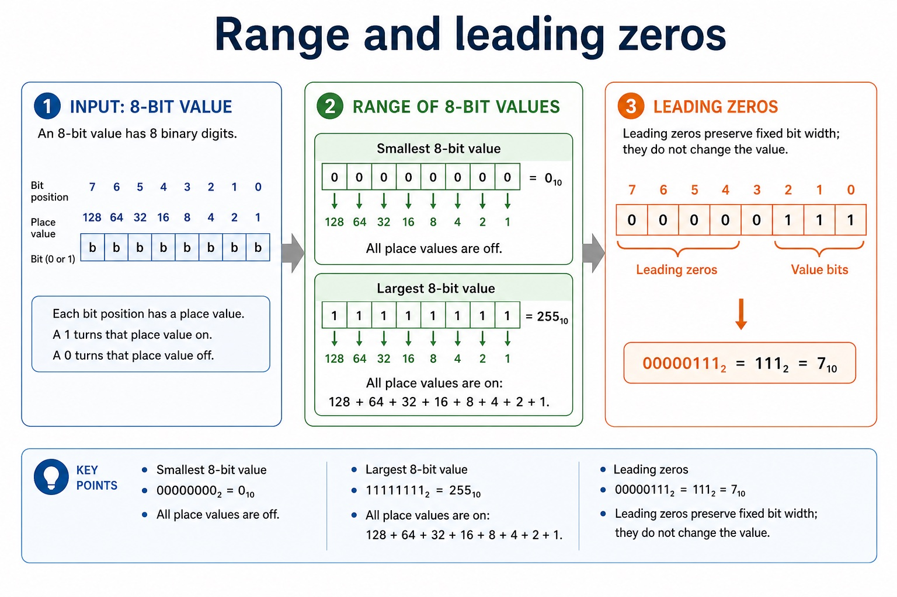

Text transcript

- Smallest 8-bit value
- 00000000₂ = 0₁₀
- All place values are off.
- Largest 8-bit value
- 11111111₂ = 255₁₀
- All place values are on: 128 + 64 + 32 + 16 + 8 + 4 + 2 + 1.
- Leading zeros
- 00000111₂ = 111₂ = 7₁₀

#### Hexadecimal digits: 0-9 then A-F

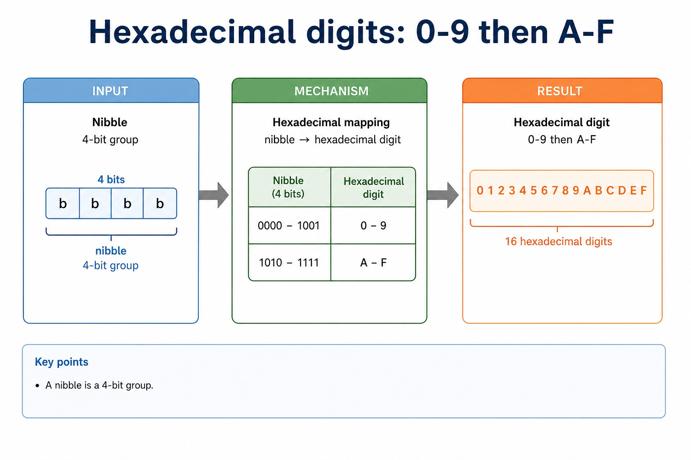

Text transcript

- nibble 4-bit group

#### Padding with leading zeros

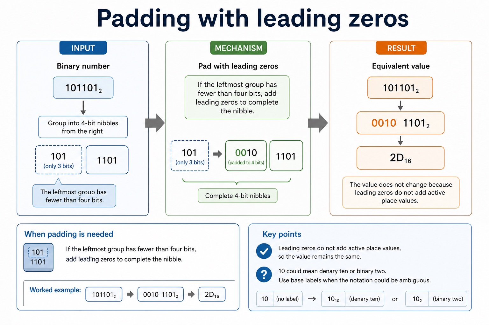

Text transcript

- When padding is needed
- If the leftmost group has fewer than four bits, add leading zeros to complete the nibble.
- 101101₂ → 0010 1101₂ → 2D₁₆
- The value does not change because leading zeros do not add active place values.
- Base labels
- 10 could mean denary ten or binary two. Use base labels when the notation could be ambiguous.

#### 8-bit signed ranges and zero

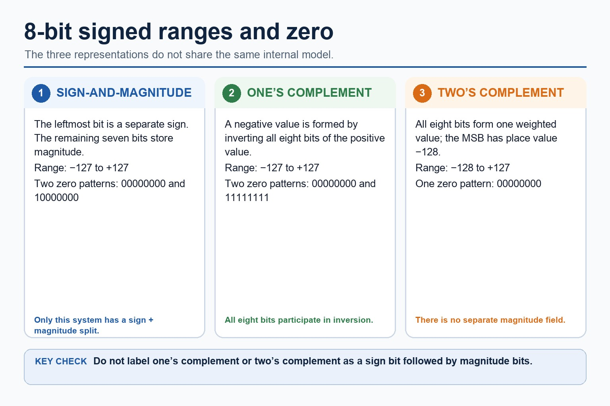

Text transcript

- Sign-and-magnitude uses one sign bit and seven magnitude bits; its range is -127 to +127 and it has two zero patterns.
- One's complement forms a negative value by inverting all eight bits; its range is -127 to +127 and it has two zero patterns.
- Two's complement uses all eight bits as one weighted value with MSB place value -128.
- The 8-bit two's-complement range is -128 to +127 and it has one zero pattern.
- One's complement and two's complement do not store a separate magnitude field.

#### Binary fractional place value

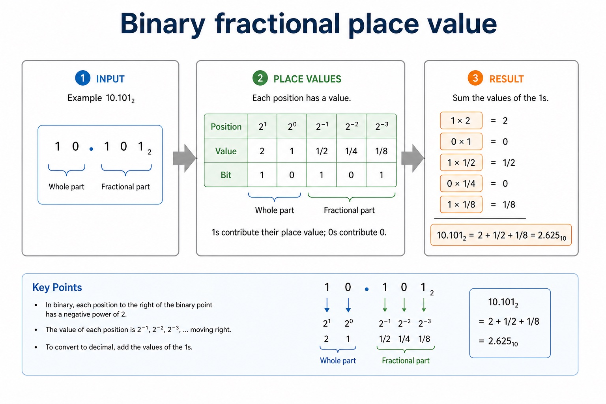

Text transcript

- Example 10.101₂
- 10.101₂ = 2 + 1/2 + 1/8 = 2.625₁₀

#### System cases

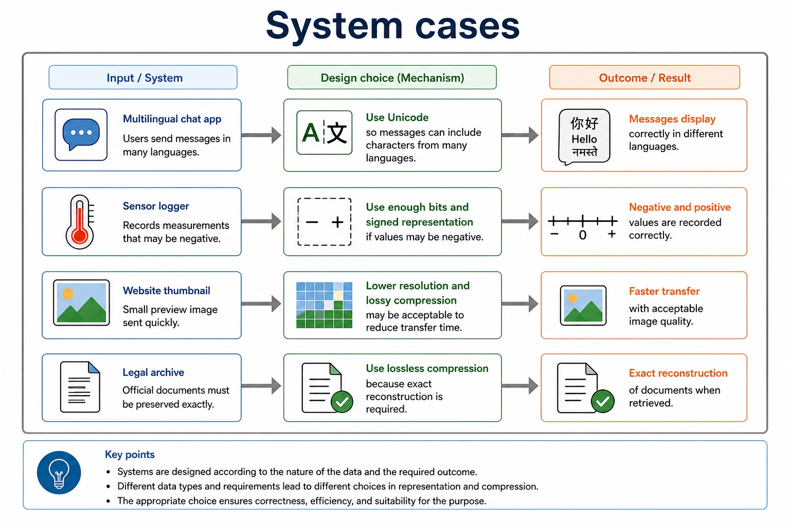

Text transcript

- Multilingual chat app
- Use Unicode so messages can include characters from many languages.
- Sensor logger
- Use enough bits and signed representation if values may be negative.
- Website thumbnail
- Lower resolution and lossy compression may be acceptable to reduce transfer time.
- Legal archive
- Use lossless compression because exact reconstruction is required.

#### A decision framework

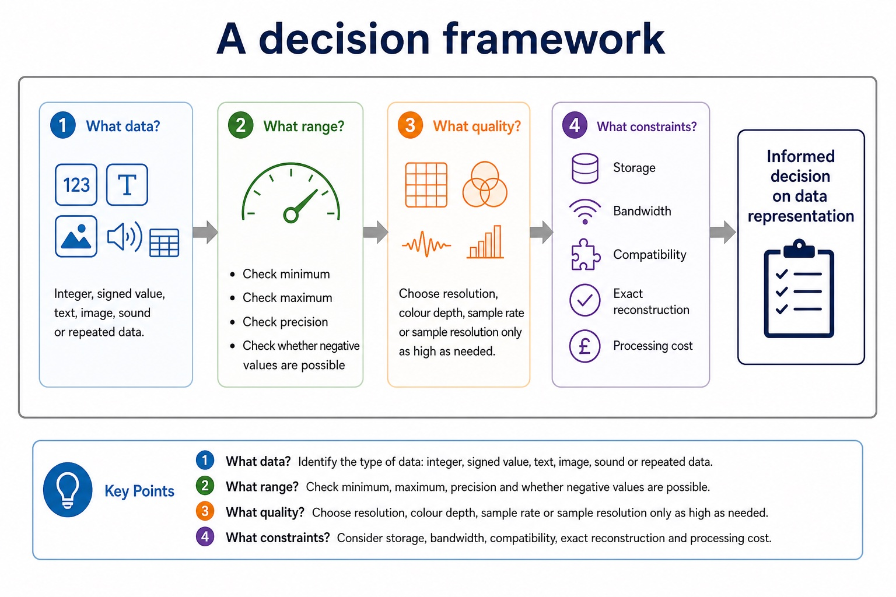

Text transcript

- 1. What data?
- Integer, signed value, text, image, sound or repeated data.
- 2. What range?
- Check minimum, maximum, precision and whether negative values are possible.
- 3. What quality?
- Choose resolution, colour depth, sample rate or sampling resolution only as high as needed.
- 4. What constraints?
- Storage, bandwidth, compatibility, exact reconstruction and processing cost.

#### Useful trade-off sentences

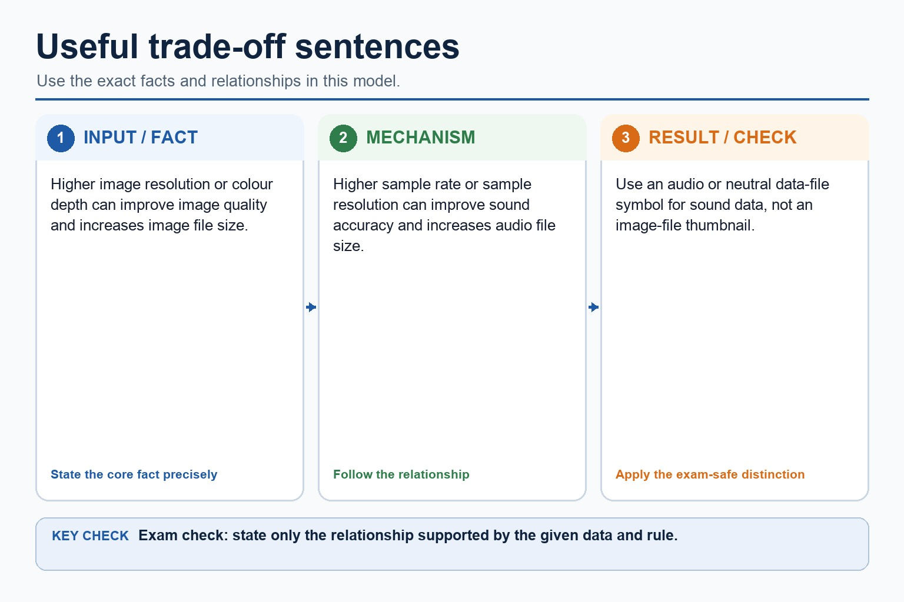

Text transcript

- Higher image resolution or colour depth can improve image quality and increases image file size.
- Higher sample rate or sample resolution can improve sound accuracy and increases audio file size.
- Use an audio or neutral data-file symbol for sound data, not an image-file thumbnail.

Open precise terminology and exam facts

- The Version 2 row requires binary, denary, hexadecimal, Binary Coded Decimal (BCD), one's complement and two's complement; BCD and complements are representations rather than additional number bases.
- Conversions apply to integer values and the binary, denary, hexadecimal, BCD, one's-complement and two's-complement representations named in the preceding Version 2 row.
- Binary is base 2 and uses place values that are powers of 2. Denary is base 10 and uses place values that are powers of 10. A base label identifies the representation; it does not change the integer value.
- To convert a binary integer to denary, add the binary place values whose bits are 1. To convert a denary integer to binary, select powers of 2 that sum to the value and write every required bit position, including zeros.
- Representation overview: the required integer representations are binary, denary, hexadecimal, BCD, one's-complement and two's-complement. Conversion means preserving the integer value while changing its base or signed representation.
- Hexadecimal is base 16 and uses digits 0 to 9 and A to F. One hexadecimal digit represents one four-bit binary nibble, so grouping from the right gives an exact conversion between binary and hexadecimal integer representations.
- To convert hexadecimal to denary, multiply each digit value by its power-of-16 place value. Binary, denary and hexadecimal may encode the same integer value even though their written representations differ.
- One's-complement representation forms a negative integer by inverting every bit of its positive fixed-width value. Two's-complement representation inverts every bit and adds 1. These are binary representations of signed integers, not separate number bases.
- Unsigned subtraction can be performed column by column using borrowing, or by adding the two's complement of the subtrahend. For signed two's-complement subtraction A - B, form the two's complement of B and add it to A. Retain the fixed width, interpret the sign bit and check the representable range.
- Binary subtraction applies to each positive or negative binary integer as well as binary addition; use the stated fixed width and signed representation when interpreting the result.
- BCD encodes each denary digit separately in four bits. For example, 59 becomes 0101 1001, not the pure-binary value 00111011.
- Only 0000 to 1001 are valid BCD digit groups. BCD is used where decimal digits must be displayed or processed exactly, such as digital clocks, calculators and financial displays, although it usually uses more bits than pure binary.

### Worked example

1. Convert D6 hexadecimal
2. D6 hexadecimal = 1101 0110 binary.
3. In denary, D6 = 13 x 16 + 6 = 214, so all three representations encode the integer 214.

Beyond syllabus / 延伸知识（不要求背诵）: real file formats also store headers and metadata, so two files with the same visible content may still have different sizes.
## 3. Practice by question type

### Question 1 - foundation - convert - 4 marks

Convert the integer 159 denary to hexadecimal and then to 8-bit binary.

**Answer:** 159 = 9 x 16 + 15; 9F hexadecimal; maps 9 to 1001 and F to 1111; 10011111 binary

**Marking guidance:** Do not treat A to F as decimal two-digit values.

**Common error:** For the command word convert, perform that exact action; do not replace it with an unrelated fact.

### Question 2 - application - explain - 4 marks

Explain one practical application of BCD and one practical application of hexadecimal.

**Answer:** BCD application such as a digital clock, calculator or financial display; links BCD to separate exact denary digits; hexadecimal application such as memory addresses, machine-code/debug output or colour values; links hexadecimal to compact four-bit grouping

**Marking guidance:** Do not award a named application without explaining why the representation suits it.

**Common error:** Do not repeat the same point in different words; each mark needs a separate idea or method step.

### Question 3 - transfer - explain - 2 marks

Why is hexadecimal suitable for a memory address?

**Answer:** It is a compact form of binary with one digit per four-bit nibble.

**Marking guidance:** Award one mark for each distinct, technically accurate point or method step.

**Common error:** Do not copy the worked example unchanged; transfer the method and check it against the new context.

### Related past-paper indexes

| Reference | Marks | Command word | Question type |
|---|---:|---|---|
| 9618/13/W/25 Q2(a) | 3 | identify | recall |
| 9618/11/W/25 Q1(ii) | 2 | complete | calculate |
| 9618/11/W/25 Q1(iii) | 2 | convert | calculate |
| 9618/12/S/25 Q2(a) | 2 | convert | calculate |

These are indexes only. Cambridge question and mark-scheme wording is not reproduced.

## 4. Summary and exam reminders

### Summary

- Define binary, denary and hexadecimal number systems with the exact technical vocabulary expected by the syllabus.
- Use the lesson method on a fresh context and show the intermediate decision, representation or calculation.
- Match the shape of the answer to the command word and the available marks.
- Check the final answer against the scenario instead of repeating a memorised sentence.

### Common error to correct

Students often treat binary digits as decoration. Correction: every bit position has a value; if the position changes, the value changes.

### Exam technique

- Follow the command word: state gives a fact; explain links a cause to a consequence; compare covers both sides.
- Match the number of independent points or method steps to the available marks.
- For binary, denary and hexadecimal number systems, use the exact technical term before applying it to the scenario.
