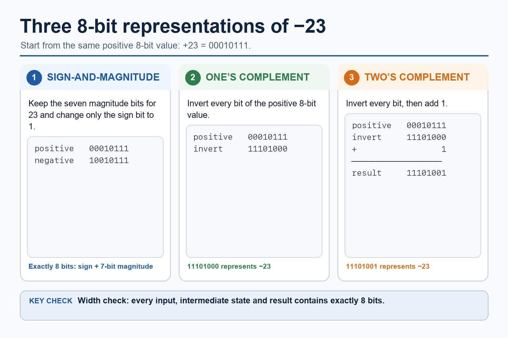
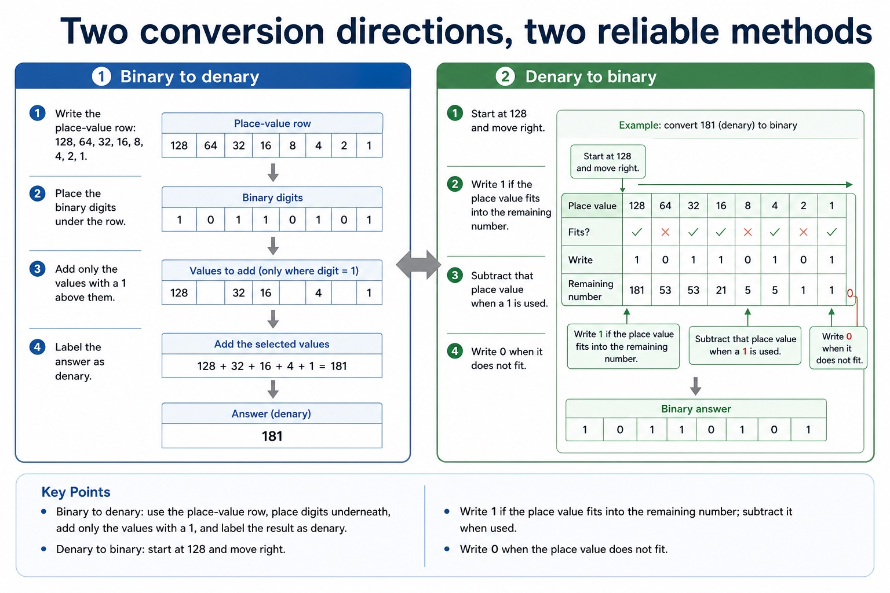
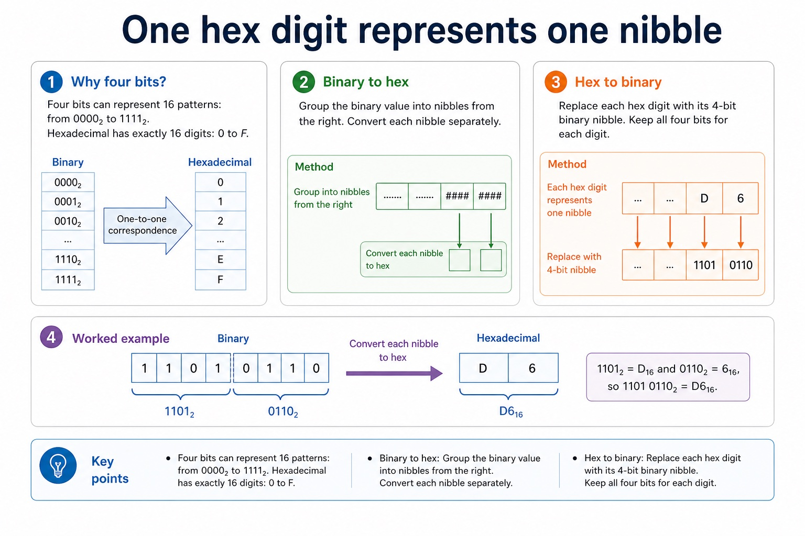

# Lesson 002: Binary, denary and hexadecimal number systems

**Course:** Cambridge International AS Level Computer Science 9618, syllabus for examination in 2027-2029 
**Paper:** Paper 1 
**Syllabus:** Section 1: Information representation 
**Syllabus requirements:** S1.02, S1.03 
**Pacing:** Flexible. Select a quick, full or deep route for the learners in front of you.

## Teaching-depth menu

- **Quick route:** Use the diagnostic, learning objectives, first worked example and foundation question. Stop once the learner can explain the central distinction accurately.
- **Full route:** Teach every knowledge-point material set, the worked method and all lesson questions.
- **Deep route:** Add the prerequisite refresher, ask learners to connect the concept checklist, discuss the labelled extension and complete a transfer question without a model answer.

## 1. Prerequisite knowledge and quick diagnostic

Recall S1.02 before starting this lesson.

Ask the learner to give one accurate definition or method step before continuing. If they cannot, briefly revisit the named prerequisite rather than repeating the whole previous lesson.

### Optional prerequisite refresher

- The syllabus requires binary, denary, hexadecimal, Binary Coded Decimal (BCD), one's complement and two's complement; BCD and complements are representations rather than additional number bases.
- Show understanding of binary, denary and hexadecimal number systems, BCD, and one's- and two's-complement representations.

## 2. Knowledge explanation

### 1. Bases and signed representations answer different questions (S1.02)

**Atomic learning targets**

- **S1.02.A01:** binary
- **S1.02.A02:** denary
- **S1.02.A03:** hexadecimal
- **S1.02.A04:** BCD
- **S1.02.A05:** one's-complement / one's complement
- **S1.02.A06:** two's-complement / two's complement

**Core explanation**

- Binary is base 2 and uses place values that are powers of 2. Denary is base 10 and uses place values that are powers of 10. A base label identifies the representation; it does not change the integer value.
- Hexadecimal is base 16 and uses digits 0 to 9 and A to F. One hexadecimal digit represents one four-bit binary nibble, so grouping from the right gives an exact conversion between binary and hexadecimal integer representations.
- Only 0000 to 1001 are valid BCD digit groups. BCD is used where decimal digits must be displayed or processed exactly, such as digital clocks, calculators and financial displays, although it usually uses more bits than pure binary.
- Representation overview: the required integer representations are binary, denary, hexadecimal, BCD, one's-complement and two's-complement. Conversion means preserving the integer value while changing its base or signed representation.
- Unsigned subtraction can be performed column by column using borrowing, or by adding the two's complement of the subtrahend. For signed two's-complement subtraction A - B, form the two's complement of B and add it to A. Retain the fixed width, interpret the sign bit and check the representable range.
- To convert a binary integer to denary, add the binary place values whose bits are 1. To convert a denary integer to binary, select powers of 2 that sum to the value and write every required bit position, including zeros.

**Mechanism or method**

1. **Establish the exact components or states** — Binary is base 2 and uses place values that are powers of 2.
2. **Trace the relationship or change** — Denary is base 10 and uses place values that are powers of 10.
3. **Use the explanation in a concrete case** — it does not change the integer value.

#### Worked example: Bases and signed representations answer different questions: complete worked route

1. **Establish the exact components or states**

Binary is base 2 and uses place values that are powers of 2.

2. **Trace the relationship or change**

Denary is base 10 and uses place values that are powers of 10.

3. **Use the explanation in a concrete case**

it does not change the integer value.

4. **Complete example**

Convert D6 hexadecimal: D6 hexadecimal = 1101 0110 binary. In denary, D6 = 13 x 16 + 6 = 214, so all three representations encode the integer 214.

**Misconceptions to correct**

- Students often treat binary digits as decoration. Correction: every bit position has a value; if the position changes, the value changes.

#### Mastery check (MC-L002-S1.02)

Show the following targets in one connected answer, using a concrete example for each: binary; denary; hexadecimal; BCD; one's-complement / one's complement; two's-complement / two's complement.

Answer criteria

- Binary is base 2 and uses place values that are powers of 2. Denary is base 10 and uses place values that are powers of 10. A base label identifies the representation; it does not change the integer value.
- Hexadecimal is base 16 and uses digits 0 to 9 and A to F. One hexadecimal digit represents one four-bit binary nibble, so grouping from the right gives an exact conversion between binary and hexadecimal integer representations.
- Only 0000 to 1001 are valid BCD digit groups. BCD is used where decimal digits must be displayed or processed exactly, such as digital clocks, calculators and financial displays, although it usually uses more bits than pure binary.
- Representation overview: the required integer representations are binary, denary, hexadecimal, BCD, one's-complement and two's-complement. Conversion means preserving the integer value while changing its base or signed representation.
- Unsigned subtraction can be performed column by column using borrowing, or by adding the two's complement of the subtrahend. For signed two's-complement subtraction A - B, form the two's complement of B and add it to A. Retain the fixed width, interpret the sign bit and check the representable range.
- To convert a binary integer to denary, add the binary place values whose bits are 1. To convert a denary integer to binary, select powers of 2 that sum to the value and write every required bit position, including zeros.

**Supplementary concept map**

- **Binary:** base 2
- **Denary:** base 10
- **Hex:** base 16
- **BCD:** four bits per digit
- **One's:** invert every bit
- **Two's:** invert then add 1

**Supplementary three-step recap**

1. **Base or representation?** — Binary, denary and hex are bases; BCD and complements encode values.
2. **Keep the bit width** — Signed representations only make sense when every value uses the stated width.
3. **Apply the stated rule** — The same bits can mean a different value under a different representation.

**One value, several name tags:** +23 is 00010111 in 8-bit binary; the rules create different 8-bit patterns for -23.

#### Three ways to represent negative binary values

Text transcript

- Positive 23 in 8 bits is 00010111.
- The 8-bit sign-and-magnitude representation of -23 is 10010111.
- The 8-bit one's-complement representation of -23 is 11101000.
- The 8-bit two's-complement representation of -23 is 11101001.
- Every input, intermediate state and result must contain exactly 8 bits.

Precise syllabus wording

Show understanding of binary, denary and hexadecimal number systems, BCD, and one's- and two's-complement representations.

The syllabus requires binary, denary, hexadecimal, Binary Coded Decimal (BCD), one's complement and two's complement; BCD and complements are representations rather than additional number bases.

### 2. Choose the conversion method from the target (S1.03)

**Atomic learning targets**

- **S1.03.A01:** integer
- **S1.03.A02:** convert / conversion
- **S1.03.A03:** binary
- **S1.03.A04:** denary
- **S1.03.A05:** hexadecimal
- **S1.03.A06:** BCD
- **S1.03.A07:** two's-complement / two's complement
- **S1.03.A08:** one's-complement / one's complement

**Core explanation**

- Binary is base 2 and uses place values that are powers of 2. Denary is base 10 and uses place values that are powers of 10. A base label identifies the representation; it does not change the integer value.
- To convert a binary integer to denary, add the binary place values whose bits are 1. To convert a denary integer to binary, select powers of 2 that sum to the value and write every required bit position, including zeros.
- Hexadecimal is base 16 and uses digits 0 to 9 and A to F. One hexadecimal digit represents one four-bit binary nibble, so grouping from the right gives an exact conversion between binary and hexadecimal integer representations.
- Only 0000 to 1001 are valid BCD digit groups. BCD is used where decimal digits must be displayed or processed exactly, such as digital clocks, calculators and financial displays, although it usually uses more bits than pure binary.
- Unsigned subtraction can be performed column by column using borrowing, or by adding the two's complement of the subtrahend. For signed two's-complement subtraction A - B, form the two's complement of B and add it to A. Retain the fixed width, interpret the sign bit and check the representable range.
- Representation overview: the required integer representations are binary, denary, hexadecimal, BCD, one's-complement and two's-complement. Conversion means preserving the integer value while changing its base or signed representation.

**Mechanism or method**

1. **Identify the relevant condition or input** — Binary is base 2 and uses place values that are powers of 2.
2. **Trace how the process works** — Denary is base 10 and uses place values that are powers of 10.
3. **Connect the mechanism to its result** — it does not change the integer value.

#### Worked example: Choose the conversion method from the target: complete worked route

1. **Identify the relevant condition or input**

Binary is base 2 and uses place values that are powers of 2.

2. **Trace how the process works**

Denary is base 10 and uses place values that are powers of 10.

3. **Connect the mechanism to its result**

it does not change the integer value.

4. **Complete example**

Convert D6 hexadecimal: D6 hexadecimal = 1101 0110 binary. In denary, D6 = 13 x 16 + 6 = 214, so all three representations encode the integer 214.

**Misconceptions to correct**

- Students often treat binary digits as decoration. Correction: every bit position has a value; if the position changes, the value changes.

#### Mastery check (MC-L002-S1.03)

Explain the following targets in one connected answer, using a concrete example for each: integer; convert / conversion; binary; denary; hexadecimal; BCD; two's-complement / two's complement; one's-complement / one's complement.

Answer criteria

- Binary is base 2 and uses place values that are powers of 2. Denary is base 10 and uses place values that are powers of 10. A base label identifies the representation; it does not change the integer value.
- To convert a binary integer to denary, add the binary place values whose bits are 1. To convert a denary integer to binary, select powers of 2 that sum to the value and write every required bit position, including zeros.
- Hexadecimal is base 16 and uses digits 0 to 9 and A to F. One hexadecimal digit represents one four-bit binary nibble, so grouping from the right gives an exact conversion between binary and hexadecimal integer representations.
- Only 0000 to 1001 are valid BCD digit groups. BCD is used where decimal digits must be displayed or processed exactly, such as digital clocks, calculators and financial displays, although it usually uses more bits than pure binary.
- Unsigned subtraction can be performed column by column using borrowing, or by adding the two's complement of the subtrahend. For signed two's-complement subtraction A - B, form the two's complement of B and add it to A. Retain the fixed width, interpret the sign bit and check the representable range.
- Representation overview: the required integer representations are binary, denary, hexadecimal, BCD, one's-complement and two's-complement. Conversion means preserving the integer value while changing its base or signed representation.

**Supplementary concept map**

- **To denary:** add place values
- **From denary:** select powers
- **Binary ↔ hex:** group four bits
- **BCD:** encode each digit
- **Negative:** keep fixed width

**Supplementary three-step recap**

1. **Name the destination** — Write the required base or representation before starting.
2. **Use its shortest route** — Use place values, four-bit groups or digit-by-digit BCD.
3. **Convert back** — Reverse the method and confirm the value and bit width.

**45 takes different forms:** 45 denary is 00101101 binary, 2D hexadecimal and 0100 0101 in BCD.

#### Two conversion directions, two reliable methods

Text transcript

- Binary to denary
- Write the place-value row: 128, 64, 32, 16, 8, 4, 2, 1.
- Place the binary digits under the row.
- Add only the values with a 1 above them.
- Label the answer as denary.
- Denary to binary
- Start at 128 and move right.
- Write 1 if the place value fits into the remaining number.
- Subtract that place value when a 1 is used.
- Write 0 when it does not fit.

#### One hex digit represents one nibble

Text transcript

- Why four bits?
- Four bits can represent 16 patterns: from 0000₂ to 1111₂. Hexadecimal has exactly 16 digits: 0 to F.
- Binary to hex
- Group the binary value into nibbles from the right. Convert each nibble separately.
- Hex to binary
- Replace each hex digit with its 4-bit binary nibble. Keep all four bits for each digit.
- 1101₂ = D₁₆ and 0110₂ = 6₁₆, so 1101 0110₂ = D6₁₆.

Precise syllabus wording

Convert an integer value from one required number base or representation to another.

Conversions apply to integer values and the binary, denary, hexadecimal, BCD, one's-complement and two's-complement representations named in the syllabus list above.

### Lesson technical reference

- The syllabus requires binary, denary, hexadecimal, Binary Coded Decimal (BCD), one's complement and two's complement; BCD and complements are representations rather than additional number bases.
- Conversions apply to integer values and the binary, denary, hexadecimal, BCD, one's-complement and two's-complement representations named in the syllabus list above.
- Binary is base 2 and uses place values that are powers of 2. Denary is base 10 and uses place values that are powers of 10. A base label identifies the representation; it does not change the integer value.
- To convert a binary integer to denary, add the binary place values whose bits are 1. To convert a denary integer to binary, select powers of 2 that sum to the value and write every required bit position, including zeros.
- Representation overview: the required integer representations are binary, denary, hexadecimal, BCD, one's-complement and two's-complement. Conversion means preserving the integer value while changing its base or signed representation.
- Hexadecimal is base 16 and uses digits 0 to 9 and A to F. One hexadecimal digit represents one four-bit binary nibble, so grouping from the right gives an exact conversion between binary and hexadecimal integer representations.
- To convert hexadecimal to denary, multiply each digit value by its power-of-16 place value. Binary, denary and hexadecimal may encode the same integer value even though their written representations differ.
- One's-complement representation forms a negative integer by inverting every bit of its positive fixed-width value. Two's-complement representation inverts every bit and adds 1. These are binary representations of signed integers, not separate number bases.
- Unsigned subtraction can be performed column by column using borrowing, or by adding the two's complement of the subtrahend. For signed two's-complement subtraction A - B, form the two's complement of B and add it to A. Retain the fixed width, interpret the sign bit and check the representable range.
- Binary subtraction applies to each positive or negative binary integer as well as binary addition; use the stated fixed width and signed representation when interpreting the result.
- BCD encodes each denary digit separately in four bits. For example, 59 becomes 0101 1001, not the pure-binary value 00111011.
- Only 0000 to 1001 are valid BCD digit groups. BCD is used where decimal digits must be displayed or processed exactly, such as digital clocks, calculators and financial displays, although it usually uses more bits than pure binary.

Beyond syllabus / 延伸知识（不要求背诵）: real file formats also store headers and metadata, so two files with the same visible content may still have different sizes.
## 3. Practice by question type

### Question 1 - foundation - convert - 4 marks

Convert the integer 159 denary to hexadecimal and then to 8-bit binary.

**Answer:** 159 = 9 x 16 + 15; 9F hexadecimal; maps 9 to 1001 and F to 1111; 10011111 binary

**Marking guidance:** Do not treat A to F as decimal two-digit values.

**Common error:** For the command word convert, perform that exact action; do not replace it with an unrelated fact.

### Question 2 - application - explain - 4 marks

Explain one practical application of BCD and one practical application of hexadecimal.

**Answer:** BCD application such as a digital clock, calculator or financial display; links BCD to separate exact denary digits; hexadecimal application such as memory addresses, machine-code/debug output or colour values; links hexadecimal to compact four-bit grouping

**Marking guidance:** Do not award a named application without explaining why the representation suits it.

**Common error:** Do not repeat the same point in different words; each mark needs a separate idea or method step.

### Question 3 - transfer - explain - 2 marks

Why is hexadecimal suitable for a memory address?

**Answer:** It is a compact form of binary with one digit per four-bit nibble.

**Marking guidance:** Award one mark for each distinct, technically accurate point or method step.

**Common error:** Do not copy the worked example unchanged; transfer the method and check it against the new context.

### Related past-paper indexes

| Reference | Marks | Command word | Question type |
|---|---:|---|---|
| 9618/13/W/25 Q2(a) | 3 | identify | recall |
| 9618/11/W/25 Q1(ii) | 2 | complete | calculate |
| 9618/11/W/25 Q1(iii) | 2 | convert | calculate |
| 9618/12/S/25 Q2(a) | 2 | convert | calculate |

These are indexes only. Cambridge question and mark-scheme wording is not reproduced.

## 4. Summary and exam reminders

### Summary

- S1.02: explain binary, denary, hexadecimal, BCD, one's-complement / one's complement, two's-complement / two's complement.
- S1.02 method: Establish the exact components or states → Trace the relationship or change → Use the explanation in a concrete case.
- S1.03: explain integer, convert / conversion, binary, denary, hexadecimal, BCD, two's-complement / two's complement, one's-complement / one's complement.
- S1.03 method: Identify the relevant condition or input → Trace how the process works → Connect the mechanism to its result.
- Correction to remember: Students often treat binary digits as decoration. Correction: every bit position has a value; if the position changes, the value changes.

### Common error to correct

Students often treat binary digits as decoration. Correction: every bit position has a value; if the position changes, the value changes.

### Exam technique

- Follow the command word: state gives a fact; explain links a cause to a consequence; compare covers both sides.
- Match the number of independent points or method steps to the available marks.
- For binary, denary and hexadecimal number systems, use the exact technical term before applying it to the scenario.
