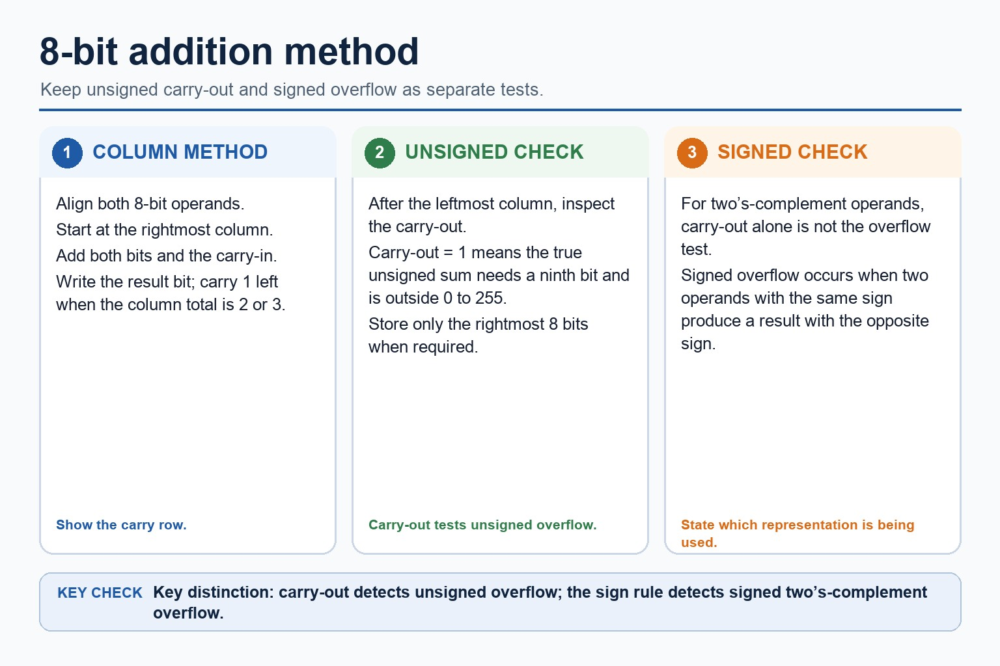
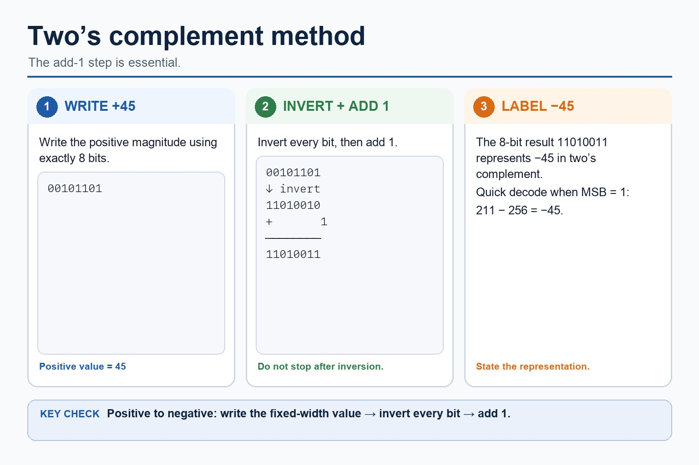
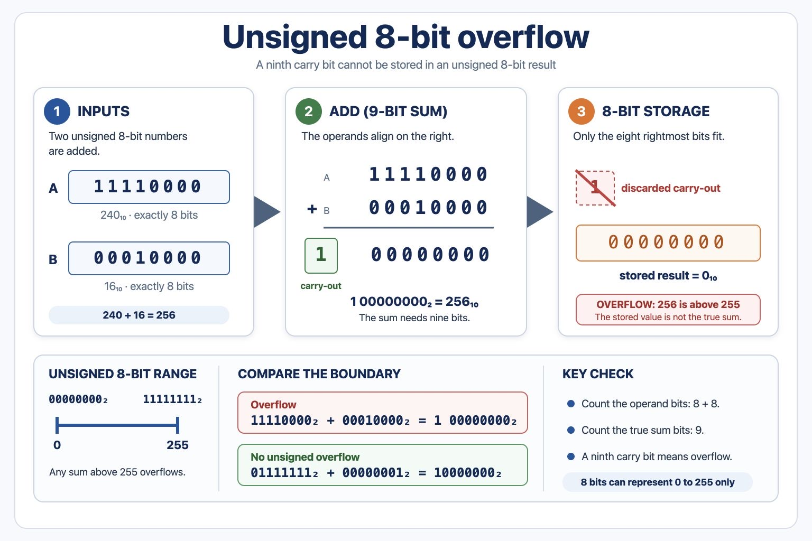

# Lesson 003: Signed binary arithmetic and overflow

**Course:** Cambridge International AS Level Computer Science 9618, syllabus for examination in 2027-2029 
**Paper:** Paper 1 
**Syllabus:** Section 1: Information representation 
**Syllabus requirements:** S1.04, S1.05 
**Pacing:** Flexible. Select a quick, full or deep route for the learners in front of you.

## Teaching-depth menu

- **Quick route:** Use the diagnostic, learning objectives, first worked example and foundation question. Stop once the learner can explain the central distinction accurately.
- **Full route:** Teach every knowledge-point material set, the worked method and all lesson questions.
- **Deep route:** Add the prerequisite refresher, ask learners to connect the concept checklist, discuss the labelled extension and complete a transfer question without a model answer.

## 1. Prerequisite knowledge and quick diagnostic

Recall S1.02, S1.04 before starting this lesson.

Ask the learner to give one accurate definition or method step before continuing. If they cannot, briefly revisit the named prerequisite rather than repeating the whole previous lesson.

### Optional prerequisite refresher

- The syllabus requires binary, denary, hexadecimal, Binary Coded Decimal (BCD), one's complement and two's complement; BCD and complements are representations rather than additional number bases.
- Show understanding of binary, denary and hexadecimal number systems, BCD, and one's- and two's-complement representations.
- The syllabus explicitly requires both addition and subtraction using positive and negative binary integers; fixed-width representation must be retained throughout a calculation.
- Perform binary addition and subtraction using positive and negative binary integers.

## 2. Knowledge explanation

### 1. Signed arithmetic keeps one fixed-width bit pattern (S1.04)

**Atomic learning targets**

- **S1.04.A01:** binary addition
- **S1.04.A02:** binary subtraction
- **S1.04.A03:** positive
- **S1.04.A04:** negative
- **S1.04.A05:** integer

**Core explanation**

- Binary subtraction applies to each positive or negative binary integer as well as binary addition; use the stated fixed width and signed representation when interpreting the result.
- Representation overview: the required integer representations are binary, denary, hexadecimal, BCD, one's-complement and two's-complement. Conversion means preserving the integer value while changing its base or signed representation.
- Perform binary addition from the least-significant bit, carrying left when a column total is 2 or 3. Positive and negative integers must be interpreted using the stated representation and fixed bit width.
- One's-complement representation forms a negative integer by inverting every bit of its positive fixed-width value. Two's-complement representation inverts every bit and adds 1. These are binary representations of signed integers, not separate number bases.
- Use the same width and encode a negative operand correctly.

**Mechanism or method**

1. **Identify the relevant condition or input** — Binary subtraction applies to each positive or negative binary integer as well as binary addition;
2. **Trace how the process works** — use the stated fixed width and signed representation when interpreting the result.
3. **Connect the mechanism to its result** — Representation overview: the required integer representations are binary, denary, hexadecimal, BCD, one's-complement and two's-complement.

#### Worked example: Signed arithmetic keeps one fixed-width bit pattern: complete worked route

1. **Identify the relevant condition or input**

Binary subtraction applies to each positive or negative binary integer as well as binary addition;

2. **Trace how the process works**

use the stated fixed width and signed representation when interpreting the result.

3. **Connect the mechanism to its result**

Representation overview: the required integer representations are binary, denary, hexadecimal, BCD, one's-complement and two's-complement.

4. **Complete example**

Add two unsigned 8-bit integers: 11110000 + 00110000 = 1 00100000.

**Misconceptions to correct**

- Students often treat binary digits as decoration. Correction: every bit position has a value; if the position changes, the value changes.

#### Mastery check (MC-L003-S1.04)

Explain the following targets in one connected answer, using a concrete example for each: binary addition; binary subtraction; positive; negative; integer.

Answer criteria

- Binary subtraction applies to each positive or negative binary integer as well as binary addition; use the stated fixed width and signed representation when interpreting the result.
- Representation overview: the required integer representations are binary, denary, hexadecimal, BCD, one's-complement and two's-complement. Conversion means preserving the integer value while changing its base or signed representation.
- Perform binary addition from the least-significant bit, carrying left when a column total is 2 or 3. Positive and negative integers must be interpreted using the stated representation and fixed bit width.
- One's-complement representation forms a negative integer by inverting every bit of its positive fixed-width value. Two's-complement representation inverts every bit and adds 1. These are binary representations of signed integers, not separate number bases.
- Use the same width and encode a negative operand correctly.

**Supplementary concept map**

- **Align:** same bit width
- **Add:** right to left
- **Carry:** carry into next column
- **Negative:** two's complement
- **Subtract:** add the negative
- **Read:** interpret stored result

**Supplementary three-step recap**

1. **Prepare both operands** — Use the same width and encode a negative operand correctly.
2. **Add column by column** — Subtraction can be performed by adding the two's-complement negative.
3. **Keep the stored width** — Discard only a carry beyond the fixed width, then decode the result.

**A four-bit number line:** 0101 + 1101 represents 5 + (-3). The stored four-bit result is 0010, which represents 2.

#### 8-bit addition method

Text transcript

- Align the two 8-bit operands and start at the rightmost column.
- Add both bits and any carry-in; write the result bit and carry 1 left when required.
- For unsigned addition, a carry-out beyond bit 7 means the true sum needs more than 8 bits.
- Without a carry-out, the stored 8-bit result remains within the unsigned range 0 to 255.
- A leftmost result bit of 1 is not by itself evidence of unsigned overflow.

#### Two’s complement method

Text transcript

- Write the positive magnitude using exactly 8 bits.
- Invert every bit, then add 1 to form the negative two's-complement value.
- For +45: 00101101 becomes 11010010 after inversion, then 11010011 after adding 1.
- The 8-bit value 11010011 represents -45 in two's complement.
- When the MSB is 1, quick decode uses unsigned value minus 256.

Precise syllabus wording

Perform binary addition and subtraction using positive and negative binary integers.

The syllabus explicitly requires both addition and subtraction using positive and negative binary integers; fixed-width representation must be retained throughout a calculation.

### 2. Overflow means the true result does not fit (S1.05)

**Atomic learning targets**

- **S1.05.A01:** overflow
- **S1.05.A02:** fixed-width / fixed width
- **S1.05.A03:** representable range / range representable

**Core explanation**

- Overflow occurs when the mathematical result is outside the range representable in the available bits. For unsigned 8-bit addition, a carry beyond bit 7 shows that the true result is greater than 255. For signed arithmetic, compare the result with the signed representable range rather than treating every carry as overflow.
- Unsigned subtraction can be performed column by column using borrowing, or by adding the two's complement of the subtrahend. For signed two's-complement subtraction A - B, form the two's complement of B and add it to A. Retain the fixed width, interpret the sign bit and check the representable range.
- Binary subtraction applies to each positive or negative binary integer as well as binary addition; use the stated fixed width and signed representation when interpreting the result.

**Mechanism or method**

1. **Establish the exact components or states** — Overflow occurs when the mathematical result is outside the range representable in the available bits.
2. **Trace the relationship or change** — For unsigned 8-bit addition, a carry beyond bit 7 shows that the true result is greater than 255.
3. **Use the explanation in a concrete case** — For signed arithmetic, compare the result with the signed representable range rather than treating every carry as overflow.

#### Worked example: Overflow means the true result does not fit: complete worked route

1. **Establish the exact components or states**

Overflow occurs when the mathematical result is outside the range representable in the available bits.

2. **Trace the relationship or change**

For unsigned 8-bit addition, a carry beyond bit 7 shows that the true result is greater than 255.

3. **Use the explanation in a concrete case**

For signed arithmetic, compare the result with the signed representable range rather than treating every carry as overflow.

4. **Complete example**

The true result is 288, which is outside the unsigned 8-bit range 0 to 255, so the stored eight-bit result cannot represent the mathematical answer and overflow occurs.

**Misconceptions to correct**

- Students often treat binary digits as decoration. Correction: every bit position has a value; if the position changes, the value changes.

#### Mastery check (MC-L003-S1.05)

Show the following targets in one connected answer, using a concrete example for each: overflow; fixed-width / fixed width; representable range / range representable.

Answer criteria

- Overflow occurs when the mathematical result is outside the range representable in the available bits. For unsigned 8-bit addition, a carry beyond bit 7 shows that the true result is greater than 255. For signed arithmetic, compare the result with the signed representable range rather than treating every carry as overflow.
- Unsigned subtraction can be performed column by column using borrowing, or by adding the two's complement of the subtrahend. For signed two's-complement subtraction A - B, form the two's complement of B and add it to A. Retain the fixed width, interpret the sign bit and check the representable range.
- Binary subtraction applies to each positive or negative binary integer as well as binary addition; use the stated fixed width and signed representation when interpreting the result.

**Supplementary concept map**

- **Width:** fixed number of bits
- **Unsigned 8-bit:** 0 to 255
- **Signed 8-bit:** -128 to 127
- **True result:** mathematical answer
- **Stored result:** bits that remain

**Supplementary three-step recap**

1. **Find representable limits** — Use both the bit width and the stated signed representation.
2. **Find the true result** — Do the arithmetic without assuming every carry means overflow.
3. **Compare result with range** — Overflow occurs only when the true result lies outside the limits.

**A box with fixed capacity:** Eight-bit two's complement ends at 127. Therefore 127 + 1 overflows even though an 8-bit pattern is still stored.

#### Unsigned 8-bit overflow

Text transcript

- 00000000₂ to 11111111₂ = 0 to 255
- An unsigned 8-bit result cannot store a value above 255.
- Carry-out
- 11110000₂ + 00010000₂ = 1 00000000₂
- The ninth bit is a carry-out beyond the 8-bit storage width.
- Boundary warning
- 01111111₂ + 00000001₂ = 10000000₂
- No unsigned overflow: the result is 128, which still fits in 8 bits.

Precise syllabus wording

Show understanding of how overflow can occur in fixed-width binary arithmetic.

Overflow occurs when the mathematical result is outside the range representable by the stated bit width and representation; it is not inferred from every internal carry or from a leading 1 alone.

### Lesson technical reference

- The syllabus explicitly requires both addition and subtraction using positive and negative binary integers; fixed-width representation must be retained throughout a calculation.
- Overflow occurs when the mathematical result is outside the range representable by the stated bit width and representation; it is not inferred from every internal carry or from a leading 1 alone.
- Perform binary addition from the least-significant bit, carrying left when a column total is 2 or 3. Positive and negative integers must be interpreted using the stated representation and fixed bit width.
- Overflow occurs when the mathematical result is outside the range representable in the available bits. For unsigned 8-bit addition, a carry beyond bit 7 shows that the true result is greater than 255. For signed arithmetic, compare the result with the signed representable range rather than treating every carry as overflow.
- Binary subtraction applies to each positive or negative binary integer as well as binary addition; use the stated fixed width and signed representation when interpreting the result.
- One's-complement representation forms a negative integer by inverting every bit of its positive fixed-width value. Two's-complement representation inverts every bit and adds 1. These are binary representations of signed integers, not separate number bases.
- Unsigned subtraction can be performed column by column using borrowing, or by adding the two's complement of the subtrahend. For signed two's-complement subtraction A - B, form the two's complement of B and add it to A. Retain the fixed width, interpret the sign bit and check the representable range.
- Representation overview: the required integer representations are binary, denary, hexadecimal, BCD, one's-complement and two's-complement. Conversion means preserving the integer value while changing its base or signed representation.

Beyond syllabus / 延伸知识（不要求背诵）: real file formats also store headers and metadata, so two files with the same visible content may still have different sizes.
## 3. Practice by question type

### Question 1 - foundation - explain - 2 marks

Why does 01111111 + 00000001 not overflow as unsigned 8-bit arithmetic?

**Answer:** The result 10000000 is 128, which remains inside 0 to 255.

**Marking guidance:** Award one mark for each distinct, technically accurate point or method step.

**Common error:** For the command word explain, perform that exact action; do not replace it with an unrelated fact.

### Question 2 - application - apply - 2 marks

What is the general overflow test?

**Answer:** The mathematical result lies outside the range representable by the fixed-width binary representation.

**Marking guidance:** Award one mark for each distinct, technically accurate point or method step.

**Common error:** Do not repeat the same point in different words; each mark needs a separate idea or method step.

### Question 3 - transfer - calculate - 4 marks

Calculate the sum of 11001010 and 01110101 as unsigned 8-bit integers and explain the overflow.

**Answer:** correct binary addition and carry method; 1 00111111 / stored result 00111111; true result needs a ninth bit / exceeds 255; therefore unsigned 8-bit overflow occurs

**Marking guidance:** Do not infer unsigned overflow only from the leftmost stored bit being 1.

**Common error:** Do not copy the worked example unchanged; transfer the method and check it against the new context.

### Related past-paper indexes

| Reference | Marks | Command word | Question type |
|---|---:|---|---|
| 9618/13/S/25 Q7(c) | 2 | complete | calculate |
| 9618/12/W/25 Q7(a) | 1 | complete | recall |
| 9618/11/S/24 Q7 | 3 | complete | calculate |

These are indexes only. Cambridge question and mark-scheme wording is not reproduced.

## 4. Summary and exam reminders

### Summary

- S1.04: explain binary addition, binary subtraction, positive, negative, integer.
- S1.04 method: Identify the relevant condition or input → Trace how the process works → Connect the mechanism to its result.
- S1.05: explain overflow, fixed-width / fixed width, representable range / range representable.
- S1.05 method: Establish the exact components or states → Trace the relationship or change → Use the explanation in a concrete case.
- Correction to remember: Students often treat binary digits as decoration. Correction: every bit position has a value; if the position changes, the value changes.

### Common error to correct

Students often treat binary digits as decoration. Correction: every bit position has a value; if the position changes, the value changes.

### Exam technique

- Follow the command word: state gives a fact; explain links a cause to a consequence; compare covers both sides.
- Match the number of independent points or method steps to the available marks.
- For signed binary arithmetic and overflow, use the exact technical term before applying it to the scenario.
