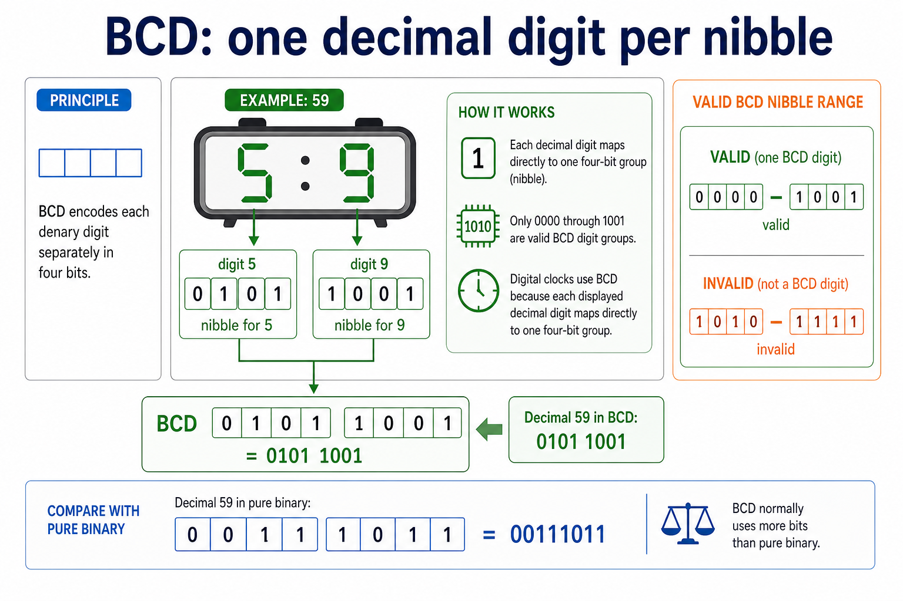
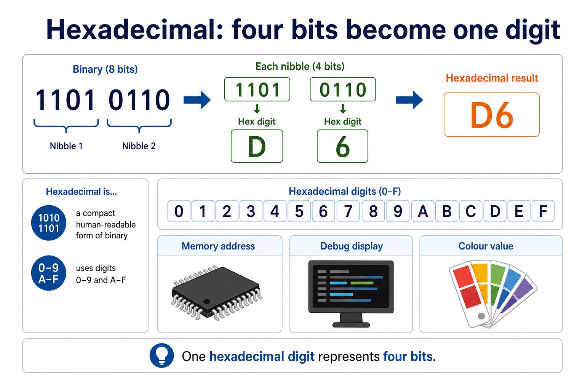
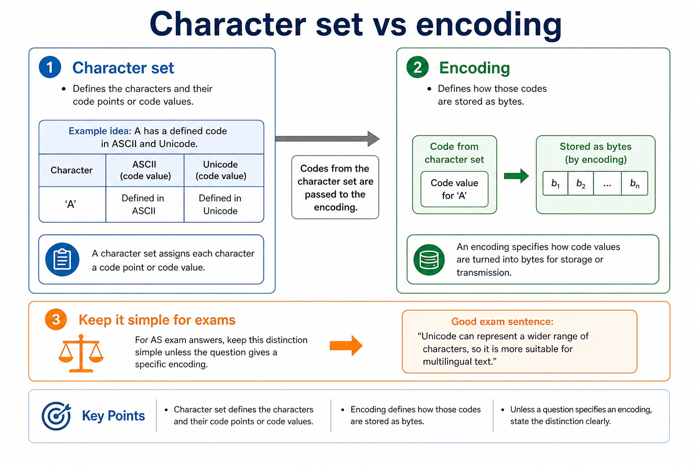
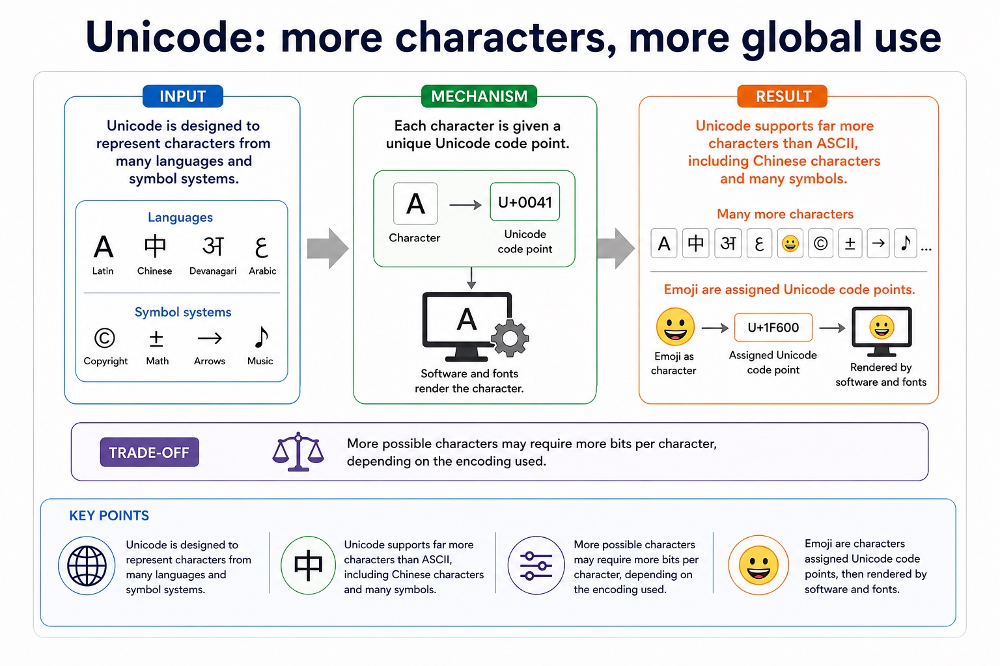
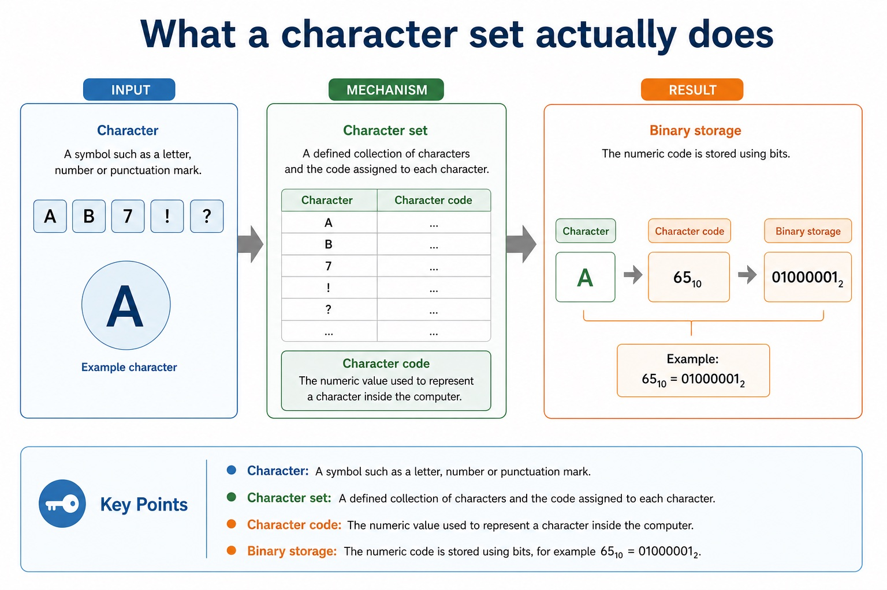

# Lesson 004: BCD, hexadecimal applications and character encoding

**Course:** Cambridge International AS Level Computer Science 9618, 2027-2029 Version 2 
**Paper:** Paper 1 
**Syllabus:** Section 1: Information representation 
**Syllabus requirements:** S1.06, S1.07 
**Pacing:** Flexible. Select the material set and practice depth needed by the learner.

## Teaching-depth menu

- **Quick route:** Use the diagnostic, learning objectives, first worked example and foundation question. Stop once the learner can explain the central distinction accurately.
- **Full route:** Use every knowledge-point material set, the worked method, the terminology check and all questions.
- **Deep route:** Add the prerequisite refresher, ask learners to connect the concept checklist, discuss the labelled extension and complete a transfer question without a model answer.

## 1. Prerequisite knowledge and quick diagnostic

Recall S1.02 before starting this lesson.

Ask the learner to give one accurate definition or method step before continuing. If they cannot, briefly revisit the named prerequisite rather than repeating the whole previous lesson.

### Optional prerequisite refresher

- The Version 2 row requires binary, denary, hexadecimal, Binary Coded Decimal (BCD), one's complement and two's complement; BCD and complements are representations rather than additional number bases.
- Show understanding of binary, denary and hexadecimal number systems, BCD, and one's- and two's-complement representations.

## 2. Knowledge explanation

### 1. BCD · Hexadecimal · Digital clock · Memory address (S1.06)

**Concept map:** BCD → hexadecimal → digital clock → memory address

**Three-part explanation:**

1. Candidates must connect each representation to a practical use and explain why it suits that use, rather than only performing a conversion
2. A digital clock is a practical BCD application because each displayed denary digit maps directly to one four-bit BCD group
3. One hex digit represents four bits, so hexadecimal is practical for memory addresses, machine-code/debug displays and colour values

**Concrete cue:** Candidates must connect each representation to a practical use and explain why it suits that use, rather than only performing a conversion.

#### BCD: one decimal digit per nibble

Text transcript

- BCD encodes each denary digit separately in four bits.
- Decimal 59 becomes 0101 1001 in BCD: digit 5 maps to 0101 and digit 9 maps to 1001.
- The pure-binary representation of decimal 59 is 00111011, so BCD and pure binary do not store the same bit pattern.
- Only 0000 through 1001 are valid BCD digit groups.
- A digital clock can map each displayed denary digit directly to one four-bit BCD group.

#### Hexadecimal: four bits become one digit

Text transcript

- One hexadecimal digit represents four bits.
- Binary 1101 0110 groups into two nibbles: 1101 becomes D and 0110 becomes 6, giving hexadecimal D6.
- Hexadecimal uses the digits 0 through 9 and A through F.
- Hexadecimal is a compact human-readable form of binary used for memory addresses, debug displays and colour values.

#### Hexadecimal digits: 0-9 then A-F

Text transcript

- nibble 4-bit group

Precise syllabus wording

Describe practical applications where BCD and hexadecimal are used.

Candidates must connect each representation to a practical use and explain why it suits that use, rather than only performing a conversion.

### 2. ASCII · Extended ASCII · Unicode · Character set (S1.07)

**Concept map:** ASCII → extended ASCII → Unicode → character set → binary → not expected to memorise

**Three-part explanation:**

1. Students should understand ASCII, extended ASCII and Unicode but are not expected to memorise particular character codes
2. Candidates are not expected to memorise particular character codes
3. The chosen Unicode encoding stores the character codes as binary data

**Concrete cue:** Students should understand ASCII, extended ASCII and Unicode but are not expected to memorise particular character codes.

#### ASCII and extended ASCII

Text transcript

- A character set assigns numeric codes to characters and those codes are stored in binary.
- Standard ASCII uses seven-bit codes and provides 128 possible codes.
- Extended ASCII uses eight-bit codes and provides 256 possible codes.
- Extended ASCII adds characters but still cannot cover all of the world's writing systems.

#### Character set vs encoding

Text transcript

- Character set
- Defines the characters and their code points or code values.
- Example idea: A has a defined code in ASCII and Unicode.
- Encoding
- Defines how those codes are stored as bytes.
- For AS exam answers, keep this distinction simple unless the question gives a specific encoding.
- A good exam sentence: “Unicode can represent a wider range of characters, so it is more suitable for multilingual text.”

#### Unicode: more characters, more global use

Text transcript

- Unicode is designed to represent characters from many languages and symbol systems.
- Unicode supports far more characters than ASCII, including Chinese characters and many symbols.
- Trade-off
- More possible characters may require more bits per character, depending on the encoding used.
- Emoji are characters assigned Unicode code points and rendered by software using available fonts or graphics.

#### What a character set actually does

Text transcript

- Character
- Character set
- A defined collection of characters and the code assigned to each character.
- Character code
- The numeric value used to represent a character inside the computer.
- Binary storage
- The numeric code is stored using bits, for example 65₁₀ = 01000001₂.

Precise syllabus wording

Show understanding of character data in internal binary form using ASCII, extended ASCII and Unicode.

Students should understand ASCII, extended ASCII and Unicode but are not expected to memorise particular character codes.

### Supporting diagram library

#### Converting simple binary fractions

Text transcript

- Binary fractional place values are 1/2, 1/4, 1/8 and 1/16 from left to right.
- 0.1010 binary equals 1/2 + 1/8 = 0.625 denary.
- 0.1100 binary equals 1/2 + 1/4 = 0.75 denary.

#### Binary fractional place value

Text transcript

- Example 10.101₂
- 10.101₂ = 2 + 1/2 + 1/8 = 2.625₁₀

#### Precision limits: why computers sometimes approximate

Text transcript

- 0.75 denary equals 0.1100 binary exactly.
- With four fractional bits, truncating 0.1 gives 0.0001 binary, which equals 0.0625 denary.
- The truncation error is 0.0375.
- Rounding 0.1 to the nearest four-bit fractional value gives 0.0010 binary, which equals 0.125 denary.
- The rounding error is 0.025, so 0.125 is nearer to 0.1 than 0.0625.

Open precise terminology and exam facts

- Candidates must connect each representation to a practical use and explain why it suits that use, rather than only performing a conversion.
- Students should understand ASCII, extended ASCII and Unicode but are not expected to memorise particular character codes.
- BCD encodes each denary digit separately in four bits. For example, 59 becomes 0101 1001, not the pure-binary value 00111011.
- Only 0000 to 1001 are valid BCD digit groups. BCD is used where decimal digits must be displayed or processed exactly, such as digital clocks, calculators and financial displays, although it usually uses more bits than pure binary.
- Hexadecimal is used as a compact human-readable form of binary. One hex digit represents four bits, so hexadecimal is practical for memory addresses, machine-code/debug displays and colour values.
- A digital clock is a practical BCD application because each displayed denary digit maps directly to one four-bit BCD group.
- Representation overview: the required integer representations are binary, denary, hexadecimal, BCD, one's-complement and two's-complement. Conversion means preserving the integer value while changing its base or signed representation.
- A character set defines a collection of characters and assigns a numeric character code to each one. The code is stored internally in binary; the bit pattern is meaningful only when software interprets it using the agreed character set.
- Standard ASCII uses 7-bit codes, extended ASCII uses 8-bit codes, and Unicode provides code points for a much wider range of languages and symbols. Candidates are not expected to memorise particular character codes; a question must provide any code value needed for a conversion.

### Worked example

1. Choose a character set for worldwide text
2. A messaging system containing English, Chinese and Arabic text needs Unicode because its character repertoire is much wider than ASCII or extended ASCII.
3. The chosen Unicode encoding stores the character codes as binary data.

Beyond syllabus / 延伸知识（不要求背诵）: real file formats also store headers and metadata, so two files with the same visible content may still have different sizes.
## 3. Practice by question type

### Question 1 - foundation - explain - 4 marks

Explain how the character 'A' is represented internally and why Unicode is preferred to ASCII for a multilingual website.

**Answer:** character set assigns A a numeric code; numeric code is stored as a binary bit pattern; Unicode represents a much wider range of characters/languages; applies the wider repertoire to the multilingual website

**Marking guidance:** Do not accept that changing a font changes the stored character code.

**Common error:** For the command word explain, perform that exact action; do not replace it with an unrelated fact.

### Question 2 - application - apply - 2 marks

What does a character set assign to each character?

**Answer:** A numeric character code that can be stored in binary.

**Marking guidance:** Award one mark for each distinct, technically accurate point or method step.

**Common error:** Do not repeat the same point in different words; each mark needs a separate idea or method step.

### Question 3 - transfer - explain - 2 marks

Why is BCD suitable for a digital clock?

**Answer:** Each displayed denary digit maps directly to one four-bit group.

**Marking guidance:** Award one mark for each distinct, technically accurate point or method step.

**Common error:** Do not copy the worked example unchanged; transfer the method and check it against the new context.

### Related past-paper indexes

| Reference | Marks | Command word | Question type |
|---|---:|---|---|
| 9618/13/S/25 Q1(ii) | 3 | complete | calculate |
| 9618/11/S/25 Q3(i) | 2 | complete | recall |
| 9618/11/S/25 Q3(ii) | 1 | complete | calculate |
| 9618/12/W/25 Q7(b) | 1 | complete | recall |

These are indexes only. Cambridge question and mark-scheme wording is not reproduced.

## 4. Summary and exam reminders

### Summary

- Define bcd, hexadecimal applications and character encoding with the exact technical vocabulary expected by the syllabus.
- Use the lesson method on a fresh context and show the intermediate decision, representation or calculation.
- Match the shape of the answer to the command word and the available marks.
- Check the final answer against the scenario instead of repeating a memorised sentence.

### Common error to correct

Students often treat binary digits as decoration. Correction: every bit position has a value; if the position changes, the value changes.

### Exam technique

- Follow the command word: state gives a fact; explain links a cause to a consequence; compare covers both sides.
- Match the number of independent points or method steps to the available marks.
- For bcd, hexadecimal applications and character encoding, use the exact technical term before applying it to the scenario.
