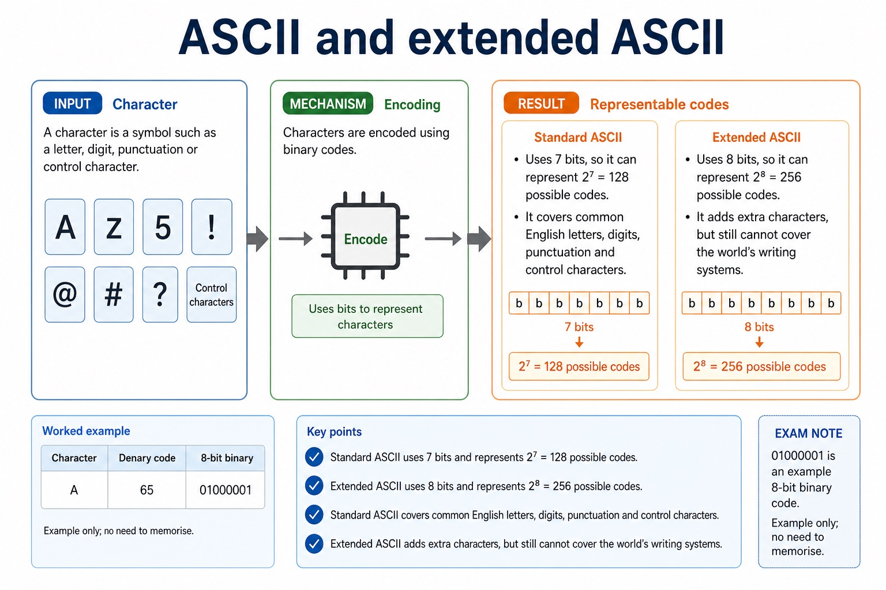

# Lesson 004: BCD, hexadecimal applications and character encoding

**Course:** Cambridge International AS Level Computer Science 9618, 2027-2029 Version 2 
**Paper:** Paper 1 
**Syllabus:** Section 1: Information representation 
**Syllabus requirements:** S1.06, S1.07 
**Pacing:** Flexible. This lesson is deliberately over-complete; select a quick, full or deep route for the learners in front of you.

## Teaching-depth menu

- **Quick route:** Use the diagnostic, learning objectives, first worked example and foundation question. Stop once the learner can explain the central distinction accurately.
- **Full route:** Teach every core explanation point, the worked example and all lesson questions. Use the visual only when it adds a different representation.
- **Deep route:** Add the prerequisite refresher, ask learners to connect the concept checklist, discuss the labelled extension and complete a transfer question without a model answer.

## 1. Prerequisite knowledge and quick diagnostic

Recall S1.02 before starting this lesson.

Ask the learner to give one accurate definition or method step before continuing. If they cannot, briefly revisit the named prerequisite rather than repeating the whole previous lesson.

### Optional prerequisite refresher

- The Version 2 row requires binary, denary, hexadecimal, Binary Coded Decimal (BCD), one's complement and two's complement; BCD and complements are representations rather than additional number bases.
- Show understanding of binary, denary and hexadecimal number systems, BCD, and one's- and two's-complement representations.

## 2. Knowledge explanation

### Learning objectives

- Describe practical applications where BCD and hexadecimal are used.
- Show understanding of character data in internal binary form using ASCII, extended ASCII and Unicode.

### Concept checklist for teacher choice

- BCD
- hexadecimal
- digital clock
- memory address
- ASCII
- extended ASCII
- Unicode
- character set
- binary
- not expected to memorise / not expected to memorize

### Detailed explanation

- Candidates must connect each representation to a practical use and explain why it suits that use, rather than only performing a conversion.
- Students should understand ASCII, extended ASCII and Unicode but are not expected to memorise particular character codes.
- BCD encodes each denary digit separately in four bits. For example, 59 becomes 0101 1001, not the pure-binary value 00111011.
- Only 0000 to 1001 are valid BCD digit groups. BCD is used where decimal digits must be displayed or processed exactly, such as digital clocks, calculators and financial displays, although it usually uses more bits than pure binary.
- Hexadecimal is used as a compact human-readable form of binary. One hex digit represents four bits, so hexadecimal is practical for memory addresses, machine-code/debug displays and colour values.
- A digital clock is a practical BCD application because each displayed denary digit maps directly to one four-bit BCD group.
- Representation overview: the required integer representations are binary, denary, hexadecimal, BCD, one's-complement and two's-complement. Conversion means preserving the integer value while changing its base or signed representation.
- A character set defines a collection of characters and assigns a numeric character code to each one. The code is stored internally in binary; the bit pattern is meaningful only when software interprets it using the agreed character set.
- Standard ASCII uses 7-bit codes, extended ASCII uses 8-bit codes, and Unicode provides code points for a much wider range of languages and symbols. Candidates are not expected to memorise particular character codes; a question must provide any code value needed for a conversion.

### Worked example

Choose a character set for worldwide text: A messaging system containing English, Chinese and Arabic text needs Unicode because its character repertoire is much wider than ASCII or extended ASCII. The chosen Unicode encoding stores the character codes as binary data.

Beyond syllabus / 延伸知识（不要求背诵）: real file formats also store headers and metadata, so two files with the same visible content may still have different sizes.

### Retained visual explanation

_ASCII and extended ASCII. The image and mobile text alternative come from one maintained fact source._

## 3. Practice by question type

### Question 1 - foundation - explain - 4 marks

Explain how the character 'A' is represented internally and why Unicode is preferred to ASCII for a multilingual website.

**Answer:** character set assigns A a numeric code; numeric code is stored as a binary bit pattern; Unicode represents a much wider range of characters/languages; applies the wider repertoire to the multilingual website

**Marking guidance:** Do not accept that changing a font changes the stored character code.

**Common error:** For the command word explain, perform that exact action; do not replace it with an unrelated fact.

### Question 2 - application - apply - 2 marks

What does a character set assign to each character?

**Answer:** A numeric character code that can be stored in binary.

**Marking guidance:** Award one mark for each distinct, technically accurate point or method step.

**Common error:** Do not repeat the same point in different words; each mark needs a separate idea or method step.

### Question 3 - transfer - explain - 2 marks

Why is BCD suitable for a digital clock?

**Answer:** Each displayed denary digit maps directly to one four-bit group.

**Marking guidance:** Award one mark for each distinct, technically accurate point or method step.

**Common error:** Do not copy the worked example unchanged; transfer the method and check it against the new context.

### Related past-paper indexes

| Reference | Marks | Command word | Question type |
|---|---:|---|---|
| 9618/13/S/25 Q1(ii) | 3 | complete | calculate |
| 9618/11/S/25 Q3(i) | 2 | complete | recall |
| 9618/11/S/25 Q3(ii) | 1 | complete | calculate |
| 9618/12/W/25 Q7(b) | 1 | complete | recall |

These are indexes only. Cambridge question and mark-scheme wording is not reproduced.

## 4. Summary and exam reminders

### Summary

- Define bcd, hexadecimal applications and character encoding with the exact technical vocabulary expected by the syllabus.
- Use the lesson method on a fresh context and show the intermediate decision, representation or calculation.
- Match the shape of the answer to the command word and the available marks.
- Check the final answer against the scenario instead of repeating a memorised sentence.

### Common error to correct

Students often treat binary digits as decoration. Correction: every bit position has a value; if the position changes, the value changes.

### Exam technique

- Follow the command word: state gives a fact; explain links a cause to a consequence; compare covers both sides.
- Match the number of independent points or method steps to the available marks.
- For bcd, hexadecimal applications and character encoding, use the exact technical term before applying it to the scenario.
