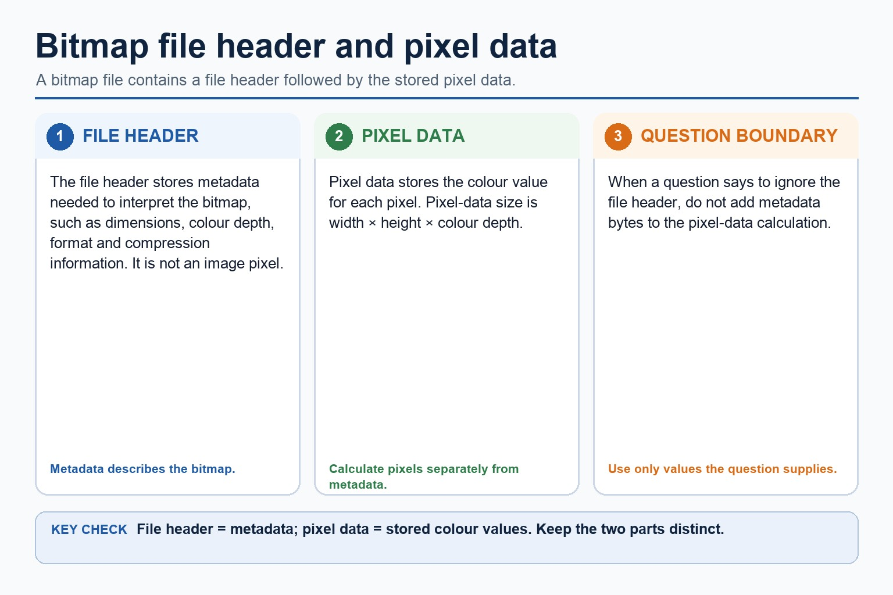
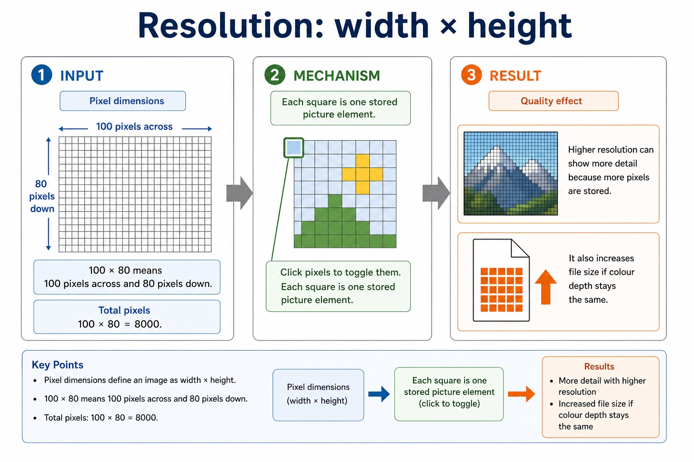
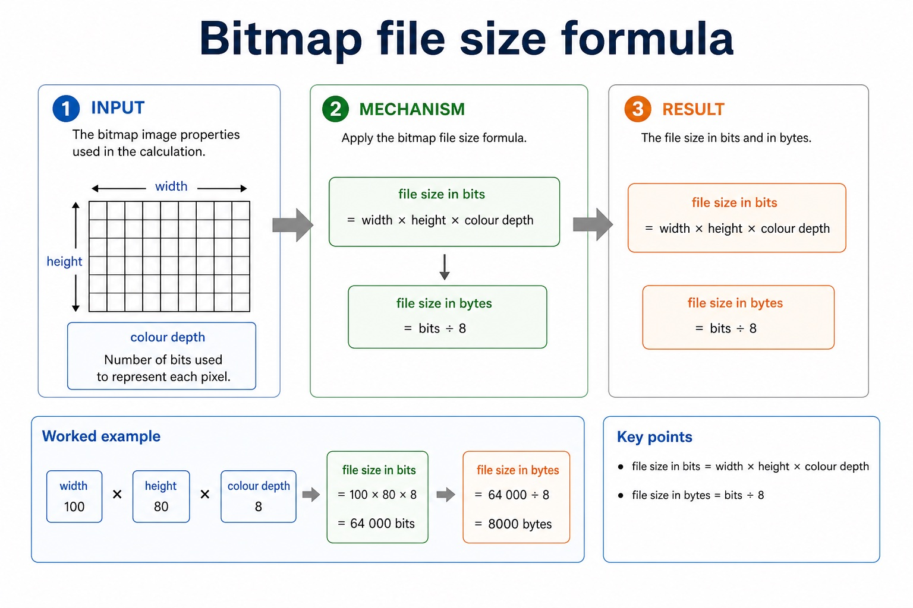
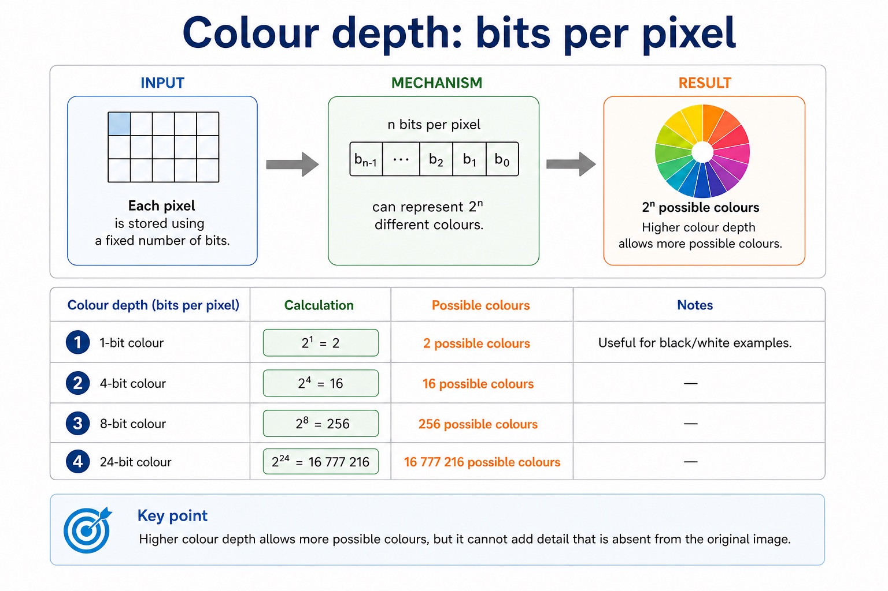
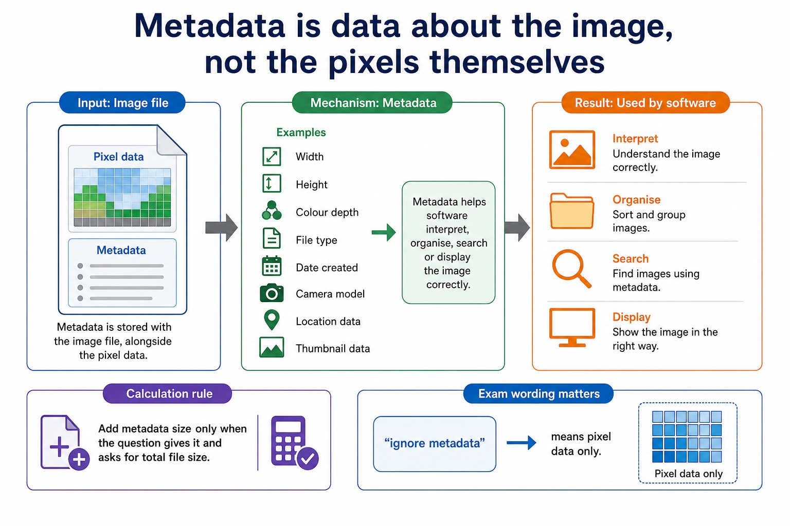
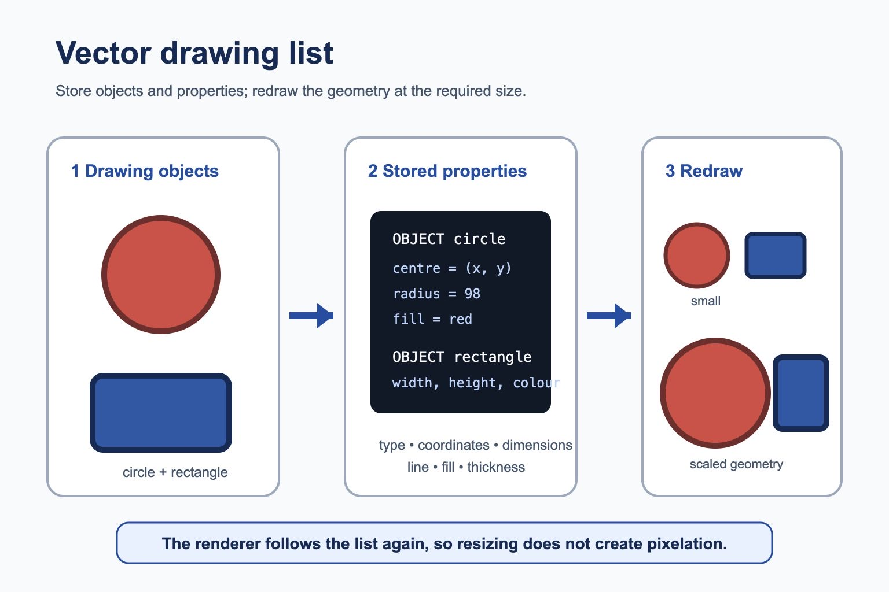
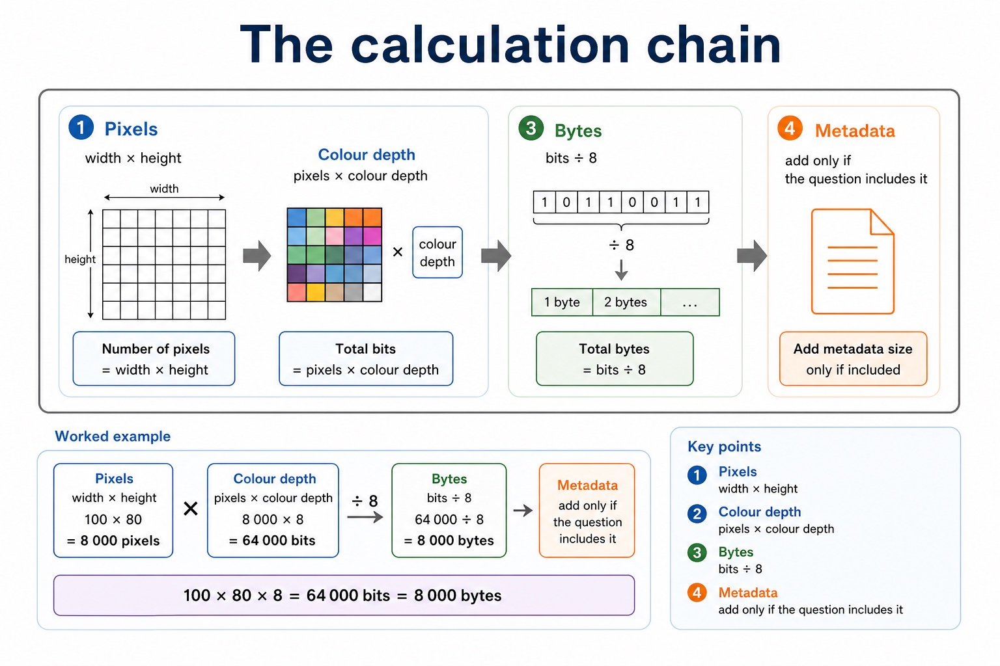
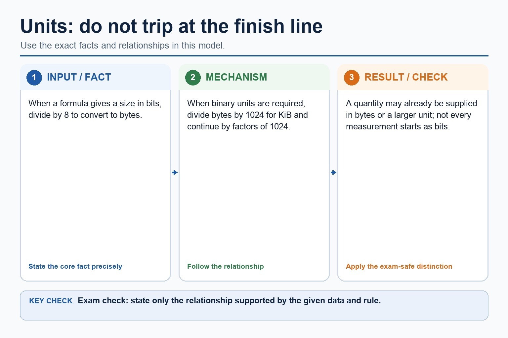
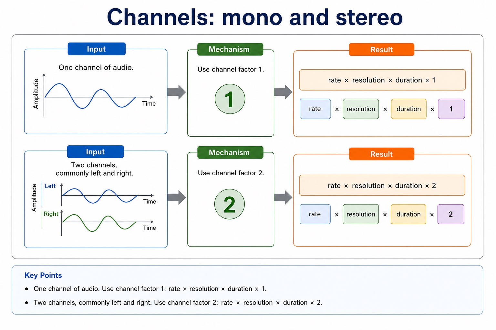
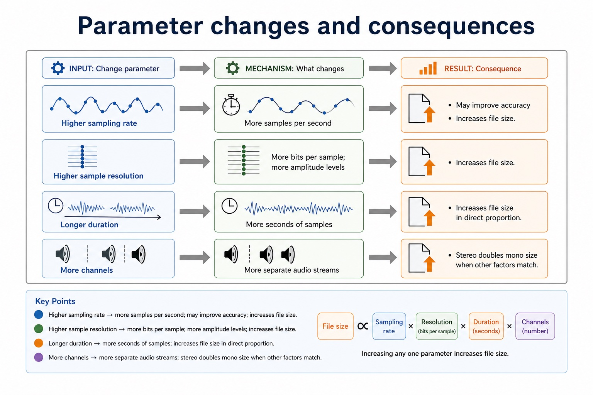

# Lesson 005: Bitmap and vector graphics

**Course:** Cambridge International AS Level Computer Science 9618, 2027-2029 Version 2 
**Paper:** Paper 1 
**Syllabus:** Section 1: Information representation 
**Syllabus requirements:** S1.08, S1.09 
**Pacing:** Flexible. Select the material set and practice depth needed by the learner.

## Teaching-depth menu

- **Quick route:** Use the diagnostic, learning objectives, first worked example and foundation question. Stop once the learner can explain the central distinction accurately.
- **Full route:** Use every knowledge-point material set, the worked method, the terminology check and all questions.
- **Deep route:** Add the prerequisite refresher, ask learners to connect the concept checklist, discuss the labelled extension and complete a transfer question without a model answer.

## 1. Prerequisite knowledge and quick diagnostic

Recall S1.01 before starting this lesson.

Ask the learner to give one accurate definition or method step before continuing. If they cannot, briefly revisit the named prerequisite rather than repeating the whole previous lesson.

### Optional prerequisite refresher

- Use and distinguish kibi/kilo, mebi/mega, gibi/giga and tebi/tera; binary prefixes use powers of 1024 and decimal prefixes use powers of 1000.
- Show understanding of binary magnitudes and the difference between binary prefixes and decimal prefixes.

## 2. Knowledge explanation

### 1. Pixel · File header · Pixel data · Image resolution (S1.08)

**Concept map:** pixel → file header → pixel data → image resolution → screen resolution → colour depth → ignore

**Three-part explanation:**

1. Use and understand the terms pixel, file header, image resolution, screen resolution and colour depth/bit depth
2. Required effects concern image resolution and colour depth/bit depth
3. When a calculation says to ignore the file header, calculate only width x height x colour depth

**Concrete cue:** Use and understand the terms pixel, file header, image resolution, screen resolution and colour depth/bit depth. Required effects concern image resolution and colour depth/bit depth.

#### Bitmap file header and pixel data

Text transcript

- A bitmap file contains a file header and stored pixel data.
- The header stores metadata needed to interpret the bitmap; it is not one of the image pixels.
- Pixel-data size is width multiplied by height multiplied by colour depth.
- When a question says to ignore the header, do not add metadata bytes to the pixel-data calculation.

#### Resolution: width multiplied by height

Text transcript

- Image resolution is the number of pixels stored in the image, commonly stated as width multiplied by height.
- A 100 by 80 image contains 8000 pixels.
- Higher image resolution can show more detail and increases file size when colour depth stays the same.
- Screen resolution describes the physical pixels available on a display and is separate from image resolution.

#### Bitmap file-size calculation

Text transcript

- Uncompressed bitmap pixel-data size in bits equals width multiplied by height multiplied by colour depth.
- Divide the number of bits by eight to convert the result to bytes.
- For a 100 by 80 bitmap with eight-bit colour, the pixel data uses 64000 bits or 8000 bytes.

#### Colour depth: bits per pixel

Text transcript

- Colour depth is the number of bits stored for each pixel.
- A colour depth of n bits provides two to the power n possible bit patterns for pixel colours.
- Higher colour depth allows more possible colours and increases uncompressed bitmap file size.
- Higher colour depth cannot add spatial detail that is missing from the source image.

#### Metadata is data about the image, not the pixels themselves

Text transcript

- Examples
- Width, height, colour depth, file type, date created, camera model, location data or thumbnail data.
- Metadata helps software interpret, organise, search or display the image correctly.
- Calculation rule
- Add metadata size only when the question gives it and asks for total file size.
- Exam wording matters: “ignore metadata” means pixel data only.

Precise syllabus wording

Show understanding of how data for a bitmapped image are encoded; perform calculations to estimate the file size for a bitmap image; show understanding of the effects of changing elements of a bitmap image on the image quality and file size.

Use and understand the terms pixel, file header, image resolution, screen resolution and colour depth/bit depth. Required effects concern image resolution and colour depth/bit depth.

### 2. Vector encoding · Drawing objects · Properties · Drawing list (S1.09)

**Concept map:** vector encoding → drawing objects → properties → drawing list → bitmap → given application

**Three-part explanation:**

1. a justification must connect bitmap/vector characteristics to the stated application
2. For a given application, justify bitmap or vector storage by connecting the image content and required editing or scaling to the chosen representation
3. Vector encoding stores a graphic as a drawing list of drawing objects

**Concrete cue:** Use drawing object, property and drawing list; a justification must connect bitmap/vector characteristics to the stated application.

#### Vector drawing list: objects, properties and redrawing

Text transcript

- A vector graphic stores a drawing list of objects rather than a fixed grid of pixels.
- Each object stores properties such as type, coordinates, dimensions, line colour, fill colour and line thickness.
- Software follows the stored instructions to redraw the objects at the required size without pixelation.

#### Bitmap file-size calculation

Text transcript

- Uncompressed bitmap pixel-data size in bits equals width multiplied by height multiplied by colour depth.
- Divide the number of bits by eight to convert the result to bytes.
- For a 100 by 80 bitmap with eight-bit colour, the pixel data uses 64000 bits or 8000 bytes.

#### Bitmap file header and pixel data

Text transcript

- A bitmap file contains a file header and stored pixel data.
- The header stores metadata needed to interpret the bitmap; it is not one of the image pixels.
- Pixel-data size is width multiplied by height multiplied by colour depth.
- When a question says to ignore the header, do not add metadata bytes to the pixel-data calculation.

Precise syllabus wording

Show understanding of vector-graphic encoding and justify bitmap or vector storage for a given task.

Use drawing object, property and drawing list; a justification must connect bitmap/vector characteristics to the stated application.

### Supporting diagram library

#### The calculation chain

Text transcript

- 1. Pixels
- width × height
- pixels × colour depth
- 3. Bytes
- bits ÷ 8
- 4. Metadata
- add only if the question includes it
- 100 × 80 × 8 = 64 000 bits = 8000 bytes

#### Units: do not trip at the finish line

Text transcript

- When a formula gives a size in bits, divide by 8 to convert to bytes.
- When binary units are required, divide bytes by 1024 for KiB and continue by factors of 1024.
- A quantity may already be supplied in bytes or a larger unit; not every measurement starts as bits.

#### Channels: mono and stereo

Text transcript

- One channel of audio. Use channel factor 1.
- rate × resolution × duration × 1
- Two channels, commonly left and right. Use channel factor 2.
- rate × resolution × duration × 2

#### The full uncompressed sound formula

Text transcript

- size in bits = sampling rate × sampling resolution × duration × channels
- size in bytes = bits ÷ 8
- KiB = bytes ÷ 1024; MiB = KiB ÷ 1024
- Sampling rate samples per second, measured in Hz
- Sampling resolution bits used for each sample
- Duration length of the sound in seconds
- Channels mono = 1, stereo = 2

#### Parameter changes and consequences

Text transcript

- Higher sampling rate
- More samples per second; may improve accuracy; increases file size.
- Higher sampling resolution
- More bits per sample; more amplitude levels; increases file size.
- Longer duration
- More seconds of samples; increases file size in direct proportion.
- More channels
- More separate audio streams; stereo doubles mono size when other factors match.

#### Unit conversion without changing the answer

Text transcript

- The formula gives bits first.
- 8 bits = 1 byte.
- 1 KiB = 1024 bytes.
- 1 MiB = 1024 KiB.
- Do not divide by 1000 when the question asks for KiB or MiB.

Open precise terminology and exam facts

- Use and understand the terms pixel, file header, image resolution, screen resolution and colour depth/bit depth. Required effects concern image resolution and colour depth/bit depth.
- Use drawing object, property and drawing list; a justification must connect bitmap/vector characteristics to the stated application.
- A bitmap file contains pixel data and a file header. The header stores metadata needed to interpret the file, such as its format and image properties; it is not one of the image pixels. When a calculation says to ignore the file header, calculate only width x height x colour depth.
- Image resolution is the number of pixels stored in the image, commonly width x height. Screen resolution is the number of physical display pixels available on the screen. They are independent: scaling an image on a screen does not create new captured detail.
- For an uncompressed bitmap, pixel-data size in bits is width in pixels x height in pixels x colour depth in bits per pixel. Divide by 8 to convert bits to bytes. Use the units requested by the question.
- Bitmap metadata is stored separately from pixel values, commonly in a file header. Add header or metadata bytes only when their size is supplied; when a question says to ignore the header, calculate pixel data only.
- Vector encoding stores a graphic as a drawing list of drawing objects. Each object has properties such as type, coordinates, dimensions, line colour, fill colour and line thickness; software redraws the objects from these instructions.
- Vectors scale without pixelation and suit logos, diagrams and shapes. Bitmaps store individual pixels and suit photographs or detailed textures. For a given application, the choice must be justified using the source image and intended editing or scaling.
- For a given application, justify bitmap or vector storage by connecting the image content and required editing or scaling to the chosen representation.

### Worked example

1. Calculate pixel data and then account for metadata
2. A 640 x 480 bitmap using 24-bit colour stores 640 x 480 x 24 = 7,372,800 bits = 921,600 bytes of pixel data.
3. With a supplied 54-byte header, the total is 921,654 bytes.

Beyond syllabus / 延伸知识（不要求背诵）: real file formats also store headers and metadata, so two files with the same visible content may still have different sizes.
## 3. Practice by question type

### Question 1 - foundation - explain - 4 marks

A designer creates a simple icon from circles and rectangles. Explain how it is stored as a vector graphic and give one advantage over a bitmap when resized.

**Answer:** stored as a drawing list / list of objects; stores object properties such as coordinates/dimensions/colour; software redraws objects from the descriptions; can be resized without pixelation / loss of shape quality

**Marking guidance:** Do not accept 'vector has better quality' unless scalability or object-based storage is explained.

**Common error:** For the command word explain, perform that exact action; do not replace it with an unrelated fact.

### Question 2 - application - calculate - 4 marks

A 200 by 100 bitmap uses 24-bit colour. Calculate its pixel-data size in bytes, ignoring the file header, and explain what has been excluded.

**Answer:** 200 x 100 x 24 bits; 480,000 bits / 60,000 bytes; file header contains metadata used to interpret the bitmap; header data is excluded because the question requests pixel data only

**Marking guidance:** Do not treat the file header as a pixel or silently add an invented header size.

**Common error:** Do not repeat the same point in different words; each mark needs a separate idea or method step.

### Question 3 - transfer - identify - 2 marks

Identify two properties stored for a vector object.

**Answer:** Any two of coordinates, dimensions, fill, line colour or line thickness.

**Marking guidance:** Award one mark for each distinct, technically accurate point or method step.

**Common error:** Do not copy the worked example unchanged; transfer the method and check it against the new context.

### Related past-paper indexes

| Reference | Marks | Command word | Question type |
|---|---:|---|---|
| 9618/13/S/25 Q1(ii) | 4 | calculate | calculate |
| 9618/13/W/25 Q7(d) | 4 | calculate | calculate |
| 9618/11/S/25 Q3(a) | 3 | complete | recall |
| 9618/13/W/25 Q7(c) | 3 | calculate | calculate |

These are indexes only. Cambridge question and mark-scheme wording is not reproduced.

## 4. Summary and exam reminders

### Summary

- Define bitmap and vector graphics with the exact technical vocabulary expected by the syllabus.
- Use the lesson method on a fresh context and show the intermediate decision, representation or calculation.
- Match the shape of the answer to the command word and the available marks.
- Check the final answer against the scenario instead of repeating a memorised sentence.

### Common error to correct

Students often say 'higher quality is always better'. Correction: higher quality can be wasteful if storage, bandwidth or purpose does not justify it.

### Exam technique

- Follow the command word: state gives a fact; explain links a cause to a consequence; compare covers both sides.
- Match the number of independent points or method steps to the available marks.
- For bitmap and vector graphics, use the exact technical term before applying it to the scenario.
