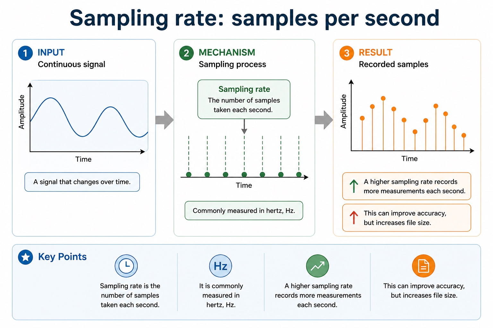
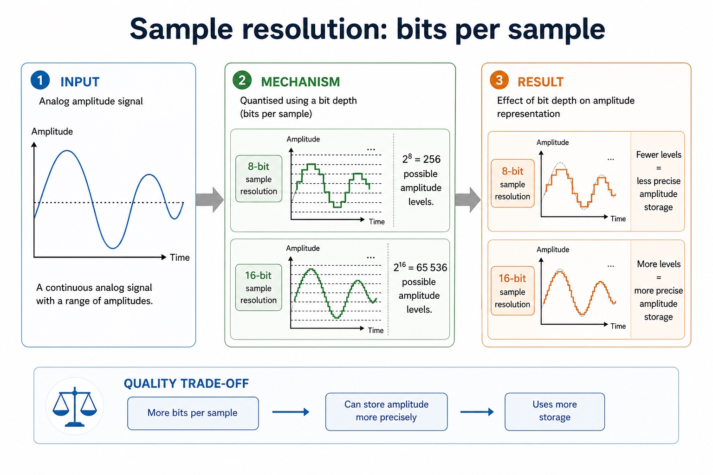
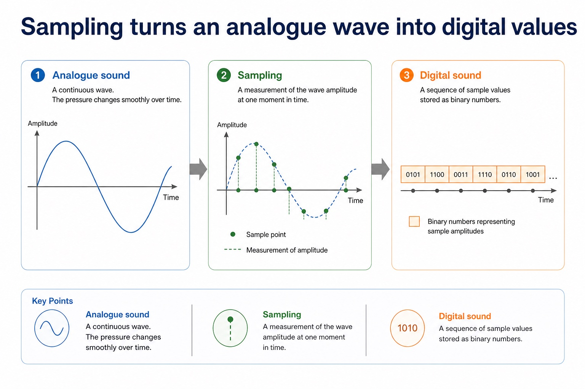
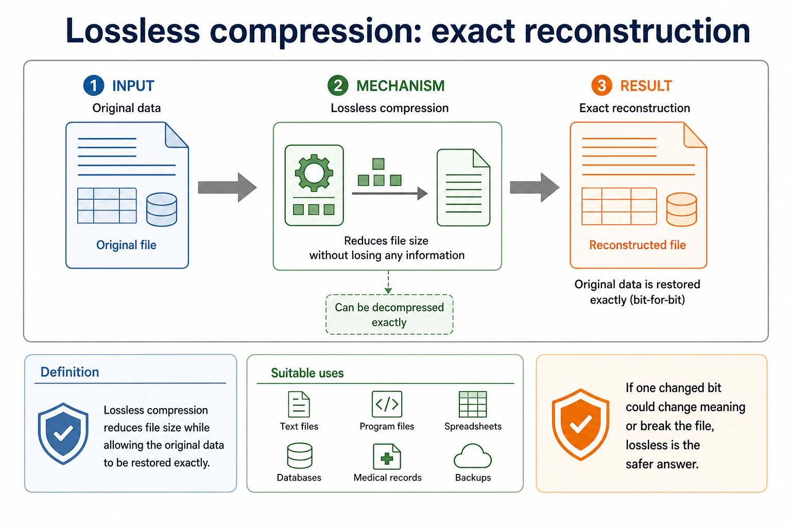
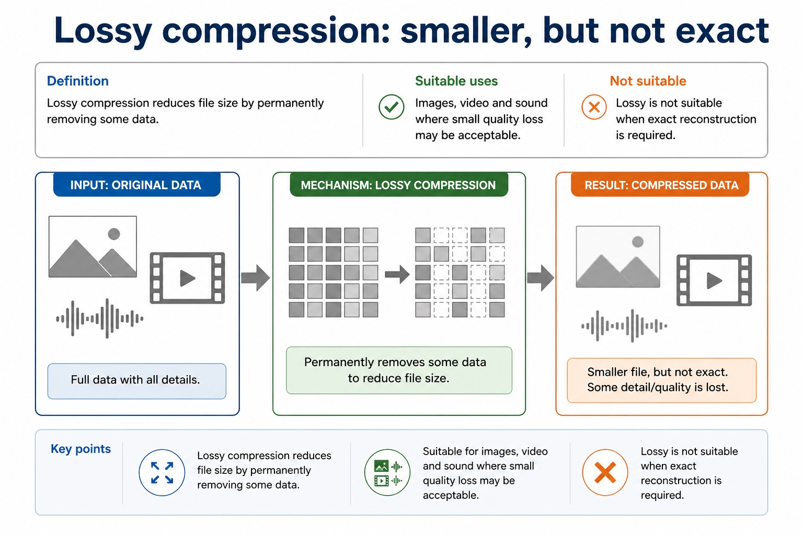
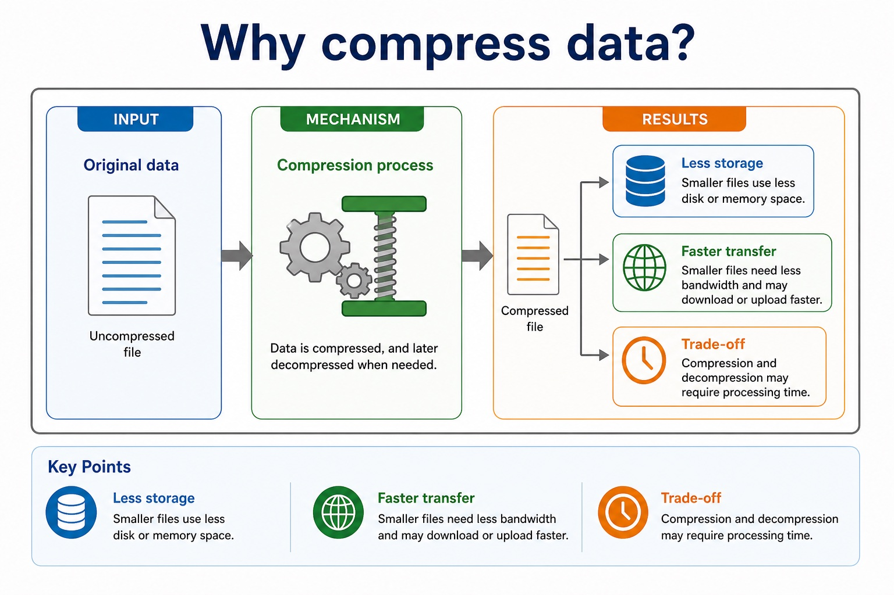
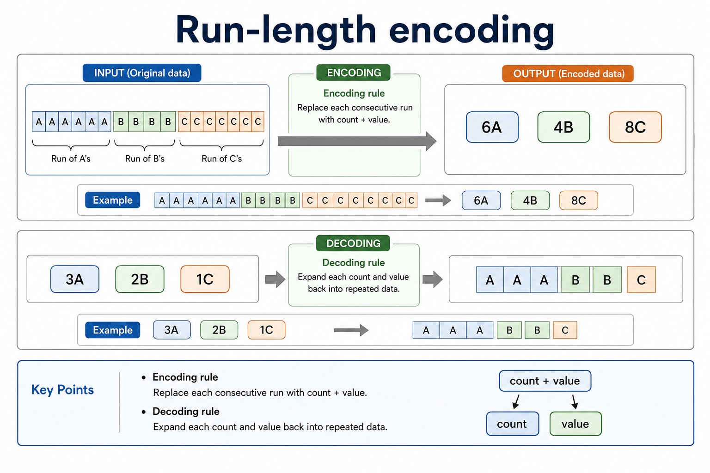

# Lesson 006: Sound representation and file compression

**Course:** Cambridge International AS Level Computer Science 9618, syllabus for examination in 2027-2029 
**Paper:** Paper 1 
**Syllabus:** Section 1: Information representation 
**Syllabus requirements:** S1.10, S1.11 
**Pacing:** Flexible. Select a quick, full or deep route for the learners in front of you.

## Teaching-depth menu

- **Quick route:** Use the diagnostic, learning objectives, first worked example and foundation question. Stop once the learner can explain the central distinction accurately.
- **Full route:** Teach every knowledge-point material set, the worked method and all lesson questions.
- **Deep route:** Add the prerequisite refresher, ask learners to connect the concept checklist, discuss the labelled extension and complete a transfer question without a model answer.

## 1. Prerequisite knowledge and quick diagnostic

Recall S1.01, S1.08, S1.09, S1.10 before starting this lesson.

Ask the learner to give one accurate definition or method step before continuing. If they cannot, briefly revisit the named prerequisite rather than repeating the whole previous lesson.

### Optional prerequisite refresher

- Use and distinguish kibi/kilo, mebi/mega, gibi/giga and tebi/tera; binary prefixes use powers of 1024 and decimal prefixes use powers of 1000.
- Show understanding of binary magnitudes and the difference between binary prefixes and decimal prefixes.
- Use and understand the terms pixel, file header, image resolution, screen resolution and colour depth/bit depth. Required effects concern image resolution and colour depth/bit depth.
- Show understanding of how data for a bitmapped image are encoded; perform calculations to estimate the file size for a bitmap image; show understanding of the effects of changing elements of a bitmap image on the image quality and file size.
- Use drawing object, property and drawing list; a justification must connect bitmap/vector characteristics to the stated application.
- Show understanding of vector-graphic encoding and justify bitmap or vector storage for a given task.

## 2. Knowledge explanation

### 1. Sampling measures a wave at discrete moments (S1.10)

**Concept relationships**

- **Analogue:** continuous wave
- **Sample:** one measurement
- **Rate:** samples per second
- **Resolution:** bits per sample
- **Accuracy:** closer approximation
- **File size:** more stored bits

**Mechanism**

1. **Measure the wave repeatedly** — Sampling rate controls how often amplitude is measured.
2. **Encode each measurement** — Sampling resolution controls the available amplitude levels.
3. **Balance accuracy and size** — Higher rate or resolution improves approximation but stores more data.

**Graph paper for sound:** Sampling rate adds more columns in time; sampling resolution adds more rows for amplitude. A finer grid follows the wave more closely.

#### Sampling rate: samples per second

Text transcript

- Definition
- Sampling rate is the number of samples taken each second.
- It is commonly measured in hertz, Hz.
- A higher sampling rate records more measurements each second.
- This can improve accuracy, but increases file size.

#### Sampling resolution: bits per sample

Text transcript

- Sampling resolution is the official syllabus term; sample resolution is a common synonym.
- An 8-bit sampling resolution provides 2^8 = 256 possible amplitude levels.
- A 16-bit sampling resolution provides 2^16 = 65,536 possible amplitude levels.
- More bits per sample can represent amplitude more precisely, but use more storage.

#### Sampling turns an analogue wave into digital values

Text transcript

- Analogue sound
- A continuous wave. The pressure changes smoothly over time.
- A measurement of the wave amplitude at one moment in time.
- Digital sound
- A sequence of sample values stored as binary numbers.

Precise syllabus wording

Show understanding of how sound is represented and encoded; show understanding of the impact of changing the sampling rate and resolution.

Use the terms sampling, sampling rate and sampling resolution. Explain the impact of changing sampling rate and sampling resolution on file size and accuracy; sound-file-size calculation is not stated as a compulsory requirement.

### 2. Compression removes or rewrites repeated information (S1.11)

**Concept relationships**

- **Need:** less storage or transfer
- **Lossless:** exact reconstruction
- **Lossy:** discarded detail
- **RLE:** count repeated runs
- **Text:** must preserve symbols
- **Media:** quality trade-off

**Mechanism**

1. **Find repeated or removable data** — Different file types contain different kinds of redundancy.
2. **Decide whether exactness matters** — Use lossless when every original bit must be reconstructed.
3. **Connect method to application** — State the size benefit and the acceptable quality consequence.

**Packing versus trimming:** RLE packs AAAABB as 4A2B without losing data. Lossy media compression trims detail that the chosen application can tolerate.

#### Lossless compression: exact reconstruction

Text transcript

- Definition
- Lossless compression reduces file size while allowing the original data to be restored exactly.
- Suitable uses
- Text files, program files, spreadsheets, databases, medical records and backups.
- If one changed bit could change meaning or break the file, lossless is the safer answer.

#### Lossy compression: smaller, but not exact

Text transcript

- Definition
- Lossy compression reduces file size by permanently removing some data.
- Suitable uses
- Images, video and sound where small quality loss may be acceptable.
- Lossy is not suitable when exact reconstruction is required.

#### Why compress data?

Text transcript

- Less storage
- Smaller files use less disk or memory space.
- Faster transfer
- Smaller files need less bandwidth and may download or upload faster.
- Trade-off
- Compression and decompression may require processing time.

#### Run-length encoding

Text transcript

- Encoding rule
- Replace each consecutive run with count + value.
- AAAAAABBBBCCCCCCCC → 6A4B8C
- Decoding rule
- Expand each count and value back into repeated data.
- 3A2B1C → AAABBC

Precise syllabus wording

Show understanding of the need for and examples of file compression; show understanding of lossy and lossless compression and justify a method for a given application; show understanding of how a text, bitmap, vector graphic and sound file can be compressed.

Run-length encoding (RLE) is the named example in the adjacent Notes and guidance.

Open precise terminology and exam facts

- Use the terms sampling, sampling rate and sampling resolution. Explain the impact of changing sampling rate and sampling resolution on file size and accuracy; sound-file-size calculation is not stated as a compulsory requirement.
- Run-length encoding (RLE) is the named example in the adjacent Notes and guidance.
- An analogue sound wave varies continuously. Analogue-to-digital sampling measures its amplitude at regular time intervals, quantises each measurement to one permitted level and stores the resulting sample value as a binary number. The sequence of binary sample values is the digital representation of the sound.
- Sampling rate is the number of samples taken per second, measured in hertz (Hz). Sampling resolution is the number of bits used for each sample and therefore controls how many amplitude levels are available. 'Sample resolution' is a common synonym, but sampling resolution is the official syllabus term.
- Increasing sampling rate stores more measurements each second, which can improve time accuracy and increases file size. Increasing sampling resolution stores more bits for each sample, which gives more amplitude levels, can improve amplitude accuracy and increases file size. The syllabus requires these effects, not a sound-file-size calculation formula.
- Compression represents a file using fewer bits. Lossless compression must reconstruct every original bit, so it is required where any change would alter meaning, such as program source or exact text. Lossy compression permanently discards selected detail and is suitable only when the resulting quality remains acceptable for the purpose.
- Text can be compressed losslessly by run-length encoding repeated characters or by replacing repeated words/strings with shorter dictionary references. Bitmap data can use run-length encoding when adjacent pixels repeat; lossy bitmap compression may reduce colour precision or discard fine spatial detail. RLE is effective only when the runs save more space than their symbol-count representation.
- A vector file stores drawing objects rather than pixels. It can be compressed losslessly by storing repeated shapes or properties once and referring to them, and by removing redundant object descriptions. Sound can use lossless pattern coding when exact samples are required, or lossy perceptual coding that removes less-audible sound information; reducing sample rate or sampling resolution also reduces data but changes the recording.
- Method choice depends on file type, repetition, required fidelity and use. A valid justification must connect the chosen method to what may or may not be discarded; naming 'lossy' or 'lossless' alone is not enough.

### Worked method

1. Choose methods for four files
2. Compress repeated spaces in a text log with RLE or a dictionary without changing the characters; compress a flat-colour bitmap logo with pixel-value RLE; store one repeated vector shape once…

Beyond syllabus / 延伸知识（不要求背诵）: real file formats also store headers and metadata, so two files with the same visible content may still have different sizes.
## 3. Practice by question type

### Question 1 - foundation - describe - 6 marks

For each of text, bitmap, vector and sound data, describe one suitable compression method and state whether it preserves the original data exactly.

**Answer:** text: lossless RLE or dictionary/token substitution with exact reconstruction; bitmap: RLE for repeated adjacent pixel values, or a valid lossy image method identified as non-exact; vector: stores repeated objects/properties once and uses references / removes redundant descriptions, losslessly; sound: lossless pattern coding for exact samples or perceptual lossy coding that removes less-audible detail; distinguishes exact lossless reconstruction from irreversible lossy removal; links at least one method to repetition, fidelity or intended use

**Marking guidance:** Do not award generic 'make the file smaller' statements without a method tied to the named media type.

**Common error:** For the command word describe, perform that exact action; do not replace it with an unrelated fact.

### Question 2 - application - explain - 4 marks

Explain how increasing (i) sampling rate and (ii) sampling resolution can affect the accuracy and file size of a digital sound recording.

**Answer:** higher sampling rate means more samples are stored each second; higher sampling rate can improve time accuracy and increases file size; higher sampling resolution means more bits/amplitude levels per sample; higher sampling resolution can improve amplitude accuracy and increases file size

**Marking guidance:** Do not interchange sampling rate and sampling resolution; rate controls measurements per second, while resolution controls bits/levels per measurement.

**Common error:** Do not repeat the same point in different words; each mark needs a separate idea or method step.

### Question 3 - transfer - give - 2 marks

Give one lossy method for sound and its trade-off.

**Answer:** Remove less-audible frequency/detail information, or reduce sample rate/resolution; the file is smaller but the discarded detail cannot be recovered.

**Marking guidance:** Award one mark for each distinct, technically accurate point or method step.

**Common error:** Do not copy the worked example unchanged; transfer the method and check it against the new context.

### Related past-paper indexes

| Reference | Marks | Command word | Question type |
|---|---:|---|---|
| 9618/11/S/25 Q2(ii) | 3 | explain | explain |
| 9618/13/S/25 Q1(b) | 3 | complete | calculate |
| 9618/13/W/25 Q1(a) | 3 | draw | calculate |
| 9618/11/S/25 Q2(c) | 2 | complete | recall |

These are indexes only. Cambridge question and mark-scheme wording is not reproduced.

## 4. Summary and exam reminders

### Summary

- Define sound representation and file compression with the exact technical vocabulary expected by the syllabus.
- Use the lesson method on a fresh context and show the intermediate decision, representation or calculation.
- Match the shape of the answer to the command word and the available marks.
- Check the final answer against the scenario instead of repeating a memorised sentence.

### Common error to correct

Students often assume compression always makes a file smaller. Correction: compression has overhead and depends on patterns in the data.

### Exam technique

- Follow the command word: state gives a fact; explain links a cause to a consequence; compare covers both sides.
- Match the number of independent points or method steps to the available marks.
- For sound representation and file compression, use the exact technical term before applying it to the scenario.
