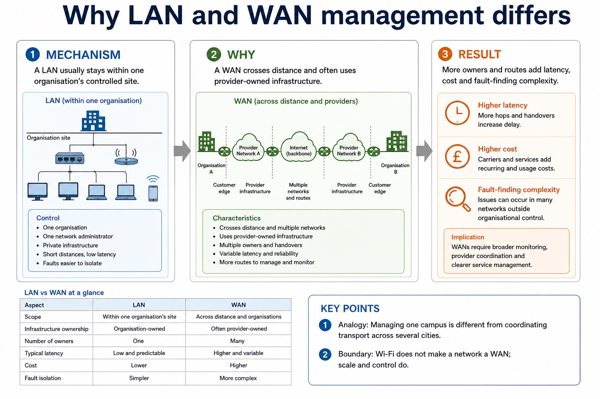
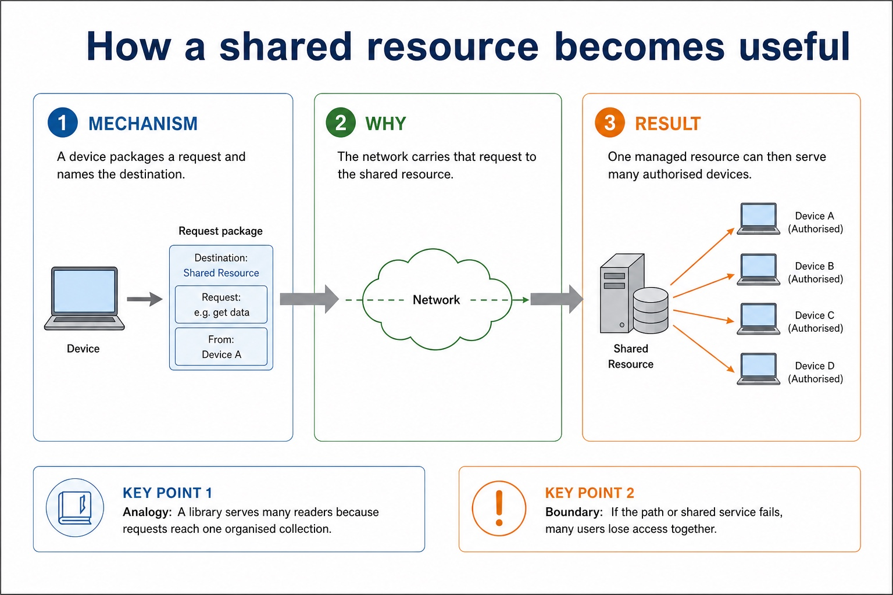
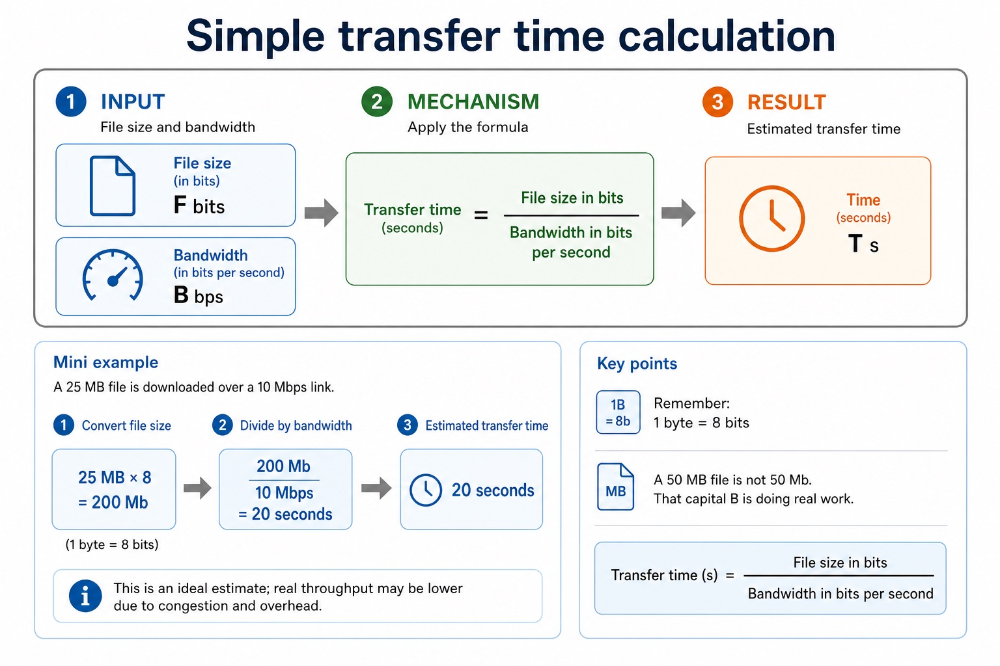
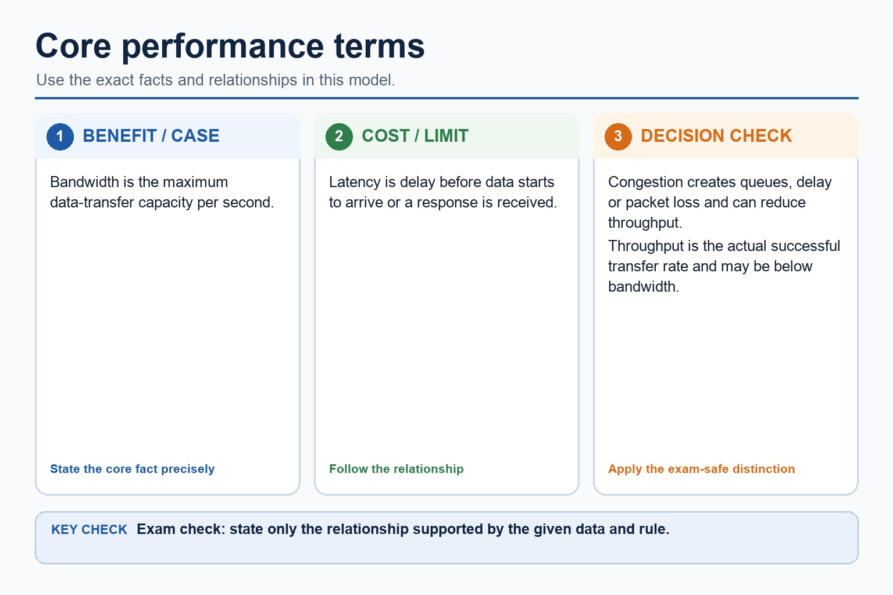
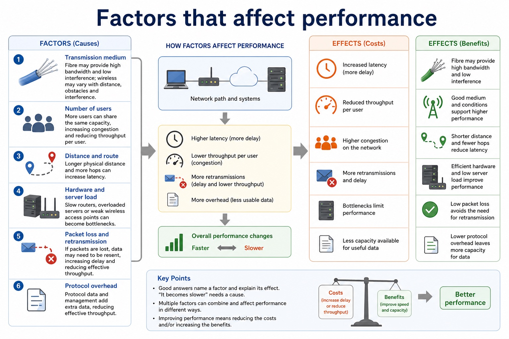

# Lesson 007: Network purposes, LANs, WANs and computer roles

**Course:** Cambridge International AS Level Computer Science 9618, 2027-2029 Version 2 
**Paper:** Paper 1 
**Syllabus:** Section 2: Communication 
**Syllabus requirements:** S2.01, S2.02, S2.03 
**Pacing:** Flexible. Select the material set and practice depth needed by the learner.

## Teaching-depth menu

- **Quick route:** Use the diagnostic, learning objectives, first worked example and foundation question. Stop once the learner can explain the central distinction accurately.
- **Full route:** Use every knowledge-point material set, the worked method, the terminology check and all questions.
- **Deep route:** Add the prerequisite refresher, ask learners to connect the concept checklist, discuss the labelled extension and complete a transfer question without a model answer.

## 1. Prerequisite knowledge and quick diagnostic

Recall S2.02 before starting this lesson.

Ask the learner to give one accurate definition or method step before continuing. If they cannot, briefly revisit the named prerequisite rather than repeating the whole previous lesson.

### Optional prerequisite refresher

- Evidence must cover the different computer roles in each model, balanced benefits and drawbacks, and a scenario-linked choice; a topology cannot substitute for a network model.
- Explain client-server and peer-to-peer models, their computer roles, benefits and drawbacks, and justify a model for a given situation.

## 2. Knowledge explanation

### 1. Networking devices · Benefits · LAN · WAN (S2.01)

**Concept map:** networking devices → benefits → LAN → WAN → limited geographical area → large geographical area

**Three-part explanation:**

1. A WAN covers a large geographical area, connects separate LANs or sites and commonly uses telecommunications-provider infrastructure
2. a WAN connects sites across a large area and commonly uses provider infrastructure
3. A LAN covers a limited geographical area such as one building or site and is normally owned or managed by one organisation

**Concrete cue:** A LAN covers a limited area and is normally managed by one organisation; a WAN connects sites across a large area and commonly uses provider infrastructure. Benefits must identify a…

#### Why LAN and WAN management differs

Text transcript

- A LAN usually stays within one organisation's controlled site.
- A WAN crosses distance and often uses provider-owned infrastructure.
- More owners and routes add latency, cost and fault-finding complexity.

#### Routers: forwarding between networks

Text transcript

- A router connects different networks and forwards packets towards their destination.
- Uses: IP addresses and routing information to choose a path.
- Common role: connects a LAN to the internet or to another network.
- Careful wording: a router does not simply "make WiFi". Some home boxes combine router and access point functions, but the jobs are distinct.
- Between networks
- LAN - router - internet / WAN
- Inside the LAN, MAC-address forwarding matters. Between networks, IP-address routing matters.

#### Wireless access points: joining wireless devices

Text transcript

- Wireless access point
- A wireless access point allows wireless devices to connect to a network using radio waves, often linking them to a wired LAN.
- Good exam phrase: provides wireless access to a network.
- Not enough: "it gives internet". Internet access may also require a router and wider network connection.
- Security link: access points can use authentication and encryption, but this lesson focuses on their network role.

#### Switches: forwarding inside a LAN

Text transcript

- A switch connects devices on a local area network and forwards frames to the correct device.
- Uses: MAC addresses to decide which port should receive the frame.
- Why useful: reduces unnecessary traffic compared with sending every frame everywhere.
- Exam wording: say "within a LAN" and "MAC address" when the scenario is local device-to-device traffic.
- LAN idea
- PC A - switch - PC B
- The switch is the traffic desk inside the local network. It does not decide the route across the wider internet.

Precise syllabus wording

Show understanding of the purpose and benefits of networking devices and the characteristics of LANs and WANs.

A LAN covers a limited area and is normally managed by one organisation; a WAN connects sites across a large area and commonly uses provider infrastructure. Benefits must identify a shared or centrally managed resource and its consequence.

### 2. Client-server · Peer-to-peer · Clients request · Servers provide (S2.02)

**Concept map:** client-server → peer-to-peer → clients request → servers provide → benefits → drawbacks → justified

**Three-part explanation:**

1. Evidence must cover the different computer roles in each model, balanced benefits and drawbacks, and a scenario-linked choice
2. a topology cannot substitute for a network model
3. To justify a topology, link the packet path, dependence on central hardware, alternative routes and failure behaviour to the given situation

**Concrete cue:** Evidence must cover the different computer roles in each model, balanced benefits and drawbacks, and a scenario-linked choice; a topology cannot substitute for a network model.

#### One model has equal peers; the other has dedicated service roles

Text transcript

- Visual explanation
- Follow the arrows and identify which devices can provide a resource.
- Peer-to-peer: every device can request and provide
- The lines show possible direct sharing between peers. They do not define a physical topology: peer-to-peer describes device roles.
- No dedicated central server is required.
- Each peer can request a file and provide one.
- A peer going offline can make its shared resource unavailable.
- Client-server: clients request a managed service

#### Scenario choices

Text transcript

- School accounts
- Client-server fits because logins, permissions and backups can be centrally managed.
- Small home sharing
- Peer-to-peer may fit when a few devices share files directly without a dedicated server.
- Public web app
- Client-server fits because many clients request data from managed servers.
- Distributed file sharing
- Peer-to-peer can spread sharing across peers, reducing reliance on one central source.

#### Client-server vs peer-to-peer

Text transcript

- Client-server
- Peer-to-peer
- Centralised management, security, backups and permissions.
- Decentralised control; each peer may manage its own resources.
- May need dedicated server hardware, software and administration.
- Can be cheaper for small networks because no dedicated server is required.
- Reliability
- Server failure may affect many clients unless redundancy is used.

Precise syllabus wording

Explain client-server and peer-to-peer models, their computer roles, benefits and drawbacks, and justify a model for a given situation.

Evidence must cover the different computer roles in each model, balanced benefits and drawbacks, and a scenario-linked choice; a topology cannot substitute for a network model.

### 3. Thin client · Thick client · Server processing · Local processing (S2.03)

**Concept map:** thin client → thick client → server processing → local processing

**Three-part explanation:**

1. Thin/thick describes where processing, software and storage reside
2. Thin clients support central software management and reduce local storage, but the school must provide resilient servers and networking because a failure can stop the room
3. it must not be treated as a synonym for client-server/peer-to-peer

**Concrete cue:** A school computer room may use thin clients for central updates, but a server or network failure then affects the whole room.

Precise syllabus wording

Show understanding of thin-client and thick-client computers and the differences between them.

Thin/thick describes where processing, software and storage reside; it must not be treated as a synonym for client-server/peer-to-peer.

### Supporting diagram library

#### How a shared resource becomes useful

Text transcript

- A device packages a request and names the destination.
- The network carries that request to the shared resource.
- One managed resource can then serve many authorised devices.

#### Why connection patterns change risk

Text transcript

- A topology diagram's link count must match the physical links actually drawn.
- Alternative paths improve resilience but require additional links and ports.
- Use one consistent topology in the mechanism and result views; this example has nine links including the inter-switch link.

#### Simple transfer time calculation

Text transcript

- Transfer time = file size in bits / bandwidth in bits per second
- Remember: 1 byte = 8 bits . A 50 MB file is not 50 Mb. That capital B is doing real work.
- Mini example
- A 25 MB file is downloaded over a 10 Mbps link.
- Convert file size: 25 MB x 8 = 200 Mb .
- Divide by bandwidth: 200 Mb / 10 Mbps = 20 seconds .
- This is an ideal estimate; real throughput may be lower due to congestion and overhead.

#### Core performance terms

Text transcript

- Bandwidth is the maximum data-transfer capacity per second.
- Latency is delay before data starts to arrive or a response is received.
- Congestion creates queues, delay or packet loss and can reduce throughput.
- Throughput is the actual successful transfer rate and may be below bandwidth.

#### Factors that affect performance

Text transcript

- Good answers name a factor and explain its effect. "It becomes slower" needs a cause.
- Transmission medium
- Fibre may provide high bandwidth and low interference; wireless may vary with distance, obstacles and interference.
- Number of users
- More users can share the same capacity, increasing congestion and reducing throughput per user.
- Distance and route
- Longer physical distance and more hops can increase latency.
- Hardware and server load

Open precise terminology and exam facts

- A LAN covers a limited area and is normally managed by one organisation; a WAN connects sites across a large area and commonly uses provider infrastructure. Benefits must identify a shared or centrally managed resource and its consequence.
- Evidence must cover the different computer roles in each model, balanced benefits and drawbacks, and a scenario-linked choice; a topology cannot substitute for a network model.
- Thin/thick describes where processing, software and storage reside; it must not be treated as a synonym for client-server/peer-to-peer.
- Networking devices allow computers and users to share resources such as files, printers, storage and an internet connection. A network can also support communication, collaboration, central account management, central backup and access to shared services. A benefit must identify what is shared or managed and explain the consequence; 'it is easier' is not enough.
- A LAN covers a limited geographical area such as one building or site and is normally owned or managed by one organisation. A WAN covers a large geographical area, connects separate LANs or sites and commonly uses telecommunications-provider infrastructure. LAN and WAN describe scope and management, not a guaranteed speed.
- In a bus topology, devices attach to one shared backbone cable and a transmitted signal travels along that shared medium. In a star topology, every device has a separate link to a central switch and each frame passes through that switch. In a mesh topology, nodes have multiple interconnections so packets may use alternative routes. A hybrid topology combines two or more topology patterns, for example two star segments connected by a backbone.
- Topology choice must be justified from packet path, failure effect, redundancy, cabling cost, expansion and traffic. A star isolates most individual cable faults but the central switch is a single point of failure; a mesh offers alternative paths but needs more links and management; a bus uses less cable but the shared backbone and shared traffic are weaknesses.
- In a client-server model, clients request services or resources and one or more servers provide them. Dedicated server roles can include authentication, file storage, web hosting and backup. Central management, consistent access control and central backup are benefits; server cost, specialist administration, dependence on the server and a possible central failure are drawbacks.
- In a peer-to-peer model, each peer may request and provide resources directly. It can be inexpensive and simple for a small trusted group because no dedicated server is required, but distributed accounts, backups, security and availability become harder to control. A model choice must be justified from number of users, trust, management, availability, cost and the required shared services.
- A thin client relies mainly on a server for processing and/or storage. A thick client performs more processing locally and normally stores more software or data on the client device. Thin clients simplify central updates and can use lower-specification hardware, but depend heavily on the server and network. Thick clients can continue more work when disconnected, but local installation, security and maintenance are distributed.
- To justify a topology, link the packet path, dependence on central hardware, alternative routes and failure behaviour to the given situation.

### Worked example

1. Choose a topology for a two-building clinic
2. Choose a model and client type for a school examination room
3. Use a star LAN inside each building so individual devices have independent links to a central switch.
4. Connect the two stars to form a hybrid network.
5. If the inter-building link is safety-critical, add a second path
6. packets can use the alternative route after one link fails, at extra cost.

Beyond syllabus / 延伸知识（不要求背诵）: real networks organise communication in layers so that hardware, addressing and application protocols can change independently.
## 3. Practice by question type

### Question 1 - foundation - explain - 8 marks

A college is replacing one shared bus network with star LANs connected into a hybrid topology. Explain two networking benefits and justify the topology change. A call centre is choosing a client-server model with thin clients. Explain two benefits and two drawbacks of this combined choice.

**Answer:** one developed resource-sharing, communication or central-management benefit; a second distinct developed networking benefit; star frames pass through a central switch and an individual cable failure normally affects one device; hybrid combines topology patterns / connects the star segments; justification links reliability, expansion, traffic or cost to the college; centralised accounts/software/update or data management; lower client hardware/storage requirement; depends on network/server availability or performance; server infrastructure, administration or central-failure cost; develops at least one point in the call-centre context

**Marking guidance:** Do not award generic benefits or a topology name without a path/failure consequence. Do not award 'cheaper' unless the lower client specification or central administration explains why; do not confuse network model with topology.

**Common error:** For the command word explain, perform that exact action; do not replace it with an unrelated fact.

### Question 2 - application - compare - 2 marks

Compare a LAN from a WAN using geographical scope and management.

**Answer:** A LAN covers a limited site and is normally managed by one organisation; a WAN connects sites over a large area and often uses provider infrastructure.

**Marking guidance:** Award one mark for each distinct, technically accurate point or method step.

**Common error:** Do not repeat the same point in different words; each mark needs a separate idea or method step.

### Question 3 - transfer - state - 2 marks

State the roles of a client and server.

**Answer:** A client requests a service or resource; a server provides and manages the service or resource.

**Marking guidance:** Award one mark for each distinct, technically accurate point or method step.

**Common error:** Do not copy the worked example unchanged; transfer the method and check it against the new context.

### Related past-paper indexes

| Reference | Marks | Command word | Question type |
|---|---:|---|---|
| 9618/12/S/25 Q6(c) | 6 | complete | recall |
| 9618/12/S/25 Q6(b) | 4 | explain | explain |
| 9618/12/S/25 Q6(e) | 3 | complete | recall |
| 9618/12/S/25 Q6(a) | 2 | state | recall |

These are indexes only. Cambridge question and mark-scheme wording is not reproduced.

## 4. Summary and exam reminders

### Summary

- Define network purposes, lans, wans and computer roles with the exact technical vocabulary expected by the syllabus.
- Use the lesson method on a fresh context and show the intermediate decision, representation or calculation.
- Match the shape of the answer to the command word and the available marks.
- Check the final answer against the scenario instead of repeating a memorised sentence.

### Common error to correct

Students often confuse bandwidth with speed in every sense. Correction: bandwidth is capacity; latency and congestion also affect perceived performance.

### Exam technique

- Follow the command word: state gives a fact; explain links a cause to a consequence; compare covers both sides.
- Match the number of independent points or method steps to the available marks.
- For network purposes, lans, wans and computer roles, use the exact technical term before applying it to the scenario.
