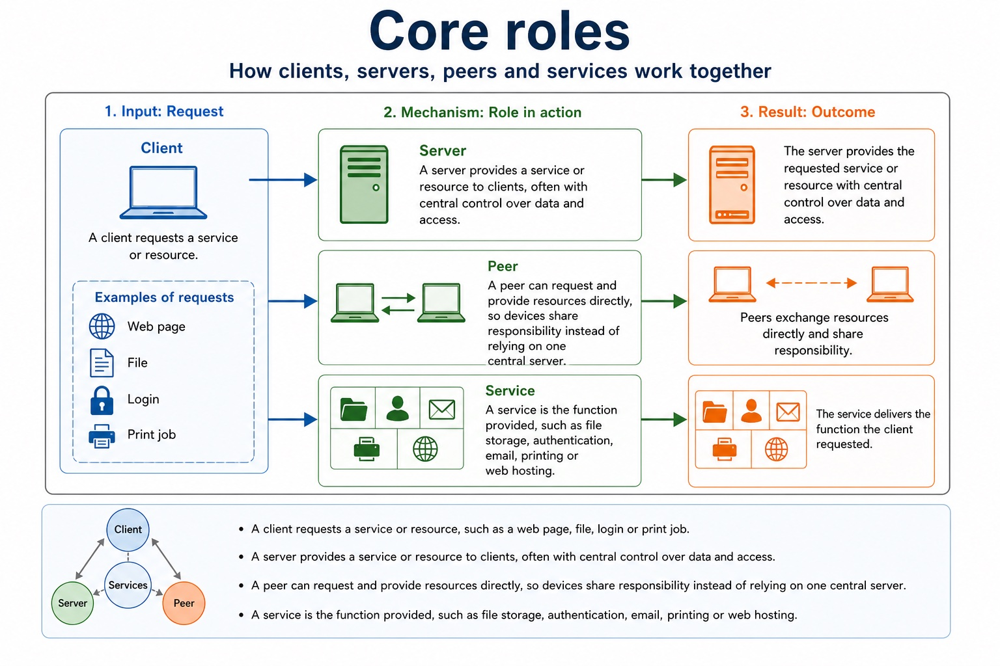
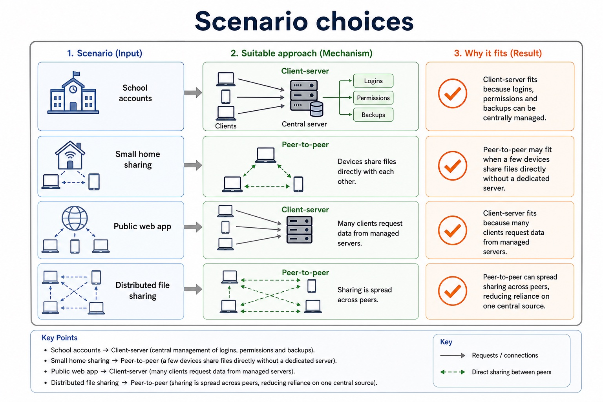
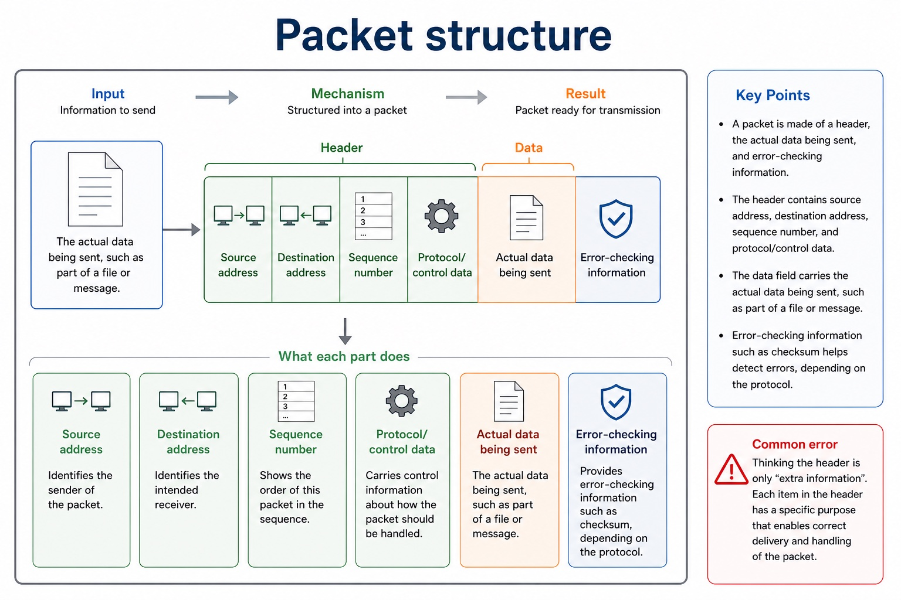
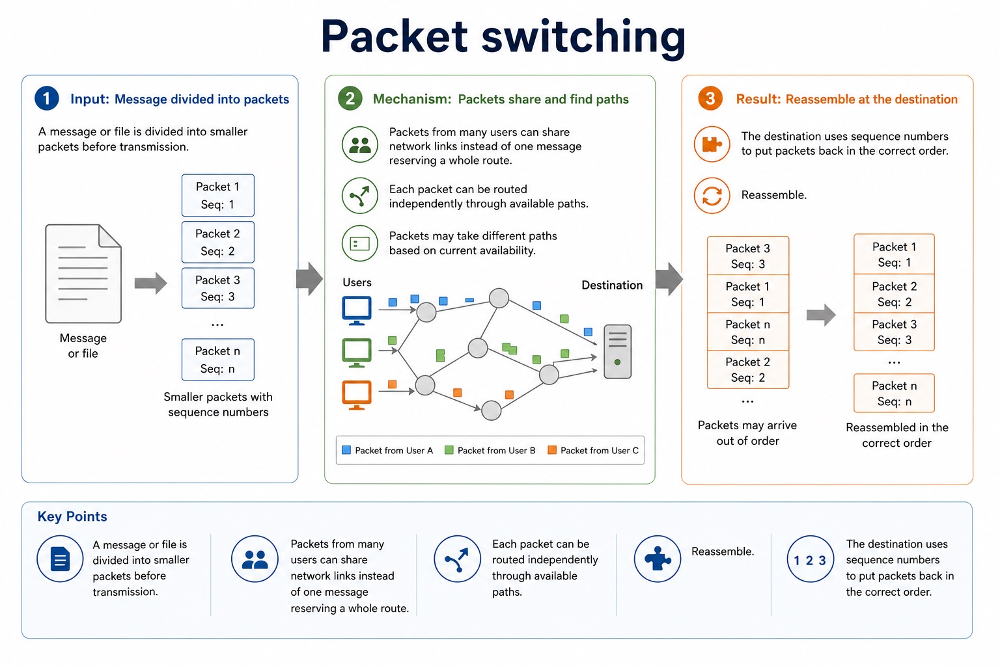

# Lesson 008: Network topologies and packet transmission

**Course:** Cambridge International AS Level Computer Science 9618, 2027-2029 Version 2 
**Paper:** Paper 1 
**Syllabus:** Section 2: Communication 
**Syllabus requirements:** S2.04, S2.05 
**Pacing:** Flexible. Select the material set and practice depth needed by the learner.

## Teaching-depth menu

- **Quick route:** Use the diagnostic, learning objectives, first worked example and foundation question. Stop once the learner can explain the central distinction accurately.
- **Full route:** Use every knowledge-point material set, the worked method, the terminology check and all questions.
- **Deep route:** Add the prerequisite refresher, ask learners to connect the concept checklist, discuss the labelled extension and complete a transfer question without a model answer.

## 1. Prerequisite knowledge and quick diagnostic

Recall S2.04 before starting this lesson.

Ask the learner to give one accurate definition or method step before continuing. If they cannot, briefly revisit the named prerequisite rather than repeating the whole previous lesson.

### Optional prerequisite refresher

- All four named topologies are required. A hybrid combines two or more topology patterns; it is not merely a large network.
- Show understanding of bus, star, mesh and hybrid network topologies.

## 2. Knowledge explanation

### 1. Bus topology · Star topology · Mesh topology · Hybrid topology (S2.04)

**Concept map:** bus topology → star topology → mesh topology → hybrid topology

**Three-part explanation:**

1. A hybrid combines two or more topology patterns
2. All four named topologies are required
3. it is not merely a large network

**Concrete cue:** In a star network, one broken cable isolates one device; a failed central switch can disconnect every attached device.

Precise syllabus wording

Show understanding of bus, star, mesh and hybrid network topologies.

All four named topologies are required. A hybrid combines two or more topology patterns; it is not merely a large network.

### 2. Packet paths in bus, star, mesh and hybrid networks (S2.05)

**Concept map:** between two hosts → bus → central switch → alternative routes → hybrid → justify

**Three-part explanation:**

1. To justify a topology choice, connect its packet path and failure behaviour to the stated scenario
2. A justification must link the path and failure behaviour to the scenario
3. Topology justification must connect the packet path to the scenario

**Concrete cue:** In a mesh, a packet can take another route after a link fails; on a bus, every device shares the same backbone.

Precise syllabus wording

Explain how packets are transmitted between two hosts for a given topology and justify topology choice for a given situation.

Packet or signal paths must be explicit for bus, star, mesh and hybrid. A justification must link the path and failure behaviour to the scenario.

### Supporting diagram library

#### Client-server vs peer-to-peer

Text transcript

- Client-server
- Peer-to-peer
- Centralised management, security, backups and permissions.
- Decentralised control; each peer may manage its own resources.
- May need dedicated server hardware, software and administration.
- Can be cheaper for small networks because no dedicated server is required.
- Reliability
- Server failure may affect many clients unless redundancy is used.

#### One model has equal peers; the other has dedicated service roles

Text transcript

- Visual explanation
- Follow the arrows and identify which devices can provide a resource.
- Peer-to-peer: every device can request and provide
- The lines show possible direct sharing between peers. They do not define a physical topology: peer-to-peer describes device roles.
- No dedicated central server is required.
- Each peer can request a file and provide one.
- A peer going offline can make its shared resource unavailable.
- Client-server: clients request a managed service

#### Core roles

Text transcript

- A client requests a service or resource, such as a web page, file, login or print job.
- A server provides a service or resource to clients, often with central control over data and access.
- A peer can request and provide resources directly, so devices share responsibility instead of relying on one central server.
- A service is the function provided, such as file storage, authentication, email, printing or web hosting.

#### Scenario choices

Text transcript

- School accounts
- Client-server fits because logins, permissions and backups can be centrally managed.
- Small home sharing
- Peer-to-peer may fit when a few devices share files directly without a dedicated server.
- Public web app
- Client-server fits because many clients request data from managed servers.
- Distributed file sharing
- Peer-to-peer can spread sharing across peers, reducing reliance on one central source.

#### One message, several routes, one reassembled result

Text transcript

- Visual explanation
- Follow the numbered packets. Routers make next-hop decisions, so packets from one message do not need to travel together.
- 1. Split and label Each packet carries payload plus control data such as addresses and a sequence number.
- 2. Choose next hop Each router uses the destination address and routing information.
- 3. Travel independently Different routes can produce different arrival times.
- 4. Reassemble The receiver uses sequence numbers to restore the original order.
- Check the diagram: why can packet 2 arrive after packet 3?
- Packet 2 can take a different route with a longer delay. The receiver uses sequence numbers to place it back between packets 1 and 3.

#### Routing and arrival

Text transcript

- Router decision Routers forward packets based on destination address and routing information.
- Different paths Packets from the same message may take different routes through the network.
- Out of order Packets may arrive in a different order because routes have different delays.
- Error handling Checksum/error checks can detect corruption; missing/corrupt packets may be requested again.

#### Packet structure

Text transcript

- Source address, destination address, sequence number, protocol/control data.
- The actual data being sent, such as part of a file or message.
- Error-checking information such as checksum, depending on the protocol.
- Common error
- Do not describe the header as “extra information” only. Name what is inside it and what each item does.

#### Packet switching

Text transcript

- A message or file is divided into smaller packets before transmission.
- Packets from many users can share network links instead of one message reserving a whole route.
- Each packet can be routed independently through available paths.
- Reassemble
- The destination uses sequence numbers to put packets back in the correct order.

Open precise terminology and exam facts

- All four named topologies are required. A hybrid combines two or more topology patterns; it is not merely a large network.
- Packet or signal paths must be explicit for bus, star, mesh and hybrid. A justification must link the path and failure behaviour to the scenario.
- A topology describes the pattern of links between devices. In a bus topology devices share one backbone; in a star topology each device has a separate link to a central switch; in a mesh topology nodes have multiple interconnections; a hybrid topology combines two or more topology patterns.
- Compare topologies using packet path, single points of failure, alternative routes, cabling, expansion and traffic. A topology name without a path or failure consequence is not a developed explanation.
- To describe transmission between two hosts, identify the physical or logical path used. In a bus, the signal travels along the shared backbone and attached devices inspect it. In a star, the source sends a frame to the central switch, which forwards it towards the destination device. In a mesh, packets can be forwarded through one of several alternative routes. In a hybrid, the path follows each component topology, for example source to local switch, across a connecting backbone, then through the destination switch.
- Topology justification must connect the packet path to the scenario: central-device failure, backbone failure, individual cable failure, congestion, expansion, redundancy and cabling cost are consequences of the structure.
- To justify a topology choice, connect its packet path and failure behaviour to the stated scenario.

### Worked example

1. Send a patient record across a hybrid hospital network
2. The source sends the frame to its ward switch as in a star.
3. The packet crosses the link between ward segments, then the destination switch forwards the local frame to the receiving host.
4. A redundant inter-switch route can keep packets moving after one link fails, but adds cost and management.

Beyond syllabus / 延伸知识（不要求背诵）: real networks organise communication in layers so that hardware, addressing and application protocols can change independently.
## 3. Practice by question type

### Question 1 - foundation - compare - 4 marks

Compare star and mesh topologies for a hospital network and justify one choice.

**Answer:** accurate star path; accurate mesh path; developed failure or cost comparison; scenario-linked justification

**Marking guidance:** Do not credit a topology name without an accurate connection pattern and consequence.

**Common error:** For the command word compare, perform that exact action; do not replace it with an unrelated fact.

### Question 2 - application - explain - 2 marks

How is a transmission carried between two hosts in a bus topology?

**Answer:** The signal travels along the shared backbone and the attached hosts inspect it.

**Marking guidance:** Award one mark for each distinct, technically accurate point or method step.

**Common error:** Do not repeat the same point in different words; each mark needs a separate idea or method step.

### Question 3 - transfer - describe - 2 marks

Describe one possible packet path through a hybrid made from two stars.

**Answer:** Source to its switch, across the link between star segments, then through the destination switch to the receiving host.

**Marking guidance:** Award one mark for each distinct, technically accurate point or method step.

**Common error:** Do not copy the worked example unchanged; transfer the method and check it against the new context.

### Related past-paper indexes

| Reference | Marks | Command word | Question type |
|---|---:|---|---|
| 9618/12/W/25 Q5(c) | 3 | complete | recall |
| 9618/12/W/25 Q5(d) | 3 | complete | recall |
| 9618/12/W/25 Q5(e) | 3 | complete | recall |
| 9618/11/S/24 Q8(a) | 5 | identify | recall |

These are indexes only. Cambridge question and mark-scheme wording is not reproduced.

## 4. Summary and exam reminders

### Summary

- Define network topologies and packet transmission with the exact technical vocabulary expected by the syllabus.
- Use the lesson method on a fresh context and show the intermediate decision, representation or calculation.
- Match the shape of the answer to the command word and the available marks.
- Check the final answer against the scenario instead of repeating a memorised sentence.

### Common error to correct

Students often confuse bandwidth with speed in every sense. Correction: bandwidth is capacity; latency and congestion also affect perceived performance.

### Exam technique

- Follow the command word: state gives a fact; explain links a cause to a consequence; compare covers both sides.
- Match the number of independent points or method steps to the available marks.
- For network topologies and packet transmission, use the exact technical term before applying it to the scenario.
