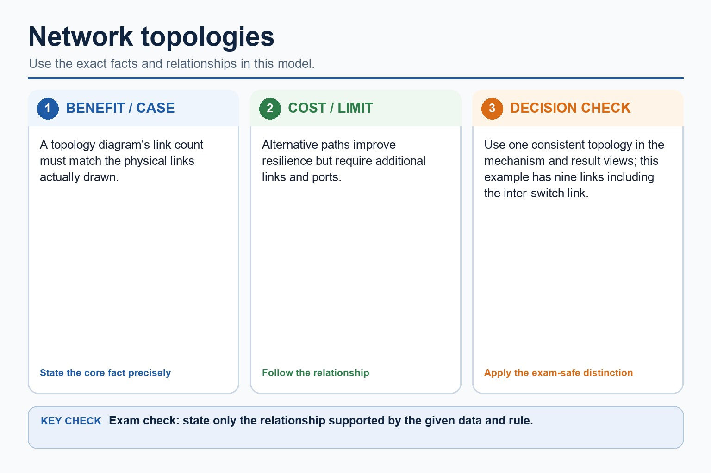
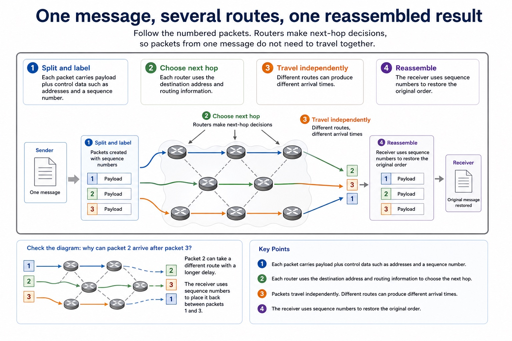

# Lesson 008: Network topologies and packet transmission

**Course:** Cambridge International AS Level Computer Science 9618, syllabus for examination in 2027-2029 
**Paper:** Paper 1 
**Syllabus:** Section 2: Communication 
**Syllabus requirements:** S2.04, S2.05 
**Pacing:** Flexible. Select a quick, full or deep route for the learners in front of you.

## Teaching-depth menu

- **Quick route:** Use the diagnostic, learning objectives, first worked example and foundation question. Stop once the learner can explain the central distinction accurately.
- **Full route:** Teach every knowledge-point material set, the worked method and all lesson questions.
- **Deep route:** Add the prerequisite refresher, ask learners to connect the concept checklist, discuss the labelled extension and complete a transfer question without a model answer.

## 1. Prerequisite knowledge and quick diagnostic

Recall S2.04 before starting this lesson.

Ask the learner to give one accurate definition or method step before continuing. If they cannot, briefly revisit the named prerequisite rather than repeating the whole previous lesson.

### Optional prerequisite refresher

- All four named topologies are required. A hybrid combines two or more topology patterns; it is not merely a large network.
- Show understanding of bus, star, mesh and hybrid network topologies.

## 2. Knowledge explanation

### 1. Bus, star, mesh and hybrid network topologies (S2.04)

**Atomic learning targets**

- **S2.04.A01:** bus topology
- **S2.04.A02:** star topology
- **S2.04.A03:** mesh topology
- **S2.04.A04:** hybrid topology

**Core explanation**

- A topology describes the pattern of links between devices. In a bus topology devices share one backbone; in a star topology each device has a separate link to a central switch; in a mesh topology nodes have multiple interconnections; a hybrid topology combines two or more topology patterns.
- In a star topology each device has a separate link to a central switch

**Mechanism or method**

1. **Establish the exact components or states** — A topology describes the pattern of links between devices.
2. **Trace the relationship or change** — In a bus topology devices share one backbone;
3. **Use the explanation in a concrete case** — in a star topology each device has a separate link to a central switch;

#### Worked example: Bus, star, mesh and hybrid network topologies: complete worked route

1. **Establish the exact components or states**

A topology describes the pattern of links between devices.

2. **Trace the relationship or change**

In a bus topology devices share one backbone;

3. **Use the explanation in a concrete case**

in a star topology each device has a separate link to a central switch;

4. **Complete example**

Send a patient record across a hybrid hospital network: The source sends the frame to its ward switch as in a star. The packet crosses the link between ward segments, then the destination switch forwards the local frame to the receiving host. A redundant inter-switch route can keep packets moving after one link fails, but adds cost and management.

**Misconceptions to correct**

- Students often confuse bandwidth with speed in every sense. Correction: bandwidth is capacity; latency and congestion also affect perceived performance.

#### Mastery check (MC-L008-S2.04)

Show the following targets in one connected answer, using a concrete example for each: bus topology; star topology; mesh topology; hybrid topology.

Answer criteria

- A topology describes the pattern of links between devices. In a bus topology devices share one backbone; in a star topology each device has a separate link to a central switch; in a mesh topology nodes have multiple interconnections; a hybrid topology combines two or more topology patterns.
- In a star topology each device has a separate link to a central switch

**Supplementary concept map**

- **bus topology:** In a bus topology devices share one backbone
- **star topology:** In a star topology each device has a…
- **mesh topology:** In a mesh topology nodes have multiple interconnections
- **hybrid topology:** A hybrid topology combines two or more topology…
- **understanding:** Bus, star, mesh and hybrid network topologies.

**Supplementary three-step recap**

1. **Identify incoming data or signal** — Bus, star, mesh and hybrid network topologies.
2. **Follow the physical or logical path** — Packet or signal paths must be explicit for bus, star, mesh and hybrid.
3. **Connect output to its use** — In a star topology each device has a separate link to a central switch

**Why connection patterns change risk:** A topology diagram's link count must match the physical links actually drawn. Alternative paths improve resilience but require additional links and ports.

#### Why connection patterns change risk

Text transcript

- A topology diagram's link count must match the physical links actually drawn.
- Alternative paths improve resilience but require additional links and ports.
- Use one consistent topology in the mechanism and result views; this example has nine links including the inter-switch link.

Precise syllabus wording

Show understanding of bus, star, mesh and hybrid network topologies.

All four named topologies are required. A hybrid combines two or more topology patterns; it is not merely a large network.

### 2. How packets are transmitted between two hosts for a given topology and justify topology choice for… (S2.05)

**Atomic learning targets**

- **S2.05.A01:** between two hosts
- **S2.05.A02:** bus
- **S2.05.A03:** central switch
- **S2.05.A04:** alternative routes
- **S2.05.A05:** hybrid
- **S2.05.A06:** justify

**Core explanation**

- To describe transmission between two hosts, identify the physical or logical path used. In a bus, the signal travels along the shared backbone and attached devices inspect it. In a star, the source sends a frame to the central switch, which forwards it towards the destination device. In a mesh, packets can be forwarded through one of several alternative routes. In a hybrid, the path follows each component topology, for example source to local switch, across a connecting backbone, then through the destination switch.
- To justify a topology choice, connect its packet path and failure behaviour to the stated scenario.
- A topology describes the pattern of links between devices. In a bus topology devices share one backbone; in a star topology each device has a separate link to a central switch; in a mesh topology nodes have multiple interconnections; a hybrid topology combines two or more topology patterns.
- Compare topologies using packet path, single points of failure, alternative routes, cabling, expansion and traffic. A topology name without a path or failure consequence is not a developed explanation.
- All four named topologies are required. A hybrid combines two or more topology patterns; it is not merely a large network.
- In a star topology each device has a separate link to a central switch

**Mechanism or method**

1. **Identify the relevant condition or input** — To describe transmission between two hosts, identify the physical or logical path used.
2. **Trace how the process works** — In a bus, the signal travels along the shared backbone and attached devices inspect it.
3. **Connect the mechanism to its result** — In a star, the source sends a frame to the central switch, which forwards it towards the destination device.

#### Worked example: How packets are transmitted between two hosts for a given topology and justify topology choice for: complete worked route

1. **Identify the relevant condition or input**

To describe transmission between two hosts, identify the physical or logical path used.

2. **Trace how the process works**

In a bus, the signal travels along the shared backbone and attached devices inspect it.

3. **Connect the mechanism to its result**

In a star, the source sends a frame to the central switch, which forwards it towards the destination device.

4. **Complete example**

Send a patient record across a hybrid hospital network: The source sends the frame to its ward switch as in a star.

**Misconceptions to correct**

- Students often confuse bandwidth with speed in every sense. Correction: bandwidth is capacity; latency and congestion also affect perceived performance.

#### Mastery check (MC-L008-S2.05)

Explain the following targets in one connected answer, using a concrete example for each: between two hosts; bus; central switch; alternative routes; hybrid; justify.

Answer criteria

- To describe transmission between two hosts, identify the physical or logical path used. In a bus, the signal travels along the shared backbone and attached devices inspect it. In a star, the source sends a frame to the central switch, which forwards it towards the destination device. In a mesh, packets can be forwarded through one of several alternative routes. In a hybrid, the path follows each component topology, for example source to local switch, across a connecting backbone, then through the destination switch.
- To justify a topology choice, connect its packet path and failure behaviour to the stated scenario.
- A topology describes the pattern of links between devices. In a bus topology devices share one backbone; in a star topology each device has a separate link to a central switch; in a mesh topology nodes have multiple interconnections; a hybrid topology combines two or more topology patterns.
- Compare topologies using packet path, single points of failure, alternative routes, cabling, expansion and traffic. A topology name without a path or failure consequence is not a developed explanation.
- All four named topologies are required. A hybrid combines two or more topology patterns; it is not merely a large network.
- In a star topology each device has a separate link to a central switch

**Supplementary concept map**

- **between two hosts:** How packets are transmitted between two hosts for…
- **central switch:** In a star topology each device has a…
- **alternative routes:** In a mesh, packets can be forwarded through…
- **bus:** Packet or signal paths must be explicit for…
- **hybrid:** In a hybrid, the path follows each component…
- **justify:** To justify a topology choice, connect its packet…

**Supplementary three-step recap**

1. **Name both alternatives precisely** — How packets are transmitted between two hosts for a given topology and justify topology choice for a given…
2. **Connect structure to consequence** — To justify a topology choice, connect its packet path and failure behaviour to the stated scenario.
3. **Justify against the scenario** — In a star topology each device has a separate link to a central switch

**One message, several routes, one reassembled result:** Visual explanation Follow the numbered packets. Routers make next-hop decisions, so packets from one message do not need to travel together.

#### One message, several routes, one reassembled result

Text transcript

- Visual explanation
- Follow the numbered packets. Routers make next-hop decisions, so packets from one message do not need to travel together.
- 1. Split and label Each packet carries payload plus control data such as addresses and a sequence number.
- 2. Choose next hop Each router uses the destination address and routing information.
- 3. Travel independently Different routes can produce different arrival times.
- 4. Reassemble The receiver uses sequence numbers to restore the original order.
- Check the diagram: why can packet 2 arrive after packet 3?
- Packet 2 can take a different route with a longer delay. The receiver uses sequence numbers to place it back between packets 1 and 3.

Precise syllabus wording

Explain how packets are transmitted between two hosts for a given topology and justify topology choice for a given situation.

Packet or signal paths must be explicit for bus, star, mesh and hybrid. A justification must link the path and failure behaviour to the scenario.

### Lesson technical reference

- All four named topologies are required. A hybrid combines two or more topology patterns; it is not merely a large network.
- Packet or signal paths must be explicit for bus, star, mesh and hybrid. A justification must link the path and failure behaviour to the scenario.
- A topology describes the pattern of links between devices. In a bus topology devices share one backbone; in a star topology each device has a separate link to a central switch; in a mesh topology nodes have multiple interconnections; a hybrid topology combines two or more topology patterns.
- Compare topologies using packet path, single points of failure, alternative routes, cabling, expansion and traffic. A topology name without a path or failure consequence is not a developed explanation.
- To describe transmission between two hosts, identify the physical or logical path used. In a bus, the signal travels along the shared backbone and attached devices inspect it. In a star, the source sends a frame to the central switch, which forwards it towards the destination device. In a mesh, packets can be forwarded through one of several alternative routes. In a hybrid, the path follows each component topology, for example source to local switch, across a connecting backbone, then through the destination switch.
- Topology justification must connect the packet path to the scenario: central-device failure, backbone failure, individual cable failure, congestion, expansion, redundancy and cabling cost are consequences of the structure.
- To justify a topology choice, connect its packet path and failure behaviour to the stated scenario.

Beyond syllabus / 延伸知识（不要求背诵）: real networks organise communication in layers so that hardware, addressing and application protocols can change independently.
## 3. Practice by question type

### Question 1 - foundation - compare - 4 marks

Compare star and mesh topologies for a hospital network and justify one choice.

**Answer:** accurate star path; accurate mesh path; developed failure or cost comparison; scenario-linked justification

**Marking guidance:** Do not credit a topology name without an accurate connection pattern and consequence.

**Common error:** For the command word compare, perform that exact action; do not replace it with an unrelated fact.

### Question 2 - application - explain - 2 marks

How is a transmission carried between two hosts in a bus topology?

**Answer:** The signal travels along the shared backbone and the attached hosts inspect it.

**Marking guidance:** Award one mark for each distinct, technically accurate point or method step.

**Common error:** Do not repeat the same point in different words; each mark needs a separate idea or method step.

### Question 3 - transfer - describe - 2 marks

Describe one possible packet path through a hybrid made from two stars.

**Answer:** Source to its switch, across the link between star segments, then through the destination switch to the receiving host.

**Marking guidance:** Award one mark for each distinct, technically accurate point or method step.

**Common error:** Do not copy the worked example unchanged; transfer the method and check it against the new context.

### Related past-paper indexes

| Reference | Marks | Command word | Question type |
|---|---:|---|---|
| 9618/12/W/25 Q5(c) | 3 | complete | recall |
| 9618/12/W/25 Q5(d) | 3 | complete | recall |
| 9618/12/W/25 Q5(e) | 3 | complete | recall |
| 9618/11/S/24 Q8(a) | 5 | identify | recall |

These are indexes only. Cambridge question and mark-scheme wording is not reproduced.

## 4. Summary and exam reminders

### Summary

- S2.04: explain bus topology, star topology, mesh topology, hybrid topology.
- S2.04 method: Establish the exact components or states → Trace the relationship or change → Use the explanation in a concrete case.
- S2.05: explain between two hosts, bus, central switch, alternative routes, hybrid, justify.
- S2.05 method: Identify the relevant condition or input → Trace how the process works → Connect the mechanism to its result.
- Correction to remember: Students often confuse bandwidth with speed in every sense. Correction: bandwidth is capacity; latency and congestion also affect perceived performance.

### Common error to correct

Students often confuse bandwidth with speed in every sense. Correction: bandwidth is capacity; latency and congestion also affect perceived performance.

### Exam technique

- Follow the command word: state gives a fact; explain links a cause to a consequence; compare covers both sides.
- Match the number of independent points or method steps to the available marks.
- For network topologies and packet transmission, use the exact technical term before applying it to the scenario.
