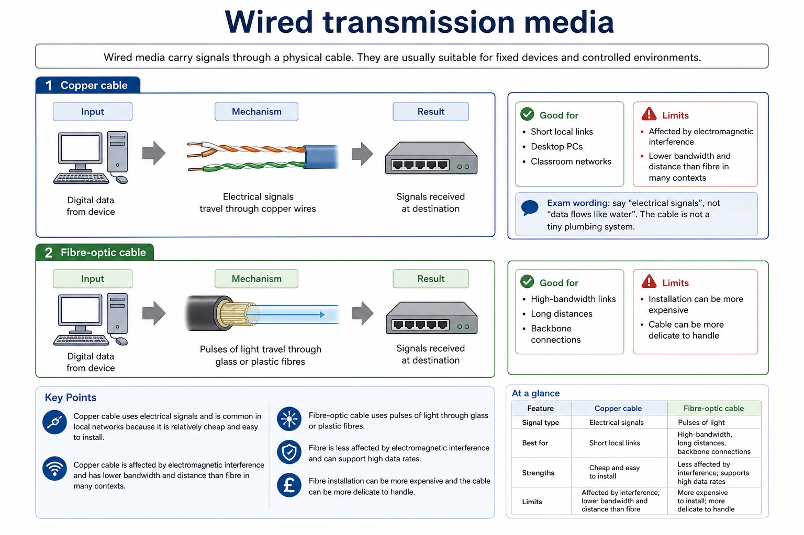
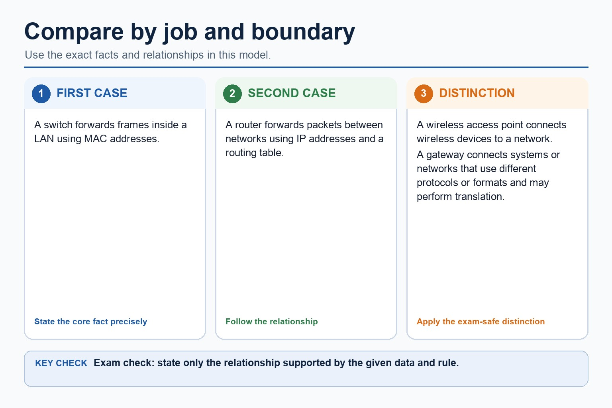
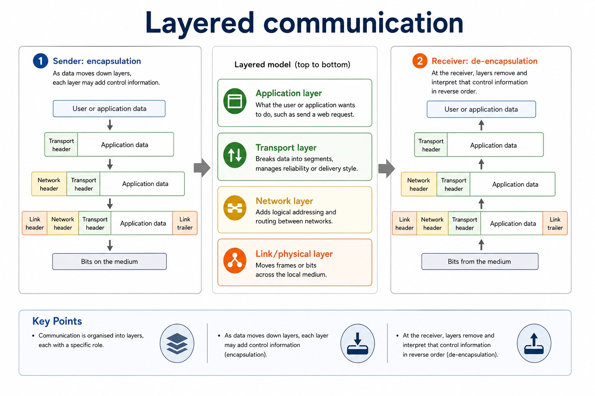
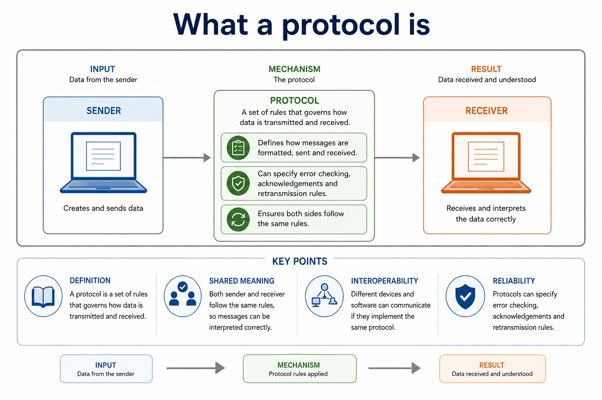
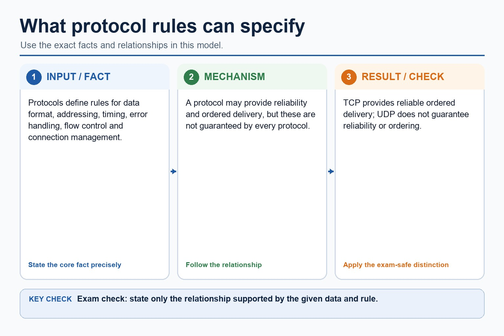

# Lesson 009: Cloud computing and transmission media

**Course:** Cambridge International AS Level Computer Science 9618, 2027-2029 Version 2 
**Paper:** Paper 1 
**Syllabus:** Section 2: Communication 
**Syllabus requirements:** S2.06, S2.07, S2.08 
**Pacing:** Flexible. Select the material set and practice depth needed by the learner.

## Teaching-depth menu

- **Quick route:** Use the diagnostic, learning objectives, first worked example and foundation question. Stop once the learner can explain the central distinction accurately.
- **Full route:** Use every knowledge-point material set, the worked method, the terminology check and all questions.
- **Deep route:** Add the prerequisite refresher, ask learners to connect the concept checklist, discuss the labelled extension and complete a transfer question without a model answer.

## 1. Prerequisite knowledge and quick diagnostic

Recall the main conclusion from Lesson 008: Network topologies and packet transmission.

Ask the learner to give one accurate definition or method step before continuing. If they cannot, briefly revisit the named prerequisite rather than repeating the whole previous lesson.

## 2. Knowledge explanation

### 1. Public cloud · Private cloud · Benefit · Drawback (S2.06)

**Concept map:** public cloud → private cloud → benefit → drawback → dedicated to one organisation

**Three-part explanation:**

1. Private infrastructure is dedicated to one organisation but is not automatically secure
2. Public refers to shared provider infrastructure, not unrestricted access to customer data
3. A public cloud is offered over shared provider infrastructure

**Concrete cue:** Public refers to shared provider infrastructure, not unrestricted access to customer data. Private infrastructure is dedicated to one organisation but is not automatically secure.

#### Internet, intranet and extranet

Text transcript

- These terms describe access scope and purpose. Distinguish these terms by access scope and purpose.
- Internet
- A global public network of interconnected networks. It allows public services such as websites, email and online platforms.
- Access: public, though individual services may still require login.
- Use case: public website, online search, public cloud service access.
- Intranet
- A private network used within an organisation, often using web technologies but restricted to authorised users.
- Access: internal staff or members only.

Precise syllabus wording

Show understanding of public and private cloud computing, including the benefits and drawbacks of cloud computing.

Public refers to shared provider infrastructure, not unrestricted access to customer data. Private infrastructure is dedicated to one organisation but is not automatically secure.

### 2. Wired network · Wireless network · Physical cable · Radio (S2.07)

**Concept map:** wired network → wireless network → physical cable → radio → implications

**Three-part explanation:**

1. Comparisons must connect physical cable or radio transmission to mobility, installation, interference, shared capacity, reliability or security in a stated use
2. A wireless network transmits through the air, supporting mobility and rapid installation, but shared radio capacity, interference, obstacles and interception risk can affect performance and security
3. A wired network carries signals through a physical cable

**Concrete cue:** Comparisons must connect physical cable or radio transmission to mobility, installation, interference, shared capacity, reliability or security in a stated use.

#### Wireless transmission media

Text transcript

- Wireless media transmit through the air or space. They support mobility, but the signal can be affected by distance, obstacles and interference.
- Radio waves
- Radio waves are used by technologies such as WiFi to transmit data without a physical cable.
- Good for: mobile devices, classrooms, homes, short-range wireless networking.
- Limits: shared medium, interference from other devices, weaker security if poorly configured.
- Microwaves
- Microwave links can transmit data between fixed points, often using directional antennas.
- Good for: point-to-point links where a line of sight is available.

#### Wired transmission media

Text transcript

- Wired media carry signals through a physical cable. They are usually suitable for fixed devices and controlled environments.
- Copper cable
- Copper cable transmits data using electrical signals. It is common in local networks because it is relatively cheap and easy to install.
- Good for: short local links, desktop PCs, classroom networks.
- Limits: affected by electromagnetic interference; lower bandwidth and distance than fibre in many contexts.
- Exam wording: say "electrical signals", not "data flows like water". The cable is not a tiny plumbing system.
- Fibre-optic cable
- Fibre-optic cable transmits data as pulses of light through glass or plastic fibres.

#### Compare by factor, not by vibe

Text transcript

- Wired networks
- Wireless networks
- Mobility
- Poor for moving devices because a cable is required.
- Better for mobile devices because no physical cable is needed.
- Interference
- Copper may suffer electromagnetic interference; fibre is less affected.
- Can be affected by walls, distance, other devices and weather.

#### Wireless access points: joining wireless devices

Text transcript

- Wireless access point
- A wireless access point allows wireless devices to connect to a network using radio waves, often linking them to a wired LAN.
- Good exam phrase: provides wireless access to a network.
- Not enough: "it gives internet". Internet access may also require a router and wider network connection.
- Security link: access points can use authentication and encryption, but this lesson focuses on their network role.

Precise syllabus wording

Show understanding of the differences between wired and wireless networks and the implications of using each.

Comparisons must connect physical cable or radio transmission to mobility, installation, interference, shared capacity, reliability or security in a stated use.

### 3. Copper cable · Fibre-optic cable · Radio waves · WiFi (S2.08)

**Concept map:** copper cable → fibre-optic cable → radio waves → WiFi → microwave → satellite

**Three-part explanation:**

1. Explanations must include the signalling method or propagation condition and a use/limitation, not only relative speed
2. Use copper for short fixed desktop links, fibre-optic cable between buildings requiring high bandwidth, WiFi radio waves for mobile tablets, a line-of-sight microwave link where cabling…
3. Satellite communication uses microwave/radio links to and from a satellite for wide or remote coverage, but long propagation distance can increase latency and weather can affect…

**Concrete cue:** All named media are required. Explanations must include the signalling method or propagation condition and a use/limitation, not only relative speed.

#### Wireless transmission media

Text transcript

- Wireless media transmit through the air or space. They support mobility, but the signal can be affected by distance, obstacles and interference.
- Radio waves
- Radio waves are used by technologies such as WiFi to transmit data without a physical cable.
- Good for: mobile devices, classrooms, homes, short-range wireless networking.
- Limits: shared medium, interference from other devices, weaker security if poorly configured.
- Microwaves
- Microwave links can transmit data between fixed points, often using directional antennas.
- Good for: point-to-point links where a line of sight is available.

#### Wired transmission media

Text transcript

- Wired media carry signals through a physical cable. They are usually suitable for fixed devices and controlled environments.
- Copper cable
- Copper cable transmits data using electrical signals. It is common in local networks because it is relatively cheap and easy to install.
- Good for: short local links, desktop PCs, classroom networks.
- Limits: affected by electromagnetic interference; lower bandwidth and distance than fibre in many contexts.
- Exam wording: say "electrical signals", not "data flows like water". The cable is not a tiny plumbing system.
- Fibre-optic cable
- Fibre-optic cable transmits data as pulses of light through glass or plastic fibres.

Precise syllabus wording

Describe copper cable, fibre-optic cable, radio waves including WiFi, microwave and satellite transmission.

All named media are required. Explanations must include the signalling method or propagation condition and a use/limitation, not only relative speed.

### Supporting diagram library

#### Layered communication

Text transcript

- Application layer idea What the user or application wants to do, such as send a web request.
- Transport layer idea Breaks data into segments, manages reliability or delivery style.
- Network layer idea Adds logical addressing and routing between networks.
- Link/physical layer idea Moves frames or bits across the local medium.
- Encapsulation and de-encapsulation
- As data moves down layers, each layer may add control information. At the receiver, layers remove and interpret that control information in reverse order.

#### What a protocol is

Text transcript

- Definition
- A protocol is a set of rules that governs how data is transmitted and received.
- Shared meaning
- Both sender and receiver follow the same rules, so messages can be interpreted correctly.
- Interoperability
- Different devices and software can communicate if they implement the same protocol.
- Reliability
- Protocols can specify error checking, acknowledgements and retransmission rules.

#### What protocol rules can specify

Text transcript

- Protocols define rules for data format, addressing, timing, error handling, flow control and connection management.
- A protocol may provide reliability and ordered delivery, but these are not guaranteed by every protocol.
- TCP provides reliable ordered delivery; UDP does not guarantee reliability or ordering.

Open precise terminology and exam facts

- Public refers to shared provider infrastructure, not unrestricted access to customer data. Private infrastructure is dedicated to one organisation but is not automatically secure.
- Comparisons must connect physical cable or radio transmission to mobility, installation, interference, shared capacity, reliability or security in a stated use.
- All named media are required. Explanations must include the signalling method or propagation condition and a use/limitation, not only relative speed.
- Cloud computing provides storage, processing or software as a service using remote shared infrastructure reached through a network. A public cloud is offered over shared provider infrastructure; a private cloud is restricted to one organisation.
- A public cloud may scale quickly and reduce local hardware management: these are possible benefits. A private cloud is dedicated to one organisation and can give greater control over access and configuration. Each benefit or drawback must link availability, control, cost or security to the stated scenario.
- A wired network carries signals through a physical cable. It can provide stable, predictable links and avoids radio interference, but installation restricts movement and may require disruptive cabling. A wireless network transmits through the air, supporting mobility and rapid installation, but shared radio capacity, interference, obstacles and interception risk can affect performance and security. The implications must be tied to a given use, not reduced to 'wired is faster'.
- Copper cable carries electrical signals and is often economical for short LAN links, but suffers attenuation and electromagnetic interference. Fibre-optic cable carries pulses of light, supports high bandwidth and long distances and is resistant to electromagnetic interference, but equipment and installation may cost more.
- Radio waves, including WiFi, support non-line-of-sight local wireless access but can be absorbed, reflected or interfered with. Terrestrial microwave links provide directional point-to-point communication and usually require clear line of sight. Satellite communication uses microwave/radio links to and from a satellite for wide or remote coverage, but long propagation distance can increase latency and weather can affect some links.

### Worked example

1. Choose a cloud model
2. Connect a school campus and a remote weather station
3. A school storing non-sensitive public resources may use a public cloud for scalable access.
4. A hospital may choose a private cloud for tighter organisational control of patient-data access.
5. Use copper for short fixed desktop links, fibre-optic cable between buildings requiring high bandwidth, WiFi radio waves for mobile tablets, a line-of-sight microwave link where cabling between two buildings is impractical, and…
6. Each choice follows distance, mobility, interference, bandwidth, latency and cost.

Beyond syllabus / 延伸知识（不要求背诵）: real networks organise communication in layers so that hardware, addressing and application protocols can change independently.
## 3. Practice by question type

### Question 1 - foundation - compare - 8 marks

Compare public and private cloud for a medical organisation. Suggest transmission media for fixed classroom PCs, mobile tablets, an inter-building backbone and a remote field station.

**Answer:** public cloud characteristic; private cloud characteristic; scenario-linked comparison; justified choice; copper cable for short fixed links with a valid cost/stability reason; WiFi/radio waves for mobile devices with an interference/security implication; fibre-optic cable for the high-bandwidth/longer inter-building link; satellite for remote coverage without cable infrastructure; at least one limitation is correctly linked to the chosen medium

**Marking guidance:** Do not equate cloud computing with the internet itself. Do not accept unqualified 'wireless is less secure' or 'fibre is faster'; require a mechanism or scenario consequence.

**Common error:** For the command word compare, perform that exact action; do not replace it with an unrelated fact.

### Question 2 - application - state - 2 marks

State one cloud-computing service.

**Answer:** Remote storage, processing or hosted software.

**Marking guidance:** Award one mark for each distinct, technically accurate point or method step.

**Common error:** Do not repeat the same point in different words; each mark needs a separate idea or method step.

### Question 3 - transfer - compare - 2 marks

Compare public from private cloud.

**Answer:** Public cloud uses shared provider infrastructure; private cloud is dedicated or restricted to one organisation.

**Marking guidance:** Award one mark for each distinct, technically accurate point or method step.

**Common error:** Do not copy the worked example unchanged; transfer the method and check it against the new context.

### Related past-paper indexes

| Reference | Marks | Command word | Question type |
|---|---:|---|---|
| 9618/12/W/25 Q8(i) | 4 | explain | calculate |
| 9618/13/W/25 Q4(a) | 3 | give | recall |
| 9618/13/W/25 Q4(c) | 3 | complete | recall |
| 9618/12/W/25 Q8(a)(i) | 2 | give | recall |

These are indexes only. Cambridge question and mark-scheme wording is not reproduced.

## 4. Summary and exam reminders

### Summary

- Define cloud computing and transmission media with the exact technical vocabulary expected by the syllabus.
- Use the lesson method on a fresh context and show the intermediate decision, representation or calculation.
- Match the shape of the answer to the command word and the available marks.
- Check the final answer against the scenario instead of repeating a memorised sentence.

### Common error to correct

Students often confuse bandwidth with speed in every sense. Correction: bandwidth is capacity; latency and congestion also affect perceived performance.

### Exam technique

- Follow the command word: state gives a fact; explain links a cause to a consequence; compare covers both sides.
- Match the number of independent points or method steps to the available marks.
- For cloud computing and transmission media, use the exact technical term before applying it to the scenario.
