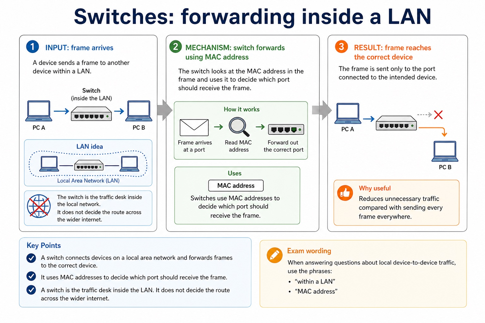
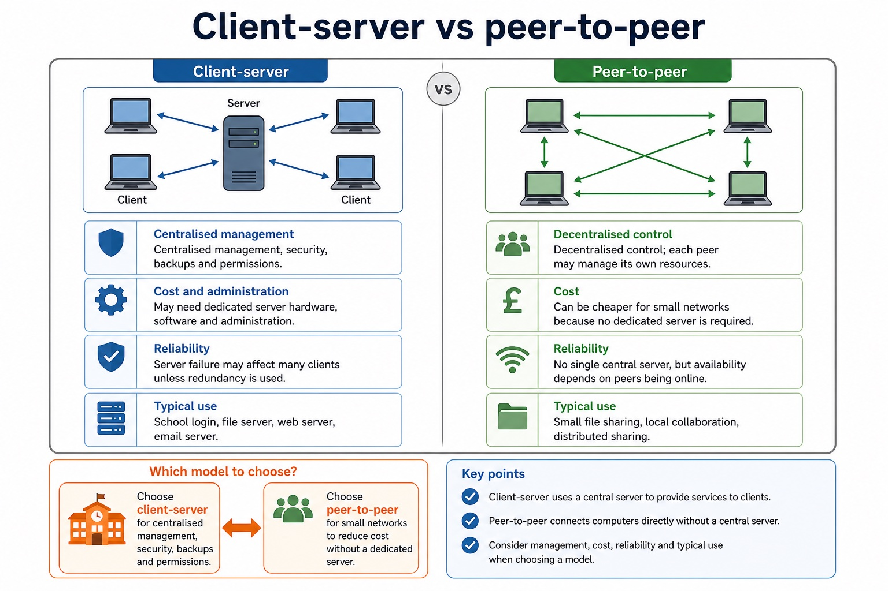
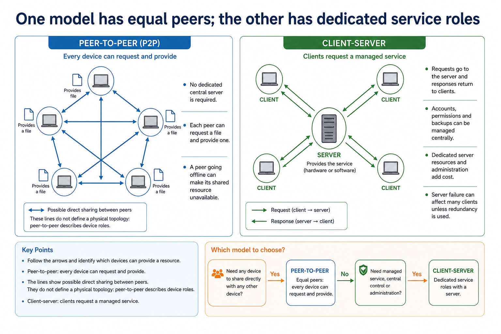
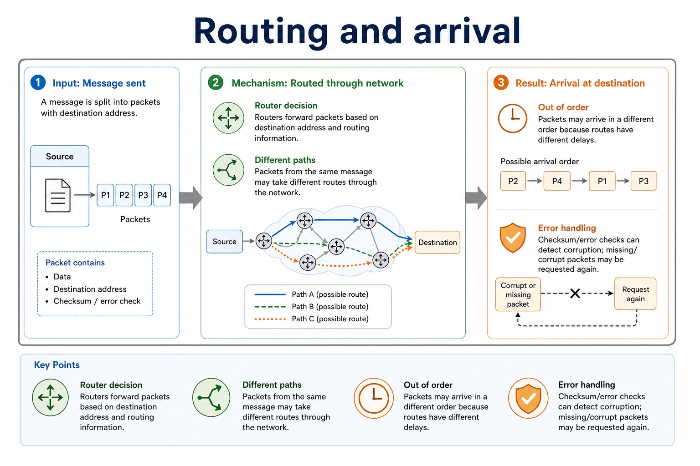
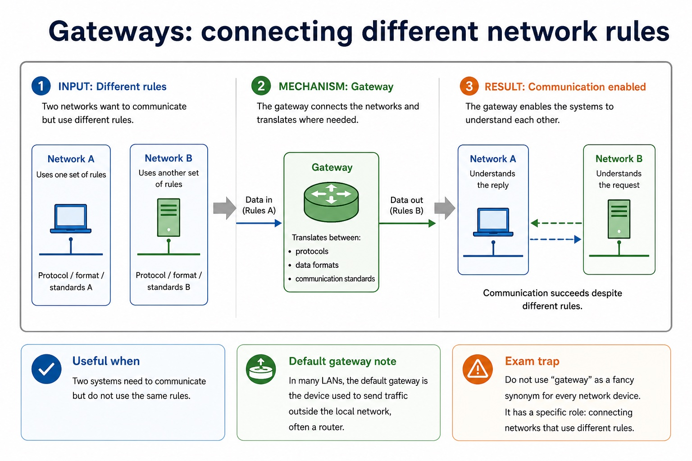

# Lesson 010: LAN hardware, routers and Ethernet

**Course:** Cambridge International AS Level Computer Science 9618, 2027-2029 Version 2 
**Paper:** Paper 1 
**Syllabus:** Section 2: Communication 
**Syllabus requirements:** S2.09, S2.10, S2.11 
**Pacing:** Flexible. Select the material set and practice depth needed by the learner.

## Teaching-depth menu

- **Quick route:** Use the diagnostic, learning objectives, first worked example and foundation question. Stop once the learner can explain the central distinction accurately.
- **Full route:** Use every knowledge-point material set, the worked method, the terminology check and all questions.
- **Deep route:** Add the prerequisite refresher, ask learners to connect the concept checklist, discuss the labelled extension and complete a transfer question without a model answer.

## 1. Prerequisite knowledge and quick diagnostic

Recall S2.01 before starting this lesson.

Ask the learner to give one accurate definition or method step before continuing. If they cannot, briefly revisit the named prerequisite rather than repeating the whole previous lesson.

### Optional prerequisite refresher

- A LAN covers a limited area and is normally managed by one organisation; a WAN connects sites across a large area and commonly uses provider infrastructure. Benefits must identify a shared or centrally managed resource and its consequence.
- Show understanding of the purpose and benefits of networking devices and the characteristics of LANs and WANs.

## 2. Knowledge explanation

### 1. Switch · Server · NIC/WNIC · WAP (S2.09)

**Concept map:** switch → server → NIC/WNIC → WAP → cables → bridge → repeater

**Three-part explanation:**

1. LAN hardware includes a switch, server, NIC/WNIC, WAP, cables, bridge and repeater
2. Every named hardware category is required and must be distinguished by its role
3. a combined consumer device does not merge the logical functions

**Concrete cue:** Every named hardware category is required and must be distinguished by its role; a combined consumer device does not merge the logical functions.

#### Switches: forwarding inside a LAN

Text transcript

- A switch connects devices on a local area network and forwards frames to the correct device.
- Uses: MAC addresses to decide which port should receive the frame.
- Why useful: reduces unnecessary traffic compared with sending every frame everywhere.
- Exam wording: say "within a LAN" and "MAC address" when the scenario is local device-to-device traffic.
- LAN idea
- PC A - switch - PC B
- The switch is the traffic desk inside the local network. It does not decide the route across the wider internet.

#### Client-server vs peer-to-peer

Text transcript

- Client-server
- Peer-to-peer
- Centralised management, security, backups and permissions.
- Decentralised control; each peer may manage its own resources.
- May need dedicated server hardware, software and administration.
- Can be cheaper for small networks because no dedicated server is required.
- Reliability
- Server failure may affect many clients unless redundancy is used.

#### One model has equal peers; the other has dedicated service roles

Text transcript

- Visual explanation
- Follow the arrows and identify which devices can provide a resource.
- Peer-to-peer: every device can request and provide
- The lines show possible direct sharing between peers. They do not define a physical topology: peer-to-peer describes device roles.
- No dedicated central server is required.
- Each peer can request a file and provide one.
- A peer going offline can make its shared resource unavailable.
- Client-server: clients request a managed service

#### 5-minute mini assessment

Text transcript

- Monthly checkpoint
- Use this as a short checkpoint before moving to named protocols. Expand the answer key after attempting.
- Explain why DNS is needed when a user enters a URL.
- State one difference between an IP address and a MAC address.
- Identify the domain name in https://store.example.com/products/item7 .
- 1: DNS resolves the domain name in the URL to an IP address so packets can be routed to the server.
- 2: IP is a logical network address that can change; MAC is a hardware/interface address used locally.
- 3: store.example.com .

Precise syllabus wording

Describe LAN hardware: switch, server, NIC, WNIC, WAP, cables, bridge and repeater.

Every named hardware category is required and must be distinguished by its role; a combined consumer device does not merge the logical functions.

### 2. Router · Different networks · Forwards packets · IP addresses (S2.10)

**Concept map:** router → different networks → forwards packets → IP addresses → routing information

**Three-part explanation:**

1. A router connects different networks and forwards packets using destination IP addresses and routing information
2. providing WiFi is not the defining role
3. The router then forwards the packet from the school LAN toward another network

**Concrete cue:** A router connects different networks and forwards packets using destination IP addresses and routing information; providing WiFi is not the defining role.

#### Routers: forwarding between networks

Text transcript

- A router connects different networks and forwards packets towards their destination.
- Uses: IP addresses and routing information to choose a path.
- Common role: connects a LAN to the internet or to another network.
- Careful wording: a router does not simply "make WiFi". Some home boxes combine router and access point functions, but the jobs are distinct.
- Between networks
- LAN - router - internet / WAN
- Inside the LAN, MAC-address forwarding matters. Between networks, IP-address routing matters.

#### IP address vs MAC address

Text transcript

- IP and MAC addresses work together at different layers; they are not an either-or choice.
- The destination IP identifies the endpoint for end-to-end packet delivery.
- The destination MAC identifies the receiving interface for one local-link frame.
- On a routed path, the frame normally targets the next-hop router MAC while the packet retains the remote destination IP.

#### Routing and arrival

Text transcript

- Router decision Routers forward packets based on destination address and routing information.
- Different paths Packets from the same message may take different routes through the network.
- Out of order Packets may arrive in a different order because routes have different delays.
- Error handling Checksum/error checks can detect corruption; missing/corrupt packets may be requested again.

#### Compare by job and boundary

Text transcript

- A switch forwards frames inside a LAN using MAC addresses.
- A router forwards packets between networks using IP addresses and a routing table.
- A wireless access point connects wireless devices to a network.
- A gateway connects systems or networks that use different protocols or formats and may perform translation.

Precise syllabus wording

Describe the role and function of a router in a network.

A router connects different networks and forwards packets using destination IP addresses and routing information; providing WiFi is not the defining role.

### 3. Ethernet · CSMA/CD · Carrier Sense · Collision (S2.11)

**Concept map:** Ethernet → CSMA/CD → Carrier Sense → collision → random backoff → retry

**Three-part explanation:**

1. collision detection occurs after transmission begins
2. A collision causes stop/jam, random backoff, sensing and retry
3. After a collision, stations stop transmitting, send/recognise a jam signal, wait for different random backoff periods and retry

**Concrete cue:** If two Ethernet stations transmit together, they detect the collision, stop, wait different random times, then sense and retry.

Precise syllabus wording

Show understanding of Ethernet and how collisions are detected and handled using CSMA/CD.

Carrier sensing occurs before transmission; collision detection occurs after transmission begins. A collision causes stop/jam, random backoff, sensing and retry.

### Supporting diagram library

#### From a URL to a packet on the local link

Text transcript

- DNS resolves a domain name to an IP address; it does not return a MAC address.
- The network-layer packet header contains the destination IP address of the endpoint.
- For one local hop, a link-layer frame contains the IP packet and a destination MAC address.
- The destination IP and destination MAC belong to different encapsulation headers.

#### DNS: name to IP address

Text transcript

- 1. URL entered The user enters a URL containing a domain name.
- 2. DNS lookup The device asks a DNS server to resolve the domain name.
- 3. IP returned The DNS server returns the IP address for that domain name.
- 4. Packets sent Packets can now be addressed and routed to the web server.
- Common error
- DNS failure may stop a domain name working even if the server is still reachable by IP address.

#### URL components

Text transcript

- https://www.example.org/resources/page.html
- Protocol / scheme https tells the browser which communication protocol to use.
- Domain name www.example.org is resolved by DNS to an IP address.
- Path /resources/page.html identifies the resource on the server.

#### Gateways: connecting different network rules

Text transcript

- A gateway connects networks that may use different protocols, data formats or communication standards, translating where needed.
- Useful when: two systems need to communicate but do not use the same rules.
- Default gateway note: in many LANs, the default gateway is the device used to send traffic outside the local network, often a router.
- Common error: do not use "gateway" as a general term for every network device.

#### Wireless access points: joining wireless devices

Text transcript

- Wireless access point
- A wireless access point allows wireless devices to connect to a network using radio waves, often linking them to a wired LAN.
- Good exam phrase: provides wireless access to a network.
- Not enough: "it gives internet". Internet access may also require a router and wider network connection.
- Security link: access points can use authentication and encryption, but this lesson focuses on their network role.

Open precise terminology and exam facts

- Every named hardware category is required and must be distinguished by its role; a combined consumer device does not merge the logical functions.
- A router connects different networks and forwards packets using destination IP addresses and routing information; providing WiFi is not the defining role.
- Carrier sensing occurs before transmission; collision detection occurs after transmission begins. A collision causes stop/jam, random backoff, sensing and retry.
- LAN hardware includes a switch, server, NIC/WNIC, WAP, cables, bridge and repeater. A server provides network services. A NIC/WNIC connects a device by cable or wirelessly; a WAP connects wireless devices to a wired LAN. A switch forwards frames within a LAN, a bridge connects LAN segments, a repeater regenerates a weakened signal, and cables carry signals.
- A router connects different networks and forwards packets using destination IP addresses and stored routing information. It is not a replacement name for a switch: the two devices make forwarding decisions at different scopes.
- CSMA/CD means Carrier Sense Multiple Access with Collision Detection. A station listens to the shared medium; if idle it transmits, while continuing to detect a collision.
- After a collision, stations stop transmitting, send/recognise a jam signal, wait for different random backoff periods and retry. The random delay reduces the chance of another simultaneous attempt.
- A URL locates a WWW resource: DNS resolves the domain to an IP address, while the remaining URL components identify the required resource.
- Bit streaming delivers media progressively so playback can begin before the whole file arrives. Real-time streaming carries a live event with minimal delay; on-demand streaming sends stored content selected by the user.
- Bit rate is the number of bits transmitted each second. Available broadband speed must normally exceed the media bit rate and absorb variation; otherwise the player buffers, lowers quality or pauses. A buffer stores arriving data temporarily.
- The internet is the global network infrastructure that interconnects networks and carries many services. The World Wide Web is one service that uses the internet to provide linked resources accessed with web protocols and browsers.
- Internet hardware includes routers and transmission links that forward data between networks. Web servers store or generate web resources, while clients request those resources; the WWW is therefore not a synonym for all internet services.

### Worked example

1. Trace a school request
2. Two stations sense an idle cable
3. 6 Mbit/s video on 4 Mbit/s link
4. Separate infrastructure from service
5. Locate one resource on a school web server
6. A laptop sends a frame through its wireless interface to an access point.

Beyond syllabus / 延伸知识（不要求背诵）: real networks organise communication in layers so that hardware, addressing and application protocols can change independently.
## 3. Practice by question type

### Question 1 - foundation - explain - 8 marks

Explain the roles of a NIC, wireless access point, switch and router in a school LAN connected to the internet. Describe how CSMA/CD handles two devices attempting to transmit on a shared Ethernet medium. A video has a bit rate of 8 Mbit/s. Explain why a connection advertised as 8 Mbit/s may still pause during playback. Explain why the internet and the World Wide Web are not the same. Describe the hardware path used when a home computer accesses a remote server. Compare IPv4 with IPv6, then explain how a URL and DNS are used to request a web resource.

**Answer:** NIC role; access-point role; switch role; router role; each device listens/senses the carrier before transmitting; transmits when the medium is idle; detects a collision and stops transmission; waits a random/backoff time before retrying; video requires about 8 million bits each second; actual available speed may be below advertised/maximum speed; other traffic, overhead or variation reduces throughput; buffer empties when data arrives more slowly than playback consumes it; internet infrastructure; WWW service; example or hardware path distinguishes them; end-device interface; LAN device; router role; modem/access-link role; IPv4 uses 32-bit addresses; IPv6 uses 128-bit addresses / provides a much larger address space; URL identifies a WWW resource and includes a domain plus resource path; DNS resolves the domain name to an IP address; IP address is used to route packets while the path identifies the requested resource

**Marking guidance:** Do not describe every named device as routing packets between networks. Do not accept collision avoidance: CSMA/CD detects and responds to a collision after transmission has begun. Do not accept 'bandwidth is slow' without comparing arrival rate with the stream bit rate. Do not define the internet as a collection of webpages. Do not use modem, router and switch as interchangeable terms. Do not accept that a private IP address guarantees security or that DNS converts the entire URL/stores the website.

**Common error:** For the command word explain, perform that exact action; do not replace it with an unrelated fact.

### Question 2 - application - apply - 2 marks

What is sensed before Ethernet transmission?

**Answer:** Whether the shared carrier/medium is idle.

**Marking guidance:** Award one mark for each distinct, technically accurate point or method step.

**Common error:** Do not repeat the same point in different words; each mark needs a separate idea or method step.

### Question 3 - transfer - apply - 2 marks

What does the router do at the LAN boundary?

**Answer:** It forwards packets between the LAN and other networks.

**Marking guidance:** Award one mark for each distinct, technically accurate point or method step.

**Common error:** Do not copy the worked example unchanged; transfer the method and check it against the new context.

### Related past-paper indexes

| Reference | Marks | Command word | Question type |
|---|---:|---|---|
| 9618/12/W/25 Q5(a) | 2 | describe | explain |
| 9618/12/S/24 Q3(i) | 2 | describe | explain |
| 9618/13/S/24 Q6(i) | 2 | define | recall |
| 9618/11/W/23 Q2(a) | 3 | describe | explain |

These are indexes only. Cambridge question and mark-scheme wording is not reproduced.

## 4. Summary and exam reminders

### Summary

- Define lan hardware, routers and ethernet with the exact technical vocabulary expected by the syllabus.
- Use the lesson method on a fresh context and show the intermediate decision, representation or calculation.
- Match the shape of the answer to the command word and the available marks.
- Check the final answer against the scenario instead of repeating a memorised sentence.

### Common error to correct

Students often confuse bandwidth with speed in every sense. Correction: bandwidth is capacity; latency and congestion also affect perceived performance.

### Exam technique

- Follow the command word: state gives a fact; explain links a cause to a consequence; compare covers both sides.
- Match the number of independent points or method steps to the available marks.
- For lan hardware, routers and ethernet, use the exact technical term before applying it to the scenario.
