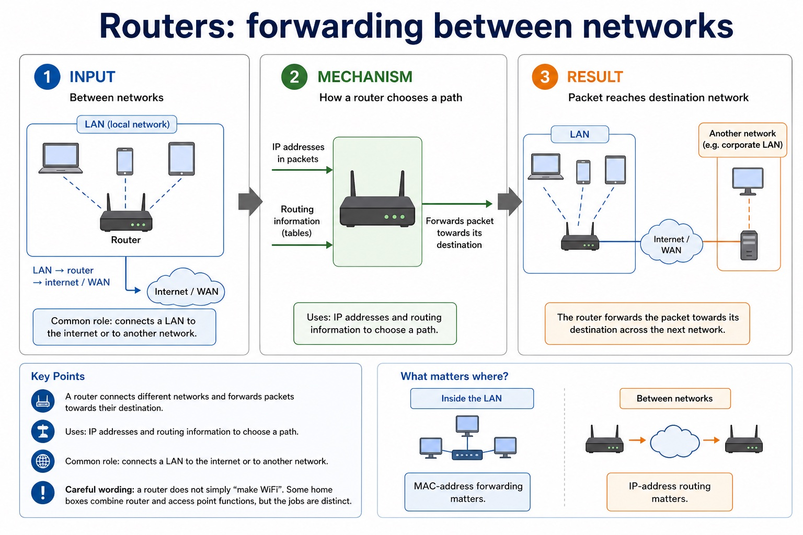

# Lesson 010: LAN hardware, routers and Ethernet

**Course:** Cambridge International AS Level Computer Science 9618, 2027-2029 Version 2 
**Paper:** Paper 1 
**Syllabus:** Section 2: Communication 
**Syllabus requirements:** S2.09, S2.10, S2.11 
**Pacing:** Flexible. This lesson is deliberately over-complete; select a quick, full or deep route for the learners in front of you.

## Teaching-depth menu

- **Quick route:** Use the diagnostic, learning objectives, first worked example and foundation question. Stop once the learner can explain the central distinction accurately.
- **Full route:** Teach every core explanation point, the worked example and all lesson questions. Use the visual only when it adds a different representation.
- **Deep route:** Add the prerequisite refresher, ask learners to connect the concept checklist, discuss the labelled extension and complete a transfer question without a model answer.

## 1. Prerequisite knowledge and quick diagnostic

Recall S2.01 before starting this lesson.

Ask the learner to give one accurate definition or method step before continuing. If they cannot, briefly revisit the named prerequisite rather than repeating the whole previous lesson.

### Optional prerequisite refresher

- A LAN covers a limited area and is normally managed by one organisation; a WAN connects sites across a large area and commonly uses provider infrastructure. Benefits must identify a shared or centrally managed resource and its consequence.
- Show understanding of the purpose and benefits of networking devices and the characteristics of LANs and WANs.

## 2. Knowledge explanation

### Learning objectives

- Describe LAN hardware: switch, server, NIC, WNIC, WAP, cables, bridge and repeater.
- Describe the role and function of a router in a network.
- Show understanding of Ethernet and how collisions are detected and handled using CSMA/CD.

### Concept checklist for teacher choice

- switch
- server
- NIC/WNIC
- WAP
- cables
- bridge
- repeater
- router
- different networks
- forwards packets
- IP addresses
- routing information
- Ethernet
- CSMA/CD
- Carrier Sense
- collision
- random backoff
- retry

### Detailed explanation

- Every named hardware category is required and must be distinguished by its role; a combined consumer device does not merge the logical functions.
- A router connects different networks and forwards packets using destination IP addresses and routing information; providing WiFi is not the defining role.
- Carrier sensing occurs before transmission; collision detection occurs after transmission begins. A collision causes stop/jam, random backoff, sensing and retry.
- LAN hardware includes a switch, server, NIC/WNIC, WAP, cables, bridge and repeater. A server provides network services. A NIC/WNIC connects a device by cable or wirelessly; a WAP connects wireless devices to a wired LAN. A switch forwards frames within a LAN, a bridge connects LAN segments, a repeater regenerates a weakened signal, and cables carry signals.
- A router connects different networks and forwards packets using destination IP addresses and stored routing information. It is not a replacement name for a switch: the two devices make forwarding decisions at different scopes.
- CSMA/CD means Carrier Sense Multiple Access with Collision Detection. A station listens to the shared medium; if idle it transmits, while continuing to detect a collision.
- After a collision, stations stop transmitting, send/recognise a jam signal, wait for different random backoff periods and retry. The random delay reduces the chance of another simultaneous attempt.
- A URL locates a WWW resource: DNS resolves the domain to an IP address, while the remaining URL components identify the required resource.
- Bit streaming delivers media progressively so playback can begin before the whole file arrives. Real-time streaming carries a live event with minimal delay; on-demand streaming sends stored content selected by the user.
- Bit rate is the number of bits transmitted each second. Available broadband speed must normally exceed the media bit rate and absorb variation; otherwise the player buffers, lowers quality or pauses. A buffer stores arriving data temporarily.
- The internet is the global network infrastructure that interconnects networks and carries many services. The World Wide Web is one service that uses the internet to provide linked resources accessed with web protocols and browsers.
- Internet hardware includes routers and transmission links that forward data between networks. Web servers store or generate web resources, while clients request those resources; the WWW is therefore not a synonym for all internet services.

### Worked example

Trace a school request / Two stations sense an idle cable / 6 Mbit/s video on 4 Mbit/s link / Separate infrastructure from service / Home-to-provider path / Locate one resource on a school web server: A laptop sends a frame through its wireless interface to an access point. The LAN switch forwards it toward the router. The router then forwards the packet from the school LAN toward another network. Both may begin before either signal reaches the other. They detect the collision, stop, wait different random periods and the station whose timer expires first retries. The stream consumes data faster than the link supplies it. A starting buffer only delays the shortage; sustained playback requires a lower bit rate or faster connection. Sending email uses the internet but not the WWW.…

Beyond syllabus / 延伸知识（不要求背诵）: real networks organise communication in layers so that hardware, addressing and application protocols can change independently.

### Retained visual explanation

_Routers: forwarding between networks. The image and mobile text alternative come from one maintained fact source._

## 3. Practice by question type

### Question 1 - foundation - explain - 8 marks

Explain the roles of a NIC, wireless access point, switch and router in a school LAN connected to the internet. Describe how CSMA/CD handles two devices attempting to transmit on a shared Ethernet medium. A video has a bit rate of 8 Mbit/s. Explain why a connection advertised as 8 Mbit/s may still pause during playback. Explain why the internet and the World Wide Web are not the same. Describe the hardware path used when a home computer accesses a remote server. Compare IPv4 with IPv6, then explain how a URL and DNS are used to request a web resource.

**Answer:** NIC role; access-point role; switch role; router role; each device listens/senses the carrier before transmitting; transmits when the medium is idle; detects a collision and stops transmission; waits a random/backoff time before retrying; video requires about 8 million bits each second; actual available speed may be below advertised/maximum speed; other traffic, overhead or variation reduces throughput; buffer empties when data arrives more slowly than playback consumes it; internet infrastructure; WWW service; example or hardware path distinguishes them; end-device interface; LAN device; router role; modem/access-link role; IPv4 uses 32-bit addresses; IPv6 uses 128-bit addresses / provides a much larger address space; URL identifies a WWW resource and includes a domain plus resource path; DNS resolves the domain name to an IP address; IP address is used to route packets while the path identifies the requested resource

**Marking guidance:** Do not describe every named device as routing packets between networks. Do not accept collision avoidance: CSMA/CD detects and responds to a collision after transmission has begun. Do not accept 'bandwidth is slow' without comparing arrival rate with the stream bit rate. Do not define the internet as a collection of webpages. Do not use modem, router and switch as interchangeable terms. Do not accept that a private IP address guarantees security or that DNS converts the entire URL/stores the website.

**Common error:** For the command word explain, perform that exact action; do not replace it with an unrelated fact.

### Question 2 - application - apply - 2 marks

What is sensed before Ethernet transmission?

**Answer:** Whether the shared carrier/medium is idle.

**Marking guidance:** Award one mark for each distinct, technically accurate point or method step.

**Common error:** Do not repeat the same point in different words; each mark needs a separate idea or method step.

### Question 3 - transfer - apply - 2 marks

What does the router do at the LAN boundary?

**Answer:** It forwards packets between the LAN and other networks.

**Marking guidance:** Award one mark for each distinct, technically accurate point or method step.

**Common error:** Do not copy the worked example unchanged; transfer the method and check it against the new context.

### Related past-paper indexes

| Reference | Marks | Command word | Question type |
|---|---:|---|---|
| 9618/12/W/25 Q5(a) | 2 | describe | explain |
| 9618/12/S/24 Q3(i) | 2 | describe | explain |
| 9618/13/S/24 Q6(i) | 2 | define | recall |
| 9618/11/W/23 Q2(a) | 3 | describe | explain |

These are indexes only. Cambridge question and mark-scheme wording is not reproduced.

## 4. Summary and exam reminders

### Summary

- Define lan hardware, routers and ethernet with the exact technical vocabulary expected by the syllabus.
- Use the lesson method on a fresh context and show the intermediate decision, representation or calculation.
- Match the shape of the answer to the command word and the available marks.
- Check the final answer against the scenario instead of repeating a memorised sentence.

### Common error to correct

Students often confuse bandwidth with speed in every sense. Correction: bandwidth is capacity; latency and congestion also affect perceived performance.

### Exam technique

- Follow the command word: state gives a fact; explain links a cause to a consequence; compare covers both sides.
- Match the number of independent points or method steps to the available marks.
- For lan hardware, routers and ethernet, use the exact technical term before applying it to the scenario.
