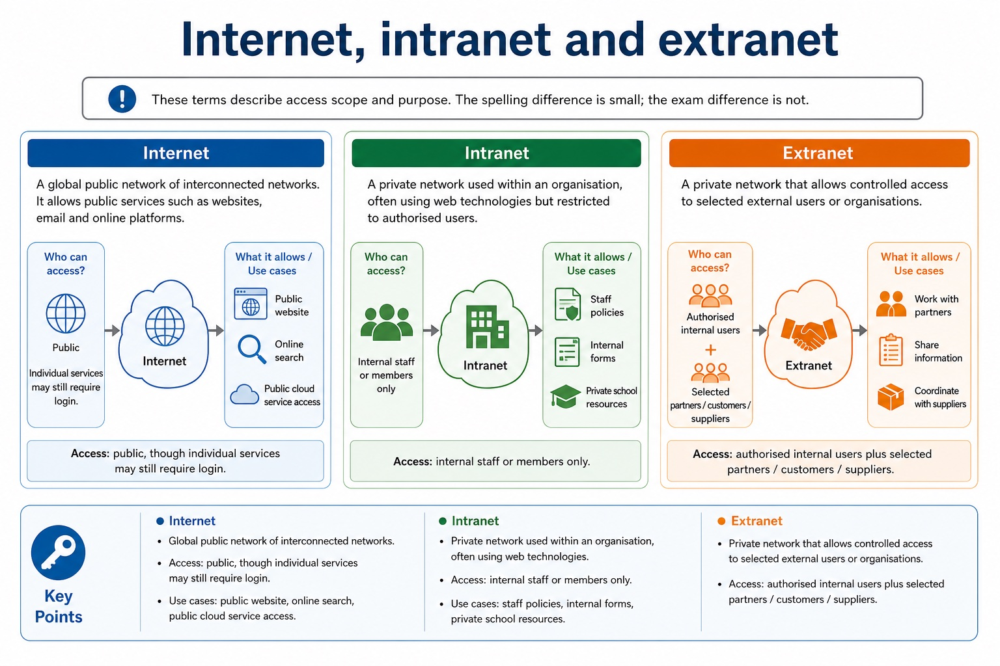
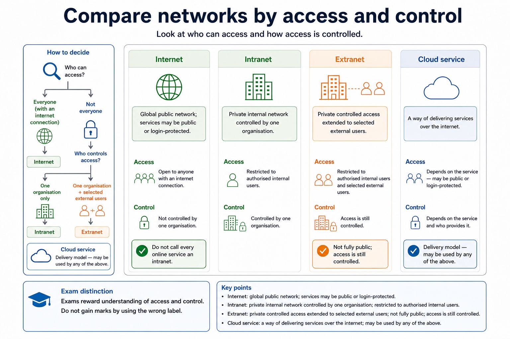
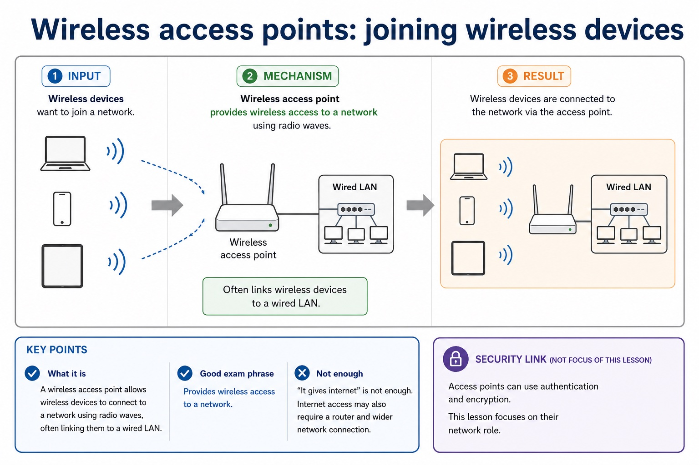
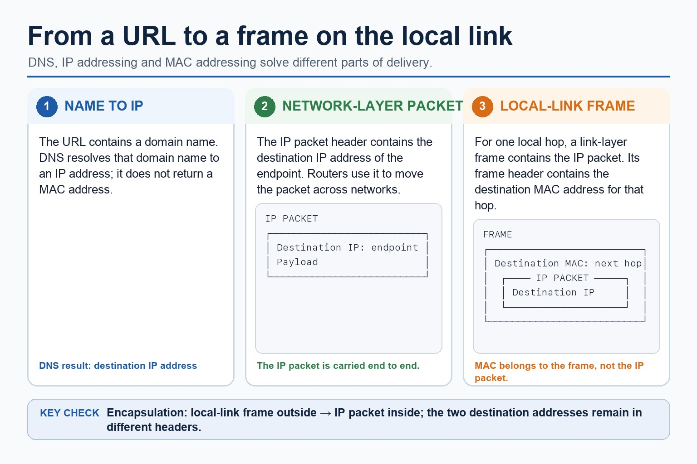
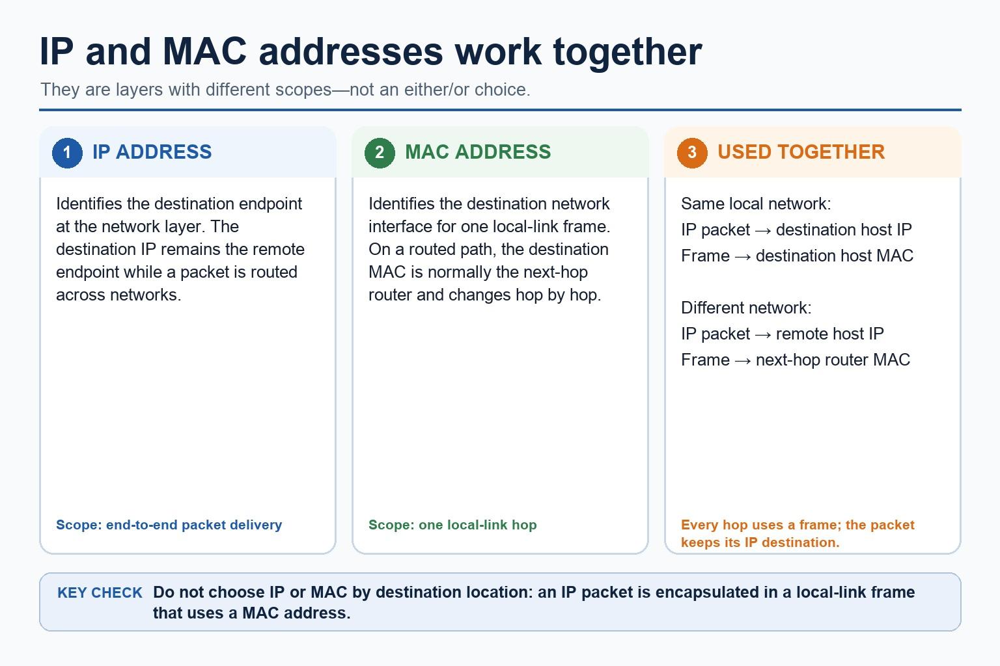
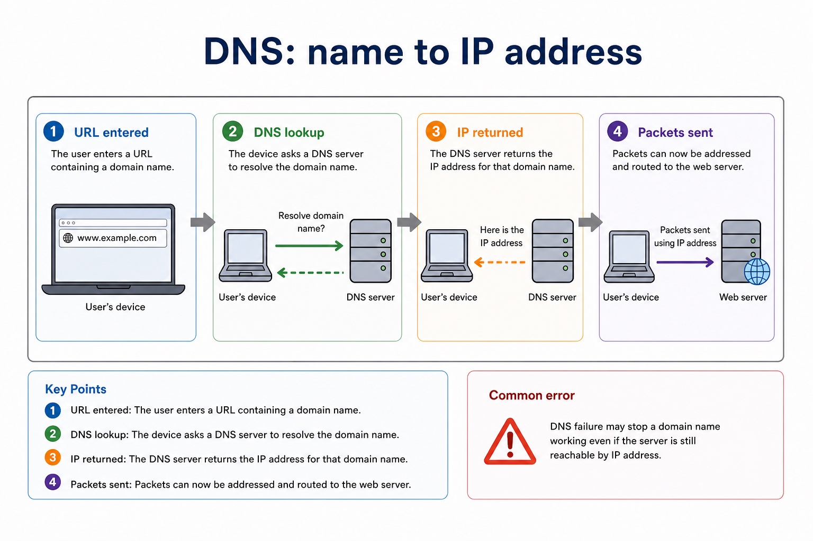
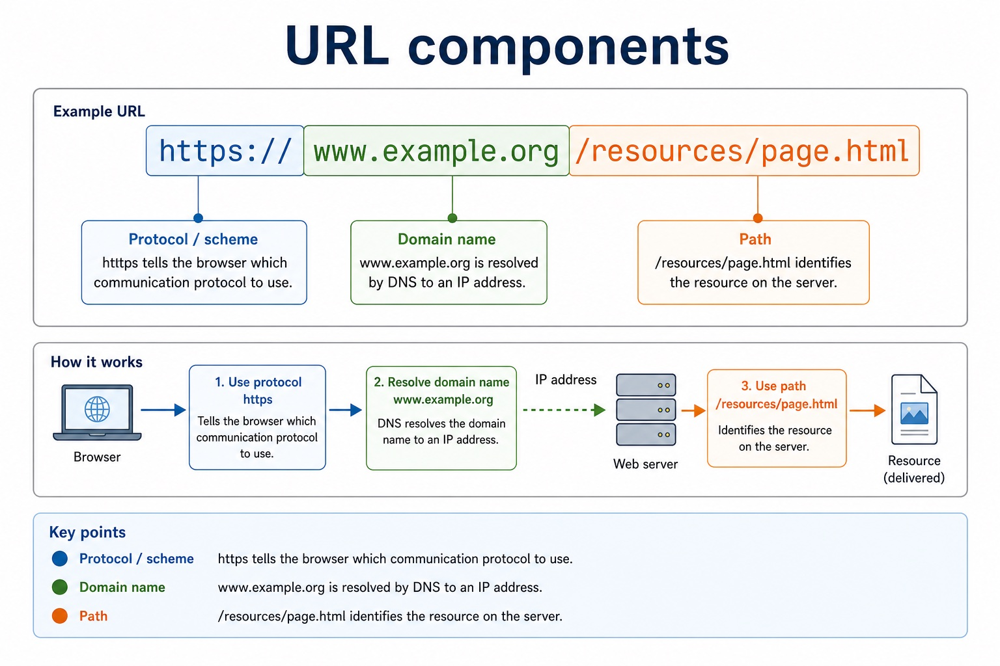
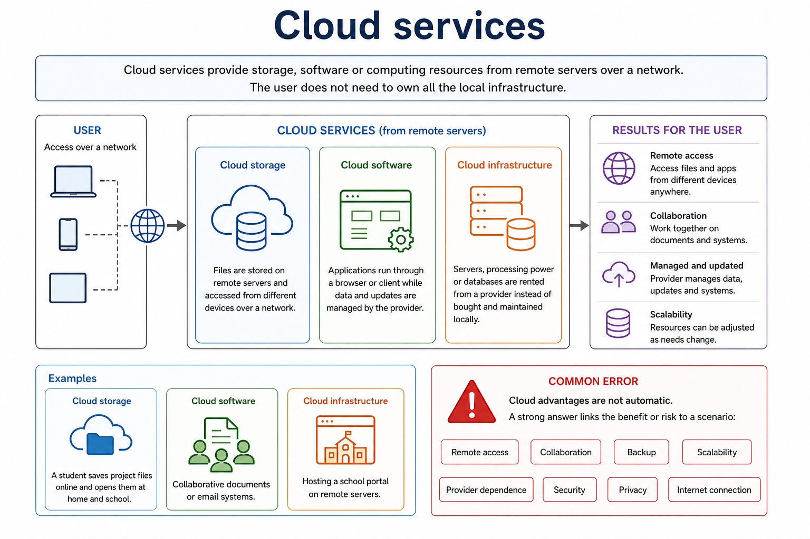

# Lesson 011: Streaming, the internet and connection infrastructure

**Course:** Cambridge International AS Level Computer Science 9618, 2027-2029 Version 2 
**Paper:** Paper 1 
**Syllabus:** Section 2: Communication 
**Syllabus requirements:** S2.12, S2.13, S2.14 
**Pacing:** Flexible. Select the material set and practice depth needed by the learner.

## Teaching-depth menu

- **Quick route:** Use the diagnostic, learning objectives, first worked example and foundation question. Stop once the learner can explain the central distinction accurately.
- **Full route:** Use every knowledge-point material set, the worked method, the terminology check and all questions.
- **Deep route:** Add the prerequisite refresher, ask learners to connect the concept checklist, discuss the labelled extension and complete a transfer question without a model answer.

## 1. Prerequisite knowledge and quick diagnostic

Recall the main conclusion from Lesson 010: LAN hardware, routers and Ethernet.

Ask the learner to give one accurate definition or method step before continuing. If they cannot, briefly revisit the named prerequisite rather than repeating the whole previous lesson.

## 2. Knowledge explanation

### 1. Bit streaming · Real-time streaming · On-demand streaming · Bit rate (S2.12)

**Concept map:** bit streaming → real-time streaming → on-demand streaming → bit rate → broadband speed → buffer

**Three-part explanation:**

1. A buffer absorbs short variation but cannot repair a sustained connection rate below the media bit rate
2. Available broadband speed must normally exceed the media bit rate and absorb variation
3. on-demand means stored content selected by the user

**Concrete cue:** A 5 Mbit/s video cannot play continuously over a stable 3 Mbit/s link; a starting buffer only delays the shortage.

Precise syllabus wording

Show understanding of bit streaming, including real-time/on-demand methods and the importance of bit rate and broadband speed.

A buffer absorbs short variation but cannot repair a sustained connection rate below the media bit rate. Real-time means live; on-demand means stored content selected by the user.

### 2. World Wide Web · Internet · One service (S2.13)

**Concept map:** World Wide Web → internet → one service

**Three-part explanation:**

1. The World Wide Web is one service that uses the internet to provide linked resources accessed with web protocols and browsers
2. The internet is interconnected network infrastructure and protocols
3. the WWW is one service of linked resources accessed over that infrastructure

**Concrete cue:** The internet is the global network infrastructure that interconnects networks and carries many services. The World Wide Web is one service that uses the internet to provide linked resources accessed…

#### Internet, intranet and extranet

Text transcript

- These terms describe access scope and purpose. Distinguish these terms by access scope and purpose.
- Internet
- A global public network of interconnected networks. It allows public services such as websites, email and online platforms.
- Access: public, though individual services may still require login.
- Use case: public website, online search, public cloud service access.
- Intranet
- A private network used within an organisation, often using web technologies but restricted to authorised users.
- Access: internal staff or members only.

#### Compare networks by access and control

Text transcript

- Access / control
- Exam distinction
- Internet
- Global public network; services may be public or login-protected.
- Do not call every online service an intranet.
- Intranet
- Private internal network controlled by one organisation.
- Restricted to authorised internal users.

#### Wireless access points: joining wireless devices

Text transcript

- Wireless access point
- A wireless access point allows wireless devices to connect to a network using radio waves, often linking them to a wired LAN.
- Good exam phrase: provides wireless access to a network.
- Not enough: "it gives internet". Internet access may also require a router and wider network connection.
- Security link: access points can use authentication and encryption, but this lesson focuses on their network role.

Precise syllabus wording

Show understanding of the differences between the World Wide Web and the internet.

The internet is interconnected network infrastructure and protocols; the WWW is one service of linked resources accessed over that infrastructure.

### 3. Modems and internet connection methods (S2.14)

**Concept map:** modem → PSTN → Public Switched Telephone Network → dedicated line → cell phone network → cellular phone network

**Three-part explanation:**

1. Internet-supporting connections include the PSTN (Public Switched Telephone Network), a dedicated line and a cell phone network or cellular phone network
2. PSTN, dedicated lines and cell phone/cellular networks are distinct connection methods and all are compulsory examples
3. Internet hardware includes routers and transmission links that forward data between networks

**Concrete cue:** A home modem adapts signals for its access link; a business may pay for a dedicated connection, while a phone uses a cellular network.

Precise syllabus wording

Describe internet-supporting hardware and connections, including modems, PSTN, dedicated lines and cell phone networks.

A modem adapts data to access-link signalling. PSTN, dedicated lines and cell phone/cellular networks are distinct connection methods and all are compulsory examples.

### Supporting diagram library

#### From a URL to a packet on the local link

Text transcript

- DNS resolves a domain name to an IP address; it does not return a MAC address.
- The network-layer packet header contains the destination IP address of the endpoint.
- For one local hop, a link-layer frame contains the IP packet and a destination MAC address.
- The destination IP and destination MAC belong to different encapsulation headers.

#### IP address vs MAC address

Text transcript

- IP and MAC addresses work together at different layers; they are not an either-or choice.
- The destination IP identifies the endpoint for end-to-end packet delivery.
- The destination MAC identifies the receiving interface for one local-link frame.
- On a routed path, the frame normally targets the next-hop router MAC while the packet retains the remote destination IP.

#### 5-minute mini assessment

Text transcript

- Monthly checkpoint
- Use this as a short checkpoint before moving to named protocols. Expand the answer key after attempting.
- Explain why DNS is needed when a user enters a URL.
- State one difference between an IP address and a MAC address.
- Identify the domain name in https://store.example.com/products/item7 .
- 1: DNS resolves the domain name in the URL to an IP address so packets can be routed to the server.
- 2: IP is a logical network address that can change; MAC is a hardware/interface address used locally.
- 3: store.example.com .

#### DNS: name to IP address

Text transcript

- 1. URL entered The user enters a URL containing a domain name.
- 2. DNS lookup The device asks a DNS server to resolve the domain name.
- 3. IP returned The DNS server returns the IP address for that domain name.
- 4. Packets sent Packets can now be addressed and routed to the web server.
- Common error
- DNS failure may stop a domain name working even if the server is still reachable by IP address.

#### URL components

Text transcript

- https://www.example.org/resources/page.html
- Protocol / scheme https tells the browser which communication protocol to use.
- Domain name www.example.org is resolved by DNS to an IP address.
- Path /resources/page.html identifies the resource on the server.

#### Cloud services

Text transcript

- Cloud services provide storage, software or computing resources from remote servers over a network. The user does not need to own all the local infrastructure.
- Cloud storage
- Files are stored on remote servers and accessed from different devices over a network.
- Example: a student saves project files online and opens them at home and school.
- Cloud software
- Applications run through a browser or client while data and updates are managed by the provider.
- Example: collaborative documents or email systems.
- Cloud infrastructure

Open precise terminology and exam facts

- A buffer absorbs short variation but cannot repair a sustained connection rate below the media bit rate. Real-time means live; on-demand means stored content selected by the user.
- The internet is interconnected network infrastructure and protocols; the WWW is one service of linked resources accessed over that infrastructure.
- A modem adapts data to access-link signalling. PSTN, dedicated lines and cell phone/cellular networks are distinct connection methods and all are compulsory examples.
- LAN hardware includes a switch, server, NIC/WNIC, WAP, cables, bridge and repeater. A server provides network services. A NIC/WNIC connects a device by cable or wirelessly; a WAP connects wireless devices to a wired LAN. A switch forwards frames within a LAN, a bridge connects LAN segments, a repeater regenerates a weakened signal, and cables carry signals.
- A router connects different networks and forwards packets using destination IP addresses and stored routing information. It is not a replacement name for a switch: the two devices make forwarding decisions at different scopes.
- CSMA/CD means Carrier Sense Multiple Access with Collision Detection. A station listens to the shared medium; if idle it transmits, while continuing to detect a collision.
- A URL locates a WWW resource: DNS resolves the domain to an IP address, while the remaining URL components identify the required resource.
- Bit streaming delivers media progressively so playback can begin before the whole file arrives. Real-time streaming carries a live event with minimal delay; on-demand streaming sends stored content selected by the user.
- Bit rate is the number of bits transmitted each second. Available broadband speed must normally exceed the media bit rate and absorb variation; otherwise the player buffers, lowers quality or pauses. A buffer stores arriving data temporarily.
- The internet is the global network infrastructure that interconnects networks and carries many services. The World Wide Web is one service that uses the internet to provide linked resources accessed with web protocols and browsers.
- Internet hardware includes routers and transmission links that forward data between networks. Web servers store or generate web resources, while clients request those resources; the WWW is therefore not a synonym for all internet services.
- A modem converts signals into a form suitable for the access link and back again. Internet-supporting connections include the PSTN (Public Switched Telephone Network), a dedicated line and a cell phone network or cellular phone network. Each has different sharing, mobility and availability characteristics.

### Worked example

1. Trace a school request
2. Two stations sense an idle cable
3. 6 Mbit/s video on 4 Mbit/s link
4. Separate infrastructure from service
5. Locate one resource on a school web server
6. A laptop sends a frame through its wireless interface to an access point.

Beyond syllabus / 延伸知识（不要求背诵）: real networks organise communication in layers so that hardware, addressing and application protocols can change independently.
## 3. Practice by question type

### Question 1 - foundation - state - 2 marks

State the distinction between the internet and the WWW.

**Answer:** The internet is the interconnected network infrastructure; the WWW is a linked-resource service using it.

**Marking guidance:** Award one mark for each distinct, technically accurate point or method step.

**Common error:** For the command word state, perform that exact action; do not replace it with an unrelated fact.

### Question 2 - application - explain - 2 marks

Why does a streaming player buffer data?

**Answer:** To absorb short variations between arrival and playback rates.

**Marking guidance:** Award one mark for each distinct, technically accurate point or method step.

**Common error:** Do not repeat the same point in different words; each mark needs a separate idea or method step.

### Question 3 - transfer - identify - 2 marks

Identify a live sports broadcast.

**Answer:** Real-time streaming.

**Marking guidance:** Award one mark for each distinct, technically accurate point or method step.

**Common error:** Do not copy the worked example unchanged; transfer the method and check it against the new context.

### Related past-paper indexes

| Reference | Marks | Command word | Question type |
|---|---:|---|---|
| 9618/11/S/25 Q2(a) | 4 | explain | explain |
| 9618/11/S/25 Q2(b)(i) | 4 | explain | explain |
| 9618/12/S/24 Q3(ii) | 2 | describe | explain |

These are indexes only. Cambridge question and mark-scheme wording is not reproduced.

## 4. Summary and exam reminders

### Summary

- Define streaming, the internet and connection infrastructure with the exact technical vocabulary expected by the syllabus.
- Use the lesson method on a fresh context and show the intermediate decision, representation or calculation.
- Match the shape of the answer to the command word and the available marks.
- Check the final answer against the scenario instead of repeating a memorised sentence.

### Common error to correct

Students often confuse bandwidth with speed in every sense. Correction: bandwidth is capacity; latency and congestion also affect perceived performance.

### Exam technique

- Follow the command word: state gives a fact; explain links a cause to a consequence; compare covers both sides.
- Match the number of independent points or method steps to the available marks.
- For streaming, the internet and connection infrastructure, use the exact technical term before applying it to the scenario.
