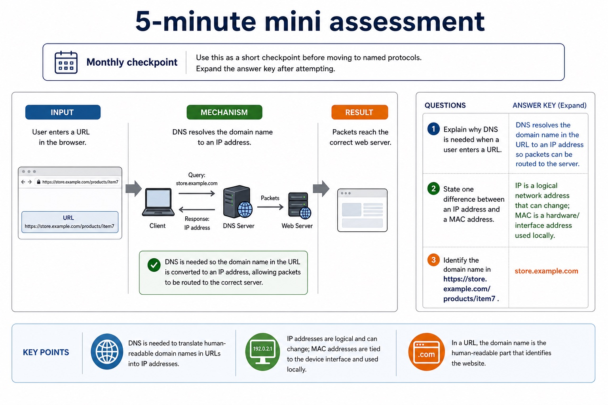

# Lesson 012: IP addressing, subnetting, URLs and DNS

**Course:** Cambridge International AS Level Computer Science 9618, 2027-2029 Version 2 
**Paper:** Paper 1 
**Syllabus:** Section 2: Communication 
**Syllabus requirements:** S2.15, S2.16 
**Pacing:** Flexible. This lesson is deliberately over-complete; select a quick, full or deep route for the learners in front of you.

## Teaching-depth menu

- **Quick route:** Use the diagnostic, learning objectives, first worked example and foundation question. Stop once the learner can explain the central distinction accurately.
- **Full route:** Teach every core explanation point, the worked example and all lesson questions. Use the visual only when it adds a different representation.
- **Deep route:** Add the prerequisite refresher, ask learners to connect the concept checklist, discuss the labelled extension and complete a transfer question without a model answer.

## 1. Prerequisite knowledge and quick diagnostic

Recall S2.15 before starting this lesson.

Ask the learner to give one accurate definition or method step before continuing. If they cannot, briefly revisit the named prerequisite rather than repeating the whole previous lesson.

### Optional prerequisite refresher

- IPv4 is 32-bit and IPv6 is 128-bit. An address is associated with a network interface on a network. Private addressing reduces direct public reachability but does not guarantee security.
- Explain IP-address use, including IPv4/IPv6 format, subnetting, device association, public/private and static/dynamic addresses, and security implications.

## 2. Knowledge explanation

### Learning objectives

- Explain IP-address use, including IPv4/IPv6 format, subnetting, device association, public/private and static/dynamic addresses, and security implications.
- Explain how a URL locates a WWW resource and the role of DNS.

### Concept checklist for teacher choice

- IPv6
- 128-bit
- subnetting
- network interface
- public address
- private address
- static addresses
- dynamic addresses
- does not guarantee security
- Uniform Resource Locator
- scheme
- domain name
- path
- DNS resolves
- IP address
- WWW resource

### Detailed explanation

- IPv4 is 32-bit and IPv6 is 128-bit. An address is associated with a network interface on a network. Private addressing reduces direct public reachability but does not guarantee security.
- A URL may contain scheme, domain, optional port, path and optional query/fragment. DNS resolves the domain name to an IP address; it does not resolve the path or store the resource.
- LAN hardware includes a switch, server, NIC/WNIC, WAP, cables, bridge and repeater. A server provides network services. A NIC/WNIC connects a device by cable or wirelessly; a WAP connects wireless devices to a wired LAN. A switch forwards frames within a LAN, a bridge connects LAN segments, a repeater regenerates a weakened signal, and cables carry signals.
- A router connects different networks and forwards packets using destination IP addresses and stored routing information. It is not a replacement name for a switch: the two devices make forwarding decisions at different scopes.
- After a collision, stations stop transmitting, send/recognise a jam signal, wait for different random backoff periods and retry. The random delay reduces the chance of another simultaneous attempt.
- A URL locates a WWW resource: DNS resolves the domain to an IP address, while the remaining URL components identify the required resource.
- Bit streaming delivers media progressively so playback can begin before the whole file arrives. Real-time streaming carries a live event with minimal delay; on-demand streaming sends stored content selected by the user.
- Bit rate is the number of bits transmitted each second. Available broadband speed must normally exceed the media bit rate and absorb variation; otherwise the player buffers, lowers quality or pauses. A buffer stores arriving data temporarily.
- The internet is the global network infrastructure that interconnects networks and carries many services. The World Wide Web is one service that uses the internet to provide linked resources accessed with web protocols and browsers.
- Internet hardware includes routers and transmission links that forward data between networks. Web servers store or generate web resources, while clients request those resources; the WWW is therefore not a synonym for all internet services.
- A modem converts signals into a form suitable for the access link and back again. Internet-supporting connections include the PSTN (Public Switched Telephone Network), a dedicated line and a cell phone network or cellular phone network. Each has different sharing, mobility and availability characteristics.
- When describing an internet connection, follow the path from the end device through its NIC, LAN switch or access point, router and access link. Name each device only for the job it performs.

### Worked example

Trace a school request / Two stations sense an idle cable / 6 Mbit/s video on 4 Mbit/s link / Separate infrastructure from service / Home-to-provider path / Locate one resource on a school web server: A laptop sends a frame through its wireless interface to an access point. The LAN switch forwards it toward the router. The router then forwards the packet from the school LAN toward another network. Both may begin before either signal reaches the other. They detect the collision, stop, wait different random periods and the station whose timer expires first retries. The stream consumes data faster than the link supplies it. A starting buffer only delays the shortage; sustained playback requires a lower bit rate or faster connection. Sending email uses the internet but not the WWW.…

Beyond syllabus / 延伸知识（不要求背诵）: real networks organise communication in layers so that hardware, addressing and application protocols can change independently.

### Retained visual explanation

_5-minute mini assessment. The image and mobile text alternative come from one maintained fact source._

## 3. Practice by question type

### Question 1 - foundation - apply - 2 marks

What is the purpose of subnetting?

**Answer:** To divide a network into logical subnetworks and identify which subnet an address belongs to.

**Marking guidance:** Award one mark for each distinct, technically accurate point or method step.

**Common error:** For the command word apply, perform that exact action; do not replace it with an unrelated fact.

### Question 2 - application - explain - 2 marks

Why might a server use a static IP address?

**Answer:** Clients/DNS need a predictable address for the service.

**Marking guidance:** Award one mark for each distinct, technically accurate point or method step.

**Common error:** Do not repeat the same point in different words; each mark needs a separate idea or method step.

### Question 3 - transfer - apply - 2 marks

What is the role of a NIC?

**Answer:** It provides the device's network interface for sending and receiving data.

**Marking guidance:** Award one mark for each distinct, technically accurate point or method step.

**Common error:** Do not copy the worked example unchanged; transfer the method and check it against the new context.

### Related past-paper indexes

| Reference | Marks | Command word | Question type |
|---|---:|---|---|
| 9618/11/W/25 Q7(c) | 4 | complete | recall |
| 9618/12/S/25 Q6(d) | 4 | complete | recall |
| 9618/11/W/25 Q7(a) | 2 | complete | recall |
| 9618/11/W/25 Q7(b) | 2 | complete | recall |

These are indexes only. Cambridge question and mark-scheme wording is not reproduced.

## 4. Summary and exam reminders

### Summary

- Define ip addressing, subnetting, urls and dns with the exact technical vocabulary expected by the syllabus.
- Use the lesson method on a fresh context and show the intermediate decision, representation or calculation.
- Match the shape of the answer to the command word and the available marks.
- Check the final answer against the scenario instead of repeating a memorised sentence.

### Common error to correct

Students often confuse bandwidth with speed in every sense. Correction: bandwidth is capacity; latency and congestion also affect perceived performance.

### Exam technique

- Follow the command word: state gives a fact; explain links a cause to a consequence; compare covers both sides.
- Match the number of independent points or method steps to the available marks.
- For ip addressing, subnetting, urls and dns, use the exact technical term before applying it to the scenario.
