# Lesson 013: Input, output, storage and embedded systems

**Course:** Cambridge International AS Level Computer Science 9618, 2027-2029 Version 2 
**Paper:** Paper 1 
**Syllabus:** Section 3: Hardware 
**Syllabus requirements:** S3.01, S3.02 
**Pacing:** Flexible. Select the material set and practice depth needed by the learner.

## Teaching-depth menu

- **Quick route:** Use the diagnostic, learning objectives, first worked example and foundation question. Stop once the learner can explain the central distinction accurately.
- **Full route:** Use every knowledge-point material set, the worked method, the terminology check and all questions.
- **Deep route:** Add the prerequisite refresher, ask learners to connect the concept checklist, discuss the labelled extension and complete a transfer question without a model answer.

## 1. Prerequisite knowledge and quick diagnostic

Recall the main conclusion from Lesson 012: IP addressing, subnetting, URLs and DNS.

Ask the learner to give one accurate definition or method step before continuing. If they cannot, briefly revisit the named prerequisite rather than repeating the whole previous lesson.

## 2. Knowledge explanation

### 1. Input · Output · Primary memory · Secondary storage (S3.01)

**Concept map:** input → output → primary memory → secondary storage → removable storage

**Three-part explanation:**

1. Show understanding of the need for input, output, primary memory and secondary storage, including removable storage
2. A surveyor enters measurements through a touchscreen, sees validation messages on the display, uses RAM as primary memory while the survey application runs, saves records on…
3. Removable storage is secondary storage that can be disconnected, so it can transfer data or hold an offline backup, although it can be lost or stolen

**Concrete cue:** Show understanding of the need for input, output, primary memory and secondary storage, including removable storage.

#### The basic system flow

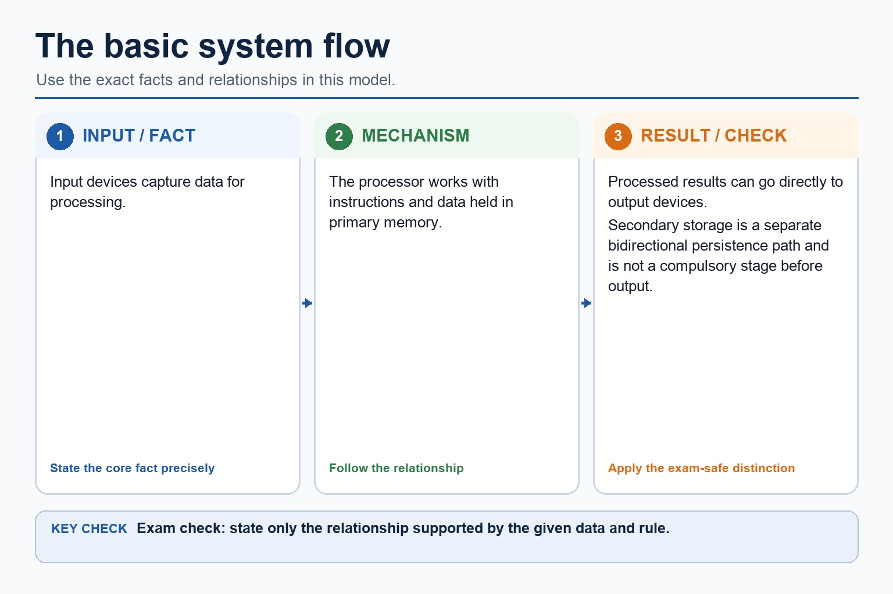

Text transcript

- Input devices capture data for processing.
- The processor works with instructions and data held in primary memory.
- Processed results can go directly to output devices.
- Secondary storage is a separate bidirectional persistence path and is not a compulsory stage before output.

#### Memory is not the same as storage

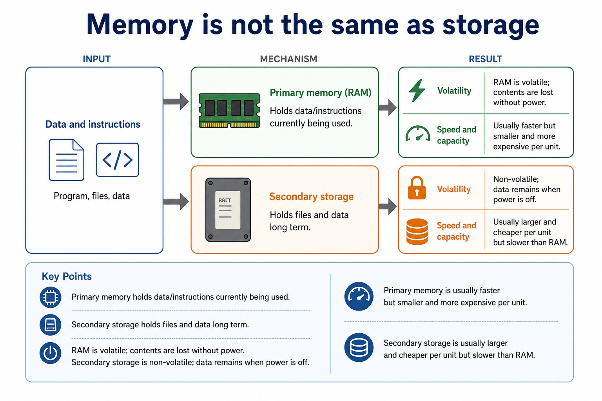

Text transcript

- Primary memory
- Secondary storage
- Holds data/instructions currently being used.
- Holds files and data long term.
- Volatility
- RAM is volatile; contents are lost without power.
- Non-volatile; data remains when power is off.
- Speed and capacity

#### What secondary storage does

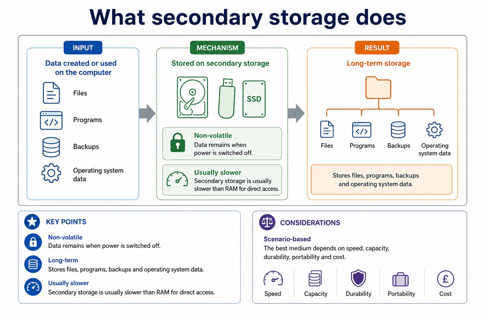

Text transcript

- Non-volatile Data remains when power is switched off.
- Long-term Stores files, programs, backups and operating system data.
- Usually slower Secondary storage is usually slower than RAM for direct access.
- Scenario-based The best medium depends on speed, capacity, durability, portability and cost.

#### Classify the hardware before choosing it

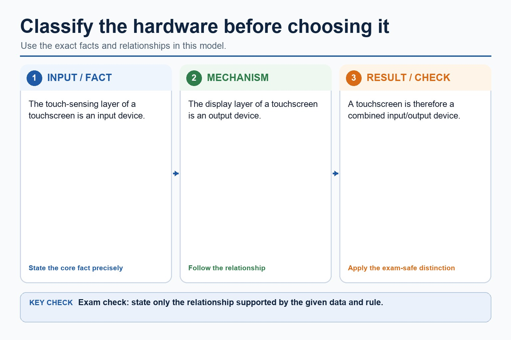

Text transcript

- The touch-sensing layer of a touchscreen is an input device.
- The display layer of a touchscreen is an output device.
- A touchscreen is therefore a combined input/output device.

Precise syllabus wording

Explain the need for input, output, primary storage, secondary storage and removable storage.

Show understanding of the need for input, output, primary memory and secondary storage, including removable storage.

### 2. Embedded system · Dedicated · Benefit · Drawback (S3.02)

**Concept map:** embedded system → dedicated → benefit → drawback

**Three-part explanation:**

1. Show understanding of embedded systems, including their benefits and drawbacks
2. Drawbacks can include limited processing, storage and user interface, difficulty adding new functions, and dependence on the embedded controller
3. An embedded system is a computer system built into a larger device to perform one dedicated task or a closely related set of tasks

**Concrete cue:** Show understanding of embedded systems, including their benefits and drawbacks.

#### What is an embedded system?

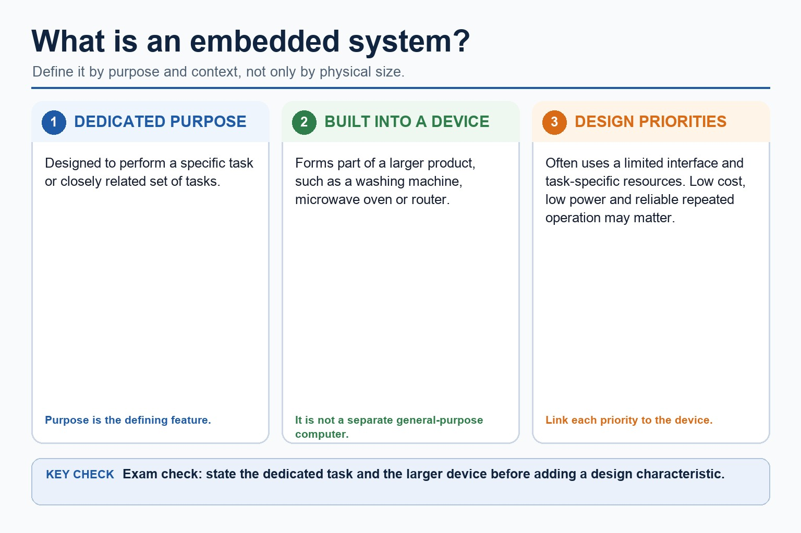

Text transcript

- An embedded system is designed to perform a specific task or closely related set of tasks.
- It forms part of a larger product, such as a washing machine, microwave oven or router.
- It often uses a limited interface and task-specific resources.
- Low cost, low power and reliable repeated operation may be relevant design priorities.
- Define an embedded system by purpose and context, not only by physical size.

Precise syllabus wording

Understand embedded systems and their benefits/drawbacks.

Show understanding of embedded systems, including their benefits and drawbacks.

### Supporting diagram library

#### Component roles and examples

Text transcript

- Input devices
- Allow data to enter the system.
- Examples: keyboard, mouse, barcode reader, touch screen, microphone, camera, sensor.
- Output devices
- Present data or results from the system.
- Examples: monitor, speaker, printer, projector, actuator.
- Processor
- Executes instructions and coordinates operations. It processes data; it is not where user files are stored.

#### Manual input vs automatic data capture

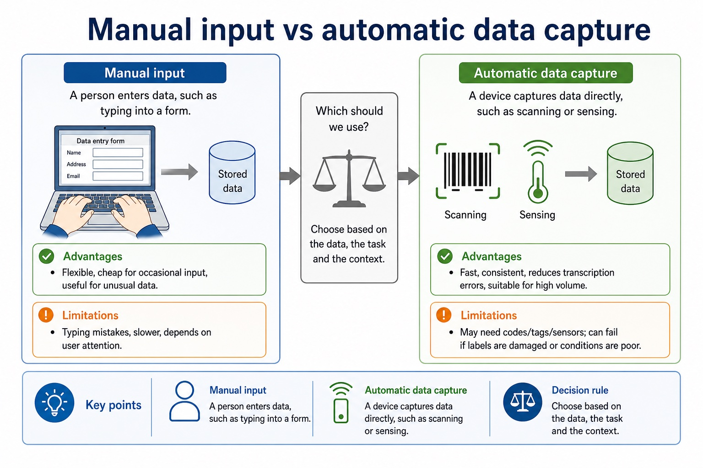

Text transcript

- Manual input
- Automatic data capture
- A person enters data, such as typing into a form.
- A device captures data directly, such as scanning or sensing.
- Advantages
- Flexible, cheap for occasional input, useful for unusual data.
- Fast, consistent, reduces transcription errors, suitable for high volume.
- Limitations

#### What input devices do

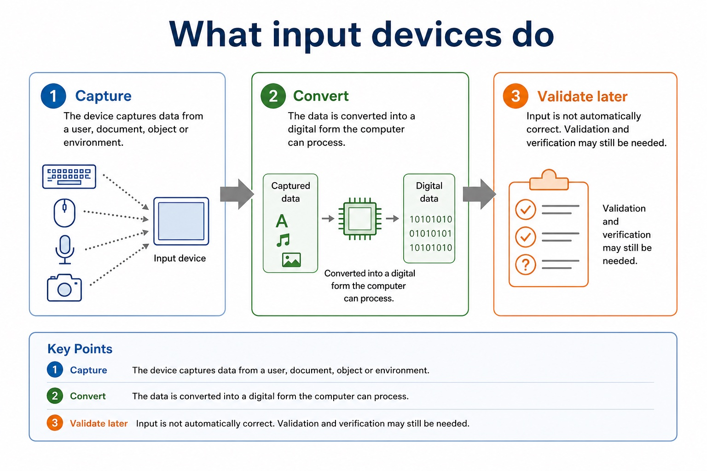

Text transcript

- 1. Capture The device captures data from a user, document, object or environment.
- 2. Convert The data is converted into a digital form the computer can process.
- 3. Validate later Input is not automatically correct. Validation and verification may still be needed.

#### Common input devices and what they capture

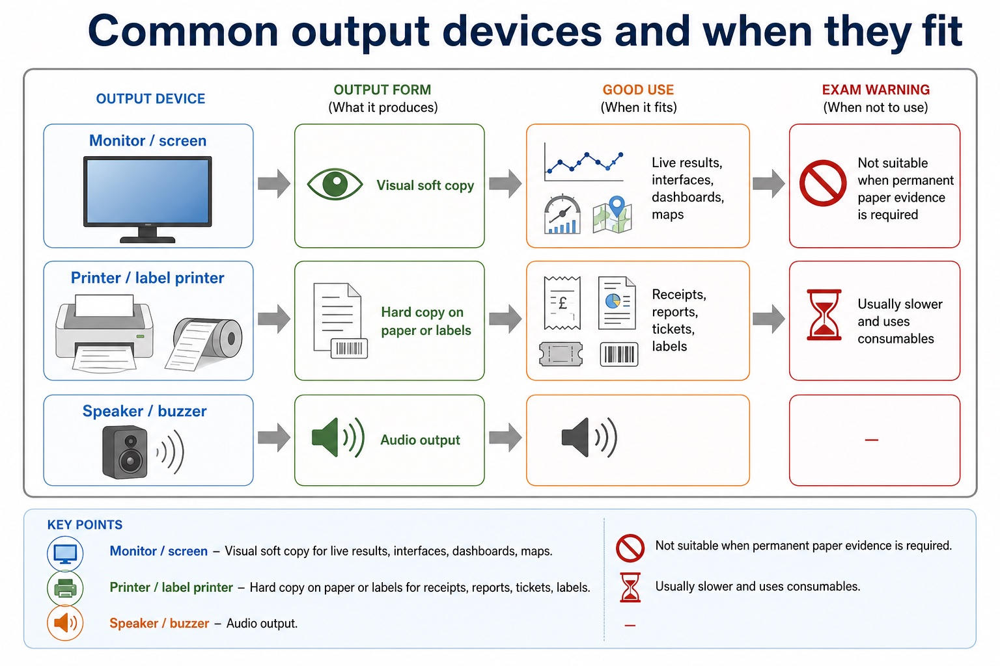

Text transcript

- Captures
- Good use
- Exam warning
- Keyboard
- Typed text/numbers
- Short manual entries, corrections, commands
- Slow and error-prone for long repeated codes
- Barcode / QR reader

#### Microcontroller vs general-purpose computer

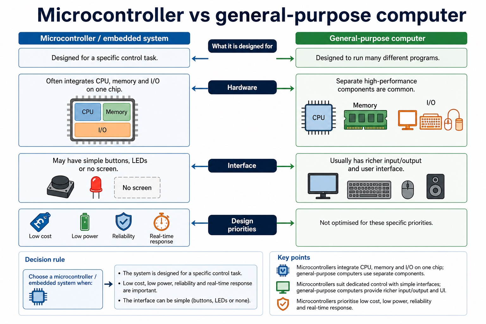

Text transcript

- Microcontroller / embedded system
- General-purpose computer
- Designed for a specific control task.
- Designed to run many different programs.
- Hardware
- Often integrates CPU, memory and I/O on one chip.
- Separate high-performance components are common.
- Interface

#### Choose hardware using stated criteria

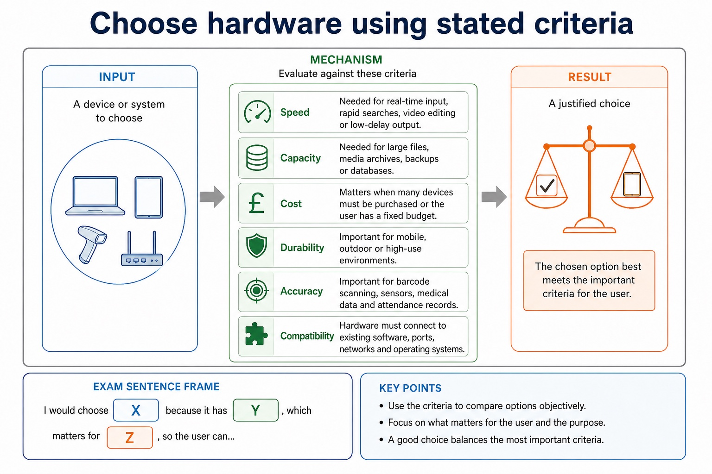

Text transcript

- Speed Needed for real-time input, rapid searches, video editing or low-delay output.
- Capacity Needed for large files, media archives, backups or databases.
- Cost Matters when many devices must be purchased or the user has a fixed budget.
- Durability Important for mobile, outdoor or high-use environments.
- Accuracy Important for barcode scanning, sensors, medical data and attendance records.
- Compatibility Hardware must connect to existing software, ports, networks and operating systems.
- Exam sentence frame: "I would choose X because it has Y, which matters for Z, so the user can..."

#### Different users value different trade-offs

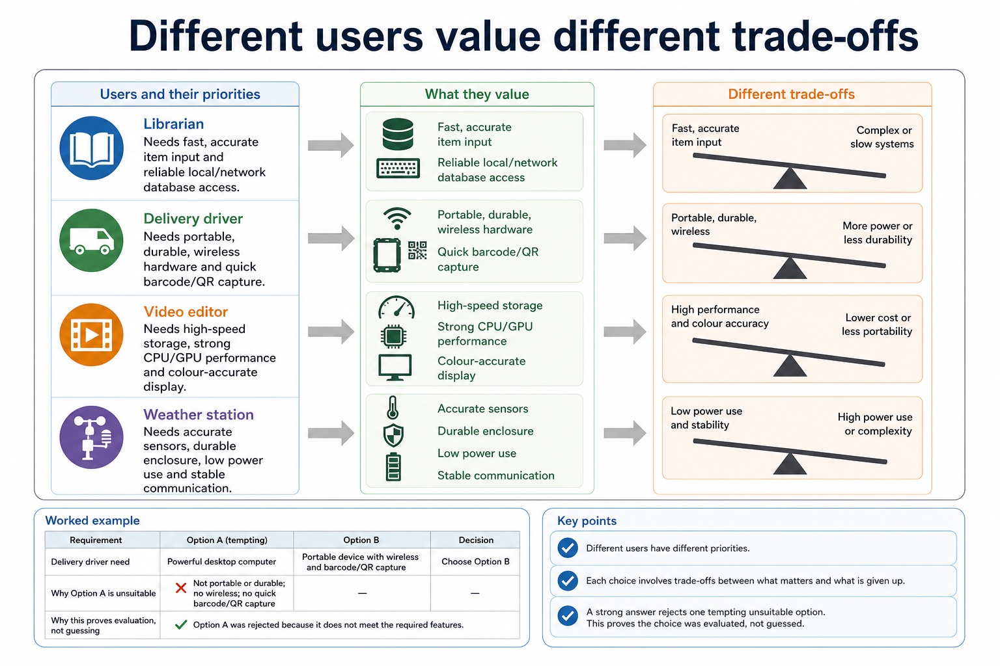

Text transcript

- Librarian Needs fast, accurate item input and reliable local/network database access.
- Delivery driver Needs portable, durable, wireless hardware and quick barcode/QR capture.
- Video editor Needs high-speed storage, strong CPU/GPU performance and colour-accurate display.
- Weather station Needs accurate sensors, durable enclosure, low power use and stable communication.
- A strong answer rejects one tempting unsuitable option. This proves the choice was evaluated, not guessed.

#### Environmental factors change hardware suitability

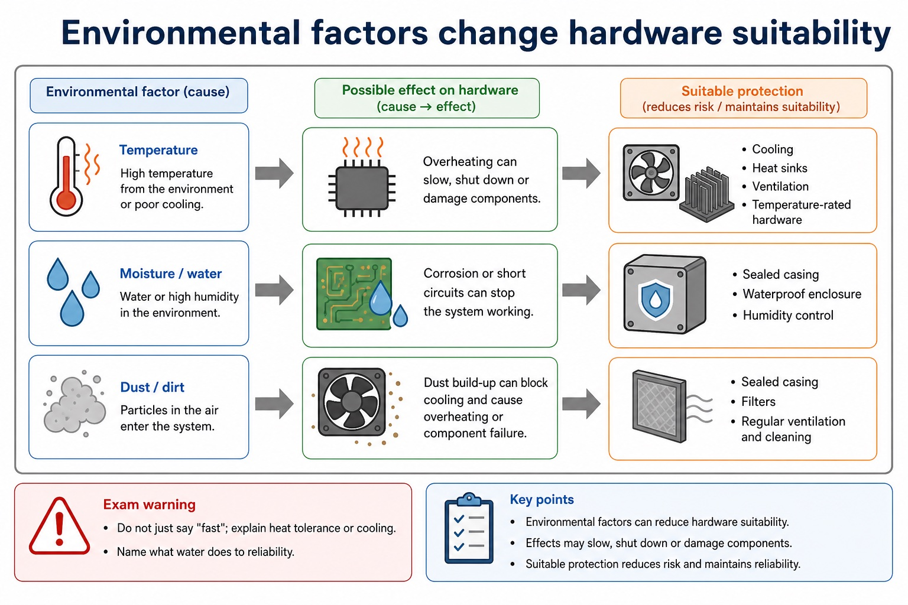

Text transcript

- Possible effect
- Suitable protection
- Exam warning
- Temperature
- Overheating can slow, shut down or damage components.
- Cooling, heat sinks, ventilation, temperature-rated hardware
- Do not just say "fast"; explain heat tolerance or cooling.
- Moisture / water

#### Mitigation must match the risk

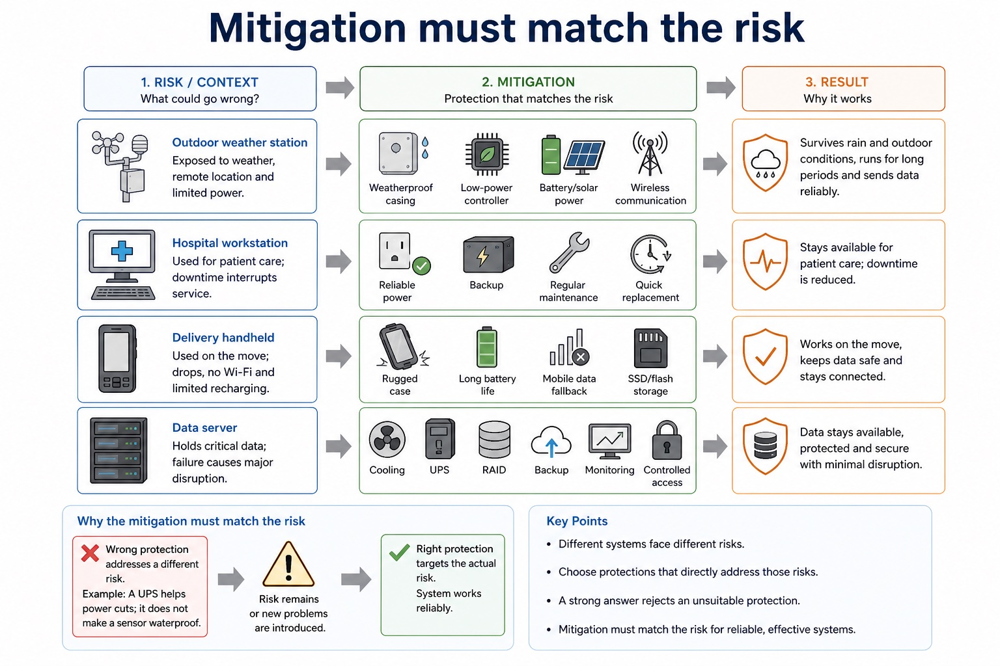

Text transcript

- Outdoor weather station Weatherproof casing, low-power controller, battery/solar power and wireless communication.
- Hospital workstation Reliable power, backup, regular maintenance and quick replacement to reduce downtime.
- Delivery handheld Rugged case, long battery life, mobile data fallback and SSD/flash storage.
- Data server Cooling, UPS, RAID, backup, monitoring and controlled access.
- A strong answer rejects an unsuitable protection. A UPS helps power cuts; it does not make a sensor waterproof.

#### Reliability is about continuing to work correctly

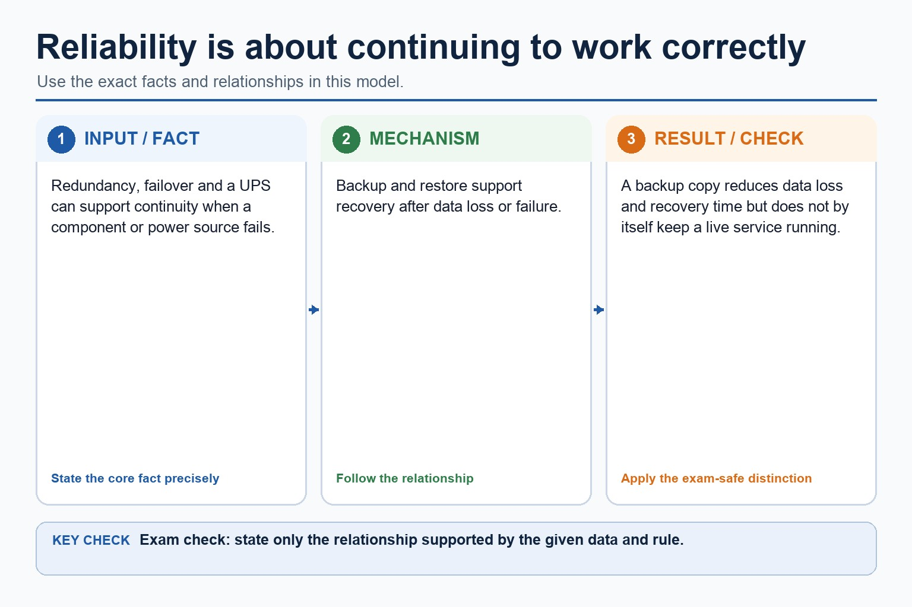

Text transcript

- Redundancy, failover and a UPS can support continuity when a component or power source fails.
- Backup and restore support recovery after data loss or failure.
- A backup copy reduces data loss and recovery time but does not by itself keep a live service running.

Open precise terminology and exam facts

- Show understanding of the need for input, output, primary memory and secondary storage, including removable storage.
- Show understanding of embedded systems, including their benefits and drawbacks.
- Input is needed to enter data and instructions into a computer system. Output is needed to communicate processed information to a user or to cause an action. A processor cannot perform a useful task unless it can receive the required data and make the result available.
- Primary memory is needed to hold the instructions and data currently being used by the processor. Secondary storage is needed for non-volatile, long-term retention of programs and data. Removable storage is secondary storage that can be disconnected, so it can transfer data or hold an offline backup, although it can be lost or stolen.
- An embedded system is a computer system built into a larger device to perform one dedicated task or a closely related set of tasks. A microcontroller may integrate the processor, memory and input/output interfaces needed for that task.
- Benefits can include low cost, low power use, small size and reliable, predictable automatic operation because the hardware and software are designed for a limited purpose. Drawbacks can include limited processing, storage and user interface, difficulty adding new functions, and dependence on the embedded controller: if it fails, the larger device may stop working. A valid comparison must link each point to the device and task.
- A control system sends output signals to actuators and uses sensor feedback to determine the next control action.

### Worked example

1. Field survey tablet
2. A surveyor enters measurements through a touchscreen, sees validation messages on the display, uses RAM as primary memory while the survey application runs, saves records on internal secondary storage, and copies an…

Beyond syllabus / 延伸知识（不要求背诵）: professional device selection also considers accessibility, reliability, repairability and energy use.
## 3. Practice by question type

### Question 1 - foundation - explain - 5 marks

A portable medical system receives patient measurements, processes them and stores the records. Explain why it needs input, output, primary memory, secondary storage and removable storage.

**Answer:** input receives patient measurements/data; output communicates results or warnings; primary memory holds current program instructions and working data; secondary storage retains patient records long term without power; removable storage supports transfer or an offline/detachable backup

**Marking guidance:** Do not treat primary memory, secondary storage and removable storage as interchangeable terms.

**Common error:** For the command word explain, perform that exact action; do not replace it with an unrelated fact.

### Question 2 - application - define - 2 marks

What two features define an embedded system?

**Answer:** It is built into a larger device and performs a dedicated task or closely related set of tasks.

**Marking guidance:** Award one mark for each distinct, technically accurate point or method step.

**Common error:** Do not repeat the same point in different words; each mark needs a separate idea or method step.

### Question 3 - transfer - give - 2 marks

Give one drawback of an embedded controller and explain its consequence.

**Answer:** For example, limited resources make it difficult to add unrelated functions or run general-purpose software.

**Marking guidance:** Award one mark for each distinct, technically accurate point or method step.

**Common error:** Do not copy the worked example unchanged; transfer the method and check it against the new context.

### Related past-paper indexes

| Reference | Marks | Command word | Question type |
|---|---:|---|---|
| 9618/12/W/24 Q2(a) | 3 | describe | explain |
| 9618/11/S/24 Q2(a) | 2 | identify | recall |
| 9618/11/S/24 Q2(i) | 2 | identify | recall |
| 9618/11/S/24 Q2(ii) | 2 | give | recall |

These are indexes only. Cambridge question and mark-scheme wording is not reproduced.

## 4. Summary and exam reminders

### Summary

- Define input, output, storage and embedded systems with the exact technical vocabulary expected by the syllabus.
- Use the lesson method on a fresh context and show the intermediate decision, representation or calculation.
- Match the shape of the answer to the command word and the available marks.
- Check the final answer against the scenario instead of repeating a memorised sentence.

### Common error to correct

Students often list hardware without explaining suitability. Correction: the mark usually comes from matching a feature to a need.

### Exam technique

- Follow the command word: state gives a fact; explain links a cause to a consequence; compare covers both sides.
- Match the number of independent points or method steps to the available marks.
- For input, output, storage and embedded systems, use the exact technical term before applying it to the scenario.
