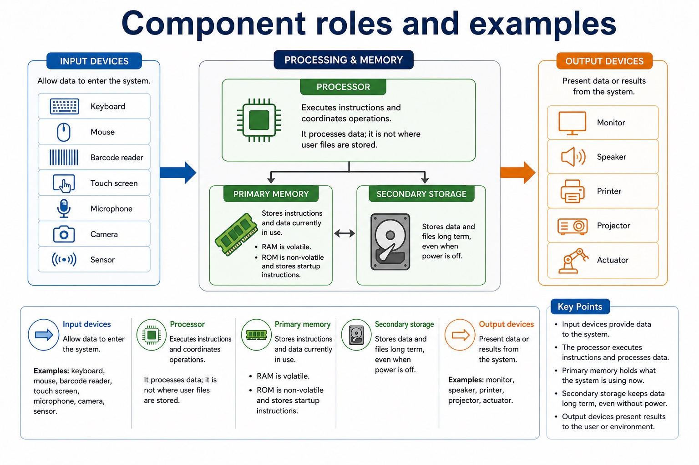

# Lesson 013: Input, output, storage and embedded systems

**Course:** Cambridge International AS Level Computer Science 9618, 2027-2029 Version 2 
**Paper:** Paper 1 
**Syllabus:** Section 3: Hardware 
**Syllabus requirements:** S3.01, S3.02 
**Pacing:** Flexible. This lesson is deliberately over-complete; select a quick, full or deep route for the learners in front of you.

## Teaching-depth menu

- **Quick route:** Use the diagnostic, learning objectives, first worked example and foundation question. Stop once the learner can explain the central distinction accurately.
- **Full route:** Teach every core explanation point, the worked example and all lesson questions. Use the visual only when it adds a different representation.
- **Deep route:** Add the prerequisite refresher, ask learners to connect the concept checklist, discuss the labelled extension and complete a transfer question without a model answer.

## 1. Prerequisite knowledge and quick diagnostic

Recall the main conclusion from Lesson 012: IP addressing, subnetting, URLs and DNS.

Ask the learner to give one accurate definition or method step before continuing. If they cannot, briefly revisit the named prerequisite rather than repeating the whole previous lesson.

## 2. Knowledge explanation

### Learning objectives

- Explain the need for input, output, primary storage, secondary storage and removable storage.
- Understand embedded systems and their benefits/drawbacks.

### Concept checklist for teacher choice

- input
- output
- primary memory
- secondary storage
- removable storage
- embedded system
- dedicated
- benefit
- drawback

### Detailed explanation

- Show understanding of the need for input, output, primary memory and secondary storage, including removable storage.
- Show understanding of embedded systems, including their benefits and drawbacks.
- Input is needed to enter data and instructions into a computer system. Output is needed to communicate processed information to a user or to cause an action. A processor cannot perform a useful task unless it can receive the required data and make the result available.
- Primary memory is needed to hold the instructions and data currently being used by the processor. Secondary storage is needed for non-volatile, long-term retention of programs and data. Removable storage is secondary storage that can be disconnected, so it can transfer data or hold an offline backup, although it can be lost or stolen.
- An embedded system is a computer system built into a larger device to perform one dedicated task or a closely related set of tasks. A microcontroller may integrate the processor, memory and input/output interfaces needed for that task.
- Benefits can include low cost, low power use, small size and reliable, predictable automatic operation because the hardware and software are designed for a limited purpose. Drawbacks can include limited processing, storage and user interface, difficulty adding new functions, and dependence on the embedded controller: if it fails, the larger device may stop working. A valid comparison must link each point to the device and task.
- A control system sends output signals to actuators and uses sensor feedback to determine the next control action.

### Worked example

Field survey tablet: A surveyor enters measurements through a touchscreen, sees validation messages on the display, uses RAM as primary memory while the survey application runs, saves records on internal secondary storage, and copies an encrypted backup to removable storage before leaving the site.

Beyond syllabus / 延伸知识（不要求背诵）: professional device selection also considers accessibility, reliability, repairability and energy use.

### Retained visual explanation

_Component roles and examples. The image and mobile text alternative come from one maintained fact source._

## 3. Practice by question type

### Question 1 - foundation - explain - 5 marks

A portable medical system receives patient measurements, processes them and stores the records. Explain why it needs input, output, primary memory, secondary storage and removable storage.

**Answer:** input receives patient measurements/data; output communicates results or warnings; primary memory holds current program instructions and working data; secondary storage retains patient records long term without power; removable storage supports transfer or an offline/detachable backup

**Marking guidance:** Do not treat primary memory, secondary storage and removable storage as interchangeable terms.

**Common error:** For the command word explain, perform that exact action; do not replace it with an unrelated fact.

### Question 2 - application - define - 2 marks

What two features define an embedded system?

**Answer:** It is built into a larger device and performs a dedicated task or closely related set of tasks.

**Marking guidance:** Award one mark for each distinct, technically accurate point or method step.

**Common error:** Do not repeat the same point in different words; each mark needs a separate idea or method step.

### Question 3 - transfer - give - 2 marks

Give one drawback of an embedded controller and explain its consequence.

**Answer:** For example, limited resources make it difficult to add unrelated functions or run general-purpose software.

**Marking guidance:** Award one mark for each distinct, technically accurate point or method step.

**Common error:** Do not copy the worked example unchanged; transfer the method and check it against the new context.

### Related past-paper indexes

| Reference | Marks | Command word | Question type |
|---|---:|---|---|
| 9618/12/W/24 Q2(a) | 3 | describe | explain |
| 9618/11/S/24 Q2(a) | 2 | identify | recall |
| 9618/11/S/24 Q2(i) | 2 | identify | recall |
| 9618/11/S/24 Q2(ii) | 2 | give | recall |

These are indexes only. Cambridge question and mark-scheme wording is not reproduced.

## 4. Summary and exam reminders

### Summary

- Define input, output, storage and embedded systems with the exact technical vocabulary expected by the syllabus.
- Use the lesson method on a fresh context and show the intermediate decision, representation or calculation.
- Match the shape of the answer to the command word and the available marks.
- Check the final answer against the scenario instead of repeating a memorised sentence.

### Common error to correct

Students often list hardware without explaining suitability. Correction: the mark usually comes from matching a feature to a need.

### Exam technique

- Follow the command word: state gives a fact; explain links a cause to a consequence; compare covers both sides.
- Match the number of independent points or method steps to the available marks.
- For input, output, storage and embedded systems, use the exact technical term before applying it to the scenario.
