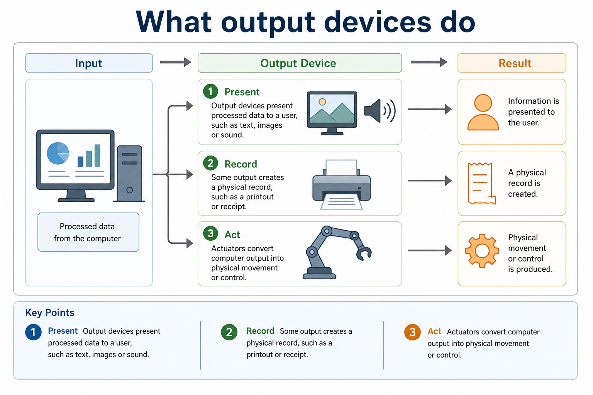
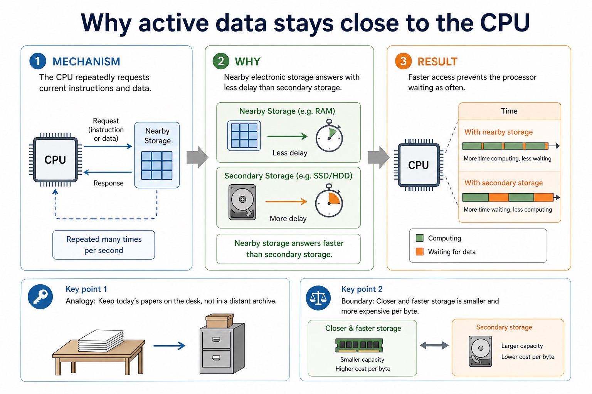
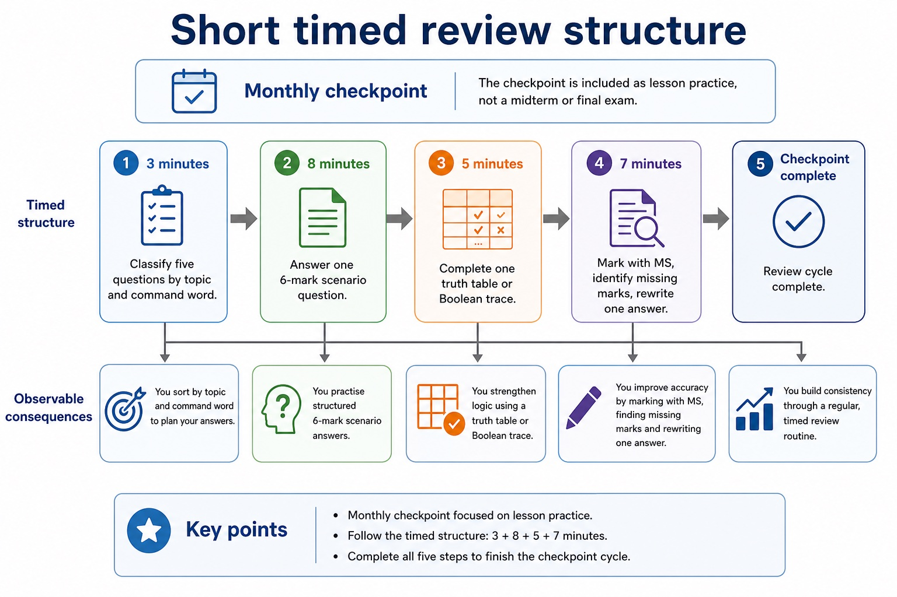
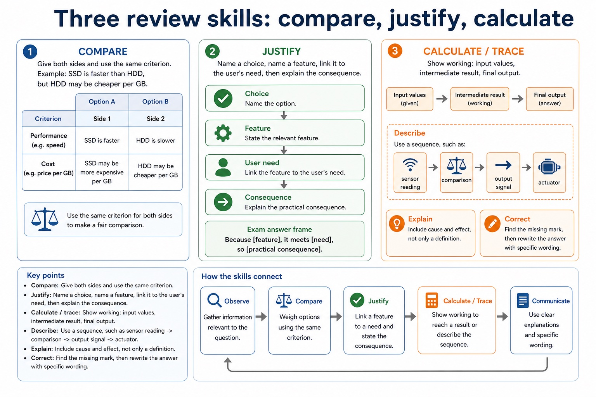

# Lesson 014: How input, output and storage devices work

**Course:** Cambridge International AS Level Computer Science 9618, 2027-2029 Version 2 
**Paper:** Paper 1 
**Syllabus:** Section 3: Hardware 
**Syllabus requirements:** S3.03 
**Pacing:** Flexible. Select the material set and practice depth needed by the learner.

## Teaching-depth menu

- **Quick route:** Use the diagnostic, learning objectives, first worked example and foundation question. Stop once the learner can explain the central distinction accurately.
- **Full route:** Use every knowledge-point material set, the worked method, the terminology check and all questions.
- **Deep route:** Add the prerequisite refresher, ask learners to connect the concept checklist, discuss the labelled extension and complete a transfer question without a model answer.

## 1. Prerequisite knowledge and quick diagnostic

Recall S3.01 before starting this lesson.

Ask the learner to give one accurate definition or method step before continuing. If they cannot, briefly revisit the named prerequisite rather than repeating the whole previous lesson.

### Optional prerequisite refresher

- Show understanding of the need for input, output, primary memory and secondary storage, including removable storage.

## 2. Knowledge explanation

### 1. Laser printer · 3D printer · Microphone · Speaker (S3.03)

**Concept map:** laser printer → 3D printer → microphone → speaker → HDD → flash memory → optical reader/writer → touchscreen → VR headset

**Three-part explanation:**

1. laser printer, 3D printer, microphone, speakers, magnetic hard disk, solid state (flash) memory, optical disc reader/writer, touchscreen and virtual reality headset
2. An HDD or magnetic hard disk uses rotating magnetic platters, flash memory stores charge electronically, and an optical reader/writer uses a laser
3. Describe the principal operations of

**Concrete cue:** Describe the principal operations of: laser printer, 3D printer, microphone, speakers, magnetic hard disk, solid state (flash) memory, optical disc reader/writer, touchscreen and virtual reality headset.

#### Three main storage media

Text transcript

- Magnetic storage uses magnetised areas; examples include HDD and tape.
- Optical storage uses laser light to read marks on a disc.
- Solid-state secondary storage uses non-volatile flash memory with no moving parts; an SSD or NAND flash chip is the correct illustration.
- A volatile RAM DIMM is primary memory and is not an SSD.

#### Component roles and examples

Text transcript

- Input devices
- Allow data to enter the system.
- Examples: keyboard, mouse, barcode reader, touch screen, microphone, camera, sensor.
- Output devices
- Present data or results from the system.
- Examples: monitor, speaker, printer, projector, actuator.
- Processor
- Executes instructions and coordinates operations. It processes data; it is not where user files are stored.

#### Compare by scenario, not by favourite brand

Text transcript

- An HDD provides high capacity at relatively low cost and suits large file libraries or cost-sensitive backups.
- Magnetic tape provides high capacity with sequential access and suits archival backups.
- Optical media suits distributing read-only content or archiving data that changes rarely.

#### Look at the storage mechanism before comparing performance

Text transcript

- Visual explanation
- The physical mechanism helps explain speed, durability and suitable uses.
- Magnetic
- Solid-state
- Three ways to store data when power is off. The illustration identifies the mechanism; the cards below state the exam-safe explanation.
- Magnetic HDD
- Magnetised areas store data on rotating platters. A moving actuator positions the read/write head.
- Consequence: high capacity and low cost per GB, but mechanical parts are vulnerable to shock.

#### Section 3 topic map

Text transcript

- RAM and ROM are primary memory; SSD, HDD and optical media are secondary storage.
- Virtual memory is a memory-management technique that uses secondary storage to supplement RAM.
- Do not classify virtual memory as a type of primary memory.

Precise syllabus wording

Describe principal operation of laser printer, 3D printer, microphone, speakers, HDD, flash memory, optical reader/writer, touchscreen and VR headset.

Describe the principal operations of: laser printer, 3D printer, microphone, speakers, magnetic hard disk, solid state (flash) memory, optical disc reader/writer, touchscreen and virtual reality headset.

### Supporting diagram library

#### Common output devices and when they fit

Text transcript

- Output form
- Good use
- Exam warning
- Monitor / screen
- Visual soft copy
- Live results, interfaces, dashboards, maps
- Not suitable when permanent paper evidence is required
- Hard copy on paper or labels

#### User feedback must fit the situation

Text transcript

- Display, auditory and haptic feedback are alternative output forms, not inputs.
- Printed records and actuator actions are separate output types rather than downstream results of display, sound or touch feedback.
- Haptic feedback requires physical contact and may be missed when vibration is weak or the device is not being held.

#### What output devices do

Text transcript

- 1. Present Output devices present processed data to a user, such as text, images or sound.
- 2. Record Some output creates a physical record, such as a printout or receipt.
- 3. Act Actuators convert computer output into physical movement or control.

#### Why cache helps and virtual memory slows

Text transcript

- Cache holds copies of recently or frequently used instructions and data close to the CPU.
- A cache hit avoids a slower main-memory access.
- Virtual memory uses secondary storage when RAM is insufficient and increases apparent capacity rather than physical RAM speed.

#### Why active data stays close to the CPU

Text transcript

- The CPU repeatedly requests current instructions and data.
- Nearby electronic storage answers with less delay than secondary storage.
- Faster access prevents the processor waiting as often.

#### Why RAM changes while ROM remains stable

Text transcript

- RAM holds the changing state of running programs.
- Most RAM needs continuous power to preserve that state.
- ROM retains fixed startup instructions when power is removed.

#### Short timed review structure

Text transcript

- Monthly checkpoint
- 3 minutes Classify five questions by topic and command word.
- 8 minutes Answer one 6-mark scenario question.
- 5 minutes Complete one truth table or Boolean trace.
- 7 minutes Mark with MS, identify missing marks, rewrite one answer.
- The checkpoint is included as lesson practice, not a midterm or final exam.

#### Three review skills: compare, justify, calculate

Text transcript

- Compare Give both sides and use the same criterion, e.g. SSD is faster than HDD, but HDD may be cheaper per GB.
- Justify Name a choice, name a feature, link it to the user's need, then explain the consequence.
- Calculate / trace Show working: input values, intermediate result, final output.
- Describe Use a sequence, such as sensor reading - comparison - output signal - actuator.
- Explain Include cause and effect, not only a definition.
- Correct Find the missing mark, then rewrite the answer with specific wording.
- Exam answer frame: "Because [feature], it meets [need], so [practical consequence]."

Open precise terminology and exam facts

- Describe the principal operations of: laser printer, 3D printer, microphone, speakers, magnetic hard disk, solid state (flash) memory, optical disc reader/writer, touchscreen and virtual reality headset.
- A microphone diaphragm vibrates with sound; a transducer converts the movement into an analogue electrical signal, which an ADC samples into digital values. A capacitive touchscreen detects a change in an electric field and calculates touch coordinates.
- A VR headset displays a separate view to each eye and uses motion/orientation sensors to update the viewpoint. Low-latency tracking is needed so the displayed scene follows head movement.
- Required device overview: a laser printer uses an electrostatic drum, laser, toner and fuser; a 3D printer builds successive layers; a speaker converts an electrical signal into sound. An HDD or magnetic hard disk uses rotating magnetic platters, flash memory stores charge electronically, and an optical reader/writer uses a laser.
- A laser printer charges a drum, a laser discharges selected points, toner adheres to the image, toner transfers to paper and heat/pressure fuse it. A 3D printer deposits or solidifies material layer by layer from a digital model.
- A speaker uses a DAC/amplifier to drive a coil and cone, producing pressure waves. An output buffer temporarily holds data because the processor can produce it faster or in different-sized bursts than a printer or audio device can consume it.
- An HDD spins magnetic platters while an actuator positions read/write heads; writing changes magnetic orientation and reading senses it. Flash memory stores charge in floating-gate cells and has no moving parts.
- An optical drive spins a disc and directs a laser at its track. Reflected-light differences are read as data; a writer uses a higher-power laser to change a dye or recording layer.
- A magnetic HDD uses moving read/write heads over rotating platters. Flash memory stores charge electronically with no moving parts. An optical disc reader/writer uses a laser to read marks and, on writable media, to create or alter marks.
- RAM is volatile read/write primary memory used for programs and data currently being processed. ROM is non-volatile primary memory used for instructions that must remain when power is removed, such as firmware or start-up instructions. ROM is not ordinary long-term storage for user files.
- SRAM stores bits using flip-flop circuits, needs no refresh and is fast but expensive with lower density, so it is used for cache. DRAM stores charge in capacitors, requires refresh and is slower but cheaper and denser, so it is used for main memory.

### Worked example

1. Print a page
2. Read an HDD block
3. Choose a storage mechanism
4. Choose memory for a computer system
5. The operating system places page data in a print buffer.
6. The CPU can continue other work while the slower printer consumes buffered data and performs drum, toner and fusing stages.

Beyond syllabus / 延伸知识（不要求背诵）: professional device selection also considers accessibility, reliability, repairability and energy use.
## 3. Practice by question type

### Question 1 - foundation - describe - 4 marks

Describe how a microphone captures sound for storage in a computer.

**Answer:** sound waves vibrate a diaphragm; transducer converts vibration to an analogue electrical signal; ADC samples/measures the signal; sample values are encoded/stored as binary

**Marking guidance:** Do not accept that the microphone directly records binary without an analogue signal and conversion stage.

**Common error:** For the command word describe, perform that exact action; do not replace it with an unrelated fact.

### Question 2 - application - apply - 2 marks

Which device uses a laser?

**Answer:** An optical reader/writer.

**Marking guidance:** Award one mark for each distinct, technically accurate point or method step.

**Common error:** Do not repeat the same point in different words; each mark needs a separate idea or method step.

### Question 3 - transfer - apply - 2 marks

What physical property stores HDD data?

**Answer:** Magnetic orientation/patterns on a platter.

**Marking guidance:** Award one mark for each distinct, technically accurate point or method step.

**Common error:** Do not copy the worked example unchanged; transfer the method and check it against the new context.

### Related past-paper indexes

| Reference | Marks | Command word | Question type |
|---|---:|---|---|
| 9618/11/S/25 Q6(b) | 5 | complete | recall |
| 9618/11/S/25 Q6(i) | 4 | complete | recall |
| 9618/11/S/25 Q6(ii) | 3 | complete | recall |
| 9618/11/W/25 Q10(a) | 3 | explain | explain |

These are indexes only. Cambridge question and mark-scheme wording is not reproduced.

## 4. Summary and exam reminders

### Summary

- Define how input, output and storage devices work with the exact technical vocabulary expected by the syllabus.
- Use the lesson method on a fresh context and show the intermediate decision, representation or calculation.
- Match the shape of the answer to the command word and the available marks.
- Check the final answer against the scenario instead of repeating a memorised sentence.

### Common error to correct

Students often list hardware without explaining suitability. Correction: the mark usually comes from matching a feature to a need.

### Exam technique

- Follow the command word: state gives a fact; explain links a cause to a consequence; compare covers both sides.
- Match the number of independent points or method steps to the available marks.
- For how input, output and storage devices work, use the exact technical term before applying it to the scenario.
