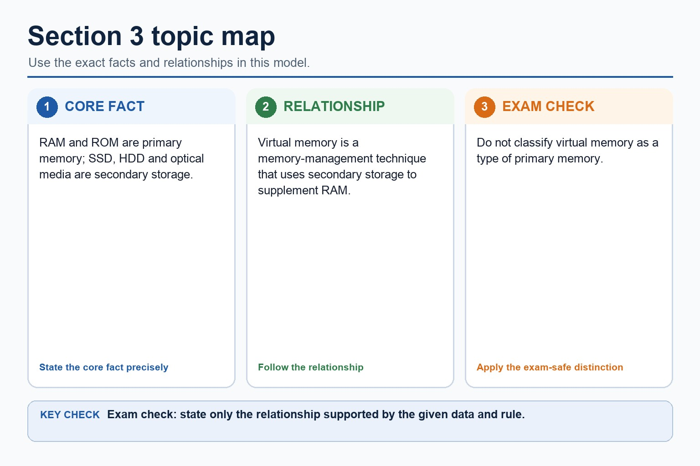

# Lesson 014: How input, output and storage devices work

**Course:** Cambridge International AS Level Computer Science 9618, 2027-2029 Version 2 
**Paper:** Paper 1 
**Syllabus:** Section 3: Hardware 
**Syllabus requirements:** S3.03 
**Pacing:** Flexible. This lesson is deliberately over-complete; select a quick, full or deep route for the learners in front of you.

## Teaching-depth menu

- **Quick route:** Use the diagnostic, learning objectives, first worked example and foundation question. Stop once the learner can explain the central distinction accurately.
- **Full route:** Teach every core explanation point, the worked example and all lesson questions. Use the visual only when it adds a different representation.
- **Deep route:** Add the prerequisite refresher, ask learners to connect the concept checklist, discuss the labelled extension and complete a transfer question without a model answer.

## 1. Prerequisite knowledge and quick diagnostic

Recall S3.01 before starting this lesson.

Ask the learner to give one accurate definition or method step before continuing. If they cannot, briefly revisit the named prerequisite rather than repeating the whole previous lesson.

### Optional prerequisite refresher

- Show understanding of the need for input, output, primary memory and secondary storage, including removable storage.

## 2. Knowledge explanation

### Learning objectives

- Describe principal operation of laser printer, 3D printer, microphone, speakers, HDD, flash memory, optical reader/writer, touchscreen and VR headset.

### Concept checklist for teacher choice

- laser printer
- 3D printer
- microphone
- speaker
- HDD / magnetic hard disk
- flash memory
- optical reader/writer / optical disc reader/writer
- touchscreen
- VR headset / virtual reality headset

### Detailed explanation

- Describe the principal operations of: laser printer, 3D printer, microphone, speakers, magnetic hard disk, solid state (flash) memory, optical disc reader/writer, touchscreen and virtual reality headset.
- A microphone diaphragm vibrates with sound; a transducer converts the movement into an analogue electrical signal, which an ADC samples into digital values. A capacitive touchscreen detects a change in an electric field and calculates touch coordinates.
- A VR headset displays a separate view to each eye and uses motion/orientation sensors to update the viewpoint. Low-latency tracking is needed so the displayed scene follows head movement.
- Required device overview: a laser printer uses an electrostatic drum, laser, toner and fuser; a 3D printer builds successive layers; a speaker converts an electrical signal into sound. An HDD or magnetic hard disk uses rotating magnetic platters, flash memory stores charge electronically, and an optical reader/writer uses a laser.
- A laser printer charges a drum, a laser discharges selected points, toner adheres to the image, toner transfers to paper and heat/pressure fuse it. A 3D printer deposits or solidifies material layer by layer from a digital model.
- A speaker uses a DAC/amplifier to drive a coil and cone, producing pressure waves. An output buffer temporarily holds data because the processor can produce it faster or in different-sized bursts than a printer or audio device can consume it.
- An HDD spins magnetic platters while an actuator positions read/write heads; writing changes magnetic orientation and reading senses it. Flash memory stores charge in floating-gate cells and has no moving parts.
- An optical drive spins a disc and directs a laser at its track. Reflected-light differences are read as data; a writer uses a higher-power laser to change a dye or recording layer.
- A magnetic HDD uses moving read/write heads over rotating platters. Flash memory stores charge electronically with no moving parts. An optical disc reader/writer uses a laser to read marks and, on writable media, to create or alter marks.
- RAM is volatile read/write primary memory used for programs and data currently being processed. ROM is non-volatile primary memory used for instructions that must remain when power is removed, such as firmware or start-up instructions. ROM is not ordinary long-term storage for user files.
- SRAM stores bits using flip-flop circuits, needs no refresh and is fast but expensive with lower density, so it is used for cache. DRAM stores charge in capacitors, requires refresh and is slower but cheaper and denser, so it is used for main memory.

### Worked example

Print a page / Read an HDD block / Choose a storage mechanism / Choose memory for a computer system: The operating system places page data in a print buffer. The CPU can continue other work while the slower printer consumes buffered data and performs drum, toner and fusing stages. The controller moves the head to the correct track, waits for the sector to rotate beneath it, senses magnetic patterns and transfers the decoded bits through a buffer. A portable device may use flash memory for shock resistance; an archive may use optical media when an optical disc reader/writer is available. Use DRAM as main RAM because its density and lower cost support a large working capacity. Use a small amount of SRAM for cache because faster, no-refresh access reduces processor waiting. Store updateable firmware in EEPROM because it remains without power but can be rewritten electrically.

Beyond syllabus / 延伸知识（不要求背诵）: professional device selection also considers accessibility, reliability, repairability and energy use.

### Retained visual explanation

_Section 3 topic map. The image and mobile text alternative come from one maintained fact source._

## 3. Practice by question type

### Question 1 - foundation - describe - 4 marks

Describe how a microphone captures sound for storage in a computer.

**Answer:** sound waves vibrate a diaphragm; transducer converts vibration to an analogue electrical signal; ADC samples/measures the signal; sample values are encoded/stored as binary

**Marking guidance:** Do not accept that the microphone directly records binary without an analogue signal and conversion stage.

**Common error:** For the command word describe, perform that exact action; do not replace it with an unrelated fact.

### Question 2 - application - apply - 2 marks

Which device uses a laser?

**Answer:** An optical reader/writer.

**Marking guidance:** Award one mark for each distinct, technically accurate point or method step.

**Common error:** Do not repeat the same point in different words; each mark needs a separate idea or method step.

### Question 3 - transfer - apply - 2 marks

What physical property stores HDD data?

**Answer:** Magnetic orientation/patterns on a platter.

**Marking guidance:** Award one mark for each distinct, technically accurate point or method step.

**Common error:** Do not copy the worked example unchanged; transfer the method and check it against the new context.

### Related past-paper indexes

| Reference | Marks | Command word | Question type |
|---|---:|---|---|
| 9618/11/S/25 Q6(b) | 5 | complete | recall |
| 9618/11/S/25 Q6(i) | 4 | complete | recall |
| 9618/11/S/25 Q6(ii) | 3 | complete | recall |
| 9618/11/W/25 Q10(a) | 3 | explain | explain |

These are indexes only. Cambridge question and mark-scheme wording is not reproduced.

## 4. Summary and exam reminders

### Summary

- Define how input, output and storage devices work with the exact technical vocabulary expected by the syllabus.
- Use the lesson method on a fresh context and show the intermediate decision, representation or calculation.
- Match the shape of the answer to the command word and the available marks.
- Check the final answer against the scenario instead of repeating a memorised sentence.

### Common error to correct

Students often list hardware without explaining suitability. Correction: the mark usually comes from matching a feature to a need.

### Exam technique

- Follow the command word: state gives a fact; explain links a cause to a consequence; compare covers both sides.
- Match the number of independent points or method steps to the available marks.
- For how input, output and storage devices work, use the exact technical term before applying it to the scenario.
