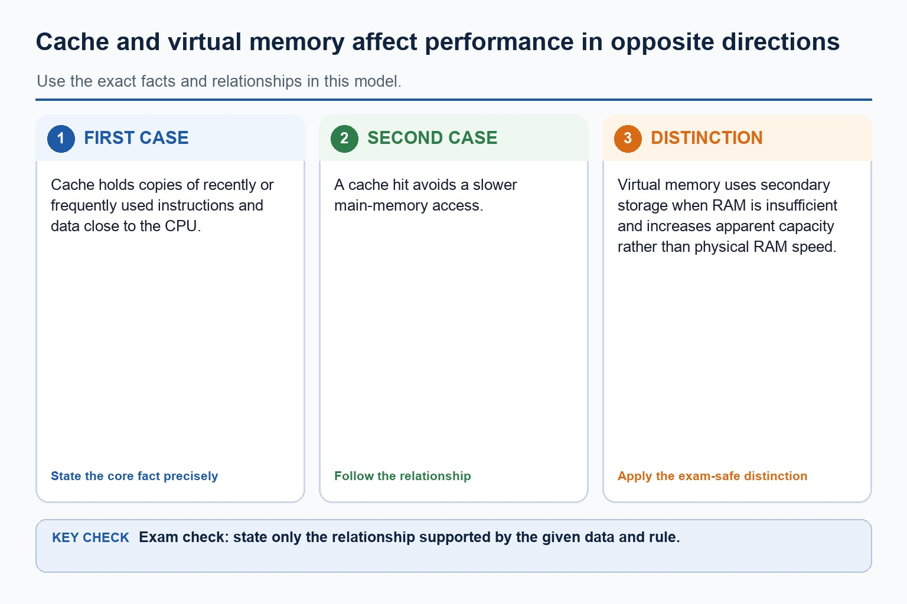

# Lesson 015: Buffers and primary memory technologies

**Course:** Cambridge International AS Level Computer Science 9618, 2027-2029 Version 2 
**Paper:** Paper 1 
**Syllabus:** Section 3: Hardware 
**Syllabus requirements:** S3.04, S3.05, S3.06, S3.07 
**Pacing:** Flexible. This lesson is deliberately over-complete; select a quick, full or deep route for the learners in front of you.

## Teaching-depth menu

- **Quick route:** Use the diagnostic, learning objectives, first worked example and foundation question. Stop once the learner can explain the central distinction accurately.
- **Full route:** Teach every core explanation point, the worked example and all lesson questions. Use the visual only when it adds a different representation.
- **Deep route:** Add the prerequisite refresher, ask learners to connect the concept checklist, discuss the labelled extension and complete a transfer question without a model answer.

## 1. Prerequisite knowledge and quick diagnostic

Recall S3.05 before starting this lesson.

Ask the learner to give one accurate definition or method step before continuing. If they cannot, briefly revisit the named prerequisite rather than repeating the whole previous lesson.

### Optional prerequisite refresher

- Explain the differences between RAM and ROM, including their use in a range of devices and systems.
- Distinguish RAM and ROM.

## 2. Knowledge explanation

### Learning objectives

- Understand why buffers are used.
- Distinguish RAM and ROM.
- Explain uses of SRAM and DRAM and reasons for each use.

### Concept checklist for teacher choice

- buffer
- temporarily
- different / speed
- RAM
- ROM
- SRAM
- DRAM
- cache
- main memory
- PROM
- EPROM
- EEPROM

### Detailed explanation

- Show understanding of the use of buffers, including temporary storage used to manage different producer and consumer rates.
- Explain the differences between RAM and ROM, including their use in a range of devices and systems.
- Explain the differences between SRAM and DRAM, including their uses in a range of devices and systems and the reasons for choosing one instead of the other.
- Explain the difference between PROM, EPROM and EEPROM, including how each can be programmed or erased.
- A speaker uses a DAC/amplifier to drive a coil and cone, producing pressure waves. An output buffer temporarily holds data because the processor can produce it faster or in different-sized bursts than a printer or audio device can consume it.
- An HDD spins magnetic platters while an actuator positions read/write heads; writing changes magnetic orientation and reading senses it. Flash memory stores charge in floating-gate cells and has no moving parts.
- An optical drive spins a disc and directs a laser at its track. Reflected-light differences are read as data; a writer uses a higher-power laser to change a dye or recording layer.
- A magnetic HDD uses moving read/write heads over rotating platters. Flash memory stores charge electronically with no moving parts. An optical disc reader/writer uses a laser to read marks and, on writable media, to create or alter marks.
- RAM is volatile read/write primary memory used for programs and data currently being processed. ROM is non-volatile primary memory used for instructions that must remain when power is removed, such as firmware or start-up instructions. ROM is not ordinary long-term storage for user files.
- SRAM stores bits using flip-flop circuits, needs no refresh and is fast but expensive with lower density, so it is used for cache. DRAM stores charge in capacitors, requires refresh and is slower but cheaper and denser, so it is used for main memory.
- PROM is programmed once. EPROM can be erased with ultraviolet light and reprogrammed. EEPROM is erased and rewritten electrically, often without removing it from the system. All three are non-volatile ROM technologies.
- Required device overview: a laser printer uses an electrostatic drum, laser, toner and fuser; a 3D printer builds successive layers; a speaker converts an electrical signal into sound. An HDD or magnetic hard disk uses rotating magnetic platters, flash memory stores charge electronically, and an optical reader/writer uses a laser.

### Worked example

Print a page / Read an HDD block / Choose a storage mechanism / Choose memory for a computer system: The operating system places page data in a print buffer. The CPU can continue other work while the slower printer consumes buffered data and performs drum, toner and fusing stages. The controller moves the head to the correct track, waits for the sector to rotate beneath it, senses magnetic patterns and transfers the decoded bits through a buffer. A portable device may use flash memory for shock resistance; an archive may use optical media when an optical disc reader/writer is available. Use DRAM as main RAM because its density and lower cost support a large working capacity. Use a small amount of SRAM for cache because faster, no-refresh access reduces processor waiting. Store updateable firmware in EEPROM because it remains without power but can be rewritten electrically.

Beyond syllabus / 延伸知识（不要求背诵）: professional device selection also considers accessibility, reliability, repairability and energy use.

### Retained visual explanation

_Why cache helps and virtual memory slows. The image and mobile text alternative come from one maintained fact source._

## 3. Practice by question type

### Question 1 - foundation - explain - 8 marks

Explain why a buffer is used when a computer sends a large document to a laser printer. Describe how data is read from a magnetic hard disk drive. Explain how an HDD, flash memory and an optical reader/writer store or retrieve data. Compare SRAM and DRAM and explain why DRAM is normally used for main memory.

**Answer:** processor/computer and printer operate at different speeds; buffer temporarily stores print data; printer reads data at its own rate; computer/processor can continue other processing without waiting for the full print; platters rotate; actuator positions read/write head over the required track; required sector passes beneath the head; head senses magnetic patterns which are decoded as data; HDD mechanism; flash mechanism; optical reader/writer mechanism; SRAM is faster / does not require refresh; DRAM requires refresh / is slower; DRAM has greater density / lower cost per bit; main memory needs large capacity, making DRAM more economical

**Marking guidance:** Do not accept 'the buffer makes the printer faster'; it manages transfer-rate differences. Do not accept a laser-based explanation for an HDD; lasers apply to optical media. Do not describe every storage device as magnetic. Do not award both comparison marks for merely expanding the abbreviations.

**Common error:** For the command word explain, perform that exact action; do not replace it with an unrelated fact.

### Question 2 - application - compare - 2 marks

Compare PROM, EPROM and EEPROM.

**Answer:** PROM is programmed once; EPROM is erased with ultraviolet light; EEPROM is erased and rewritten electrically.

**Marking guidance:** Award one mark for each distinct, technically accurate point or method step.

**Common error:** Do not repeat the same point in different words; each mark needs a separate idea or method step.

### Question 3 - transfer - explain - 2 marks

Why is DRAM refreshed?

**Answer:** Charge in its storage capacitors leaks and must be restored.

**Marking guidance:** Award one mark for each distinct, technically accurate point or method step.

**Common error:** Do not copy the worked example unchanged; transfer the method and check it against the new context.

### Related past-paper indexes

| Reference | Marks | Command word | Question type |
|---|---:|---|---|
| 9618/11/W/25 Q10(b) | 1 | explain | explain |
| 9618/13/W/24 Q2(b) | 4 | explain | explain |
| 9618/13/W/24 Q3 | 3 | explain | explain |
| 9618/12/W/24 Q2(c) | 2 | describe | explain |

These are indexes only. Cambridge question and mark-scheme wording is not reproduced.

## 4. Summary and exam reminders

### Summary

- Define buffers and primary memory technologies with the exact technical vocabulary expected by the syllabus.
- Use the lesson method on a fresh context and show the intermediate decision, representation or calculation.
- Match the shape of the answer to the command word and the available marks.
- Check the final answer against the scenario instead of repeating a memorised sentence.

### Common error to correct

Students often list hardware without explaining suitability. Correction: the mark usually comes from matching a feature to a need.

### Exam technique

- Follow the command word: state gives a fact; explain links a cause to a consequence; compare covers both sides.
- Match the number of independent points or method steps to the available marks.
- For buffers and primary memory technologies, use the exact technical term before applying it to the scenario.
