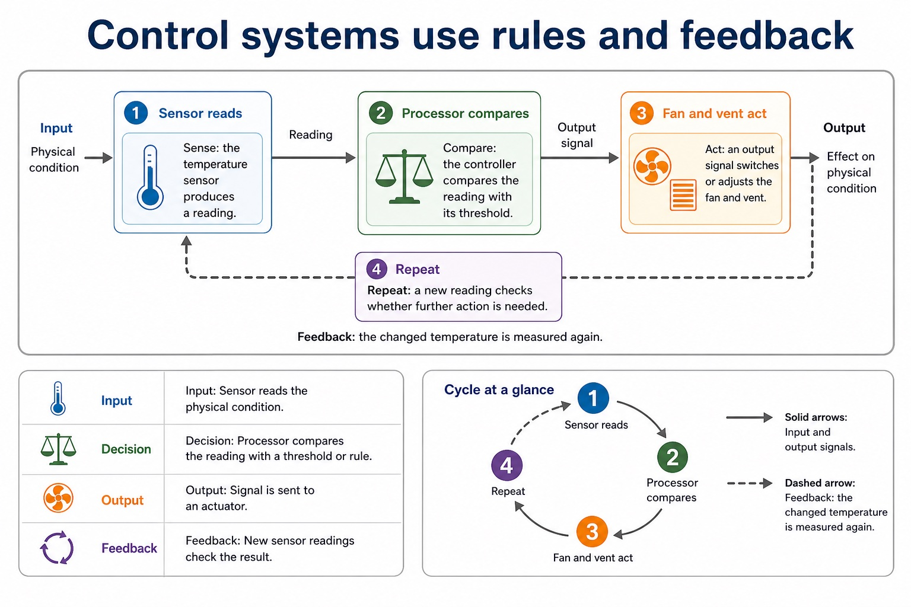
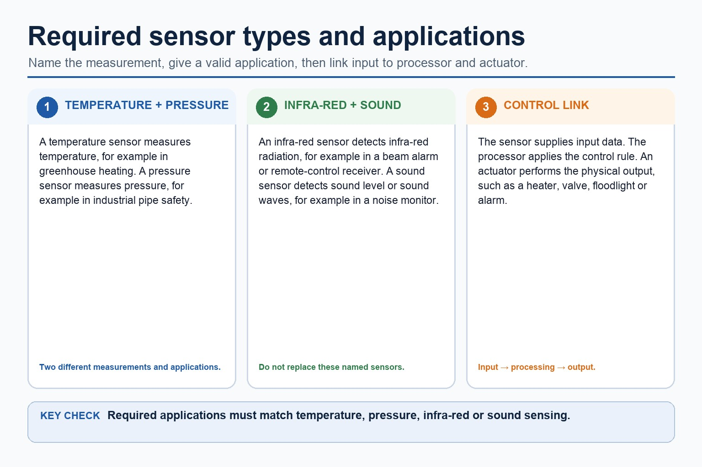
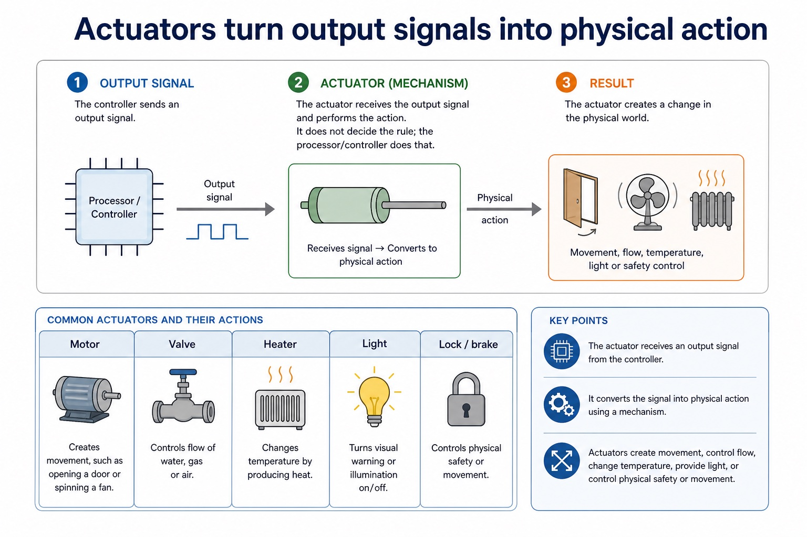
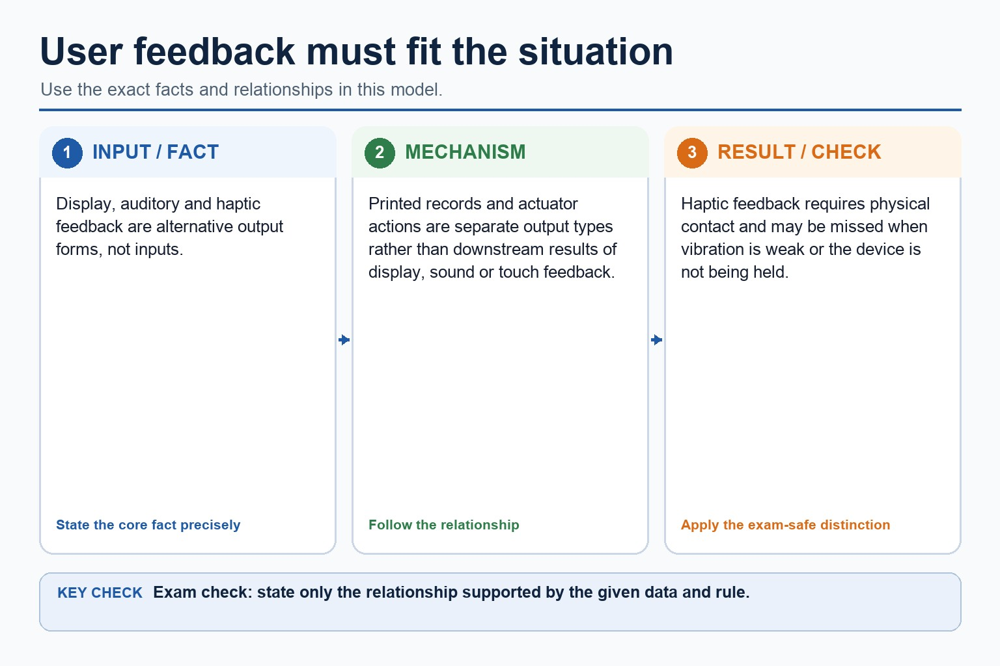
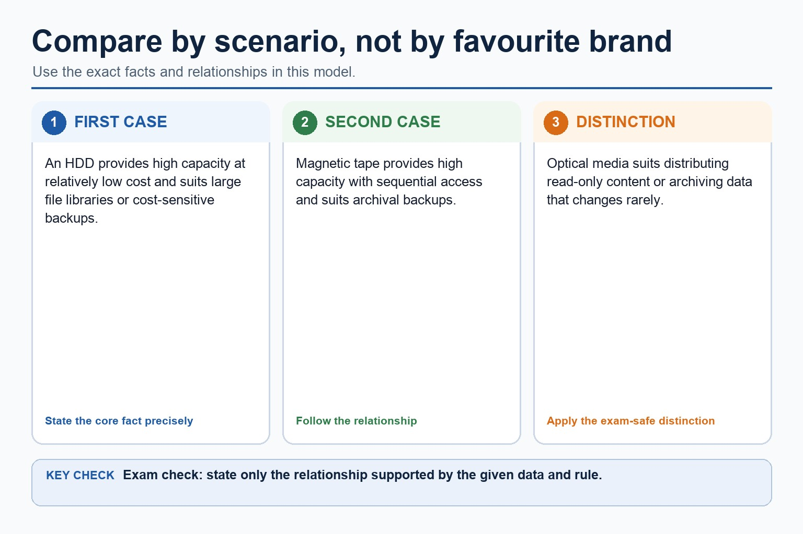
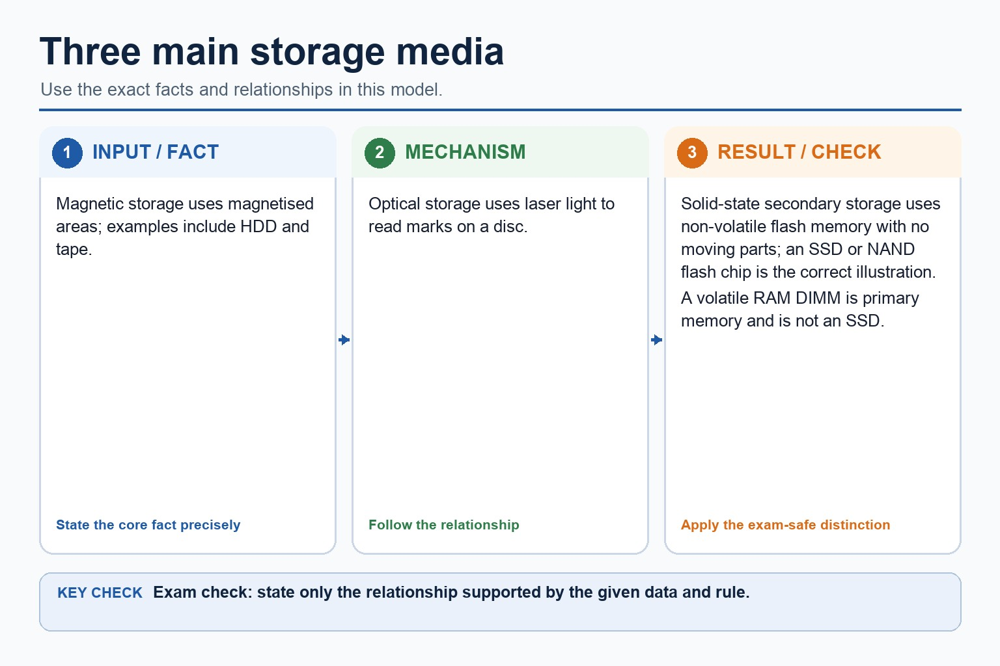
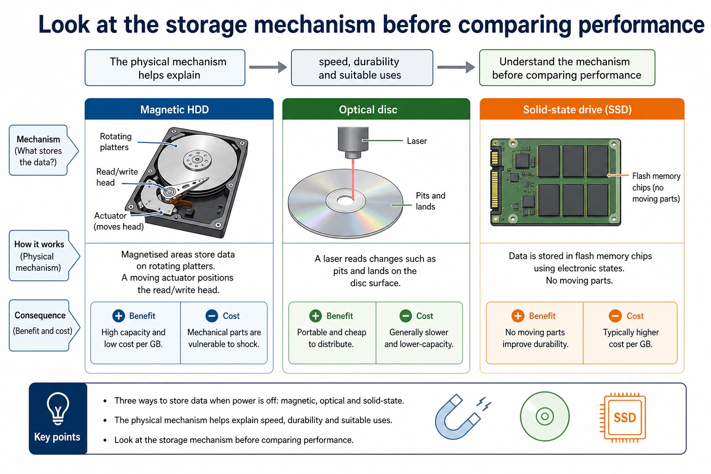

# Lesson 016: Monitoring, control, sensors and actuators

**Course:** Cambridge International AS Level Computer Science 9618, 2027-2029 Version 2 
**Paper:** Paper 1 
**Syllabus:** Section 3: Hardware 
**Syllabus requirements:** S3.08, S3.09 
**Pacing:** Flexible. Select the material set and practice depth needed by the learner.

## Teaching-depth menu

- **Quick route:** Use the diagnostic, learning objectives, first worked example and foundation question. Stop once the learner can explain the central distinction accurately.
- **Full route:** Use every knowledge-point material set, the worked method, the terminology check and all questions.
- **Deep route:** Add the prerequisite refresher, ask learners to connect the concept checklist, discuss the labelled extension and complete a transfer question without a model answer.

## 1. Prerequisite knowledge and quick diagnostic

Recall S3.08 before starting this lesson.

Ask the learner to give one accurate definition or method step before continuing. If they cannot, briefly revisit the named prerequisite rather than repeating the whole previous lesson.

### Optional prerequisite refresher

- Show understanding of monitoring and control systems, including the difference between monitoring and control, the use of sensors and actuators, and the importance of feedback.
- Distinguish monitoring and control; understand sensors, actuators and feedback.

## 2. Knowledge explanation

### 1. Monitoring · Control · Sensors · Actuators (S3.08)

**Concept map:** monitoring → control → sensors → actuators → feedback

**Three-part explanation:**

1. Show understanding of monitoring and control systems, including the difference between monitoring and control, the use of sensors and actuators, and the importance of feedback
2. A control system uses sensor input and a stored rule or target to send output to an actuator
3. In closed-loop control, feedback is the new sensor reading produced after the action, allowing the controller to adjust or stop the output

**Concrete cue:** Show understanding of monitoring and control systems, including the difference between monitoring and control, the use of sensors and actuators, and the importance of feedback.

#### Control systems use rules and feedback

Text transcript

- 1 Sensor reads
- 2 Processor compares
- 3 Fan and vent act
- The solid arrows show input and output signals. The dashed arrow shows feedback: the changed temperature is measured again.
- Sense: the temperature sensor produces a reading.
- Compare: the controller compares the reading with its threshold.
- Act: an output signal switches or adjusts the fan and vent.
- Repeat: a new reading checks whether further action is needed.

#### Required sensor types and applications

Text transcript

- A temperature sensor measures temperature and a pressure sensor measures pressure.
- An infra-red sensor detects infra-red radiation, for example in a beam alarm or remote-control receiver.
- A sound sensor detects sound level or sound waves, for example in a noise monitor.
- A sensor supplies input data; the processor applies the rule and an actuator performs any physical output.
- Light intensity is supporting context and does not replace the named infra-red or sound sensors.

#### Actuators turn output signals into physical action

Text transcript

- Motor Creates movement, such as opening a door or spinning a fan.
- Valve Controls flow of water, gas or air.
- Heater Changes temperature by producing heat.
- Light Turns visual warning or illumination on/off.
- Lock / brake Controls physical safety or movement.
- An actuator receives an output signal. It does not decide the rule; the processor/controller does that.

#### User feedback must fit the situation

Text transcript

- Display, auditory and haptic feedback are alternative output forms, not inputs.
- Printed records and actuator actions are separate output types rather than downstream results of display, sound or touch feedback.
- Haptic feedback requires physical contact and may be missed when vibration is weak or the device is not being held.

Precise syllabus wording

Distinguish monitoring and control; understand sensors, actuators and feedback.

Show understanding of monitoring and control systems, including the difference between monitoring and control, the use of sensors and actuators, and the importance of feedback.

### 2. Temperature · Pressure · Infra-red · Sound sensor (S3.09)

**Concept map:** temperature → pressure → infra-red → sound sensor

**Three-part explanation:**

1. teaching and assessment must connect each sensor to an appropriate application
2. Required sensor types are temperature, pressure, infra-red and sound
3. A temperature sensor measures temperature, a pressure sensor measures force per unit area or pressure, an infra-red sensor detects infra-red radiation, and a sound sensor detects…

**Concrete cue:** Required sensor types are temperature, pressure, infra-red and sound; teaching and assessment must connect each sensor to an appropriate application.

#### Required sensor types and applications

Text transcript

- A temperature sensor measures temperature and a pressure sensor measures pressure.
- An infra-red sensor detects infra-red radiation, for example in a beam alarm or remote-control receiver.
- A sound sensor detects sound level or sound waves, for example in a noise monitor.
- A sensor supplies input data; the processor applies the rule and an actuator performs any physical output.
- Light intensity is supporting context and does not replace the named infra-red or sound sensors.

Precise syllabus wording

Understand temperature, pressure, infrared and sound sensors and appropriate applications.

Required sensor types are temperature, pressure, infra-red and sound; teaching and assessment must connect each sensor to an appropriate application.

### Supporting diagram library

#### Compare by scenario, not by favourite brand

Text transcript

- An HDD provides high capacity at relatively low cost and suits large file libraries or cost-sensitive backups.
- Magnetic tape provides high capacity with sequential access and suits archival backups.
- Optical media suits distributing read-only content or archiving data that changes rarely.

#### Three main storage media

Text transcript

- Magnetic storage uses magnetised areas; examples include HDD and tape.
- Optical storage uses laser light to read marks on a disc.
- Solid-state secondary storage uses non-volatile flash memory with no moving parts; an SSD or NAND flash chip is the correct illustration.
- A volatile RAM DIMM is primary memory and is not an SSD.

#### What secondary storage does

Text transcript

- Non-volatile Data remains when power is switched off.
- Long-term Stores files, programs, backups and operating system data.
- Usually slower Secondary storage is usually slower than RAM for direct access.
- Scenario-based The best medium depends on speed, capacity, durability, portability and cost.

#### Look at the storage mechanism before comparing performance

Text transcript

- Visual explanation
- The physical mechanism helps explain speed, durability and suitable uses.
- Magnetic
- Solid-state
- Three ways to store data when power is off. The illustration identifies the mechanism; the cards below state the exam-safe explanation.
- Magnetic HDD
- Magnetised areas store data on rotating platters. A moving actuator positions the read/write head.
- Consequence: high capacity and low cost per GB, but mechanical parts are vulnerable to shock.

Open precise terminology and exam facts

- Show understanding of monitoring and control systems, including the difference between monitoring and control, the use of sensors and actuators, and the importance of feedback.
- Required sensor types are temperature, pressure, infra-red and sound; teaching and assessment must connect each sensor to an appropriate application.
- A monitoring system uses sensors to collect data for recording, display or alerts; it does not necessarily change the environment. A control system uses sensor input and a stored rule or target to send output to an actuator. In closed-loop control, feedback is the new sensor reading produced after the action, allowing the controller to adjust or stop the output.
- A temperature sensor measures temperature, a pressure sensor measures force per unit area or pressure, an infra-red sensor detects infra-red radiation, and a sound sensor detects sound level or sound waves. The sensor supplies input data; it does not itself decide or perform the control action.
- Choose a sensor by matching the physical quantity to the application: temperature for a greenhouse, pressure for a tyre or burglar mat, infra-red for a remote-control receiver or beam alarm, and sound for a noise monitor. A light-intensity sensor is useful supporting context but does not replace the named infra-red and sound sensors.
- Actuators produce physical output actions such as moving a vent or switching a fan after the controller processes sensor input.

### Worked example

1. Greenhouse monitoring and control
2. A monitoring system records and displays temperature readings.
3. A control system also compares each reading with a threshold and activates a fan motor actuator when the greenhouse is too hot.
4. New temperature readings provide feedback, so the fan can stop when the target is reached.

Beyond syllabus / 延伸知识（不要求背诵）: professional device selection also considers accessibility, reliability, repairability and energy use.
## 3. Practice by question type

### Question 1 - foundation - compare - 5 marks

A greenhouse system records temperature and automatically opens a vent when necessary. Compare its monitoring and control functions and explain the feedback cycle.

**Answer:** monitoring records/displays temperature readings; control compares a reading with a rule/threshold; controller sends output to a vent motor or other actuator; new sensor readings provide feedback after the action; feedback is used to adjust or stop the actuator

**Marking guidance:** Do not state that monitoring necessarily changes an actuator, or that a sensor performs the control decision.

**Common error:** For the command word compare, perform that exact action; do not replace it with an unrelated fact.

### Question 2 - application - apply - 2 marks

What is feedback in a closed-loop control system?

**Answer:** A new sensor reading after the action, used to adjust or stop the output.

**Marking guidance:** Award one mark for each distinct, technically accurate point or method step.

**Common error:** Do not repeat the same point in different words; each mark needs a separate idea or method step.

### Question 3 - transfer - apply - 2 marks

Which named sensor detects radiation used by a remote control?

**Answer:** An infra-red sensor.

**Marking guidance:** Award one mark for each distinct, technically accurate point or method step.

**Common error:** Do not copy the worked example unchanged; transfer the method and check it against the new context.

### Related past-paper indexes

| Reference | Marks | Command word | Question type |
|---|---:|---|---|
| 9618/11/W/25 Q9 | 3 | describe | explain |
| 9618/13/S/24 Q7(d) | 4 | complete | recall |
| 9618/13/S/24 Q7(i) | 4 | complete | recall |
| 9618/11/W/24 Q5(c) | 3 | complete | recall |

These are indexes only. Cambridge question and mark-scheme wording is not reproduced.

## 4. Summary and exam reminders

### Summary

- Define monitoring, control, sensors and actuators with the exact technical vocabulary expected by the syllabus.
- Use the lesson method on a fresh context and show the intermediate decision, representation or calculation.
- Match the shape of the answer to the command word and the available marks.
- Check the final answer against the scenario instead of repeating a memorised sentence.

### Common error to correct

Students often say the sensor 'does the action'. Correction: sensors detect; actuators act.

### Exam technique

- Follow the command word: state gives a fact; explain links a cause to a consequence; compare covers both sides.
- Match the number of independent points or method steps to the available marks.
- For monitoring, control, sensors and actuators, use the exact technical term before applying it to the scenario.
