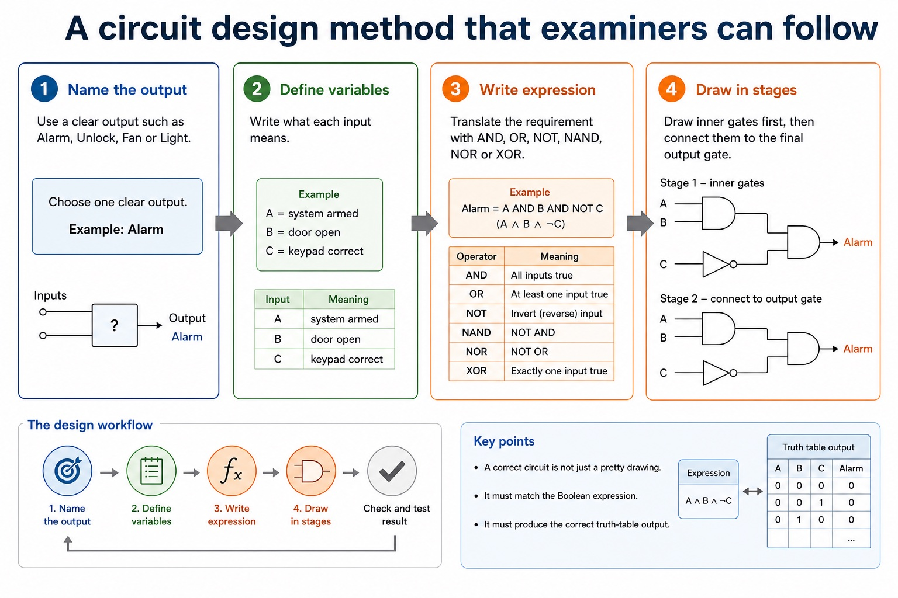
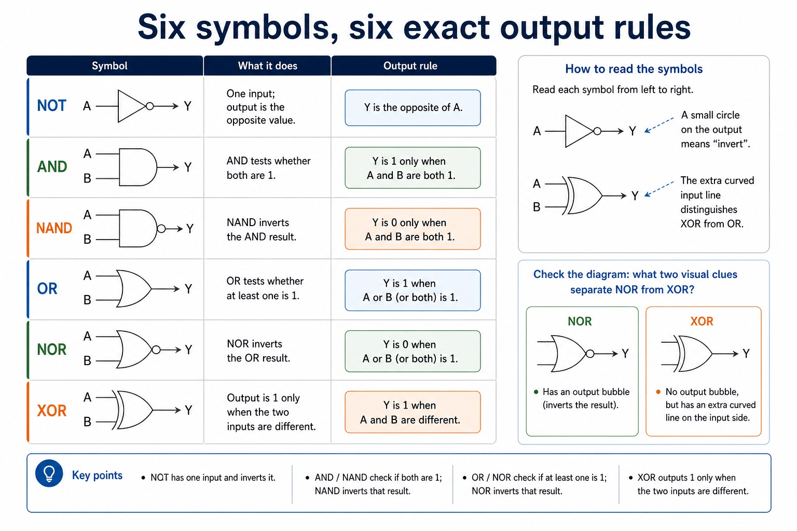
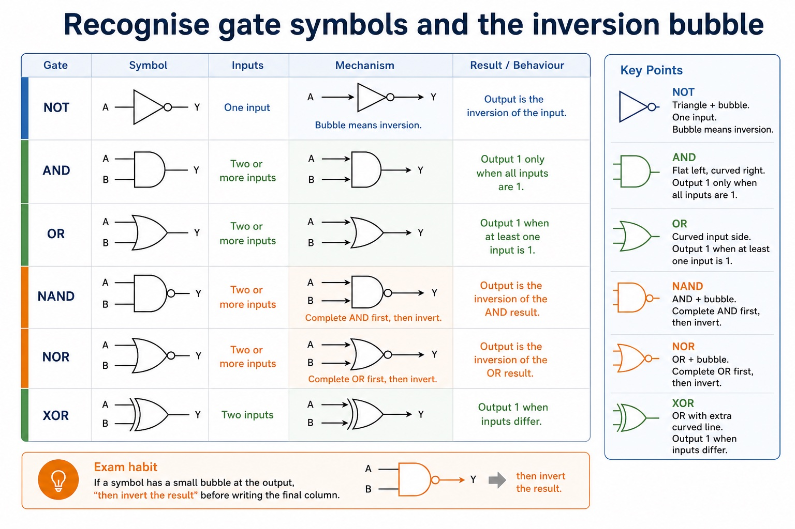
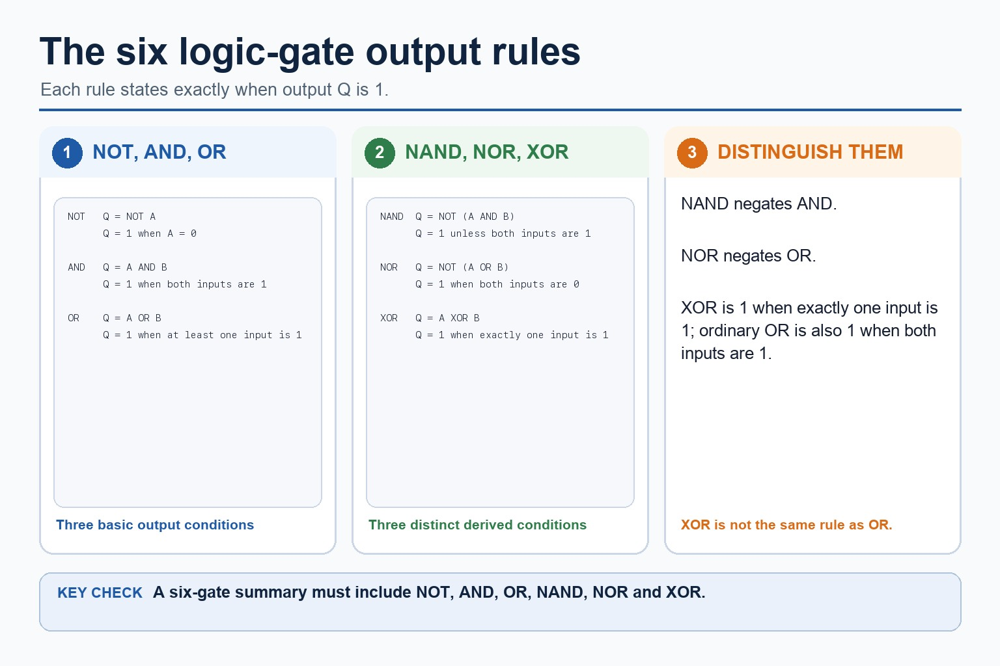
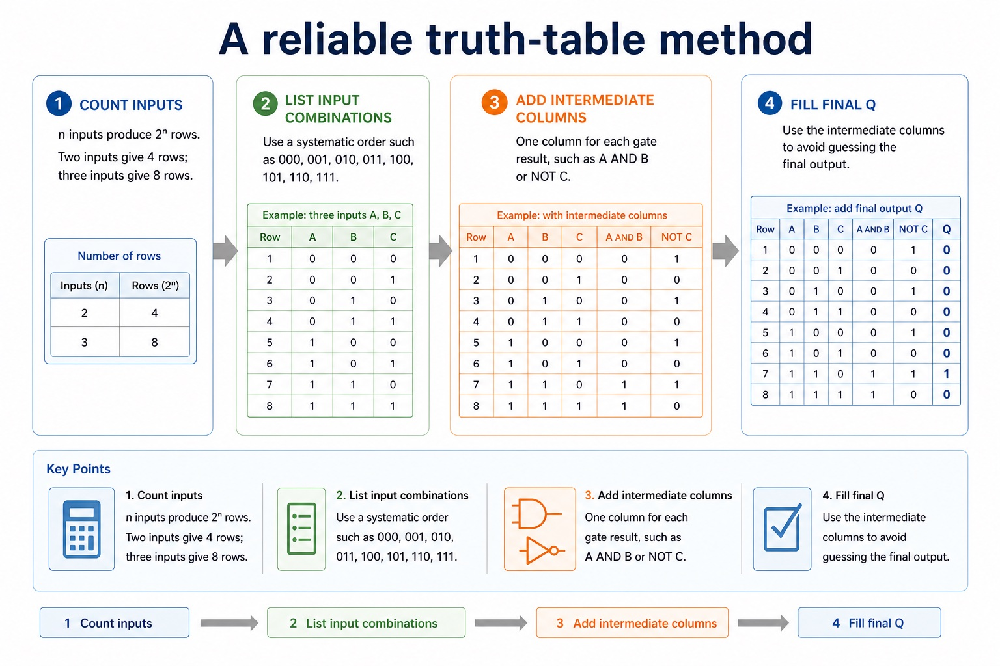
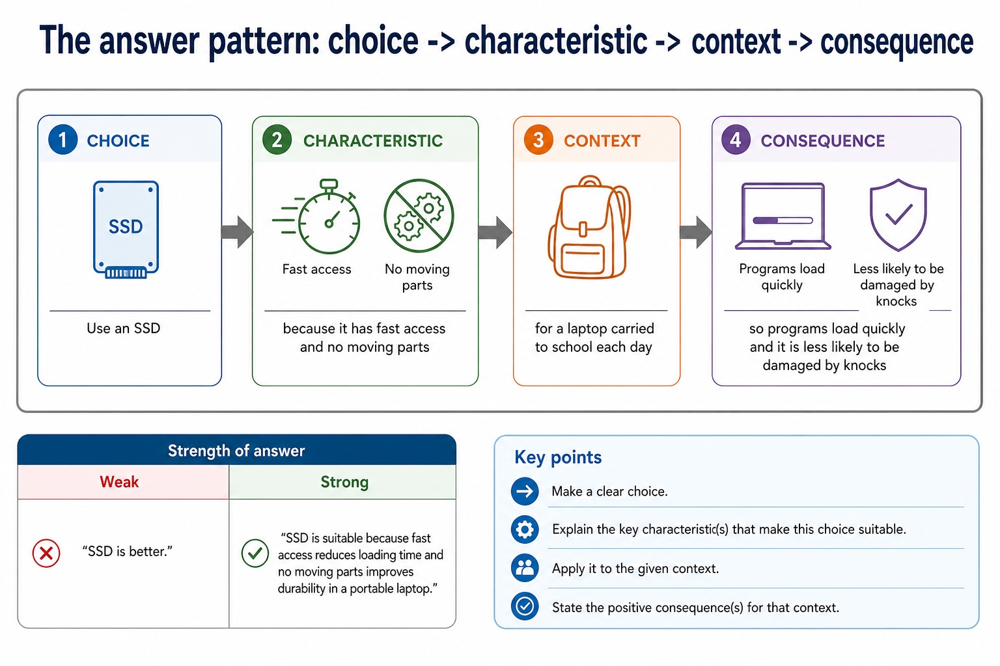
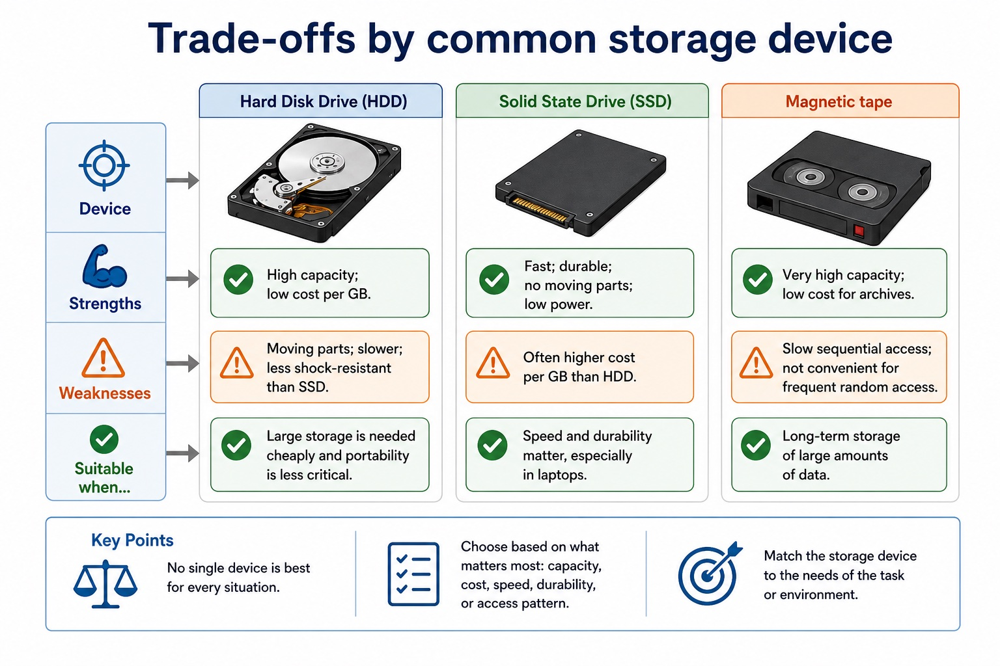
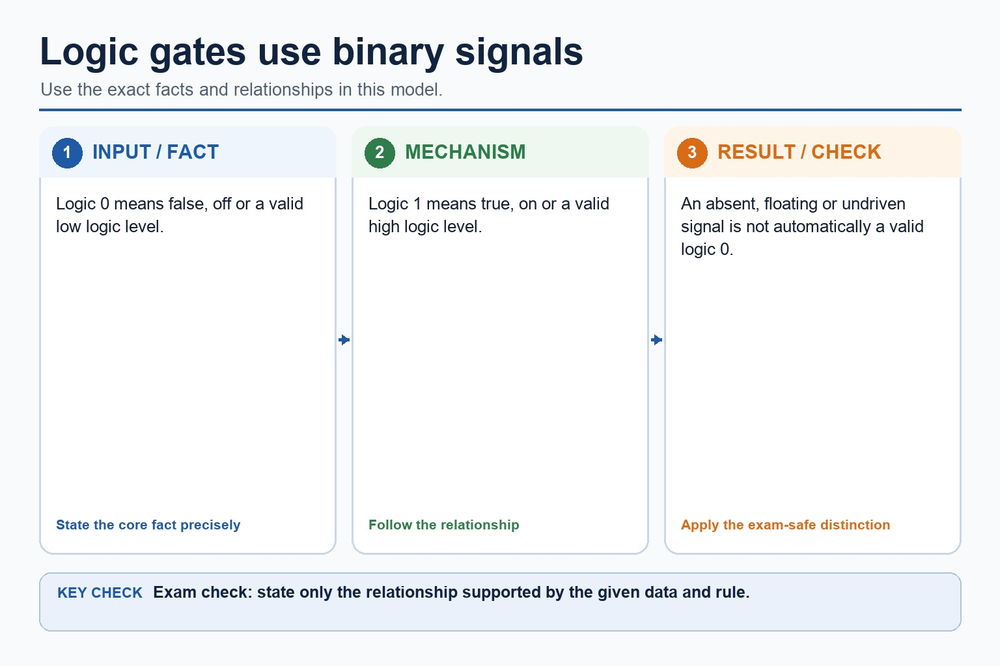
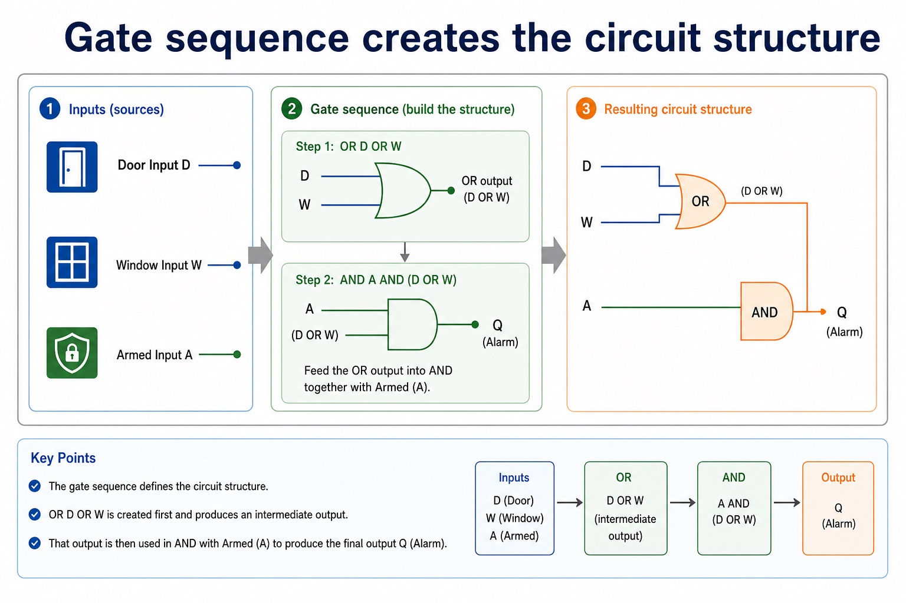
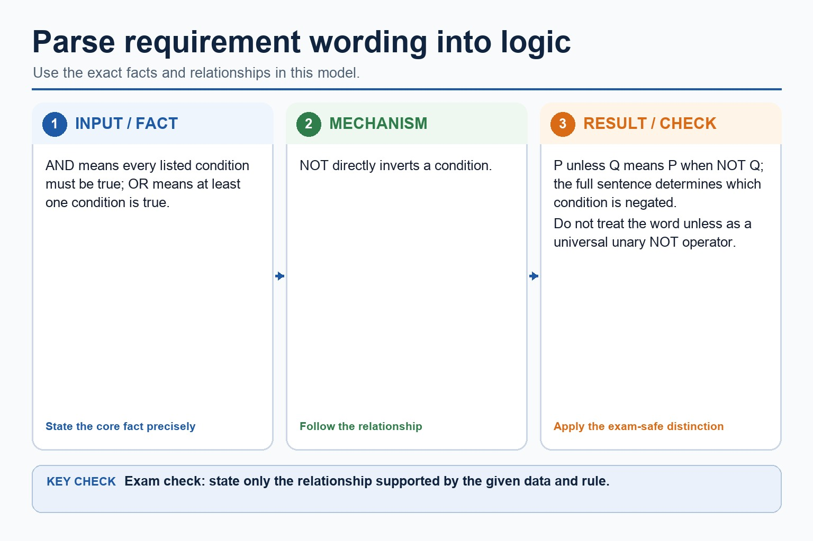

# Lesson 017: Logic gates, symbols and truth tables

**Course:** Cambridge International AS Level Computer Science 9618, 2027-2029 Version 2 
**Paper:** Paper 1 
**Syllabus:** Section 3: Hardware 
**Syllabus requirements:** S3.10 
**Pacing:** Flexible. Select the material set and practice depth needed by the learner.

## Teaching-depth menu

- **Quick route:** Use the diagnostic, learning objectives, first worked example and foundation question. Stop once the learner can explain the central distinction accurately.
- **Full route:** Use every knowledge-point material set, the worked method, the terminology check and all questions.
- **Deep route:** Add the prerequisite refresher, ask learners to connect the concept checklist, discuss the labelled extension and complete a transfer question without a model answer.

## 1. Prerequisite knowledge and quick diagnostic

Recall S1.02 before starting this lesson.

Ask the learner to give one accurate definition or method step before continuing. If they cannot, briefly revisit the named prerequisite rather than repeating the whole previous lesson.

### Optional prerequisite refresher

- The Version 2 row requires binary, denary, hexadecimal, Binary Coded Decimal (BCD), one's complement and two's complement; BCD and complements are representations rather than additional number bases.
- Show understanding of binary, denary and hexadecimal number systems, BCD, and one's- and two's-complement representations.

## 2. Knowledge explanation

### 1. NOT · AND · OR · NAND (S3.10)

**Concept map:** NOT → AND → OR → NAND → NOR → XOR → symbol → function → truth table → problem statement → expression → circuit → two inputs

**Three-part explanation:**

1. construct a truth table from a problem statement, logic circuit or logic expression
2. Use the standard symbols and define the functions of NOT, AND, OR, NAND, NOR and XOR (EOR)
3. Construct circuits, truth tables and expressions from each of the other stated representations

**Concrete cue:** Use the standard symbols and define the functions of NOT, AND, OR, NAND, NOR and XOR (EOR); all gates except NOT have two inputs. Construct circuits, truth tables and expressions…

#### A circuit design method that examiners can follow

Text transcript

- 1. Name the output Use a clear output such as Alarm, Unlock, Fan or Light.
- 2. Define variables Write what each input means, for example A = system armed.
- 3. Write expression Translate the requirement with AND, OR, NOT, NAND, NOR or XOR.
- 4. Draw in stages Draw inner gates first, then connect them to the final output gate.
- A correct circuit is not just a pretty drawing. It must match the Boolean expression and produce the correct truth-table output.

#### Six symbols, six exact output rules

Text transcript

- Visual explanation
- Read each symbol from left to right. A small circle on the output means “invert”; the extra curved input line distinguishes XOR from OR.
- NOT One input; output is the opposite value.
- AND / NAND AND tests whether both are 1; NAND inverts that result.
- OR / NOR OR tests whether at least one is 1; NOR inverts that result.
- XOR Output is 1 only when the two inputs are different.
- Check the diagram: what two visual clues separate NOR from XOR?
- NOR has an output bubble. XOR has no output bubble, but it has an extra curved line on the input side.

#### Recognise gate symbols and the inversion bubble

Text transcript

- NOT Triangle + bubble One input. Bubble means inversion.
- AND Flat left, curved right Output 1 only when all inputs are 1.
- OR Curved input side Output 1 when at least one input is 1.
- NAND AND + bubble Complete AND first, then invert.
- NOR OR + bubble Complete OR first, then invert.
- XOR OR with extra curved line Output 1 when inputs differ.
- Exam habit: if a symbol has a small bubble at the output, say "then invert the result" before writing the final column.

#### Boolean expressions describe gate behaviour

Text transcript

- Variables
- A, B and C represent input signals. Each row assigns them 0 or 1.
- Operators
- NOT, AND, OR, NAND, NOR and XOR describe the logic applied.
- Intermediate columns
- Each bracketed part or gate output should get its own column.
- Final output
- Q is the final result after all intermediate columns have been combined.

#### The six gate rules

Text transcript

- The six gates are NOT, AND, OR, NAND, NOR and XOR.
- NAND is the negation of AND and NOR is the negation of OR.
- XOR outputs 1 when exactly one of its two inputs is 1.
- Ordinary OR also outputs 1 when both inputs are 1, so OR and XOR are different.

#### A reliable truth-table method

Text transcript

- 1. Count inputs n inputs produce 2^n rows. Two inputs give 4 rows; three inputs give 8 rows.
- 2. List input combinations Use a systematic order such as 000, 001, 010, 011, 100, 101, 110, 111.
- 3. Add intermediate columns One column for each gate result, such as A AND B or NOT C.
- 4. Fill final Q Use the intermediate columns to avoid guessing the final output.
- Row number

Precise syllabus wording

Understand NOT, AND, OR, NAND, NOR and XOR; use symbols/functions/truth tables and convert among problem, expression, circuit and truth table.

Use the standard symbols and define the functions of NOT, AND, OR, NAND, NOR and XOR (EOR); all gates except NOT have two inputs. Construct circuits, truth tables and expressions from each of the other stated representations: problem statement, logic expression, logic circuit and truth table.

### Supporting diagram library

#### The answer pattern: choice - characteristic - context - consequence

Text transcript

- Choice Use an SSD
- Characteristic because it has fast access and no moving parts
- Context for a laptop carried to school each day
- Consequence so programs load quickly and it is less likely to be damaged by knocks
- Weak: "SSD is better." Strong: "SSD is suitable because fast access reduces loading time and no moving parts improves durability in a portable laptop."

#### The five core characteristics

Text transcript

- Capacity How much data can be stored, usually measured in GB or TB.
- Speed How quickly data can be read or written; affects startup, loading and transfer.
- Durability How well the device resists damage, wear, shock, scratches or environmental conditions.
- Portability How easy it is to carry, remove, connect and use between devices.
- Cost Price of the device and cost per unit of storage; not always the same thing.

#### Trade-offs by common storage device

Text transcript

- Strengths
- Weaknesses
- Suitable when...
- High capacity; low cost per GB.
- Moving parts; slower; less shock-resistant than SSD.
- Large storage is needed cheaply and portability is less critical.
- Fast; durable; no moving parts; low power.
- Often higher cost per GB than HDD.

#### Logic gates use binary signals

Text transcript

- Logic 0 means false, off or a valid low logic level.
- Logic 1 means true, on or a valid high logic level.
- An absent, floating or undriven signal is not automatically a valid logic 0.

#### Gate sequence creates the circuit structure

Text transcript

- Door Input D
- Window Input W
- OR D OR W
- Armed Input A
- AND A AND (D OR W)
- Alarm Final output Q
- Draw the OR branch first, then feed it into AND with Armed. If the drawing order is unclear, label intermediate outputs.

#### Parse requirement wording into logic

Text transcript

- AND means every listed condition must be true; OR means at least one condition is true.
- NOT directly inverts a condition.
- P unless Q means P when NOT Q; the full sentence determines which condition is negated.
- Do not treat the word unless as a universal unary NOT operator.

Open precise terminology and exam facts

- Use the standard symbols and define the functions of NOT, AND, OR, NAND, NOR and XOR (EOR); all gates except NOT have two inputs. Construct circuits, truth tables and expressions from each of the other stated representations: problem statement, logic expression, logic circuit and truth table.
- Use the standard symbols and exact functions of NOT, AND, OR, NAND, NOR and XOR (EOR). NOT has one input; each of the other five gates has two inputs for this syllabus. A truth table lists every input combination and the resulting output according to the gate or circuit function.
- You must be able to construct a logic circuit from a problem statement, logic expression or truth table; construct a truth table from a problem statement, logic circuit or logic expression; and construct a logic expression from a problem statement, logic circuit or truth table. Move through variables and conditions first, then intermediate gate outputs, then the final output so every representation can be checked against the same rows.
- Each standard gate symbol identifies its function; do not substitute a labelled box when a logic-circuit symbol is required.

### Worked example

1. Convert one rule among four representations
2. an alarm sounds when the system is armed and either the door or window is open.
3. Define A, D and W; write Alarm = A AND (D OR W); draw an OR gate for D and W feeding an AND gate with A; then list all eight input…

Beyond syllabus / 延伸知识（不要求背诵）: professional device selection also considers accessibility, reliability, repairability and energy use.
## 3. Practice by question type

### Question 1 - foundation - construct - 4 marks

A truth table gives output 1 only when input A is 1 and input B is 0. Construct a logic expression and describe the corresponding circuit.

**Answer:** identifies that B must be inverted; constructs expression Q = A AND NOT B; B is connected to a NOT gate; A and the NOT-gate output are connected to an AND gate whose output is Q

**Marking guidance:** Do not accept XOR: XOR is also 1 for A=0, B=1, which contradicts the given truth table.

**Common error:** For the command word construct, perform that exact action; do not replace it with an unrelated fact.

### Question 2 - application - identify - 2 marks

Identify the three possible sources from which a logic circuit may be constructed.

**Answer:** A problem statement, a logic expression or a truth table.

**Marking guidance:** Award one mark for each distinct, technically accurate point or method step.

**Common error:** Do not repeat the same point in different words; each mark needs a separate idea or method step.

### Question 3 - transfer - explain - 2 marks

How many inputs does NOT have, and how many do the other specified gates have in this syllabus?

**Answer:** NOT has one input; AND, OR, NAND, NOR and XOR each have two inputs.

**Marking guidance:** Award one mark for each distinct, technically accurate point or method step.

**Common error:** Do not copy the worked example unchanged; transfer the method and check it against the new context.

### Related past-paper indexes

| Reference | Marks | Command word | Question type |
|---|---:|---|---|
| 9618/11/S/25 Q1(a) | 2 | write | recall |
| 9618/11/S/25 Q1(b) | 2 | complete | recall |
| 9618/11/W/25 Q3(a) | 2 | draw | diagram |
| 9618/11/W/25 Q3(b) | 2 | draw | diagram |

These are indexes only. Cambridge question and mark-scheme wording is not reproduced.

## 4. Summary and exam reminders

### Summary

- Define logic gates, symbols and truth tables with the exact technical vocabulary expected by the syllabus.
- Use the lesson method on a fresh context and show the intermediate decision, representation or calculation.
- Match the shape of the answer to the command word and the available marks.
- Check the final answer against the scenario instead of repeating a memorised sentence.

### Common error to correct

Students often use everyday 'or' instead of logical OR. Correction: OR is true when at least one input is true unless XOR is specified.

### Exam technique

- Follow the command word: state gives a fact; explain links a cause to a consequence; compare covers both sides.
- Match the number of independent points or method steps to the available marks.
- For logic gates, symbols and truth tables, use the exact technical term before applying it to the scenario.
