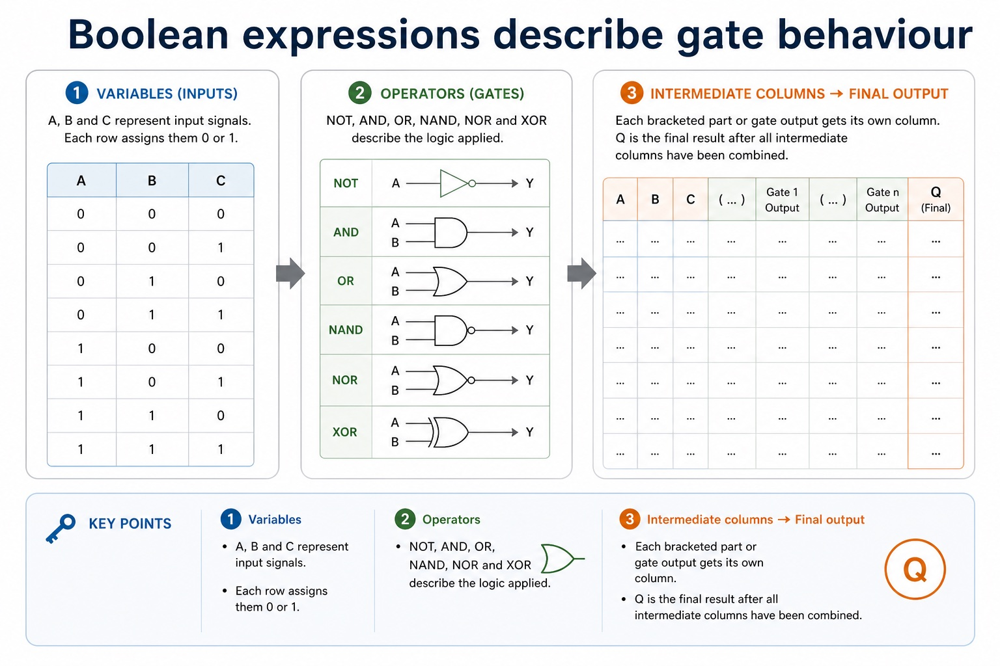

# Lesson 018: Boolean expressions and logic-circuit design

**Course:** Cambridge International AS Level Computer Science 9618, 2027-2029 Version 2 
**Paper:** Paper 1 
**Syllabus:** Section 3: Hardware 
**Syllabus requirements:** S3.10 
**Pacing:** Flexible. This lesson is deliberately over-complete; select a quick, full or deep route for the learners in front of you.

## Teaching-depth menu

- **Quick route:** Use the diagnostic, learning objectives, first worked example and foundation question. Stop once the learner can explain the central distinction accurately.
- **Full route:** Teach every core explanation point, the worked example and all lesson questions. Use the visual only when it adds a different representation.
- **Deep route:** Add the prerequisite refresher, ask learners to connect the concept checklist, discuss the labelled extension and complete a transfer question without a model answer.

## 1. Prerequisite knowledge and quick diagnostic

Recall S1.02 before starting this lesson.

Ask the learner to give one accurate definition or method step before continuing. If they cannot, briefly revisit the named prerequisite rather than repeating the whole previous lesson.

### Optional prerequisite refresher

- The Version 2 row requires binary, denary, hexadecimal, Binary Coded Decimal (BCD), one's complement and two's complement; BCD and complements are representations rather than additional number bases.
- Show understanding of binary, denary and hexadecimal number systems, BCD, and one's- and two's-complement representations.

## 2. Knowledge explanation

### Learning objectives

- Understand NOT, AND, OR, NAND, NOR and XOR; use symbols/functions/truth tables and convert among problem, expression, circuit and truth table.

### Concept checklist for teacher choice

- NOT
- AND
- OR
- NAND
- NOR
- XOR
- symbol
- function
- truth table
- problem statement
- expression
- circuit
- two inputs

### Detailed explanation

- Use the standard symbols and define the functions of NOT, AND, OR, NAND, NOR and XOR (EOR); all gates except NOT have two inputs. Construct circuits, truth tables and expressions from each of the other stated representations: problem statement, logic expression, logic circuit and truth table.
- Use the standard symbols and exact functions of NOT, AND, OR, NAND, NOR and XOR (EOR). NOT has one input; each of the other five gates has two inputs for this syllabus. A truth table lists every input combination and the resulting output according to the gate or circuit function.
- You must be able to construct a logic circuit from a problem statement, logic expression or truth table; construct a truth table from a problem statement, logic circuit or logic expression; and construct a logic expression from a problem statement, logic circuit or truth table. Move through variables and conditions first, then intermediate gate outputs, then the final output so every representation can be checked against the same rows.
- Each standard gate symbol identifies its function; do not substitute a labelled box when a logic-circuit symbol is required.

### Worked example

Convert one rule among four representations: Rule: an alarm sounds when the system is armed and either the door or window is open. Define A, D and W; write Alarm = A AND (D OR W); draw an OR gate for D and W feeding an AND gate with A; then list all eight input combinations and evaluate the intermediate OR column before Alarm.

Beyond syllabus / 延伸知识（不要求背诵）: professional device selection also considers accessibility, reliability, repairability and energy use.

### Retained visual explanation

_Boolean expressions describe gate behaviour. The image and mobile text alternative come from one maintained fact source._

## 3. Practice by question type

### Question 1 - foundation - convert - 2 marks

How do intermediate columns help convert a circuit into a truth table?

**Answer:** Each intermediate column records one gate output, allowing the final result to be calculated and checked row by row.

**Marking guidance:** Award one mark for each distinct, technically accurate point or method step.

**Common error:** For the command word convert, perform that exact action; do not replace it with an unrelated fact.

### Question 2 - application - apply - 2 marks

What distinguishes the XOR symbol from the OR symbol?

**Answer:** XOR has an additional curved line on the input side.

**Marking guidance:** Award one mark for each distinct, technically accurate point or method step.

**Common error:** Do not repeat the same point in different words; each mark needs a separate idea or method step.

### Question 3 - transfer - state - 2 marks

State two precise facts about boolean expressions and logic-circuit design.

**Answer:** Use the standard symbols and define the functions of NOT, AND, OR, NAND, NOR and XOR (EOR); all gates except NOT have two inputs. Construct circuits, truth tables and expressions from each of the other stated representations: problem statement, logic expression, logic circuit and truth table. Use the standard symbols and exact functions of NOT, AND, OR, NAND, NOR and XOR (EOR). NOT has one input; each of the other five gates has two inputs for this syllabus. A truth table lists every input combination and the resulting output according to the gate or circuit function.

**Marking guidance:** Award one mark for each distinct fact; do not credit a repeated point.

**Common error:** Do not copy the worked example unchanged; transfer the method and check it against the new context.

### Related past-paper indexes

| Reference | Marks | Command word | Question type |
|---|---:|---|---|
| 9618/11/S/25 Q1(a) | 2 | write | recall |
| 9618/11/S/25 Q1(b) | 2 | complete | recall |
| 9618/11/W/25 Q3(a) | 2 | draw | diagram |
| 9618/11/W/25 Q3(b) | 2 | draw | diagram |

These are indexes only. Cambridge question and mark-scheme wording is not reproduced.

## 4. Summary and exam reminders

### Summary

- Define boolean expressions and logic-circuit design with the exact technical vocabulary expected by the syllabus.
- Use the lesson method on a fresh context and show the intermediate decision, representation or calculation.
- Match the shape of the answer to the command word and the available marks.
- Check the final answer against the scenario instead of repeating a memorised sentence.

### Common error to correct

Students often use everyday 'or' instead of logical OR. Correction: OR is true when at least one input is true unless XOR is specified.

### Exam technique

- Follow the command word: state gives a fact; explain links a cause to a consequence; compare covers both sides.
- Match the number of independent points or method steps to the available marks.
- For boolean expressions and logic-circuit design, use the exact technical term before applying it to the scenario.
