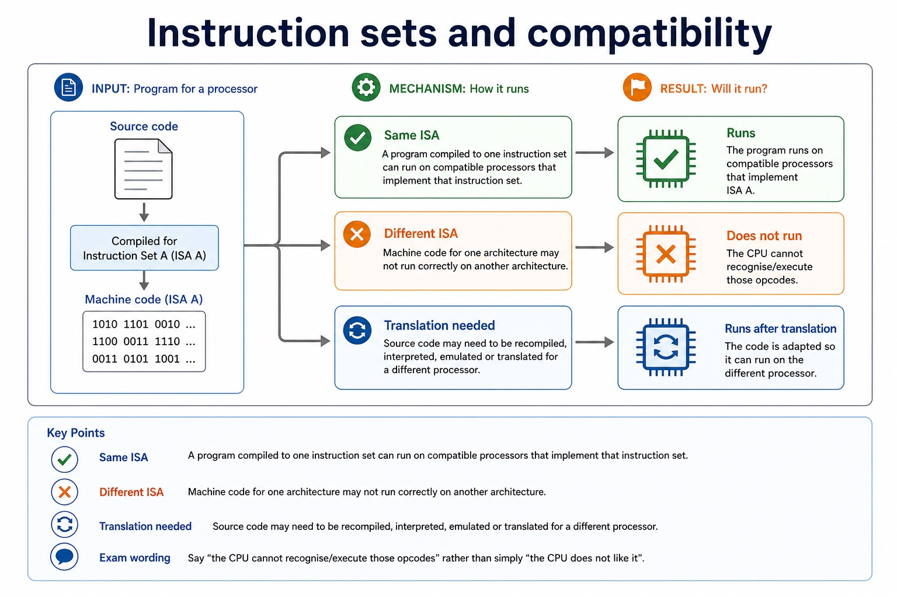
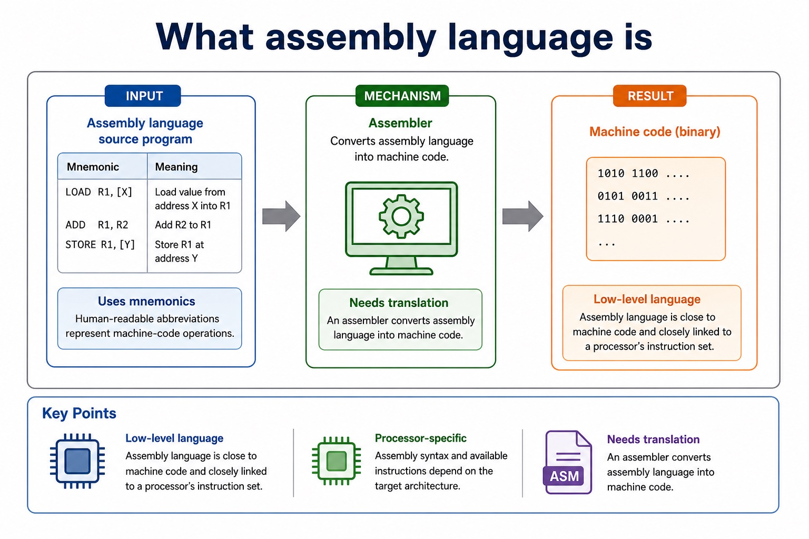
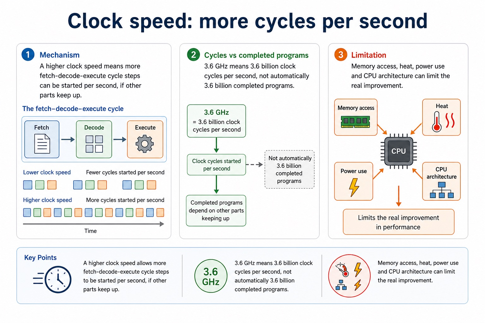
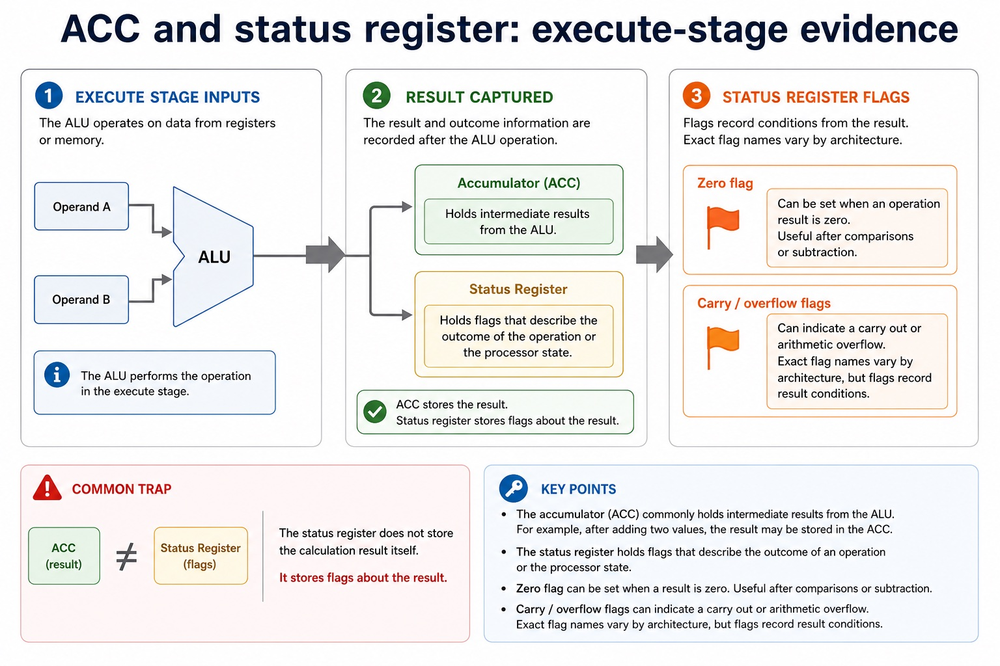
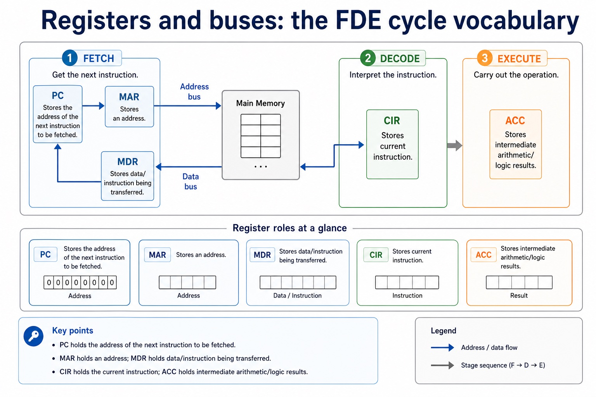
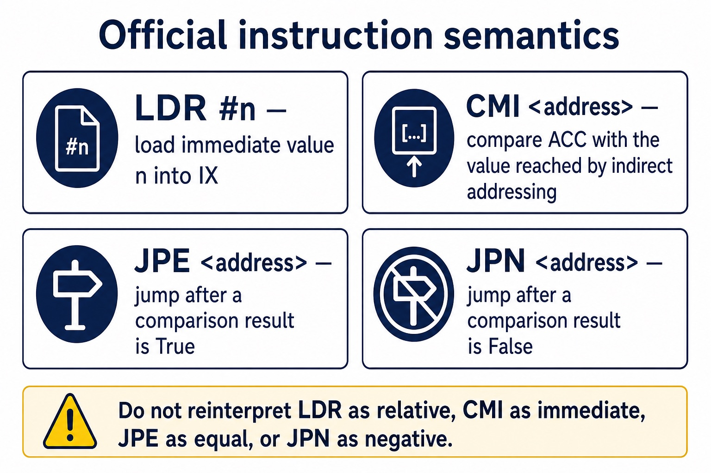
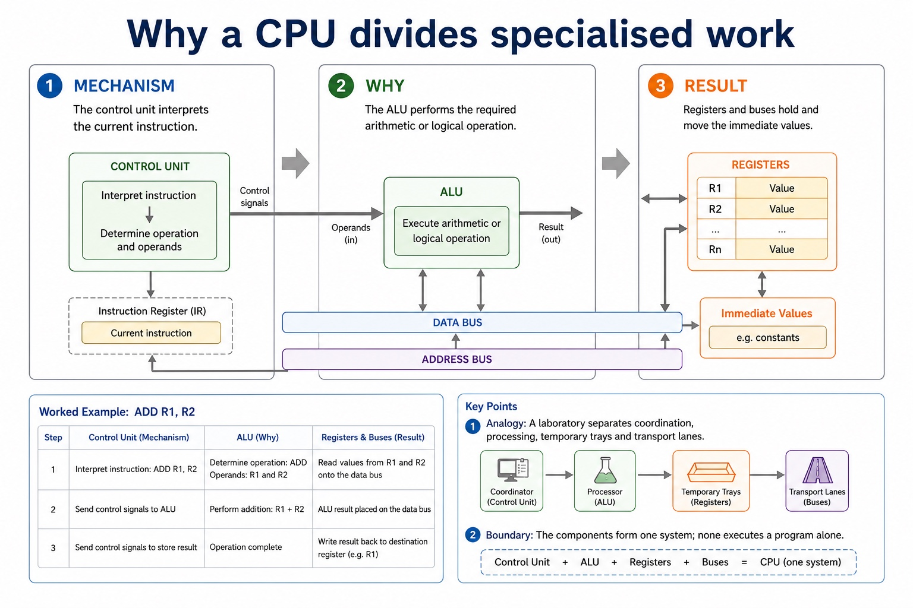
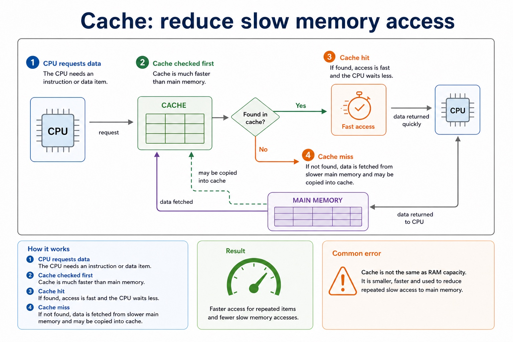
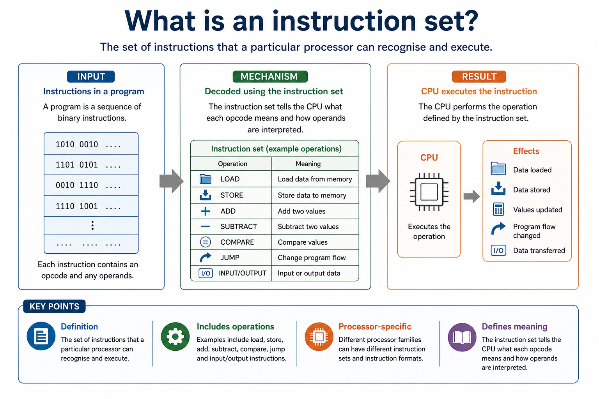
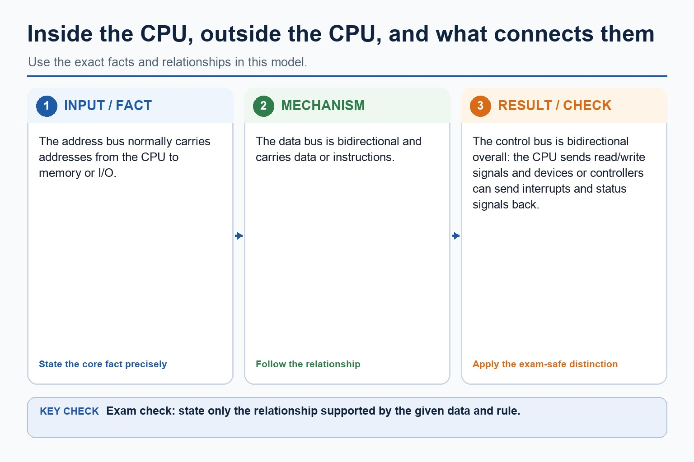

# Lesson 019: Von Neumann architecture, CPU components and registers

**Course:** Cambridge International AS Level Computer Science 9618, 2027-2029 Version 2 
**Paper:** Paper 1 
**Syllabus:** Section 4: Processor fundamentals 
**Syllabus requirements:** S4.01, S4.02, S4.03 
**Pacing:** Flexible. Select the material set and practice depth needed by the learner.

## Teaching-depth menu

- **Quick route:** Use the diagnostic, learning objectives, first worked example and foundation question. Stop once the learner can explain the central distinction accurately.
- **Full route:** Use every knowledge-point material set, the worked method, the terminology check and all questions.
- **Deep route:** Add the prerequisite refresher, ask learners to connect the concept checklist, discuss the labelled extension and complete a transfer question without a model answer.

## 1. Prerequisite knowledge and quick diagnostic

Recall S4.01 before starting this lesson.

Ask the learner to give one accurate definition or method step before continuing. If they cannot, briefly revisit the named prerequisite rather than repeating the whole previous lesson.

### Optional prerequisite refresher

- Show understanding of the basic Von Neumann model and the stored-program concept: instructions are stored in binary in the same directly accessible memory as data and are fetched for execution.
- Understand Von Neumann architecture and the stored-program concept.

## 2. Knowledge explanation

### 1. Von Neumann stored-program architecture (S4.01)

**Concept map:** Von → Neumann → architecture → stored-program → concept

**Three-part explanation:**

1. instructions are stored in binary in the same directly accessible memory as data and are fetched for execution
2. Show understanding of the basic Von Neumann model and the stored-program concept
3. IAS is directly accessible memory for current instructions and data, not a register or cache

**Concrete cue:** Show understanding of the basic Von Neumann model and the stored-program concept: instructions are stored in binary in the same directly accessible memory as data and are fetched for execution.

#### Instruction sets and compatibility

Text transcript

- Same ISA
- A program compiled to one instruction set can run on compatible processors that implement that instruction set.
- Different ISA
- Machine code for one architecture may not run correctly on another architecture.
- Translation needed
- Source code may need to be recompiled, interpreted, emulated or translated for a different processor.
- Exam wording
- Say "the CPU cannot recognise/execute those opcodes" rather than simply "the CPU does not like it".

#### Section 4 concept map

Text transcript

- Fetch copies PC to MAR, reads memory into MDR, copies MDR to CIR and increments PC.
- Decode begins after CIR holds the current instruction; the control unit interprets its opcode and operands.
- The address in MAR does not flow into MDR; memory returns the addressed instruction or data into MDR.

#### What assembly language is

Text transcript

- Low-level language
- Assembly language is close to machine code and closely linked to a processor's instruction set.
- Uses mnemonics
- Human-readable abbreviations represent machine-code operations.
- Processor-specific
- Assembly syntax and available instructions depend on the target architecture.
- Needs translation
- An assembler converts assembly language into machine code.

#### Clock speed: more cycles per second

Text transcript

- Mechanism
- A higher clock speed means more fetch-decode-execute cycle steps can be started per second, if other parts keep up.
- 3.6 GHz means 3.6 billion clock cycles per second, not automatically 3.6 billion completed programs.
- Limitation
- Memory access, heat, power use and CPU architecture can limit the real improvement.

Precise syllabus wording

Understand Von Neumann architecture and the stored-program concept.

Show understanding of the basic Von Neumann model and the stored-program concept: instructions are stored in binary in the same directly accessible memory as data and are fetched for execution.

### 2. General-purpose and special-purpose processors (S4.02)

**Concept map:** general-purpose → special-purpose → registers → PC → MDR → MAR → ACC → IX → CIR → status → register

**Three-part explanation:**

1. Cambridge assembly questions assume ACC is the available general-purpose working register
2. Distinguish general-purpose and special-purpose registers and explain PC, MDR, MAR, ACC, IX, CIR and status-register roles
3. In the CPU-architecture requirement, the named roles are PC, MDR, MAR, ACC, IX, CIR and the status register

**Concrete cue:** Distinguish general-purpose and special-purpose registers and explain PC, MDR, MAR, ACC, IX, CIR and status-register roles. Cambridge assembly questions assume ACC is the available general-purpose working register.

#### The seven named register roles

Text transcript

- PC holds the address of the next instruction to be fetched.
- CIR holds the instruction currently being decoded or executed.
- MAR holds the address of the memory location being accessed.
- MDR holds data or an instruction being transferred to or from memory.
- ACC holds an intermediate or final ALU result.
- IX holds an offset used in indexed addressing.
- The status register holds flags about a result or processor state.
- A general-purpose register can hold varied working values; a special-purpose register has a defined processor role.

#### ACC and status register: execute-stage evidence

Text transcript

- Accumulator (ACC)
- The accumulator commonly holds intermediate results from the ALU. For example, after adding two values, the result may be stored in the ACC.
- Status register
- The status register holds flags that describe the outcome of an operation or the processor state.
- Zero flag
- Can be set when an operation result is zero. Useful after comparisons or subtraction.
- Carry / overflow flags
- Can indicate a carry out or arithmetic overflow. Exact flag names vary by architecture, but the exam idea is that flags record result conditions.

#### Registers and buses: the FDE cycle vocabulary

Text transcript

- Processor review
- PC Stores the address of the next instruction to be fetched.
- MAR / MDR MAR stores an address; MDR stores data/instruction being transferred.
- CIR / ACC CIR stores current instruction; ACC stores intermediate arithmetic/logic results.

#### Official LDR, CMI, JPE and JPN semantics

Text transcript

- LDR n loads the immediate value n into the index register IX.
- CMI <address compares ACC with a value reached using indirect addressing.
- JPE <address jumps when the preceding comparison result is True.
- JPN <address jumps when the preceding comparison result is False.
- Do not reinterpret these instructions as relative load, immediate compare, equal/zero branch or negative-status branch.

#### The four fetch-stage names you cannot blur together

Text transcript

- Register roles
- PC Program Counter: stores the address of the next instruction to be fetched.
- MAR Memory Address Register: stores the address of the memory location being accessed.
- MDR Memory Data Register: stores data or an instruction being transferred to or from memory.
- CIR Current Instruction Register: stores the instruction currently being decoded/executed.

#### How registers, buses and clock stay aligned

Text transcript

- Registers expose small values needed immediately.
- Buses carry values, addresses and control signals on distinct paths.
- Clock events determine when components may capture a new state.

Precise syllabus wording

Understand general- and special-purpose registers: PC, MDR, MAR, ACC, IX, CIR and status register.

Distinguish general-purpose and special-purpose registers and explain PC, MDR, MAR, ACC, IX, CIR and status-register roles. Cambridge assembly questions assume ACC is the available general-purpose working register.

### 3. ALU · CU · Clock · Immediate (S4.03)

**Concept map:** ALU → CU → clock → immediate → access → store → IAS

**Three-part explanation:**

1. IAS is directly accessible memory for current instructions and data, not a register or cache
2. The immediate access store (IAS) is processor-accessible main memory, not a register, cache or secondary-storage device
3. Show understanding of the purpose and roles of the ALU, CU, system clock and Immediate Access Store (IAS)

**Concrete cue:** Show understanding of the purpose and roles of the ALU, CU, system clock and Immediate Access Store (IAS). IAS is directly accessible memory for current instructions and data, not a…

#### Why a CPU divides specialised work

Text transcript

- The control unit interprets the current instruction.
- The ALU performs the required arithmetic or logical operation.
- Registers and buses hold and move the immediate values.

#### Cache: reduce slow memory access

Text transcript

- 1. CPU requests data The CPU needs an instruction or data item.
- 2. Cache checked first Cache is much faster than main memory.
- 3. Cache hit If found, access is fast and the CPU waits less.
- 4. Cache miss If not found, data is fetched from slower main memory and may be copied into cache.
- Common error
- Cache is not the same as RAM capacity. It is smaller, faster and used to reduce repeated slow access to main memory.

#### What is an instruction set?

Text transcript

- Definition
- The set of instructions that a particular processor can recognise and execute.
- Includes operations
- Examples include load, store, add, subtract, compare, jump and input/output instructions.
- Processor-specific
- Different processor families can have different instruction sets and instruction formats.
- Defines meaning
- The instruction set tells the CPU what each opcode means and how operands are interpreted.

#### The cycle in one clean sentence

Text transcript

- The CPU gets the next instruction from main memory using the address stored in the PC.
- The CU interprets the instruction in the CIR and identifies the operation and any operands needed.
- The CPU carries out the instruction, for example using the ALU, accessing memory, or changing the PC.

#### How registers, buses and clock stay aligned

Text transcript

- Registers expose small values needed immediately.
- Buses carry values, addresses and control signals on distinct paths.
- Clock events determine when components may capture a new state.

Precise syllabus wording

Understand ALU, CU, clock and immediate access store (IAS).

Show understanding of the purpose and roles of the ALU, CU, system clock and Immediate Access Store (IAS). IAS is directly accessible memory for current instructions and data, not a register or cache.

### Supporting diagram library

#### Why control and calculation are separate

Text transcript

- The control unit decodes what the instruction demands.
- It sends signals that select data movement and an ALU operation.
- The ALU returns a result and status information.

#### Inside the CPU, outside the CPU, and what connects them

Text transcript

- The address bus normally carries addresses from the CPU to memory or I/O.
- The data bus is bidirectional and carries data or instructions.
- The control bus is bidirectional overall: the CPU sends read/write signals and devices or controllers can send interrupts and status signals back.

Open precise terminology and exam facts

- Show understanding of the basic Von Neumann model and the stored-program concept: instructions are stored in binary in the same directly accessible memory as data and are fetched for execution.
- Distinguish general-purpose and special-purpose registers and explain PC, MDR, MAR, ACC, IX, CIR and status-register roles. Cambridge assembly questions assume ACC is the available general-purpose working register.
- Show understanding of the purpose and roles of the ALU, CU, system clock and Immediate Access Store (IAS). IAS is directly accessible memory for current instructions and data, not a register or cache.
- The basic Von Neumann architecture uses one immediate access store for the instructions and data currently required. This is the stored-program concept: program instructions are stored in memory as binary values alongside data, and the processor fetches instructions from memory rather than being physically rewired for each program.
- The control unit (CU) fetches and decodes instructions and sends control signals. The arithmetic and logic unit (ALU) performs arithmetic and logical operations. Registers provide small, fast temporary storage, buses carry addresses, data and control signals, and the system clock supplies regular timing pulses that synchronise state changes.
- The immediate access store (IAS) is processor-accessible main memory, not a register, cache or secondary-storage device. A program held on secondary storage must be loaded into IAS before its instructions can be fetched and executed normally.
- A general-purpose register can temporarily hold data or intermediate results for a range of operations. A special-purpose register has a defined processor role. In the CPU-architecture requirement, the named roles are PC, MDR, MAR, ACC, IX, CIR and the status register. In Cambridge assembly-language questions, ACC is the only available general-purpose working register; this question convention does not remove the defined roles of the other named registers.
- PC holds the address of the next instruction; MAR holds the address currently being accessed; MDR holds data or an instruction being transferred to or from memory; CIR holds the current instruction while it is decoded or executed.
- ACC holds an intermediate or final ALU result. IX holds an offset used to form an indexed effective address. The status register holds flags about an operation or processor state, such as zero, carry or overflow; it does not hold the arithmetic result itself.

### Worked example

1. Run one stored program
2. Follow registers through fetch and indexed execute
3. A program and its input data are copied from SSD into IAS.
4. The PC supplies the address of the next instruction; the instruction is fetched through MDR into CIR, the CU decodes it, and the ALU or another component carries out the operation.
5. The same memory can hold an instruction at one address and data at another because their use is determined by the fetch and instruction semantics.
6. PC = 300 is copied to MAR; the instruction read from memory enters MDR and then CIR.

Beyond syllabus / 延伸知识（不要求背诵）: modern processors add pipelining and several cache levels, but exam answers should begin with the syllabus processor model.
## 3. Practice by question type

### Question 1 - foundation - explain - 8 marks

Explain how the Von Neumann stored-program concept, IAS, CU, ALU and system clock cooperate when a program runs. Compare general-purpose and special-purpose registers, then state the roles of PC, MAR, MDR, CIR, ACC, IX and the status register.

**Answer:** instructions and data are stored together in IAS/main memory; program instructions are represented in binary and fetched from memory; CU fetches/decodes and sends control signals; ALU performs arithmetic or logical operations; clock supplies regular timing pulses to synchronise operations; IAS is directly accessible memory rather than a register or secondary storage; general-purpose register can hold values for varied operations; special-purpose register has a defined role; PC next-instruction address and CIR current instruction; MAR accessed address and MDR transferred data/instruction; ACC intermediate/final ALU result; IX offset used in indexed addressing; status register stores flags about a result or processor state

**Marking guidance:** Do not accept that instructions are permanently built into the CU, that IAS is cache, or that the ALU decodes instructions. Do not swap MAR with MDR, PC with CIR, or claim that the status register stores the calculation result.

**Common error:** For the command word explain, perform that exact action; do not replace it with an unrelated fact.

### Question 2 - application - compare - 2 marks

Compare the ALU from the CU.

**Answer:** The ALU performs arithmetic and logical operations; the CU decodes instructions and coordinates components using control signals.

**Marking guidance:** Award one mark for each distinct, technically accurate point or method step.

**Common error:** Do not repeat the same point in different words; each mark needs a separate idea or method step.

### Question 3 - transfer - state - 2 marks

State the roles of ACC, IX and the status register.

**Answer:** ACC holds ALU results; IX an indexed-address offset; the status register holds flags about results or CPU state.

**Marking guidance:** Award one mark for each distinct, technically accurate point or method step.

**Common error:** Do not copy the worked example unchanged; transfer the method and check it against the new context.

### Related past-paper indexes

| Reference | Marks | Command word | Question type |
|---|---:|---|---|
| 9618/12/S/25 Q1(c) | 4 | complete | recall |
| 9618/13/W/25 Q6(b) | 4 | describe | explain |
| 9618/11/W/25 Q6(c) | 3 | complete | recall |
| 9618/12/S/25 Q1(a) | 3 | complete | recall |

These are indexes only. Cambridge question and mark-scheme wording is not reproduced.

## 4. Summary and exam reminders

### Summary

- Define von neumann architecture, cpu components and registers with the exact technical vocabulary expected by the syllabus.
- Use the lesson method on a fresh context and show the intermediate decision, representation or calculation.
- Match the shape of the answer to the command word and the available marks.
- Check the final answer against the scenario instead of repeating a memorised sentence.

### Common error to correct

Students often memorise register names without roles. Correction: a register earns its name by what it temporarily holds.

### Exam technique

- Follow the command word: state gives a fact; explain links a cause to a consequence; compare covers both sides.
- Match the number of independent points or method steps to the available marks.
- For von neumann architecture, cpu components and registers, use the exact technical term before applying it to the scenario.
