# Lesson 020: System buses, ports and processor performance

**Course:** Cambridge International AS Level Computer Science 9618, 2027-2029 Version 2 
**Paper:** Paper 1 
**Syllabus:** Section 4: Processor fundamentals 
**Syllabus requirements:** S4.04, S4.05, S4.06 
**Pacing:** Flexible. Select the material set and practice depth needed by the learner.

## Teaching-depth menu

- **Quick route:** Use the diagnostic, learning objectives, first worked example and foundation question. Stop once the learner can explain the central distinction accurately.
- **Full route:** Use every knowledge-point material set, the worked method, the terminology check and all questions.
- **Deep route:** Add the prerequisite refresher, ask learners to connect the concept checklist, discuss the labelled extension and complete a transfer question without a model answer.

## 1. Prerequisite knowledge and quick diagnostic

Recall S4.01 before starting this lesson.

Ask the learner to give one accurate definition or method step before continuing. If they cannot, briefly revisit the named prerequisite rather than repeating the whole previous lesson.

### Optional prerequisite refresher

- Show understanding of the basic Von Neumann model and the stored-program concept: instructions are stored in binary in the same directly accessible memory as data and are fetched for execution.
- Understand Von Neumann architecture and the stored-program concept.

## 2. Knowledge explanation

### 1. Address · Data · Control · Buses (S4.04)

**Concept map:** address → data → control → buses

**Three-part explanation:**

1. Show how data are transferred between computer-system components using the address bus, data bus and control bus, including their directions and roles in read/write operations
2. The control bus carries control and timing signals in both directions overall, including read/write signals from the CPU and interrupt or status signals toward it
3. To read address 240, the CPU puts 240 on the address bus and read on the control bus

**Concrete cue:** Show how data are transferred between computer-system components using the address bus, data bus and control bus, including their directions and roles in read/write operations.

#### Decode and execute are not filler words

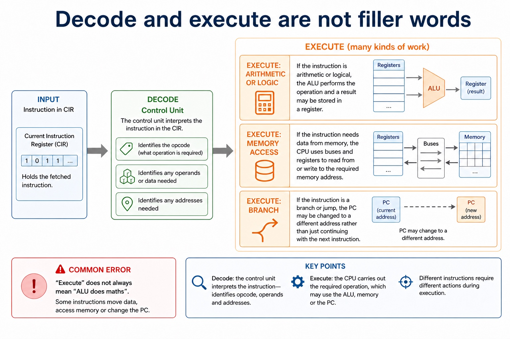

Text transcript

- The control unit interprets the instruction in the CIR. It identifies the opcode, decides what operation is required, and identifies any operands or addresses needed.
- Execute: arithmetic or logic
- If the instruction is arithmetic or logical, the ALU performs the operation and a result may be stored in a register.
- Execute: memory access
- If the instruction needs data from memory, the CPU uses buses and registers to read from or write to the required memory address.
- Execute: branch
- If the instruction is a branch/jump, the PC may be changed to a different address rather than just continuing with the next instruction.
- Common error

#### Read and write traces

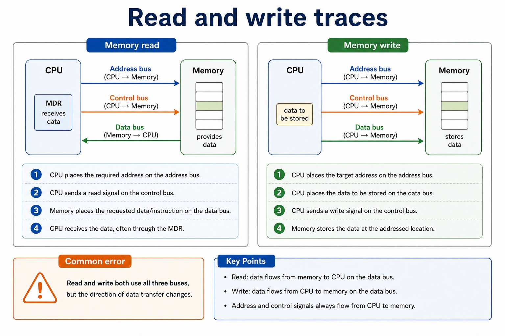

Text transcript

- Memory read
- CPU places the required address on the address bus.
- CPU sends a read signal on the control bus.
- Memory places the requested data/instruction on the data bus.
- CPU receives the data, often through the MDR.
- Memory write
- CPU places the target address on the address bus.
- CPU places the data to be stored on the data bus.

#### Common compare traps

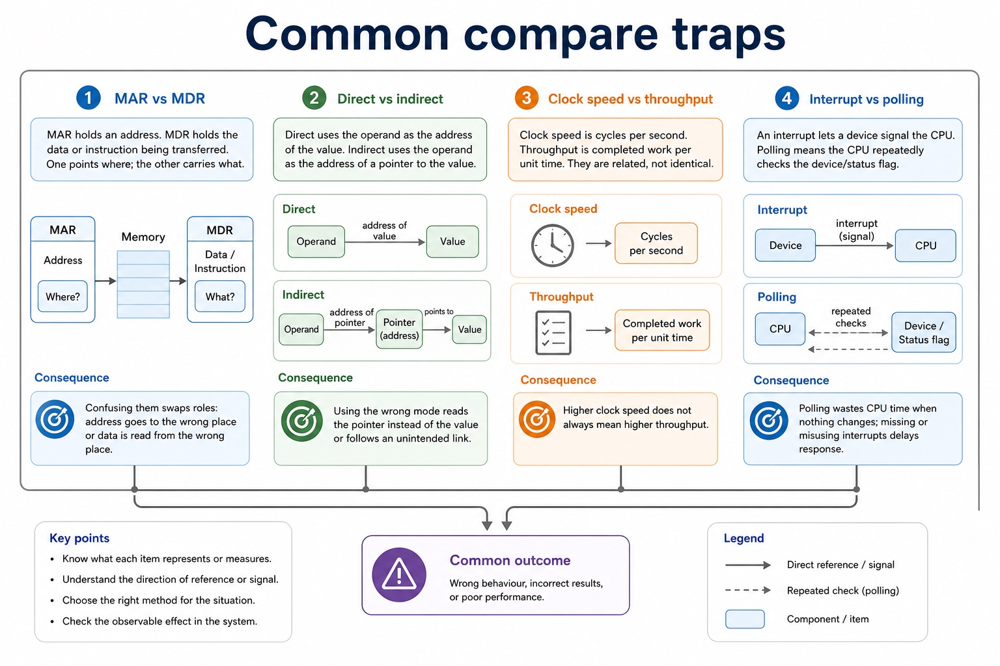

Text transcript

- MAR vs MDR
- MAR holds an address. MDR holds the data or instruction being transferred. One points where; the other carries what.
- Direct vs indirect
- Direct uses the operand as the address of the value. Indirect uses the operand as the address of a pointer to the value.
- Clock speed vs throughput
- Clock speed is cycles per second. Throughput is completed work per unit time. They are related, not identical.
- Interrupt vs polling
- An interrupt lets a device signal the CPU. Polling means the CPU repeatedly checks the device/status flag.

#### Why control and calculation are separate

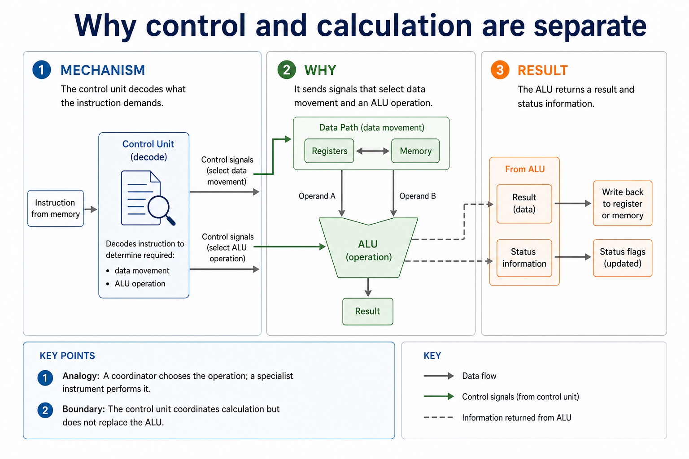

Text transcript

- The control unit decodes what the instruction demands.
- It sends signals that select data movement and an ALU operation.
- The ALU returns a result and status information.

Precise syllabus wording

Understand address, data and control buses.

Show how data are transferred between computer-system components using the address bus, data bus and control bus, including their directions and roles in read/write operations.

### 2. Processor type · Cores · Bus width · Clock (S4.05)

**Concept map:** processor type → cores → bus width → clock → cache

**Three-part explanation:**

1. Show how processor type and number of cores, bus width, clock speed and cache memory can contribute to performance
2. no single factor guarantees faster execution for every workload
3. A lightly threaded office program may favour A's processor type, clock behaviour and cache, while a parallel workload written for B's processor type may use more…

**Concrete cue:** Show how processor type and number of cores, bus width, clock speed and cache memory can contribute to performance; no single factor guarantees faster execution for every workload.

#### The official processor performance factors

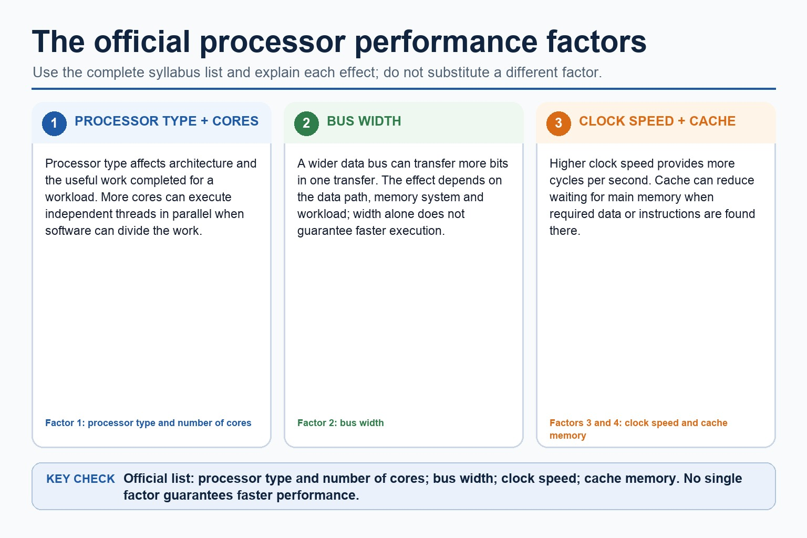

Text transcript

- The official performance factors are processor type and number of cores, bus width, clock speed and cache memory.
- Processor type affects how much useful work can be completed for a workload, while more cores help only when work can run in parallel.
- A wider bus transfers more bits per transfer; a higher clock speed provides more cycles per second; cache reduces slower main-memory accesses when required data or instructions are present.
- No single factor guarantees that one computer will be faster for every program.

#### Bus width and addressable locations

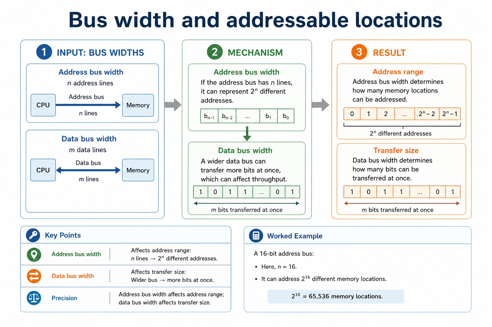

Text transcript

- Address bus width
- If the address bus has n lines, it can represent 2^n different addresses.
- A 16-bit address bus can address 2^16 = 65,536 memory locations.
- Data bus width
- A wider data bus can transfer more bits at once, which can affect throughput.
- Precision
- Address bus width affects address range; data bus width affects transfer size.

#### Performance is limited by bottlenecks

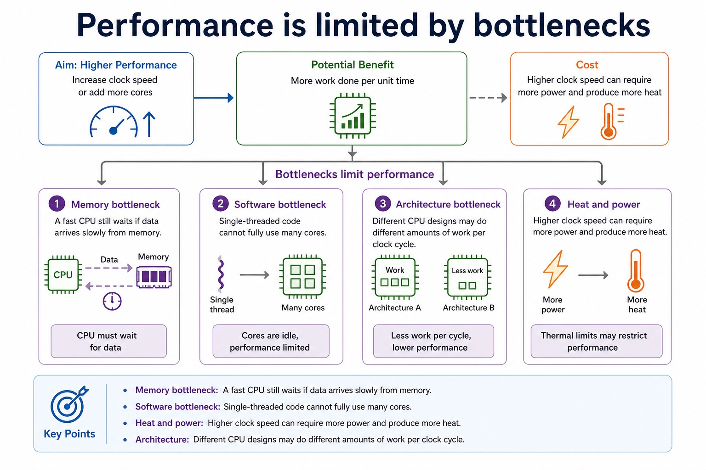

Text transcript

- Memory bottleneck A fast CPU still waits if data arrives slowly from memory.
- Software bottleneck Single-threaded code cannot fully use many cores.
- Heat and power Higher clock speed can require more power and produce more heat.
- Architecture Different CPU designs may do different amounts of work per clock cycle.

#### How registers, buses and clock stay aligned

Text transcript

- Registers expose small values needed immediately.
- Buses carry values, addresses and control signals on distinct paths.
- Clock events determine when components may capture a new state.

Precise syllabus wording

Understand processor performance factors: processor type, cores, bus width, clock and cache.

Show how processor type and number of cores, bus width, clock speed and cache memory can contribute to performance; no single factor guarantees faster execution for every workload.

### 3. USB · HDMI · VGA · Ports (S4.06)

**Concept map:** USB → HDMI → VGA → ports

**Three-part explanation:**

1. Understand how ports connect peripheral devices, including Universal Serial Bus (USB), High Definition Multimedia Interface (HDMI) and Video Graphics Array (VGA), with accurate signal/use distinctions
2. USB is a general serial interface carrying digital data and often power for peripherals
3. Port choice must match the peripheral and signal rather than rely on a claim that one connector is always best

**Concrete cue:** Use USB for a keyboard, HDMI for digital audio/video to a monitor, and VGA only for analogue video on older displays.

Precise syllabus wording

Understand USB, HDMI and VGA ports.

Understand how ports connect peripheral devices, including Universal Serial Bus (USB), High Definition Multimedia Interface (HDMI) and Video Graphics Array (VGA), with accurate signal/use distinctions.

### Supporting diagram library

#### The cycle in one clean sentence

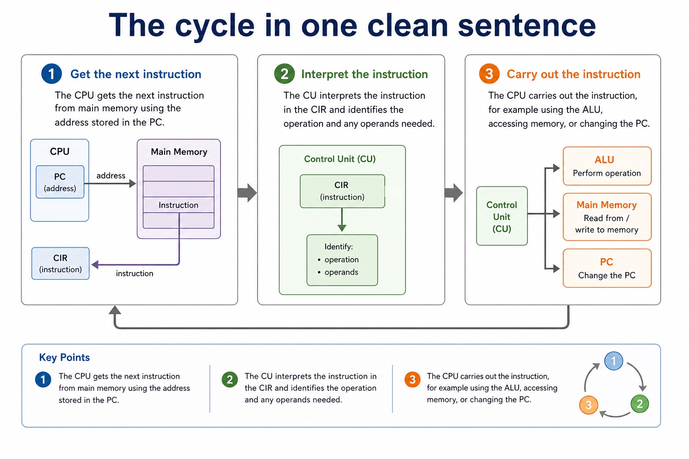

Text transcript

- The CPU gets the next instruction from main memory using the address stored in the PC.
- The CU interprets the instruction in the CIR and identifies the operation and any operands needed.
- The CPU carries out the instruction, for example using the ALU, accessing memory, or changing the PC.

#### Trace one instruction through the fetch stage

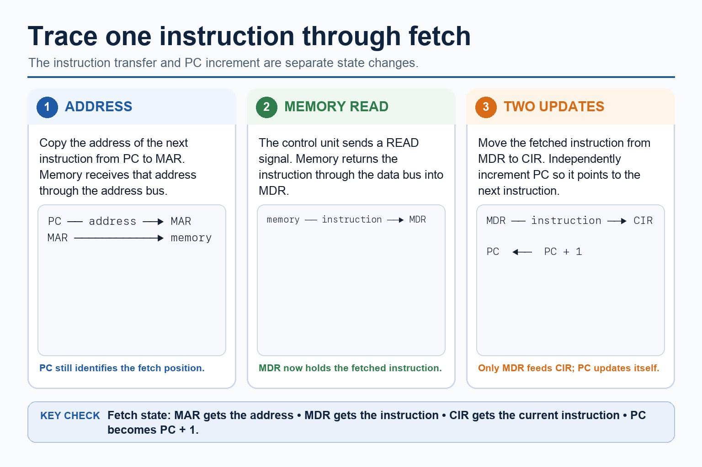

Text transcript

- Copy the next-instruction address from PC to MAR and read the instruction from memory into MDR.
- Move the fetched instruction from MDR to CIR.
- Increment PC independently so that PC points to the next instruction.
- PC does not feed CIR; only the instruction held in MDR is transferred to CIR.

#### Fetch stage: the register sequence

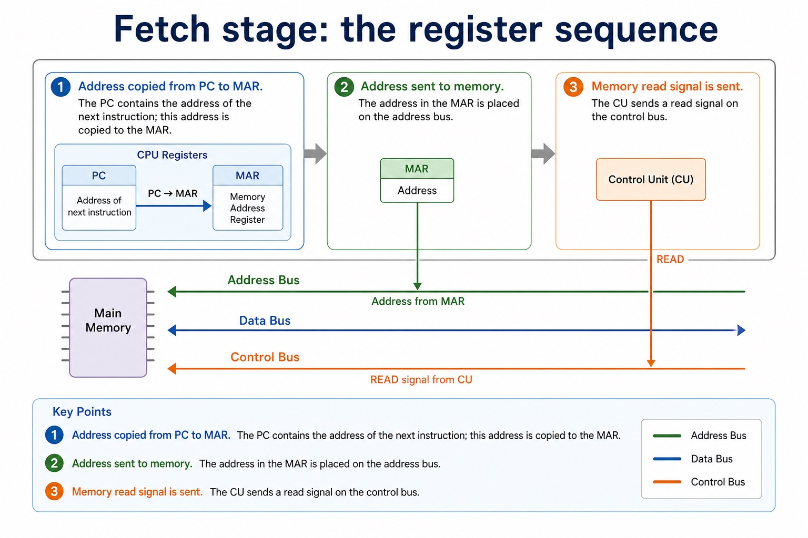

Text transcript

- This is the part students must be able to trace precisely.
- Register / bus focus
- Exam-safe wording
- Address copied from PC to MAR.
- PC - MAR
- The PC contains the address of the next instruction; this address is copied to the MAR.
- Address sent to memory.
- Address bus

#### The four fetch-stage names you cannot blur together

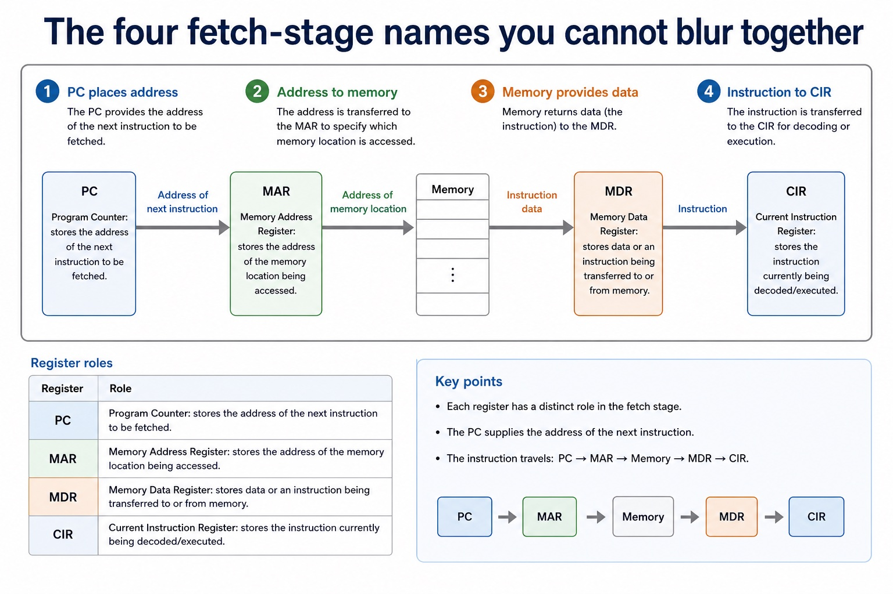

Text transcript

- Register roles
- PC Program Counter: stores the address of the next instruction to be fetched.
- MAR Memory Address Register: stores the address of the memory location being accessed.
- MDR Memory Data Register: stores data or an instruction being transferred to or from memory.
- CIR Current Instruction Register: stores the instruction currently being decoded/executed.

#### Turn vague into mark-worthy

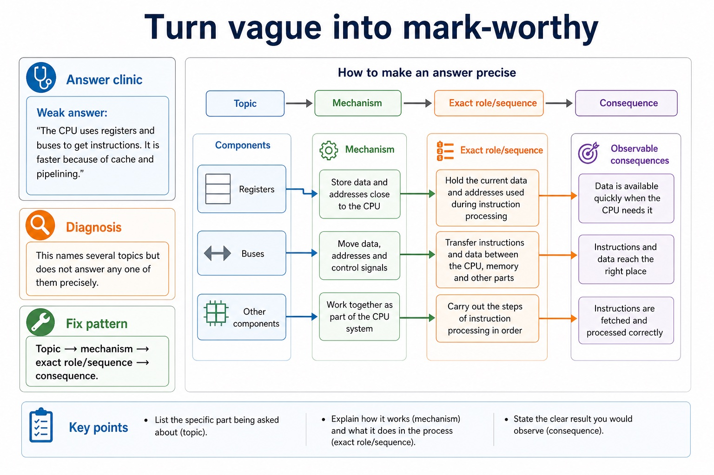

Text transcript

- Answer clinic
- Weak answer: "The CPU uses registers and buses to get instructions. It is faster because of cache and pipelining."
- Diagnosis: This names several topics but does not answer any one of them precisely.
- Fix pattern: Topic → mechanism → exact role/sequence → consequence.

#### Section 4 concept map

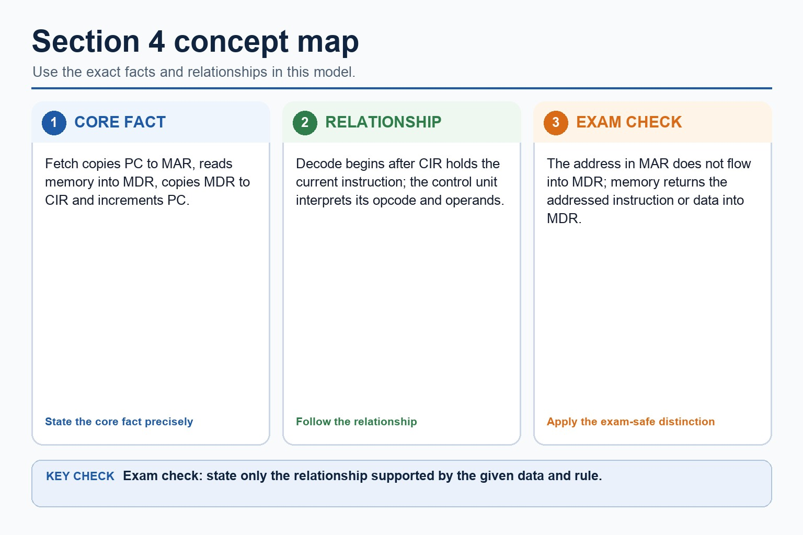

Text transcript

- Fetch copies PC to MAR, reads memory into MDR, copies MDR to CIR and increments PC.
- Decode begins after CIR holds the current instruction; the control unit interprets its opcode and operands.
- The address in MAR does not flow into MDR; memory returns the addressed instruction or data into MDR.

#### Retrieval grid: say the role, not just the name

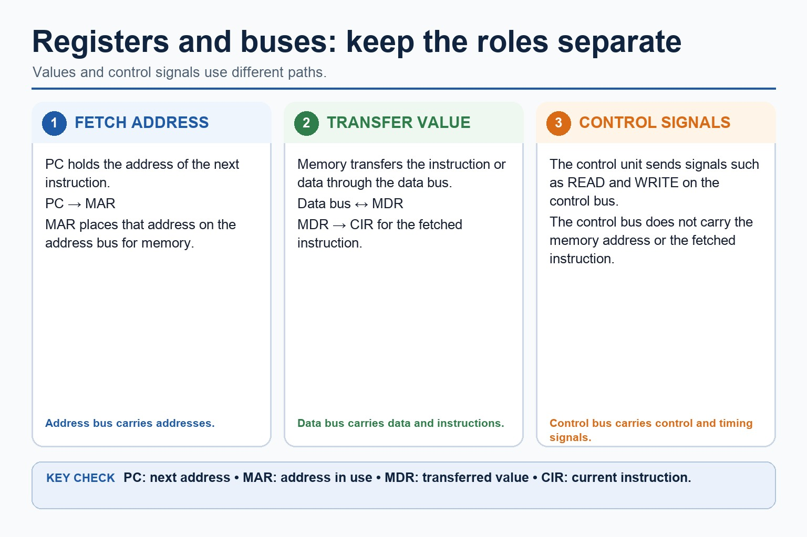

Text transcript

- PC holds the address of the next instruction; MAR holds the memory address being accessed.
- The address bus carries addresses between the processor and memory.
- MDR holds data or instructions transferred through the data bus.
- CIR holds the current instruction while it is decoded and executed.
- The control bus carries control and timing signals such as read, write and interrupt.

#### 8-minute mixed Section 4 response

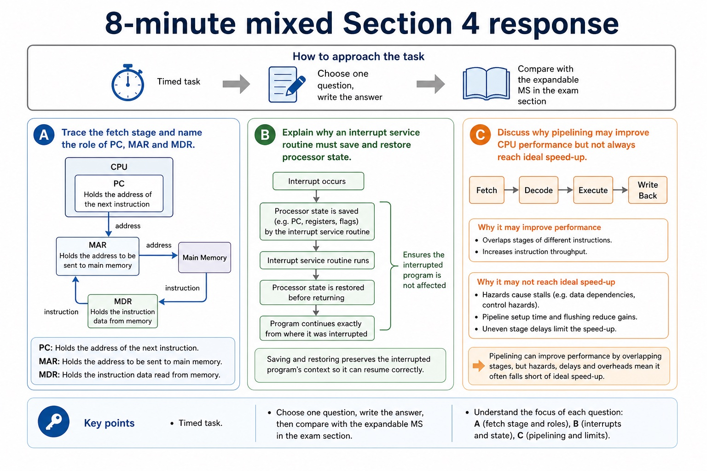

Text transcript

- Timed task
- Choose one question, write the answer, then compare with the expandable MS in the exam section.
- Question A Trace the fetch stage and name the role of PC, MAR and MDR.
- Question B Explain why an interrupt service routine must save and restore processor state.
- Question C Discuss why pipelining may improve CPU performance but not always reach ideal speed-up.

Open precise terminology and exam facts

- Show how data are transferred between computer-system components using the address bus, data bus and control bus, including their directions and roles in read/write operations.
- Show how processor type and number of cores, bus width, clock speed and cache memory can contribute to performance; no single factor guarantees faster execution for every workload.
- Understand how ports connect peripheral devices, including Universal Serial Bus (USB), High Definition Multimedia Interface (HDMI) and Video Graphics Array (VGA), with accurate signal/use distinctions.
- The address bus carries the address of the memory or I/O location being accessed and is normally directed from the processor. The data bus carries data and instructions in either direction. The control bus carries control and timing signals in both directions overall, including read/write signals from the CPU and interrupt or status signals toward it.
- A memory read uses all three buses: the CPU places the required address on the address bus, sends a read signal on the control bus, and memory returns the requested data or instruction on the data bus. A bus transfers signals; it does not permanently store them.
- USB is a general serial interface carrying digital data and often power for peripherals. HDMI carries digital video and audio. VGA carries analogue video and does not carry audio in the standard VGA signal. Port choice must match the peripheral and signal rather than rely on a claim that one connector is always best.
- Processor performance depends on processor type, number of cores, bus width, clock speed and cache memory. Processor type means the processor architecture and instruction-set design, including how much useful work its execution units can perform for a particular instruction or workload; a clock-rate comparison alone is therefore not sufficient.
- More cores can execute independent threads concurrently when software exposes parallel work. Wider data buses can transfer more bits per transfer, while address-bus width affects the address space. Higher clock speed provides more clock cycles per second, and cache reduces waiting when frequently used instructions or data are found close to the CPU.
- No factor guarantees that every program runs faster. Performance must be justified for the stated workload, because software parallelism, instruction-set compatibility, cache behaviour, memory traffic, heat and other bottlenecks can limit the benefit.

### Worked example

1. Read memory, then connect a display
2. Compare two processors for two workloads
3. To read address 240, the CPU puts 240 on the address bus and read on the control bus; memory returns the contents on the data bus.
4. To connect the computer to a modern TV with one digital audio/video cable, choose HDMI.
5. A keyboard or removable drive commonly uses USB, while a legacy analogue display may use VGA.
6. Processor A has four faster general-purpose cores and a larger cache; Processor B has eight specialised cores but a lower clock speed.

Beyond syllabus / 延伸知识（不要求背诵）: modern processors add pipelining and several cache levels, but exam answers should begin with the syllabus processor model.
## 3. Practice by question type

### Question 1 - foundation - describe - 8 marks

Describe a memory read using the address, data and control buses, then choose USB, HDMI or VGA for one stated peripheral connection. Two computers have different processor types. Explain how processor type, number of cores, bus width, clock speed and cache can affect their performance for a stated workload.

**Answer:** address bus carries the required memory/I/O address; control bus carries the read signal; data bus returns the requested data/instruction; USB matched to a suitable digital peripheral/data/power use; HDMI matched to digital video and audio; VGA matched to analogue video without standard audio; processor type linked to architecture/instruction-set/execution design and workload; cores linked to available parallel threads/tasks; bus width linked accurately to bits transferred or address space; clock speed linked to cycles per second; cache linked to reducing slower main-memory access; conclusion recognises workload and bottlenecks rather than claiming one factor guarantees speed

**Marking guidance:** Do not swap the address and data buses or claim that VGA normally carries digital audio. Do not accept processor type as only a brand name, or claim that the highest clock speed or largest core count always wins.

**Common error:** For the command word describe, perform that exact action; do not replace it with an unrelated fact.

### Question 2 - application - apply - 2 marks

What does processor type mean as a performance factor?

**Answer:** The processor architecture/instruction-set and execution design, which determines what work it can perform per instruction or for a particular workload.

**Marking guidance:** Award one mark for each distinct, technically accurate point or method step.

**Common error:** Do not repeat the same point in different words; each mark needs a separate idea or method step.

### Question 3 - transfer - explain - 2 marks

How can bus width affect performance?

**Answer:** A wider data bus can transfer more bits per transfer; address-bus width affects the address space rather than directly guaranteeing speed.

**Marking guidance:** Award one mark for each distinct, technically accurate point or method step.

**Common error:** Do not copy the worked example unchanged; transfer the method and check it against the new context.

### Related past-paper indexes

| Reference | Marks | Command word | Question type |
|---|---:|---|---|
| 9618/13/S/25 Q2(c) | 2 | describe | explain |
| 9618/13/S/25 Q2(i) | 2 | explain | explain |
| 9618/12/W/24 Q3(b) | 4 | complete | recall |
| 9618/12/W/24 Q3(c) | 4 | complete | recall |

These are indexes only. Cambridge question and mark-scheme wording is not reproduced.

## 4. Summary and exam reminders

### Summary

- Define system buses, ports and processor performance with the exact technical vocabulary expected by the syllabus.
- Use the lesson method on a fresh context and show the intermediate decision, representation or calculation.
- Match the shape of the answer to the command word and the available marks.
- Check the final answer against the scenario instead of repeating a memorised sentence.

### Common error to correct

Students often memorise register names without roles. Correction: a register earns its name by what it temporarily holds.

### Exam technique

- Follow the command word: state gives a fact; explain links a cause to a consequence; compare covers both sides.
- Match the number of independent points or method steps to the available marks.
- For system buses, ports and processor performance, use the exact technical term before applying it to the scenario.
