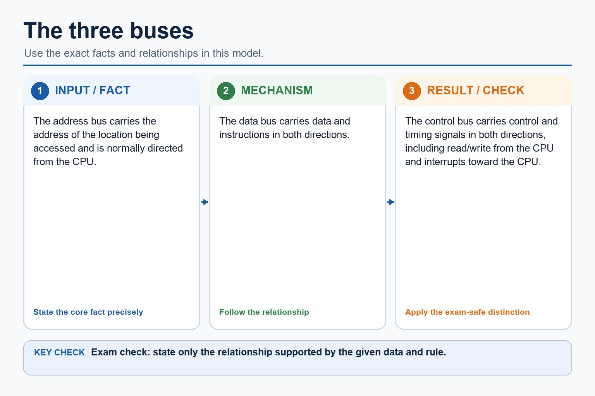

# Lesson 020: System buses, ports and processor performance

**Course:** Cambridge International AS Level Computer Science 9618, syllabus for examination in 2027-2029 
**Paper:** Paper 1 
**Syllabus:** Section 4: Processor fundamentals 
**Syllabus requirements:** S4.04, S4.05, S4.06 
**Pacing:** Flexible. Select a quick, full or deep route for the learners in front of you.

## Teaching-depth menu

- **Quick route:** Use the diagnostic, learning objectives, first worked example and foundation question. Stop once the learner can explain the central distinction accurately.
- **Full route:** Teach every knowledge-point material set, the worked method and all lesson questions.
- **Deep route:** Add the prerequisite refresher, ask learners to connect the concept checklist, discuss the labelled extension and complete a transfer question without a model answer.

## 1. Prerequisite knowledge and quick diagnostic

Recall S4.01 before starting this lesson.

Ask the learner to give one accurate definition or method step before continuing. If they cannot, briefly revisit the named prerequisite rather than repeating the whole previous lesson.

### Optional prerequisite refresher

- Show understanding of the basic Von Neumann model and the stored-program concept: instructions are stored in binary in the same directly accessible memory as data and are fetched for execution.
- Understand Von Neumann architecture and the stored-program concept.

## 2. Knowledge explanation

### 1. Address, data and control buses (S4.04)

**Concept relationships**

- **address:** Address, data and control buses.
- **control:** The CPU places the required address on the…
- **buses:** Wider data buses can transfer more bits per…
- **data:** Show how data are transferred between computer-system components…
- **processor type:** Processor performance depends on processor type, number of…

**Mechanism**

1. **Identify incoming data or signal** — Address, data and control buses.
2. **Follow the physical or logical path** — The CPU places the required address on the address bus, sends a read signal on the control bus,…
3. **Connect output to its use** — Show how data are transferred between computer-system components using the address bus, data bus and control bus, including…

**The three buses:** The address bus carries the address of the location being accessed and is normally directed from the CPU. The data bus carries data and instructions in both directions.

#### The three buses

Text transcript

- The address bus carries the address of the location being accessed and is normally directed from the CPU.
- The data bus carries data and instructions in both directions.
- The control bus carries control and timing signals in both directions, including read/write from the CPU and interrupts toward the CPU.

Precise syllabus wording

Understand address, data and control buses.

Show how data are transferred between computer-system components using the address bus, data bus and control bus, including their directions and roles in read/write operations.

### 2. Processor performance factors: processor type, cores, bus width, clock and cache (S4.05)

**Concept relationships**

- **processor type:** Processor performance depends on processor type, number of…
- **bus width:** Show how processor type and number of cores,…
- **cores:** Processor type, cores, bus width, clock and cache.
- **clock:** Higher clock speed provides more clock cycles per…
- **cache:** Performance must be justified for the stated workload,…

**Mechanism**

1. **Identify incoming data or signal** — Processor performance depends on processor type, number of cores, bus width, clock speed and cache memory.
2. **Follow the physical or logical path** — Show how processor type and number of cores, bus width, clock speed and cache memory can contribute to…
3. **Connect output to its use** — Processor type, cores, bus width, clock and cache.

**Bus width and addressable locations:** Address bus width If the address bus has n lines, it can represent 2^n different addresses.

#### Bus width and addressable locations

Text transcript

- Address bus width
- If the address bus has n lines, it can represent 2^n different addresses.
- A 16-bit address bus can address 2^16 = 65,536 memory locations.
- Data bus width
- A wider data bus can transfer more bits at once, which can affect throughput.
- Precision
- Address bus width affects address range; data bus width affects transfer size.

Precise syllabus wording

Understand processor performance factors: processor type, cores, bus width, clock and cache.

Show how processor type and number of cores, bus width, clock speed and cache memory can contribute to performance; no single factor guarantees faster execution for every workload.

### 3. USB, HDMI and VGA ports (S4.06)

**Concept relationships**

- **USB:** How ports connect peripheral devices, including Universal Serial…
- **HDMI:** USB, HDMI and VGA ports.
- **VGA:** VGA carries analogue video and does not carry…
- **ports:** HDMI carries digital video and audio.
- **address:** Wider data buses can transfer more bits per…

**Mechanism**

1. **Translate the stated design** — How ports connect peripheral devices, including Universal Serial Bus (USB), High Definition Multimedia Interface (HDMI) and Video Graphics…
2. **Apply one complete operation** — USB, HDMI and VGA ports.
3. **Trace state and boundaries** — HDMI carries digital video and audio.

**Concrete case: USB:** How ports connect peripheral devices, including Universal Serial Bus (USB), High Definition Multimedia Interface (HDMI) and Video Graphics Array (VGA), with accurate signal/use distinctions.

Precise syllabus wording

Understand USB, HDMI and VGA ports.

Understand how ports connect peripheral devices, including Universal Serial Bus (USB), High Definition Multimedia Interface (HDMI) and Video Graphics Array (VGA), with accurate signal/use distinctions.

Open precise terminology and exam facts

- Show how data are transferred between computer-system components using the address bus, data bus and control bus, including their directions and roles in read/write operations.
- Show how processor type and number of cores, bus width, clock speed and cache memory can contribute to performance; no single factor guarantees faster execution for every workload.
- Understand how ports connect peripheral devices, including Universal Serial Bus (USB), High Definition Multimedia Interface (HDMI) and Video Graphics Array (VGA), with accurate signal/use distinctions.
- The address bus carries the address of the memory or I/O location being accessed and is normally directed from the processor. The data bus carries data and instructions in either direction. The control bus carries control and timing signals in both directions overall, including read/write signals from the CPU and interrupt or status signals toward it.
- A memory read uses all three buses: the CPU places the required address on the address bus, sends a read signal on the control bus, and memory returns the requested data or instruction on the data bus. A bus transfers signals; it does not permanently store them.
- USB is a general serial interface carrying digital data and often power for peripherals. HDMI carries digital video and audio. VGA carries analogue video and does not carry audio in the standard VGA signal. Port choice must match the peripheral and signal rather than rely on a claim that one connector is always best.
- Processor performance depends on processor type, number of cores, bus width, clock speed and cache memory. Processor type means the processor architecture and instruction-set design, including how much useful work its execution units can perform for a particular instruction or workload; a clock-rate comparison alone is therefore not sufficient.
- More cores can execute independent threads concurrently when software exposes parallel work. Wider data buses can transfer more bits per transfer, while address-bus width affects the address space. Higher clock speed provides more clock cycles per second, and cache reduces waiting when frequently used instructions or data are found close to the CPU.
- No factor guarantees that every program runs faster. Performance must be justified for the stated workload, because software parallelism, instruction-set compatibility, cache behaviour, memory traffic, heat and other bottlenecks can limit the benefit.

### Worked method

1. Read memory, then connect a display
2. Compare two processors for two workloads
3. To read address 240, the CPU puts 240 on the address bus and read on the control bus; memory returns the contents on the data bus.
4. To connect the computer to a modern TV with one digital audio/video cable, choose HDMI.
5. A keyboard or removable drive commonly uses USB, while a legacy analogue display may use VGA.

Beyond syllabus / 延伸知识（不要求背诵）: modern processors add pipelining and several cache levels, but exam answers should begin with the syllabus processor model.
## 3. Practice by question type

### Question 1 - foundation - describe - 8 marks

Describe a memory read using the address, data and control buses, then choose USB, HDMI or VGA for one stated peripheral connection. Two computers have different processor types. Explain how processor type, number of cores, bus width, clock speed and cache can affect their performance for a stated workload.

**Answer:** address bus carries the required memory/I/O address; control bus carries the read signal; data bus returns the requested data/instruction; USB matched to a suitable digital peripheral/data/power use; HDMI matched to digital video and audio; VGA matched to analogue video without standard audio; processor type linked to architecture/instruction-set/execution design and workload; cores linked to available parallel threads/tasks; bus width linked accurately to bits transferred or address space; clock speed linked to cycles per second; cache linked to reducing slower main-memory access; conclusion recognises workload and bottlenecks rather than claiming one factor guarantees speed

**Marking guidance:** Do not swap the address and data buses or claim that VGA normally carries digital audio. Do not accept processor type as only a brand name, or claim that the highest clock speed or largest core count always wins.

**Common error:** For the command word describe, perform that exact action; do not replace it with an unrelated fact.

### Question 2 - application - apply - 2 marks

What does processor type mean as a performance factor?

**Answer:** The processor architecture/instruction-set and execution design, which determines what work it can perform per instruction or for a particular workload.

**Marking guidance:** Award one mark for each distinct, technically accurate point or method step.

**Common error:** Do not repeat the same point in different words; each mark needs a separate idea or method step.

### Question 3 - transfer - explain - 2 marks

How can bus width affect performance?

**Answer:** A wider data bus can transfer more bits per transfer; address-bus width affects the address space rather than directly guaranteeing speed.

**Marking guidance:** Award one mark for each distinct, technically accurate point or method step.

**Common error:** Do not copy the worked example unchanged; transfer the method and check it against the new context.

### Related past-paper indexes

| Reference | Marks | Command word | Question type |
|---|---:|---|---|
| 9618/13/S/25 Q2(c) | 2 | describe | explain |
| 9618/13/S/25 Q2(i) | 2 | explain | explain |
| 9618/12/W/24 Q3(b) | 4 | complete | recall |
| 9618/12/W/24 Q3(c) | 4 | complete | recall |

These are indexes only. Cambridge question and mark-scheme wording is not reproduced.

## 4. Summary and exam reminders

### Summary

- Define system buses, ports and processor performance with the exact technical vocabulary expected by the syllabus.
- Use the lesson method on a fresh context and show the intermediate decision, representation or calculation.
- Match the shape of the answer to the command word and the available marks.
- Check the final answer against the scenario instead of repeating a memorised sentence.

### Common error to correct

Students often memorise register names without roles. Correction: a register earns its name by what it temporarily holds.

### Exam technique

- Follow the command word: state gives a fact; explain links a cause to a consequence; compare covers both sides.
- Match the number of independent points or method steps to the available marks.
- For system buses, ports and processor performance, use the exact technical term before applying it to the scenario.
