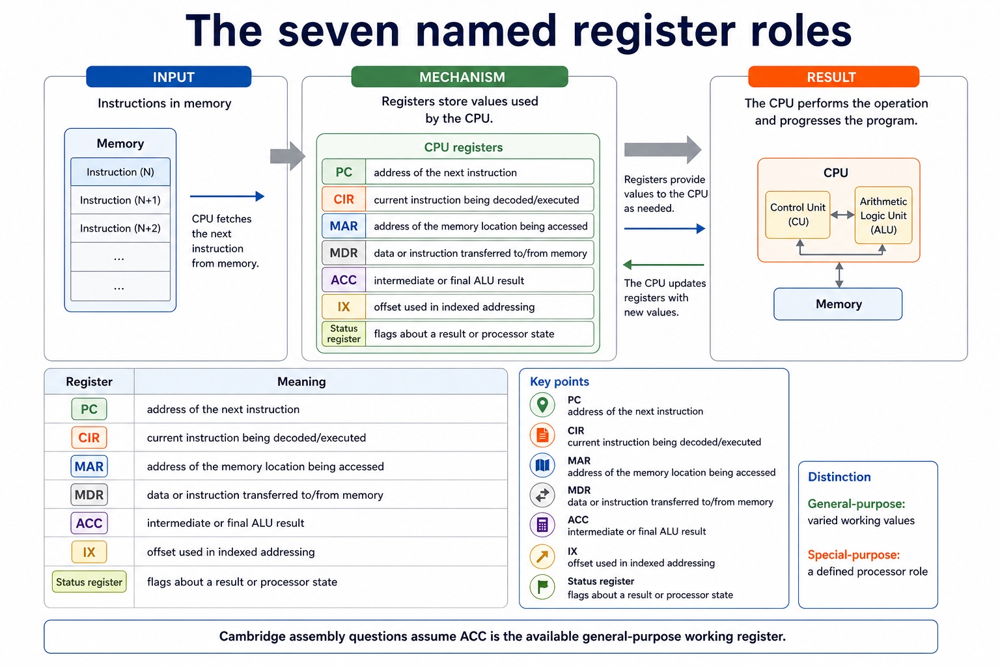

# Lesson 021: The fetch-execute cycle in register-transfer notation

**Course:** Cambridge International AS Level Computer Science 9618, 2027-2029 Version 2 
**Paper:** Paper 1 
**Syllabus:** Section 4: Processor fundamentals 
**Syllabus requirements:** S4.07 
**Pacing:** Flexible. This lesson is deliberately over-complete; select a quick, full or deep route for the learners in front of you.

## Teaching-depth menu

- **Quick route:** Use the diagnostic, learning objectives, first worked example and foundation question. Stop once the learner can explain the central distinction accurately.
- **Full route:** Teach every core explanation point, the worked example and all lesson questions. Use the visual only when it adds a different representation.
- **Deep route:** Add the prerequisite refresher, ask learners to connect the concept checklist, discuss the labelled extension and complete a transfer question without a model answer.

## 1. Prerequisite knowledge and quick diagnostic

Recall S4.01 before starting this lesson.

Ask the learner to give one accurate definition or method step before continuing. If they cannot, briefly revisit the named prerequisite rather than repeating the whole previous lesson.

### Optional prerequisite refresher

- Show understanding of the basic Von Neumann model and the stored-program concept: instructions are stored in binary in the same directly accessible memory as data and are fetched for execution.
- Understand Von Neumann architecture and the stored-program concept.

## 2. Knowledge explanation

### Learning objectives

- Describe the fetch-execute cycle using register transfer notation.

### Concept checklist for teacher choice

- fetch-execute cycle / fetch decode execute / fetch-decode-execute cycle
- register transfer notation / register-transfer notation

### Detailed explanation

- Describe the stages of the Fetch-Execute cycle and use register-transfer notation, including MAR <- PC, MDR <- Memory[MAR], CIR <- MDR and a coherent PC update.
- Register-transfer notation describes a data transfer or register update. The arrow <- means 'is loaded with' or 'receives'; it is not an equality sign. Memory[MAR] means the contents of the memory location whose address is currently held in MAR.
- A coherent fetch sequence is MAR <- PC; MDR <- Memory[MAR]; CIR <- MDR; and PC <- PC + 1 at an appropriate point before the next fetch. The control unit then decodes the opcode and operand in CIR and sends control signals for execution.
- During execution, notation such as ACC <- ACC + MDR records an arithmetic result in ACC, while Memory[MAR] <- MDR records a memory write. Read every statement from right to left: obtain the source value, then replace the destination contents.
- The exact timing of PC increment may vary between coherent processor descriptions, but MAR must receive the current instruction address before that address is replaced. Register-transfer notation describes movement and updates; it does not imply that two registers permanently contain the same value.

### Worked example

Trace one instruction fetch: Start with PC = 120 and Memory[120] = LDD 500. MAR <- PC puts 120 in MAR. MDR <- Memory[MAR] puts LDD 500 in MDR. CIR <- MDR copies the instruction into CIR. PC <- PC + 1 makes PC 121, ready to address the next instruction. The control unit then decodes LDD and executes it.

Beyond syllabus / 延伸知识（不要求背诵）: modern processors add pipelining and several cache levels, but exam answers should begin with the syllabus processor model.

### Retained visual explanation

_The seven named register roles. The image and mobile text alternative come from one maintained fact source._

## 3. Practice by question type

### Question 1 - foundation - describe - 6 marks

Using register-transfer notation, describe the fetch of one instruction and explain the meaning of Memory[MAR].

**Answer:** MAR <- PC; MDR <- Memory[MAR]; CIR <- MDR; PC <- PC + 1 at a coherent point; Memory[MAR] means the contents at the memory address held in MAR; CIR is decoded and control signals initiate execution

**Marking guidance:** Do not accept PC <- MAR as the first transfer or treat Memory[MAR] as the address value itself.

**Common error:** For the command word describe, perform that exact action; do not replace it with an unrelated fact.

### Question 2 - application - write - 2 marks

Write register-transfer notation for adding the value in MDR to ACC.

**Answer:** ACC <- ACC + MDR.

**Marking guidance:** Award one mark for each distinct, technically accurate point or method step.

**Common error:** Do not repeat the same point in different words; each mark needs a separate idea or method step.

### Question 3 - transfer - apply - 2 marks

What does MAR <- PC mean?

**Answer:** Copy the address currently in PC into MAR; PC is not changed by that transfer.

**Marking guidance:** Award one mark for each distinct, technically accurate point or method step.

**Common error:** Do not copy the worked example unchanged; transfer the method and check it against the new context.

### Related past-paper indexes

| Reference | Marks | Command word | Question type |
|---|---:|---|---|
| 9618/13/S/25 Q2(ii) | 4 | explain | explain |
| 9618/13/S/25 Q2(b) | 2 | describe | explain |
| 9618/13/W/23 Q9(b) | 4 | complete | recall |
| 9618/13/S/23 Q7(c) | 2 | complete | recall |

These are indexes only. Cambridge question and mark-scheme wording is not reproduced.

## 4. Summary and exam reminders

### Summary

- Define the fetch-execute cycle in register-transfer notation with the exact technical vocabulary expected by the syllabus.
- Use the lesson method on a fresh context and show the intermediate decision, representation or calculation.
- Match the shape of the answer to the command word and the available marks.
- Check the final answer against the scenario instead of repeating a memorised sentence.

### Common error to correct

Students often memorise register names without roles. Correction: a register earns its name by what it temporarily holds.

### Exam technique

- Follow the command word: state gives a fact; explain links a cause to a consequence; compare covers both sides.
- Match the number of independent points or method steps to the available marks.
- For the fetch-execute cycle in register-transfer notation, use the exact technical term before applying it to the scenario.
