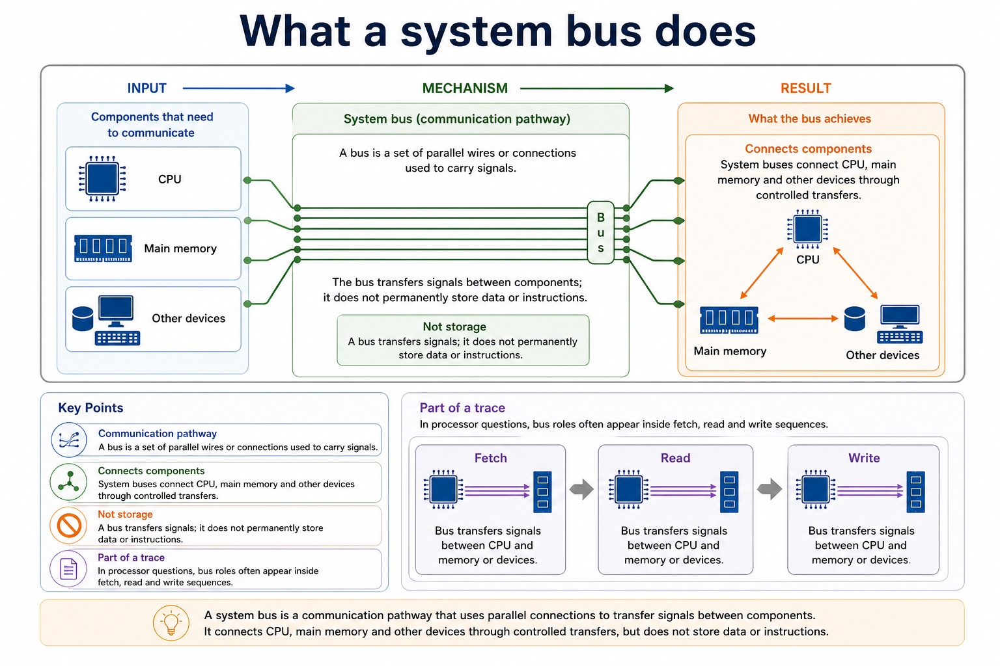

# Lesson 022: Interrupt causes, detection and handling

**Course:** Cambridge International AS Level Computer Science 9618, 2027-2029 Version 2 
**Paper:** Paper 1 
**Syllabus:** Section 4: Processor fundamentals 
**Syllabus requirements:** S4.08 
**Pacing:** Flexible. Select the material set and practice depth needed by the learner.

## Teaching-depth menu

- **Quick route:** Use the diagnostic, learning objectives, first worked example and foundation question. Stop once the learner can explain the central distinction accurately.
- **Full route:** Use every knowledge-point material set, the worked method, the terminology check and all questions.
- **Deep route:** Add the prerequisite refresher, ask learners to connect the concept checklist, discuss the labelled extension and complete a transfer question without a model answer.

## 1. Prerequisite knowledge and quick diagnostic

Recall S4.07 before starting this lesson.

Ask the learner to give one accurate definition or method step before continuing. If they cannot, briefly revisit the named prerequisite rather than repeating the whole previous lesson.

### Optional prerequisite refresher

- Describe the stages of the Fetch-Execute cycle and use register-transfer notation, including MAR <- PC, MDR <- Memory[MAR], CIR <- MDR and a coherent PC update.
- Describe the fetch-execute cycle using register transfer notation.

## 2. Knowledge explanation

### 1. Causes · Applications · Interrupts · ISR (S4.08)

**Concept map:** causes → applications → interrupts → ISR → detected → handling

**Three-part explanation:**

1. Include possible causes and applications of interrupts, the use of an Interrupt Service Routine (ISR), when interrupts are detected during the fetch-execute cycle and the full…
2. An enabled interrupt request is detected at an instruction boundary before the processor begins the handling sequence
3. Possible causes include input/output devices needing service, a timer used for scheduling, a hardware fault, and a software exception

**Concrete cue:** Include possible causes and applications of interrupts, the use of an Interrupt Service Routine (ISR), when interrupts are detected during the fetch-execute cycle and the full save-handle-restore sequence.

#### The interrupt handling cycle

Text transcript

- 1. Execute instruction The CPU finishes the current instruction before accepting most maskable interrupts.
- 2. Check interrupt The control unit checks whether an interrupt is pending and enabled.
- 3. Save state Important registers, PC and status information are stored, often on a stack.
- 4. Find ISR The interrupt type is used to locate the correct interrupt service routine.
- 5. Run ISR The routine handles the event, such as reading a key or acknowledging a device.
- 6. Restore and return The saved state is restored and the interrupted program continues.
- Why this matters
- Saving state is the "bookmark". Without it, the CPU may not know where or how to resume the interrupted program.

#### What an interrupt is

Text transcript

- Interrupt
- A signal that causes the processor to pause normal execution and deal with an event.
- Interrupt service routine
- A program routine that handles a specific interrupt.
- Processor state
- The information needed to continue later, such as PC, registers and status flags.
- Interrupt flag
- A stored indication that an interrupt has occurred or is waiting to be handled.

#### Interrupts versus polling

Text transcript

- Interrupt-driven input
- The device signals the CPU when attention is needed. The CPU can do useful work meanwhile.
- Efficient when events are unpredictable.
- Requires interrupt handling and state saving.
- Good exam phrase: "CPU does not continually check the device."
- The CPU repeatedly checks a device or flag to see whether attention is needed.
- Simple to understand and implement.
- Can waste processor time if checks are frequent and no event has occurred.

#### Where interrupts come from

Text transcript

- Input/output device
- A keyboard, printer or network interface signals that it needs CPU attention.
- Example: key pressed; printer buffer ready.
- A timer interrupt lets an operating system share CPU time between tasks.
- Example: scheduler checks whether another process should run.
- Hardware fault
- A device or hardware condition signals a problem that must be handled.
- Example: power warning or device failure signal.

Precise syllabus wording

Understand causes/applications of interrupts, ISR, detection and handling.

Include possible causes and applications of interrupts, the use of an Interrupt Service Routine (ISR), when interrupts are detected during the fetch-execute cycle and the full save-handle-restore sequence.

### Supporting diagram library

#### What a system bus does

Text transcript

- Communication pathway
- A bus is a set of parallel wires or connections used to carry signals.
- Connects components
- System buses connect CPU, main memory and other devices through controlled transfers.
- Not storage
- A bus transfers signals; it does not permanently store data or instructions.
- Part of a trace
- In processor questions, bus roles often appear inside fetch, read and write sequences.

#### Read and write traces

Text transcript

- Memory read
- CPU places the required address on the address bus.
- CPU sends a read signal on the control bus.
- Memory places the requested data/instruction on the data bus.
- CPU receives the data, often through the MDR.
- Memory write
- CPU places the target address on the address bus.
- CPU places the data to be stored on the data bus.

#### The three buses

Text transcript

- The address bus carries the address of the location being accessed and is normally directed from the CPU.
- The data bus carries data and instructions in both directions.
- The control bus carries control and timing signals in both directions, including read/write from the CPU and interrupts toward the CPU.

Open precise terminology and exam facts

- Include possible causes and applications of interrupts, the use of an Interrupt Service Routine (ISR), when interrupts are detected during the fetch-execute cycle and the full save-handle-restore sequence.
- An interrupt is a signal or condition requesting processor attention. Possible causes include input/output devices needing service, a timer used for scheduling, a hardware fault, and a software exception. Applications include responsive input, sharing processor time and dealing promptly with exceptional conditions without continuously polling every device.
- For most maskable interrupts, the processor completes the current instruction and checks for pending enabled interrupts at the end of that fetch-execute cycle, before beginning the next instruction. Detection is therefore not the same as stopping halfway through an ordinary instruction.
- If an interrupt is accepted, the processor checks priority, saves the state needed to resume (such as PC, registers and status), loads or locates the correct interrupt service routine (ISR), executes the ISR, restores the saved state and resumes the interrupted program at the correct next instruction. The ISR is a routine, not the interrupt signal itself.
- An enabled interrupt request is detected at an instruction boundary before the processor begins the handling sequence.

### Worked example

1. Handle a keyboard interrupt
2. A key press raises an interrupt while the CPU is executing another program.
3. The CPU finishes its current instruction, detects the pending request at the cycle boundary, saves PC/register/status state, runs the keyboard ISR to read or acknowledge the input, restores the saved state and…

Beyond syllabus / 延伸知识（不要求背诵）: modern processors add pipelining and several cache levels, but exam answers should begin with the syllabus processor model.
## 3. Practice by question type

### Question 1 - foundation - describe - 6 marks

Describe one interrupt cause or application, state when it is detected in the fetch-execute cycle, and trace handling through the ISR to resumption.

**Answer:** valid cause/application such as I/O, timer, fault or exception; current instruction completes and interrupt is detected/checked at the cycle boundary; priority/enabled status is checked; PC/register/status state is saved; correct ISR is located and executed; state is restored and the interrupted program resumes

**Marking guidance:** Do not accept that every interrupt stops an instruction halfway through, that the ISR is the signal, or that the whole interrupted program restarts.

**Common error:** For the command word describe, perform that exact action; do not replace it with an unrelated fact.

### Question 2 - application - apply - 2 marks

List the handling sequence after detection.

**Answer:** Check/accept, save state, locate and execute ISR, restore state, resume program.

**Marking guidance:** Award one mark for each distinct, technically accurate point or method step.

**Common error:** Do not repeat the same point in different words; each mark needs a separate idea or method step.

### Question 3 - transfer - apply - 2 marks

When is a normal maskable interrupt detected and accepted?

**Answer:** After the current instruction completes, at the end of the fetch-execute cycle before the next instruction begins, subject to enabled/priority checks.

**Marking guidance:** Award one mark for each distinct, technically accurate point or method step.

**Common error:** Do not copy the worked example unchanged; transfer the method and check it against the new context.

### Related past-paper indexes

| Reference | Marks | Command word | Question type |
|---|---:|---|---|
| 9618/11/S/23 Q6 | 5 | explain | explain |
| 9618/13/W/23 Q9(d) | 3 | complete | recall |

These are indexes only. Cambridge question and mark-scheme wording is not reproduced.

## 4. Summary and exam reminders

### Summary

- Define interrupt causes, detection and handling with the exact technical vocabulary expected by the syllabus.
- Use the lesson method on a fresh context and show the intermediate decision, representation or calculation.
- Match the shape of the answer to the command word and the available marks.
- Check the final answer against the scenario instead of repeating a memorised sentence.

### Common error to correct

Students often memorise register names without roles. Correction: a register earns its name by what it temporarily holds.

### Exam technique

- Follow the command word: state gives a fact; explain links a cause to a consequence; compare covers both sides.
- Match the number of independent points or method steps to the available marks.
- For interrupt causes, detection and handling, use the exact technical term before applying it to the scenario.
