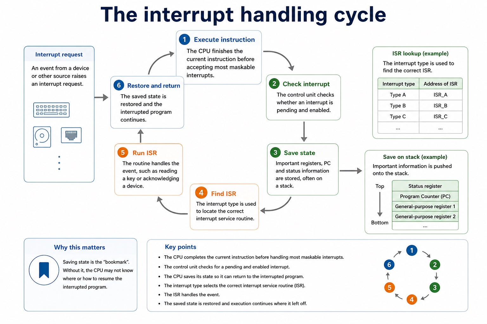

# Lesson 022: Interrupt causes, detection and handling

**Course:** Cambridge International AS Level Computer Science 9618, syllabus for examination in 2027-2029 
**Paper:** Paper 1 
**Syllabus:** Section 4: Processor fundamentals 
**Syllabus requirements:** S4.08 
**Pacing:** Flexible. Select a quick, full or deep route for the learners in front of you.

## Teaching-depth menu

- **Quick route:** Use the diagnostic, learning objectives, first worked example and foundation question. Stop once the learner can explain the central distinction accurately.
- **Full route:** Teach every knowledge-point material set, the worked method and all lesson questions.
- **Deep route:** Add the prerequisite refresher, ask learners to connect the concept checklist, discuss the labelled extension and complete a transfer question without a model answer.

## 1. Prerequisite knowledge and quick diagnostic

Recall S4.07 before starting this lesson.

Ask the learner to give one accurate definition or method step before continuing. If they cannot, briefly revisit the named prerequisite rather than repeating the whole previous lesson.

### Optional prerequisite refresher

- Describe the stages of the Fetch-Execute cycle and use register-transfer notation, including MAR <- PC, MDR <- Memory[MAR], CIR <- MDR and a coherent PC update.
- Describe the fetch-execute cycle using register transfer notation.

## 2. Knowledge explanation

### 1. Causes/applications of interrupts, ISR, detection and handling (S4.08)

**Atomic learning targets**

- **S4.08.A01:** causes
- **S4.08.A02:** applications
- **S4.08.A03:** interrupts
- **S4.08.A04:** ISR
- **S4.08.A05:** detected
- **S4.08.A06:** handling

**Core explanation**

- An interrupt is a signal or condition requesting processor attention. Possible causes include input/output devices needing service, a timer used for scheduling, a hardware fault, and a software exception. Applications include responsive input, sharing processor time and dealing promptly with exceptional conditions without continuously polling every device.
- For most maskable interrupts, the processor completes the current instruction and checks for pending enabled interrupts at the end of that fetch-execute cycle, before beginning the next instruction. Detection is therefore not the same as stopping halfway through an ordinary instruction.
- If an interrupt is accepted, the processor checks priority, saves the state needed to resume (such as PC, registers and status), loads or locates the correct interrupt service routine (ISR), executes the ISR, restores the saved state and resumes the interrupted program at the correct next instruction. The ISR is a routine, not the interrupt signal itself.
- An enabled interrupt request is detected at an instruction boundary before the processor begins the handling sequence.
- 1. Execute instruction The CPU finishes the current instruction before accepting most maskable interrupts. 2. Check interrupt The control unit checks whether an interrupt is pending and enabled.
- Causes/applications of interrupts, ISR, detection and handling.

**Mechanism or method**

1. **Identify the relevant condition or input** — An interrupt is a signal or condition requesting processor attention.
2. **Trace how the process works** — Possible causes include input/output devices needing service, a timer used for scheduling, a hardware fault, and a software exception.
3. **Connect the mechanism to its result** — Applications include responsive input, sharing processor time and dealing promptly with exceptional conditions without continuously polling every device.

#### Worked example: Causes/applications of interrupts, ISR, detection and handling: complete worked route

1. **Identify the relevant condition or input**

An interrupt is a signal or condition requesting processor attention.

2. **Trace how the process works**

Possible causes include input/output devices needing service, a timer used for scheduling, a hardware fault, and a software exception.

3. **Connect the mechanism to its result**

Applications include responsive input, sharing processor time and dealing promptly with exceptional conditions without continuously polling every device.

4. **Complete example**

The CPU finishes its current instruction, detects the pending request at the cycle boundary, saves PC/register/status state, runs the keyboard ISR to read or acknowledge the input, restores the saved state and continues the original program.

**Misconceptions to correct**

- Students often memorise register names without roles. Correction: a register earns its name by what it temporarily holds.

#### Mastery check (MC-L022-S4.08)

Explain the following targets in one connected answer, using a concrete example for each: causes; applications; interrupts; ISR; detected; handling.

Answer criteria

- An interrupt is a signal or condition requesting processor attention. Possible causes include input/output devices needing service, a timer used for scheduling, a hardware fault, and a software exception. Applications include responsive input, sharing processor time and dealing promptly with exceptional conditions without continuously polling every device.
- For most maskable interrupts, the processor completes the current instruction and checks for pending enabled interrupts at the end of that fetch-execute cycle, before beginning the next instruction. Detection is therefore not the same as stopping halfway through an ordinary instruction.
- If an interrupt is accepted, the processor checks priority, saves the state needed to resume (such as PC, registers and status), loads or locates the correct interrupt service routine (ISR), executes the ISR, restores the saved state and resumes the interrupted program at the correct next instruction. The ISR is a routine, not the interrupt signal itself.
- An enabled interrupt request is detected at an instruction boundary before the processor begins the handling sequence.
- 1. Execute instruction The CPU finishes the current instruction before accepting most maskable interrupts. 2. Check interrupt The control unit checks whether an interrupt is pending and enabled.
- Causes/applications of interrupts, ISR, detection and handling.

**Supplementary concept map**

- **causes:** Causes/applications of interrupts, ISR, detection and handling.
- **applications:** Include possible causes and applications of interrupts, the…
- **interrupts:** Execute instruction The CPU finishes the current instruction…
- **ISR:** The ISR is a routine, not the interrupt…
- **detected:** An enabled interrupt request is detected at an…
- **handling:** Find ISR The interrupt type is used to…

**Supplementary three-step recap**

1. **Identify incoming data or signal** — Causes/applications of interrupts, ISR, detection and handling.
2. **Follow the physical or logical path** — Include possible causes and applications of interrupts, the use of an Interrupt Service Routine (ISR), when interrupts are…
3. **Connect output to its use** — An enabled interrupt request is detected at an instruction boundary before the processor begins the handling sequence.

**The interrupt handling cycle:** 1. Execute instruction The CPU finishes the current instruction before accepting most maskable interrupts. 2. Check interrupt The control unit checks whether an interrupt is pending and enabled.

#### The interrupt handling cycle

Text transcript

- 1. Execute instruction The CPU finishes the current instruction before accepting most maskable interrupts.
- 2. Check interrupt The control unit checks whether an interrupt is pending and enabled.
- 3. Save state Important registers, PC and status information are stored, often on a stack.
- 4. Find ISR The interrupt type is used to locate the correct interrupt service routine.
- 5. Run ISR The routine handles the event, such as reading a key or acknowledging a device.
- 6. Restore and return The saved state is restored and the interrupted program continues.
- Why this matters
- Saving state is the "bookmark". Without it, the CPU may not know where or how to resume the interrupted program.

Precise syllabus wording

Understand causes/applications of interrupts, ISR, detection and handling.

Include possible causes and applications of interrupts, the use of an Interrupt Service Routine (ISR), when interrupts are detected during the fetch-execute cycle and the full save-handle-restore sequence.

### Lesson technical reference

- Include possible causes and applications of interrupts, the use of an Interrupt Service Routine (ISR), when interrupts are detected during the fetch-execute cycle and the full save-handle-restore sequence.
- An interrupt is a signal or condition requesting processor attention. Possible causes include input/output devices needing service, a timer used for scheduling, a hardware fault, and a software exception. Applications include responsive input, sharing processor time and dealing promptly with exceptional conditions without continuously polling every device.
- For most maskable interrupts, the processor completes the current instruction and checks for pending enabled interrupts at the end of that fetch-execute cycle, before beginning the next instruction. Detection is therefore not the same as stopping halfway through an ordinary instruction.
- If an interrupt is accepted, the processor checks priority, saves the state needed to resume (such as PC, registers and status), loads or locates the correct interrupt service routine (ISR), executes the ISR, restores the saved state and resumes the interrupted program at the correct next instruction. The ISR is a routine, not the interrupt signal itself.
- An enabled interrupt request is detected at an instruction boundary before the processor begins the handling sequence.

Beyond syllabus / 延伸知识（不要求背诵）: modern processors add pipelining and several cache levels, but exam answers should begin with the syllabus processor model.
## 3. Practice by question type

### Question 1 - foundation - describe - 6 marks

Describe one interrupt cause or application, state when it is detected in the fetch-execute cycle, and trace handling through the ISR to resumption.

**Answer:** valid cause/application such as I/O, timer, fault or exception; current instruction completes and interrupt is detected/checked at the cycle boundary; priority/enabled status is checked; PC/register/status state is saved; correct ISR is located and executed; state is restored and the interrupted program resumes

**Marking guidance:** Do not accept that every interrupt stops an instruction halfway through, that the ISR is the signal, or that the whole interrupted program restarts.

**Common error:** For the command word describe, perform that exact action; do not replace it with an unrelated fact.

### Question 2 - application - apply - 2 marks

List the handling sequence after detection.

**Answer:** Check/accept, save state, locate and execute ISR, restore state, resume program.

**Marking guidance:** Award one mark for each distinct, technically accurate point or method step.

**Common error:** Do not repeat the same point in different words; each mark needs a separate idea or method step.

### Question 3 - transfer - apply - 2 marks

When is a normal maskable interrupt detected and accepted?

**Answer:** After the current instruction completes, at the end of the fetch-execute cycle before the next instruction begins, subject to enabled/priority checks.

**Marking guidance:** Award one mark for each distinct, technically accurate point or method step.

**Common error:** Do not copy the worked example unchanged; transfer the method and check it against the new context.

### Related past-paper indexes

| Reference | Marks | Command word | Question type |
|---|---:|---|---|
| 9618/11/S/23 Q6 | 5 | explain | explain |
| 9618/13/W/23 Q9(d) | 3 | complete | recall |

These are indexes only. Cambridge question and mark-scheme wording is not reproduced.

## 4. Summary and exam reminders

### Summary

- S4.08: explain causes, applications, interrupts, ISR, detected, handling.
- S4.08 method: Identify the relevant condition or input → Trace how the process works → Connect the mechanism to its result.
- Correction to remember: Students often memorise register names without roles. Correction: a register earns its name by what it temporarily holds.

### Common error to correct

Students often memorise register names without roles. Correction: a register earns its name by what it temporarily holds.

### Exam technique

- Follow the command word: state gives a fact; explain links a cause to a consequence; compare covers both sides.
- Match the number of independent points or method steps to the available marks.
- For interrupt causes, detection and handling, use the exact technical term before applying it to the scenario.
