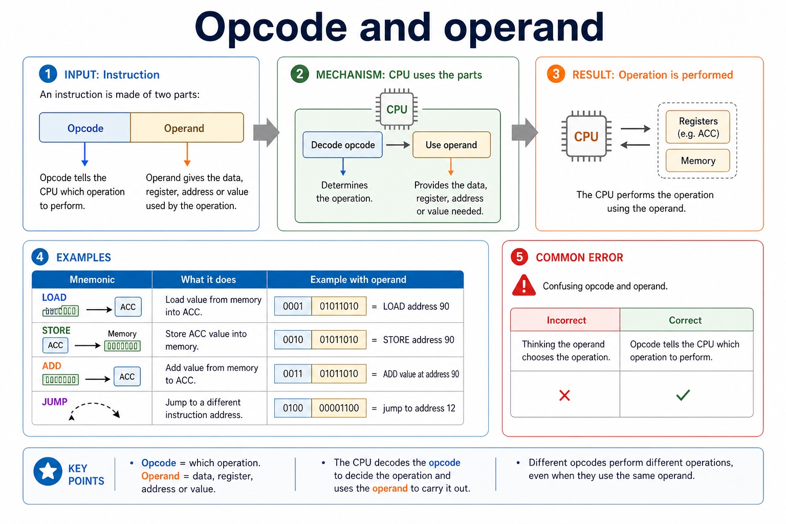

# Lesson 023: Assembly language and the two-pass assembler

**Course:** Cambridge International AS Level Computer Science 9618, 2027-2029 Version 2 
**Paper:** Paper 1 
**Syllabus:** Section 4: Processor fundamentals 
**Syllabus requirements:** S4.09, S4.10 
**Pacing:** Flexible. Select the material set and practice depth needed by the learner.

## Teaching-depth menu

- **Quick route:** Use the diagnostic, learning objectives, first worked example and foundation question. Stop once the learner can explain the central distinction accurately.
- **Full route:** Use every knowledge-point material set, the worked method, the terminology check and all questions.
- **Deep route:** Add the prerequisite refresher, ask learners to connect the concept checklist, discuss the labelled extension and complete a transfer question without a model answer.

## 1. Prerequisite knowledge and quick diagnostic

Recall S4.01, S4.09 before starting this lesson.

Ask the learner to give one accurate definition or method step before continuing. If they cannot, briefly revisit the named prerequisite rather than repeating the whole previous lesson.

### Optional prerequisite refresher

- Show understanding of the basic Von Neumann model and the stored-program concept: instructions are stored in binary in the same directly accessible memory as data and are fetched for execution.
- Understand Von Neumann architecture and the stored-program concept.
- Show the relationship between assembly language and machine code: assembly is a processor-specific symbolic low-level form translated by an assembler into binary instructions defined by the target instruction set.
- Distinguish assembly language and machine code.

## 2. Knowledge explanation

### 1. Assembly language and machine code (S4.09)

**Concept map:** assembly → language → machine → code

**Three-part explanation:**

1. assembly is a processor-specific symbolic low-level form translated by an assembler into binary instructions defined by the target instruction set
2. Assembly language is a low-level, processor-specific symbolic representation of machine-code instructions
3. Show the relationship between assembly language and machine code

**Concrete cue:** Show the relationship between assembly language and machine code: assembly is a processor-specific symbolic low-level form translated by an assembler into binary instructions defined by the target instruction set.

#### What assembly language is

Text transcript

- Low-level language
- Assembly language is close to machine code and closely linked to a processor's instruction set.
- Uses mnemonics
- Human-readable abbreviations represent machine-code operations.
- Processor-specific
- Assembly syntax and available instructions depend on the target architecture.
- Needs translation
- An assembler converts assembly language into machine code.

#### Machine code is binary instructions for the CPU

Text transcript

- Lowest-level executable form
- Machine code consists of binary instructions that can be executed directly by the processor.
- Not friendly for humans
- Binary instructions are difficult for people to read and write accurately, but they are the form the processor executes directly.
- Stored in memory
- Machine-code instructions are stored in memory and fetched by the CPU during the fetch-decode-execute cycle.
- CPU-specific meaning
- The same bit pattern can have different meanings on different architectures because opcodes are defined by the instruction set.

#### Instruction sets and compatibility

Text transcript

- Same ISA
- A program compiled to one instruction set can run on compatible processors that implement that instruction set.
- Different ISA
- Machine code for one architecture may not run correctly on another architecture.
- Translation needed
- Source code may need to be recompiled, interpreted, emulated or translated for a different processor.
- Exam wording
- Say "the CPU cannot recognise/execute those opcodes" rather than simply "the CPU does not like it".

#### Mnemonics represent operations

Text transcript

- Mnemonic
- Likely operation
- Exam-safe wording
- Load a value into a register/ACC.
- LOAD count
- LOAD is a mnemonic for a machine-code load instruction.
- Store a register/ACC value in memory.
- STORE total

Precise syllabus wording

Distinguish assembly language and machine code.

Show the relationship between assembly language and machine code: assembly is a processor-specific symbolic low-level form translated by an assembler into binary instructions defined by the target instruction set.

### 2. Two-pass assembler stages (S4.10)

**Concept map:** stages → two-pass → assembler

**Three-part explanation:**

1. pass 1 assigns addresses/builds the symbol table and pass 2 translates with resolved symbols
2. Describe the different stages of a two-pass assembler and apply the process to a simple program
3. Pass 1 scans source, assigns addresses and builds a symbol table for labels, allowing forward references

**Concrete cue:** Describe the different stages of a two-pass assembler and apply the process to a simple program: pass 1 assigns addresses/builds the symbol table and pass 2 translates with resolved symbols.

#### Pipelining overlaps instruction-cycle stages

Text transcript

- Pipeline
- A processor technique where multiple instructions are at different stages of execution at the same time.
- The next instruction is fetched from memory using the program counter and memory registers.
- The control unit interprets the instruction and prepares required operands/control signals.
- The instruction is carried out, such as arithmetic, memory access or a branch.

Precise syllabus wording

Describe and apply the stages of a two-pass assembler.

Describe the different stages of a two-pass assembler and apply the process to a simple program: pass 1 assigns addresses/builds the symbol table and pass 2 translates with resolved symbols.

### Supporting diagram library

#### What is an instruction set?

Text transcript

- Definition
- The set of instructions that a particular processor can recognise and execute.
- Includes operations
- Examples include load, store, add, subtract, compare, jump and input/output instructions.
- Processor-specific
- Different processor families can have different instruction sets and instruction formats.
- Defines meaning
- The instruction set tells the CPU what each opcode means and how operands are interpreted.

#### Opcode and operand

Text transcript

- Opcode tells the CPU which operation to perform. Operand gives the data, register, address or value used by the operation.
- Operation
- Example with operand
- Load value from memory into ACC.
- 0001 01011010 = LOAD address 90
- Store ACC value into memory.
- 0010 01011010 = STORE address 90
- Add value from memory to ACC.

#### Instruction groups: data movement, I/O, arithmetic, control and compare

Text transcript

- The five groups are data movement, input/output, arithmetic, unconditional/conditional instructions and compare.
- Data movement uses LDM, LDD, LDI, LDX, LDR, MOV and STO; LDR n loads the immediate value n into IX.
- Input/output uses IN and OUT; arithmetic uses ADD, SUB, INC and DEC.
- JMP is unconditional; CMP and CMI compare; JPE jumps after True and JPN jumps after False.
- END returns control to the operating system.

#### Official LDR, CMI, JPE and JPN semantics

Text transcript

- LDR n loads the immediate value n into the index register IX.
- CMI <address compares ACC with a value reached using indirect addressing.
- JPE <address jumps when the preceding comparison result is True.
- JPN <address jumps when the preceding comparison result is False.
- Do not reinterpret these instructions as relative load, immediate compare, equal/zero branch or negative-status branch.

#### Instruction labels and symbolic data addresses

Text transcript

- <label: <opcode <operand gives a symbolic address to an instruction.
- <label: <data gives a symbolic address to a memory location containing data.
- Pass 1 records both instruction and data labels in the symbol table.
- Pass 2 replaces a label reference with its resolved address while translating.

Open precise terminology and exam facts

- Show the relationship between assembly language and machine code: assembly is a processor-specific symbolic low-level form translated by an assembler into binary instructions defined by the target instruction set.
- Describe the different stages of a two-pass assembler and apply the process to a simple program: pass 1 assigns addresses/builds the symbol table and pass 2 translates with resolved symbols.
- Machine code is the binary instruction form executed directly by a processor. Each bit pattern is interpreted according to that processor's instruction set, so machine code is processor dependent.
- Assembly language is a low-level, processor-specific symbolic representation of machine-code instructions. Mnemonics such as ADD make operations easier for a human to read and write, while operands name the value, register or address used. An assembler translates assembly source into the corresponding machine code; assembly is not executed directly as text.
- The relationship is close but not based on English spelling: a mnemonic maps to an opcode defined by the target instruction set, and an operand must be encoded in the form required by that instruction. Labels are resolved to addresses during assembly.
- The two-pass assembler stages are Pass 1 and Pass 2. Pass 1 scans source, assigns addresses and builds a symbol table for labels, allowing forward references. Pass 2 translates mnemonics/operands using the completed table and produces machine code; invalid mnemonics or unresolved symbols are reported.
- The source form <label: <opcode <operand labels an instruction, while <label: <data assigns a symbolic address to a memory location containing data. Pass 1 records both kinds of label in the symbol table.
- The five instruction groups are data movement (LDM, LDD, LDI, LDX, LDR, MOV, STO), input/output (IN, OUT), arithmetic (ADD, SUB, INC, DEC), unconditional branch and conditional branch. JMP is the unconditional branch instruction; CMP, CMI, JPE and JPN form the compare and conditional branch group. END returns control to the operating system.
- Data movement: LDM n loads immediate n into ACC; LDD <address loads the directly addressed contents into ACC; LDI <address follows the address stored at <address; LDX <address loads from <address + IX; LDR n loads n into IX; MOV <register moves ACC to IX; STO <address stores ACC at the address.
- Arithmetic: ADD <address or ADD n/Bn/&n adds a memory value or immediate denary/binary/hexadecimal value to ACC; SUB has the corresponding forms; INC <register and DEC <register change ACC or IX by one.
- Control, comparison and I/O: JMP <address is unconditional. CMP <address or CMP n compares ACC directly or with an immediate value. CMI <address compares using indirect addressing. JPE jumps after a True comparison and JPN after a False comparison. IN inputs one ASCII character code to ACC; OUT outputs the character whose ASCII code is in ACC; END returns control to the operating system.
- ACC is the accumulator and IX is the index register. An address can be absolute or symbolic. Prefix gives immediate denary, B immediate binary and & immediate hexadecimal data. These prefixes and operand forms are part of the instruction semantics, not optional decoration.

### Worked example

1. Translate one symbolic instruction
2. For a target instruction set, ADD 3 is assembly source
3. ADD is the mnemonic and 3 is an immediate operand.
4. The assembler selects that processor's binary ADD opcode and encodes the operand.
5. A different processor type may use a different opcode or instruction format, so the same machine-code bit pattern is not portable by assumption.

Beyond syllabus / 延伸知识（不要求背诵）: modern processors add pipelining and several cache levels, but exam answers should begin with the syllabus processor model.
## 3. Practice by question type

### Question 1 - foundation - explain - 6 marks

Explain the relationship between assembly language and machine code and why an assembler and a target instruction set are required.

**Answer:** machine code consists of binary instructions executed directly by the processor; assembly uses mnemonics/operands/labels as a symbolic low-level form; assembler translates assembly source to machine code; mnemonic maps to an opcode and operands are encoded; instruction meanings/formats are defined by the processor instruction set; therefore code for one processor may not execute correctly on another

**Marking guidance:** Do not accept that assembly source is executed directly or that one machine-code instruction has a universal meaning across processors.

**Common error:** For the command word explain, perform that exact action; do not replace it with an unrelated fact.

### Question 2 - application - apply - 2 marks

What translates assembly language into machine code?

**Answer:** An assembler.

**Marking guidance:** Award one mark for each distinct, technically accurate point or method step.

**Common error:** Do not repeat the same point in different words; each mark needs a separate idea or method step.

### Question 3 - transfer - explain - 2 marks

Why is assembly language easier for people to use than machine code?

**Answer:** It uses symbolic mnemonics, operands and labels instead of raw binary bit patterns.

**Marking guidance:** Award one mark for each distinct, technically accurate point or method step.

**Common error:** Do not copy the worked example unchanged; transfer the method and check it against the new context.

### Related past-paper indexes

| Reference | Marks | Command word | Question type |
|---|---:|---|---|
| 9618/13/W/25 Q6(c) | 3 | complete | recall |
| 9618/12/S/23 Q3(a) | 3 | draw | calculate |
| 9618/12/S/23 Q3(b) | 3 | complete | calculate |
| 9618/11/W/23 Q8(a) | 1 | identify | recall |

These are indexes only. Cambridge question and mark-scheme wording is not reproduced.

## 4. Summary and exam reminders

### Summary

- Define assembly language and the two-pass assembler with the exact technical vocabulary expected by the syllabus.
- Use the lesson method on a fresh context and show the intermediate decision, representation or calculation.
- Match the shape of the answer to the command word and the available marks.
- Check the final answer against the scenario instead of repeating a memorised sentence.

### Common error to correct

Students often memorise register names without roles. Correction: a register earns its name by what it temporarily holds.

### Exam technique

- Follow the command word: state gives a fact; explain links a cause to a consequence; compare covers both sides.
- Match the number of independent points or method steps to the available marks.
- For assembly language and the two-pass assembler, use the exact technical term before applying it to the scenario.
