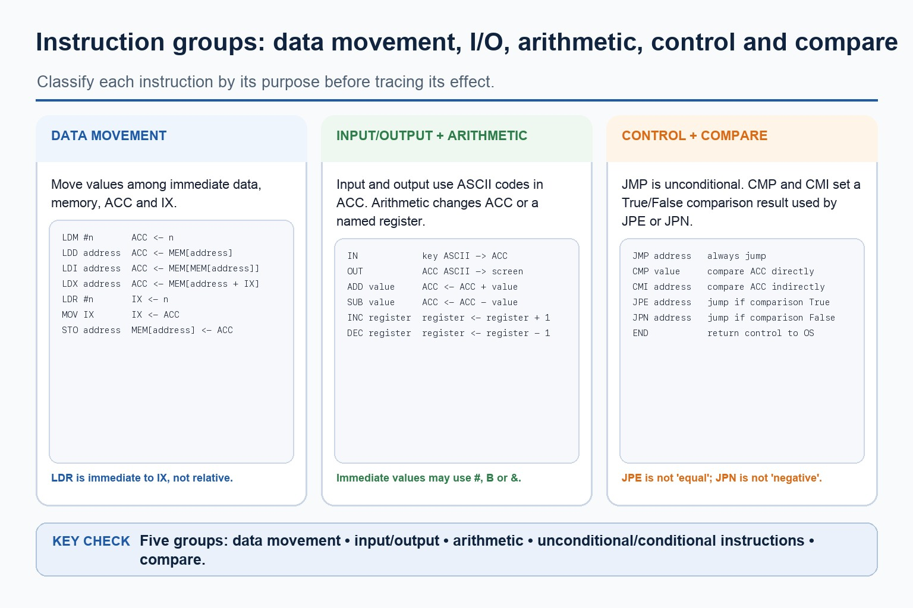
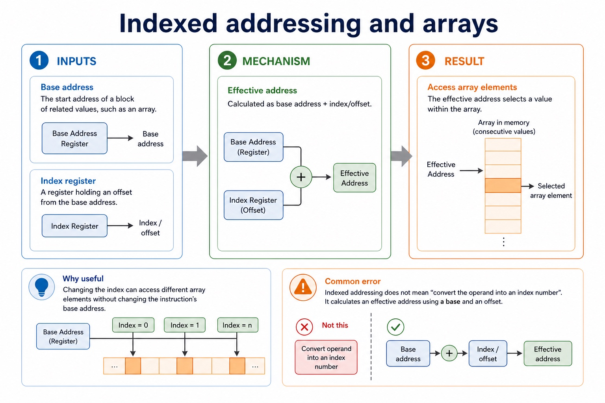

# Lesson 024: Tracing instructions and addressing modes

**Course:** Cambridge International AS Level Computer Science 9618, syllabus for examination in 2027-2029 
**Paper:** Paper 1 
**Syllabus:** Section 4: Processor fundamentals 
**Syllabus requirements:** S4.11, S4.12, S4.13, S4.14 
**Pacing:** Flexible. Select a quick, full or deep route for the learners in front of you.

## Teaching-depth menu

- **Quick route:** Use the diagnostic, learning objectives, first worked example and foundation question. Stop once the learner can explain the central distinction accurately.
- **Full route:** Teach every knowledge-point material set, the worked method and all lesson questions.
- **Deep route:** Add the prerequisite refresher, ask learners to connect the concept checklist, discuss the labelled extension and complete a transfer question without a model answer.

## 1. Prerequisite knowledge and quick diagnostic

Recall S4.09, S4.12, S4.13 before starting this lesson.

Ask the learner to give one accurate definition or method step before continuing. If they cannot, briefly revisit the named prerequisite rather than repeating the whole previous lesson.

### Optional prerequisite refresher

- Show the relationship between assembly language and machine code: assembly is a processor-specific symbolic low-level form translated by an assembler into binary instructions defined by the target instruction set.
- Distinguish assembly language and machine code.
- Group the specified instructions as data movement, input/output, arithmetic, unconditional branch, conditional branch and compare operations; classification must follow each instruction's official effect rather than an English guess from its mnemonic.
- Understand instruction groups: data movement, input/output, arithmetic, conditional/unconditional branch and compare.
- Use the complete specified instruction set with its specified operands and effects. In particular LDR n loads IX, CMI <address is indirect comparison, JPE follows a True comparison and JPN follows a False comparison.
- Use the specified instruction set: LDM, LDD, LDI, LDX, LDR, MOV, STO, ADD, SUB, INC, DEC, JMP, CMP, CMI, JPE, JPN, IN, OUT and END.

## 2. Knowledge explanation

### 1. Trace a simple assembly-language program (S4.11)

**Atomic learning targets**

- **S4.11.A01:** Trace
- **S4.11.A02:** assembly-language
- **S4.11.A03:** program

**Core explanation**

- To trace a simple assembly-language program, make a table with one row per executed instruction and columns for the current instruction/address, ACC, IX, relevant memory or output, and branch result. Update only the state changed by that instruction, then use the updated PC or branch target to choose the next row; do not trace source lines that a taken jump skips.
- To trace a simple assembly-language program, make a table with one row per executed instruction and columns for the current instruction/address, ACC, IX, relevant memory or output, and branch result.

**Mechanism or method**

1. **Identify the relevant condition or input** — To trace a simple assembly-language program, make a table with one row per executed instruction and columns for the current instruction/address, ACC, IX, relevant memory or output, and branch result.
2. **Trace how the process works** — Update only the state changed by that instruction, then use the updated PC or branch target to choose the next row;
3. **Connect the mechanism to its result** — do not trace source lines that a taken jump skips.

#### Worked example: Trace a simple assembly-language program: complete worked route

1. **Identify the relevant condition or input**

To trace a simple assembly-language program, make a table with one row per executed instruction and columns for the current instruction/address, ACC, IX, relevant memory or output, and branch result.

2. **Trace how the process works**

Update only the state changed by that instruction, then use the updated PC or branch target to choose the next row;

3. **Connect the mechanism to its result**

do not trace source lines that a taken jump skips.

4. **Complete example**

Compare five operand interpretations: With operand 20, immediate uses value 20; direct uses Memory[20]; indirect follows Memory[20] as another address; indexed uses address 20 + IX; relative uses PC plus a signed or stated offset. Separately, if CMI POINTER produces True, JPE MATCH branches to MATCH; a False comparison allows JPN DIFFERENT to branch.

**Misconceptions to correct**

- Students often memorise register names without roles. Correction: a register earns its name by what it temporarily holds.

#### Mastery check (MC-L024-S4.11)

Explain the following targets in one connected answer, using a concrete example for each: Trace; assembly-language; program.

Answer criteria

- To trace a simple assembly-language program, make a table with one row per executed instruction and columns for the current instruction/address, ACC, IX, relevant memory or output, and branch result. Update only the state changed by that instruction, then use the updated PC or branch target to choose the next row; do not trace source lines that a taken jump skips.
- To trace a simple assembly-language program, make a table with one row per executed instruction and columns for the current instruction/address, ACC, IX, relevant memory or output, and branch result.

**Supplementary concept map**

- **Instruction:** Execute in control-flow order
- **Trace table:** Record state after each step
- **Branch:** May change the next instruction
- **State:** Registers memory and output
- **assembly-language:** To trace a simple assembly-language program, make a…
- **Trace:** Trace a given simple assembly-language program by recording…

**Supplementary three-step recap**

1. **Translate the stated design** — To trace a simple assembly-language program, make a table with one row per executed instruction and columns for…
2. **Apply one complete operation** — Trace a given simple assembly-language program by recording each executed instruction, register/memory/output changes and taken or not-taken control…
3. **Trace state and boundaries** — Trace a simple assembly-language program.

**Concrete case: Instruction:** To trace a simple assembly-language program, make a table with one row per executed instruction and columns for the current instruction/address, ACC, IX, relevant memory or output, and branch result.

Precise syllabus wording

Trace a simple assembly-language program.

Trace a given simple assembly-language program by recording each executed instruction, register/memory/output changes and taken or not-taken control flow.

### 2. Instruction groups: data movement, input/output, arithmetic, conditional/unconditional branch and compare (S4.12)

**Atomic learning targets**

- **S4.12.A01:** data movement
- **S4.12.A02:** input/output / input and output
- **S4.12.A03:** arithmetic
- **S4.12.A04:** conditional branch
- **S4.12.A05:** unconditional branch
- **S4.12.A06:** compare

**Core explanation**

- Data movement: LDM n loads immediate n into ACC; LDD <address loads the directly addressed contents into ACC; LDI <address follows the address stored at <address; LDX <address loads from <address + IX; LDR n loads n into IX; MOV <register moves ACC to IX; STO <address stores ACC at the address.
- The five instruction groups are data movement (LDM, LDD, LDI, LDX, LDR, MOV, STO), input/output (IN, OUT), arithmetic (ADD, SUB, INC, DEC), unconditional branch and conditional branch. JMP is the unconditional branch instruction; CMP, CMI, JPE and JPN form the compare and conditional branch group. END returns control to the operating system.
- Control, comparison and I/O: JMP <address is unconditional. CMP <address or CMP n compares ACC directly or with an immediate value. CMI <address compares using indirect addressing. JPE jumps after a True comparison and JPN after a False comparison. IN inputs one ASCII character code to ACC; OUT outputs the character whose ASCII code is in ACC; END returns control to the operating system.
- The five groups are data movement, input/output, arithmetic, unconditional/conditional instructions and compare. Data movement uses LDM, LDD, LDI, LDX, LDR, MOV and STO; LDR n loads the immediate value n into IX.
- Arithmetic: ADD <address or ADD n/Bn/&n adds a memory value or immediate denary/binary/hexadecimal value to ACC; SUB has the corresponding forms; INC <register and DEC <register change ACC or IX by one.
- Group the specified instructions as data movement, input/output, arithmetic, unconditional branch, conditional branch and compare operations

**Mechanism or method**

1. **Identify the relevant condition or input** — Data movement: LDM n loads immediate n into ACC;
2. **Trace how the process works** — LDD <address loads the directly addressed contents into ACC;
3. **Connect the mechanism to its result** — LDI <address follows the address stored at <address;

#### Worked example: Instruction groups: data movement, input/output, arithmetic, conditional/unconditional branch and compare: complete worked route

1. **Identify the relevant condition or input**

Data movement: LDM n loads immediate n into ACC;

2. **Trace how the process works**

LDD <address loads the directly addressed contents into ACC;

3. **Connect the mechanism to its result**

LDI <address follows the address stored at <address;

4. **Complete example**

Compare five operand interpretations: With operand 20, immediate uses value 20;

**Misconceptions to correct**

- Students often memorise register names without roles. Correction: a register earns its name by what it temporarily holds.

#### Mastery check (MC-L024-S4.12)

Explain the following targets in one connected answer, using a concrete example for each: data movement; input/output / input and output; arithmetic; conditional branch; unconditional branch; compare.

Answer criteria

- Data movement: LDM n loads immediate n into ACC; LDD <address loads the directly addressed contents into ACC; LDI <address follows the address stored at <address; LDX <address loads from <address + IX; LDR n loads n into IX; MOV <register moves ACC to IX; STO <address stores ACC at the address.
- The five instruction groups are data movement (LDM, LDD, LDI, LDX, LDR, MOV, STO), input/output (IN, OUT), arithmetic (ADD, SUB, INC, DEC), unconditional branch and conditional branch. JMP is the unconditional branch instruction; CMP, CMI, JPE and JPN form the compare and conditional branch group. END returns control to the operating system.
- Control, comparison and I/O: JMP <address is unconditional. CMP <address or CMP n compares ACC directly or with an immediate value. CMI <address compares using indirect addressing. JPE jumps after a True comparison and JPN after a False comparison. IN inputs one ASCII character code to ACC; OUT outputs the character whose ASCII code is in ACC; END returns control to the operating system.
- The five groups are data movement, input/output, arithmetic, unconditional/conditional instructions and compare. Data movement uses LDM, LDD, LDI, LDX, LDR, MOV and STO; LDR n loads the immediate value n into IX.
- Arithmetic: ADD <address or ADD n/Bn/&n adds a memory value or immediate denary/binary/hexadecimal value to ACC; SUB has the corresponding forms; INC <register and DEC <register change ACC or IX by one.
- Group the specified instructions as data movement, input/output, arithmetic, unconditional branch, conditional branch and compare operations

**Supplementary concept map**

- **conditional branch:** The five instruction groups are data movement (LDM,…
- **unconditional branch:** Group the specified instructions as data movement, input/output,…
- **input:** The five groups are data movement, input/output, arithmetic,…
- **data movement:** Data movement, input/output, arithmetic, conditional/unconditional branch and compare.
- **arithmetic:** Arithmetic uses ADD, SUB, INC and DEC.
- **compare:** CMP, CMI, JPE and JPN form the compare…

**Supplementary three-step recap**

1. **Write values units and width** — The five instruction groups are data movement (LDM, LDD, LDI, LDX, LDR, MOV, STO), input/output (IN, OUT), arithmetic…
2. **Apply the required method** — Group the specified instructions as data movement, input/output, arithmetic, unconditional branch, conditional branch and compare operations
3. **Reverse or range-check the result** — The five groups are data movement, input/output, arithmetic, unconditional/conditional instructions and compare.

**Instruction groups: data movement, I/O, arithmetic, control and…:** The five groups are data movement, input/output, arithmetic, unconditional/conditional instructions and compare. Data movement uses LDM, LDD, LDI, LDX, LDR, MOV and STO; LDR n loads the immediate value n into IX.

#### Instruction groups: data movement, I/O, arithmetic, control and compare

Text transcript

- The five groups are data movement, input/output, arithmetic, unconditional/conditional instructions and compare.
- Data movement uses LDM, LDD, LDI, LDX, LDR, MOV and STO; LDR n loads the immediate value n into IX.
- Input/output uses IN and OUT; arithmetic uses ADD, SUB, INC and DEC.
- JMP is unconditional; CMP and CMI compare; JPE jumps after True and JPN jumps after False.
- END returns control to the operating system.

Precise syllabus wording

Understand instruction groups: data movement, input/output, arithmetic, conditional/unconditional branch and compare.

Group the specified instructions as data movement, input/output, arithmetic, unconditional branch, conditional branch and compare operations; classification must follow each instruction's official effect rather than an English guess from its mnemonic.

### 3. The specified instruction set: LDM, LDD, LDI, LDX, LDR, MOV, STO, ADD, SUB, INC, DEC, JMP,… (S4.13)

**Atomic learning targets**

- **S4.13.A01:** LDM
- **S4.13.A02:** LDD
- **S4.13.A03:** LDI
- **S4.13.A04:** LDX
- **S4.13.A05:** LDR #n
- **S4.13.A06:** MOV
- **S4.13.A07:** STO
- **S4.13.A08:** ADD
- **S4.13.A09:** SUB
- **S4.13.A10:** INC
- **S4.13.A11:** DEC
- **S4.13.A12:** JMP
- **S4.13.A13:** CMP
- **S4.13.A14:** CMI <address>
- **S4.13.A15:** JPE <address>
- **S4.13.A16:** JPN <address>
- **S4.13.A17:** IN
- **S4.13.A18:** OUT
- **S4.13.A19:** END

**Core explanation**

- Data movement: LDM #n loads immediate n into ACC; LDD address loads Memory[address]; LDI address follows the address stored in Memory[address]; LDX address loads Memory[address + IX]; LDR #n loads n into IX; MOV IX copies ACC to IX; STO address stores ACC in memory.
- Arithmetic: ADD and SUB change ACC using a directly addressed or immediate denary, binary or hexadecimal operand. INC register and DEC register increase or decrease ACC or IX by one.
- Control and comparison: JMP address always branches. CMP compares ACC with a direct or immediate operand; CMI address compares ACC with the value reached by indirect addressing. JPE <address> branches after a True comparison and JPN <address> branches after a False comparison.
- Input/output and termination: IN reads one character and places its ASCII code in ACC; OUT outputs the character represented by the ASCII code in ACC; END returns control to the operating system.
- Operands are part of the semantics. # marks an immediate value, B an immediate binary value and & an immediate hexadecimal value; an address can be absolute or a symbolic label.

**Mechanism or method**

1. **Identify opcode and addressing form** — Read the mnemonic and operand prefix together; do not guess an effect from the mnemonic letters alone.
2. **Update only the affected state** — Change ACC, IX, memory, comparison flag, input/output or control flow exactly as the instruction specifies.
3. **Choose the next executed instruction** — Record one row per executed instruction and follow a taken branch instead of tracing skipped source lines.

#### Worked example: Trace load, arithmetic, comparison and output

1. **Initial**

Memory[20]=4, Memory[21]=65, ACC=0 and IX=0.

2. **LDM #3**

Load immediate value 3 into ACC; ACC becomes 3.

3. **ADD 20**

Add Memory[20], which is 4; ACC becomes 7.

4. **CMP #7**

Compare ACC with immediate 7; the comparison result is True.

5. **JPE MATCH**

Because the comparison is True, branch to MATCH and skip any intervening instructions.

6. **LDD 21 / OUT**

Load ASCII code 65 into ACC and output character A.

7. **END**

Return control to the operating system.

**Misconceptions to correct**

- LDR #n loads IX, not ACC. CMI is indirect comparison. JPE follows True and JPN follows False.

#### Mastery check (MC-L024-S4.13)

Complete a fresh example that demonstrates every target: LDM; LDD; LDI; LDX; LDR #n; MOV; STO; ADD; SUB; INC; DEC; JMP; CMP; CMI <address>; JPE <address>; JPN <address>; IN; OUT; END. Show all intermediate steps and check the result.

Answer criteria

- Data movement: LDM #n loads immediate n into ACC; LDD address loads Memory[address]; LDI address follows the address stored in Memory[address]; LDX address loads Memory[address + IX]; LDR #n loads n into IX; MOV IX copies ACC to IX; STO address stores ACC in memory.
- Arithmetic: ADD and SUB change ACC using a directly addressed or immediate denary, binary or hexadecimal operand. INC register and DEC register increase or decrease ACC or IX by one.
- Control and comparison: JMP address always branches. CMP compares ACC with a direct or immediate operand; CMI address compares ACC with the value reached by indirect addressing. JPE <address> branches after a True comparison and JPN <address> branches after a False comparison.
- Input/output and termination: IN reads one character and places its ASCII code in ACC; OUT outputs the character represented by the ASCII code in ACC; END returns control to the operating system.
- Operands are part of the semantics. # marks an immediate value, B an immediate binary value and & an immediate hexadecimal value; an address can be absolute or a symbolic label.

**Supplementary concept map**

- **CMI <address>:** In particular LDR n loads IX, CMI <address…
- **JPE <address>:** JPE <address jumps when the preceding comparison result…
- **JPN <address>:** JPN <address jumps when the preceding comparison result…
- **ADD:** LDM, LDD, LDI, LDX, LDR, MOV, STO, ADD,…
- **LDM:** The five instruction groups are data movement (LDM,…
- **LDD:** LDD <address loads the directly addressed contents into…

**Supplementary three-step recap**

1. **Identify opcode and addressing form** — Read the mnemonic and operand prefix together; do not guess an effect from the mnemonic letters alone.
2. **Update only the affected state** — Change ACC, IX, memory, comparison flag, input/output or control flow exactly as the instruction specifies.
3. **Choose the next executed instruction** — Record one row per executed instruction and follow a taken branch instead of tracing skipped source lines.

**Official LDR, CMI, JPE and JPN semantics:** LDR n loads the immediate value n into the index register IX. CMI <address compares ACC with a value reached using indirect addressing.

#### Official LDR, CMI, JPE and JPN semantics

Text transcript

- LDR n loads the immediate value n into the index register IX.
- CMI <address compares ACC with a value reached using indirect addressing.
- JPE <address jumps when the preceding comparison result is True.
- JPN <address jumps when the preceding comparison result is False.
- Do not reinterpret these instructions as relative load, immediate compare, equal/zero branch or negative-status branch.

Precise syllabus wording

Use the specified instruction set: LDM, LDD, LDI, LDX, LDR, MOV, STO, ADD, SUB, INC, DEC, JMP, CMP, CMI, JPE, JPN, IN, OUT and END.

Use the complete specified instruction set with its specified operands and effects. In particular LDR #n loads IX, CMI <address> is indirect comparison, JPE follows a True comparison and JPN follows a False comparison.

### 4. Immediate, direct, indirect, indexed and relative addressing (S4.14)

**Atomic learning targets**

- **S4.14.A01:** immediate
- **S4.14.A02:** direct
- **S4.14.A03:** indirect
- **S4.14.A04:** indexed
- **S4.14.A05:** relative
- **S4.14.A06:** addressing

**Core explanation**

- Control, comparison and I/O: JMP <address is unconditional. CMP <address or CMP n compares ACC directly or with an immediate value. CMI <address compares using indirect addressing. JPE jumps after a True comparison and JPN after a False comparison. IN inputs one ASCII character code to ACC; OUT outputs the character whose ASCII code is in ACC; END returns control to the operating system.
- Use immediate, direct, indirect, indexed and relative addressing. Relative addressing forms an address from a PC-based instruction address plus an offset; LDR n remains immediate-to-IX, not relative.
- Data movement: LDM n loads immediate n into ACC; LDD <address loads the directly addressed contents into ACC; LDI <address follows the address stored at <address; LDX <address loads from <address + IX; LDR n loads n into IX; MOV <register moves ACC to IX; STO <address stores ACC at the address.
- ACC is the accumulator and IX is the index register. An address can be absolute or symbolic. Prefix gives immediate denary, B immediate binary and & immediate hexadecimal data. These prefixes and operand forms are part of the instruction semantics, not optional decoration.
- Arithmetic: ADD <address or ADD n/Bn/&n adds a memory value or immediate denary/binary/hexadecimal value to ACC; SUB has the corresponding forms; INC <register and DEC <register change ACC or IX by one.
- Use the complete specified instruction set with its specified operands and effects. In particular LDR n loads IX, CMI <address is indirect comparison, JPE follows a True comparison and JPN follows a False comparison.

**Mechanism or method**

1. **Identify the relevant condition or input** — Control, comparison and I/O: JMP <address is unconditional.
2. **Trace how the process works** — CMP <address or CMP n compares ACC directly or with an immediate value.
3. **Connect the mechanism to its result** — JPE jumps after a True comparison and JPN after a False comparison.

#### Worked example: Immediate, direct, indirect, indexed and relative addressing: complete worked route

1. **Identify the relevant condition or input**

Control, comparison and I/O: JMP <address is unconditional.

2. **Trace how the process works**

CMP <address or CMP n compares ACC directly or with an immediate value.

3. **Connect the mechanism to its result**

JPE jumps after a True comparison and JPN after a False comparison.

4. **Complete example**

Compare five operand interpretations: With operand 20, immediate uses value 20; relative uses PC plus a signed or stated offset.

**Misconceptions to correct**

- Students often memorise register names without roles. Correction: a register earns its name by what it temporarily holds.

#### Mastery check (MC-L024-S4.14)

Explain the following targets in one connected answer, using a concrete example for each: immediate; direct; indirect; indexed; relative; addressing.

Answer criteria

- Control, comparison and I/O: JMP <address is unconditional. CMP <address or CMP n compares ACC directly or with an immediate value. CMI <address compares using indirect addressing. JPE jumps after a True comparison and JPN after a False comparison. IN inputs one ASCII character code to ACC; OUT outputs the character whose ASCII code is in ACC; END returns control to the operating system.
- Use immediate, direct, indirect, indexed and relative addressing. Relative addressing forms an address from a PC-based instruction address plus an offset; LDR n remains immediate-to-IX, not relative.
- Data movement: LDM n loads immediate n into ACC; LDD <address loads the directly addressed contents into ACC; LDI <address follows the address stored at <address; LDX <address loads from <address + IX; LDR n loads n into IX; MOV <register moves ACC to IX; STO <address stores ACC at the address.
- ACC is the accumulator and IX is the index register. An address can be absolute or symbolic. Prefix gives immediate denary, B immediate binary and & immediate hexadecimal data. These prefixes and operand forms are part of the instruction semantics, not optional decoration.
- Arithmetic: ADD <address or ADD n/Bn/&n adds a memory value or immediate denary/binary/hexadecimal value to ACC; SUB has the corresponding forms; INC <register and DEC <register change ACC or IX by one.
- Use the complete specified instruction set with its specified operands and effects. In particular LDR n loads IX, CMI <address is indirect comparison, JPE follows a True comparison and JPN follows a False comparison.

**Supplementary concept map**

- **direct:** Immediate, direct, indirect, indexed and relative addressing.
- **indirect:** CMI <address compares using indirect addressing.
- **immediate:** LDR n remains immediate-to-IX, not relative.
- **indexed:** Indexed addressing does not mean "convert the operand…
- **relative:** Relative addressing forms an address from a PC-based…
- **addressing:** LDR #n remains immediate-to-IX, not relative.

**Supplementary three-step recap**

1. **Name the exact concept** — Immediate, direct, indirect, indexed and relative addressing.
2. **Explain how its parts connect** — CMI <address compares using indirect addressing.
3. **Use it in a concrete context** — Relative addressing forms an address from a PC-based instruction address plus an offset

**Indexed addressing and arrays:** Base address The start address of a block of related values, such as an array.

#### Indexed addressing and arrays

Text transcript

- Base address
- The start address of a block of related values, such as an array.
- Index register
- A register holding an offset from the base address.
- Effective address
- Calculated as base address + index/offset.
- Why useful
- Changing the index can access different array elements without changing the instruction's base address.
- Common error
- Indexed addressing does not mean "convert the operand into an index number". It calculates an effective address using a base and an offset.

Precise syllabus wording

Understand immediate, direct, indirect, indexed and relative addressing.

Use immediate, direct, indirect, indexed and relative addressing. Relative addressing forms an address from a PC-based instruction address plus an offset; LDR #n remains immediate-to-IX, not relative.

### Lesson technical reference

- Trace a given simple assembly-language program by recording each executed instruction, register/memory/output changes and taken or not-taken control flow.
- Group the specified instructions as data movement, input/output, arithmetic, unconditional branch, conditional branch and compare operations; classification must follow each instruction's official effect rather than an English guess from its mnemonic.
- Use the complete specified instruction set with its specified operands and effects. In particular LDR n loads IX, CMI <address is indirect comparison, JPE follows a True comparison and JPN follows a False comparison.
- Use immediate, direct, indirect, indexed and relative addressing. Relative addressing forms an address from a PC-based instruction address plus an offset; LDR n remains immediate-to-IX, not relative.
- The two-pass assembler stages are Pass 1 and Pass 2. Pass 1 scans source, assigns addresses and builds a symbol table for labels, allowing forward references. Pass 2 translates mnemonics/operands using the completed table and produces machine code; invalid mnemonics or unresolved symbols are reported.
- The source form <label: <opcode <operand labels an instruction, while <label: <data assigns a symbolic address to a memory location containing data. Pass 1 records both kinds of label in the symbol table.
- The five instruction groups are data movement (LDM, LDD, LDI, LDX, LDR, MOV, STO), input/output (IN, OUT), arithmetic (ADD, SUB, INC, DEC), unconditional branch and conditional branch. JMP is the unconditional branch instruction; CMP, CMI, JPE and JPN form the compare and conditional branch group. END returns control to the operating system.
- Data movement: LDM n loads immediate n into ACC; LDD <address loads the directly addressed contents into ACC; LDI <address follows the address stored at <address; LDX <address loads from <address + IX; LDR n loads n into IX; MOV <register moves ACC to IX; STO <address stores ACC at the address.
- Arithmetic: ADD <address or ADD n/Bn/&n adds a memory value or immediate denary/binary/hexadecimal value to ACC; SUB has the corresponding forms; INC <register and DEC <register change ACC or IX by one.
- Control, comparison and I/O: JMP <address is unconditional. CMP <address or CMP n compares ACC directly or with an immediate value. CMI <address compares using indirect addressing. JPE jumps after a True comparison and JPN after a False comparison. IN inputs one ASCII character code to ACC; OUT outputs the character whose ASCII code is in ACC; END returns control to the operating system.
- ACC is the accumulator and IX is the index register. An address can be absolute or symbolic. Prefix gives immediate denary, B immediate binary and & immediate hexadecimal data. These prefixes and operand forms are part of the instruction semantics, not optional decoration.
- To trace a simple assembly-language program, make a table with one row per executed instruction and columns for the current instruction/address, ACC, IX, relevant memory or output, and branch result. Update only the state changed by that instruction, then use the updated PC or branch target to choose the next row; do not trace source lines that a taken jump skips.

Beyond syllabus / 延伸知识（不要求背诵）: modern processors add pipelining and several cache levels, but exam answers should begin with the syllabus processor model.
## 3. Practice by question type

### Question 1 - foundation - trace - 6 marks

Trace the supplied program and classify the instructions, showing each change to ACC, IX, memory, output and control flow.

**Answer:** uses one row per executed instruction in the correct control-flow order; updates ACC and IX correctly for data movement/arithmetic; updates memory or output correctly for STO/OUT; records compare result before evaluating JPE or JPN; follows the correct taken/not-taken branch and skips non-executed lines; classifies used instructions in the official data movement, input/output, arithmetic, unconditional/conditional and compare groups

**Marking guidance:** Do not accept relative LDR, immediate CMI, equality/zero JPE, negative JPN, or a trace that executes a line skipped by a taken branch.

**Common error:** For the command word trace, perform that exact action; do not replace it with an unrelated fact.

### Question 2 - application - compare - 6 marks

Compare immediate, direct, indirect, indexed and relative addressing, then state the effects of LDR n, CMI <address, JPE <address and JPN <address.

**Answer:** immediate uses operand as value; direct uses operand as address; indirect follows an address stored at the operand address; indexed adds IX to the address operand; relative adds an offset to the PC/current or next instruction address; LDR loads immediate n to IX and CMI compares through indirect addressing; JPE follows True and JPN follows False

**Marking guidance:** Do not award relative LDR, immediate CMI, equal/zero JPE or negative-status JPN.

**Common error:** Do not repeat the same point in different words; each mark needs a separate idea or method step.

### Question 3 - transfer - state - 19 marks

State the exact effect of each instruction: LDM #n, LDD address, LDI address, LDX address, LDR #n, MOV IX, STO address, ADD, SUB, INC, DEC, JMP, CMP, CMI, JPE, JPN, IN, OUT and END.

**Answer:** LDM loads immediate n to ACC; LDD loads directly addressed memory to ACC; LDI loads through an address stored in memory; LDX loads address+IX; LDR loads immediate n to IX; MOV IX copies ACC to IX; STO stores ACC; ADD/SUB change ACC by the operand; INC/DEC change ACC or IX by one; JMP always branches; CMP compares ACC directly or with immediate data; CMI compares indirectly; JPE branches after True; JPN branches after False; IN places an input character ASCII code in ACC; OUT outputs the character represented by ACC; END returns control to the operating system

**Marking guidance:** Award one mark per correct effect; operand and target register are part of the effect.

**Common error:** Do not infer effects from mnemonic letters: LDR targets IX and CMI is indirect.

### Related past-paper indexes

| Reference | Marks | Command word | Question type |
|---|---:|---|---|
| 9618/11/S/25 Q8(a) | 4 | compare | trace |
| 9618/12/W/25 Q3(c) | 4 | explain | explain |
| 9618/13/S/25 Q5(ii) | 4 | complete | recall |
| 9618/12/S/25 Q7(i) | 3 | compare | trace |

These are indexes only. Cambridge question and mark-scheme wording is not reproduced.

## 4. Summary and exam reminders

### Summary

- S4.11: explain Trace, assembly-language, program.
- S4.11 method: Identify the relevant condition or input → Trace how the process works → Connect the mechanism to its result.
- S4.12: explain data movement, input/output / input and output, arithmetic, conditional branch, unconditional branch, compare.
- S4.12 method: Identify the relevant condition or input → Trace how the process works → Connect the mechanism to its result.
- S4.13: explain LDM, LDD, LDI, LDX, LDR #n, MOV, STO, ADD, SUB, INC, DEC, JMP, CMP, CMI <address>, JPE <address>, JPN <address>, IN, OUT, END.

### Common error to correct

Students often memorise register names without roles. Correction: a register earns its name by what it temporarily holds.

### Exam technique

- Follow the command word: state gives a fact; explain links a cause to a consequence; compare covers both sides.
- Match the number of independent points or method steps to the available marks.
- For tracing instructions and addressing modes, use the exact technical term before applying it to the scenario.
