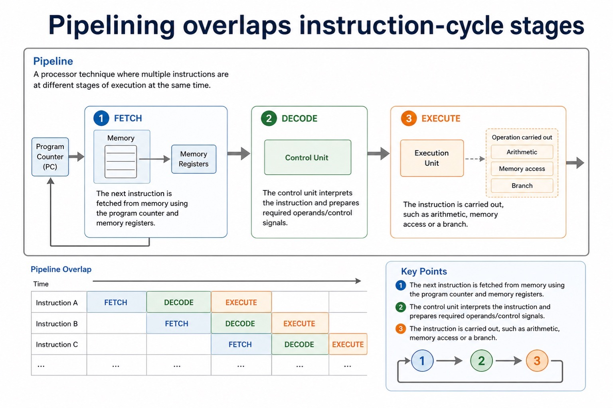
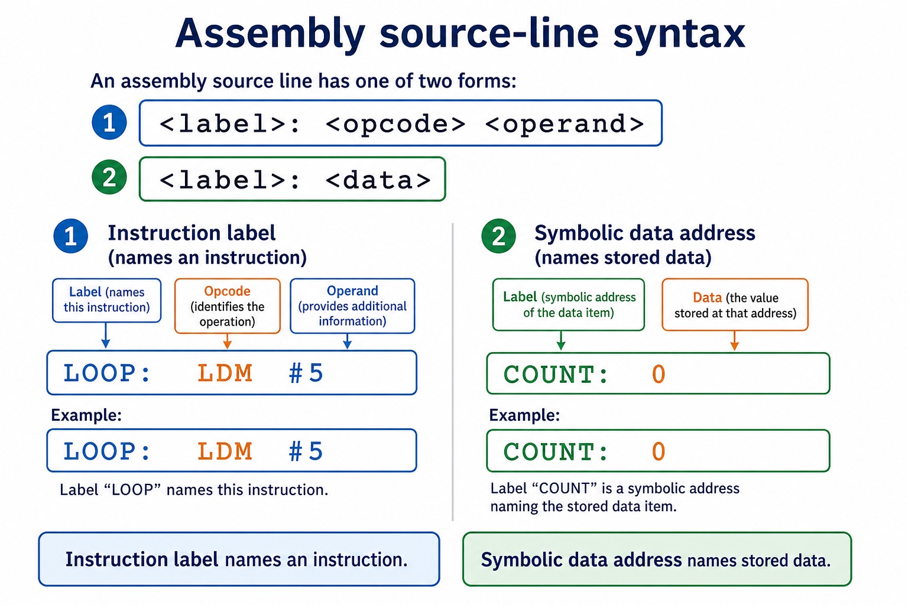
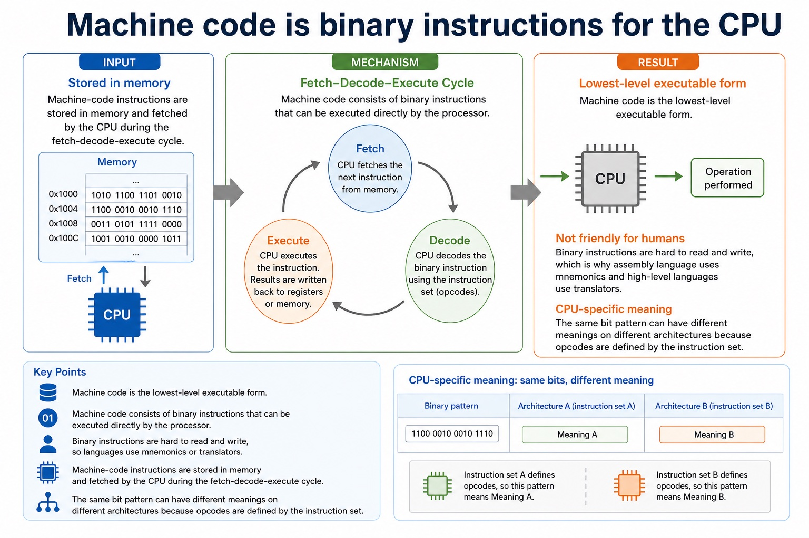
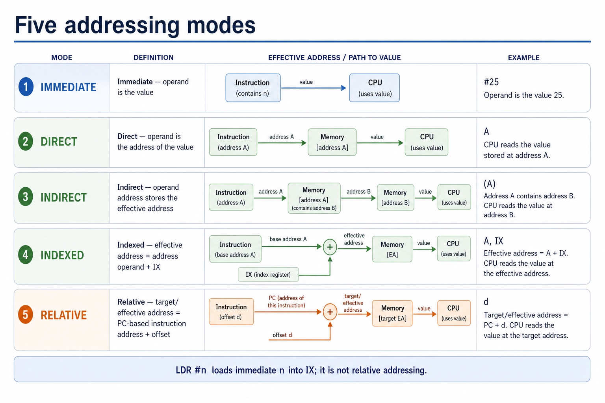
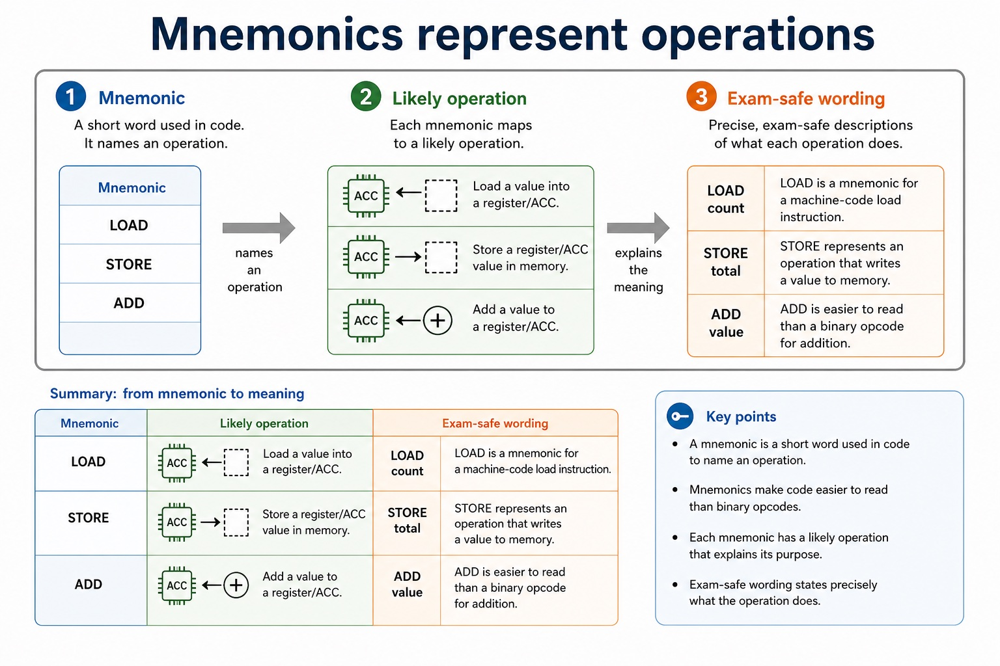
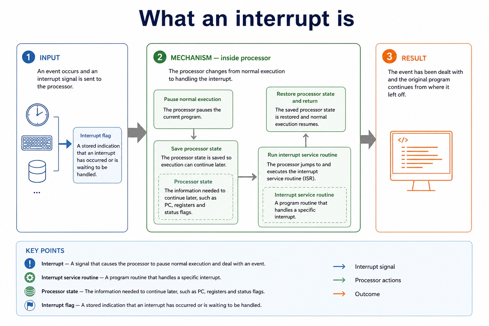
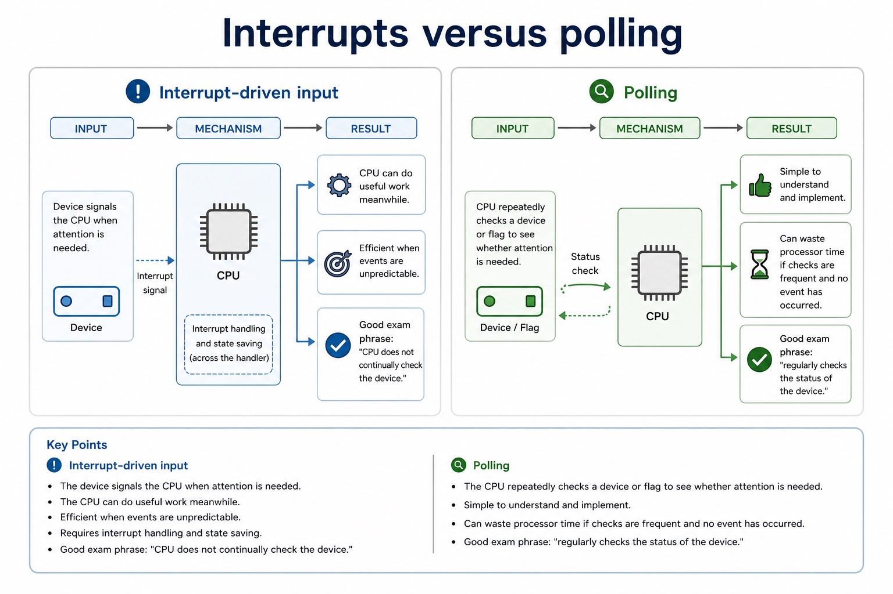
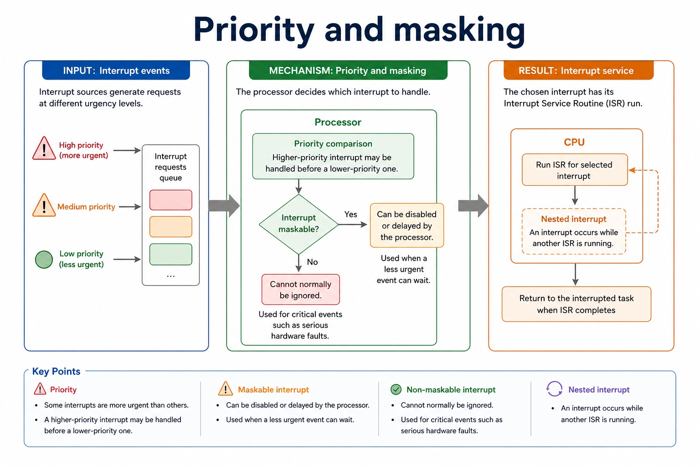
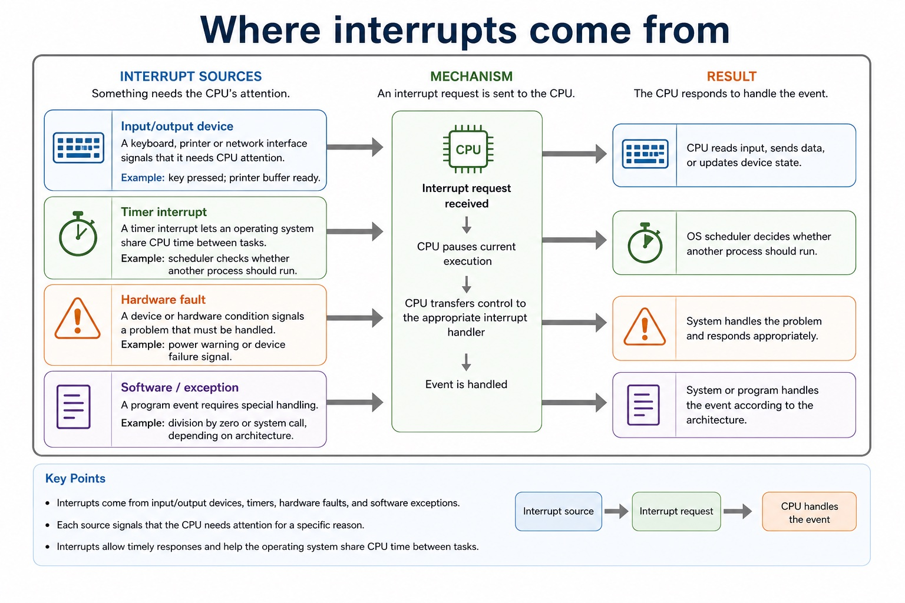

# Lesson 024: Tracing instructions and addressing modes

**Course:** Cambridge International AS Level Computer Science 9618, 2027-2029 Version 2 
**Paper:** Paper 1 
**Syllabus:** Section 4: Processor fundamentals 
**Syllabus requirements:** S4.11, S4.12, S4.13, S4.14 
**Pacing:** Flexible. Select the material set and practice depth needed by the learner.

## Teaching-depth menu

- **Quick route:** Use the diagnostic, learning objectives, first worked example and foundation question. Stop once the learner can explain the central distinction accurately.
- **Full route:** Use every knowledge-point material set, the worked method, the terminology check and all questions.
- **Deep route:** Add the prerequisite refresher, ask learners to connect the concept checklist, discuss the labelled extension and complete a transfer question without a model answer.

## 1. Prerequisite knowledge and quick diagnostic

Recall S4.09, S4.12, S4.13 before starting this lesson.

Ask the learner to give one accurate definition or method step before continuing. If they cannot, briefly revisit the named prerequisite rather than repeating the whole previous lesson.

### Optional prerequisite refresher

- Show the relationship between assembly language and machine code: assembly is a processor-specific symbolic low-level form translated by an assembler into binary instructions defined by the target instruction set.
- Distinguish assembly language and machine code.
- Group the specified instructions as data movement, input/output, arithmetic, unconditional branch, conditional branch and compare operations; classification must follow each instruction's official effect rather than an English guess from its mnemonic.
- Understand instruction groups: data movement, input/output, arithmetic, conditional/unconditional branch and compare.
- Use the complete Version 2 instruction set with its specified operands and effects. In particular LDR n loads IX, CMI <address is indirect comparison, JPE follows a True comparison and JPN follows a False comparison.
- Use the specified instruction set: LDM, LDD, LDI, LDX, LDR, MOV, STO, ADD, SUB, INC, DEC, JMP, CMP, CMI, JPE, JPN, IN, OUT and END.

## 2. Knowledge explanation

### 1. Trace · Assembly-language · Program (S4.11)

**Concept map:** Trace → assembly-language → program

**Three-part explanation:**

1. Trace a given simple assembly-language program by recording each executed instruction, register/memory/output changes and taken or not-taken control flow
2. To trace a simple assembly-language program, make a table with one row per executed instruction and columns for the current instruction/address, ACC, IX, relevant memory or…
3. do not trace source lines that a taken jump skips

**Concrete cue:** Trace a given simple assembly-language program by recording each executed instruction, register/memory/output changes and taken or not-taken control flow.

#### What assembly language is

Text transcript

- Low-level language
- Assembly language is close to machine code and closely linked to a processor's instruction set.
- Uses mnemonics
- Human-readable abbreviations represent machine-code operations.
- Processor-specific
- Assembly syntax and available instructions depend on the target architecture.
- Needs translation
- An assembler converts assembly language into machine code.

#### Pipelining overlaps instruction-cycle stages

Text transcript

- Pipeline
- A processor technique where multiple instructions are at different stages of execution at the same time.
- The next instruction is fetched from memory using the program counter and memory registers.
- The control unit interprets the instruction and prepares required operands/control signals.
- The instruction is carried out, such as arithmetic, memory access or a branch.

#### Trace one instruction through the fetch stage

Text transcript

- Copy the next-instruction address from PC to MAR and read the instruction from memory into MDR.
- Move the fetched instruction from MDR to CIR.
- Increment PC independently so that PC points to the next instruction.
- PC does not feed CIR; only the instruction held in MDR is transferred to CIR.

Precise syllabus wording

Trace a simple assembly-language program.

Trace a given simple assembly-language program by recording each executed instruction, register/memory/output changes and taken or not-taken control flow.

### 2. Data movement · Input/output · Arithmetic · Conditional branch (S4.12)

**Concept map:** data movement → input/output → arithmetic → conditional branch → unconditional branch → compare

**Three-part explanation:**

1. Group the specified instructions as data movement, input/output, arithmetic, unconditional branch, conditional branch and compare operations
2. classification must follow each instruction's official effect rather than an English guess from its mnemonic
3. The five instruction groups are data movement (LDM, LDD, LDI, LDX, LDR, MOV, STO), input/output (IN, OUT), arithmetic (ADD, SUB, INC, DEC), unconditional branch and conditional…

**Concrete cue:** Group the specified instructions as data movement, input/output, arithmetic, unconditional branch, conditional branch and compare operations; classification must follow each instruction's official effect rather than an English guess from its…

#### Instruction groups: data movement, I/O, arithmetic, control and compare

Text transcript

- The five groups are data movement, input/output, arithmetic, unconditional/conditional instructions and compare.
- Data movement uses LDM, LDD, LDI, LDX, LDR, MOV and STO; LDR n loads the immediate value n into IX.
- Input/output uses IN and OUT; arithmetic uses ADD, SUB, INC and DEC.
- JMP is unconditional; CMP and CMI compare; JPE jumps after True and JPN jumps after False.
- END returns control to the operating system.

#### What is an instruction set?

Text transcript

- Definition
- The set of instructions that a particular processor can recognise and execute.
- Includes operations
- Examples include load, store, add, subtract, compare, jump and input/output instructions.
- Processor-specific
- Different processor families can have different instruction sets and instruction formats.
- Defines meaning
- The instruction set tells the CPU what each opcode means and how operands are interpreted.

#### Binary shifts: logical, arithmetic, cyclic

Text transcript

- Every shown input and stored result contains exactly eight bits.
- Logical shifts insert zero; logical left 10110011 becomes 01100110 and logical right becomes 01011001.
- Arithmetic left 10110011 becomes 01100110; arithmetic right copies sign bit 1 and becomes 11011001.
- Cyclic left rotates the outgoing bit to give 01100111; cyclic right gives 11011001.
- Unsigned logical-left overflow and signed arithmetic-left overflow both occur here; rotations do not use an overflow label.

#### Decode and execute are not filler words

Text transcript

- The control unit interprets the instruction in the CIR. It identifies the opcode, decides what operation is required, and identifies any operands or addresses needed.
- Execute: arithmetic or logic
- If the instruction is arithmetic or logical, the ALU performs the operation and a result may be stored in a register.
- Execute: memory access
- If the instruction needs data from memory, the CPU uses buses and registers to read from or write to the required memory address.
- Execute: branch
- If the instruction is a branch/jump, the PC may be changed to a different address rather than just continuing with the next instruction.
- Common error

Precise syllabus wording

Understand instruction groups: data movement, input/output, arithmetic, conditional/unconditional branch and compare.

Group the specified instructions as data movement, input/output, arithmetic, unconditional branch, conditional branch and compare operations; classification must follow each instruction's official effect rather than an English guess from its mnemonic.

### 3. LDM · LDD · LDI · LDX (S4.13)

**Concept map:** LDM → LDD → LDI → LDX → LDR #n → MOV → STO → ADD → SUB → INC → DEC → JMP → CMP → CMI <address> → JPE <address> → JPN <address> → IN → OUT → END

**Three-part explanation:**

1. In particular LDR n loads IX, CMI <address is indirect comparison, JPE follows a True comparison and JPN follows a False comparison
2. The five instruction groups are data movement (LDM, LDD, LDI, LDX, LDR, MOV, STO), input/output (IN, OUT), arithmetic (ADD, SUB, INC, DEC), unconditional branch and conditional…
3. Use the complete Version 2 instruction set with its specified operands and effects

**Concrete cue:** Use the complete Version 2 instruction set with its specified operands and effects. In particular LDR n loads IX, CMI <address is indirect comparison, JPE follows a True comparison and…

#### Instruction groups: data movement, I/O, arithmetic, control and compare

Text transcript

- The five groups are data movement, input/output, arithmetic, unconditional/conditional instructions and compare.
- Data movement uses LDM, LDD, LDI, LDX, LDR, MOV and STO; LDR n loads the immediate value n into IX.
- Input/output uses IN and OUT; arithmetic uses ADD, SUB, INC and DEC.
- JMP is unconditional; CMP and CMI compare; JPE jumps after True and JPN jumps after False.
- END returns control to the operating system.

#### Official LDR, CMI, JPE and JPN semantics

Text transcript

- LDR n loads the immediate value n into the index register IX.
- CMI <address compares ACC with a value reached using indirect addressing.
- JPE <address jumps when the preceding comparison result is True.
- JPN <address jumps when the preceding comparison result is False.
- Do not reinterpret these instructions as relative load, immediate compare, equal/zero branch or negative-status branch.

#### Instruction labels and symbolic data addresses

Text transcript

- <label: <opcode <operand gives a symbolic address to an instruction.
- <label: <data gives a symbolic address to a memory location containing data.
- Pass 1 records both instruction and data labels in the symbol table.
- Pass 2 replaces a label reference with its resolved address while translating.

#### Machine code is binary instructions for the CPU

Text transcript

- Lowest-level executable form
- Machine code consists of binary instructions that can be executed directly by the processor.
- Not friendly for humans
- Binary instructions are difficult for people to read and write accurately, but they are the form the processor executes directly.
- Stored in memory
- Machine-code instructions are stored in memory and fetched by the CPU during the fetch-decode-execute cycle.
- CPU-specific meaning
- The same bit pattern can have different meanings on different architectures because opcodes are defined by the instruction set.

#### What is an instruction set?

Text transcript

- Definition
- The set of instructions that a particular processor can recognise and execute.
- Includes operations
- Examples include load, store, add, subtract, compare, jump and input/output instructions.
- Processor-specific
- Different processor families can have different instruction sets and instruction formats.
- Defines meaning
- The instruction set tells the CPU what each opcode means and how operands are interpreted.

#### ACC and status register: execute-stage evidence

Text transcript

- Accumulator (ACC)
- The accumulator commonly holds intermediate results from the ALU. For example, after adding two values, the result may be stored in the ACC.
- Status register
- The status register holds flags that describe the outcome of an operation or the processor state.
- Zero flag
- Can be set when an operation result is zero. Useful after comparisons or subtraction.
- Carry / overflow flags
- Can indicate a carry out or arithmetic overflow. Exact flag names vary by architecture, but the exam idea is that flags record result conditions.

Precise syllabus wording

Use the specified instruction set: LDM, LDD, LDI, LDX, LDR, MOV, STO, ADD, SUB, INC, DEC, JMP, CMP, CMI, JPE, JPN, IN, OUT and END.

Use the complete Version 2 instruction set with its specified operands and effects. In particular LDR #n loads IX, CMI <address> is indirect comparison, JPE follows a True comparison and JPN follows a False comparison.

### 4. Immediate · Direct · Indirect · Indexed (S4.14)

**Concept map:** immediate → direct → indirect → indexed → relative → addressing

**Three-part explanation:**

1. Use immediate, direct, indirect, indexed and relative addressing
2. Relative addressing forms an address from a PC-based instruction address plus an offset
3. LDR n remains immediate-to-IX, not relative

**Concrete cue:** Use immediate, direct, indirect, indexed and relative addressing. Relative addressing forms an address from a PC-based instruction address plus an offset; LDR n remains immediate-to-IX, not relative.

#### Five addressing modes

Text transcript

- Immediate addressing uses the operand field as the value itself.
- Direct addressing uses the operand field as the address of the value.
- Indirect addressing follows an address stored at the operand address to reach the value.
- Indexed addressing adds an index value to a base address to form the effective address.
- Relative addressing adds an offset to a PC-based instruction address to form the target or effective address.
- LDR n loads the immediate value n into IX; it is not relative addressing.

#### Official LDR, CMI, JPE and JPN semantics

Text transcript

- LDR n loads the immediate value n into the index register IX.
- CMI <address compares ACC with a value reached using indirect addressing.
- JPE <address jumps when the preceding comparison result is True.
- JPN <address jumps when the preceding comparison result is False.
- Do not reinterpret these instructions as relative load, immediate compare, equal/zero branch or negative-status branch.

#### Indexed addressing and arrays

Text transcript

- Base address
- The start address of a block of related values, such as an array.
- Index register
- A register holding an offset from the base address.
- Effective address
- Calculated as base address + index/offset.
- Why useful
- Changing the index can access different array elements without changing the instruction's base address.

#### The seven named register roles

Text transcript

- PC holds the address of the next instruction to be fetched.
- CIR holds the instruction currently being decoded or executed.
- MAR holds the address of the memory location being accessed.
- MDR holds data or an instruction being transferred to or from memory.
- ACC holds an intermediate or final ALU result.
- IX holds an offset used in indexed addressing.
- The status register holds flags about a result or processor state.
- A general-purpose register can hold varied working values; a special-purpose register has a defined processor role.

Precise syllabus wording

Understand immediate, direct, indirect, indexed and relative addressing.

Use immediate, direct, indirect, indexed and relative addressing. Relative addressing forms an address from a PC-based instruction address plus an offset; LDR #n remains immediate-to-IX, not relative.

### Supporting diagram library

#### Mnemonics represent operations

Text transcript

- Mnemonic
- Likely operation
- Exam-safe wording
- Load a value into a register/ACC.
- LOAD count
- LOAD is a mnemonic for a machine-code load instruction.
- Store a register/ACC value in memory.
- STORE total

#### Addressing mode means operand interpretation

Text transcript

- The part of an instruction that supplies data, an address, a register or another reference.
- Addressing mode
- The rule used to interpret the operand and locate the data needed by the instruction.
- Effective address
- The actual memory address used after applying the addressing mode.
- Fetched value
- The final data value obtained or used by the instruction after interpretation.

#### What an interrupt is

Text transcript

- Interrupt
- A signal that causes the processor to pause normal execution and deal with an event.
- Interrupt service routine
- A program routine that handles a specific interrupt.
- Processor state
- The information needed to continue later, such as PC, registers and status flags.
- Interrupt flag
- A stored indication that an interrupt has occurred or is waiting to be handled.

#### The interrupt handling cycle

Text transcript

- 1. Execute instruction The CPU finishes the current instruction before accepting most maskable interrupts.
- 2. Check interrupt The control unit checks whether an interrupt is pending and enabled.
- 3. Save state Important registers, PC and status information are stored, often on a stack.
- 4. Find ISR The interrupt type is used to locate the correct interrupt service routine.
- 5. Run ISR The routine handles the event, such as reading a key or acknowledging a device.
- 6. Restore and return The saved state is restored and the interrupted program continues.
- Why this matters
- Saving state is the "bookmark". Without it, the CPU may not know where or how to resume the interrupted program.

#### Interrupts versus polling

Text transcript

- Interrupt-driven input
- The device signals the CPU when attention is needed. The CPU can do useful work meanwhile.
- Efficient when events are unpredictable.
- Requires interrupt handling and state saving.
- Good exam phrase: "CPU does not continually check the device."
- The CPU repeatedly checks a device or flag to see whether attention is needed.
- Simple to understand and implement.
- Can waste processor time if checks are frequent and no event has occurred.

#### Priority and masking

Text transcript

- Exam-safe wording
- Priority
- Some interrupts are more urgent than others.
- A higher-priority interrupt may be handled before a lower-priority one.
- Maskable interrupt
- Can be disabled or delayed by the processor.
- Used when a less urgent event can wait.
- Non-maskable interrupt

#### Where interrupts come from

Text transcript

- Input/output device
- A keyboard, printer or network interface signals that it needs CPU attention.
- Example: key pressed; printer buffer ready.
- A timer interrupt lets an operating system share CPU time between tasks.
- Example: scheduler checks whether another process should run.
- Hardware fault
- A device or hardware condition signals a problem that must be handled.
- Example: power warning or device failure signal.

Open precise terminology and exam facts

- Trace a given simple assembly-language program by recording each executed instruction, register/memory/output changes and taken or not-taken control flow.
- Group the specified instructions as data movement, input/output, arithmetic, unconditional branch, conditional branch and compare operations; classification must follow each instruction's official effect rather than an English guess from its mnemonic.
- Use the complete Version 2 instruction set with its specified operands and effects. In particular LDR n loads IX, CMI <address is indirect comparison, JPE follows a True comparison and JPN follows a False comparison.
- Use immediate, direct, indirect, indexed and relative addressing. Relative addressing forms an address from a PC-based instruction address plus an offset; LDR n remains immediate-to-IX, not relative.
- The two-pass assembler stages are Pass 1 and Pass 2. Pass 1 scans source, assigns addresses and builds a symbol table for labels, allowing forward references. Pass 2 translates mnemonics/operands using the completed table and produces machine code; invalid mnemonics or unresolved symbols are reported.
- The source form <label: <opcode <operand labels an instruction, while <label: <data assigns a symbolic address to a memory location containing data. Pass 1 records both kinds of label in the symbol table.
- The five instruction groups are data movement (LDM, LDD, LDI, LDX, LDR, MOV, STO), input/output (IN, OUT), arithmetic (ADD, SUB, INC, DEC), unconditional branch and conditional branch. JMP is the unconditional branch instruction; CMP, CMI, JPE and JPN form the compare and conditional branch group. END returns control to the operating system.
- Data movement: LDM n loads immediate n into ACC; LDD <address loads the directly addressed contents into ACC; LDI <address follows the address stored at <address; LDX <address loads from <address + IX; LDR n loads n into IX; MOV <register moves ACC to IX; STO <address stores ACC at the address.
- Arithmetic: ADD <address or ADD n/Bn/&n adds a memory value or immediate denary/binary/hexadecimal value to ACC; SUB has the corresponding forms; INC <register and DEC <register change ACC or IX by one.
- Control, comparison and I/O: JMP <address is unconditional. CMP <address or CMP n compares ACC directly or with an immediate value. CMI <address compares using indirect addressing. JPE jumps after a True comparison and JPN after a False comparison. IN inputs one ASCII character code to ACC; OUT outputs the character whose ASCII code is in ACC; END returns control to the operating system.
- ACC is the accumulator and IX is the index register. An address can be absolute or symbolic. Prefix gives immediate denary, B immediate binary and & immediate hexadecimal data. These prefixes and operand forms are part of the instruction semantics, not optional decoration.
- To trace a simple assembly-language program, make a table with one row per executed instruction and columns for the current instruction/address, ACC, IX, relevant memory or output, and branch result. Update only the state changed by that instruction, then use the updated PC or branch target to choose the next row; do not trace source lines that a taken jump skips.

### Worked example

1. Compare five operand interpretations
2. With operand 20, immediate uses value 20; direct uses Memory[20]; indirect follows Memory[20] as another address; indexed uses address 20 + IX; relative uses PC plus a signed or stated offset.
3. Separately, if CMI POINTER produces True, JPE MATCH branches to MATCH; a False comparison allows JPN DIFFERENT to branch.

Beyond syllabus / 延伸知识（不要求背诵）: modern processors add pipelining and several cache levels, but exam answers should begin with the syllabus processor model.
## 3. Practice by question type

### Question 1 - foundation - trace - 6 marks

Trace the supplied program and classify the instructions, showing each change to ACC, IX, memory, output and control flow.

**Answer:** uses one row per executed instruction in the correct control-flow order; updates ACC and IX correctly for data movement/arithmetic; updates memory or output correctly for STO/OUT; records compare result before evaluating JPE or JPN; follows the correct taken/not-taken branch and skips non-executed lines; classifies used instructions in the official data movement, input/output, arithmetic, unconditional/conditional and compare groups

**Marking guidance:** Do not accept relative LDR, immediate CMI, equality/zero JPE, negative JPN, or a trace that executes a line skipped by a taken branch.

**Common error:** For the command word trace, perform that exact action; do not replace it with an unrelated fact.

### Question 2 - application - compare - 6 marks

Compare immediate, direct, indirect, indexed and relative addressing, then state the effects of LDR n, CMI <address, JPE <address and JPN <address.

**Answer:** immediate uses operand as value; direct uses operand as address; indirect follows an address stored at the operand address; indexed adds IX to the address operand; relative adds an offset to the PC/current or next instruction address; LDR loads immediate n to IX and CMI compares through indirect addressing; JPE follows True and JPN follows False

**Marking guidance:** Do not award relative LDR, immediate CMI, equal/zero JPE or negative-status JPN.

**Common error:** Do not repeat the same point in different words; each mark needs a separate idea or method step.

### Question 3 - transfer - state - 5 marks

State the exact effects of LDR n, CMI <address, JPE <address and JPN <address.

**Answer:** LDR loads immediate n into IX; CMI obtains the comparison value by indirect addressing; CMI compares that value with ACC; JPE branches after a True comparison; JPN branches after a False comparison

**Marking guidance:** Do not infer an instruction effect from the mnemonic letters; use the specified instruction-set semantics.

**Common error:** Do not copy the worked example unchanged; transfer the method and check it against the new context.

### Related past-paper indexes

| Reference | Marks | Command word | Question type |
|---|---:|---|---|
| 9618/11/S/25 Q8(a) | 4 | compare | trace |
| 9618/12/W/25 Q3(c) | 4 | explain | explain |
| 9618/13/S/25 Q5(ii) | 4 | complete | recall |
| 9618/12/S/25 Q7(i) | 3 | compare | trace |

These are indexes only. Cambridge question and mark-scheme wording is not reproduced.

## 4. Summary and exam reminders

### Summary

- Define tracing instructions and addressing modes with the exact technical vocabulary expected by the syllabus.
- Use the lesson method on a fresh context and show the intermediate decision, representation or calculation.
- Match the shape of the answer to the command word and the available marks.
- Check the final answer against the scenario instead of repeating a memorised sentence.

### Common error to correct

Students often memorise register names without roles. Correction: a register earns its name by what it temporarily holds.

### Exam technique

- Follow the command word: state gives a fact; explain links a cause to a consequence; compare covers both sides.
- Match the number of independent points or method steps to the available marks.
- For tracing instructions and addressing modes, use the exact technical term before applying it to the scenario.
