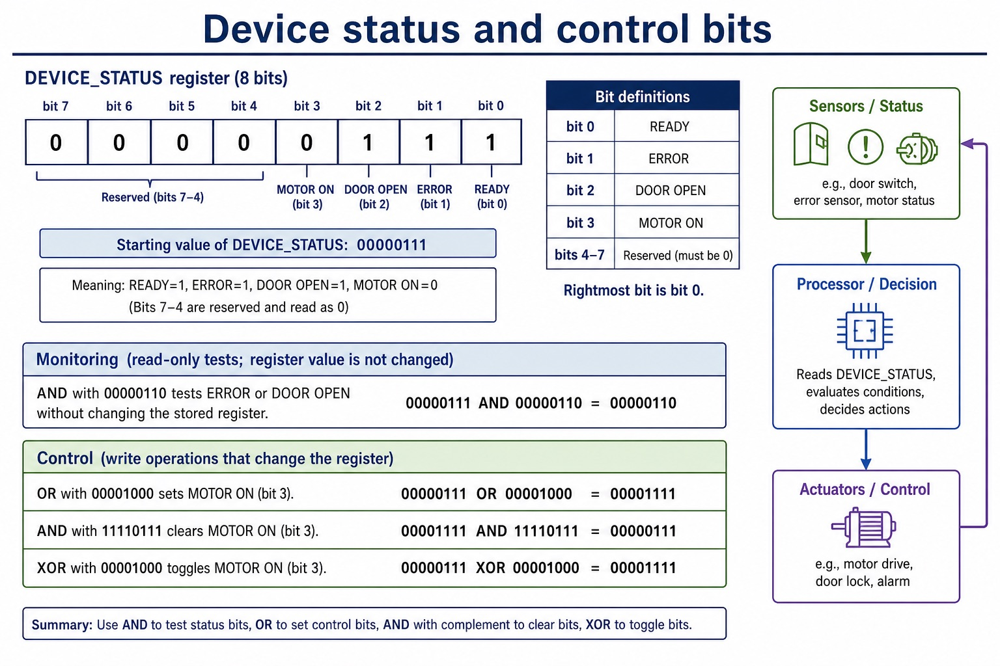
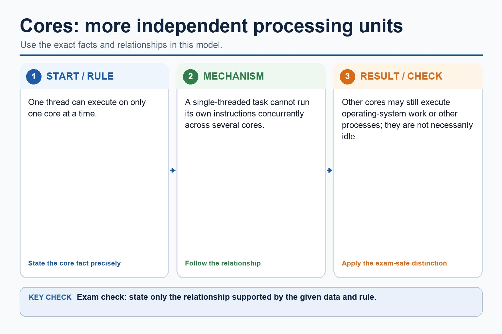
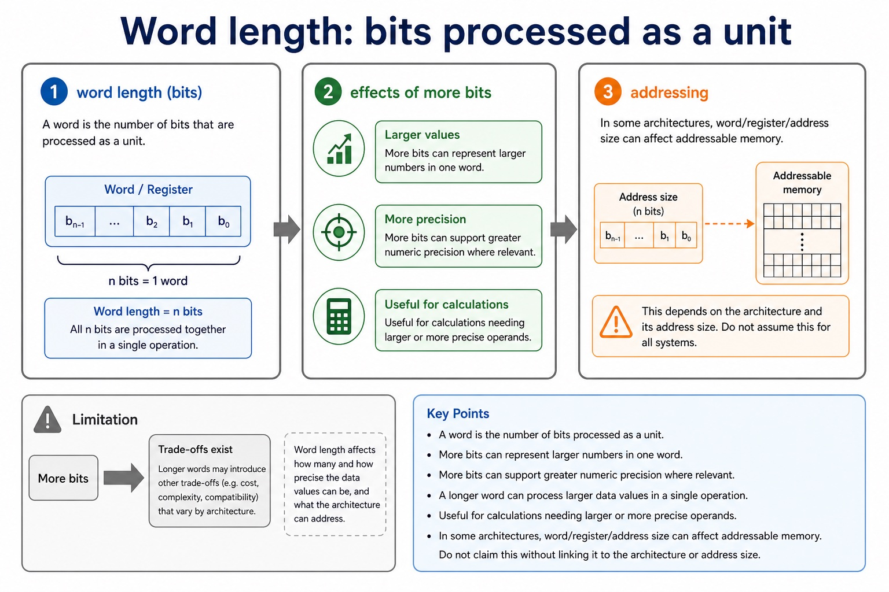
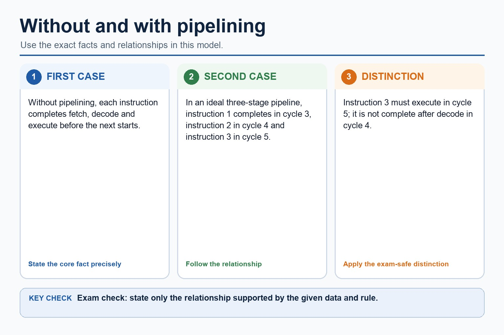
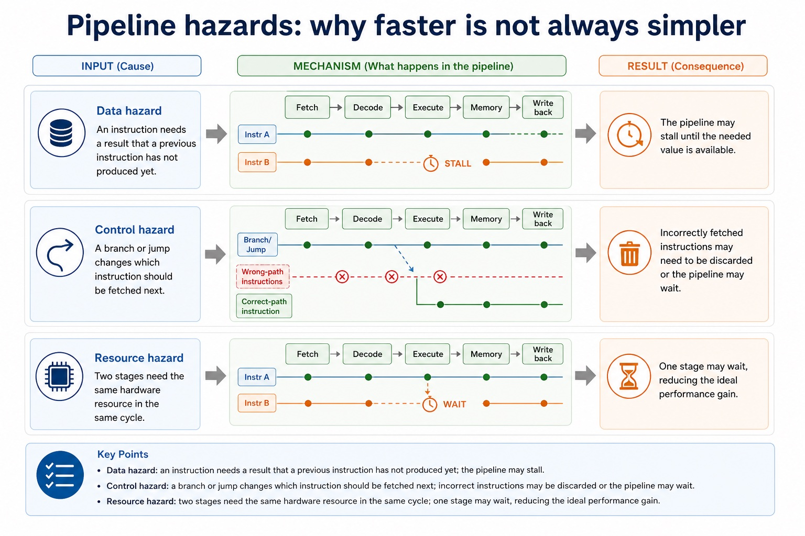
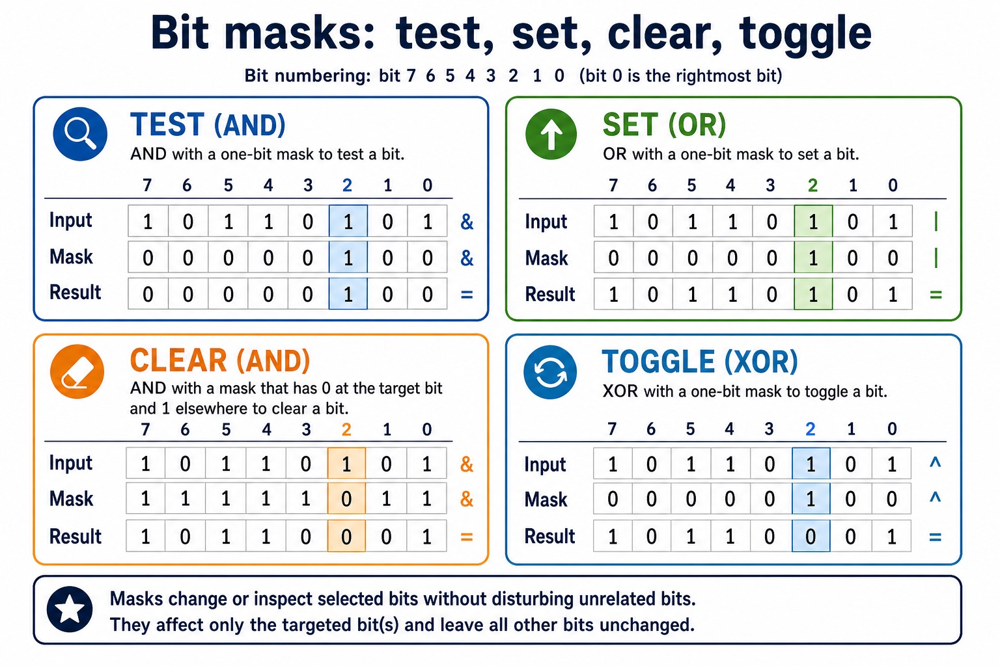
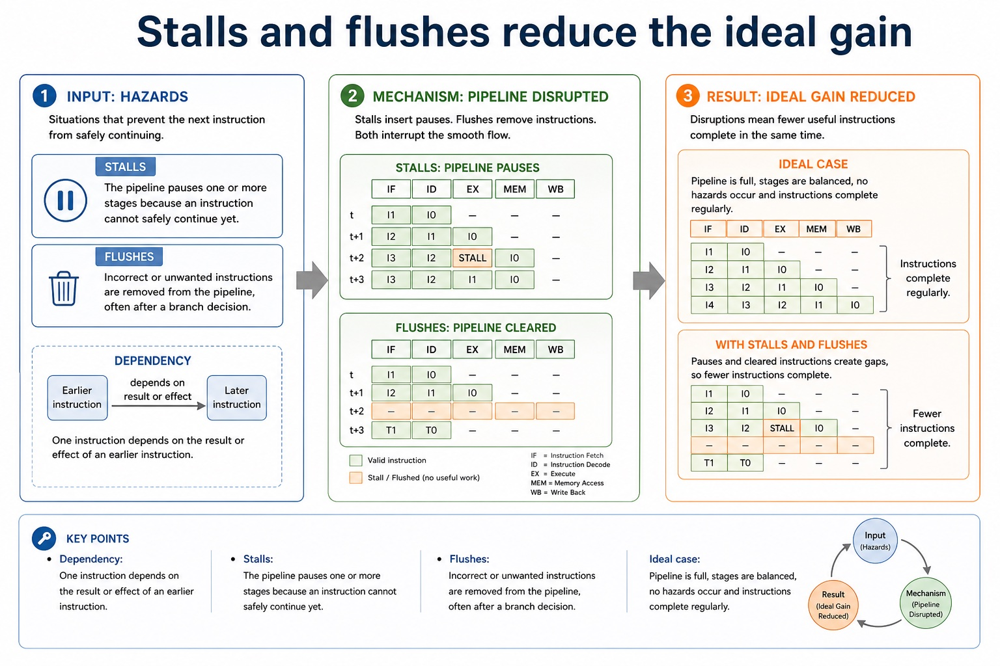
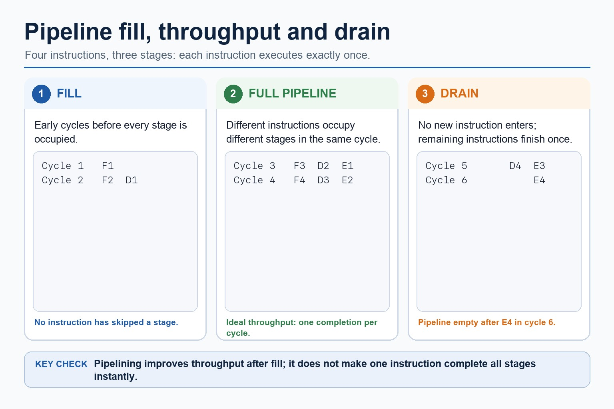

# Lesson 025: Bit manipulation, masks and binary shifts

**Course:** Cambridge International AS Level Computer Science 9618, 2027-2029 Version 2 
**Paper:** Paper 1 
**Syllabus:** Section 4: Processor fundamentals 
**Syllabus requirements:** S4.15 
**Pacing:** Flexible. Select the material set and practice depth needed by the learner.

## Teaching-depth menu

- **Quick route:** Use the diagnostic, learning objectives, first worked example and foundation question. Stop once the learner can explain the central distinction accurately.
- **Full route:** Use every knowledge-point material set, the worked method, the terminology check and all questions.
- **Deep route:** Add the prerequisite refresher, ask learners to connect the concept checklist, discuss the labelled extension and complete a transfer question without a model answer.

## 1. Prerequisite knowledge and quick diagnostic

Recall S1.02 before starting this lesson.

Ask the learner to give one accurate definition or method step before continuing. If they cannot, briefly revisit the named prerequisite rather than repeating the whole previous lesson.

### Optional prerequisite refresher

- The Version 2 row requires binary, denary, hexadecimal, Binary Coded Decimal (BCD), one's complement and two's complement; BCD and complements are representations rather than additional number bases.
- Show understanding of binary, denary and hexadecimal number systems, BCD, and one's- and two's-complement representations.

## 2. Knowledge explanation

### 1. AND mask · OR mask · XOR mask · LSL (S4.15)

**Concept map:** AND mask → OR mask → XOR mask → LSL → LSR → logical → arithmetic → cyclic → left shift → right shift → test → set → clear → toggle → monitor → control

**Three-part explanation:**

1. Use AND, OR and XOR masks to test, set, clear and toggle bits, and apply logical, arithmetic and cyclic left/right shifts at a stated fixed width
2. Include device monitoring/control and distinguish discarded, sign-filled and rotated bits
3. a logical shift inserts zero, an arithmetic right shift preserves the sign bit, and a cyclic shift wraps the bit that leaves one end back to…

**Concrete cue:** Use AND, OR and XOR masks to test, set, clear and toggle bits, and apply logical, arithmetic and cyclic left/right shifts at a stated fixed width. Include device monitoring/control and…

#### Monitor and control a device register

Text transcript

- AND a status byte with a one-bit mask to test a named device flag.
- OR a control byte with a one-bit mask to set the selected output flag.
- AND with an inverted mask clears a flag; XOR with a one-bit mask toggles it.

#### Binary shifts: logical, arithmetic, cyclic

Text transcript

- Every shown input and stored result contains exactly eight bits.
- Logical shifts insert zero; logical left 10110011 becomes 01100110 and logical right becomes 01011001.
- Arithmetic left 10110011 becomes 01100110; arithmetic right copies sign bit 1 and becomes 11011001.
- Cyclic left rotates the outgoing bit to give 01100111; cyclic right gives 11011001.
- Unsigned logical-left overflow and signed arithmetic-left overflow both occur here; rotations do not use an overflow label.

#### Instruction groups: data movement, I/O, arithmetic, control and compare

Text transcript

- The five groups are data movement, input/output, arithmetic, unconditional/conditional instructions and compare.
- Data movement uses LDM, LDD, LDI, LDX, LDR, MOV and STO; LDR n loads the immediate value n into IX.
- Input/output uses IN and OUT; arithmetic uses ADD, SUB, INC and DEC.
- JMP is unconditional; CMP and CMI compare; JPE jumps after True and JPN jumps after False.
- END returns control to the operating system.

#### Decode and execute are not filler words

Text transcript

- The control unit interprets the instruction in the CIR. It identifies the opcode, decides what operation is required, and identifies any operands or addresses needed.
- Execute: arithmetic or logic
- If the instruction is arithmetic or logical, the ALU performs the operation and a result may be stored in a register.
- Execute: memory access
- If the instruction needs data from memory, the CPU uses buses and registers to read from or write to the required memory address.
- Execute: branch
- If the instruction is a branch/jump, the PC may be changed to a different address rather than just continuing with the next instruction.
- Common error

#### Why a CPU divides specialised work

Text transcript

- The control unit interprets the current instruction.
- The ALU performs the required arithmetic or logical operation.
- Registers and buses hold and move the immediate values.

#### Pipelining overlaps instruction-cycle stages

Text transcript

- Pipeline
- A processor technique where multiple instructions are at different stages of execution at the same time.
- The next instruction is fetched from memory using the program counter and memory registers.
- The control unit interprets the instruction and prepares required operands/control signals.
- The instruction is carried out, such as arithmetic, memory access or a branch.

Precise syllabus wording

Use AND, OR, XOR, LSL and LSR for bit manipulation, including testing/setting bits with masks.

Use AND, OR and XOR masks to test, set, clear and toggle bits, and apply logical, arithmetic and cyclic left/right shifts at a stated fixed width. Include device monitoring/control and distinguish discarded, sign-filled and rotated bits.

### Supporting diagram library

#### Cache: reduce slow memory access

Text transcript

- 1. CPU requests data The CPU needs an instruction or data item.
- 2. Cache checked first Cache is much faster than main memory.
- 3. Cache hit If found, access is fast and the CPU waits less.
- 4. Cache miss If not found, data is fetched from slower main memory and may be copied into cache.
- Common error
- Cache is not the same as RAM capacity. It is smaller, faster and used to reduce repeated slow access to main memory.

#### Clock speed: more cycles per second

Text transcript

- Mechanism
- A higher clock speed means more fetch-decode-execute cycle steps can be started per second, if other parts keep up.
- 3.6 GHz means 3.6 billion clock cycles per second, not automatically 3.6 billion completed programs.
- Limitation
- Memory access, heat, power use and CPU architecture can limit the real improvement.

#### The official processor performance factors

Text transcript

- The official performance factors are processor type and number of cores, bus width, clock speed and cache memory.
- Processor type affects how much useful work can be completed for a workload, while more cores help only when work can run in parallel.
- A wider bus transfers more bits per transfer; a higher clock speed provides more cycles per second; cache reduces slower main-memory accesses when required data or instructions are present.
- No single factor guarantees that one computer will be faster for every program.

#### Cores: more independent processing units

Text transcript

- One thread can execute on only one core at a time.
- A single-threaded task cannot run its own instructions concurrently across several cores.
- Other cores may still execute operating-system work or other processes; they are not necessarily idle.

#### Performance is limited by bottlenecks

Text transcript

- Memory bottleneck A fast CPU still waits if data arrives slowly from memory.
- Software bottleneck Single-threaded code cannot fully use many cores.
- Heat and power Higher clock speed can require more power and produce more heat.
- Architecture Different CPU designs may do different amounts of work per clock cycle.

#### Word length: bits processed as a unit

Text transcript

- Explanation
- Exam-safe wording
- Larger values
- More bits can represent larger numbers in one word.
- A longer word can process larger data values in a single operation.
- More precision
- More bits can support greater numeric precision where relevant.
- Useful for calculations needing larger or more precise operands.

#### Without and with pipelining

Text transcript

- Without pipelining, each instruction completes fetch, decode and execute before the next starts.
- In an ideal three-stage pipeline, instruction 1 completes in cycle 3, instruction 2 in cycle 4 and instruction 3 in cycle 5.
- Instruction 3 must execute in cycle 5; it is not complete after decode in cycle 4.

#### Pipeline hazards: why faster is not always simpler

Text transcript

- Consequence
- Data hazard
- An instruction needs a result that a previous instruction has not produced yet.
- The pipeline may stall until the needed value is available.
- Control hazard
- A branch or jump changes which instruction should be fetched next.
- Incorrectly fetched instructions may need to be discarded or the pipeline may wait.
- Resource hazard

#### Bit masks target selected positions

Text transcript

- AND with a 1 preserves or tests a bit, while AND with a 0 clears it.
- OR with a 1 sets a bit without clearing unrelated positions.
- XOR with a 1 toggles a bit while XOR with a 0 preserves it.

#### Stalls and flushes reduce the ideal gain

Text transcript

- The pipeline pauses one or more stages because an instruction cannot safely continue yet.
- Incorrect or unwanted instructions are removed from the pipeline, often after a branch decision.
- Dependency
- One instruction depends on the result or effect of an earlier instruction.
- Ideal case
- Pipeline is full, stages are balanced, no hazards occur and instructions complete regularly.

#### Throughput improves, but latency still exists

Text transcript

- A three-stage pipeline processes each instruction through fetch, decode and execute exactly once.
- For four instructions, cycles 1 and 2 fill the pipeline.
- In cycles 3 and 4, different instructions occupy fetch, decode and execute concurrently.
- Cycle 5 completes instruction 3 and decodes instruction 4; cycle 6 executes instruction 4.
- Pipelining improves throughput after fill but does not remove the latency of one instruction.

Open precise terminology and exam facts

- Use AND, OR and XOR masks to test, set, clear and toggle bits, and apply logical, arithmetic and cyclic left/right shifts at a stated fixed width. Include device monitoring/control and distinguish discarded, sign-filled and rotated bits.
- A bitwise AND mask can test or clear selected bits; an OR mask can set selected bits; an XOR mask can toggle selected bits. These operations are used to monitor and control individual flags without changing unrelated bits.
- LSL is a logical left shift and LSR is a logical right shift. Distinguish logical shifts from arithmetic shifts and cyclic shifts: a logical shift inserts zero, an arithmetic right shift preserves the sign bit, and a cyclic shift wraps the bit that leaves one end back to the other.
- For bit manipulation, masks and binary shifts, identify the required concept before describing its mechanism or consequence.

### Worked example

1. Test, set, clear and toggle one flag
2. For Status = 10110100, an AND mask tests a selected bit, an OR mask sets it, an AND mask with a zero at that position clears it, and an XOR mask toggles…
3. LSL moves bits left; LSR moves them right and fills with zero.

Beyond syllabus / 延伸知识（不要求背诵）: modern processors add pipelining and several cache levels, but exam answers should begin with the syllabus processor model.
## 3. Practice by question type

### Question 1 - foundation - explain - 6 marks

Explain how AND, OR and XOR masks test, clear, set and toggle control flags, then apply one LSL and one LSR.

**Answer:** AND test/clear; OR set; XOR toggle; correct LSL; correct LSR; monitor/control context

**Marking guidance:** Do not treat logical, arithmetic and cyclic shifts as identical.

**Common error:** For the command word explain, perform that exact action; do not replace it with an unrelated fact.

### Question 2 - application - apply - 2 marks

Which mask operation sets selected bits?

**Answer:** Bitwise OR.

**Marking guidance:** Award one mark for each distinct, technically accurate point or method step.

**Common error:** Do not repeat the same point in different words; each mark needs a separate idea or method step.

### Question 3 - transfer - apply - 2 marks

What is inserted by a logical shift?

**Answer:** Zero bits.

**Marking guidance:** Award one mark for each distinct, technically accurate point or method step.

**Common error:** Do not copy the worked example unchanged; transfer the method and check it against the new context.

### Related past-paper indexes

| Reference | Marks | Command word | Question type |
|---|---:|---|---|
| 9618/13/W/25 Q6(a) | 4 | compare | evaluate |
| 9618/11/W/25 Q4(a) | 1 | apply | recall |
| 9618/11/W/25 Q4(b) | 1 | apply | recall |
| 9618/11/W/25 Q4(c) | 1 | apply | recall |

These are indexes only. Cambridge question and mark-scheme wording is not reproduced.

## 4. Summary and exam reminders

### Summary

- Define bit manipulation, masks and binary shifts with the exact technical vocabulary expected by the syllabus.
- Use the lesson method on a fresh context and show the intermediate decision, representation or calculation.
- Match the shape of the answer to the command word and the available marks.
- Check the final answer against the scenario instead of repeating a memorised sentence.

### Common error to correct

Students often memorise register names without roles. Correction: a register earns its name by what it temporarily holds.

### Exam technique

- Follow the command word: state gives a fact; explain links a cause to a consequence; compare covers both sides.
- Match the number of independent points or method steps to the available marks.
- For bit manipulation, masks and binary shifts, use the exact technical term before applying it to the scenario.
