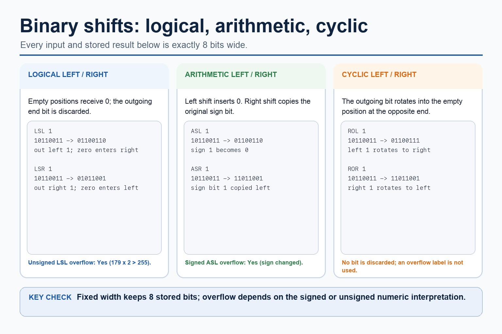

# Lesson 025: Bit manipulation, masks and binary shifts

**Course:** Cambridge International AS Level Computer Science 9618, syllabus for examination in 2027-2029 
**Paper:** Paper 1 
**Syllabus:** Section 4: Processor fundamentals 
**Syllabus requirements:** S4.15 
**Pacing:** Flexible. Select a quick, full or deep route for the learners in front of you.

## Teaching-depth menu

- **Quick route:** Use the diagnostic, learning objectives, first worked example and foundation question. Stop once the learner can explain the central distinction accurately.
- **Full route:** Teach every knowledge-point material set, the worked method and all lesson questions.
- **Deep route:** Add the prerequisite refresher, ask learners to connect the concept checklist, discuss the labelled extension and complete a transfer question without a model answer.

## 1. Prerequisite knowledge and quick diagnostic

Recall S1.02 before starting this lesson.

Ask the learner to give one accurate definition or method step before continuing. If they cannot, briefly revisit the named prerequisite rather than repeating the whole previous lesson.

### Optional prerequisite refresher

- The syllabus requires binary, denary, hexadecimal, Binary Coded Decimal (BCD), one's complement and two's complement; BCD and complements are representations rather than additional number bases.
- Show understanding of binary, denary and hexadecimal number systems, BCD, and one's- and two's-complement representations.

## 2. Knowledge explanation

### 1. AND, OR, XOR, LSL and LSR for bit manipulation, including testing/setting bits with masks (S4.15)

**Concept relationships**

- **XOR mask:** AND, OR and XOR masks to test, set,…
- **left shift:** LSL is a logical left shift and LSR…
- **right shift:** A logical shift inserts zero, an arithmetic right…
- **AND mask:** A bitwise AND mask can test or clear…
- **OR mask:** An XOR mask can toggle selected bits.
- **test:** AND, OR, XOR, LSL and LSR for bit…

**Mechanism**

1. **Write values units and width** — AND, OR and XOR masks to test, set, clear and toggle bits, and apply logical, arithmetic and cyclic…
2. **Apply the required method** — AND, OR, XOR, LSL and LSR for bit manipulation, including testing/setting bits with masks.
3. **Reverse or range-check the result** — A logical shift inserts zero, an arithmetic right shift preserves the sign bit, and a cyclic shift wraps…

**Binary shifts: logical, arithmetic, cyclic:** Every shown input and stored result contains exactly eight bits. Logical shifts insert zero; logical left 10110011 becomes 01100110 and logical right becomes 01011001.

#### Binary shifts: logical, arithmetic, cyclic

Text transcript

- Every shown input and stored result contains exactly eight bits.
- Logical shifts insert zero; logical left 10110011 becomes 01100110 and logical right becomes 01011001.
- Arithmetic left 10110011 becomes 01100110; arithmetic right copies sign bit 1 and becomes 11011001.
- Cyclic left rotates the outgoing bit to give 01100111; cyclic right gives 11011001.
- Unsigned logical-left overflow and signed arithmetic-left overflow both occur here; rotations do not use an overflow label.

Precise syllabus wording

Use AND, OR, XOR, LSL and LSR for bit manipulation, including testing/setting bits with masks.

Use AND, OR and XOR masks to test, set, clear and toggle bits, and apply logical, arithmetic and cyclic left/right shifts at a stated fixed width. Include device monitoring/control and distinguish discarded, sign-filled and rotated bits.

Open precise terminology and exam facts

- Use AND, OR and XOR masks to test, set, clear and toggle bits, and apply logical, arithmetic and cyclic left/right shifts at a stated fixed width. Include device monitoring/control and distinguish discarded, sign-filled and rotated bits.
- A bitwise AND mask can test or clear selected bits; an OR mask can set selected bits; an XOR mask can toggle selected bits. These operations are used to monitor and control individual flags without changing unrelated bits.
- LSL is a logical left shift and LSR is a logical right shift. Distinguish logical shifts from arithmetic shifts and cyclic shifts: a logical shift inserts zero, an arithmetic right shift preserves the sign bit, and a cyclic shift wraps the bit that leaves one end back to the other.
- For bit manipulation, masks and binary shifts, identify the required concept before describing its mechanism or consequence.

### Worked method

1. Test, set, clear and toggle one flag
2. For Status = 10110100, an AND mask tests a selected bit, an OR mask sets it, an AND mask with a zero at that position clears it, and an XOR…
3. LSL moves bits left; LSR moves them right and fills with zero.

Beyond syllabus / 延伸知识（不要求背诵）: modern processors add pipelining and several cache levels, but exam answers should begin with the syllabus processor model.
## 3. Practice by question type

### Question 1 - foundation - explain - 6 marks

Explain how AND, OR and XOR masks test, clear, set and toggle control flags, then apply one LSL and one LSR.

**Answer:** AND test/clear; OR set; XOR toggle; correct LSL; correct LSR; monitor/control context

**Marking guidance:** Do not treat logical, arithmetic and cyclic shifts as identical.

**Common error:** For the command word explain, perform that exact action; do not replace it with an unrelated fact.

### Question 2 - application - apply - 2 marks

Which mask operation sets selected bits?

**Answer:** Bitwise OR.

**Marking guidance:** Award one mark for each distinct, technically accurate point or method step.

**Common error:** Do not repeat the same point in different words; each mark needs a separate idea or method step.

### Question 3 - transfer - apply - 2 marks

What is inserted by a logical shift?

**Answer:** Zero bits.

**Marking guidance:** Award one mark for each distinct, technically accurate point or method step.

**Common error:** Do not copy the worked example unchanged; transfer the method and check it against the new context.

### Related past-paper indexes

| Reference | Marks | Command word | Question type |
|---|---:|---|---|
| 9618/13/W/25 Q6(a) | 4 | compare | evaluate |
| 9618/11/W/25 Q4(a) | 1 | apply | recall |
| 9618/11/W/25 Q4(b) | 1 | apply | recall |
| 9618/11/W/25 Q4(c) | 1 | apply | recall |

These are indexes only. Cambridge question and mark-scheme wording is not reproduced.

## 4. Summary and exam reminders

### Summary

- Define bit manipulation, masks and binary shifts with the exact technical vocabulary expected by the syllabus.
- Use the lesson method on a fresh context and show the intermediate decision, representation or calculation.
- Match the shape of the answer to the command word and the available marks.
- Check the final answer against the scenario instead of repeating a memorised sentence.

### Common error to correct

Students often memorise register names without roles. Correction: a register earns its name by what it temporarily holds.

### Exam technique

- Follow the command word: state gives a fact; explain links a cause to a consequence; compare covers both sides.
- Match the number of independent points or method steps to the available marks.
- For bit manipulation, masks and binary shifts, use the exact technical term before applying it to the scenario.
