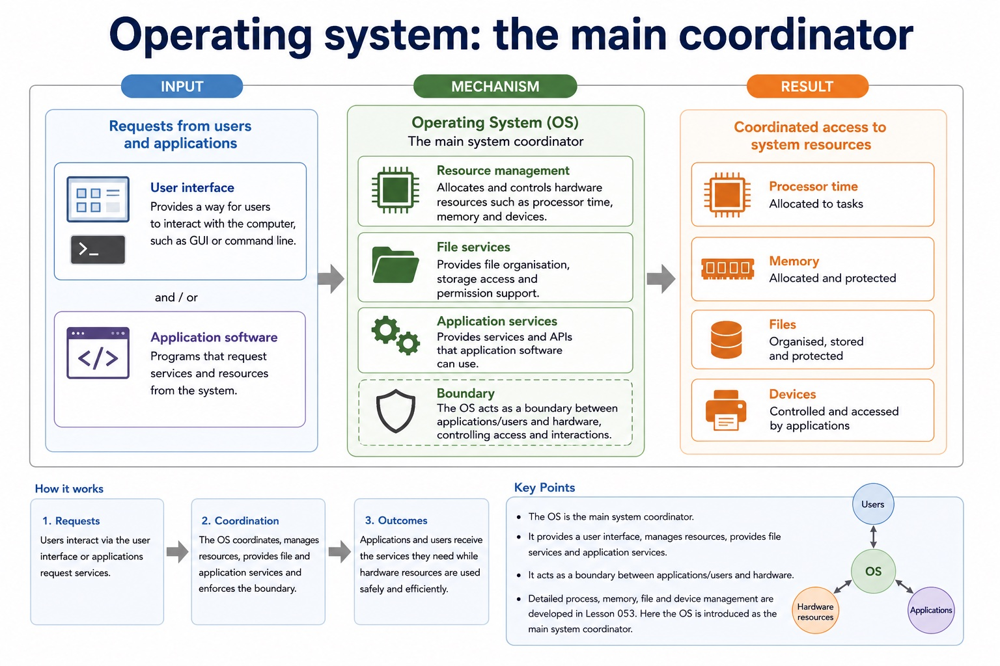

# Lesson 026: Why operating systems are required

**Course:** Cambridge International AS Level Computer Science 9618, syllabus for examination in 2027-2029 
**Paper:** Paper 1 
**Syllabus:** Section 5: System software 
**Syllabus requirements:** S5.01 
**Pacing:** Flexible. Select a quick, full or deep route for the learners in front of you.

## Teaching-depth menu

- **Quick route:** Use the diagnostic, learning objectives, first worked example and foundation question. Stop once the learner can explain the central distinction accurately.
- **Full route:** Teach every knowledge-point material set, the worked method and all lesson questions.
- **Deep route:** Add the prerequisite refresher, ask learners to connect the concept checklist, discuss the labelled extension and complete a transfer question without a model answer.

## 1. Prerequisite knowledge and quick diagnostic

Recall the main conclusion from Lesson 025: Bit manipulation, masks and binary shifts.

Ask the learner to give one accurate definition or method step before continuing. If they cannot, briefly revisit the named prerequisite rather than repeating the whole previous lesson.

## 2. Knowledge explanation

### 1. Why an operating system is required and its memory, file, security, hardware and process management roles (S5.01)

**Atomic learning targets**

- **S5.01.A01:** operating system
- **S5.01.A02:** memory management
- **S5.01.A03:** file management
- **S5.01.A04:** security management
- **S5.01.A05:** hardware management
- **S5.01.A06:** process management

**Core explanation**

- An operating system is required to provide a controlled interface between applications, users and hardware, and to coordinate shared resources. Without it, each application would need its own incompatible routines for processor time, memory, files, security and devices.
- Process management schedules CPU time and tracks running processes. Memory management allocates and protects RAM. File management organises files, folders, metadata and file operations. Security management authenticates users and enforces permissions or access rights.
- Hardware management coordinates devices through drivers, interrupts, buffers and queues. These roles cooperate: security management decides whether a request is authorised, while file or hardware management performs the permitted operation. Antivirus remains a utility and must not replace the OS security-management role.
- Why an operating system is required and its memory, file, security, hardware and process management roles.

**Mechanism or method**

1. **Identify the relevant condition or input** — An operating system is required to provide a controlled interface between applications, users and hardware, and to coordinate shared resources.
2. **Trace how the process works** — Without it, each application would need its own incompatible routines for processor time, memory, files, security and devices.
3. **Connect the mechanism to its result** — Process management schedules CPU time and tracks running processes.

#### Worked example: Why an operating system is required and its memory, file, security, hardware and process management roles: complete worked route

1. **Identify the relevant condition or input**

An operating system is required to provide a controlled interface between applications, users and hardware, and to coordinate shared resources.

2. **Trace how the process works**

Without it, each application would need its own incompatible routines for processor time, memory, files, security and devices.

3. **Connect the mechanism to its result**

Process management schedules CPU time and tracks running processes.

4. **Complete example**

Open a protected file and print it: The OS authenticates the user and security management checks access rights. File management locates and opens the file; hardware management uses a printer driver, buffer and queue to send permitted output to the printer.

**Misconceptions to correct**

- Students often say interpreters are 'bad compilers'. Correction: they are different translation approaches with different use cases.

#### Mastery check (MC-L026-S5.01)

Explain the following targets in one connected answer, using a concrete example for each: operating system; memory management; file management; security management; hardware management; process management.

Answer criteria

- An operating system is required to provide a controlled interface between applications, users and hardware, and to coordinate shared resources. Without it, each application would need its own incompatible routines for processor time, memory, files, security and devices.
- Process management schedules CPU time and tracks running processes. Memory management allocates and protects RAM. File management organises files, folders, metadata and file operations. Security management authenticates users and enforces permissions or access rights.
- Hardware management coordinates devices through drivers, interrupts, buffers and queues. These roles cooperate: security management decides whether a request is authorised, while file or hardware management performs the permitted operation. Antivirus remains a utility and must not replace the OS security-management role.
- Why an operating system is required and its memory, file, security, hardware and process management roles.

**Supplementary concept map**

- **memory management:** Memory management allocates and protects RAM.
- **file management:** File management organises files, folders, metadata and file…
- **security management:** Security management decides whether a request is authorised,…
- **hardware management:** Hardware management coordinates devices through drivers, interrupts, buffers…
- **process management:** Why an operating system is required and its…
- **operating system:** The operating system is required to provide a…

**Supplementary three-step recap**

1. **Identify what needs protection** — Why an operating system is required and its memory, file, security, hardware and process management roles.
2. **Trace the attack or error route** — The operating system is required to provide a platform and manage memory, files, security, hardware input/output and peripherals,…
3. **Match a safeguard and limitation** — Detailed process, memory, file and device management are developed in Lesson 054.

**Operating system: the main coordinator:** User interface Provides a way for users to interact with the computer, such as GUI or command line. Resource management Allocates and controls hardware resources such as processor time, memory and devices.

#### Operating system: the main coordinator

Text transcript

- User interface Provides a way for users to interact with the computer, such as GUI or command line.
- Resource management Allocates and controls hardware resources such as processor time, memory and devices.
- File services Provides file organisation, storage access and permission support.
- Application services Provides services and APIs that application software can use.
- Boundary
- Detailed process, memory, file and device management are developed in Lesson 054. Here the OS is introduced as the main system coordinator.

Precise syllabus wording

Explain why an operating system is required and its memory, file, security, hardware and process management roles.

The operating system is required to provide a platform and manage memory, files, security, hardware input/output and peripherals, and processes.

### Lesson technical reference

- The operating system is required to provide a platform and manage memory, files, security, hardware input/output and peripherals, and processes.
- An operating system is required to provide a controlled interface between applications, users and hardware, and to coordinate shared resources. Without it, each application would need its own incompatible routines for processor time, memory, files, security and devices.
- Process management schedules CPU time and tracks running processes. Memory management allocates and protects RAM. File management organises files, folders, metadata and file operations. Security management authenticates users and enforces permissions or access rights.
- Hardware management coordinates devices through drivers, interrupts, buffers and queues. These roles cooperate: security management decides whether a request is authorised, while file or hardware management performs the permitted operation. Antivirus remains a utility and must not replace the OS security-management role.

Beyond syllabus / 延伸知识（不要求背诵）: production build systems automate translation, linking, testing and packaging, while the syllabus examines the purpose of each stage separately.
## 3. Practice by question type

### Question 1 - foundation - explain - 6 marks

Explain why an operating system is required and describe its process, memory, file, security and hardware management roles.

**Answer:** required interface/control layer between applications, users and hardware; process management schedules CPU time or tracks processes; memory management allocates/protects RAM; file management organises stored files and operations; security management authenticates users or enforces permissions/access rights; hardware management uses drivers/interrupts/buffers/queues to coordinate devices

**Marking guidance:** Do not substitute antivirus utility software for OS security management, and do not treat stored files as RAM.

**Common error:** For the command word explain, perform that exact action; do not replace it with an unrelated fact.

### Question 2 - application - apply - 2 marks

Which OS role authenticates a user and enforces access rights?

**Answer:** Security management.

**Marking guidance:** Award one mark for each distinct, technically accurate point or method step.

**Common error:** Do not repeat the same point in different words; each mark needs a separate idea or method step.

### Question 3 - transfer - apply - 2 marks

Which role allocates RAM to a running process?

**Answer:** Memory management.

**Marking guidance:** Award one mark for each distinct, technically accurate point or method step.

**Common error:** Do not copy the worked example unchanged; transfer the method and check it against the new context.

### Related past-paper indexes

| Reference | Marks | Command word | Question type |
|---|---:|---|---|
| 9618/11/W/25 Q5(a)(i) | 2 | state | recall |
| 9618/11/W/25 Q5(b)(i) | 2 | describe | explain |
| 9618/11/W/25 Q5(c) | 2 | describe | explain |
| 9618/11/W/25 Q5(ii) | 2 | state | recall |

These are indexes only. Cambridge question and mark-scheme wording is not reproduced.

## 4. Summary and exam reminders

### Summary

- S5.01: explain operating system, memory management, file management, security management, hardware management, process management.
- S5.01 method: Identify the relevant condition or input → Trace how the process works → Connect the mechanism to its result.
- Correction to remember: Students often say interpreters are 'bad compilers'. Correction: they are different translation approaches with different use cases.

### Common error to correct

Students often say interpreters are 'bad compilers'. Correction: they are different translation approaches with different use cases.

### Exam technique

- Follow the command word: state gives a fact; explain links a cause to a consequence; compare covers both sides.
- Match the number of independent points or method steps to the available marks.
- For why operating systems are required, use the exact technical term before applying it to the scenario.
