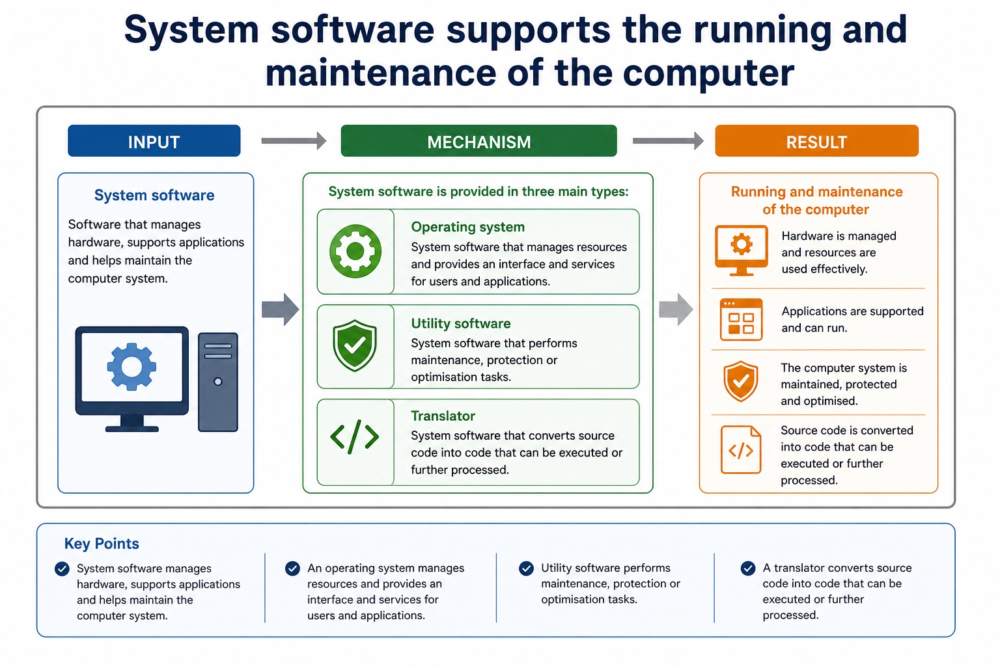
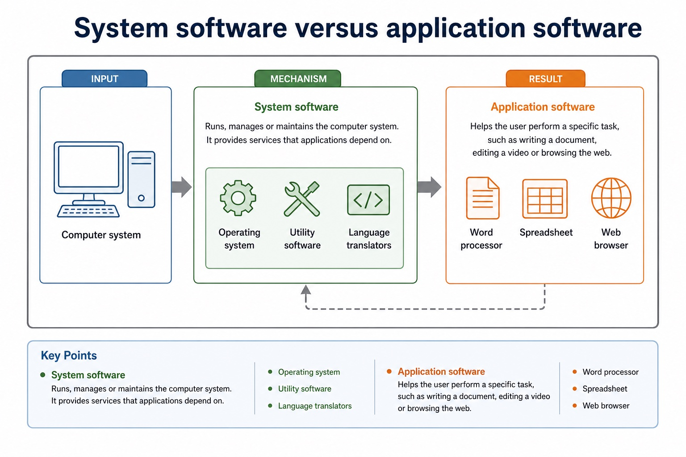
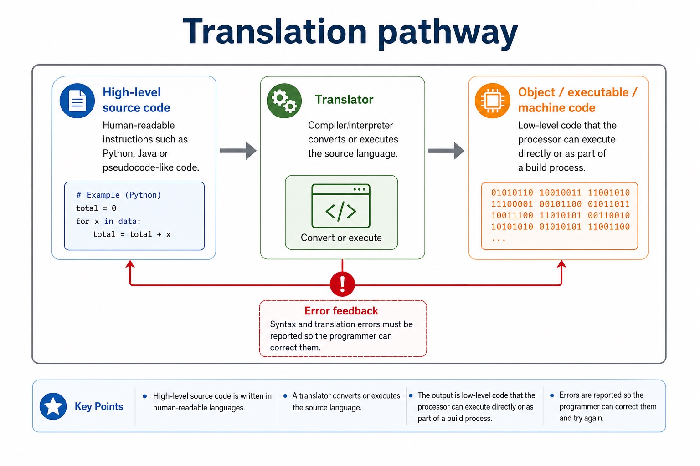
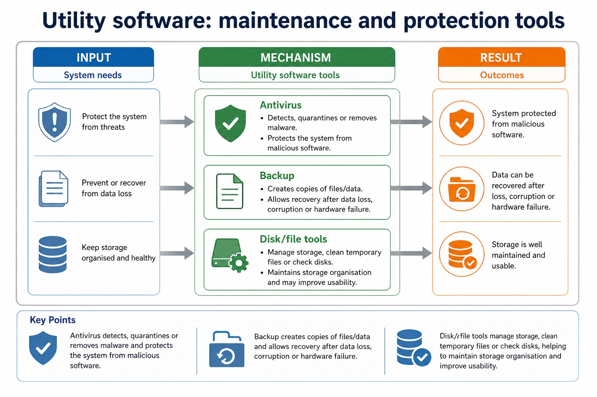

# Lesson 026: Why operating systems are required

**Course:** Cambridge International AS Level Computer Science 9618, 2027-2029 Version 2 
**Paper:** Paper 1 
**Syllabus:** Section 5: System software 
**Syllabus requirements:** S5.01 
**Pacing:** Flexible. Select the material set and practice depth needed by the learner.

## Teaching-depth menu

- **Quick route:** Use the diagnostic, learning objectives, first worked example and foundation question. Stop once the learner can explain the central distinction accurately.
- **Full route:** Use every knowledge-point material set, the worked method, the terminology check and all questions.
- **Deep route:** Add the prerequisite refresher, ask learners to connect the concept checklist, discuss the labelled extension and complete a transfer question without a model answer.

## 1. Prerequisite knowledge and quick diagnostic

Recall the main conclusion from Lesson 025: Bit manipulation, masks and binary shifts.

Ask the learner to give one accurate definition or method step before continuing. If they cannot, briefly revisit the named prerequisite rather than repeating the whole previous lesson.

## 2. Knowledge explanation

### 1. Operating system · Memory management · File management · Security management (S5.01)

**Concept map:** operating system → memory management → file management → security management → hardware management → process management

**Three-part explanation:**

1. The operating system is required to provide a platform and manage memory, files, security, hardware input/output and peripherals, and processes
2. security management decides whether a request is authorised, while file or hardware management performs the permitted operation
3. hardware management uses a printer driver, buffer and queue to send permitted output to the printer

**Concrete cue:** The operating system is required to provide a platform and manage memory, files, security, hardware input/output and peripherals, and processes.

#### Operating system: the main coordinator

Text transcript

- User interface Provides a way for users to interact with the computer, such as GUI or command line.
- Resource management Allocates and controls hardware resources such as processor time, memory and devices.
- File services Provides file organisation, storage access and permission support.
- Application services Provides services and APIs that application software can use.
- Boundary
- Detailed process, memory, file and device management are developed in Lesson 054. Here the OS is introduced as the main system coordinator.

#### Why applications need an operating system

Text transcript

- Applications request services instead of controlling hardware directly.
- The operating system checks and schedules those requests.
- Drivers translate approved requests for particular devices.

#### System software supports the running and maintenance of the computer

Text transcript

- System software
- Software that manages hardware, supports applications and helps maintain the computer system.
- Operating system
- System software that manages resources and provides an interface and services for users and applications.
- Utility software
- System software that performs maintenance, protection or optimisation tasks.
- Translator
- System software that converts source code into code that can be executed or further processed.

Precise syllabus wording

Explain why an operating system is required and its memory, file, security, hardware and process management roles.

The operating system is required to provide a platform and manage memory, files, security, hardware input/output and peripherals, and processes.

### Supporting diagram library

#### System software versus application software

Text transcript

- System software
- Runs, manages or maintains the computer system. It provides services that applications depend on.
- Operating system
- Utility software
- Language translators
- Application software
- Helps the user perform a specific task, such as writing a document, editing a video or browsing the web.
- Word processor

#### Translation pathway

Text transcript

- High-level source code Human-readable instructions such as Python, Java or pseudocode-like code.
- Translator Compiler/interpreter converts or executes the source language.
- Object / executable / machine code Low-level code that the processor can execute directly or as part of a build process.
- Error feedback Syntax and translation errors must be reported so the programmer can correct them.

#### Language translators: source code to executable behaviour

Text transcript

- Compiler
- Translates the whole source program before execution, often producing object or executable code.
- Interpreter
- Translates and executes source code statement by statement, often useful during development and debugging.
- Assembler
- Translates assembly language mnemonics into machine code for a specific processor.
- Common error
- An interpreter is not a "bad compiler". It is a different translation approach with different trade-offs.

#### Utility software: maintenance and protection tools

Text transcript

- Exam-safe wording
- Antivirus
- Detects, quarantines or removes malware.
- Protects the system from malicious software.
- Creates copies of files/data.
- Allows recovery after data loss, corruption or hardware failure.
- Compression
- Reduces file size.

Open precise terminology and exam facts

- The operating system is required to provide a platform and manage memory, files, security, hardware input/output and peripherals, and processes.
- An operating system is required to provide a controlled interface between applications, users and hardware, and to coordinate shared resources. Without it, each application would need its own incompatible routines for processor time, memory, files, security and devices.
- Process management schedules CPU time and tracks running processes. Memory management allocates and protects RAM. File management organises files, folders, metadata and file operations. Security management authenticates users and enforces permissions or access rights.
- Hardware management coordinates devices through drivers, interrupts, buffers and queues. These roles cooperate: security management decides whether a request is authorised, while file or hardware management performs the permitted operation. Antivirus remains a utility and must not replace the OS security-management role.

### Worked example

1. Open a protected file and print it
2. The OS authenticates the user and security management checks access rights.
3. File management locates and opens the file; memory management allocates RAM; process management schedules the application; hardware management uses a printer driver, buffer and queue to send permitted output to the printer.

Beyond syllabus / 延伸知识（不要求背诵）: production build systems automate translation, linking, testing and packaging, while the syllabus examines the purpose of each stage separately.
## 3. Practice by question type

### Question 1 - foundation - explain - 6 marks

Explain why an operating system is required and describe its process, memory, file, security and hardware management roles.

**Answer:** required interface/control layer between applications, users and hardware; process management schedules CPU time or tracks processes; memory management allocates/protects RAM; file management organises stored files and operations; security management authenticates users or enforces permissions/access rights; hardware management uses drivers/interrupts/buffers/queues to coordinate devices

**Marking guidance:** Do not substitute antivirus utility software for OS security management, and do not treat stored files as RAM.

**Common error:** For the command word explain, perform that exact action; do not replace it with an unrelated fact.

### Question 2 - application - apply - 2 marks

Which OS role authenticates a user and enforces access rights?

**Answer:** Security management.

**Marking guidance:** Award one mark for each distinct, technically accurate point or method step.

**Common error:** Do not repeat the same point in different words; each mark needs a separate idea or method step.

### Question 3 - transfer - apply - 2 marks

Which role allocates RAM to a running process?

**Answer:** Memory management.

**Marking guidance:** Award one mark for each distinct, technically accurate point or method step.

**Common error:** Do not copy the worked example unchanged; transfer the method and check it against the new context.

### Related past-paper indexes

| Reference | Marks | Command word | Question type |
|---|---:|---|---|
| 9618/11/W/25 Q5(a)(i) | 2 | state | recall |
| 9618/11/W/25 Q5(b)(i) | 2 | describe | explain |
| 9618/11/W/25 Q5(c) | 2 | describe | explain |
| 9618/11/W/25 Q5(ii) | 2 | state | recall |

These are indexes only. Cambridge question and mark-scheme wording is not reproduced.

## 4. Summary and exam reminders

### Summary

- Define why operating systems are required with the exact technical vocabulary expected by the syllabus.
- Use the lesson method on a fresh context and show the intermediate decision, representation or calculation.
- Match the shape of the answer to the command word and the available marks.
- Check the final answer against the scenario instead of repeating a memorised sentence.

### Common error to correct

Students often say interpreters are 'bad compilers'. Correction: they are different translation approaches with different use cases.

### Exam technique

- Follow the command word: state gives a fact; explain links a cause to a consequence; compare covers both sides.
- Match the number of independent points or method steps to the available marks.
- For why operating systems are required, use the exact technical term before applying it to the scenario.
