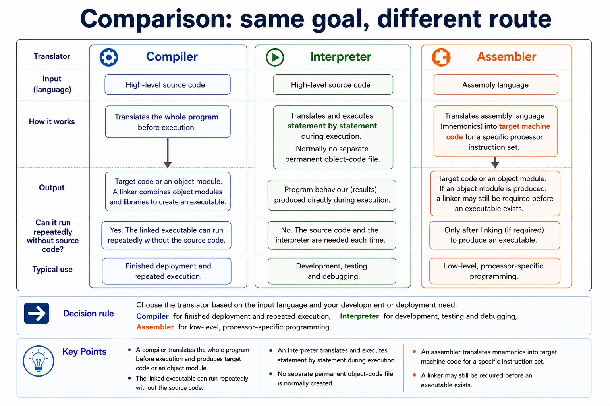
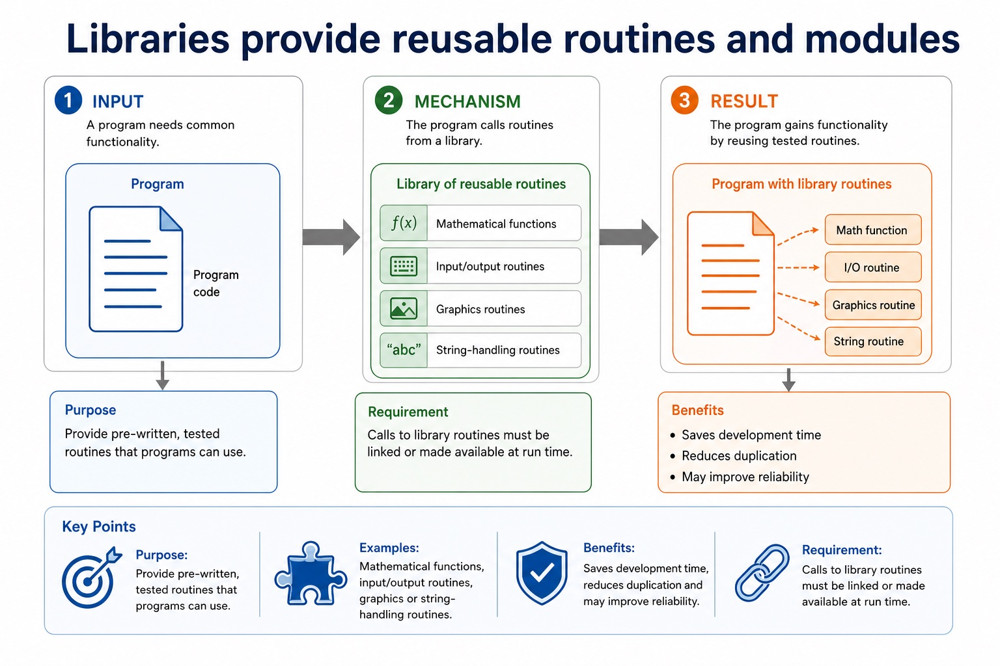

# Lesson 027: Utility software, libraries and linked files

**Course:** Cambridge International AS Level Computer Science 9618, syllabus for examination in 2027-2029 
**Paper:** Paper 1 
**Syllabus:** Section 5: System software 
**Syllabus requirements:** S5.02, S5.03 
**Pacing:** Flexible. Select a quick, full or deep route for the learners in front of you.

## Teaching-depth menu

- **Quick route:** Use the diagnostic, learning objectives, first worked example and foundation question. Stop once the learner can explain the central distinction accurately.
- **Full route:** Teach every knowledge-point material set, the worked method and all lesson questions.
- **Deep route:** Add the prerequisite refresher, ask learners to connect the concept checklist, discuss the labelled extension and complete a transfer question without a model answer.

## 1. Prerequisite knowledge and quick diagnostic

Recall S5.01 before starting this lesson.

Ask the learner to give one accurate definition or method step before continuing. If they cannot, briefly revisit the named prerequisite rather than repeating the whole previous lesson.

### Optional prerequisite refresher

- The operating system is required to provide a platform and manage memory, files, security, hardware input/output and peripherals, and processes.
- Explain why an operating system is required and its memory, file, security, hardware and process management roles.

## 2. Knowledge explanation

### 1. Disk formatter, antivirus, defragmentation, disk analysis/repair, compression and backup utilities (S5.02)

**Atomic learning targets**

- **S5.02.A01:** disk formatter
- **S5.02.A02:** virus checker / antivirus
- **S5.02.A03:** defragmentation
- **S5.02.A04:** disk contents analysis / disk analysis / disk contents analysis/repair
- **S5.02.A05:** repair
- **S5.02.A06:** compression
- **S5.02.A07:** backup

**Core explanation**

- A disk formatter prepares a storage medium with file-system structures. A virus checker scans for, quarantines and removes malware. A disk defragmenter rearranges fragmented file blocks on a magnetic disk; it is not a speed treatment for SSDs.
- Defragmentation rearranges fragmented blocks on a magnetic disk; disk analysis can locate a file-system fault and a repair operation attempts to correct it.
- A disk contents analysis/repair utility examines file-system structures, reports faults and attempts defined repairs. Compression reduces file size and backup creates a separate recoverable copy. Encryption may be useful additional protection, but it does not replace any of the six named syllabus utilities.
- A disk formatter prepares a storage medium with file-system structures. A virus checker scans for, quarantines and removes malware.
- A disk contents analysis/repair utility examines file-system structures and attempts defined repairs.
- Disk formatter, antivirus, defragmentation, disk analysis/repair, compression and backup utilities.

**Mechanism or method**

1. **Identify the relevant condition or input** — A disk formatter prepares a storage medium with file-system structures.
2. **Trace how the process works** — A virus checker scans for, quarantines and removes malware.
3. **Connect the mechanism to its result** — A disk defragmenter rearranges fragmented file blocks on a magnetic disk;

#### Worked example: Disk formatter, antivirus, defragmentation, disk analysis/repair, compression and backup utilities: complete worked route

1. **Identify the relevant condition or input**

A disk formatter prepares a storage medium with file-system structures.

2. **Trace how the process works**

A virus checker scans for, quarantines and removes malware.

3. **Connect the mechanism to its result**

A disk defragmenter rearranges fragmented file blocks on a magnetic disk;

4. **Complete example**

Choose the utility from the fault: Use a formatter to prepare a new storage medium, disk analysis/repair for file-system errors, a backup to recover a deleted file, and compression to reduce transfer size.

**Misconceptions to correct**

- Students often call every program an operating system. Correction: an OS manages resources and provides services; an app performs user tasks.

#### Mastery check (MC-L027-S5.02)

Explain the following targets in one connected answer, using a concrete example for each: disk formatter; virus checker / antivirus; defragmentation; disk contents analysis / disk analysis / disk contents analysis/repair; repair; compression; backup.

Answer criteria

- A disk formatter prepares a storage medium with file-system structures. A virus checker scans for, quarantines and removes malware. A disk defragmenter rearranges fragmented file blocks on a magnetic disk; it is not a speed treatment for SSDs.
- Defragmentation rearranges fragmented blocks on a magnetic disk; disk analysis can locate a file-system fault and a repair operation attempts to correct it.
- A disk contents analysis/repair utility examines file-system structures, reports faults and attempts defined repairs. Compression reduces file size and backup creates a separate recoverable copy. Encryption may be useful additional protection, but it does not replace any of the six named syllabus utilities.
- A disk formatter prepares a storage medium with file-system structures. A virus checker scans for, quarantines and removes malware.
- A disk contents analysis/repair utility examines file-system structures and attempts defined repairs.
- Disk formatter, antivirus, defragmentation, disk analysis/repair, compression and backup utilities.

**Supplementary concept map**

- **disk formatter:** Required utility categories are disk formatter, virus checker,…
- **disk analysis:** Disk formatter, antivirus, defragmentation, disk analysis/repair, compression and…
- **antivirus:** A disk contents analysis/repair utility examines file-system structures…
- **defragmentation:** Defragmentation rearranges fragmented blocks on a magnetic disk
- **repair:** Disk analysis can locate a file-system fault and…
- **compression:** Compression reduces file size and backup creates a…

**Supplementary three-step recap**

1. **Name the exact concept** — Required utility categories are disk formatter, virus checker, defragmentation, disk contents analysis and repair, file compression and backup…
2. **Explain how its parts connect** — Disk formatter, antivirus, defragmentation, disk analysis/repair, compression and backup utilities.
3. **Use it in a concrete context** — A disk contents analysis/repair utility examines file-system structures and attempts defined repairs.

**Choose the required utility by its operation:** A disk formatter prepares a storage medium with file-system structures. A virus checker scans for, quarantines and removes malware.

#### Choose the required utility by its operation

Text transcript

- A disk formatter prepares a storage medium with file-system structures.
- A virus checker scans for, quarantines and removes malware.
- A disk defragmenter rearranges fragmented file blocks on a magnetic disk.
- A disk contents analysis/repair utility examines file-system structures and attempts defined repairs.
- Compression reduces file size; backup creates a separate recoverable copy.

Precise syllabus wording

Understand disk formatter, antivirus, defragmentation, disk analysis/repair, compression and backup utilities.

Required utility categories are disk formatter, virus checker, defragmentation, disk contents analysis and repair, file compression and backup software.

### 2. Libraries and benefits of dynamically linked library files (S5.03)

**Atomic learning targets**

- **S5.03.A01:** software under development
- **S5.03.A02:** existing code
- **S5.03.A03:** program libraries
- **S5.03.A04:** developer
- **S5.03.A05:** benefit
- **S5.03.A06:** dynamically linked library / DLL

**Core explanation**

- Software under development is often constructed using existing code from program libraries. A program library is a collection of reusable routines or modules, so a developer can call tested implementations instead of rewriting common mathematical, input/output, graphics or string operations.
- Benefits to the developer include shorter development time, less duplicated source code, reuse of tested routines and more consistent maintenance. A dynamically linked library (DLL) is connected when a program loads or calls it rather than copying all library code into every executable.
- DLL files can reduce executable size and memory duplication, support reuse and allow one shared update. They also create dependency and version risks: a missing or incompatible DLL can stop a program loading or change behaviour.
- One benefit of a program library is that a developer can reuse existing tested code while software is under development.
- Software under development is often constructed using existing code from program libraries.
- Libraries and benefits of dynamically linked library files.

**Mechanism or method**

1. **Identify the relevant condition or input** — Software under development is often constructed using existing code from program libraries.
2. **Trace how the process works** — A program library is a collection of reusable routines or modules, so a developer can call tested implementations instead of rewriting common mathematical, input/output, graphics or string operations.
3. **Connect the mechanism to its result** — Benefits to the developer include shorter development time, less duplicated source code, reuse of tested routines and more consistent maintenance.

#### Worked example: Libraries and benefits of dynamically linked library files: complete worked route

1. **Identify the relevant condition or input**

Software under development is often constructed using existing code from program libraries.

2. **Trace how the process works**

A program library is a collection of reusable routines or modules, so a developer can call tested implementations instead of rewriting common mathematical, input/output, graphics or string operations.

3. **Connect the mechanism to its result**

Benefits to the developer include shorter development time, less duplicated source code, reuse of tested routines and more consistent maintenance.

4. **Complete example**

Choose the utility from the fault: Use a formatter to prepare a new storage medium, disk analysis/repair for file-system errors, a backup to recover a deleted file, and compression to reduce transfer size. Choose by the operation required, not by calling every tool 'maintenance'.

**Misconceptions to correct**

- Students often call every program an operating system. Correction: an OS manages resources and provides services; an app performs user tasks.

#### Mastery check (MC-L027-S5.03)

Explain the following targets in one connected answer, using a concrete example for each: software under development; existing code; program libraries; developer; benefit; dynamically linked library / DLL.

Answer criteria

- Software under development is often constructed using existing code from program libraries. A program library is a collection of reusable routines or modules, so a developer can call tested implementations instead of rewriting common mathematical, input/output, graphics or string operations.
- Benefits to the developer include shorter development time, less duplicated source code, reuse of tested routines and more consistent maintenance. A dynamically linked library (DLL) is connected when a program loads or calls it rather than copying all library code into every executable.
- DLL files can reduce executable size and memory duplication, support reuse and allow one shared update. They also create dependency and version risks: a missing or incompatible DLL can stop a program loading or change behaviour.
- One benefit of a program library is that a developer can reuse existing tested code while software is under development.
- Software under development is often constructed using existing code from program libraries.
- Libraries and benefits of dynamically linked library files.

**Supplementary concept map**

- **software under development:** Software under development is often constructed using existing…
- **existing code:** One benefit of a program library is that…
- **program libraries:** Libraries and benefits of dynamically linked library files.
- **benefit:** Developer benefits, including the use of dynamically linked…
- **developer:** Benefits to the developer include shorter development time,…
- **DLL:** A dynamically linked library (DLL) is connected when…

**Supplementary three-step recap**

1. **Translate the stated design** — One benefit of a program library is that a developer can reuse existing tested code while software is…
2. **Apply one complete operation** — Software under development is often constructed using existing code from program libraries.
3. **Trace state and boundaries** — Libraries and benefits of dynamically linked library files.

**Libraries provide reusable routines and modules:** Purpose Provide pre-written, tested routines that programs can use. Examples Mathematical functions, input/output routines, graphics or string-handling routines.

#### Libraries provide reusable routines and modules

Text transcript

- Purpose Provide pre-written, tested routines that programs can use.
- Examples Mathematical functions, input/output routines, graphics or string-handling routines.
- Benefits Saves development time, reduces duplication and may improve reliability.
- Requirement Calls to library routines must be linked or made available at run time.

Precise syllabus wording

Understand libraries and benefits of dynamically linked library files.

Software under development is often constructed using existing code from program libraries. Explain developer benefits, including the use of dynamically linked library files.

### Lesson technical reference

- Required utility categories are disk formatter, virus checker, defragmentation, disk contents analysis and repair, file compression and backup software.
- Software under development is often constructed using existing code from program libraries. Explain developer benefits, including the use of dynamically linked library files.
- A disk formatter prepares a storage medium with file-system structures. A virus checker scans for, quarantines and removes malware. A disk defragmenter rearranges fragmented file blocks on a magnetic disk; it is not a speed treatment for SSDs.
- A disk contents analysis/repair utility examines file-system structures, reports faults and attempts defined repairs. Compression reduces file size and backup creates a separate recoverable copy. Encryption may be useful additional protection, but it does not replace any of the six named syllabus utilities.
- Defragmentation rearranges fragmented blocks on a magnetic disk; disk analysis can locate a file-system fault and a repair operation attempts to correct it.
- Software under development is often constructed using existing code from program libraries. A program library is a collection of reusable routines or modules, so a developer can call tested implementations instead of rewriting common mathematical, input/output, graphics or string operations.
- Benefits to the developer include shorter development time, less duplicated source code, reuse of tested routines and more consistent maintenance. A dynamically linked library (DLL) is connected when a program loads or calls it rather than copying all library code into every executable.
- DLL files can reduce executable size and memory duplication, support reuse and allow one shared update. They also create dependency and version risks: a missing or incompatible DLL can stop a program loading or change behaviour.
- A runtime error (run-time error) occurs during execution; identify its cause, use runtime diagnostics to locate it and correct the responsible code.
- One benefit of a program library is that a developer can reuse existing tested code while software is under development.

Beyond syllabus / 延伸知识（不要求背诵）: production build systems automate translation, linking, testing and packaging, while the syllabus examines the purpose of each stage separately.
## 3. Practice by question type

### Question 1 - foundation - explain - 2 marks

How do program libraries support software under development?

**Answer:** They supply existing reusable routines or modules, avoiding the need to write common code again.

**Marking guidance:** Award one mark for each distinct, technically accurate point or method step.

**Common error:** For the command word explain, perform that exact action; do not replace it with an unrelated fact.

### Question 2 - application - identify - 4 marks

A computer has a new storage medium and another disk reports file-system errors. Identify the utility for each task and explain its purpose.

**Answer:** disk formatter for the new medium; formatter creates/prepares file-system structures; disk contents analysis/repair utility for the faulty disk; it examines structures and reports/attempts repair of faults

**Marking guidance:** Do not accept defragmentation as formatting or as a general file-system repair operation.

**Common error:** Do not repeat the same point in different words; each mark needs a separate idea or method step.

### Question 3 - transfer - explain - 4 marks

Explain two benefits and one drawback of using a dynamically linked library.

**Answer:** shared reusable code / avoids rewriting; smaller executables or reduced duplicate memory/storage; shared library can be updated once; missing/incompatible DLL can stop or alter programs

**Marking guidance:** Do not accept 'saves space' unless duplication or executable size is explained.

**Common error:** Do not copy the worked example unchanged; transfer the method and check it against the new context.

### Related past-paper indexes

| Reference | Marks | Command word | Question type |
|---|---:|---|---|
| 9618/13/S/24 Q7(ii) | 4 | complete | recall |
| 9618/11/S/24 Q3(b) | 3 | complete | write |
| 9618/12/W/24 Q4(c) | 3 | describe | write |
| 9618/11/S/24 Q3(a) | 2 | explain | write |

These are indexes only. Cambridge question and mark-scheme wording is not reproduced.

## 4. Summary and exam reminders

### Summary

- S5.02: explain disk formatter, virus checker / antivirus, defragmentation, disk contents analysis / disk analysis / disk contents analysis/repair, repair, compression, backup.
- S5.02 method: Identify the relevant condition or input → Trace how the process works → Connect the mechanism to its result.
- S5.03: explain software under development, existing code, program libraries, developer, benefit, dynamically linked library / DLL.
- S5.03 method: Identify the relevant condition or input → Trace how the process works → Connect the mechanism to its result.
- Correction to remember: Students often call every program an operating system. Correction: an OS manages resources and provides services; an app performs user tasks.

### Common error to correct

Students often call every program an operating system. Correction: an OS manages resources and provides services; an app performs user tasks.

### Exam technique

- Follow the command word: state gives a fact; explain links a cause to a consequence; compare covers both sides.
- Match the number of independent points or method steps to the available marks.
- For utility software, libraries and linked files, use the exact technical term before applying it to the scenario.
