# Lesson 027: Utility software, libraries and linked files

**Course:** Cambridge International AS Level Computer Science 9618, 2027-2029 Version 2 
**Paper:** Paper 1 
**Syllabus:** Section 5: System software 
**Syllabus requirements:** S5.02, S5.03 
**Pacing:** Flexible. Select the material set and practice depth needed by the learner.

## Teaching-depth menu

- **Quick route:** Use the diagnostic, learning objectives, first worked example and foundation question. Stop once the learner can explain the central distinction accurately.
- **Full route:** Use every knowledge-point material set, the worked method, the terminology check and all questions.
- **Deep route:** Add the prerequisite refresher, ask learners to connect the concept checklist, discuss the labelled extension and complete a transfer question without a model answer.

## 1. Prerequisite knowledge and quick diagnostic

Recall S5.01 before starting this lesson.

Ask the learner to give one accurate definition or method step before continuing. If they cannot, briefly revisit the named prerequisite rather than repeating the whole previous lesson.

### Optional prerequisite refresher

- The operating system is required to provide a platform and manage memory, files, security, hardware input/output and peripherals, and processes.
- Explain why an operating system is required and its memory, file, security, hardware and process management roles.

## 2. Knowledge explanation

### 1. Disk formatter · Virus checker · Defragmentation · Disk contents analysis (S5.02)

**Concept map:** disk formatter → virus checker → defragmentation → disk contents analysis → repair → compression → backup

**Three-part explanation:**

1. Required utility categories are disk formatter, virus checker, defragmentation, disk contents analysis and repair, file compression and backup software
2. Use a formatter to prepare a new storage medium, disk analysis/repair for file-system errors, a backup to recover a deleted file, and compression to reduce transfer…
3. A disk contents analysis/repair utility examines file-system structures, reports faults and attempts defined repairs

**Concrete cue:** Required utility categories are disk formatter, virus checker, defragmentation, disk contents analysis and repair, file compression and backup software.

#### Choose the required utility by its operation

Text transcript

- A disk formatter prepares a storage medium with file-system structures.
- A virus checker scans for, quarantines and removes malware.
- A disk defragmenter rearranges fragmented file blocks on a magnetic disk.
- A disk contents analysis/repair utility examines file-system structures and attempts defined repairs.
- Compression reduces file size; backup creates a separate recoverable copy.

#### Utility software: maintenance and protection tools

Text transcript

- Exam-safe wording
- Antivirus
- Detects, quarantines or removes malware.
- Protects the system from malicious software.
- Creates copies of files/data.
- Allows recovery after data loss, corruption or hardware failure.
- Compression
- Reduces file size.

#### Defragmentation rearranges fragmented files on magnetic disks

Text transcript

- Fragmentation Parts of a file are stored in non-contiguous blocks across a disk.
- Purpose Rearrange file blocks so related parts are stored closer together.
- Benefit Can reduce mechanical disk head movement and improve hard disk access time.
- Boundary Do not apply the same benefit to SSDs; they have no moving disk head.

#### Compression utilities reduce file size

Text transcript

- Purpose Encode data so it takes up fewer bits than the original file.
- Uses Save storage space, reduce upload/download time and fit within attachment limits.
- Lossless Original data can be reconstructed exactly, suitable for text, programs and archives.
- Lossy Some detail is discarded, often suitable for media where small quality loss is acceptable.

#### Antivirus utilities detect, quarantine and remove malware

Text transcript

- Purpose Scan files, memory or downloads for malware signatures or suspicious behaviour.
- Actions Warn the user, quarantine infected files, delete malware or block malicious activity.
- Updates Definitions and detection rules should be updated to recognise newer threats.
- Limitation Antivirus reduces risk but cannot guarantee protection against every new or disguised threat.

Precise syllabus wording

Understand disk formatter, antivirus, defragmentation, disk analysis/repair, compression and backup utilities.

Required utility categories are disk formatter, virus checker, defragmentation, disk contents analysis and repair, file compression and backup software.

### 2. Software under development · Existing code · Program libraries · Developer (S5.03)

**Concept map:** software under development → existing code → program libraries → developer → benefit → dynamically linked library

**Three-part explanation:**

1. Software under development is often constructed using existing code from program libraries
2. One benefit of a program library is that a developer can reuse existing tested code while software is under development
3. Explain developer benefits, including the use of dynamically linked library files

**Concrete cue:** Software under development is often constructed using existing code from program libraries. Explain developer benefits, including the use of dynamically linked library files.

#### During development, an interpreter can support rapid testing

Text transcript

- Useful when The programmer wants immediate feedback while writing and testing code.
- Mechanism Translates and executes statements as the program runs.
- Benefit Can stop at or near the statement with an error, helping debugging.
- Trade-off Execution may be slower and source code/interpreter may be needed.

#### For deployment, a compiler often produces a distributable executable

Text transcript

- Useful when A finished program will be distributed to users or run many times.
- Mechanism Translates the whole high-level program before execution.
- Benefit Executable/object code can run without giving users the source code.
- Trade-off Compilation must complete before running; errors may be reported as a list.

#### Defragmentation rearranges fragmented files on magnetic disks

Text transcript

- Fragmentation Parts of a file are stored in non-contiguous blocks across a disk.
- Purpose Rearrange file blocks so related parts are stored closer together.
- Benefit Can reduce mechanical disk head movement and improve hard disk access time.
- Boundary Do not apply the same benefit to SSDs; they have no moving disk head.

Precise syllabus wording

Understand libraries and benefits of dynamically linked library files.

Software under development is often constructed using existing code from program libraries. Explain developer benefits, including the use of dynamically linked library files.

### Supporting diagram library

#### Why applications need an operating system

Text transcript

- Applications request services instead of controlling hardware directly.
- The operating system checks and schedules those requests.
- Drivers translate approved requests for particular devices.

#### Why drivers, buffers and queues work together

Text transcript

- A driver converts a general request into device-specific commands.
- A buffer absorbs the speed difference between producer and device.
- A queue preserves an orderly sequence of pending requests.

#### Why files need metadata and access rules

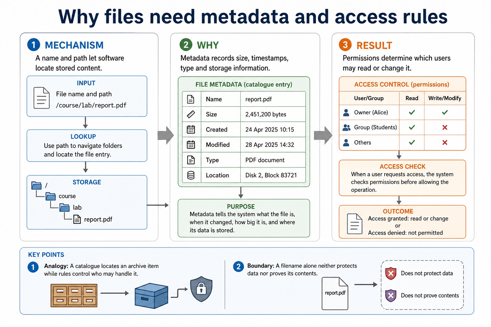

Text transcript

- A name and path let software locate stored content.
- Metadata records size, timestamps, type and storage information.
- Permissions determine which users may read or change it.

#### Why memory needs allocation and protection

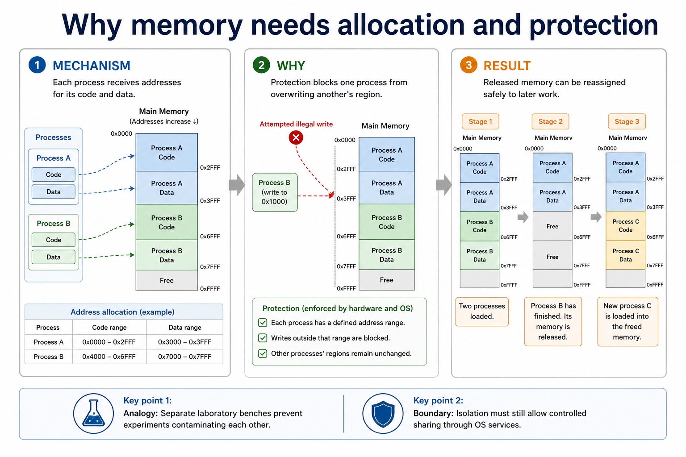

Text transcript

- Each process receives addresses for its code and data.
- Protection blocks one process from overwriting another's region.
- Released memory can be reassigned safely to later work.

#### How time-slicing creates apparent simultaneity

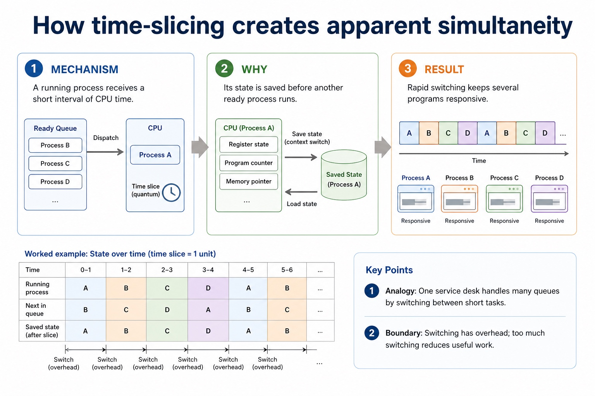

Text transcript

- A running process receives a short interval of CPU time.
- Its state is saved before another ready process runs.
- Rapid switching keeps several programs responsive.

#### How OS services form one control layer

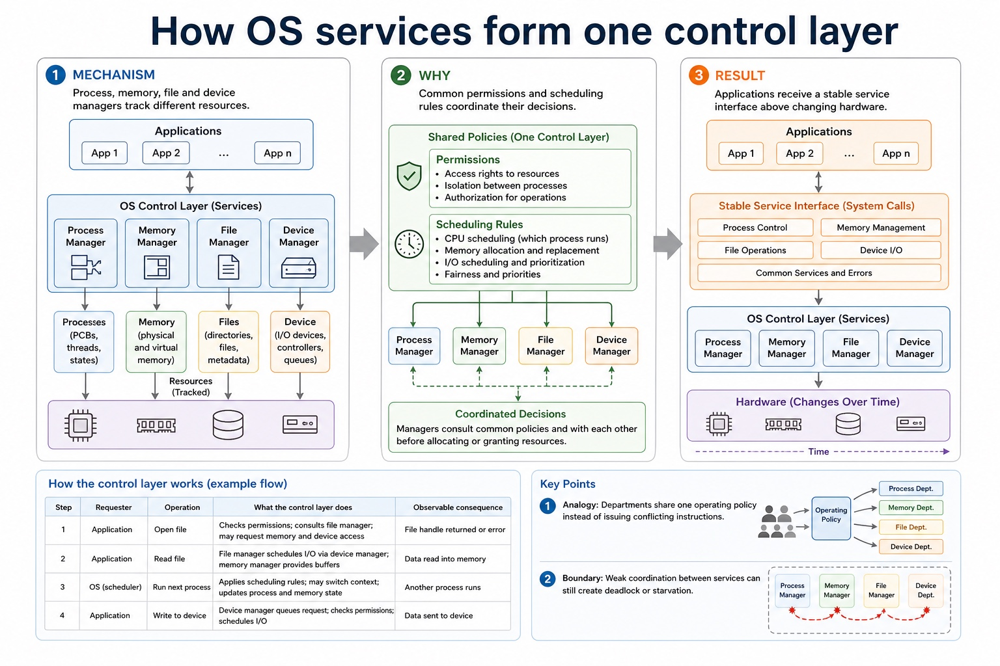

Text transcript

- Process, memory, file and device managers track different resources.
- Common permissions and scheduling rules coordinate their decisions.
- Applications receive a stable service interface above changing hardware.

#### Command line interface: precise text commands

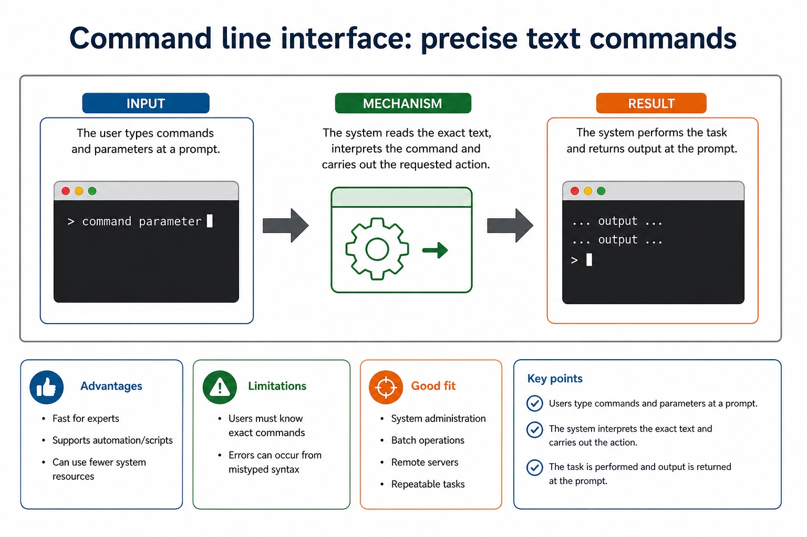

Text transcript

- How it works The user types commands and parameters at a prompt.
- Advantages Fast for experts, supports automation/scripts, can use fewer system resources.
- Limitations Users must know exact commands; errors can occur from mistyped syntax.
- Good fit System administration, batch operations, remote servers and repeatable tasks.

#### Compare interface suitability by scenario

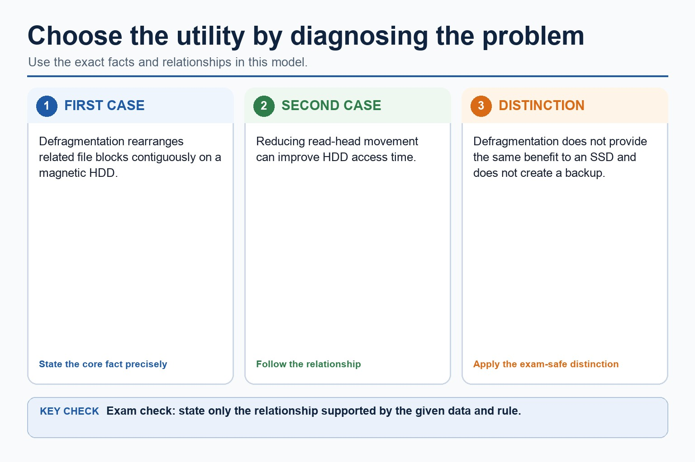

Text transcript

- Scenario
- Likely suitable interface
- Expert admin repeats a file operation
- Commands/scripts are efficient for repeatable precise tasks.
- Novice edits photos
- Visual feedback and direct manipulation support the task.
- Customer buys a train ticket
- Menu-driven

#### A user interface allows interaction with a computer system

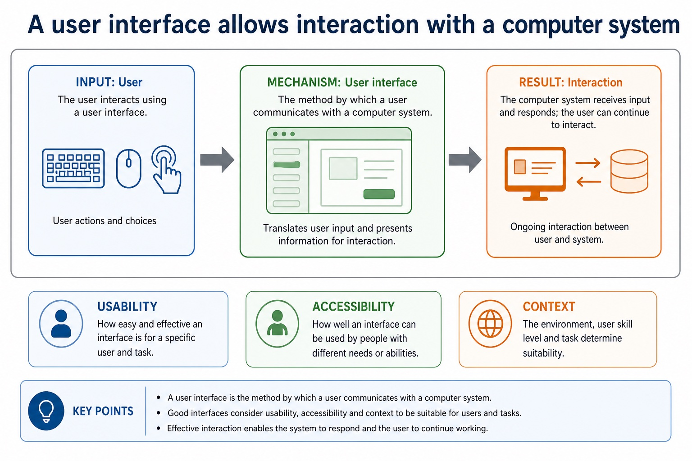

Text transcript

- User interface The method by which a user communicates with a computer system.
- Usability How easy and effective an interface is for a specific user and task.
- Accessibility How well an interface can be used by people with different needs or abilities.
- Context The environment, user skill level and task determine suitability.

#### Graphical user interface: visual objects and pointer actions

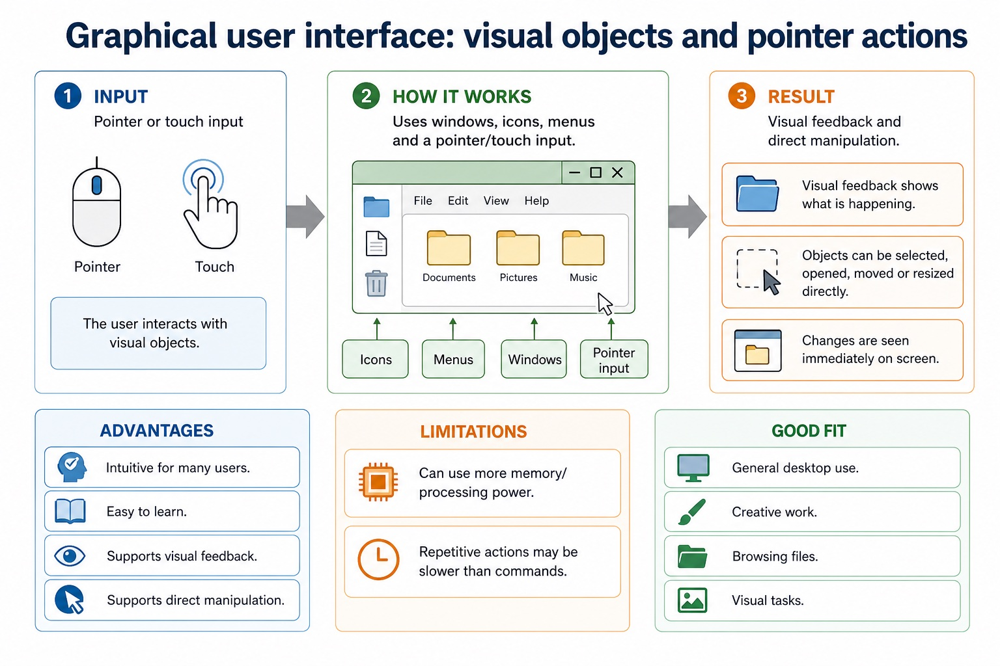

Text transcript

- How it works Uses windows, icons, menus and a pointer/touch input.
- Advantages Intuitive for many users, easy to learn, supports visual feedback and direct manipulation.
- Limitations Can use more memory/processing power; repetitive actions may be slower than commands.
- Good fit General desktop use, creative work, browsing files and visual tasks.

#### Libraries provide reusable routines and modules

Text transcript

- Purpose Provide pre-written, tested routines that programs can use.
- Examples Mathematical functions, input/output routines, graphics or string-handling routines.
- Benefits Saves development time, reduces duplication and may improve reliability.
- Requirement Calls to library routines must be linked or made available at run time.

#### Menu-driven interface: choose from fixed options

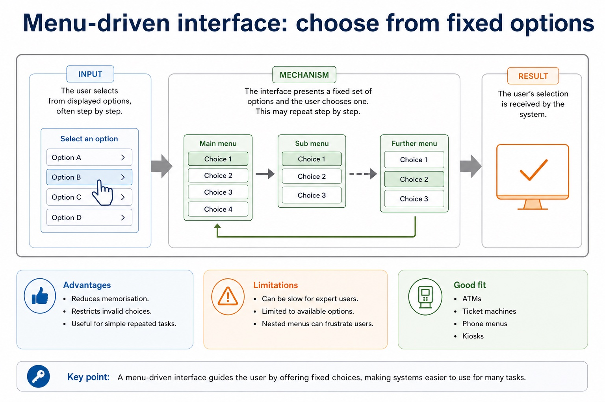

Text transcript

- How it works The user selects from displayed options, often step by step.
- Advantages Reduces memorisation, restricts invalid choices, useful for simple repeated tasks.
- Limitations Can be slow for expert users; limited to available options; nested menus can frustrate users.
- Good fit ATMs, ticket machines, phone menus and kiosks.

#### Natural language interface: ordinary language input

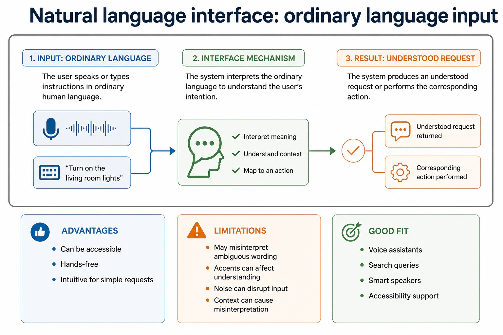

Text transcript

- How it works The user speaks or types instructions in ordinary human language.
- Advantages Can be accessible, hands-free and intuitive for simple requests.
- Limitations May misinterpret ambiguous wording, accents, noise or context.
- Good fit Voice assistants, search queries, smart speakers and accessibility support.

#### Code generation produces object code

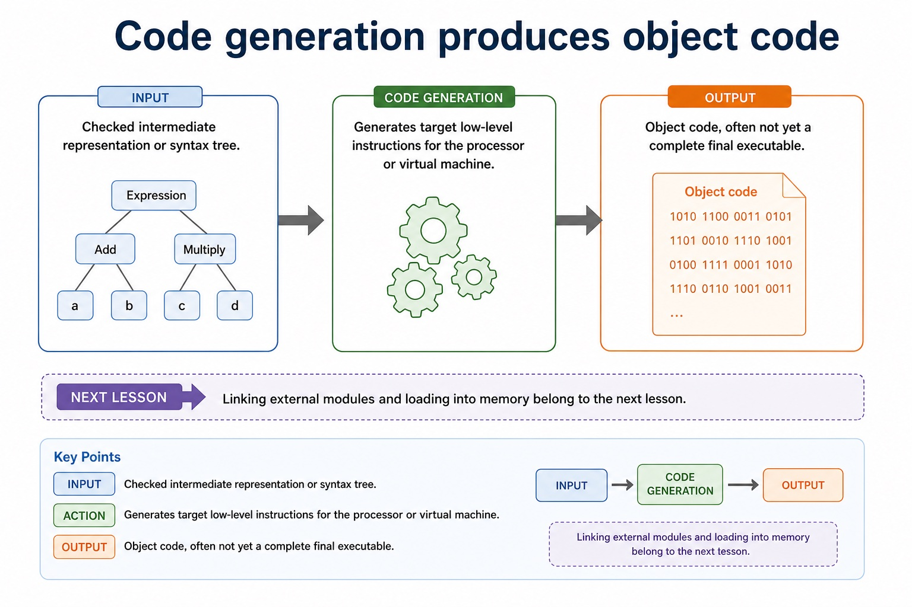

Text transcript

- Input Checked intermediate representation or syntax tree.
- Action Generates target low-level instructions for the processor or virtual machine.
- Output Object code, often not yet a complete final executable.
- Boundary Linking external modules and loading into memory belong to the next lesson.

#### Lexical analysis converts character streams into tokens

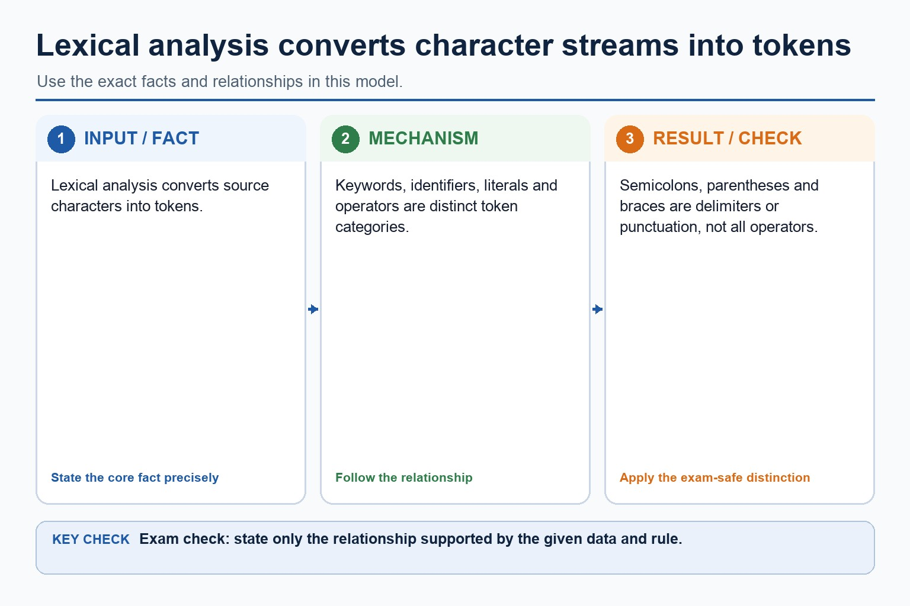

Text transcript

- Lexical analysis converts source characters into tokens.
- Keywords, identifiers, literals and operators are distinct token categories.
- Semicolons, parentheses and braces are delimiters or punctuation, not all operators.

#### Optimisation improves code without changing what it does

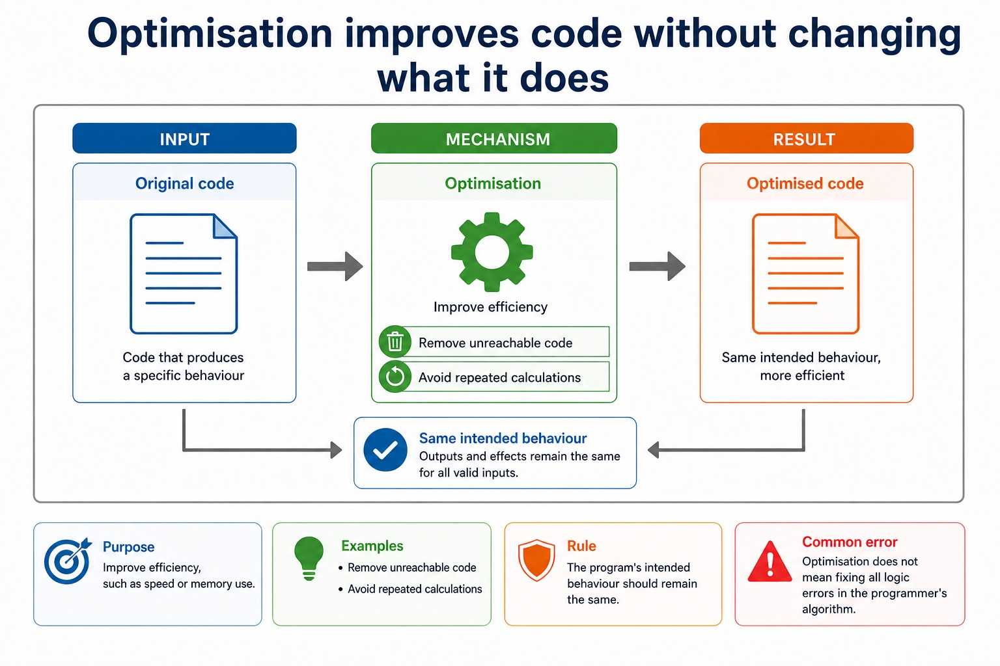

Text transcript

- Purpose Improve efficiency, such as speed or memory use.
- Examples Remove unreachable code or avoid repeated calculations.
- Rule The program's intended behaviour should remain the same.
- Common error Optimisation does not mean fixing all logic errors in the programmer's algorithm.

#### The compilation pipeline transforms source code into object code

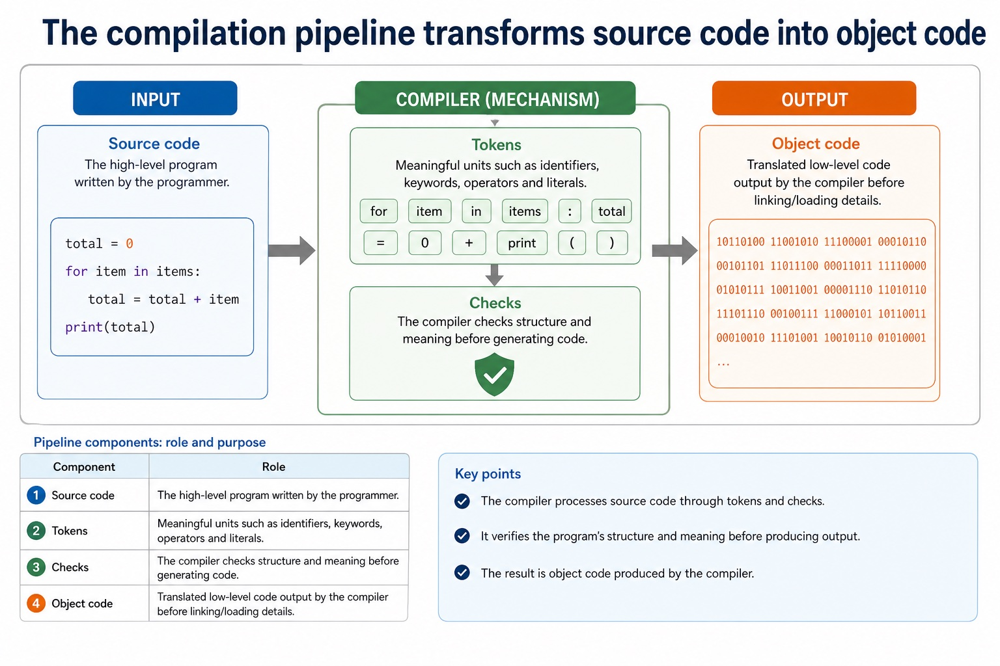

Text transcript

- Source code The high-level program written by the programmer.
- Tokens Meaningful units such as identifiers, keywords, operators and literals.
- Checks The compiler checks structure and meaning before generating code.
- Object code Translated low-level code output by the compiler before linking/loading details.

#### Semantic analysis checks meaning and context

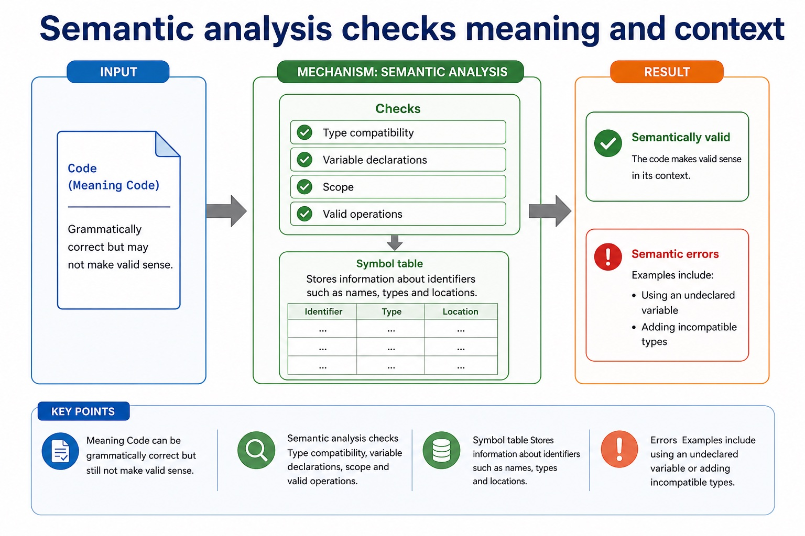

Text transcript

- Meaning Code can be grammatically correct but still not make valid sense.
- Checks Type compatibility, variable declarations, scope and valid operations.
- Symbol table Stores information about identifiers such as names, types and locations.
- Errors Examples include using an undeclared variable or adding incompatible types.

#### Syntax analysis checks grammar and program structure

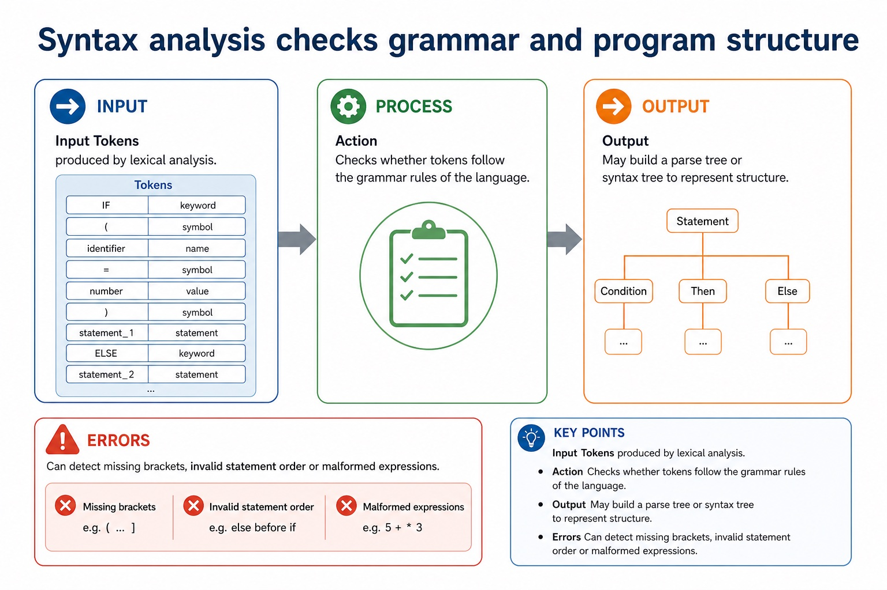

Text transcript

- Input Tokens produced by lexical analysis.
- Action Checks whether tokens follow the grammar rules of the language.
- Output May build a parse tree or syntax tree to represent structure.
- Errors Can detect missing brackets, invalid statement order or malformed expressions.

#### Compare the roles without blending them

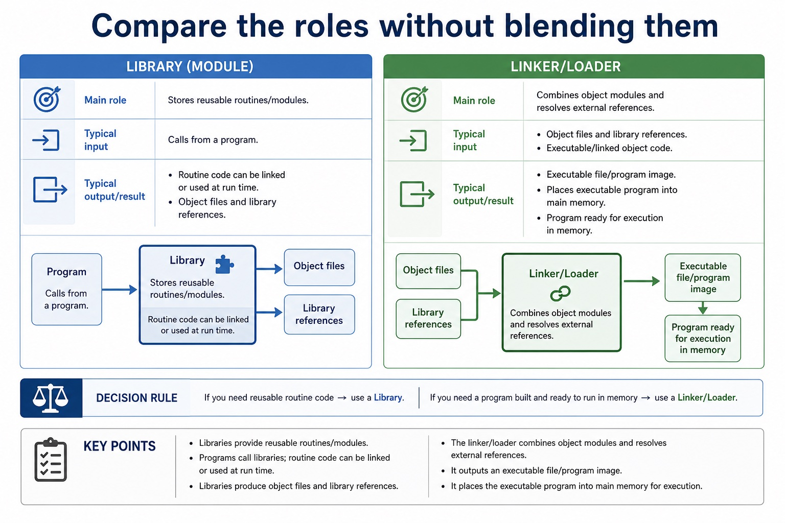

Text transcript

- Main role
- Typical input
- Typical output/result
- Stores reusable routines/modules.
- Calls from a program.
- Routine code can be linked or used at run time.
- Combines object modules and resolves external references.
- Object files and library references.

#### The post-compilation pathway connects code and prepares execution

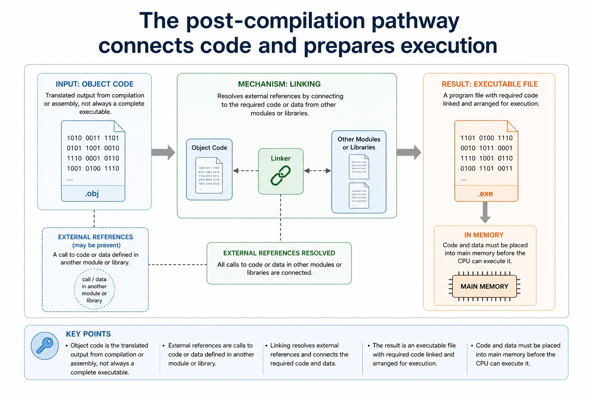

Text transcript

- Object code Translated output from compilation or assembly, not always a complete executable.
- External reference A call to code or data defined in another module or library.
- Executable file A program file with required code linked and arranged for execution.
- In memory Code and data must be placed into main memory before the CPU can execute it.

#### Linkers combine object modules and resolve references

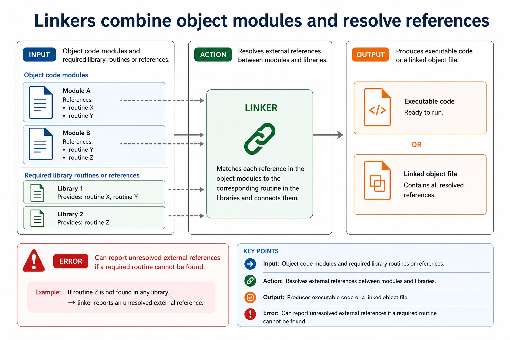

Text transcript

- Input Object code modules and required library routines or references.
- Action Resolves external references between modules and libraries.
- Output Produces executable code or a linked object file.
- Error Can report unresolved external references if a required routine cannot be found.

#### Loaders place executable code into memory

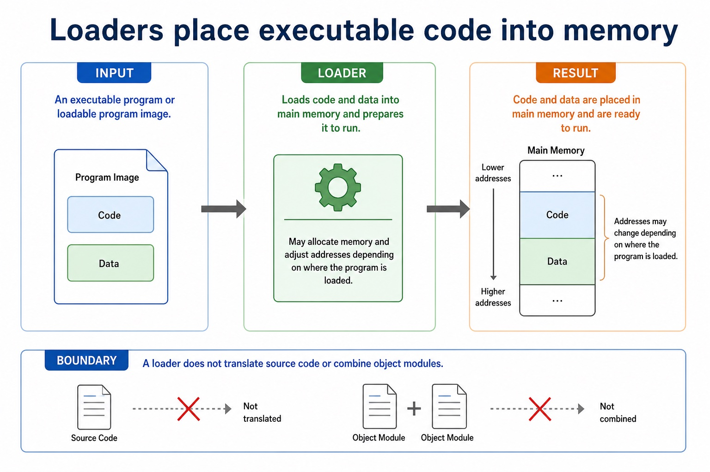

Text transcript

- Input An executable program or loadable program image.
- Action Loads code and data into main memory and prepares it to run.
- Addresses May allocate memory and adjust addresses depending on where the program is loaded.
- Boundary A loader does not translate source code or combine object modules.

#### Static and dynamic linking affect when library code is connected

Text transcript

- Static linking Library code is copied into the executable at link time.
- Static trade-off Executable can be more self-contained but may be larger.
- Dynamic linking Library code is linked at load time or run time from a shared library.
- Dynamic trade-off Can reduce duplication, but the required shared library must be available and compatible.

#### Similar terms that the exam likes to separate

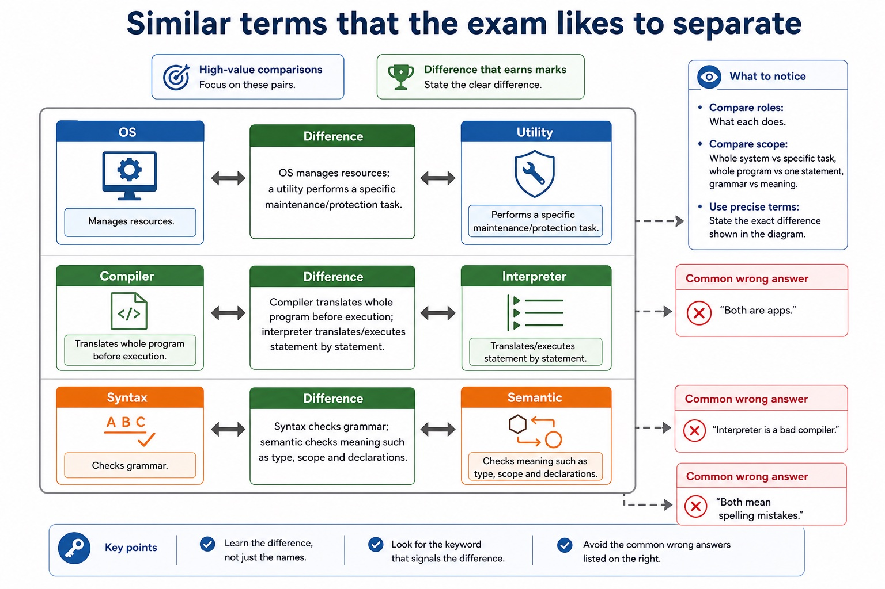

Text transcript

- High-value comparisons
- Difference that earns marks
- Common wrong answer
- OS vs utility
- OS manages resources; a utility performs a specific maintenance/protection task.
- "Both are apps."
- Compiler vs interpreter
- Compiler translates whole program before execution; interpreter translates/executes statement by statement.

#### Turn a weak answer into marks

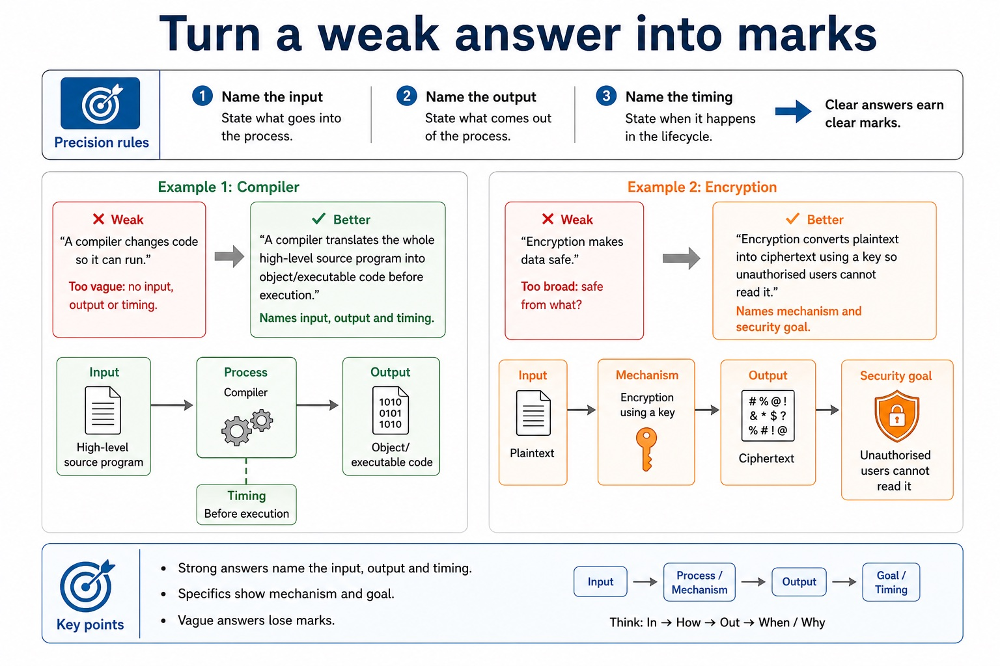

Text transcript

- Precision rules
- Weak "A compiler changes code so it can run." Too vague: no input, output or timing.
- Better "A compiler translates the whole high-level source program into object/executable code before execution." Names input, output and timing.
- Weak "Encryption makes data safe." Too broad: safe from what?
- Better "Encryption converts plaintext into ciphertext using a key so unauthorised users cannot read it." Names mechanism and security goal.

#### Section 5 in one screen

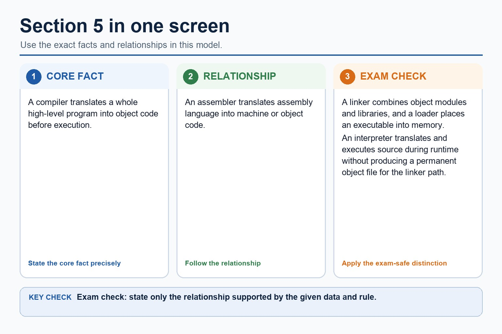

Text transcript

- A compiler translates a whole high-level program into object code before execution.
- An assembler translates assembly language into machine or object code.
- A linker combines object modules and libraries, and a loader places an executable into memory.
- An interpreter translates and executes source during runtime without producing a permanent object file for the linker path.

Open precise terminology and exam facts

- Required utility categories are disk formatter, virus checker, defragmentation, disk contents analysis and repair, file compression and backup software.
- Software under development is often constructed using existing code from program libraries. Explain developer benefits, including the use of dynamically linked library files.
- A disk formatter prepares a storage medium with file-system structures. A virus checker scans for, quarantines and removes malware. A disk defragmenter rearranges fragmented file blocks on a magnetic disk; it is not a speed treatment for SSDs.
- A disk contents analysis/repair utility examines file-system structures, reports faults and attempts defined repairs. Compression reduces file size and backup creates a separate recoverable copy. Encryption may be useful additional protection, but it does not replace any of the six named syllabus utilities.
- Defragmentation rearranges fragmented blocks on a magnetic disk; disk analysis can locate a file-system fault and a repair operation attempts to correct it.
- Software under development is often constructed using existing code from program libraries. A program library is a collection of reusable routines or modules, so a developer can call tested implementations instead of rewriting common mathematical, input/output, graphics or string operations.
- Benefits to the developer include shorter development time, less duplicated source code, reuse of tested routines and more consistent maintenance. A dynamically linked library (DLL) is connected when a program loads or calls it rather than copying all library code into every executable.
- DLL files can reduce executable size and memory duplication, support reuse and allow one shared update. They also create dependency and version risks: a missing or incompatible DLL can stop a program loading or change behaviour.
- A runtime error (run-time error) occurs during execution; identify its cause, use runtime diagnostics to locate it and correct the responsible code.
- One benefit of a program library is that a developer can reuse existing tested code while software is under development.

### Worked example

1. Choose the utility from the fault
2. Use a formatter to prepare a new storage medium, disk analysis/repair for file-system errors, a backup to recover a deleted file, and compression to reduce transfer size.
3. Choose by the operation required, not by calling every tool 'maintenance'.

Beyond syllabus / 延伸知识（不要求背诵）: production build systems automate translation, linking, testing and packaging, while the syllabus examines the purpose of each stage separately.
## 3. Practice by question type

### Question 1 - foundation - explain - 2 marks

How do program libraries support software under development?

**Answer:** They supply existing reusable routines or modules, avoiding the need to write common code again.

**Marking guidance:** Award one mark for each distinct, technically accurate point or method step.

**Common error:** For the command word explain, perform that exact action; do not replace it with an unrelated fact.

### Question 2 - application - identify - 4 marks

A computer has a new storage medium and another disk reports file-system errors. Identify the utility for each task and explain its purpose.

**Answer:** disk formatter for the new medium; formatter creates/prepares file-system structures; disk contents analysis/repair utility for the faulty disk; it examines structures and reports/attempts repair of faults

**Marking guidance:** Do not accept defragmentation as formatting or as a general file-system repair operation.

**Common error:** Do not repeat the same point in different words; each mark needs a separate idea or method step.

### Question 3 - transfer - explain - 4 marks

Explain two benefits and one drawback of using a dynamically linked library.

**Answer:** shared reusable code / avoids rewriting; smaller executables or reduced duplicate memory/storage; shared library can be updated once; missing/incompatible DLL can stop or alter programs

**Marking guidance:** Do not accept 'saves space' unless duplication or executable size is explained.

**Common error:** Do not copy the worked example unchanged; transfer the method and check it against the new context.

### Related past-paper indexes

| Reference | Marks | Command word | Question type |
|---|---:|---|---|
| 9618/13/S/24 Q7(ii) | 4 | complete | recall |
| 9618/11/S/24 Q3(b) | 3 | complete | write |
| 9618/12/W/24 Q4(c) | 3 | describe | write |
| 9618/11/S/24 Q3(a) | 2 | explain | write |

These are indexes only. Cambridge question and mark-scheme wording is not reproduced.

## 4. Summary and exam reminders

### Summary

- Define utility software, libraries and linked files with the exact technical vocabulary expected by the syllabus.
- Use the lesson method on a fresh context and show the intermediate decision, representation or calculation.
- Match the shape of the answer to the command word and the available marks.
- Check the final answer against the scenario instead of repeating a memorised sentence.

### Common error to correct

Students often call every program an operating system. Correction: an OS manages resources and provides services; an app performs user tasks.

### Exam technique

- Follow the command word: state gives a fact; explain links a cause to a consequence; compare covers both sides.
- Match the number of independent points or method steps to the available marks.
- For utility software, libraries and linked files, use the exact technical term before applying it to the scenario.
