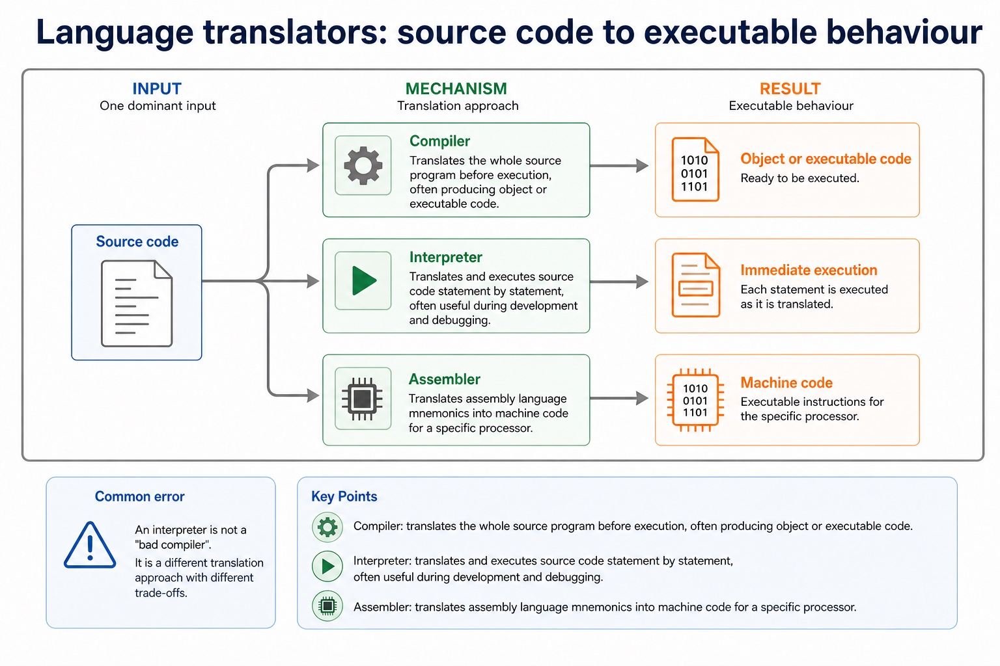
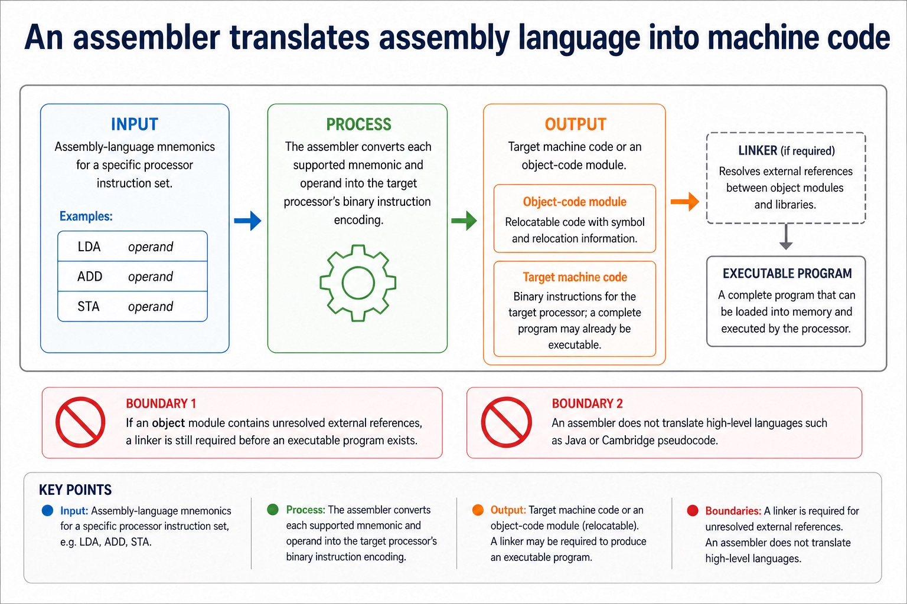
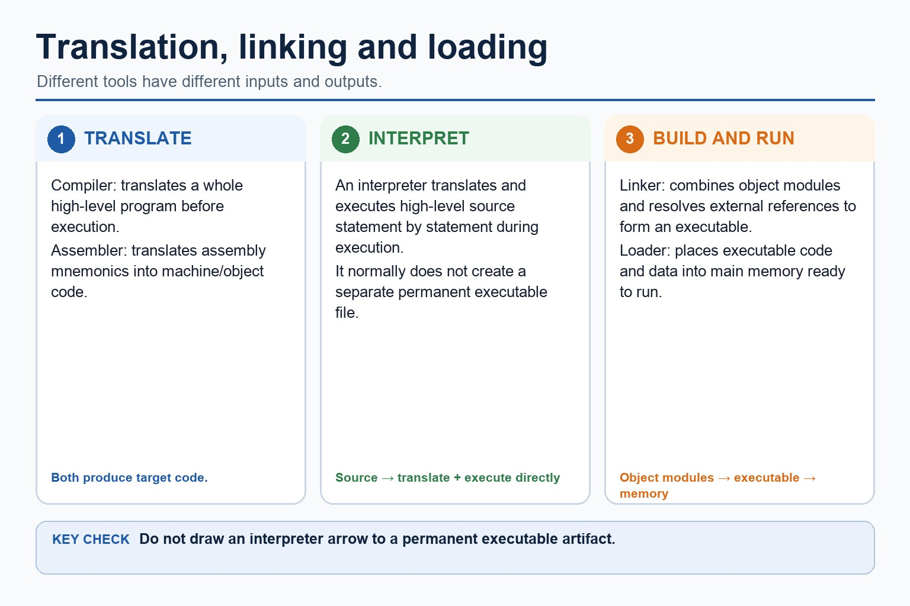
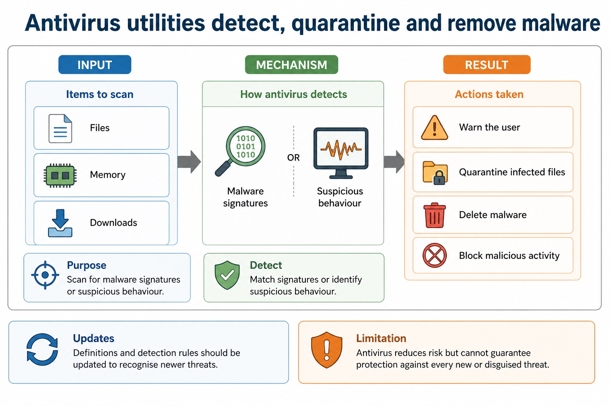
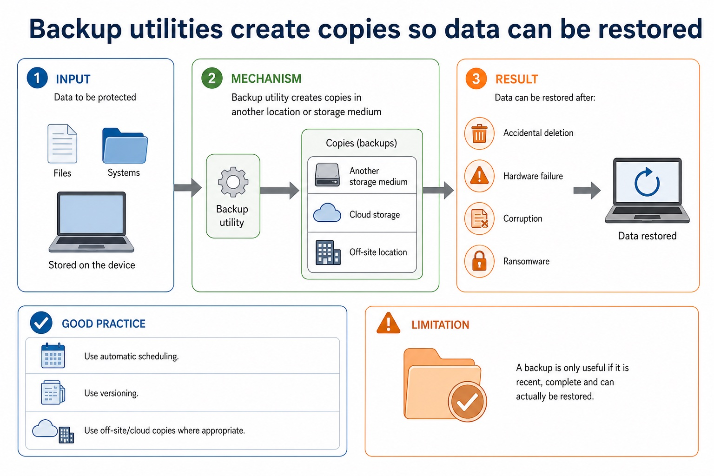
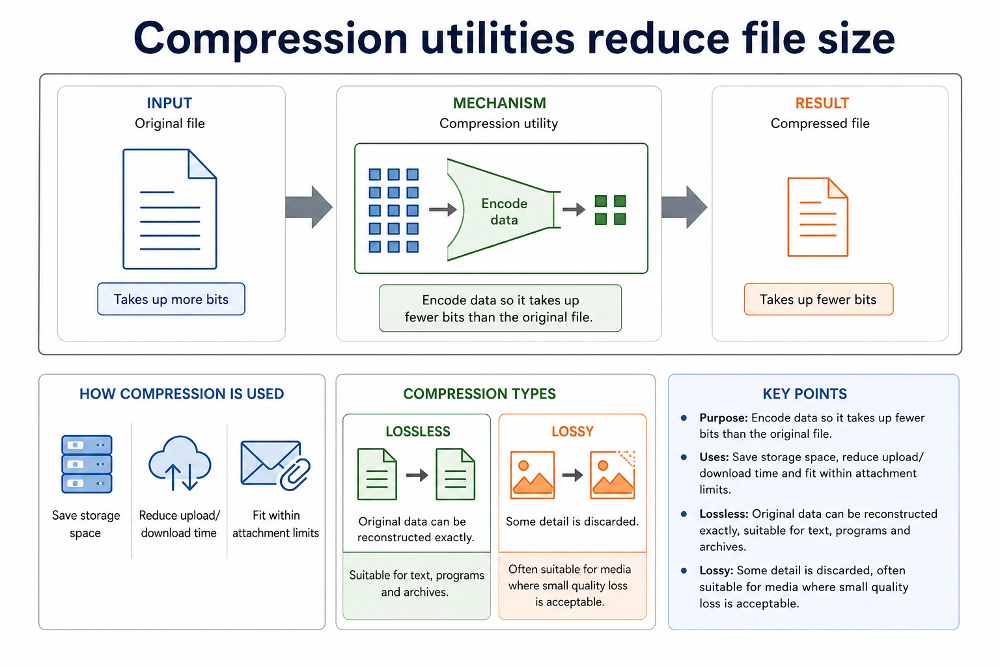
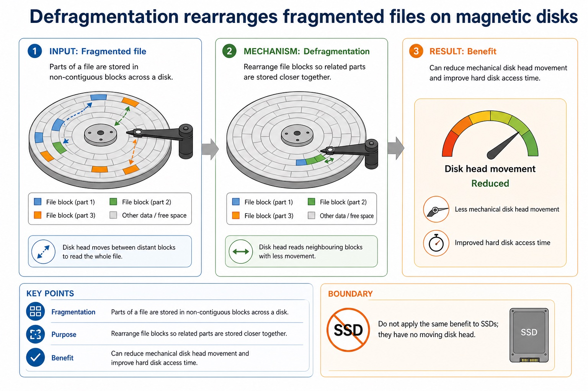
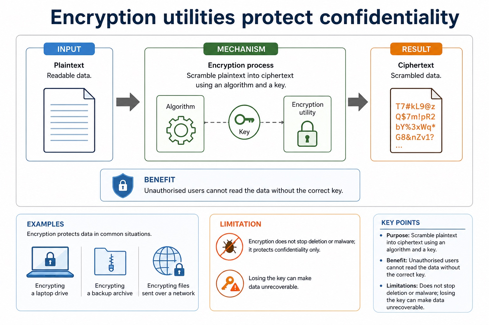

# Lesson 028: Assemblers, compilers and interpreters

**Course:** Cambridge International AS Level Computer Science 9618, 2027-2029 Version 2 
**Paper:** Paper 1 
**Syllabus:** Section 5: System software 
**Syllabus requirements:** S5.04 
**Pacing:** Flexible. Select the material set and practice depth needed by the learner.

## Teaching-depth menu

- **Quick route:** Use the diagnostic, learning objectives, first worked example and foundation question. Stop once the learner can explain the central distinction accurately.
- **Full route:** Use every knowledge-point material set, the worked method, the terminology check and all questions.
- **Deep route:** Add the prerequisite refresher, ask learners to connect the concept checklist, discuss the labelled extension and complete a transfer question without a model answer.

## 1. Prerequisite knowledge and quick diagnostic

Recall the main conclusion from Lesson 027: Utility software, libraries and linked files.

Ask the learner to give one accurate definition or method step before continuing. If they cannot, briefly revisit the named prerequisite rather than repeating the whole previous lesson.

## 2. Knowledge explanation

### 1. Assembler · Compiler · Interpreter (S5.04)

**Concept map:** assembler → compiler → interpreter

**Three-part explanation:**

1. An assembler translates assembly language, a compiler translates high-level language, and an interpreter translates and executes high-level language
2. An interpreter translates and executes a high-level language program statement by statement during execution, normally without producing a separate permanent object-code file
3. An assembler is needed to translate a processor-specific assembly-language program into machine code or object code

**Concrete cue:** An assembler is needed to translate a processor-specific assembly-language program into machine code or object code. A compiler is needed to translate a whole high-level language program before execution, normally…

#### Language translators: source code to executable behaviour

Text transcript

- Compiler
- Translates the whole source program before execution, often producing object or executable code.
- Interpreter
- Translates and executes source code statement by statement, often useful during development and debugging.
- Assembler
- Translates assembly language mnemonics into machine code for a specific processor.
- Common error
- An interpreter is not a "bad compiler". It is a different translation approach with different trade-offs.

#### An assembler translates assembly language into machine code

Text transcript

- An assembler translates assembly-language mnemonics into machine code or an object-code module.
- Machine code uses the instruction set and binary encodings of the target processor.
- An object module may still need a linker to combine modules and resolve external library references before an executable can be produced.
- An assembler does not translate high-level languages such as Java or Cambridge pseudocode.

#### After translation, linking and loading may still be needed

Text transcript

- A compiler translates a whole high-level program before execution.
- An interpreter translates and executes high-level source statement by statement during execution.
- An interpreter normally does not create a separate permanent executable file.
- An assembler translates assembly mnemonics into machine or object code.
- A linker combines object modules and resolves references; a loader places executable code and data into memory.

Precise syllabus wording

Explain why assembler, compiler and interpreter are needed.

An assembler translates assembly language, a compiler translates high-level language, and an interpreter translates and executes high-level language.

### Supporting diagram library

#### Antivirus utilities detect, quarantine and remove malware

Text transcript

- Purpose Scan files, memory or downloads for malware signatures or suspicious behaviour.
- Actions Warn the user, quarantine infected files, delete malware or block malicious activity.
- Updates Definitions and detection rules should be updated to recognise newer threats.
- Limitation Antivirus reduces risk but cannot guarantee protection against every new or disguised threat.

#### Backup utilities create copies so data can be restored

Text transcript

- Purpose Create copies of files or systems in another location or storage medium.
- Benefit Data can be restored after accidental deletion, hardware failure, corruption or ransomware.
- Good practice Use automatic scheduling, versioning and off-site/cloud copies where appropriate.
- Limitation A backup is only useful if it is recent, complete and can actually be restored.

#### Compression utilities reduce file size

Text transcript

- Purpose Encode data so it takes up fewer bits than the original file.
- Uses Save storage space, reduce upload/download time and fit within attachment limits.
- Lossless Original data can be reconstructed exactly, suitable for text, programs and archives.
- Lossy Some detail is discarded, often suitable for media where small quality loss is acceptable.

#### Utility software performs maintenance and support tasks

Text transcript

- System software Software that supports the operation and management of the computer system.
- Utility software System software designed for a specific maintenance, protection or management task.
- Not application software It supports the system rather than directly producing user documents, games or media.
- Scenario link The correct utility depends on whether the problem is loss, size, confidentiality, fragmentation or malware.

#### Defragmentation rearranges fragmented files on magnetic disks

Text transcript

- Fragmentation Parts of a file are stored in non-contiguous blocks across a disk.
- Purpose Rearrange file blocks so related parts are stored closer together.
- Benefit Can reduce mechanical disk head movement and improve hard disk access time.
- Boundary Do not apply the same benefit to SSDs; they have no moving disk head.

#### Encryption utilities protect confidentiality

Text transcript

- Purpose Scramble plaintext into ciphertext using an algorithm and a key.
- Benefit Unauthorised users cannot read the data without the correct key.
- Examples Encrypting a laptop drive, a backup archive or files sent over a network.
- Limitation Encryption does not stop deletion or malware; losing the key can make data unrecoverable.

Open precise terminology and exam facts

- An assembler translates assembly language, a compiler translates high-level language, and an interpreter translates and executes high-level language.
- An assembler is needed to translate a processor-specific assembly-language program into machine code or object code. A compiler is needed to translate a whole high-level language program before execution, normally producing target/object code. An interpreter translates and executes a high-level language program statement by statement during execution, normally without producing a separate permanent object-code file.
- Compiler advantages include faster repeated execution after translation, distribution without the source code and translation checks across the whole program. Disadvantages include a separate compilation step and an error list that may need several corrections before execution. Interpreter advantages include immediate statement-level feedback and convenient incremental testing. Disadvantages include repeated translation overhead, slower execution and needing the interpreter and usually the source program at run time.
- A justified choice must connect the mechanism to the scenario: an interpreter can suit development and debugging; a compiler can suit repeated use or distribution; an assembler is required for assembly source. These are advantages and disadvantages of the translation approaches, not universal claims that one tool is always better.

### Worked example

1. Choose tools across development and deployment
2. During development, an interpreter can execute each statement and stop near a fault, giving quick feedback.
3. For final distribution, a compiler can translate the whole high-level program before execution and provide target/object or executable code without distributing the source.
4. A processor-specific assembly routine requires an assembler because its mnemonic instructions must become the target processor's machine code.

Beyond syllabus / 延伸知识（不要求背诵）: production build systems automate translation, linking, testing and packaging, while the syllabus examines the purpose of each stage separately.
## 3. Practice by question type

### Question 1 - foundation - compare - 6 marks

Compare a compiler and an interpreter using two advantages and two disadvantages, then justify the translator used for an assembly-language routine.

**Answer:** compiler translates the whole high-level program before execution and produces target/object code; compiler advantage linked to repeated execution or distribution without source; compiler disadvantage linked to separate translation or error-list workflow; interpreter translates/executes statements during execution and gives immediate feedback; interpreter disadvantage linked to repeated translation, slower execution or run-time dependency; assembler selected and justified for assembly-language-to-machine/object-code translation

**Marking guidance:** Do not award vague claims such as 'compiler is faster' or 'interpreter is easier' without the mechanism and scenario.

**Common error:** For the command word compare, perform that exact action; do not replace it with an unrelated fact.

### Question 2 - application - explain - 2 marks

Why is an assembler needed?

**Answer:** It translates assembly-language mnemonics and operands into machine or object code for the target processor.

**Marking guidance:** Award one mark for each distinct, technically accurate point or method step.

**Common error:** Do not repeat the same point in different words; each mark needs a separate idea or method step.

### Question 3 - transfer - apply - 2 marks

Which translator is required for assembly language?

**Answer:** An assembler.

**Marking guidance:** Award one mark for each distinct, technically accurate point or method step.

**Common error:** Do not copy the worked example unchanged; transfer the method and check it against the new context.

### Related past-paper indexes

| Reference | Marks | Command word | Question type |
|---|---:|---|---|
| 9618/12/W/25 Q10(a) | 4 | explain | explain |
| 9618/13/S/25 Q3(a) | 4 | complete | debug |
| 9618/13/S/25 Q3(b) | 4 | complete | debug |
| 9618/13/S/25 Q3(c) | 4 | complete | debug |

These are indexes only. Cambridge question and mark-scheme wording is not reproduced.

## 4. Summary and exam reminders

### Summary

- Define assemblers, compilers and interpreters with the exact technical vocabulary expected by the syllabus.
- Use the lesson method on a fresh context and show the intermediate decision, representation or calculation.
- Match the shape of the answer to the command word and the available marks.
- Check the final answer against the scenario instead of repeating a memorised sentence.

### Common error to correct

Students often call every program an operating system. Correction: an OS manages resources and provides services; an app performs user tasks.

### Exam technique

- Follow the command word: state gives a fact; explain links a cause to a consequence; compare covers both sides.
- Match the number of independent points or method steps to the available marks.
- For assemblers, compilers and interpreters, use the exact technical term before applying it to the scenario.
