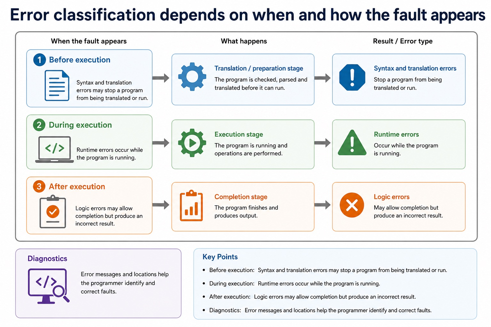
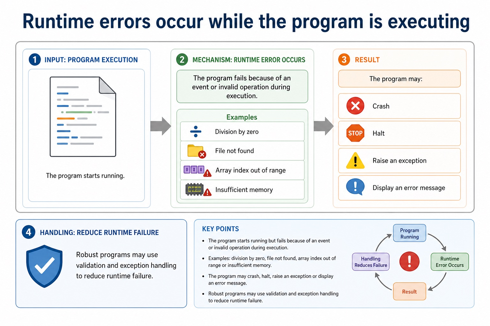
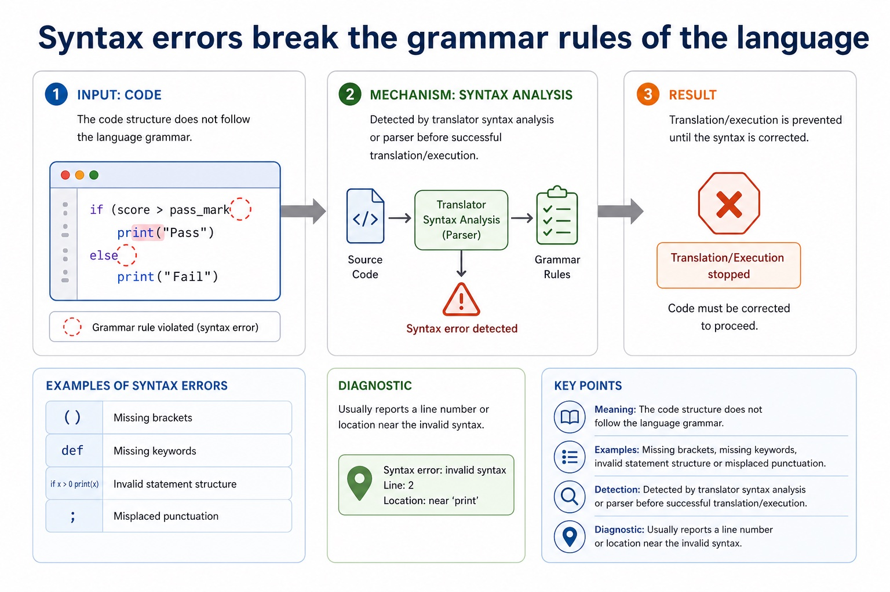
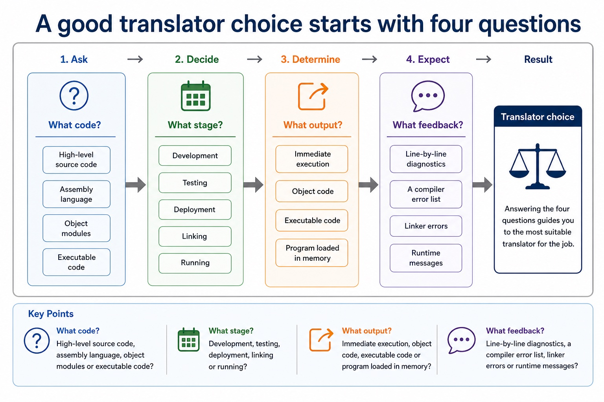
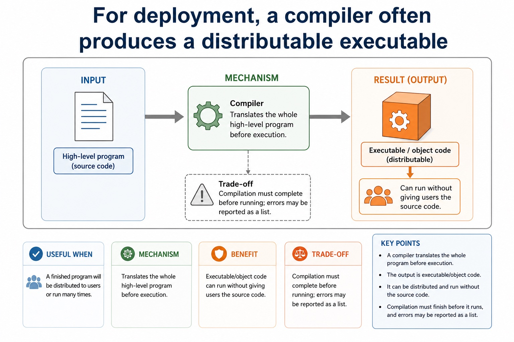
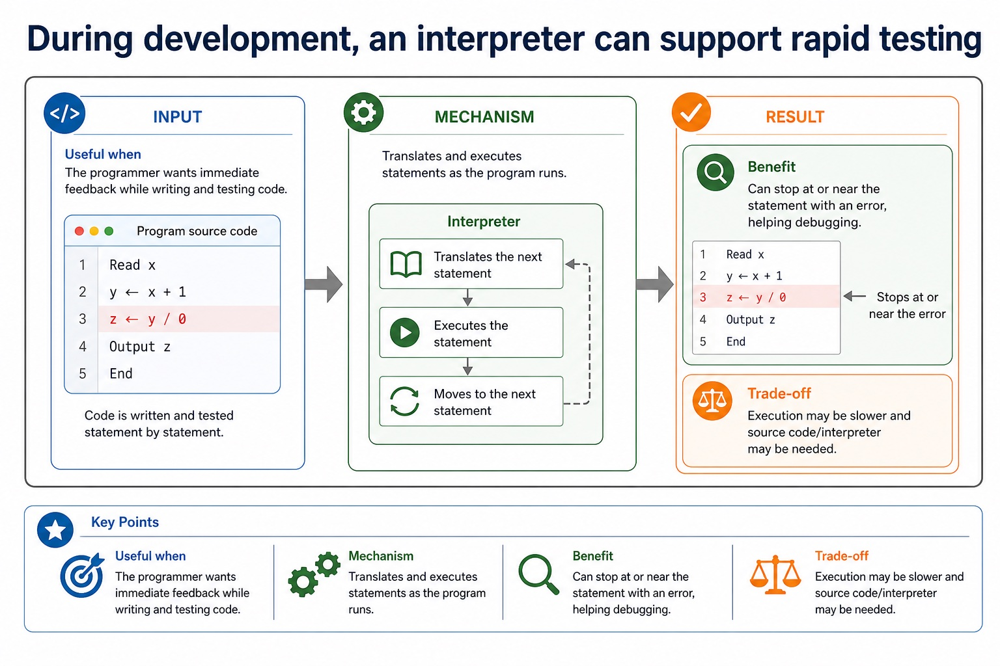
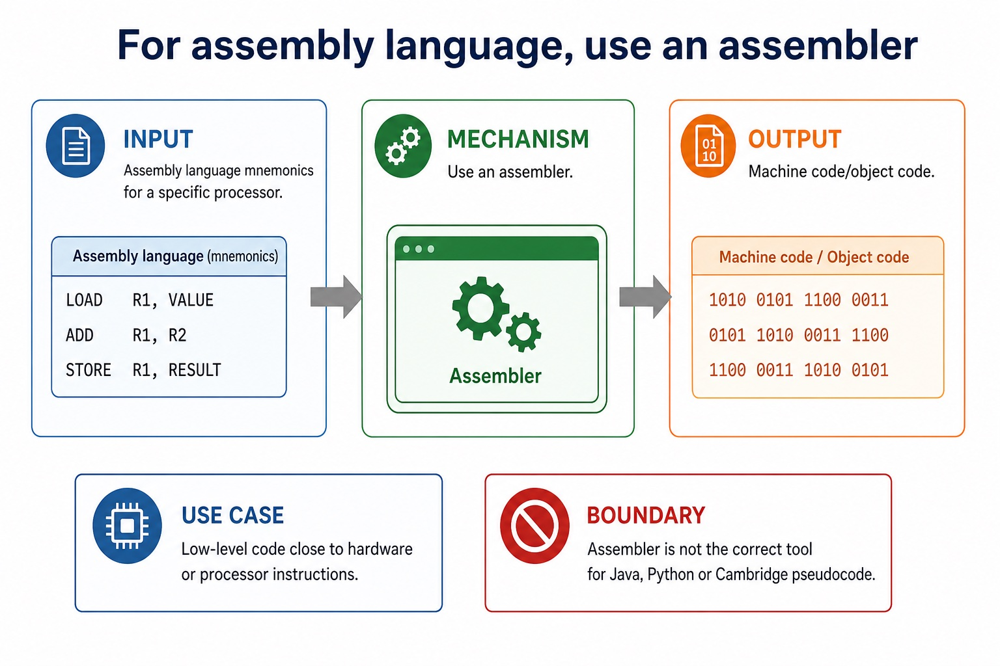

# Lesson 029: Choosing a translator and understanding Java translation

**Course:** Cambridge International AS Level Computer Science 9618, 2027-2029 Version 2 
**Paper:** Paper 1 
**Syllabus:** Section 5: System software 
**Syllabus requirements:** S5.05, S5.06 
**Pacing:** Flexible. Select the material set and practice depth needed by the learner.

## Teaching-depth menu

- **Quick route:** Use the diagnostic, learning objectives, first worked example and foundation question. Stop once the learner can explain the central distinction accurately.
- **Full route:** Use every knowledge-point material set, the worked method, the terminology check and all questions.
- **Deep route:** Add the prerequisite refresher, ask learners to connect the concept checklist, discuss the labelled extension and complete a transfer question without a model answer.

## 1. Prerequisite knowledge and quick diagnostic

Recall S5.04 before starting this lesson.

Ask the learner to give one accurate definition or method step before continuing. If they cannot, briefly revisit the named prerequisite rather than repeating the whole previous lesson.

### Optional prerequisite refresher

- An assembler translates assembly language, a compiler translates high-level language, and an interpreter translates and executes high-level language.
- Explain why assembler, compiler and interpreter are needed.

## 2. Knowledge explanation

### 1. Compiler · Interpreter · Advantages · Disadvantages (S5.05)

**Concept map:** compiler → interpreter → advantages → disadvantages

**Three-part explanation:**

1. Explain the benefits and drawbacks of a compiler and an interpreter, and justify which translator is appropriate for a stated use
2. Interpreter advantages include immediate statement-level feedback and convenient incremental testing
3. These are advantages and disadvantages of the translation approaches, not universal claims that one tool is always better

**Concrete cue:** Explain the benefits and drawbacks of a compiler and an interpreter, and justify which translator is appropriate for a stated use.

#### An interpreter translates and executes statements as the program runs

Text transcript

- Input High-level language source code.
- Output No separate permanent object code is normally produced.
- Advantages Useful during development because errors can be found statement by statement.
- Limitations Program may run more slowly because translation happens during execution; source code is needed.

#### Error feedback affects the best choice during development

Text transcript

- Compiler May provide a list of syntax/translation errors after trying to compile.
- Interpreter May stop at the current statement, useful for step-by-step testing.
- Linker May report unresolved external references after object code exists.
- Testing Logic errors may still need test data and tracing regardless of translator.

#### Language translators: source code to executable behaviour

Text transcript

- Compiler
- Translates the whole source program before execution, often producing object or executable code.
- Interpreter
- Translates and executes source code statement by statement, often useful during development and debugging.
- Assembler
- Translates assembly language mnemonics into machine code for a specific processor.
- Common error
- An interpreter is not a "bad compiler". It is a different translation approach with different trade-offs.

#### Comparison: same goal, different route

Text transcript

- A compiler translates a whole high-level program before execution and produces target or object code; a linked executable can run repeatedly without the source.
- An interpreter translates and executes high-level statements during execution and normally produces no separate permanent object-code file.
- An assembler translates assembly-language mnemonics into target machine code or an object module for a specific processor instruction set.
- If an assembler or compiler produces object modules, a linker may still be required before there is an executable program.
- Choose the translator from the input language and the development or deployment need; do not claim that every assembler output is immediately executable.

Precise syllabus wording

Compare compiler and interpreter advantages/disadvantages and justify use.

Explain the benefits and drawbacks of a compiler and an interpreter, and justify which translator is appropriate for a stated use.

### 2. Java · Partly · Compiled · Interpreted (S5.06)

**Concept map:** Java → partly → compiled → interpreted

**Three-part explanation:**

1. Java in console mode is partly compiled and partly interpreted
2. A high-level program may be partly compiled and partly interpreted
3. An interpreter translates and executes a high-level language program statement by statement during execution, normally without producing a separate permanent object-code file

**Concrete cue:** A high-level program may be partly compiled and partly interpreted; Java in console mode is the required example.

#### Translation pathway

Text transcript

- High-level source code Human-readable instructions such as Python, Java or pseudocode-like code.
- Translator Compiler/interpreter converts or executes the source language.
- Object / executable / machine code Low-level code that the processor can execute directly or as part of a build process.
- Error feedback Syntax and translation errors must be reported so the programmer can correct them.

Precise syllabus wording

Understand that Java is partly compiled and partly interpreted.

A high-level program may be partly compiled and partly interpreted; Java in console mode is the required example.

### Supporting diagram library

#### Antivirus utilities detect, quarantine and remove malware

Text transcript

- Purpose Scan files, memory or downloads for malware signatures or suspicious behaviour.
- Actions Warn the user, quarantine infected files, delete malware or block malicious activity.
- Updates Definitions and detection rules should be updated to recognise newer threats.
- Limitation Antivirus reduces risk but cannot guarantee protection against every new or disguised threat.

#### Backup utilities create copies so data can be restored

Text transcript

- Purpose Create copies of files or systems in another location or storage medium.
- Benefit Data can be restored after accidental deletion, hardware failure, corruption or ransomware.
- Good practice Use automatic scheduling, versioning and off-site/cloud copies where appropriate.
- Limitation A backup is only useful if it is recent, complete and can actually be restored.

#### Compression utilities reduce file size

Text transcript

- Purpose Encode data so it takes up fewer bits than the original file.
- Uses Save storage space, reduce upload/download time and fit within attachment limits.
- Lossless Original data can be reconstructed exactly, suitable for text, programs and archives.
- Lossy Some detail is discarded, often suitable for media where small quality loss is acceptable.

#### Utility software performs maintenance and support tasks

Text transcript

- System software Software that supports the operation and management of the computer system.
- Utility software System software designed for a specific maintenance, protection or management task.
- Not application software It supports the system rather than directly producing user documents, games or media.
- Scenario link The correct utility depends on whether the problem is loss, size, confidentiality, fragmentation or malware.

#### Defragmentation rearranges fragmented files on magnetic disks

Text transcript

- Fragmentation Parts of a file are stored in non-contiguous blocks across a disk.
- Purpose Rearrange file blocks so related parts are stored closer together.
- Benefit Can reduce mechanical disk head movement and improve hard disk access time.
- Boundary Do not apply the same benefit to SSDs; they have no moving disk head.

#### Encryption utilities protect confidentiality

Text transcript

- Purpose Scramble plaintext into ciphertext using an algorithm and a key.
- Benefit Unauthorised users cannot read the data without the correct key.
- Examples Encrypting a laptop drive, a backup archive or files sent over a network.
- Limitation Encryption does not stop deletion or malware; losing the key can make data unrecoverable.

#### An assembler translates assembly language into machine code

Text transcript

- An assembler translates assembly-language mnemonics into machine code or an object-code module.
- Machine code uses the instruction set and binary encodings of the target processor.
- An object module may still need a linker to combine modules and resolve external library references before an executable can be produced.
- An assembler does not translate high-level languages such as Java or Cambridge pseudocode.

#### A compiler translates the whole high-level program before execution

Text transcript

- Input High-level language source code.
- Output Object code or executable code after translation.
- Advantages Executable can run without source code; repeated execution may be faster after compilation.
- Limitations Errors are often reported after compilation, so debugging may involve checking a list of errors.

#### Translator software converts program code into another form

Text transcript

- A compiler translates high-level source into target machine or object code.
- An assembler translates assembly mnemonics into target machine or object code.
- A linker combines object modules and resolves references to form an executable.
- A loader places executable code and data into memory; it is not a generic object-to-machine translation stage.

#### Compare error types by evidence

Text transcript

- Error type
- When noticed
- Evidence
- Translation/parsing time
- Invalid grammar or structure.
- Missing bracket or malformed IF statement.
- Testing/output checking
- Program runs but result is incorrect.

#### Error classification depends on when and how the fault appears

Text transcript

- Before execution Syntax and translation errors may stop a program from being translated or run.
- During execution Runtime errors occur while the program is running.
- After execution Logic errors may allow completion but produce an incorrect result.
- Diagnostics Error messages and locations help the programmer identify and correct faults.

#### Translation diagnostics help locate and correct errors

Text transcript

- Compiler May report a list of errors after attempting translation.
- Interpreter May stop at or near the statement being translated/executed.
- Useful details Error type, line number, token, expected symbol or explanation of the fault.
- Limitation The reported line may be near the cause, not always the exact cause.

#### Runtime errors occur while the program is executing

Text transcript

- Meaning The program starts running but fails because of an event or invalid operation during execution.
- Examples Division by zero, file not found, array index out of range or insufficient memory.
- Result The program may crash, halt, raise an exception or display an error message.
- Handling Robust programs may use validation and exception handling to reduce runtime failure.

#### Syntax errors break the grammar rules of the language

Text transcript

- Meaning The code structure does not follow the language grammar.
- Examples Missing brackets, missing keywords, invalid statement structure or misplaced punctuation.
- Detection Detected by translator syntax analysis or parser before successful translation/execution.
- Diagnostic Usually reports a line number or location near the invalid syntax.

#### A good translator choice starts with four questions

Text transcript

- What code? High-level source code, assembly language, object modules or executable code?
- What stage? Development, testing, deployment, linking or running?
- What output? Immediate execution, object code, executable code or program loaded in memory?
- What feedback? Line-by-line diagnostics, a compiler error list, linker errors or runtime messages?

#### For deployment, a compiler often produces a distributable executable

Text transcript

- Useful when A finished program will be distributed to users or run many times.
- Mechanism Translates the whole high-level program before execution.
- Benefit Executable/object code can run without giving users the source code.
- Trade-off Compilation must complete before running; errors may be reported as a list.

#### During development, an interpreter can support rapid testing

Text transcript

- Useful when The programmer wants immediate feedback while writing and testing code.
- Mechanism Translates and executes statements as the program runs.
- Benefit Can stop at or near the statement with an error, helping debugging.
- Trade-off Execution may be slower and source code/interpreter may be needed.

#### For assembly language, use an assembler

Text transcript

- Input Assembly language mnemonics for a specific processor.
- Output Machine code/object code.
- Use case Low-level code close to hardware or processor instructions.
- Boundary Assembler is not the correct tool for Java, Python or Cambridge pseudocode.

#### After translation, linking and loading may still be needed

Text transcript

- A compiler translates a whole high-level program before execution.
- An interpreter translates and executes high-level source statement by statement during execution.
- An interpreter normally does not create a separate permanent executable file.
- An assembler translates assembly mnemonics into machine or object code.
- A linker combines object modules and resolves references; a loader places executable code and data into memory.

Open precise terminology and exam facts

- Explain the benefits and drawbacks of a compiler and an interpreter, and justify which translator is appropriate for a stated use.
- A high-level program may be partly compiled and partly interpreted; Java in console mode is the required example.
- An assembler is needed to translate a processor-specific assembly-language program into machine code or object code. A compiler is needed to translate a whole high-level language program before execution, normally producing target/object code. An interpreter translates and executes a high-level language program statement by statement during execution, normally without producing a separate permanent object-code file.
- Compiler advantages include faster repeated execution after translation, distribution without the source code and translation checks across the whole program. Disadvantages include a separate compilation step and an error list that may need several corrections before execution. Interpreter advantages include immediate statement-level feedback and convenient incremental testing. Disadvantages include repeated translation overhead, slower execution and needing the interpreter and usually the source program at run time.
- A justified choice must connect the mechanism to the scenario: an interpreter can suit development and debugging; a compiler can suit repeated use or distribution; an assembler is required for assembly source. These are advantages and disadvantages of the translation approaches, not universal claims that one tool is always better.
- Java in console mode is partly compiled and partly interpreted: the Java compiler translates source code into platform-independent bytecode, then a Java Virtual Machine (JVM) interprets that bytecode and may just-in-time compile parts for the host processor. Bytecode is not universal processor machine code.
- The expand/collapse feature hides or reveals a code block in the editor without changing program execution.

### Worked example

1. Choose tools across development and deployment
2. During development, an interpreter can execute each statement and stop near a fault, giving quick feedback.
3. For final distribution, a compiler can translate the whole high-level program before execution and provide target/object or executable code without distributing the source.
4. A processor-specific assembly routine requires an assembler because its mnemonic instructions must become the target processor's machine code.

Beyond syllabus / 延伸知识（不要求背诵）: production build systems automate translation, linking, testing and packaging, while the syllabus examines the purpose of each stage separately.
## 3. Practice by question type

### Question 1 - foundation - give - 2 marks

Give one compiler advantage and its mechanism.

**Answer:** A compiled program can run repeatedly without translating the source each time because translation occurred before execution.

**Marking guidance:** Award one mark for each distinct, technically accurate point or method step.

**Common error:** For the command word give, perform that exact action; do not replace it with an unrelated fact.

### Question 2 - application - explain - 6 marks

Explain why Java is partly compiled and partly interpreted, then describe four IDE features from coding, initial error detection, presentation and debugging.

**Answer:** Java source is compiled to bytecode; JVM interprets bytecode and may JIT-compile parts for the host; context-sensitive prompts or dynamic syntax checking described accurately; prettyprint or expand/collapse code blocks described accurately; single stepping or breakpoint described accurately; variable/expression inspection or report window described accurately

**Marking guidance:** Do not accept that Java source becomes one universal machine-code file or that IDE syntax checking proves logical correctness.

**Common error:** Do not repeat the same point in different words; each mark needs a separate idea or method step.

### Question 3 - transfer - explain - 2 marks

Why is Java described as partly compiled and partly interpreted?

**Answer:** Source is compiled to bytecode, then a JVM interprets the bytecode and may JIT-compile parts for the host.

**Marking guidance:** Award one mark for each distinct, technically accurate point or method step.

**Common error:** Do not copy the worked example unchanged; transfer the method and check it against the new context.

### Related past-paper indexes

| Reference | Marks | Command word | Question type |
|---|---:|---|---|
| 9618/12/W/25 Q10(c) | 3 | describe | explain |
| 9618/13/W/25 Q8(b) | 3 | explain | explain |
| 9618/13/W/25 Q8(d) | 3 | explain | explain |
| 9618/13/W/25 Q8(a) | 2 | state | recall |

These are indexes only. Cambridge question and mark-scheme wording is not reproduced.

## 4. Summary and exam reminders

### Summary

- Define choosing a translator and understanding java translation with the exact technical vocabulary expected by the syllabus.
- Use the lesson method on a fresh context and show the intermediate decision, representation or calculation.
- Match the shape of the answer to the command word and the available marks.
- Check the final answer against the scenario instead of repeating a memorised sentence.

### Common error to correct

Students often say interpreters are 'bad compilers'. Correction: they are different translation approaches with different use cases.

### Exam technique

- Follow the command word: state gives a fact; explain links a cause to a consequence; compare covers both sides.
- Match the number of independent points or method steps to the available marks.
- For choosing a translator and understanding java translation, use the exact technical term before applying it to the scenario.
