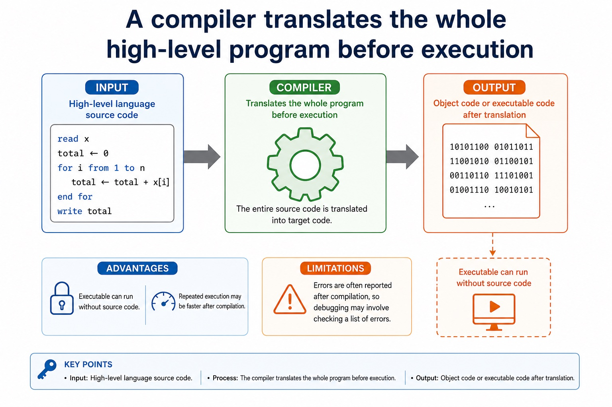

# Lesson 029: Choosing a translator and understanding Java translation

**Course:** Cambridge International AS Level Computer Science 9618, syllabus for examination in 2027-2029 
**Paper:** Paper 1 
**Syllabus:** Section 5: System software 
**Syllabus requirements:** S5.05, S5.06 
**Pacing:** Flexible. Select a quick, full or deep route for the learners in front of you.

## Teaching-depth menu

- **Quick route:** Use the diagnostic, learning objectives, first worked example and foundation question. Stop once the learner can explain the central distinction accurately.
- **Full route:** Teach every knowledge-point material set, the worked method and all lesson questions.
- **Deep route:** Add the prerequisite refresher, ask learners to connect the concept checklist, discuss the labelled extension and complete a transfer question without a model answer.

## 1. Prerequisite knowledge and quick diagnostic

Recall S5.04 before starting this lesson.

Ask the learner to give one accurate definition or method step before continuing. If they cannot, briefly revisit the named prerequisite rather than repeating the whole previous lesson.

### Optional prerequisite refresher

- An assembler translates assembly language, a compiler translates high-level language, and an interpreter translates and executes high-level language.
- Explain why assembler, compiler and interpreter are needed.

## 2. Knowledge explanation

### 1. Compare compiler and interpreter advantages/disadvantages and justify use (S5.05)

**Concept relationships**

- **compiler:** Compare compiler and interpreter advantages/disadvantages and justify use.
- **interpreter:** The benefits and drawbacks of a compiler and…
- **benefits:** Disadvantages include repeated translation overhead, slower execution and…
- **drawbacks:** Compiler advantages include faster repeated execution after translation,…
- **compare:** Interpreter advantages include immediate statement-level feedback and convenient…

**Mechanism**

1. **Name both alternatives precisely** — Compare compiler and interpreter advantages/disadvantages and justify use.
2. **Connect structure to consequence** — The benefits and drawbacks of a compiler and an interpreter, and justify which translator is appropriate for a…
3. **Justify against the scenario** — Disadvantages include repeated translation overhead, slower execution and needing the interpreter and usually the source program at run…

**A compiler translates the whole high-level program before…:** Input High-level language source code. Output Object code or executable code after translation.

#### A compiler translates the whole high-level program before execution

Text transcript

- Input High-level language source code.
- Output Object code or executable code after translation.
- Advantages Executable can run without source code; repeated execution may be faster after compilation.
- Limitations Errors are often reported after compilation, so debugging may involve checking a list of errors.

Precise syllabus wording

Compare compiler and interpreter advantages/disadvantages and justify use.

Explain the benefits and drawbacks of a compiler and an interpreter, and justify which translator is appropriate for a stated use.

### 2. That Java is partly compiled and partly interpreted (S5.06)

**Concept relationships**

- **Java:** That Java is partly compiled and partly interpreted.
- **partly:** Java in console mode is partly compiled and…
- **compiled:** A high-level program may be partly compiled and…
- **interpreted:** The Java compiler translates source code into platform-independent…
- **compiler:** The benefits and drawbacks of a compiler and…

**Mechanism**

1. **Name the exact concept** — That Java is partly compiled and partly interpreted.
2. **Explain how its parts connect** — Java in console mode is partly compiled and partly interpreted
3. **Use it in a concrete context** — A high-level program may be partly compiled and partly interpreted

**Concrete case: Java:** That Java is partly compiled and partly interpreted.

Precise syllabus wording

Understand that Java is partly compiled and partly interpreted.

A high-level program may be partly compiled and partly interpreted; Java in console mode is the required example.

Open precise terminology and exam facts

- Explain the benefits and drawbacks of a compiler and an interpreter, and justify which translator is appropriate for a stated use.
- A high-level program may be partly compiled and partly interpreted; Java in console mode is the required example.
- An assembler is needed to translate a processor-specific assembly-language program into machine code or object code. A compiler is needed to translate a whole high-level language program before execution, normally producing target/object code. An interpreter translates and executes a high-level language program statement by statement during execution, normally without producing a separate permanent object-code file.
- Compiler advantages include faster repeated execution after translation, distribution without the source code and translation checks across the whole program. Disadvantages include a separate compilation step and an error list that may need several corrections before execution. Interpreter advantages include immediate statement-level feedback and convenient incremental testing. Disadvantages include repeated translation overhead, slower execution and needing the interpreter and usually the source program at run time.
- A justified choice must connect the mechanism to the scenario: an interpreter can suit development and debugging; a compiler can suit repeated use or distribution; an assembler is required for assembly source. These are advantages and disadvantages of the translation approaches, not universal claims that one tool is always better.
- Java in console mode is partly compiled and partly interpreted: the Java compiler translates source code into platform-independent bytecode, then a Java Virtual Machine (JVM) interprets that bytecode and may just-in-time compile parts for the host processor. Bytecode is not universal processor machine code.
- The expand/collapse feature hides or reveals a code block in the editor without changing program execution.

### Worked method

1. Choose tools across development and deployment
2. During development, an interpreter can execute each statement and stop near a fault, giving quick feedback.
3. For final distribution, a compiler can translate the whole high-level program before execution and provide target/object or executable code without distributing the source.
4. A processor-specific assembly routine requires an assembler because its mnemonic instructions must become the target processor's machine code.

Beyond syllabus / 延伸知识（不要求背诵）: production build systems automate translation, linking, testing and packaging, while the syllabus examines the purpose of each stage separately.
## 3. Practice by question type

### Question 1 - foundation - give - 2 marks

Give one compiler advantage and its mechanism.

**Answer:** A compiled program can run repeatedly without translating the source each time because translation occurred before execution.

**Marking guidance:** Award one mark for each distinct, technically accurate point or method step.

**Common error:** For the command word give, perform that exact action; do not replace it with an unrelated fact.

### Question 2 - application - explain - 6 marks

Explain why Java is partly compiled and partly interpreted, then describe four IDE features from coding, initial error detection, presentation and debugging.

**Answer:** Java source is compiled to bytecode; JVM interprets bytecode and may JIT-compile parts for the host; context-sensitive prompts or dynamic syntax checking described accurately; prettyprint or expand/collapse code blocks described accurately; single stepping or breakpoint described accurately; variable/expression inspection or report window described accurately

**Marking guidance:** Do not accept that Java source becomes one universal machine-code file or that IDE syntax checking proves logical correctness.

**Common error:** Do not repeat the same point in different words; each mark needs a separate idea or method step.

### Question 3 - transfer - explain - 2 marks

Why is Java described as partly compiled and partly interpreted?

**Answer:** Source is compiled to bytecode, then a JVM interprets the bytecode and may JIT-compile parts for the host.

**Marking guidance:** Award one mark for each distinct, technically accurate point or method step.

**Common error:** Do not copy the worked example unchanged; transfer the method and check it against the new context.

### Related past-paper indexes

| Reference | Marks | Command word | Question type |
|---|---:|---|---|
| 9618/12/W/25 Q10(c) | 3 | describe | explain |
| 9618/13/W/25 Q8(b) | 3 | explain | explain |
| 9618/13/W/25 Q8(d) | 3 | explain | explain |
| 9618/13/W/25 Q8(a) | 2 | state | recall |

These are indexes only. Cambridge question and mark-scheme wording is not reproduced.

## 4. Summary and exam reminders

### Summary

- Define choosing a translator and understanding java translation with the exact technical vocabulary expected by the syllabus.
- Use the lesson method on a fresh context and show the intermediate decision, representation or calculation.
- Match the shape of the answer to the command word and the available marks.
- Check the final answer against the scenario instead of repeating a memorised sentence.

### Common error to correct

Students often say interpreters are 'bad compilers'. Correction: they are different translation approaches with different use cases.

### Exam technique

- Follow the command word: state gives a fact; explain links a cause to a consequence; compare covers both sides.
- Match the number of independent points or method steps to the available marks.
- For choosing a translator and understanding java translation, use the exact technical term before applying it to the scenario.
