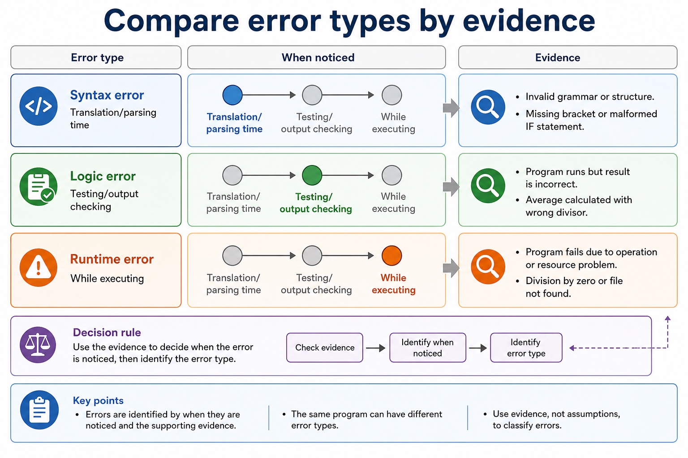
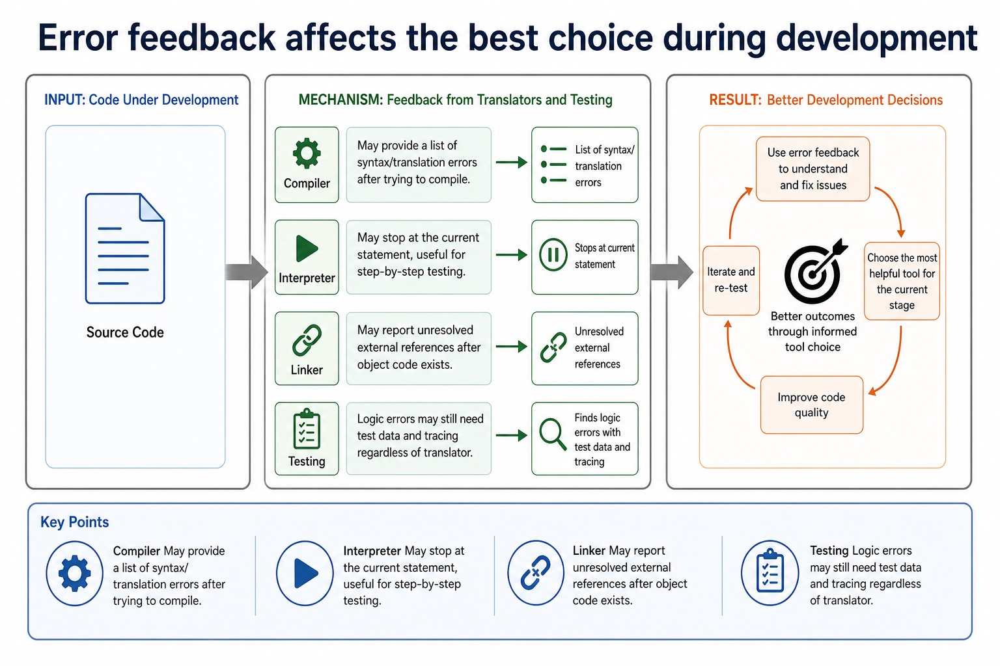
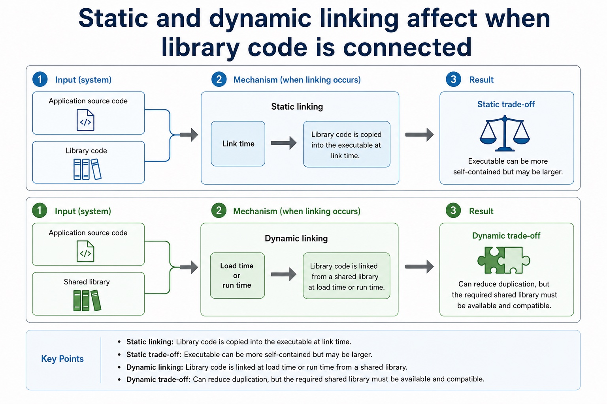
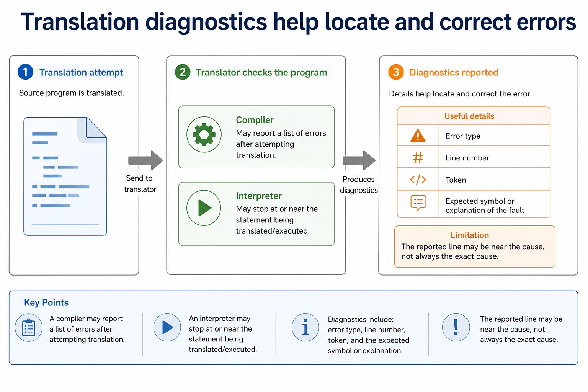
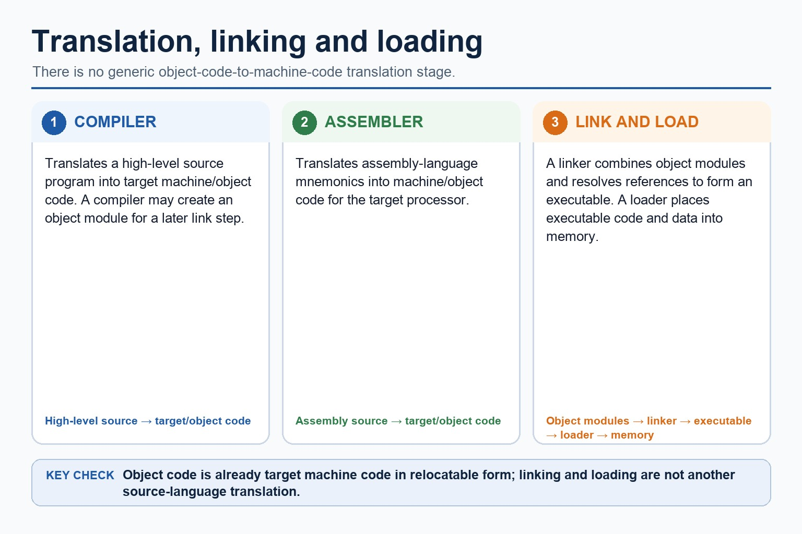
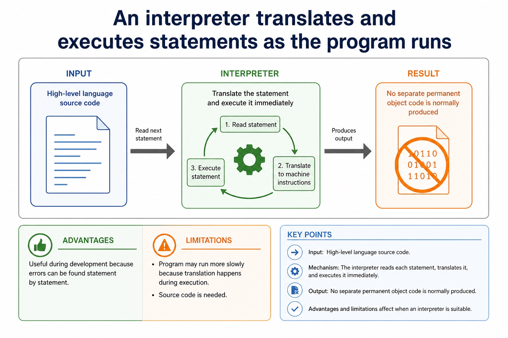

# Lesson 030: IDE features and practical debugging support

**Course:** Cambridge International AS Level Computer Science 9618, 2027-2029 Version 2 
**Paper:** Paper 1 
**Syllabus:** Section 5: System software 
**Syllabus requirements:** S5.07 
**Pacing:** Flexible. Select the material set and practice depth needed by the learner.

## Teaching-depth menu

- **Quick route:** Use the diagnostic, learning objectives, first worked example and foundation question. Stop once the learner can explain the central distinction accurately.
- **Full route:** Use every knowledge-point material set, the worked method, the terminology check and all questions.
- **Deep route:** Add the prerequisite refresher, ask learners to connect the concept checklist, discuss the labelled extension and complete a transfer question without a model answer.

## 1. Prerequisite knowledge and quick diagnostic

Recall S5.04 before starting this lesson.

Ask the learner to give one accurate definition or method step before continuing. If they cannot, briefly revisit the named prerequisite rather than repeating the whole previous lesson.

### Optional prerequisite refresher

- An assembler translates assembly language, a compiler translates high-level language, and an interpreter translates and executes high-level language.
- Explain why assembler, compiler and interpreter are needed.

## 2. Knowledge explanation

### 1. IDE · Features · Context-sensitive · Prompts (S5.07)

**Concept map:** IDE → features → context-sensitive → prompts → dynamic → checking → prettyprint → expand/collapse → single-step → breakpoints → variable/expression → inspection → report → window

**Three-part explanation:**

1. For debugging, an IDE can provide single stepping, breakpoints, inspection of variables and expressions, and a report window for diagnostic or output information
2. In the IDE, a breakpoint pauses before the faulty loop, single stepping advances one statement at a time, the variable/expression view exposes Index, and the report…
3. and debugging with single stepping, breakpoints, variables, expressions and a report window

**Concrete cue:** IDE evidence must cover coding prompts; dynamic syntax error detection; prettyprint and expand/collapse presentation; and debugging with single stepping, breakpoints, variables, expressions and a report window.

#### Compare error types by evidence

Text transcript

- Error type
- When noticed
- Evidence
- Translation/parsing time
- Invalid grammar or structure.
- Missing bracket or malformed IF statement.
- Testing/output checking
- Program runs but result is incorrect.

#### Error feedback affects the best choice during development

Text transcript

- Compiler May provide a list of syntax/translation errors after trying to compile.
- Interpreter May stop at the current statement, useful for step-by-step testing.
- Linker May report unresolved external references after object code exists.
- Testing Logic errors may still need test data and tracing regardless of translator.

#### A compiler translates the whole high-level program before execution

Text transcript

- Input High-level language source code.
- Output Object code or executable code after translation.
- Advantages Executable can run without source code; repeated execution may be faster after compilation.
- Limitations Errors are often reported after compilation, so debugging may involve checking a list of errors.

#### Static and dynamic linking affect when library code is connected

Text transcript

- Static linking Library code is copied into the executable at link time.
- Static trade-off Executable can be more self-contained but may be larger.
- Dynamic linking Library code is linked at load time or run time from a shared library.
- Dynamic trade-off Can reduce duplication, but the required shared library must be available and compatible.

#### Translation diagnostics help locate and correct errors

Text transcript

- Compiler May report a list of errors after attempting translation.
- Interpreter May stop at or near the statement being translated/executed.
- Useful details Error type, line number, token, expected symbol or explanation of the fault.
- Limitation The reported line may be near the cause, not always the exact cause.

Precise syllabus wording

Understand IDE features: context-sensitive prompts, dynamic syntax checking, prettyprint, expand/collapse, single-step, breakpoints, variable/expression inspection and report window.

IDE evidence must cover coding prompts; dynamic syntax error detection; prettyprint and expand/collapse presentation; and debugging with single stepping, breakpoints, variables, expressions and a report window.

### Supporting diagram library

#### An assembler translates assembly language into machine code

Text transcript

- An assembler translates assembly-language mnemonics into machine code or an object-code module.
- Machine code uses the instruction set and binary encodings of the target processor.
- An object module may still need a linker to combine modules and resolve external library references before an executable can be produced.
- An assembler does not translate high-level languages such as Java or Cambridge pseudocode.

#### Comparison: same goal, different route

Text transcript

- A compiler translates a whole high-level program before execution and produces target or object code; a linked executable can run repeatedly without the source.
- An interpreter translates and executes high-level statements during execution and normally produces no separate permanent object-code file.
- An assembler translates assembly-language mnemonics into target machine code or an object module for a specific processor instruction set.
- If an assembler or compiler produces object modules, a linker may still be required before there is an executable program.
- Choose the translator from the input language and the development or deployment need; do not claim that every assembler output is immediately executable.

#### Translator software converts program code into another form

Text transcript

- A compiler translates high-level source into target machine or object code.
- An assembler translates assembly mnemonics into target machine or object code.
- A linker combines object modules and resolves references to form an executable.
- A loader places executable code and data into memory; it is not a generic object-to-machine translation stage.

#### An interpreter translates and executes statements as the program runs

Text transcript

- Input High-level language source code.
- Output No separate permanent object code is normally produced.
- Advantages Useful during development because errors can be found statement by statement.
- Limitations Program may run more slowly because translation happens during execution; source code is needed.

Open precise terminology and exam facts

- IDE evidence must cover coding prompts; dynamic syntax error detection; prettyprint and expand/collapse presentation; and debugging with single stepping, breakpoints, variables, expressions and a report window.
- For coding, an IDE can provide context-sensitive prompts. For initial error detection it can perform dynamic syntax checks. For presentation it can prettyprint code and expand or collapse code blocks. These features help create and navigate source code but do not prove that its algorithm is correct.
- For debugging, an IDE can provide single stepping, breakpoints, inspection of variables and expressions, and a report window for diagnostic or output information. Single stepping executes one statement at a time; a breakpoint pauses at a chosen point; variable/expression inspection exposes changing values.
- The expand/collapse feature hides or reveals a code block in the editor without changing program execution.

### Worked example

1. Trace Java and locate a loop fault
2. First the Java compiler produces bytecode; the JVM then interprets the bytecode or JIT-compiles parts for the host.
3. In the IDE, a breakpoint pauses before the faulty loop, single stepping advances one statement at a time, the variable/expression view exposes Index, and the report window records diagnostics.
4. Dynamic syntax checking can flag malformed syntax but not a syntactically valid wrong boundary.

Beyond syllabus / 延伸知识（不要求背诵）: production build systems automate translation, linking, testing and packaging, while the syllabus examines the purpose of each stage separately.
## 3. Practice by question type

### Question 1 - foundation - identify - 2 marks

Identify the two required presentation features.

**Answer:** Prettyprint and expand/collapse code blocks.

**Marking guidance:** Award one mark for each distinct, technically accurate point or method step.

**Common error:** For the command word identify, perform that exact action; do not replace it with an unrelated fact.

### Question 2 - application - apply - 2 marks

Which IDE feature pauses at a chosen line, and which advances one statement?

**Answer:** A breakpoint pauses; single stepping advances one statement at a time.

**Marking guidance:** Award one mark for each distinct, technically accurate point or method step.

**Common error:** Do not repeat the same point in different words; each mark needs a separate idea or method step.

### Question 3 - transfer - explain - 3 marks

Explain how ide features and practical debugging support would be applied in a suitable computing context.

**Answer:** For coding, an IDE can provide context-sensitive prompts. For initial error detection it can perform dynamic syntax checks. For presentation it can prettyprint code and expand or collapse code blocks. These features help create and navigate source code but do not prove that its algorithm is correct. For debugging, an IDE can provide single stepping, breakpoints, inspection of variables and expressions, and a report window for diagnostic or output information. Single stepping executes one statement at a time; a breakpoint pauses at a chosen point; variable/expression inspection exposes changing values. The expand/collapse feature hides or reveals a code block in the editor without changing program execution.

**Marking guidance:** Each mark needs a relevant point linked to the stated context.

**Common error:** Do not copy the worked example unchanged; transfer the method and check it against the new context.

### Related past-paper indexes

| Reference | Marks | Command word | Question type |
|---|---:|---|---|
| 9618/12/S/24 Q8(b) | 6 | complete | debug |
| 9618/12/W/24 Q4(a) | 4 | describe | debug |
| 9618/12/W/24 Q4(b) | 3 | describe | debug |
| 9618/12/S/23 Q7(c) | 4 | complete | recall |

These are indexes only. Cambridge question and mark-scheme wording is not reproduced.

## 4. Summary and exam reminders

### Summary

- Define ide features and practical debugging support with the exact technical vocabulary expected by the syllabus.
- Use the lesson method on a fresh context and show the intermediate decision, representation or calculation.
- Match the shape of the answer to the command word and the available marks.
- Check the final answer against the scenario instead of repeating a memorised sentence.

### Common error to correct

Students often say interpreters are 'bad compilers'. Correction: they are different translation approaches with different use cases.

### Exam technique

- Follow the command word: state gives a fact; explain links a cause to a consequence; compare covers both sides.
- Match the number of independent points or method steps to the available marks.
- For ide features and practical debugging support, use the exact technical term before applying it to the scenario.
