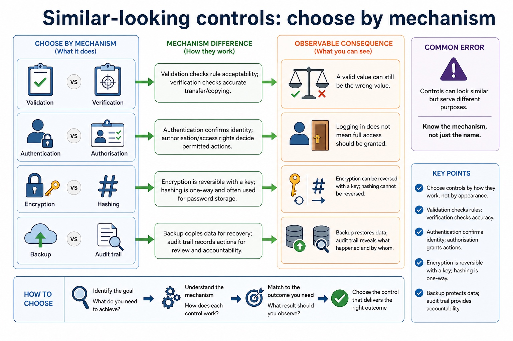

# Lesson 031: Security, privacy, integrity and the need for protection

**Course:** Cambridge International AS Level Computer Science 9618, 2027-2029 Version 2 
**Paper:** Paper 1 
**Syllabus:** Section 6: Security, privacy and data integrity 
**Syllabus requirements:** S6.01, S6.02 
**Pacing:** Flexible. This lesson is deliberately over-complete; select a quick, full or deep route for the learners in front of you.

## Teaching-depth menu

- **Quick route:** Use the diagnostic, learning objectives, first worked example and foundation question. Stop once the learner can explain the central distinction accurately.
- **Full route:** Teach every core explanation point, the worked example and all lesson questions. Use the visual only when it adds a different representation.
- **Deep route:** Add the prerequisite refresher, ask learners to connect the concept checklist, discuss the labelled extension and complete a transfer question without a model answer.

## 1. Prerequisite knowledge and quick diagnostic

Recall the main conclusion from Lesson 030: IDE features and practical debugging support.

Ask the learner to give one accurate definition or method step before continuing. If they cannot, briefly revisit the named prerequisite rather than repeating the whole previous lesson.

## 2. Knowledge explanation

### Learning objectives

- Distinguish data security, privacy and integrity.
- Explain the need for data and computer-system security.

### Concept checklist for teacher choice

- security
- privacy
- integrity
- computer-system
- data

### Detailed explanation

- Distinguish data security, data privacy and data integrity as separate concepts; evidence must not treat confidentiality, lawful/appropriate use and correctness/consistency as interchangeable.
- Show appreciation of the need for both security of data and security of the computer system; evidence must explain why protecting one layer does not replace the other.
- Data security is protection against unauthorised access, loss or damage. Privacy concerns appropriate collection, use and disclosure of personal data. Integrity means data remains accurate, complete and unaltered except by authorised processes.
- The concepts overlap but are not synonyms: encrypted inaccurate data may be secure but lack integrity; authorised publication may preserve integrity while violating privacy.
- Both data security and computer-system security are necessary. Protecting only a data file is insufficient if an attacker can control the operating system, install malware, steal credentials or make the computer system unavailable; protecting only the device is insufficient if copied data is disclosed, altered or lost.

### Worked example

Medical records on a compromised computer system: Encryption restricts unauthorised reading of the record data. Access rights restrict who may view or alter it. Anti-virus and a firewall help protect the computer system that stores and processes the records. If malware controls the system, it may steal decrypted data, alter records or stop authorised access even though the stored file was encrypted.

Beyond syllabus / 延伸知识（不要求背诵）: real security uses defence in depth, combining controls so that one failed control does not expose the whole system.

### Retained visual explanation

_Compare by purpose, not by "security word". The image and mobile text alternative come from one maintained fact source._

## 3. Practice by question type

### Question 1 - foundation - compare - 5 marks

Compare data security, privacy and integrity, then explain why both data and its computer system require security.

**Answer:** security protects against unauthorised access/loss/damage; privacy controls appropriate personal-data use/disclosure; integrity concerns accuracy/completeness/authorised change; computer-system compromise can expose/alter/destroy data or prevent authorised access; data-specific and system controls are both required / one does not replace the other

**Marking guidance:** Do not accept repeated versions of 'keeping data safe' or the claim that file encryption alone secures the computer system.

**Common error:** For the command word compare, perform that exact action; do not replace it with an unrelated fact.

### Question 2 - application - explain - 2 marks

Why must the computer system also be protected?

**Answer:** A compromised or unavailable system can expose, alter, delete or prevent access to the data it processes, even when a stored file has a separate protection such as encryption.

**Marking guidance:** Award one mark for each distinct, technically accurate point or method step.

**Common error:** Do not repeat the same point in different words; each mark needs a separate idea or method step.

### Question 3 - transfer - apply - 2 marks

Can data be secure but inaccurate?

**Answer:** Yes; access protection does not guarantee correctness.

**Marking guidance:** Award one mark for each distinct, technically accurate point or method step.

**Common error:** Do not copy the worked example unchanged; transfer the method and check it against the new context.

### Related past-paper indexes

| Reference | Marks | Command word | Question type |
|---|---:|---|---|
| 9618/12/W/23 Q5(a) | 1 | state | recall |
| 9618/12/W/23 Q5(b) | 1 | state | recall |

These are indexes only. Cambridge question and mark-scheme wording is not reproduced.

## 4. Summary and exam reminders

### Summary

- Define security, privacy, integrity and the need for protection with the exact technical vocabulary expected by the syllabus.
- Use the lesson method on a fresh context and show the intermediate decision, representation or calculation.
- Match the shape of the answer to the command word and the available marks.
- Check the final answer against the scenario instead of repeating a memorised sentence.

### Common error to correct

Students often propose encryption for every problem. Correction: encryption protects confidentiality but does not fix poor permissions, phishing or missing backups.

### Exam technique

- Follow the command word: state gives a fact; explain links a cause to a consequence; compare covers both sides.
- Match the number of independent points or method steps to the available marks.
- For security, privacy, integrity and the need for protection, use the exact technical term before applying it to the scenario.
