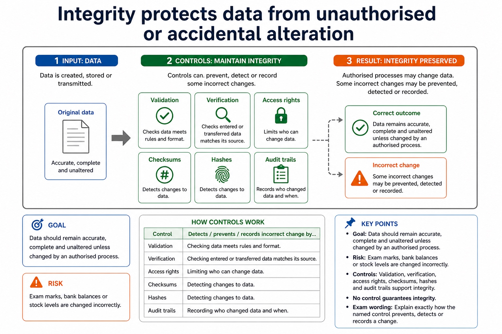
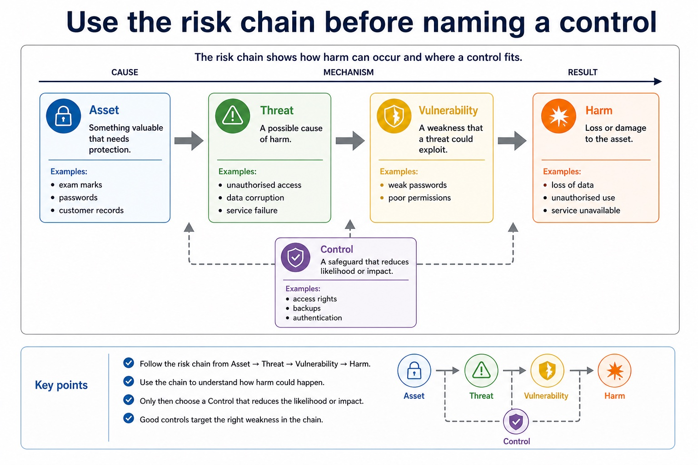

# Lesson 031: Security, privacy, integrity and the need for protection

**Course:** Cambridge International AS Level Computer Science 9618, syllabus for examination in 2027-2029 
**Paper:** Paper 1 
**Syllabus:** Section 6: Security, privacy and data integrity 
**Syllabus requirements:** S6.01, S6.02 
**Pacing:** Flexible. Select a quick, full or deep route for the learners in front of you.

## Teaching-depth menu

- **Quick route:** Use the diagnostic, learning objectives, first worked example and foundation question. Stop once the learner can explain the central distinction accurately.
- **Full route:** Teach every knowledge-point material set, the worked method and all lesson questions.
- **Deep route:** Add the prerequisite refresher, ask learners to connect the concept checklist, discuss the labelled extension and complete a transfer question without a model answer.

## 1. Prerequisite knowledge and quick diagnostic

Recall the main conclusion from Lesson 030: IDE features and practical debugging support.

Ask the learner to give one accurate definition or method step before continuing. If they cannot, briefly revisit the named prerequisite rather than repeating the whole previous lesson.

## 2. Knowledge explanation

### 1. Data security, privacy and integrity (S6.01)

**Atomic learning targets**

- **S6.01.A01:** security
- **S6.01.A02:** privacy
- **S6.01.A03:** integrity

**Core explanation**

- Both data security and computer-system security are necessary. Protecting only a data file is insufficient if an attacker can control the operating system, install malware, steal credentials or make the computer system unavailable; protecting only the device is insufficient if copied data is disclosed, altered or lost.
- Data security is protection against unauthorised access, loss or damage. Privacy concerns appropriate collection, use and disclosure of personal data. Integrity means data remains accurate, complete and unaltered except by authorised processes.
- The concepts overlap but are not synonyms: encrypted inaccurate data may be secure but lack integrity; authorised publication may preserve integrity while violating privacy.

**Mechanism or method**

1. **Identify the relevant condition or input** — Both data security and computer-system security are necessary.
2. **Trace how the process works** — Protecting only a data file is insufficient if an attacker can control the operating system, install malware, steal credentials or make the computer system unavailable;
3. **Connect the mechanism to its result** — protecting only the device is insufficient if copied data is disclosed, altered or lost.

#### Worked example: Data security, privacy and integrity: complete worked route

1. **Identify the relevant condition or input**

Both data security and computer-system security are necessary.

2. **Trace how the process works**

Protecting only a data file is insufficient if an attacker can control the operating system, install malware, steal credentials or make the computer system unavailable;

3. **Connect the mechanism to its result**

protecting only the device is insufficient if copied data is disclosed, altered or lost.

4. **Complete example**

Medical records on a compromised computer system: Encryption restricts unauthorised reading of the record data. Access rights restrict who may view or alter it. Anti-virus and a firewall help protect the computer system that stores and processes the records. If malware controls the system, it may steal decrypted data, alter records or stop authorised access even though the stored file was encrypted.

**Misconceptions to correct**

- Students often propose encryption for every problem. Correction: encryption protects confidentiality but does not fix poor permissions, phishing or missing backups.

#### Mastery check (MC-L031-S6.01)

Distinguish the following targets in one connected answer, using a concrete example for each: security; privacy; integrity.

Answer criteria

- Both data security and computer-system security are necessary. Protecting only a data file is insufficient if an attacker can control the operating system, install malware, steal credentials or make the computer system unavailable; protecting only the device is insufficient if copied data is disclosed, altered or lost.
- Data security is protection against unauthorised access, loss or damage. Privacy concerns appropriate collection, use and disclosure of personal data. Integrity means data remains accurate, complete and unaltered except by authorised processes.
- The concepts overlap but are not synonyms: encrypted inaccurate data may be secure but lack integrity; authorised publication may preserve integrity while violating privacy.

**Supplementary concept map**

- **Security:** Protection from unauthorised action
- **Privacy:** Appropriate use of personal data
- **Integrity:** Accuracy and consistency
- **Confidentiality:** One part of security
- **distinguish:** Data security, privacy and integrity.

**Supplementary three-step recap**

1. **Identify what needs protection** — Data security, privacy and integrity.
2. **Trace the attack or error route** — Data security, data privacy and data integrity as separate concepts
3. **Match a safeguard and limitation** — Authorised publication may preserve integrity while violating privacy.

**Integrity protects data from unauthorised or accidental alteration:** Goal Data should remain accurate, complete and unaltered unless changed by an authorised process. Risk Exam marks, bank balances or stock levels are changed incorrectly.

#### Integrity protects data from unauthorised or accidental alteration

Text transcript

- Goal Data should remain accurate, complete and unaltered unless changed by an authorised process.
- Risk Exam marks, bank balances or stock levels are changed incorrectly.
- Validation and verification Validation checks stated rules; verification checks entered or transferred data against its source, not whether the source is true or complete.
- Other controls Access rights, checksums, hashes and audit trails can prevent, detect or record some changes, but no control guarantees integrity.
- Exam wording Explain exactly how the named control prevents, detects or records an incorrect change.

Precise syllabus wording

Distinguish data security, privacy and integrity.

Distinguish data security, data privacy and data integrity as separate concepts; evidence must not treat confidentiality, lawful/appropriate use and correctness/consistency as interchangeable.

### 2. The need for data and computer-system security (S6.02)

**Atomic learning targets**

- **S6.02.A01:** computer-system
- **S6.02.A02:** security
- **S6.02.A03:** data

**Core explanation**

- Both data security and computer-system security are necessary. Protecting only a data file is insufficient if an attacker can control the operating system, install malware, steal credentials or make the computer system unavailable; protecting only the device is insufficient if copied data is disclosed, altered or lost.
- Data security is protection against unauthorised access, loss or damage. Privacy concerns appropriate collection, use and disclosure of personal data. Integrity means data remains accurate, complete and unaltered except by authorised processes.
- The concepts overlap but are not synonyms: encrypted inaccurate data may be secure but lack integrity; authorised publication may preserve integrity while violating privacy.

**Mechanism or method**

1. **Identify the relevant condition or input** — Both data security and computer-system security are necessary.
2. **Trace how the process works** — Protecting only a data file is insufficient if an attacker can control the operating system, install malware, steal credentials or make the computer system unavailable;
3. **Connect the mechanism to its result** — protecting only the device is insufficient if copied data is disclosed, altered or lost.

#### Worked example: The need for data and computer-system security: complete worked route

1. **Identify the relevant condition or input**

Both data security and computer-system security are necessary.

2. **Trace how the process works**

Protecting only a data file is insufficient if an attacker can control the operating system, install malware, steal credentials or make the computer system unavailable;

3. **Connect the mechanism to its result**

protecting only the device is insufficient if copied data is disclosed, altered or lost.

4. **Complete example**

Medical records on a compromised computer system: Encryption restricts unauthorised reading of the record data. Anti-virus and a firewall help protect the computer system that stores and processes the records. If malware controls the system, it may steal decrypted data, alter records or stop authorised access even though the stored file was encrypted.

**Misconceptions to correct**

- Students often propose encryption for every problem. Correction: encryption protects confidentiality but does not fix poor permissions, phishing or missing backups.

#### Mastery check (MC-L031-S6.02)

Explain the following targets in one connected answer, using a concrete example for each: computer-system; security; data.

Answer criteria

- Both data security and computer-system security are necessary. Protecting only a data file is insufficient if an attacker can control the operating system, install malware, steal credentials or make the computer system unavailable; protecting only the device is insufficient if copied data is disclosed, altered or lost.
- Data security is protection against unauthorised access, loss or damage. Privacy concerns appropriate collection, use and disclosure of personal data. Integrity means data remains accurate, complete and unaltered except by authorised processes.
- The concepts overlap but are not synonyms: encrypted inaccurate data may be secure but lack integrity; authorised publication may preserve integrity while violating privacy.

**Supplementary concept map**

- **Data:** Valuable information to protect
- **System:** Hardware and services to protect
- **Threat:** Possible cause of harm
- **Control:** Reduces likelihood or impact
- **computer-system:** The need for data and computer-system security.
- **security:** The need for both security of data and…

**Supplementary three-step recap**

1. **Identify what needs protection** — The need for data and computer-system security.
2. **Trace the attack or error route** — The need for both security of data and security of the computer system
3. **Match a safeguard and limitation** — Both data security and computer-system security are necessary.

**Use the risk chain before naming a control:** Asset Something valuable that needs protection, such as exam marks, passwords or customer records. Threat A possible cause of harm, such as unauthorised access, data corruption or service failure.

#### Use the risk chain before naming a control

Text transcript

- Asset Something valuable that needs protection, such as exam marks, passwords or customer records.
- Threat A possible cause of harm, such as unauthorised access, data corruption or service failure.
- Vulnerability A weakness that a threat could exploit, such as weak passwords or poor permissions.
- Control A safeguard that reduces likelihood or impact, such as access rights, backups or authentication.

Precise syllabus wording

Explain the need for data and computer-system security.

Show appreciation of the need for both security of data and security of the computer system; evidence must explain why protecting one layer does not replace the other.

### Lesson technical reference

- Distinguish data security, data privacy and data integrity as separate concepts; evidence must not treat confidentiality, lawful/appropriate use and correctness/consistency as interchangeable.
- Show appreciation of the need for both security of data and security of the computer system; evidence must explain why protecting one layer does not replace the other.
- Data security is protection against unauthorised access, loss or damage. Privacy concerns appropriate collection, use and disclosure of personal data. Integrity means data remains accurate, complete and unaltered except by authorised processes.
- The concepts overlap but are not synonyms: encrypted inaccurate data may be secure but lack integrity; authorised publication may preserve integrity while violating privacy.
- Both data security and computer-system security are necessary. Protecting only a data file is insufficient if an attacker can control the operating system, install malware, steal credentials or make the computer system unavailable; protecting only the device is insufficient if copied data is disclosed, altered or lost.

Beyond syllabus / 延伸知识（不要求背诵）: real security uses defence in depth, combining controls so that one failed control does not expose the whole system.
## 3. Practice by question type

### Question 1 - foundation - compare - 5 marks

Compare data security, privacy and integrity, then explain why both data and its computer system require security.

**Answer:** security protects against unauthorised access/loss/damage; privacy controls appropriate personal-data use/disclosure; integrity concerns accuracy/completeness/authorised change; computer-system compromise can expose/alter/destroy data or prevent authorised access; data-specific and system controls are both required / one does not replace the other

**Marking guidance:** Do not accept repeated versions of 'keeping data safe' or the claim that file encryption alone secures the computer system.

**Common error:** For the command word compare, perform that exact action; do not replace it with an unrelated fact.

### Question 2 - application - explain - 2 marks

Why must the computer system also be protected?

**Answer:** A compromised or unavailable system can expose, alter, delete or prevent access to the data it processes, even when a stored file has a separate protection such as encryption.

**Marking guidance:** Award one mark for each distinct, technically accurate point or method step.

**Common error:** Do not repeat the same point in different words; each mark needs a separate idea or method step.

### Question 3 - transfer - apply - 2 marks

Can data be secure but inaccurate?

**Answer:** Yes; access protection does not guarantee correctness.

**Marking guidance:** Award one mark for each distinct, technically accurate point or method step.

**Common error:** Do not copy the worked example unchanged; transfer the method and check it against the new context.

### Related past-paper indexes

| Reference | Marks | Command word | Question type |
|---|---:|---|---|
| 9618/12/W/23 Q5(a) | 1 | state | recall |
| 9618/12/W/23 Q5(b) | 1 | state | recall |

These are indexes only. Cambridge question and mark-scheme wording is not reproduced.

## 4. Summary and exam reminders

### Summary

- S6.01: explain security, privacy, integrity.
- S6.01 method: Identify the relevant condition or input → Trace how the process works → Connect the mechanism to its result.
- S6.02: explain computer-system, security, data.
- S6.02 method: Identify the relevant condition or input → Trace how the process works → Connect the mechanism to its result.
- Correction to remember: Students often propose encryption for every problem. Correction: encryption protects confidentiality but does not fix poor permissions, phishing or missing backups.

### Common error to correct

Students often propose encryption for every problem. Correction: encryption protects confidentiality but does not fix poor permissions, phishing or missing backups.

### Exam technique

- Follow the command word: state gives a fact; explain links a cause to a consequence; compare covers both sides.
- Match the number of independent points or method steps to the available marks.
- For security, privacy, integrity and the need for protection, use the exact technical term before applying it to the scenario.
