# Lesson 032: Internet threats, malware and access restriction

**Course:** Cambridge International AS Level Computer Science 9618, 2027-2029 Version 2 
**Paper:** Paper 1 
**Syllabus:** Section 6: Security, privacy and data integrity 
**Syllabus requirements:** S6.04, S6.05 
**Pacing:** Flexible. Select the material set and practice depth needed by the learner.

## Teaching-depth menu

- **Quick route:** Use the diagnostic, learning objectives, first worked example and foundation question. Stop once the learner can explain the central distinction accurately.
- **Full route:** Use every knowledge-point material set, the worked method, the terminology check and all questions.
- **Deep route:** Add the prerequisite refresher, ask learners to connect the concept checklist, discuss the labelled extension and complete a transfer question without a model answer.

## 1. Prerequisite knowledge and quick diagnostic

Recall S6.02 before starting this lesson.

Ask the learner to give one accurate definition or method step before continuing. If they cannot, briefly revisit the named prerequisite rather than repeating the whole previous lesson.

### Optional prerequisite refresher

- Show appreciation of the need for both security of data and security of the computer system; evidence must explain why protecting one layer does not replace the other.
- Explain the need for data and computer-system security.

## 2. Knowledge explanation

### 1. Virus · Spyware · Hacker · Phishing (S6.04)

**Concept map:** virus → spyware → hacker → phishing → pharming → threats

**Three-part explanation:**

1. Show understanding of threats posed by networks and the internet, including malware (virus and spyware), hackers, phishing and pharming
2. all five named threats require direct evidence
3. The threats include a virus, spyware, a hacker, phishing and pharming

**Concrete cue:** Show understanding of threats posed by networks and the internet, including malware (virus and spyware), hackers, phishing and pharming; all five named threats require direct evidence.

#### Pharming: redirecting users to a fake website

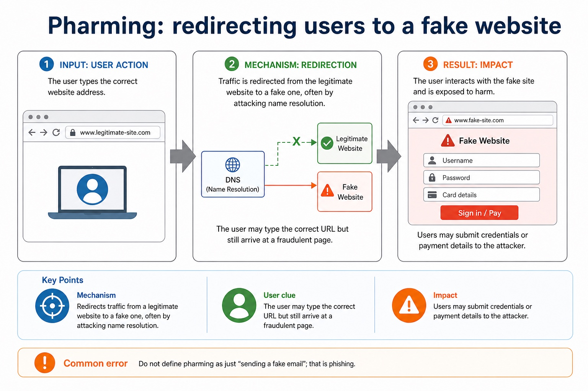

Text transcript

- Mechanism Redirects traffic from a legitimate website to a fake one, often by attacking name resolution.
- User clue The user may type the correct URL but still arrive at a fraudulent page.
- Impact Users may submit credentials or payment details to the attacker.
- Common error Do not define pharming as just "sending a fake email"; that is phishing.

#### Virus and worm: both can spread, but not in the same way

Text transcript

- Virus Attaches to a host file/program and often needs the host to be run or shared.
- Worm Self-replicates, often across networks, without needing to attach to a host file.
- Impact Can corrupt data, slow systems, consume bandwidth or install further malware.
- Common error Do not say every self-spreading threat is a virus.

#### Spyware secretly monitors activity or collects data

Text transcript

- Mechanism Runs without clear user awareness and gathers information.
- Examples Keylogger, screen monitoring or browser tracking used to capture credentials.
- Goal affected Often threatens confidentiality and authenticity if credentials are stolen.
- Control Anti-malware, least privilege, patching, browser controls and caution with downloads.

#### Match controls to mechanism, not just the word "malware"

Text transcript

- Likely impact
- Suitable controls
- Virus/worm
- Corrupts data, spreads, slows systems, uses resources.
- Anti-malware, patching, scanning removable media, network monitoring.
- Disguised malicious installation or backdoor.
- Trusted sources, permissions review, user education, anti-malware.
- Secret monitoring, credential/data theft.

Precise syllabus wording

Understand virus, spyware, hackers, phishing and pharming threats.

Show understanding of threats posed by networks and the internet, including malware (virus and spyware), hackers, phishing and pharming; all five named threats require direct evidence.

### 2. Restrict · Access · Risk · Threat (S6.05)

**Concept map:** restrict → access → risk → threat

**Three-part explanation:**

1. evidence must match each control mechanism to the attack route and avoid claims of total prevention
2. Methods restrict risk only when their mechanism matches the threat
3. each threat must be matched to a control whose mechanism reduces that risk

**Concrete cue:** Describe methods that restrict the risks posed by threats to data and computer systems; evidence must match each control mechanism to the attack route and avoid claims of total prevention.

#### Controls must fit the attack route

Text transcript

- Against hacking Strong authentication, access rights, patching, audit logs and monitoring.
- Against phishing User training, checking URLs/senders, email filtering, reporting routes and MFA.
- Against pharming Secure DNS, certificate checks, HTTPS warnings, anti-malware and browser updates.
- Against DoS Traffic filtering, rate limiting, firewalls, load balancing and DDoS mitigation services.
- Do not overclaim. A control reduces risk; it rarely makes the attack impossible.

#### Use the risk chain before naming a control

Text transcript

- Asset Something valuable that needs protection, such as exam marks, passwords or customer records.
- Threat A possible cause of harm, such as unauthorised access, data corruption or service failure.
- Vulnerability A weakness that a threat could exploit, such as weak passwords or poor permissions.
- Control A safeguard that reduces likelihood or impact, such as access rights, backups or authentication.

#### Start from mechanism, then discuss impact

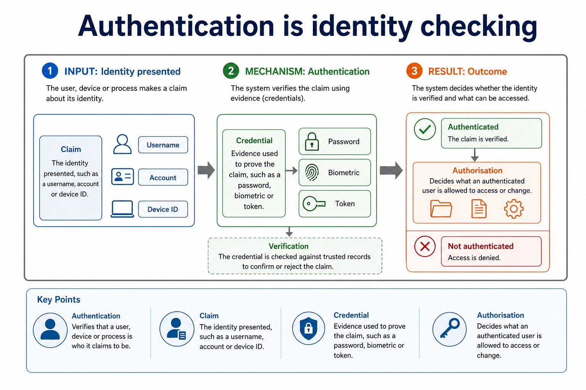

Text transcript

- Asset Data, account, system or service being protected.
- Attack vector The route used by the attacker: access, deception, redirection or flooding.
- Impact Loss of confidentiality, integrity, availability or authenticity.
- Control A safeguard that reduces risk, detects attack or supports recovery.

#### Firewall rules should be specific and ordered

Text transcript

- Allow HTTPS from internal users to internet
- Permit web traffic on port 443.
- Needed for secure website access.
- Block inbound unknown traffic
- Deny unsolicited external connections.
- Reduces unauthorised access attempts.
- Allow admin only from management subnet
- Restrict sensitive admin ports by source.

Precise syllabus wording

Understand restriction of access to data and computer systems as a risk-reduction method.

Describe methods that restrict the risks posed by threats to data and computer systems; evidence must match each control mechanism to the attack route and avoid claims of total prevention.

### Supporting diagram library

#### Malware is malicious software; social engineering manipulates people

Text transcript

- Malware Software created to disrupt, damage, steal data or gain unauthorised access.
- Payload The harmful action, such as deleting files, encrypting data or stealing credentials.
- Propagation How it spreads, such as infected files, networks, removable media or deceptive downloads.
- Social engineering Manipulating a person into revealing information or performing an unsafe action.

#### Ransomware denies access by encrypting or locking data

Text transcript

- Mechanism Encrypts files or locks systems, then demands payment for restoration.
- Goal affected Mainly threatens availability; may also threaten confidentiality if data is stolen.
- Control Offline backups, patching, anti-malware, restricted permissions and user training.
- Common error Paying is not a reliable recovery strategy in an exam answer.

#### Social engineering exploits people rather than code

Text transcript

- Mechanism Uses trust, urgency, authority, curiosity or fear to influence a user.
- Action User may reveal passwords, approve access, install software or transfer data.
- Goal affected Often threatens confidentiality and authenticity through impersonation or credential theft.
- Control User training, verification procedures, MFA, reporting routes and least privilege.

#### Trojan: malicious code disguised as legitimate software

Text transcript

- Mechanism Appears useful or harmless so a user installs or runs it.
- Impact May create a backdoor, steal data, install other malware or change settings.
- Control Download from trusted sources, check permissions, use anti-malware and user education.
- Common error A Trojan does not need to self-replicate to be harmful.

#### Compare by route and result

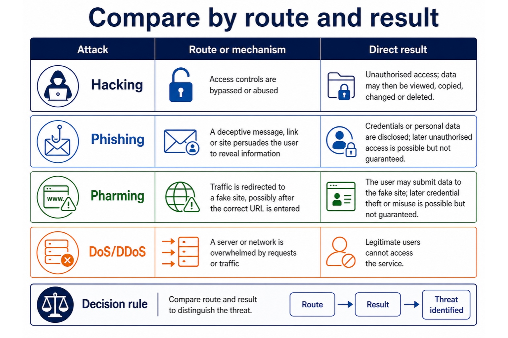

Text transcript

- Route or mechanism
- Direct result
- Access controls are bypassed or abused.
- Unauthorised access; data may then be viewed, copied, changed or deleted.
- Phishing
- A deceptive message, link or site persuades the user to reveal information.
- Credentials or personal data are disclosed; later unauthorised access is possible but not guaranteed.
- Pharming

#### Denial-of-service: making a service unavailable

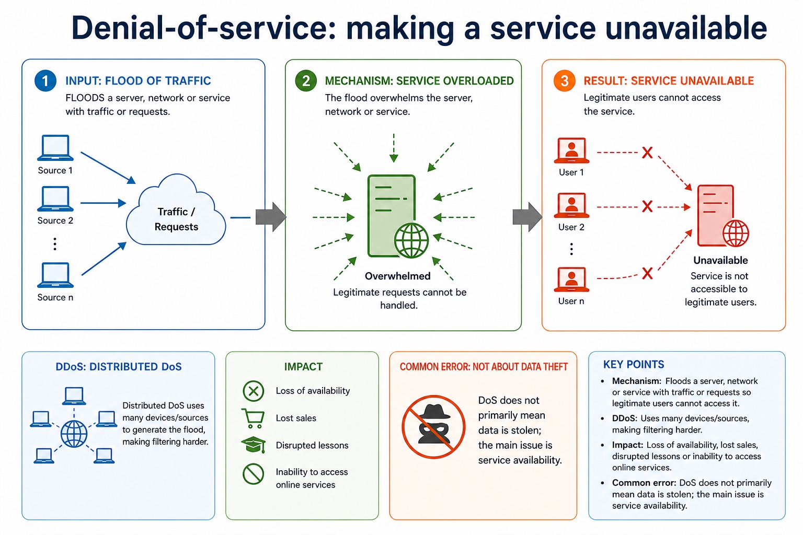

Text transcript

- Mechanism Floods a server, network or service with traffic or requests so legitimate users cannot access it.
- DDoS Distributed DoS uses many devices/sources, making filtering harder.
- Impact Loss of availability, lost sales, disrupted lessons or inability to access online services.
- Common error DoS does not primarily mean data is stolen; the main issue is service availability.

#### Hacking: gaining unauthorised access to a system or data

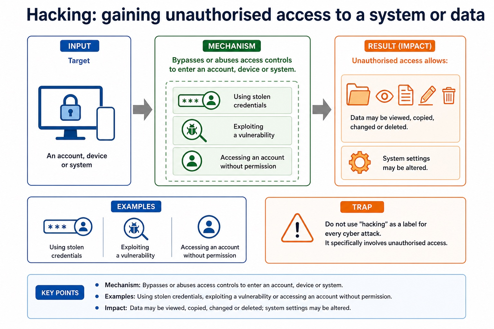

Text transcript

- Mechanism Bypasses or abuses access controls to enter an account, device or system.
- Examples Using stolen credentials, exploiting a vulnerability or accessing an account without permission.
- Impact Data may be viewed, copied, changed or deleted; system settings may be altered.
- Common error Do not use "hacking" as a label for every cyber attack. It specifically involves unauthorised access.

#### Phishing: tricking users into revealing information or visiting a fake page

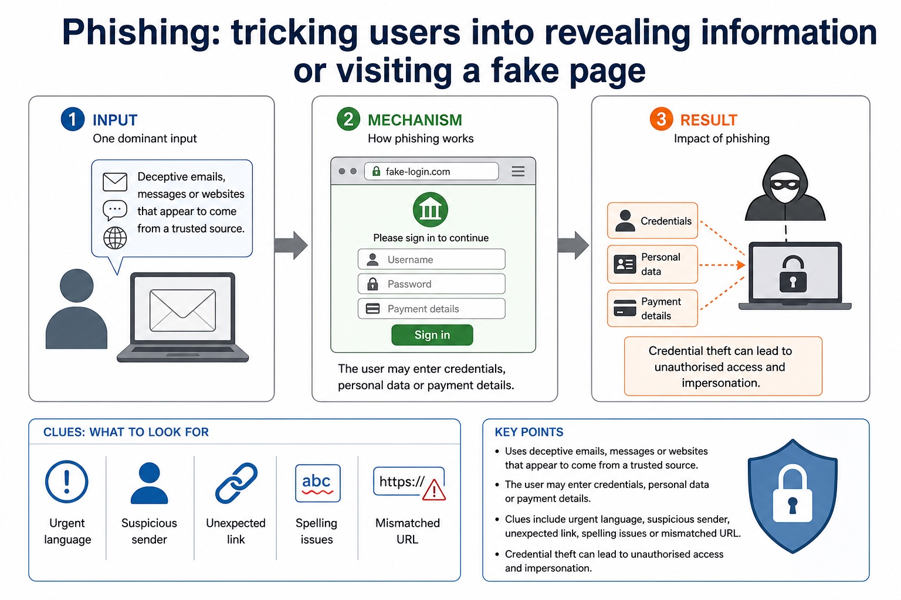

Text transcript

- Mechanism Uses deceptive emails, messages or websites that appear to come from a trusted source.
- User action The user may enter credentials, personal data or payment details.
- Clues Urgent language, suspicious sender, unexpected link, spelling issues or mismatched URL.
- Impact Credential theft can lead to unauthorised access and impersonation.

#### One control can support more than one goal, but not every goal

Text transcript

- Encryption makes data unreadable without the correct key and supports confidentiality.
- Access rights prevent unauthorised viewing and prevent unauthorised alteration; they support confidentiality and integrity but do not detect whether data changed.
- Backups allow recovery after data loss or corruption and support availability.
- Hash/checksum comparison can detect whether data changed and supports integrity, but it does not prevent unauthorised alteration.

#### Access control decides what authenticated users may do

Text transcript

- Access right A permission to perform an action on a resource, such as read or write.
- Resource A file, database table, account, device, folder, application or network service.
- Authorisation The decision to allow or deny an action after identity has been checked.
- Policy The rule set that maps users, groups or roles to permitted actions.

#### Least privilege reduces unnecessary damage

Text transcript

- Definition Give users only the minimum permissions needed to perform their role.
- Confidentiality Users cannot view data that is not needed for their work.
- Integrity Users cannot accidentally or deliberately change data outside their responsibility.
- Availability Fewer users can delete files, disable services or change critical settings.

#### A permission matrix makes access decisions visible

Text transcript

- Student records
- Exam marks
- System settings
- Read own record
- No access
- Read class records
- Write marks for own classes
- Exam officer

#### Permissions need review, not just setup day optimism

Text transcript

- Joiner New user receives permissions based on role, not copied blindly from a friend.
- Mover User changes role; old permissions are removed and new ones are added.
- Leaver Account is disabled or removed when the user leaves.
- Review Regular checks remove excessive, stale or temporary permissions.

#### Common permission types

Text transcript

- Read View or open data without changing it. Protects confidentiality when restricted.
- Write/modify Create or change data. Protects integrity when restricted.
- Delete Remove data or accounts. Often high risk because loss may affect availability.
- Execute/admin Run programs, install software or manage settings. Usually limited to trusted roles.

#### Users, groups and roles keep permissions manageable

Text transcript

- User account Individual identity, useful for accountability and audit trails.
- Group A collection of accounts that share permissions, such as "Students" or "Finance".
- Role A job-based permission set, such as teacher, receptionist, technician or administrator.
- Audit log Records access attempts or changes, helping detect misuse and investigate incidents.

#### Network controls sit between traffic and risk

Text transcript

- Traffic Data packets or requests moving across a network.
- Rule A condition that allows, blocks or logs traffic based on properties.
- Log A record of events, traffic, blocked attempts or user activity.
- Alert A warning generated when traffic or behaviour matches a suspicious pattern.

#### Which control is most relevant?

Text transcript

- Interactive event classifier

#### Firewalls filter traffic using rules

Text transcript

- Purpose Control traffic entering or leaving a network/device.
- Checks Can inspect source/destination IP address, port number, protocol or connection state.
- Decision Allow, deny, reject or log traffic depending on rule match.
- Placement Can protect a network boundary or run on an individual host.

#### Controls reduce risk but have limits

Text transcript

- Firewall limit Allowed traffic can still carry attacks, and rules may be misconfigured.
- Proxy limit Encrypted traffic and unmanaged devices can reduce visibility if not configured properly.
- Monitoring limit Alerts need review and response; too many false positives can be ignored.
- Layering Use with authentication, permissions, patching, encryption and user training.

#### Network monitoring watches for patterns and evidence

Text transcript

- Traffic volume Unusual spikes may suggest DoS, malware activity or misconfiguration.
- Connection attempts Repeated failed access attempts may suggest probing or brute force activity.
- Alerts Monitoring systems can notify staff when thresholds or signatures are triggered.
- Investigation Logs help reconstruct what happened, when, and from where.

#### A proxy acts as an intermediary

Text transcript

- Forward requests Client sends request to proxy; proxy requests the resource from the destination.
- Filtering Can block sites, content types, categories or requests that break policy.
- Caching Can store copies of frequently requested resources to reduce bandwidth and latency.
- Logging Can record user requests for audit, investigation or policy enforcement.

#### Similar-looking controls: choose by mechanism

Text transcript

- Difference
- Common error
- Validation vs verification
- Validation checks rule acceptability; verification checks accurate transfer/copying.
- A valid value can still be the wrong value.
- Authentication vs authorisation
- Authentication confirms identity; authorisation/access rights decide permitted actions.
- Logging in does not mean full access should be granted.

#### Controls have different jobs

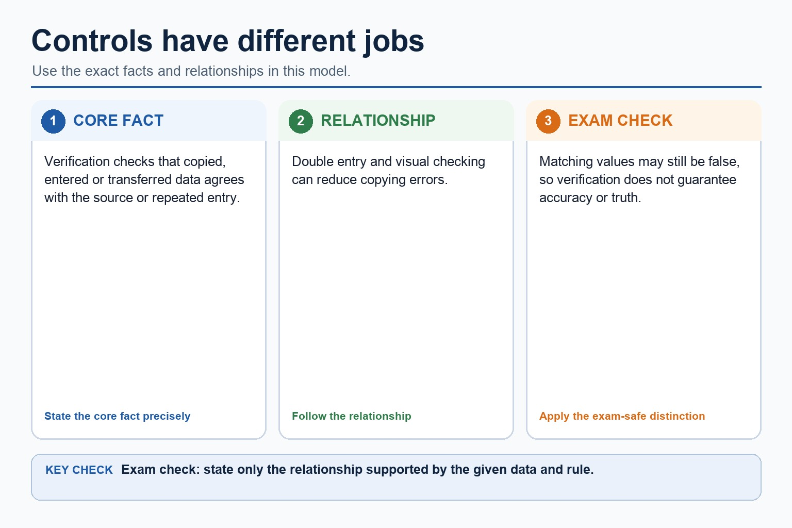

Text transcript

- Verification checks that copied, entered or transferred data agrees with the source or repeated entry.
- Double entry and visual checking can reduce copying errors.
- Matching values may still be false, so verification does not guarantee accuracy or truth.

#### Identify the risk family first

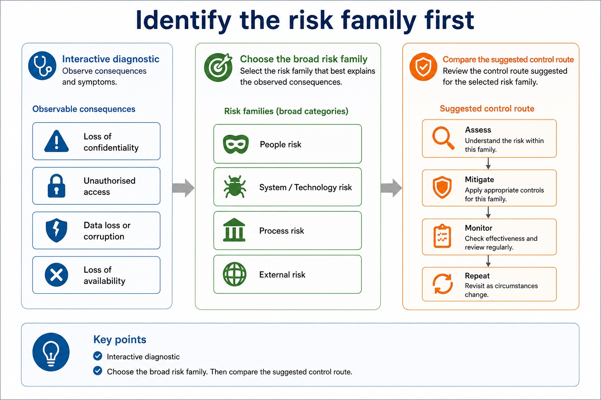

Text transcript

- Interactive diagnostic
- Choose the broad risk family. Then compare the suggested control route.

#### Select the best control for the scenario

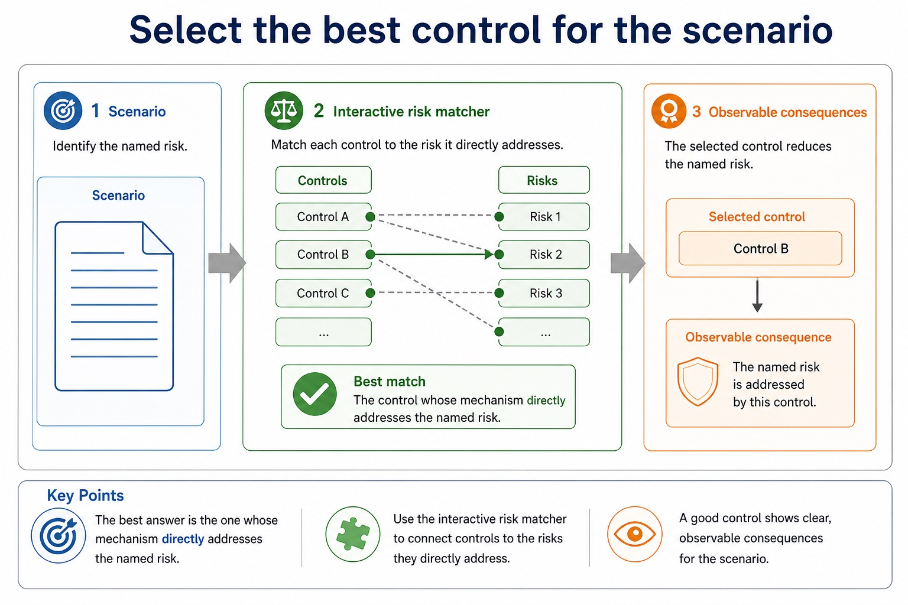

Text transcript

- Interactive risk matcher
- The best answer is the one whose mechanism directly addresses the named risk.
- Scenario

#### Use the four-part answer chain

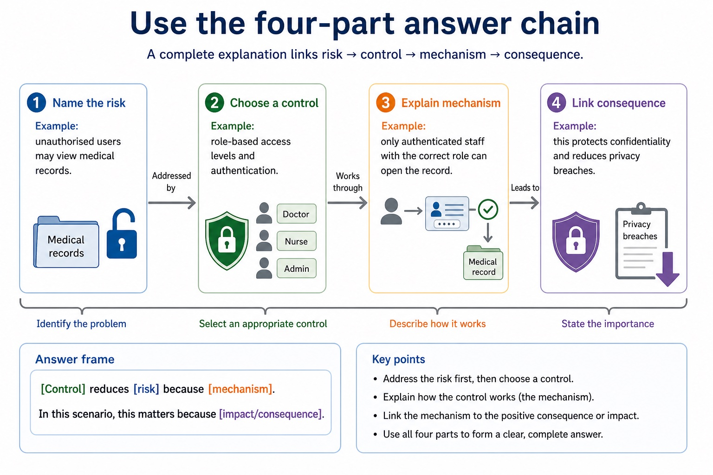

Text transcript

- 1. Name the risk Example: unauthorised users may view medical records.
- 2. Choose a control Example: role-based access levels and authentication.
- 3. Explain mechanism Example: only authenticated staff with the correct role can open the record.
- 4. Link consequence Example: this protects confidentiality and reduces privacy breaches.
- Answer frame:
- [Control] reduces [risk] because [mechanism]. In this scenario, this matters because [impact/consequence].

#### Section 6 review map: risk families and likely controls

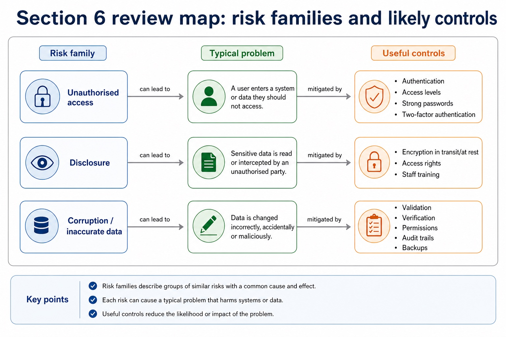

Text transcript

- Risk family
- Typical problem
- Useful controls
- Unauthorised access
- A user enters a system or data they should not access.
- Authentication, access levels, strong passwords, two-factor authentication.
- Disclosure
- Sensitive data is read or intercepted by an unauthorised party.

Open precise terminology and exam facts

- Show understanding of threats posed by networks and the internet, including malware (virus and spyware), hackers, phishing and pharming; all five named threats require direct evidence.
- Describe methods that restrict the risks posed by threats to data and computer systems; evidence must match each control mechanism to the attack route and avoid claims of total prevention.
- A virus is malware that attaches to a host file or program and spreads when the infected host is run or shared. Spyware secretly monitors activity or collects data, such as keystrokes, credentials or browsing behaviour. These threats can damage the security of both data and the computer system.
- Anti-virus software scans files, memory and activity for virus signatures or suspicious behaviour, then blocks, quarantines or removes detected malicious code. Anti-spyware performs corresponding detection and removal for spyware; the categories may be combined in one security product, but their syllabus roles must still be stated accurately.
- Anti-virus and anti-spyware definitions and detection rules must be updated because new threats appear. Both measures reduce risk but cannot guarantee detection of every new, modified or concealed threat.
- Each security measure has a distinct mechanism: a user account identifies a user; a password authenticates knowledge; a digital signature supports integrity and origin checks; a biometric compares a captured feature; a firewall filters traffic; anti-virus and anti-spyware detect known malicious software; encryption protects readable data. The threats include a virus, spyware, a hacker, phishing and pharming; each threat must be matched to a control whose mechanism reduces that risk.
- The required threats are malware (virus and spyware), hackers, phishing and pharming. A hacker gains unauthorised access to a computer system or data. Phishing uses a deceptive message, link or site to persuade a user to disclose information. Pharming redirects traffic to a fake website, possibly even after the user enters the correct address.
- Methods restrict risk only when their mechanism matches the threat: updated anti-virus and anti-spyware can detect known malware; user training and independent contact checks reduce phishing; secure DNS, certificate/HTTPS checks and patched software reduce pharming risk; strong authentication, access rights, patching, firewalls and monitoring reduce unauthorised access by hackers.
- A control reduces likelihood or impact; it rarely makes an attack impossible. Layered controls are needed because people, software, credentials and network traffic provide different attack routes.
- Access rights restrict authorised actions on resources. Read permission controls viewing; write/modify controls alteration; delete controls removal; execute or administrative rights control running software or changing system settings. Least privilege grants only the permissions needed for a role and removes temporary rights when no longer required.
- Encryption transforms plaintext into ciphertext using an algorithm and key. Without the correct decryption key, intercepted or stolen ciphertext should not reveal readable content. Encryption therefore protects confidentiality, while access rights can protect confidentiality and integrity by preventing unauthorised viewing or alteration.
- The methods do different jobs: encryption does not decide which logged-in user may edit a record, and access rights do not make a stolen unencrypted copy unreadable. Neither method guarantees availability, data truth or protection after an authorised account is misused.

### Worked example

1. Protect an online payroll service
2. Staff receive a phishing email while a hacker probes the server and pharming redirects one user towards a fake site.
3. Training and an independent sender check reduce phishing risk; multi-factor authentication reduces the value of a stolen password; a firewall filters unwanted traffic; access rights limit what an authenticated account may change;…

Beyond syllabus / 延伸知识（不要求背诵）: real security uses defence in depth, combining controls so that one failed control does not expose the whole system.
## 3. Practice by question type

### Question 1 - foundation - describe - 6 marks

For each of virus, spyware, hacking, phishing and pharming, describe the threat route and one matching method that restricts its risk.

**Answer:** virus route plus anti-virus mechanism; spyware route plus anti-spyware mechanism; hacker/unauthorised-access route plus a matching access/network control; phishing/deception route plus training or independent verification; pharming/redirection route plus secure DNS/certificate/HTTPS or patched-software control; states that controls reduce rather than eliminate risk

**Marking guidance:** Do not define phishing and pharming identically or award a control that is unrelated to the stated attack route.

**Common error:** For the command word describe, perform that exact action; do not replace it with an unrelated fact.

### Question 2 - application - apply - 2 marks

What is the syllabus meaning of a hacker threat?

**Answer:** A person gaining or attempting unauthorised access to a computer system or data.

**Marking guidance:** Award one mark for each distinct, technically accurate point or method step.

**Common error:** Do not repeat the same point in different words; each mark needs a separate idea or method step.

### Question 3 - transfer - explain - 6 marks

Explain how access rights and encryption protect a payroll file, and state one limitation of each method.

**Answer:** access rights restrict viewing to users/roles with read permission; access rights restrict modification/deletion to permitted users/roles; encryption converts plaintext to ciphertext using a key; without the correct key the stolen/intercepted data is not readable; access-rights limitation developed; encryption limitation developed

**Marking guidance:** Do not claim that access rights detect changes, that encryption guarantees integrity, or that either method replaces the other.

**Common error:** Do not copy the worked example unchanged; transfer the method and check it against the new context.

### Related past-paper indexes

| Reference | Marks | Command word | Question type |
|---|---:|---|---|
| 9618/11/S/25 Q7(b) | 5 | describe | explain |
| 9618/11/S/25 Q7(a) | 3 | describe | explain |
| 9618/11/S/25 Q7(c) | 3 | describe | explain |
| 9618/11/W/25 Q8(b) | 3 | explain | explain |

These are indexes only. Cambridge question and mark-scheme wording is not reproduced.

## 4. Summary and exam reminders

### Summary

- Define internet threats, malware and access restriction with the exact technical vocabulary expected by the syllabus.
- Use the lesson method on a fresh context and show the intermediate decision, representation or calculation.
- Match the shape of the answer to the command word and the available marks.
- Check the final answer against the scenario instead of repeating a memorised sentence.

### Common error to correct

Students often propose encryption for every problem. Correction: encryption protects confidentiality but does not fix poor permissions, phishing or missing backups.

### Exam technique

- Follow the command word: state gives a fact; explain links a cause to a consequence; compare covers both sides.
- Match the number of independent points or method steps to the available marks.
- For internet threats, malware and access restriction, use the exact technical term before applying it to the scenario.
