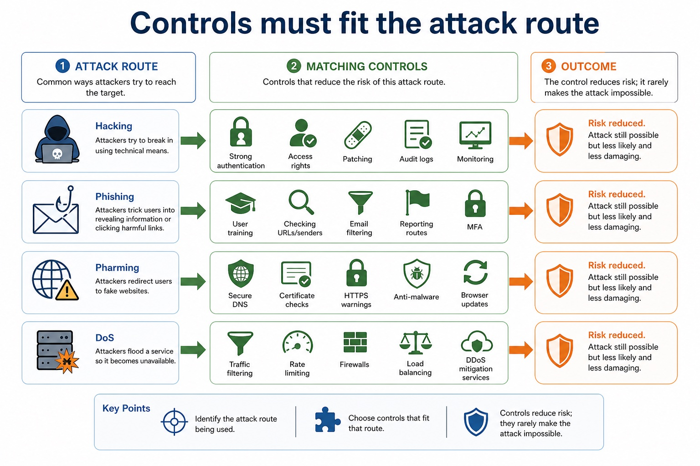

# Lesson 032: Internet threats, malware and access restriction

**Course:** Cambridge International AS Level Computer Science 9618, 2027-2029 Version 2 
**Paper:** Paper 1 
**Syllabus:** Section 6: Security, privacy and data integrity 
**Syllabus requirements:** S6.04, S6.05 
**Pacing:** Flexible. This lesson is deliberately over-complete; select a quick, full or deep route for the learners in front of you.

## Teaching-depth menu

- **Quick route:** Use the diagnostic, learning objectives, first worked example and foundation question. Stop once the learner can explain the central distinction accurately.
- **Full route:** Teach every core explanation point, the worked example and all lesson questions. Use the visual only when it adds a different representation.
- **Deep route:** Add the prerequisite refresher, ask learners to connect the concept checklist, discuss the labelled extension and complete a transfer question without a model answer.

## 1. Prerequisite knowledge and quick diagnostic

Recall S6.02 before starting this lesson.

Ask the learner to give one accurate definition or method step before continuing. If they cannot, briefly revisit the named prerequisite rather than repeating the whole previous lesson.

### Optional prerequisite refresher

- Show appreciation of the need for both security of data and security of the computer system; evidence must explain why protecting one layer does not replace the other.
- Explain the need for data and computer-system security.

## 2. Knowledge explanation

### Learning objectives

- Understand virus, spyware, hackers, phishing and pharming threats.
- Understand restriction of access to data and computer systems as a risk-reduction method.

### Concept checklist for teacher choice

- virus
- spyware
- hacker / hackers
- phishing
- pharming
- threats
- restrict / restricts / restriction
- access
- risk
- threat

### Detailed explanation

- Show understanding of threats posed by networks and the internet, including malware (virus and spyware), hackers, phishing and pharming; all five named threats require direct evidence.
- Describe methods that restrict the risks posed by threats to data and computer systems; evidence must match each control mechanism to the attack route and avoid claims of total prevention.
- A virus is malware that attaches to a host file or program and spreads when the infected host is run or shared. Spyware secretly monitors activity or collects data, such as keystrokes, credentials or browsing behaviour. These threats can damage the security of both data and the computer system.
- Anti-virus software scans files, memory and activity for virus signatures or suspicious behaviour, then blocks, quarantines or removes detected malicious code. Anti-spyware performs corresponding detection and removal for spyware; the categories may be combined in one security product, but their syllabus roles must still be stated accurately.
- Anti-virus and anti-spyware definitions and detection rules must be updated because new threats appear. Both measures reduce risk but cannot guarantee detection of every new, modified or concealed threat.
- Each security measure has a distinct mechanism: a user account identifies a user; a password authenticates knowledge; a digital signature supports integrity and origin checks; a biometric compares a captured feature; a firewall filters traffic; anti-virus and anti-spyware detect known malicious software; encryption protects readable data. The threats include a virus, spyware, a hacker, phishing and pharming; each threat must be matched to a control whose mechanism reduces that risk.
- The required threats are malware (virus and spyware), hackers, phishing and pharming. A hacker gains unauthorised access to a computer system or data. Phishing uses a deceptive message, link or site to persuade a user to disclose information. Pharming redirects traffic to a fake website, possibly even after the user enters the correct address.
- Methods restrict risk only when their mechanism matches the threat: updated anti-virus and anti-spyware can detect known malware; user training and independent contact checks reduce phishing; secure DNS, certificate/HTTPS checks and patched software reduce pharming risk; strong authentication, access rights, patching, firewalls and monitoring reduce unauthorised access by hackers.
- A control reduces likelihood or impact; it rarely makes an attack impossible. Layered controls are needed because people, software, credentials and network traffic provide different attack routes.
- Access rights restrict authorised actions on resources. Read permission controls viewing; write/modify controls alteration; delete controls removal; execute or administrative rights control running software or changing system settings. Least privilege grants only the permissions needed for a role and removes temporary rights when no longer required.
- Encryption transforms plaintext into ciphertext using an algorithm and key. Without the correct decryption key, intercepted or stolen ciphertext should not reveal readable content. Encryption therefore protects confidentiality, while access rights can protect confidentiality and integrity by preventing unauthorised viewing or alteration.
- The methods do different jobs: encryption does not decide which logged-in user may edit a record, and access rights do not make a stolen unencrypted copy unreadable. Neither method guarantees availability, data truth or protection after an authorised account is misused.

### Worked example

Protect an online payroll service: Staff receive a phishing email while a hacker probes the server and pharming redirects one user towards a fake site. Training and an independent sender check reduce phishing risk; multi-factor authentication reduces the value of a stolen password; a firewall filters unwanted traffic; access rights limit what an authenticated account may change; updated anti-virus and anti-spyware detect known virus or spyware signatures; secure DNS and certificate warnings reduce pharming risk.

Beyond syllabus / 延伸知识（不要求背诵）: real security uses defence in depth, combining controls so that one failed control does not expose the whole system.

### Retained visual explanation

_Controls must fit the attack route. The image and mobile text alternative come from one maintained fact source._

## 3. Practice by question type

### Question 1 - foundation - describe - 6 marks

For each of virus, spyware, hacking, phishing and pharming, describe the threat route and one matching method that restricts its risk.

**Answer:** virus route plus anti-virus mechanism; spyware route plus anti-spyware mechanism; hacker/unauthorised-access route plus a matching access/network control; phishing/deception route plus training or independent verification; pharming/redirection route plus secure DNS/certificate/HTTPS or patched-software control; states that controls reduce rather than eliminate risk

**Marking guidance:** Do not define phishing and pharming identically or award a control that is unrelated to the stated attack route.

**Common error:** For the command word describe, perform that exact action; do not replace it with an unrelated fact.

### Question 2 - application - apply - 2 marks

What is the syllabus meaning of a hacker threat?

**Answer:** A person gaining or attempting unauthorised access to a computer system or data.

**Marking guidance:** Award one mark for each distinct, technically accurate point or method step.

**Common error:** Do not repeat the same point in different words; each mark needs a separate idea or method step.

### Question 3 - transfer - explain - 6 marks

Explain how access rights and encryption protect a payroll file, and state one limitation of each method.

**Answer:** access rights restrict viewing to users/roles with read permission; access rights restrict modification/deletion to permitted users/roles; encryption converts plaintext to ciphertext using a key; without the correct key the stolen/intercepted data is not readable; access-rights limitation developed; encryption limitation developed

**Marking guidance:** Do not claim that access rights detect changes, that encryption guarantees integrity, or that either method replaces the other.

**Common error:** Do not copy the worked example unchanged; transfer the method and check it against the new context.

### Related past-paper indexes

| Reference | Marks | Command word | Question type |
|---|---:|---|---|
| 9618/11/S/25 Q7(b) | 5 | describe | explain |
| 9618/11/S/25 Q7(a) | 3 | describe | explain |
| 9618/11/S/25 Q7(c) | 3 | describe | explain |
| 9618/11/W/25 Q8(b) | 3 | explain | explain |

These are indexes only. Cambridge question and mark-scheme wording is not reproduced.

## 4. Summary and exam reminders

### Summary

- Define internet threats, malware and access restriction with the exact technical vocabulary expected by the syllabus.
- Use the lesson method on a fresh context and show the intermediate decision, representation or calculation.
- Match the shape of the answer to the command word and the available marks.
- Check the final answer against the scenario instead of repeating a memorised sentence.

### Common error to correct

Students often propose encryption for every problem. Correction: encryption protects confidentiality but does not fix poor permissions, phishing or missing backups.

### Exam technique

- Follow the command word: state gives a fact; explain links a cause to a consequence; compare covers both sides.
- Match the number of independent points or method steps to the available marks.
- For internet threats, malware and access restriction, use the exact technical term before applying it to the scenario.
