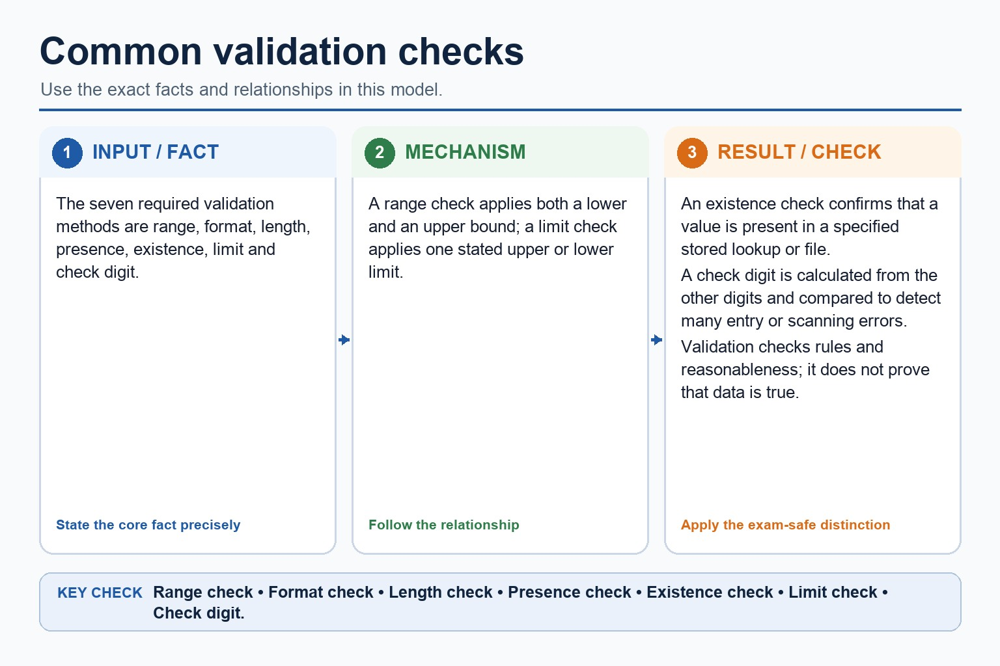

# Lesson 034: Validation, verification, parity and checksums

**Course:** Cambridge International AS Level Computer Science 9618, syllabus for examination in 2027-2029 
**Paper:** Paper 1 
**Syllabus:** Section 6: Security, privacy and data integrity 
**Syllabus requirements:** S6.07, S6.08 
**Pacing:** Flexible. Select a quick, full or deep route for the learners in front of you.

## Teaching-depth menu

- **Quick route:** Use the diagnostic, learning objectives, first worked example and foundation question. Stop once the learner can explain the central distinction accurately.
- **Full route:** Teach every knowledge-point material set, the worked method and all lesson questions.
- **Deep route:** Add the prerequisite refresher, ask learners to connect the concept checklist, discuss the labelled extension and complete a transfer question without a model answer.

## 1. Prerequisite knowledge and quick diagnostic

Recall S6.01 before starting this lesson.

Ask the learner to give one accurate definition or method step before continuing. If they cannot, briefly revisit the named prerequisite rather than repeating the whole previous lesson.

### Optional prerequisite refresher

- Distinguish data security, data privacy and data integrity as separate concepts; evidence must not treat confidentiality, lawful/appropriate use and correctness/consistency as interchangeable.
- Distinguish data security, privacy and integrity.

## 2. Knowledge explanation

### 1. How data validation and data verification help protect the integrity of data; describe and use methods… (S6.07)

**Atomic learning targets**

- **S6.07.A01:** range check
- **S6.07.A02:** format check
- **S6.07.A03:** length check
- **S6.07.A04:** presence check
- **S6.07.A05:** existence check
- **S6.07.A06:** limit check
- **S6.07.A07:** check digit
- **S6.07.A08:** verification
- **S6.07.A09:** integrity / data integrity

**Core explanation**

- Validation checks whether data is reasonable and follows rules: range, format, length, presence, existence, limit and check digit. It cannot prove truth. A range check applies both a lower and an upper bound, such as 0 to 75. A limit check applies one stated upper or lower limit, such as file size no greater than 10 MiB or temperature at least -20 degrees Celsius.
- A format check tests a required pattern; a length check tests the number of characters; a presence check rejects a blank required field; an existence check confirms a value is stored in a specified lookup file; and a check digit is calculated from the other digits and compared. Verification checks whether data was copied accurately, using visual checking or double entry.
- Data validation and data verification help protect data integrity by detecting or preventing many input, copying and transfer errors before inaccurate or corrupted data are accepted. They reduce these risks but do not prove that the original source is true or replace access control and backup.
- Describe and use verification during data entry (visual check and double entry) and during data transfer (parity check on a byte, block parity and checksum).
- Validation methods include range, format, length, presence, existence and limit checks, plus a check digit.
- The seven required validation methods are range, format, length, presence, existence, limit and check digit.

**Mechanism or method**

1. **Establish the exact components or states** — Validation checks whether data is reasonable and follows rules: range, format, length, presence, existence, limit and check digit.
2. **Trace the relationship or change** — A range check applies both a lower and an upper bound, such as 0 to 75.
3. **Use the explanation in a concrete case** — A limit check applies one stated upper or lower limit, such as file size no greater than 10 MiB or temperature at least -20 degrees Celsius.

#### Worked example: How data validation and data verification help protect the integrity of data; describe and use methods: complete worked route

1. **Establish the exact components or states**

Validation checks whether data is reasonable and follows rules: range, format, length, presence, existence, limit and check digit.

2. **Trace the relationship or change**

A range check applies both a lower and an upper bound, such as 0 to 75.

3. **Use the explanation in a concrete case**

A limit check applies one stated upper or lower limit, such as file size no greater than 10 MiB or temperature at least -20 degrees Celsius.

4. **Complete example**

Validate input, then verify a transferred record: A 10 MiB maximum uses an upper limit check because it has one permitted limit; a mark from 0 to 75 uses a range check because it has both lower and upper bounds. A product code uses presence, length, format, existence and check-digit rules.

**Misconceptions to correct**

- Students often propose encryption for every problem. Correction: encryption protects confidentiality but does not fix poor permissions, phishing or missing backups.

#### Mastery check (MC-L034-S6.07)

Describe the following targets in one connected answer, using a concrete example for each: range check; format check; length check; presence check; existence check; limit check; check digit; verification; integrity / data integrity.

Answer criteria

- Validation checks whether data is reasonable and follows rules: range, format, length, presence, existence, limit and check digit. It cannot prove truth. A range check applies both a lower and an upper bound, such as 0 to 75. A limit check applies one stated upper or lower limit, such as file size no greater than 10 MiB or temperature at least -20 degrees Celsius.
- A format check tests a required pattern; a length check tests the number of characters; a presence check rejects a blank required field; an existence check confirms a value is stored in a specified lookup file; and a check digit is calculated from the other digits and compared. Verification checks whether data was copied accurately, using visual checking or double entry.
- Data validation and data verification help protect data integrity by detecting or preventing many input, copying and transfer errors before inaccurate or corrupted data are accepted. They reduce these risks but do not prove that the original source is true or replace access control and backup.
- Describe and use verification during data entry (visual check and double entry) and during data transfer (parity check on a byte, block parity and checksum).
- Validation methods include range, format, length, presence, existence and limit checks, plus a check digit.
- The seven required validation methods are range, format, length, presence, existence, limit and check digit.

**Supplementary concept map**

- **range check:** A range check applies both a lower and…
- **format check:** A format check tests a required pattern
- **length check:** A length check tests the number of characters
- **presence check:** A presence check rejects a blank required field
- **existence check:** An existence check confirms a value is stored…
- **limit check:** Validation methods include range, format, length, presence, existence…

**Supplementary three-step recap**

1. **Identify what needs protection** — Validation methods include range, format, length, presence, existence and limit checks, plus a check digit.
2. **Trace the attack or error route** — The seven required validation methods are range, format, length, presence, existence, limit and check digit.
3. **Match a safeguard and limitation** — Range, format, length, presence, existence, limit and check digit.

**Common validation checks:** The seven required validation methods are range, format, length, presence, existence, limit and check digit. A range check applies both a lower and an upper bound; a limit check applies one stated upper or…

#### Common validation checks

Text transcript

- The seven required validation methods are range, format, length, presence, existence, limit and check digit.
- A range check applies both a lower and an upper bound; a limit check applies one stated upper or lower limit.
- An existence check confirms that a value is present in a specified stored lookup or file.
- A check digit is calculated from the other digits and compared to detect many entry or scanning errors.
- Validation checks rules and reasonableness; it does not prove that data is true.

Precise syllabus wording

Describe how data validation and data verification help protect the integrity of data; describe and use methods of data validation.

Validation and verification reduce input, copying and transfer errors and therefore help protect data integrity. Validation methods include range, format, length, presence, existence and limit checks, plus a check digit.

### 2. Verification: visual and double entry; parity byte/block and checksum (S6.08)

**Atomic learning targets**

- **S6.08.A01:** verification
- **S6.08.A02:** visual check / visual checking
- **S6.08.A03:** double entry
- **S6.08.A04:** parity check
- **S6.08.A05:** byte
- **S6.08.A06:** block parity
- **S6.08.A07:** checksum

**Core explanation**

- A format check tests a required pattern; a length check tests the number of characters; a presence check rejects a blank required field; an existence check confirms a value is stored in a specified lookup file; and a check digit is calculated from the other digits and compared. Verification checks whether data was copied accurately, using visual checking or double entry.
- A parity check compares the expected odd or even parity of a byte; block parity adds row and column evidence.
- Error detection includes parity: a parity byte checks one group and block parity adds row/column checks; a checksum is calculated from a data block and compared after transmission. These detect many errors but do not correct every error.
- Data validation and data verification help protect data integrity by detecting or preventing many input, copying and transfer errors before inaccurate or corrupted data are accepted. They reduce these risks but do not prove that the original source is true or replace access control and backup.
- Validation and verification reduce input, copying and transfer errors and therefore help protect data integrity. Validation methods include range, format, length, presence, existence and limit checks, plus a check digit.
- Verification checks whether data was copied accurately, using visual checking or double entry.

**Mechanism or method**

1. **Identify the relevant condition or input** — A format check tests a required pattern;
2. **Trace how the process works** — a length check tests the number of characters;
3. **Connect the mechanism to its result** — a presence check rejects a blank required field;

#### Worked example: Verification: visual and double entry; parity byte/block and checksum: complete worked route

1. **Identify the relevant condition or input**

A format check tests a required pattern;

2. **Trace how the process works**

a length check tests the number of characters;

3. **Connect the mechanism to its result**

a presence check rejects a blank required field;

4. **Complete example**

During entry, visual checking or double entry compares values. During transfer, byte parity detects many single-bit errors, block parity adds row/column evidence and a checksum is recalculated from the received data block.

**Misconceptions to correct**

- Students often propose encryption for every problem. Correction: encryption protects confidentiality but does not fix poor permissions, phishing or missing backups.

#### Mastery check (MC-L034-S6.08)

Explain the following targets in one connected answer, using a concrete example for each: verification; visual check / visual checking; double entry; parity check; byte; block parity; checksum.

Answer criteria

- A format check tests a required pattern; a length check tests the number of characters; a presence check rejects a blank required field; an existence check confirms a value is stored in a specified lookup file; and a check digit is calculated from the other digits and compared. Verification checks whether data was copied accurately, using visual checking or double entry.
- A parity check compares the expected odd or even parity of a byte; block parity adds row and column evidence.
- Error detection includes parity: a parity byte checks one group and block parity adds row/column checks; a checksum is calculated from a data block and compared after transmission. These detect many errors but do not correct every error.
- Data validation and data verification help protect data integrity by detecting or preventing many input, copying and transfer errors before inaccurate or corrupted data are accepted. They reduce these risks but do not prove that the original source is true or replace access control and backup.
- Validation and verification reduce input, copying and transfer errors and therefore help protect data integrity. Validation methods include range, format, length, presence, existence and limit checks, plus a check digit.
- Verification checks whether data was copied accurately, using visual checking or double entry.

**Supplementary concept map**

- **visual check:** And use verification during data entry (visual check…
- **parity check:** A parity check compares the expected odd or…
- **double entry:** Verification checks whether data was copied accurately, using…
- **block parity:** A parity byte checks one group and block…
- **checksum:** Parity byte/block and checksum.
- **verification:** Validation and verification reduce input, copying and transfer…

**Supplementary three-step recap**

1. **Name the exact concept** — And use verification during data entry (visual check and double entry) and during data transfer (parity check on…
2. **Explain how its parts connect** — Verification checks whether data was copied accurately, using visual checking or double entry.
3. **Use it in a concrete context** — Parity byte/block and checksum.

**Verification checks accuracy against the source:** During data entry, visual checking compares entered data with its source and double entry compares two independently entered values. During transfer, a parity check on a byte tests the agreed odd or even parity;…

#### Verification checks accuracy against the source

Text transcript

- During data entry, visual checking compares entered data with its source and double entry compares two independently entered values.
- During transfer, a parity check on a byte tests the agreed odd or even parity; block parity applies parity across rows and columns of a data block.
- For a checksum, the sender calculates and transmits a value for the data block; the receiver recalculates and compares it.
- These methods detect many errors but do not prove truth or automatically correct every error.
- A validation check digit belongs to an identifier; a transfer checksum belongs to a transmitted data block.

Precise syllabus wording

Understand verification: visual and double entry; parity byte/block and checksum.

Describe and use verification during data entry (visual check and double entry) and during data transfer (parity check on a byte, block parity and checksum).

### Lesson technical reference

- Validation and verification reduce input, copying and transfer errors and therefore help protect data integrity. Validation methods include range, format, length, presence, existence and limit checks, plus a check digit.
- Describe and use verification during data entry (visual check and double entry) and during data transfer (parity check on a byte, block parity and checksum).
- Validation checks whether data is reasonable and follows rules: range, format, length, presence, existence, limit and check digit. It cannot prove truth. A range check applies both a lower and an upper bound, such as 0 to 75. A limit check applies one stated upper or lower limit, such as file size no greater than 10 MiB or temperature at least -20 degrees Celsius.
- A format check tests a required pattern; a length check tests the number of characters; a presence check rejects a blank required field; an existence check confirms a value is stored in a specified lookup file; and a check digit is calculated from the other digits and compared. Verification checks whether data was copied accurately, using visual checking or double entry.
- Error detection includes parity: a parity byte checks one group and block parity adds row/column checks; a checksum is calculated from a data block and compared after transmission. These detect many errors but do not correct every error.
- A parity check compares the expected odd or even parity of a byte; block parity adds row and column evidence.
- Data validation and data verification help protect data integrity by detecting or preventing many input, copying and transfer errors before inaccurate or corrupted data are accepted. They reduce these risks but do not prove that the original source is true or replace access control and backup.

Beyond syllabus / 延伸知识（不要求背诵）: real security uses defence in depth, combining controls so that one failed control does not expose the whole system.
## 3. Practice by question type

### Question 1 - foundation - explain - 2 marks

How do validation and verification help protect data integrity?

**Answer:** They detect or prevent many input, copying and transfer errors, reducing the chance that inaccurate or corrupted data are accepted; they do not prove that the source is true.

**Marking guidance:** Award one mark for each distinct, technically accurate point or method step.

**Common error:** For the command word explain, perform that exact action; do not replace it with an unrelated fact.

### Question 2 - application - draw - 2 marks

Draw lines to match each rule to its validation check: AA1234 follows two letters then four digits; a code has exactly six characters; a required name is not blank; a barcode includes a digit calculated from the other digits.

**Answer:** Format check; length check; presence check; check digit, respectively.

**Marking guidance:** Award one mark for each distinct, technically accurate point or method step.

**Common error:** Do not repeat the same point in different words; each mark needs a separate idea or method step.

### Question 3 - transfer - explain - 2 marks

How does double-entry verification work?

**Answer:** Data is entered twice and the two entries are compared.

**Marking guidance:** Award one mark for each distinct, technically accurate point or method step.

**Common error:** Do not copy the worked example unchanged; transfer the method and check it against the new context.

### Related past-paper indexes

| Reference | Marks | Command word | Question type |
|---|---:|---|---|
| 9618/12/W/25 Q1 | 2 | draw | diagram |
| 9618/11/S/24 Q5(b) | 5 | complete | recall |
| 9618/11/S/24 Q5(ii) | 4 | complete | recall |
| 9618/11/S/24 Q5(i) | 3 | complete | recall |

These are indexes only. Cambridge question and mark-scheme wording is not reproduced.

## 4. Summary and exam reminders

### Summary

- S6.07: explain range check, format check, length check, presence check, existence check, limit check, check digit, verification, integrity / data integrity.
- S6.07 method: Establish the exact components or states → Trace the relationship or change → Use the explanation in a concrete case.
- S6.08: explain verification, visual check / visual checking, double entry, parity check, byte, block parity, checksum.
- S6.08 method: Identify the relevant condition or input → Trace how the process works → Connect the mechanism to its result.
- Correction to remember: Students often propose encryption for every problem. Correction: encryption protects confidentiality but does not fix poor permissions, phishing or missing backups.

### Common error to correct

Students often propose encryption for every problem. Correction: encryption protects confidentiality but does not fix poor permissions, phishing or missing backups.

### Exam technique

- Follow the command word: state gives a fact; explain links a cause to a consequence; compare covers both sides.
- Match the number of independent points or method steps to the available marks.
- For validation, verification, parity and checksums, use the exact technical term before applying it to the scenario.
